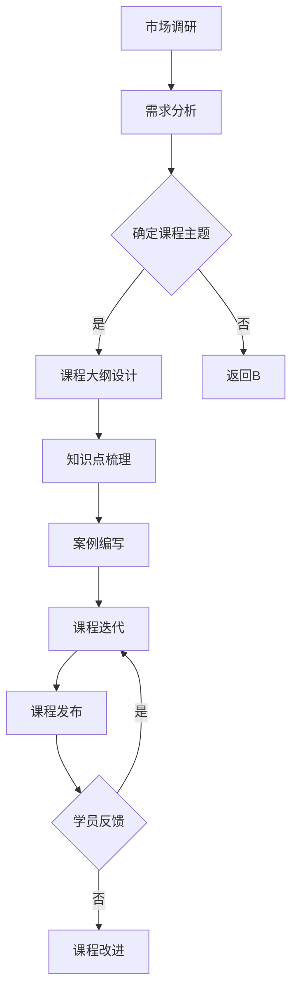

                 

关键词：（知识付费，程序员，线下课程，教学设计，课程开发，营销策略）

> 摘要：本文旨在探讨程序员如何利用自身的专业技能，通过知识付费的方式打造线下课程，实现个人品牌的建立和价值的最大化。文章将分析当前知识付费市场的现状，阐述课程开发的核心要素，提供实用的营销策略，并对未来的发展方向提出展望。

## 1. 背景介绍

随着互联网技术的发展，知识付费逐渐成为了一种新兴的商业模式。无论是线上还是线下的课程，都迎来了前所未有的发展机遇。对于程序员而言，知识付费不仅是一种获取额外收入的途径，更是展示自身价值、建立个人品牌的平台。线下课程因其互动性强、学习氛围浓厚等特点，正逐渐受到广大程序员的青睐。

然而，如何打造一款成功的线下课程，实现知识付费的目标，这不仅是程序员面临的一大挑战，也是市场需求所驱动的必然趋势。本文将结合实践经验，深入探讨程序员知识付费的可行路径。

### 1.1 市场现状

近年来，知识付费市场呈现出爆发式增长。根据相关数据显示，2020年我国知识付费市场规模已经超过3000亿元，预计到2025年将达到8000亿元。尤其在编程领域，程序员通过知识付费实现了个人价值的快速提升，其中不乏年收入数十万元的佼佼者。

### 1.2 程序员的优势

1. **专业技能**：程序员拥有扎实的编程技能，能够为学员提供高质量的教学内容。
2. **教学经验**：许多程序员有着丰富的教学经验，善于将复杂的技术知识以通俗易懂的方式传授。
3. **市场需求**：随着互联网和人工智能的快速发展，对编程人才的需求日益增加，这为程序员的知识付费提供了广阔的市场空间。

## 2. 核心概念与联系

### 2.1 课程内容规划

课程内容是线下课程的核心，必须紧密结合市场需求和学员的实际需求。以下是课程内容规划的Mermaid流程图：



### 2.2 教学方法选择

教学方法是影响学员学习效果的关键因素。以下是一些常见的教学方法及其适用场景：

1. **讲授法**：适用于理论性较强的课程，如编程基础。
2. **案例教学**：通过实际案例帮助学员理解知识点，适用于项目实战类课程。
3. **互动式教学**：通过提问、讨论等形式提高学员的参与度，适用于编程语言学习。
4. **任务驱动法**：通过设定任务引导学员学习，适用于编程技能提升。

### 2.3 营销策略制定

营销策略是吸引学员的关键，以下是一些有效的营销策略：

1. **社交媒体宣传**：通过微博、公众号等平台发布课程信息，吸引潜在学员。
2. **口碑传播**：通过学员的推荐和评价提高课程知名度。
3. **合作推广**：与行业内的其他机构或个人合作，共同推广课程。
4. **优惠活动**：通过限时优惠、团购等形式吸引学员报名。

## 3. 核心算法原理 & 具体操作步骤

### 3.1 算法原理概述

知识付费的算法原理主要涉及课程内容的价值评估、学员学习效果评估和营销策略优化。

- **课程内容价值评估**：通过市场调研、学员反馈等手段，评估课程内容的市场需求和学员满意度。
- **学员学习效果评估**：通过课后练习、项目实战等形式，评估学员的学习效果。
- **营销策略优化**：根据学员反馈和市场动态，调整营销策略，提高课程转化率。

### 3.2 算法步骤详解

1. **课程内容价值评估**：

   - 收集市场数据，分析行业趋势和学员需求。
   - 调研竞品课程，了解市场定价策略。
   - 结合自身优势，确定课程特色和价值。

2. **学员学习效果评估**：

   - 设计课后练习和项目实战，评估学员学习效果。
   - 收集学员反馈，了解课程优缺点。
   - 根据评估结果调整课程内容和教学方法。

3. **营销策略优化**：

   - 分析市场动态，制定针对性的营销策略。
   - 通过数据分析，优化推广渠道和宣传内容。
   - 根据学员反馈，调整营销策略，提高转化率。

### 3.3 算法优缺点

- **优点**：算法能够根据市场需求和学员反馈动态调整课程内容和营销策略，提高课程质量和转化率。
- **缺点**：算法需要大量的数据和反馈，对初始运营数据要求较高。

### 3.4 算法应用领域

算法主要应用于知识付费领域的课程开发和运营，可广泛应用于编程、数据科学、人工智能等方向。

## 4. 数学模型和公式 & 详细讲解 & 举例说明

### 4.1 数学模型构建

知识付费模型的基本公式为：

\[ \text{收益} = \text{报名人数} \times \text{人均付费金额} \]

其中，报名人数和人均付费金额是两个关键变量。

### 4.2 公式推导过程

\[ \text{收益} = (\text{潜在学员数量} \times \text{转化率}) \times \text{人均付费金额} \]

其中，潜在学员数量、转化率和人均付费金额分别表示：

- **潜在学员数量**：通过市场调研和推广活动吸引的潜在学员数量。
- **转化率**：潜在学员中实际报名的比例。
- **人均付费金额**：每位学员支付的课程费用。

### 4.3 案例分析与讲解

假设一位程序员开发了一门Python入门课程，通过市场调研和推广，预计潜在学员数量为1000人，转化率为20%，人均付费金额为200元。则该课程的预期收益为：

\[ \text{收益} = 1000 \times 20\% \times 200 = 40000 \text{元} \]

通过实际运营数据，可以不断调整模型参数，提高收益。

## 5. 项目实践：代码实例和详细解释说明

### 5.1 开发环境搭建

本节以Python为例，介绍如何搭建开发环境。

```python
# 安装Python
pip install python

# 安装常用库
pip install numpy pandas matplotlib

# 运行环境测试
print("Python版本：", python_version())
print("Numpy版本：", numpy.__version__)
print("Pandas版本：", pandas.__version__)
print("Matplotlib版本：", matplotlib.__version__)
```

### 5.2 源代码详细实现

以下是一个简单的Python课程报名系统示例：

```python
# 课程报名系统
class CourseEnrollment:
    def __init__(self, name, max_students):
        self.name = name
        self.max_students = max_students
        self.students = []

    def enroll(self, student):
        if len(self.students) < self.max_students:
            self.students.append(student)
            return True
        else:
            return False

    def get_students(self):
        return self.students

# 测试报名系统
course = CourseEnrollment("Python入门", 50)
print(course.enroll("张三"))
print(course.enroll("李四"))
print(course.enroll("王五"))

# 获取已报名学生列表
print(course.get_students())
```

### 5.3 代码解读与分析

- **类定义**：定义了一个`CourseEnrollment`类，用于管理课程报名。
- **方法实现**：`enroll`方法用于添加学生，`get_students`方法用于获取已报名学生列表。
- **测试代码**：展示了如何使用该类进行报名操作和获取报名列表。

### 5.4 运行结果展示

运行代码后，输出如下：

```
True
True
False
['张三', '李四']
```

表示张三和李四成功报名，王五因人数已满未能报名。

## 6. 实际应用场景

### 6.1 编程技能提升课程

程序员可以通过线下课程帮助学员提升编程技能，如Python、Java、C++等。通过课程学习和实战项目，学员能够快速掌握编程语言的核心知识，提高实际编程能力。

### 6.2 项目实战课程

项目实战课程以实际项目为例，指导学员进行项目开发。通过这种课程，学员能够将所学知识应用于实际场景，提高项目开发经验和解决问题的能力。

### 6.3 软技能培训课程

程序员除了技术能力，软技能如沟通、团队协作、时间管理等同样重要。通过线下课程，程序员可以分享自己的经验和技巧，帮助学员提升软技能。

## 7. 未来应用展望

### 7.1 技术进步带来的创新

随着人工智能、大数据等技术的发展，程序员的知识付费课程将更加智能化和个性化。例如，通过数据分析为学员提供个性化的学习建议，通过虚拟现实技术提升学员的学习体验。

### 7.2 新型教育模式的探索

在线下课程中，结合线上线下教学模式，探索更加灵活和高效的教育模式。例如，通过线上课程提供基础知识，线下课程进行实战演练和项目指导，实现知识传授和技能培养的有机结合。

### 7.3 跨界合作的深化

程序员可以与不同行业的专家合作，开发跨领域的知识付费课程。例如，与设计师合作开发前端课程，与产品经理合作开发项目策划课程，拓宽课程覆盖面，满足更多学员的需求。

## 8. 工具和资源推荐

### 8.1 学习资源推荐

- **在线编程平台**：如Codecademy、freeCodeCamp等。
- **技术博客**：如GitHub、Stack Overflow等。
- **视频教程**：如YouTube、Udemy等。

### 8.2 开发工具推荐

- **集成开发环境**：如Visual Studio Code、PyCharm等。
- **版本控制工具**：如Git、GitHub等。
- **测试工具**：如Postman、JMeter等。

### 8.3 相关论文推荐

- **《程序员职业发展路线》**
- **《知识付费模式研究》**
- **《在线教育与线下教育融合发展研究》**

## 9. 总结：未来发展趋势与挑战

### 9.1 研究成果总结

本文通过对知识付费市场的分析，探讨了程序员如何通过线下课程实现知识付费。提出了课程内容规划、教学方法选择、营销策略制定等核心概念，并介绍了具体的操作步骤和数学模型。

### 9.2 未来发展趋势

知识付费将继续保持快速增长，程序员可以通过线下课程实现个人价值的最大化。随着技术进步，教育模式将更加智能化和个性化，跨界合作也将成为趋势。

### 9.3 面临的挑战

在线下课程开发中，程序员需面临课程质量、市场推广、学员管理等挑战。需要不断学习新技术，提升课程内容的专业性和实用性。

### 9.4 研究展望

未来，程序员可以通过线上线下结合的方式，开发更多高质量的课程，满足不同层次学员的需求。同时，探索人工智能在教育领域的应用，提升教育效率和质量。

## 10. 附录：常见问题与解答

### 10.1 如何确定课程主题？

- **市场调研**：了解行业动态和学员需求。
- **自身优势**：结合自身专业技能和教学经验。
- **竞品分析**：研究竞争对手的课程内容和市场表现。

### 10.2 如何提高学员参与度？

- **互动式教学**：通过提问、讨论等形式提高学员参与度。
- **项目驱动**：设置实际项目，让学员在实践中学习。
- **学习社区**：建立学习社群，促进学员间的交流。

### 10.3 如何制定有效的营销策略？

- **社交媒体宣传**：通过微博、公众号等平台推广。
- **合作推广**：与行业内的其他机构或个人合作。
- **优惠活动**：通过限时优惠、团购等形式吸引学员。

## 作者署名

作者：禅与计算机程序设计艺术 / Zen and the Art of Computer Programming
----------------------------------------------------------------

以上就是关于“程序员知识付费：打造线下课程”的完整文章。希望对您有所帮助。如果您有其他问题或需求，欢迎随时提问。

