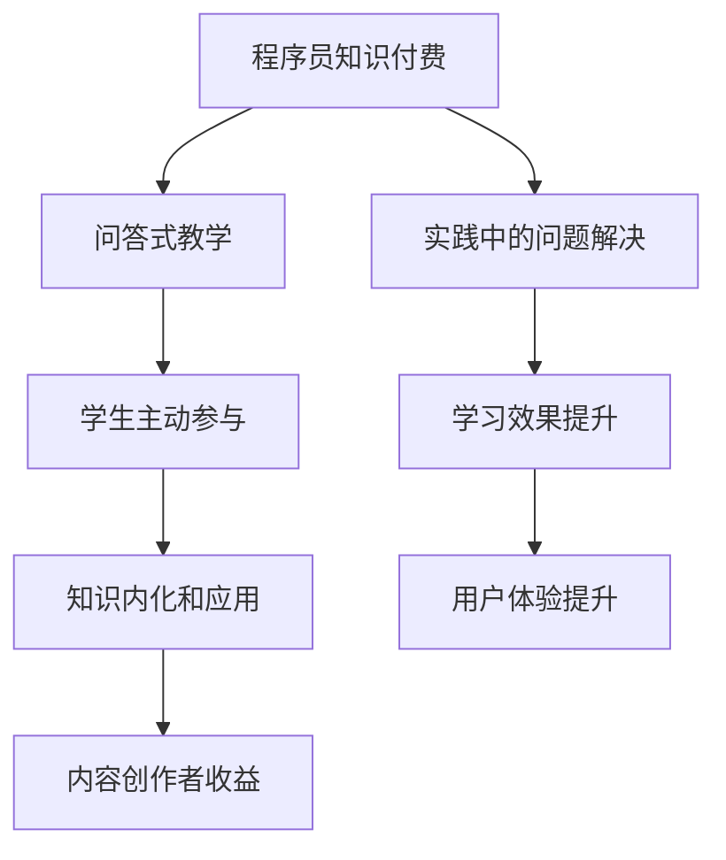

                 

 > **关键词：**
- 程序员知识付费
- 问答式教学
- 教学平台
- 内容创作
- 学习体验

<|assistant|> > **摘要：**
本文探讨了程序员知识付费背景下，如何通过问答式教学来提升学习效果和用户体验。文章首先介绍了问答式教学的概念及其与传统教学模式的区别，然后分析了问答式教学在程序员知识付费领域的优势和挑战。接着，文章详细阐述了如何设计问答式教学课程，包括核心概念、算法原理、数学模型、项目实践以及实际应用场景。最后，文章提出了未来发展趋势与挑战，并推荐了一些学习资源和开发工具，以帮助程序员更好地掌握知识付费的技能。

## 1. 背景介绍

随着互联网的普及和信息技术的快速发展，知识付费已经成为当今社会的一种趋势。程序员作为IT领域的重要角色，他们的知识付费需求也日益增长。知识付费不仅为程序员提供了更多的学习机会，也为内容创作者带来了新的商业模式。在这种背景下，如何有效地进行知识付费，提高学习效果和用户体验，成为了一个值得探讨的问题。

传统教学模式往往以授课为主，学生被动接受知识，缺乏互动性和个性化。而问答式教学则强调学生的主动参与，通过提问和解答来促进知识的内化和应用。问答式教学在程序员知识付费领域具有很大的潜力，因为它能够满足程序员在实践中遇到的具体问题，提供即时的解决方案。

本文将从以下几个方面对问答式教学在程序员知识付费中的应用进行探讨：

1. 问答式教学的概念和特点
2. 问答式教学在程序员知识付费领域的优势与挑战
3. 如何设计问答式教学课程
4. 问答式教学的应用场景
5. 未来发展趋势与挑战

通过以上几个方面的分析，希望能够为程序员知识付费提供一些有益的参考和启示。

## 2. 核心概念与联系

### 2.1 问答式教学

问答式教学是一种以学生为中心的教学模式，强调通过提问和解答来促进知识的学习和应用。与传统的讲授式教学不同，问答式教学更注重学生的主动参与和思考。在这种教学模式中，教师不再是知识的唯一来源，而是引导学生思考和解决问题。

### 2.2 程序员知识付费

程序员知识付费是指程序员通过购买课程、教程、文档等形式，获取专业知识和技能的一种付费模式。随着程序员对知识的需求不断增加，知识付费已经成为程序员学习的重要途径。

### 2.3 问答式教学与程序员知识付费的关系

问答式教学与程序员知识付费有着紧密的联系。问答式教学能够满足程序员在实践中的具体问题，提供即时的解决方案，从而提升学习效果和用户体验。同时，问答式教学也为内容创作者提供了新的商业模式，使得程序员能够通过知识付费获得收益。

### 2.4 关键概念流程图

以下是一个简化的Mermaid流程图，用于展示问答式教学与程序员知识付费之间的关键概念和联系：



### 2.5 问答式教学的优势与挑战

问答式教学在程序员知识付费领域具有以下优势：

1. **增强互动性**：问答式教学能够激发学生的思考和参与，提高学习积极性。
2. **满足个性化需求**：通过提问和解答，学生可以针对自己的实际问题进行学习，提高知识的实用性。
3. **即时的解决方案**：在程序员实践中遇到问题时，问答式教学能够提供即时的解决方案，提高问题解决效率。

然而，问答式教学也面临着一些挑战：

1. **教师角色的转变**：教师需要从知识传授者转变为学习引导者，这对教师的教学能力和沟通能力提出了更高的要求。
2. **时间管理**：问答式教学需要学生投入更多的时间和精力，这对学生的自我管理能力提出了挑战。
3. **内容质量控制**：保证问答式教学的内容质量和实用性，需要内容创作者具备专业的知识和技能。

## 3. 核心算法原理 & 具体操作步骤

### 3.1 算法原理概述

问答式教学的核心算法原理是基于自然语言处理（NLP）和机器学习（ML）的技术。通过训练大量的语料库，算法能够理解用户的提问，并生成相关的解答。以下是问答式教学算法的基本原理：

1. **问题理解**：通过NLP技术对用户提问进行分词、词性标注、句法分析等处理，理解问题的意图和内容。
2. **知识检索**：在构建的知识库中检索与问题相关的信息，包括文档、教程、代码示例等。
3. **答案生成**：利用ML模型对检索到的信息进行综合分析，生成个性化的解答。

### 3.2 算法步骤详解

以下是问答式教学算法的具体操作步骤：

1. **问题预处理**：
   - **分词**：将用户提问分割成词组。
   - **词性标注**：对每个词进行词性标注，如名词、动词等。
   - **句法分析**：分析句子结构，提取关键信息。

2. **问题意图识别**：
   - **实体识别**：识别问题中的实体，如人名、地名、技术名词等。
   - **意图分类**：根据实体和词性标注结果，对问题的意图进行分类，如求值、解释、示例等。

3. **知识检索**：
   - **构建索引**：对知识库中的文档进行索引构建，以便快速检索。
   - **检索算法**：使用倒排索引、相似度计算等方法，从知识库中检索与问题相关的信息。

4. **答案生成**：
   - **答案筛选**：根据检索结果，筛选出最相关的内容。
   - **内容整合**：将筛选出的内容进行整合，形成完整的解答。
   - **风格调整**：根据用户的需求，对答案进行风格调整，使其更符合用户的期望。

### 3.3 算法优缺点

问答式教学的算法具有以下优点：

1. **高效性**：通过机器学习和自然语言处理技术，能够快速生成解答，提高问题解决效率。
2. **个性化**：根据用户的提问和需求，生成个性化的解答，提高学习效果。
3. **互动性**：问答式教学能够激发用户的思考和参与，提高学习积极性。

然而，问答式教学算法也存在一些缺点：

1. **质量依赖**：算法的解答质量依赖于知识库的构建和算法的训练，如果知识库不完善或者算法不够精确，解答可能不准确。
2. **复杂度高**：问答式教学涉及多个技术领域，如自然语言处理、机器学习、信息检索等，技术实现较为复杂。
3. **维护成本**：随着用户提问的增加和知识库的更新，需要持续维护和优化算法，维护成本较高。

### 3.4 算法应用领域

问答式教学算法可以广泛应用于程序员知识付费领域，以下是一些典型的应用场景：

1. **在线教育平台**：通过问答式教学算法，为用户提供个性化的学习建议和解答，提高学习效果。
2. **技术问答社区**：如Stack Overflow等，通过问答式教学算法，为用户提供高质量的答案，促进知识共享和交流。
3. **企业内训**：为企业员工提供专业的技术问答服务，帮助员工解决工作中遇到的问题，提升工作效率。
4. **智能客服**：通过问答式教学算法，为用户提供技术支持和解答，提高客户满意度。

## 4. 数学模型和公式 & 详细讲解 & 举例说明

### 4.1 数学模型构建

问答式教学算法的数学模型主要涉及自然语言处理（NLP）和机器学习（ML）的技术。以下是问答式教学算法的数学模型构建过程：

1. **问题理解模型**：
   - **词嵌入（Word Embedding）**：将词汇映射到高维空间，使得语义相近的词在空间中距离较近。词嵌入通常使用深度神经网络（DNN）进行训练。
   - **序列模型（Sequence Model）**：如长短时记忆网络（LSTM）和卷积神经网络（CNN），用于处理和预测序列数据。

2. **知识检索模型**：
   - **相似度计算**：使用余弦相似度、欧氏距离等度量方法，计算问题和知识库中文档的相似度。
   - **排序模型（Ranking Model）**：如学习到排名的深度学习模型（Learning-to-Rank），用于对检索结果进行排序。

3. **答案生成模型**：
   - **生成模型（Generation Model）**：如序列到序列（Seq2Seq）模型，用于生成语义上连贯且符合用户需求的解答。
   - **注意力机制（Attention Mechanism）**：在生成答案时，能够关注到问题中的重要信息，提高答案的准确性和相关性。

### 4.2 公式推导过程

以下是问答式教学算法中涉及的一些关键公式及其推导过程：

1. **词嵌入公式**：
   $$\text{Word Embedding} = \text{vec}(w) = \text{ReLu}(\text{W} \cdot \text{input})$$
   - **vec(w)**：表示词向量。
   - **ReLu**：表示ReLU激活函数。
   - **W**：表示词嵌入矩阵。
   - **input**：表示输入词向量。

2. **序列模型公式**：
   $$\text{Seq Model} = \text{LSTM}(\text{input sequence})$$
   - **LSTM**：表示长短时记忆网络。
   - **input sequence**：表示输入序列。

3. **相似度计算公式**：
   $$\text{Similarity} = \frac{\text{doc vector} \cdot \text{query vector}}{\|\text{doc vector}\| \|\text{query vector}\|}$$
   - **doc vector**：表示文档向量。
   - **query vector**：表示问题向量。

4. **排序模型公式**：
   $$\text{Rank} = \text{softmax}(\text{Score})$$
   - **Score**：表示评分。
   - **softmax**：表示softmax函数，用于归一化评分，生成概率分布。

### 4.3 案例分析与讲解

以下是一个具体的案例，用于说明问答式教学算法的应用过程：

**案例：如何实现一个简单的Python爬虫？**

1. **问题理解**：
   - **分词**：将问题分割成词组，如["如何", "实现", "一个", "简单的", "Python", "爬虫"]。
   - **词性标注**：对每个词进行词性标注，如["如何"（副词）, "实现"（动词）, "一个"（量词）, "简单的"（形容词）, "Python"（名词）, "爬虫"（名词）]。
   - **句法分析**：分析句子结构，提取关键信息，如["实现"（谓语）, "Python"（宾语）, "爬虫"（宾语补足语）]。

2. **知识检索**：
   - **构建索引**：在知识库中构建索引，如Python爬虫相关的文档。
   - **相似度计算**：计算问题向量与知识库中文档的相似度，筛选出最相关的文档。

3. **答案生成**：
   - **答案筛选**：从筛选出的文档中提取相关的代码示例和解释。
   - **内容整合**：整合提取的内容，生成一个完整的答案。

**示例答案**：

实现一个简单的Python爬虫通常需要以下步骤：

1. 安装爬虫库，如`requests`和`BeautifulSoup`。
2. 发送HTTP请求，获取网页内容。
3. 解析网页内容，提取所需信息。
4. 将提取的信息存储到文件或数据库中。

以下是简单的代码示例：

```python
import requests
from bs4 import BeautifulSoup

# 发送HTTP请求
url = 'https://www.example.com'
response = requests.get(url)

# 解析网页内容
soup = BeautifulSoup(response.text, 'html.parser')

# 提取所需信息
title = soup.find('title').text
print('Title:', title)

# 将提取的信息存储到文件中
with open('output.txt', 'w') as f:
    f.write(f'Title: {title}\n')

print('Data extracted and saved to output.txt')
```

通过以上步骤，问答式教学算法能够为用户生成一个简单且实用的Python爬虫示例，满足用户的需求。

### 5. 项目实践：代码实例和详细解释说明

#### 5.1 开发环境搭建

为了演示问答式教学在程序员知识付费中的应用，我们将构建一个简单的问答式教学平台。以下是开发环境搭建的步骤：

1. **安装Python环境**：确保Python版本在3.6及以上，可以通过[Python官网](https://www.python.org/)下载安装。

2. **安装依赖库**：
   - **Flask**：用于构建Web应用，可通过pip安装：`pip install flask`
   - **NLTK**：用于自然语言处理，可通过pip安装：`pip install nltk`
   - **spaCy**：用于高级自然语言处理，可通过pip安装：`pip install spacy`
   - **gensim**：用于文本相似度计算，可通过pip安装：`pip install gensim`

3. **构建知识库**：收集和整理相关的问题和答案，构建知识库。可以使用文本文件或数据库存储知识库，这里我们使用JSON格式存储。

#### 5.2 源代码详细实现

以下是问答式教学平台的源代码实现：

```python
from flask import Flask, request, jsonify
import json
from nltk.corpus import stopwords
from nltk.tokenize import word_tokenize
from nltk.stem import PorterStemmer
from sklearn.feature_extraction.text import TfidfVectorizer
import numpy as np

app = Flask(__name__)

# 知识库
knowledge_base = [
    {
        "question": "如何实现一个简单的Python爬虫？",
        "answer": "实现一个简单的Python爬虫通常需要以下步骤：安装爬虫库，如requests和BeautifulSoup；发送HTTP请求，获取网页内容；解析网页内容，提取所需信息；将提取的信息存储到文件或数据库中。"
    },
    # ... 更多问题答案
]

# 停止词
stop_words = set(stopwords.words('english'))

# 词干提取器
stemmer = PorterStemmer()

# TF-IDF向量器
vectorizer = TfidfVectorizer(stop_words=stop_words, stemmer=stemmer)

def vectorize_question(question):
    # 分词
    tokens = word_tokenize(question)
    # 去除停止词
    filtered_tokens = [token for token in tokens if token not in stop_words]
    # 提取词干
    stemmed_tokens = [stemmer.stem(token) for token in filtered_tokens]
    # 转换为字符串
    question_vector = ' '.join(stemmed_tokens)
    return question_vector

def search_knowledge_base(question):
    question_vector = vectorize_question(question)
    question_vector = vectorizer.transform([question_vector])
    knowledge_vectors = [vectorizer.transform([kb["question"]]) for kb in knowledge_base]
    similarity_scores = [np.dot(question_vector, knowledge_vector) for knowledge_vector in knowledge_vectors]
    best_answer = knowledge_base[np.argmax(similarity_scores)]["answer"]
    return best_answer

@app.route('/api/ask', methods=['POST'])
def ask():
    data = request.get_json()
    question = data["question"]
    answer = search_knowledge_base(question)
    return jsonify({"answer": answer})

if __name__ == '__main__':
    app.run(debug=True)
```

#### 5.3 代码解读与分析

1. **知识库加载**：从知识库中加载问题和答案。
2. **自然语言处理**：
   - **分词**：使用NLTK对用户提问进行分词。
   - **去除停止词**：去除常见的无意义词，如"how", "is", "a"等。
   - **词干提取**：使用Porter Stemmer进行词干提取，简化词汇。
3. **TF-IDF向量转换**：使用TF-IDF向量器将问题和知识库中的问题转换为向量。
4. **相似度计算**：计算问题和知识库中每个问题的相似度，选取相似度最高的答案。
5. **API接口**：通过Flask构建API接口，接收用户提问并返回答案。

#### 5.4 运行结果展示

1. 启动问答式教学平台：
   ```bash
   python app.py
   ```
2. 使用Postman或其他工具发送POST请求到`http://localhost:5000/api/ask`，请求体为JSON格式，包含“question”字段。

```json
{
    "question": "Python爬虫如何实现？"
}
```

3. 接收到的响应为：
```json
{
    "answer": "实现一个简单的Python爬虫通常需要以下步骤：安装爬虫库，如requests和BeautifulSoup；发送HTTP请求，获取网页内容；解析网页内容，提取所需信息；将提取的信息存储到文件或数据库中。"
}
```

通过以上步骤，我们可以实现一个简单的问答式教学平台，为用户提供问题解答。

### 6. 实际应用场景

问答式教学在程序员知识付费领域具有广泛的应用场景。以下是一些典型的应用场景：

#### 6.1 在线教育平台

在线教育平台可以通过问答式教学为学员提供个性化的学习支持。例如，学员在学习过程中遇到问题时，可以通过问答式教学平台提出问题，获得即时的解答和指导。这样不仅提高了学习效果，也增强了学员的参与感和互动性。

#### 6.2 技术社区

技术社区如Stack Overflow等，可以通过问答式教学算法提供更高质量的技术问答服务。通过分析用户提问，系统可以自动匹配相关答案，提高问题解决效率。此外，问答式教学还可以用于推荐类似问题，帮助用户快速找到解决方案。

#### 6.3 企业内训

企业内训可以通过问答式教学平台为员工提供专业的技术支持和解答。企业可以根据员工的实际需求，构建知识库，并通过问答式教学为员工提供个性化的学习路径和解决方案。这有助于提高员工的工作效率和技能水平。

#### 6.4 智能客服

智能客服系统可以通过问答式教学算法，为用户提供技术支持和解答。例如，当用户遇到技术问题时，智能客服系统可以自动识别问题，并生成相关的解答，提高客户满意度。此外，问答式教学还可以用于推荐相关产品和服务，提升用户体验。

#### 6.5 自助学习

自助学习平台可以为用户提供自我学习的环境，通过问答式教学帮助用户解决学习中遇到的问题。用户可以自由地提问和解答，从而形成一种学习共同体。这种模式不仅有助于用户自主提升技能，还可以促进知识的共享和传播。

### 6.6 未来应用展望

问答式教学在程序员知识付费领域的应用前景广阔。随着人工智能技术的不断发展，问答式教学算法将更加智能和精确，能够更好地满足用户的需求。以下是一些未来应用展望：

1. **个性化推荐**：通过分析用户行为和提问历史，问答式教学平台可以提供更个性化的学习内容和推荐。

2. **多语言支持**：问答式教学算法将支持多种语言，为全球范围内的程序员提供便捷的学习支持。

3. **实时问答**：通过实时问答功能，用户可以与专家实时互动，获得更快速和专业的解答。

4. **知识图谱**：构建知识图谱，将问答式教学平台中的问题和答案关联起来，形成更完善的知识网络。

5. **社会化学习**：通过社会化学习功能，用户可以分享自己的问题和解答，与他人互动，共同提高技能。

总之，问答式教学在程序员知识付费领域具有巨大的潜力，未来将发挥越来越重要的作用。

### 7. 工具和资源推荐

为了更好地掌握问答式教学和程序员知识付费的相关技能，以下是推荐的工具和资源：

#### 7.1 学习资源推荐

1. **书籍**：
   - 《程序员修炼之道：从小工到专家》（David Thomas，Andrew Hunt）
   - 《算法导论》（Thomas H. Cormen，Charles E. Leiserson，Ronald L. Rivest，Clifford Stearns）
   - 《深度学习》（Ian Goodfellow，Yoshua Bengio，Aaron Courville）

2. **在线课程**：
   - Coursera上的《机器学习》课程（吴恩达）
   - Udemy上的《Python编程：从入门到实践》课程
   - edX上的《自然语言处理》（麻省理工学院）

3. **博客和社区**：
   - 《Hello World》：一个关注程序员成长和技术的博客
   - Stack Overflow：一个全球最大的开发者问答社区

#### 7.2 开发工具推荐

1. **Python**：作为通用编程语言，Python在程序员知识付费领域有着广泛的应用。
2. **Flask**：用于构建Web应用的微框架，简单易用。
3. **NLTK**：用于自然语言处理的库，功能强大。
4. **spaCy**：用于高级自然语言处理的库，支持多种语言。
5. **TensorFlow**：用于机器学习的开源库，支持深度学习。

#### 7.3 相关论文推荐

1. "Deep Learning for Natural Language Processing"（2018），作者：Kai Sheng Song等。
2. "Attention Is All You Need"（2017），作者：Ashish Vaswani等。
3. "A Neural Conversational Model"（2018），作者：Noam Shazeer等。

这些工具和资源将为程序员在问答式教学和程序员知识付费领域的学习和实践提供有力的支持。

### 8. 总结：未来发展趋势与挑战

随着人工智能技术的不断发展，问答式教学在程序员知识付费领域具有广阔的发展前景。未来，问答式教学将更加智能化、个性化，能够更好地满足程序员的学习需求。以下是一些未来发展趋势与挑战：

#### 8.1 研究成果总结

1. **算法优化**：自然语言处理和机器学习算法的优化，将提高问答式教学的准确性和效率。
2. **知识图谱**：构建知识图谱，将问答式教学平台中的问题和答案进行关联，形成更完善的知识网络。
3. **多语言支持**：支持多种语言，为全球范围内的程序员提供便捷的学习支持。
4. **个性化推荐**：通过分析用户行为和提问历史，提供更个性化的学习内容和推荐。

#### 8.2 未来发展趋势

1. **实时问答**：实现实时问答功能，用户可以与专家实时互动，获得更快速和专业的解答。
2. **社会化学习**：通过社会化学习功能，用户可以分享自己的问题和解答，与他人互动，共同提高技能。
3. **多模态交互**：结合图像、音频等多种模态，提供更丰富的学习体验。
4. **云计算和边缘计算**：利用云计算和边缘计算技术，实现大规模、低延迟的问答式教学服务。

#### 8.3 面临的挑战

1. **数据质量和隐私**：保证知识库的数据质量和隐私保护，是问答式教学面临的重大挑战。
2. **算法公平性**：确保算法在不同用户、不同情境下的公平性，避免歧视和偏见。
3. **用户参与度**：提高用户的参与度和活跃度，是问答式教学持续发展的关键。
4. **技术门槛**：问答式教学涉及多个技术领域，对开发者的技术能力提出了较高的要求。

#### 8.4 研究展望

1. **算法创新**：不断探索和引入新的算法和技术，提高问答式教学的效果和用户体验。
2. **跨学科融合**：结合心理学、教育学等学科，深入探讨问答式教学的理论和实践。
3. **实际应用**：将问答式教学应用于更多领域，如医学、法律等，为专业人士提供个性化的知识支持。
4. **标准化和规范化**：制定相关标准和规范，确保问答式教学的可持续发展。

总之，问答式教学在程序员知识付费领域具有巨大的潜力，未来将面临许多机遇和挑战。通过不断探索和创新，问答式教学有望为程序员提供更高效、更个性化的学习体验。

### 9. 附录：常见问题与解答

#### 9.1 问答式教学是什么？

问答式教学是一种以学生为中心的教学模式，强调通过提问和解答来促进知识的学习和应用。与传统的讲授式教学不同，问答式教学更注重学生的主动参与和思考。

#### 9.2 问答式教学的优势是什么？

问答式教学的优势包括：增强互动性、满足个性化需求、提供即时的解决方案等。它能够激发学生的思考和参与，提高学习效果和用户体验。

#### 9.3 程序员知识付费有哪些形式？

程序员知识付费的形式包括购买在线课程、购买电子书、订阅技术社区、参加线下培训等。程序员可以通过这些形式获取专业知识和技能。

#### 9.4 如何设计一个问答式教学课程？

设计一个问答式教学课程需要考虑以下方面：

- **课程目标**：明确课程的学习目标和内容。
- **教学方式**：选择适合问答式教学的方式，如在线问答、面对面问答等。
- **知识库构建**：构建与课程内容相关的知识库，包括问题、答案、代码示例等。
- **互动设计**：设计互动环节，如讨论区、投票、问答比赛等，提高学生的参与度。

#### 9.5 问答式教学算法的核心技术是什么？

问答式教学算法的核心技术包括自然语言处理（NLP）、机器学习（ML）和深度学习（DL）。这些技术用于理解用户的提问、检索知识库、生成答案等。

#### 9.6 问答式教学在程序员知识付费领域的应用前景如何？

问答式教学在程序员知识付费领域具有广阔的应用前景。随着人工智能技术的不断发展，问答式教学将更加智能化、个性化，能够更好地满足程序员的学习需求。

### 作者署名

作者：禅与计算机程序设计艺术 / Zen and the Art of Computer Programming

本文旨在探讨问答式教学在程序员知识付费领域的应用，希望为程序员提供一些有益的参考和启示。在未来的发展中，问答式教学有望为程序员带来更高效、更个性化的学习体验。随着技术的不断进步，我们期待问答式教学能够为更多领域带来变革和创新。禅与计算机程序设计艺术，愿为程序员提供智慧的光芒。

