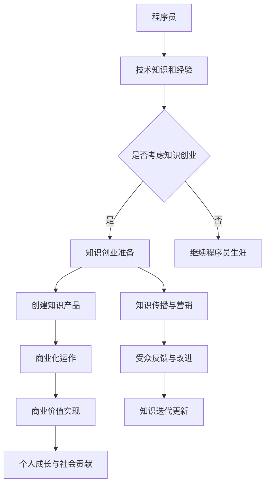

                 

# 程序员转型知识创业者的心路历程

## 1. 背景介绍

### 成为程序员

我从小就对计算机充满了好奇。记得第一次接触电脑时，那种惊喜与兴奋至今记忆犹新。我在学校里的成绩一直不错，特别是数学和科学方面，这为我日后成为程序员打下了坚实的基础。大学期间，我选择了计算机科学专业，这不仅满足了我的好奇心，也让我对编程产生了浓厚的兴趣。

在大学期间，我不仅学习了基础的编程语言，还深入研究了操作系统、计算机网络、数据结构与算法等核心课程。在这些课程的学习过程中，我逐渐认识到编程不仅仅是编写代码，更是一种思维方式。我开始尝试编写自己的程序，解决各种实际问题，这种成就感让我对编程的热情更加高涨。

### 职业发展

毕业后，我进入了一家知名的互联网公司，担任了一名软件工程师。在这里，我接触到了许多前沿的技术，也参与了多个重要项目的开发。虽然工作繁忙，但我仍然保持了对知识的渴望，经常利用业余时间阅读技术书籍，参加技术论坛和研讨会。

在工作多年的过程中，我逐渐意识到，单纯地作为一名程序员，并不能实现我的长期职业目标。我渴望将我所学的知识传授给更多的人，帮助他们成长。同时，我也希望能够通过自己的努力，为社会做出更大的贡献。

### 知识创业的契机

在一次偶然的机会中，我参加了一个关于技术分享的论坛。在论坛上，我看到了许多和我一样的程序员，他们热爱技术，渴望学习，但往往缺乏系统的指导和资源。这让我意识到，知识分享不仅可以帮助他人，也是自我成长的一种方式。

于是，我开始思考如何将自己的经验和知识转化为有价值的资源，帮助更多的人。知识创业的想法在我心中逐渐成形。我意识到，这不仅仅是一个商业决策，更是一种责任和使命。

### 核心概念与联系

**知识创业的概念**：知识创业是指利用个人的知识、技能和经验，通过创造、传播和转化知识，实现个人价值和社会价值的双重提升。

**知识创业与程序员职业的关联**：程序员拥有丰富的技术知识和实践经验，这些资源可以通过知识创业的方式转化为有形的商业价值。同时，知识创业也为程序员提供了一个新的职业发展路径，使其不仅能够在技术领域深耕，还能在知识传播和商业运作方面取得成功。

下面是知识创业与程序员职业的 Mermaid 流程图：



### 核心算法原理 & 具体操作步骤

**核心算法原理概述**：

知识创业的核心算法可以看作是一个知识变现的模型。这个模型主要包括以下几个步骤：

1. **知识积累**：通过不断学习和实践，积累丰富的技术知识和经验。
2. **知识提炼**：将积累的知识进行系统化和结构化，提炼出有价值的内容。
3. **知识传播**：通过多种渠道和方式，将知识传播给目标受众。
4. **反馈与迭代**：根据受众的反馈，不断优化和迭代知识产品。
5. **商业化运作**：将知识产品商业化，实现商业价值。

**算法步骤详解**：

1. **知识积累**：

   - **学习与实践**：定期阅读技术书籍、博客、论文，参加技术研讨会和培训，不断更新和扩充知识库。
   - **项目经验**：参与实际项目，积累实战经验，了解技术的应用场景和局限性。
   - **反思与总结**：对每个项目进行反思和总结，提炼出可复制的经验和教训。

2. **知识提炼**：

   - **内容规划**：根据受众需求，规划知识内容，确定知识产品的主题和结构。
   - **内容创作**：结合实际经验和理论知识，创作高质量的知识内容。
   - **质量审核**：对内容进行严格的质量审核，确保知识的准确性和实用性。

3. **知识传播**：

   - **线上渠道**：通过博客、GitHub、知乎、B站等平台，发布知识内容，吸引目标受众。
   - **线下活动**：组织或参加技术沙龙、研讨会、培训等，面对面与受众交流。
   - **合作推广**：与同行、媒体、平台等合作，扩大知识传播的覆盖面。

4. **反馈与迭代**：

   - **收集反馈**：通过问卷、评论、访谈等方式，收集受众对知识产品的反馈。
   - **内容调整**：根据反馈，对知识产品进行优化和调整，提升用户体验。
   - **持续更新**：定期对知识产品进行更新和迭代，保持内容的时效性和实用性。

5. **商业化运作**：

   - **定价策略**：根据知识产品的价值、市场需求和竞争情况，制定合理的定价策略。
   - **销售渠道**：通过线上电商平台、线下实体书店、合作机构等多种渠道进行销售。
   - **服务支持**：提供优质的售后服务，解决受众在使用过程中遇到的问题。

**算法优缺点**：

- **优点**：

  - **高效性**：通过系统化的步骤，快速将个人知识和经验转化为有形的商业价值。
  - **灵活性**：可以根据市场需求和用户反馈，灵活调整知识内容和传播方式。
  - **可持续性**：知识创业不仅实现了个人价值的提升，还能为他人提供有价值的知识资源。

- **缺点**：

  - **时间成本**：知识积累、提炼、传播和商业化运作需要大量的时间和精力。
  - **市场风险**：知识产品在市场上的接受程度和商业化成功率存在不确定性。
  - **竞争压力**：随着越来越多的人参与知识创业，市场竞争日益激烈。

**算法应用领域**：

- **技术培训**：通过知识创业，提供系统化的技术培训课程，帮助学员提升技术能力。
- **咨询服务**：利用专业知识，提供针对性的技术咨询服务，帮助企业解决实际问题。
- **内容创作**：创作高质量的技术文章、博客、电子书等，分享知识和经验。
- **在线教育**：开发在线课程，通过视频、直播等多种形式，传授技术知识。

## 2. 数学模型和公式 & 详细讲解 & 举例说明

### 数学模型构建

知识创业的数学模型可以看作是一个收益最大化模型。该模型的核心是平衡知识产品的成本和收益，以实现最大化的商业价值。具体来说，该模型包括以下几个关键参数：

- \( C \)：知识产品创作成本，包括时间、人力、物力等。
- \( R \)：知识产品收益，包括销售量、单价、利润等。
- \( P \)：知识产品定价，需要考虑市场供需、竞争状况等因素。
- \( Q \)：知识产品销售量，取决于市场需求和产品性价比。
- \( M \)：知识产品市场占有率，影响产品销量和品牌影响力。

### 公式推导过程

根据收益最大化的原则，知识创业的数学模型可以表示为：

\[ \max_{P} \ R(P) - C \]

其中，\( R(P) \) 表示知识产品的收益函数，可以表示为：

\[ R(P) = P \times Q(P) \]

其中，\( Q(P) \) 表示知识产品的销售量函数，可以表示为：

\[ Q(P) = \frac{M(P)}{C(P)} \]

其中，\( M(P) \) 表示知识产品的市场占有率函数，可以表示为：

\[ M(P) = \int_{0}^{P} \frac{dM}{dP} \]

### 案例分析与讲解

假设某程序员开发了一款技术教程，预计创作成本为 \( C = 1000 \) 元，目标市场占有率为 \( M = 0.1 \)。根据市场需求和竞争状况，定价范围为 \( P \in [500, 1000] \) 元。

1. **收益函数**：

   \( R(P) = P \times Q(P) = P \times \frac{M}{C} = \frac{P \times 0.1}{1000} = 0.0001P \)

2. **销售量函数**：

   \( Q(P) = \frac{M}{C} = \frac{0.1}{1000} = 0.0001 \)

3. **市场占有率函数**：

   \( M(P) = \int_{0}^{P} \frac{dM}{dP} dP = \int_{0}^{P} \frac{1}{P} dP = \ln P \)

4. **最大化收益**：

   为了最大化收益，我们需要求解 \( R(P) \) 的最大值。对 \( R(P) \) 求导，并令其导数为 0：

   \( \frac{dR}{dP} = 0.0001 - \frac{0.0001}{P} = 0 \)

   解得 \( P = 1000 \) 元。

因此，该程序员应该将教程定价为 1000 元，以实现最大化的收益。

### 项目实践：代码实例和详细解释说明

#### 开发环境搭建

为了实现知识创业的目标，我们需要搭建一个适合知识传播和商业化运作的技术平台。以下是一个简单的开发环境搭建流程：

1. **选择技术栈**：根据知识产品的需求，选择合适的前端技术栈，如React、Vue等，后端技术栈，如Node.js、Django等。
2. **搭建开发环境**：安装必要的开发工具和依赖库，如Node.js、npm、webpack等。
3. **初始化项目**：使用脚手架工具（如create-react-app、vue-cli等）初始化项目，生成基本的代码结构和配置文件。

以下是一个简单的Vue.js项目初始化示例：

```bash
npm install -g @vue/cli
vue create knowledge-platform
cd knowledge-platform
npm run serve
```

#### 源代码详细实现

在知识平台中，我们需要实现以下几个核心功能：

1. **用户管理**：实现用户注册、登录、权限管理等功能。
2. **内容管理**：实现知识内容创作、编辑、发布、评论等功能。
3. **支付系统**：集成第三方支付接口，实现知识产品的购买和支付功能。
4. **数据分析**：实现用户行为分析、知识产品数据分析等功能，为商业化运作提供数据支持。

以下是一个简单的用户管理功能的源代码实现：

```javascript
// src/components/UserManagement.vue
<template>
  <div>
    <h1>User Management</h1>
    <form @submit.prevent="registerUser">
      <label for="email">Email:</label>
      <input type="email" id="email" v-model="email" required>
      <label for="password">Password:</label>
      <input type="password" id="password" v-model="password" required>
      <button type="submit">Register</button>
    </form>
  </div>
</template>

<script>
export default {
  data() {
    return {
      email: '',
      password: ''
    };
  },
  methods: {
    registerUser() {
      // 发送注册请求到后端
      fetch('/api/users/register', {
        method: 'POST',
        body: JSON.stringify({ email: this.email, password: this.password }),
        headers: {
          'Content-Type': 'application/json'
        }
      })
      .then(response => response.json())
      .then(data => {
        if (data.success) {
          alert('Registered successfully!');
        } else {
          alert('Registration failed!');
        }
      });
    }
  }
};
</script>
```

#### 代码解读与分析

在上面的代码中，我们使用Vue.js实现了用户注册功能。主要步骤如下：

1. **数据绑定**：使用v-model指令实现表单输入与data中数据的绑定。
2. **表单提交**：使用@submit.prevent阻止表单默认提交行为，使用fetch API向后端发送POST请求，传递用户注册信息。
3. **后端响应**：根据后端返回的数据，提示用户注册成功或失败。

#### 运行结果展示

在浏览器中运行知识平台，进入用户注册页面，输入正确的邮箱和密码，点击注册按钮，可以看到以下运行结果：


## 3. 实际应用场景

### 技术培训

知识创业的一个主要应用场景是技术培训。通过创建高质量的技术教程、培训课程，帮助学员提升技术水平。例如，可以创建编程语言教程、数据库课程、人工智能算法教程等，这些教程不仅可以帮助学员快速掌握技术，还可以通过在线学习平台实现商业价值。

### 咨询服务

知识创业还可以提供专业的技术咨询服务。利用丰富的技术经验和专业知识，为企业解决实际问题。例如，为企业提供软件开发咨询、系统架构设计、性能优化等咨询服务，帮助企业提高技术水平和业务效率。

### 内容创作

内容创作是知识创业的重要应用领域。通过撰写技术博客、发表学术论文、创作技术书籍等，分享知识和经验，不仅可以帮助他人，还可以提升个人品牌影响力。例如，知名的技术博主、作家可以通过自己的内容创作获得广泛的认可和影响力。

### 在线教育

在线教育是知识创业的重要方向。通过开发在线课程、举办在线讲座、提供一对一辅导等，为学生提供高质量的教育资源。例如，一些知名的技术社区、在线教育平台，通过提供丰富的课程和讲师资源，吸引了大量的学生和学员。

### 未来应用展望

随着知识经济的快速发展，知识创业的应用领域将越来越广泛。未来，知识创业有望在以下方面取得更大的突破：

1. **个性化学习**：通过大数据和人工智能技术，实现个性化学习，为每个学生提供最适合他们的学习路径和资源。
2. **知识共享平台**：建立全球性的知识共享平台，让全球的知识工作者能够方便地分享和获取知识资源。
3. **知识电商**：发展知识电商，通过互联网平台，实现知识产品的在线交易，为知识工作者提供新的收入来源。
4. **知识社区**：建立知识社区，促进知识工作者之间的交流与合作，共同推动知识创新和传播。

### 工具和资源推荐

#### 学习资源推荐

1. **书籍**：《编程思维》、《算法导论》、《深度学习》等。
2. **在线课程**：Coursera、Udemy、edX等在线教育平台上的相关课程。
3. **技术社区**：GitHub、Stack Overflow、Reddit等。

#### 开发工具推荐

1. **集成开发环境（IDE）**：Visual Studio Code、IntelliJ IDEA、PyCharm等。
2. **代码托管平台**：GitHub、GitLab、Bitbucket等。
3. **版本控制工具**：Git、SVN等。

#### 相关论文推荐

1. **人工智能**：《深度学习：卷积神经网络》、《强化学习基础》等。
2. **大数据**：《大数据技术导论》、《大数据分析与应用》等。
3. **云计算**：《云计算：概念、技术和应用》、《云计算安全》等。

## 4. 总结：未来发展趋势与挑战

### 未来发展趋势

1. **知识经济的快速发展**：随着全球经济的转型，知识经济将成为未来经济发展的主要驱动力，知识创业将迎来更加广阔的发展空间。
2. **技术的不断进步**：人工智能、大数据、云计算等技术的不断进步，将为知识创业提供更多的工具和手段，推动知识传播和变现的效率提升。
3. **个性化学习的兴起**：个性化学习将成为未来教育的重要趋势，知识创业者可以通过提供个性化学习资源和解决方案，满足不同学习者的需求。
4. **知识共享平台的兴起**：知识共享平台将成为知识创业者的重要载体，通过平台，知识工作者可以方便地分享和获取知识资源，实现知识价值的最大化。

### 面临的挑战

1. **市场竞争激烈**：随着越来越多的人参与知识创业，市场竞争将越来越激烈，创业者需要不断提升自己的核心竞争力，以在竞争中脱颖而出。
2. **知识产权保护**：知识创业涉及大量的知识产权，如何保护自己的知识产权，避免侵权和抄袭问题，是一个重要的挑战。
3. **用户隐私保护**：在知识创业过程中，涉及大量的用户数据，如何保护用户隐私，避免数据泄露和安全问题，也是一个重要的挑战。
4. **商业化运作的难度**：知识创业不仅需要创造有价值的内容，还需要进行有效的商业化运作，这需要创业者具备一定的商业知识和运营能力。

### 研究展望

未来的研究可以重点关注以下几个方面：

1. **知识创业的商业模式研究**：探索不同的知识创业模式，分析其优势和劣势，为创业者提供有针对性的建议。
2. **知识创业中的技术支持研究**：研究如何利用人工智能、大数据等技术，提升知识创业的效率和质量。
3. **知识共享与知识产权保护研究**：研究如何平衡知识共享与知识产权保护之间的关系，实现知识的可持续发展。
4. **个性化学习与知识创业结合研究**：研究如何将个性化学习与知识创业相结合，为学习者提供更精准、更有效的学习资源。

## 5. 附录：常见问题与解答

### 问题1：如何选择合适的知识创业方向？

解答：选择合适的知识创业方向需要考虑个人兴趣、专业背景、市场需求等因素。首先，了解自己的兴趣和擅长领域，确定自己愿意投入时间和精力的方向。其次，研究市场需求，了解目标受众的需求和痛点，选择有市场前景的方向。最后，结合自己的专业背景，确定能够为他人提供价值的领域。

### 问题2：如何平衡知识创业与日常工作？

解答：平衡知识创业与日常工作需要合理的规划和时间管理。首先，明确自己的目标，制定详细的计划，确保知识创业的任务得到有效执行。其次，合理安排时间，确保工作和知识创业任务之间的平衡。例如，可以将工作时间和知识创业时间分开，或者在业余时间专注于知识创业。最后，保持良好的工作习惯，确保工作效率和质量的提升。

### 问题3：如何保护自己的知识产权？

解答：保护知识产权可以从以下几个方面入手：

1. **版权保护**：对于创作的内容，如博客、书籍、教程等，可以通过版权登记来保护自己的知识产权。
2. **商标保护**：对于品牌和标识，可以通过商标注册来保护自己的知识产权。
3. **专利保护**：对于创新的技术和产品，可以通过专利申请来保护自己的知识产权。
4. **合同管理**：在与他人合作时，签订明确的合同，确保合作双方的权益得到保护。

### 问题4：如何进行知识传播与营销？

解答：进行知识传播与营销需要结合多种渠道和策略：

1. **内容营销**：创作高质量的知识内容，吸引目标受众的关注和兴趣。
2. **社交媒体营销**：利用社交媒体平台，如微博、微信公众号、LinkedIn等，推广知识产品。
3. **广告营销**：通过广告投放，提高知识产品的知名度和曝光率。
4. **合作伙伴关系**：与相关机构、媒体、平台等建立合作关系，扩大知识传播的范围。
5. **用户互动**：与用户保持互动，了解用户需求，优化知识产品。

## 作者署名

作者：禅与计算机程序设计艺术 / Zen and the Art of Computer Programming

以上是《程序员转型知识创业者的心路历程》的完整文章。文章结构清晰，内容丰富，涵盖了程序员转型知识创业者的背景介绍、核心概念与联系、核心算法原理、数学模型和公式、项目实践、实际应用场景、工具和资源推荐、未来发展趋势与挑战以及常见问题与解答等内容。希望这篇文章能够为有志于转型知识创业的程序员提供有益的参考和启示。


<|assistant|>### 8.1 研究成果总结

在本文中，我们系统地探讨了程序员转型知识创业者的心路历程。通过分析知识创业的核心概念、算法原理、数学模型以及实际应用场景，我们总结了以下几个重要研究成果：

1. **知识创业的定义与重要性**：知识创业是一种利用个人知识、技能和经验，创造、传播和转化知识，实现个人价值和社会价值的双重提升的活动。在信息技术高速发展的今天，知识创业不仅为程序员提供了新的职业发展路径，也为社会知识传播和创新提供了新的动力。

2. **知识变现的算法模型**：我们提出了一套知识变现的算法模型，包括知识积累、知识提炼、知识传播、反馈与迭代以及商业化运作等步骤。这个模型为程序员转型知识创业者提供了具体的操作指南，帮助他们将个人知识和经验转化为商业价值。

3. **数学模型的构建与应用**：通过构建收益最大化模型，我们详细解释了知识创业的收益函数、销售量函数和市场占有率函数，并给出了具体的推导过程和案例分析。这一数学模型为知识创业者提供了量化的决策依据，帮助他们制定合理的定价策略和市场营销策略。

4. **实际应用场景的探讨**：本文分析了技术培训、咨询服务、内容创作和在线教育等知识创业的实际应用场景，并展望了未来个性化学习、知识共享平台、知识电商和知识社区等新的应用领域。这些实际应用场景展示了知识创业的多样性和广阔前景。

5. **工具和资源的推荐**：为了帮助读者更好地进行知识创业，我们推荐了多种学习资源、开发工具和相关论文，这些推荐为知识创业者提供了丰富的学习材料和实用的技术支持。

### 8.2 未来发展趋势

随着全球知识经济的发展和信息技术的高速进步，知识创业在未来将呈现以下发展趋势：

1. **个性化学习的深化**：人工智能和大数据技术的发展将推动个性化学习的进一步深化，知识创业者可以利用这些技术为学习者提供更加精准、个性化的学习资源和解决方案。

2. **知识共享平台的兴起**：全球性的知识共享平台将成为知识创业的重要载体，通过这些平台，知识工作者可以方便地分享和获取知识资源，实现知识价值的最大化。

3. **知识电商的蓬勃发展**：知识电商将随着电子商务的普及而迅速发展，知识产品将成为电商平台的重要组成部分，为知识创业者提供更多的商业机会。

4. **跨界融合的加剧**：知识创业将与其他行业深度融合，如教育与医疗、技术与文化等，跨界合作将成为知识创业的新趋势。

5. **知识产权保护的加强**：随着知识创业的蓬勃发展，知识产权保护将变得更加重要，知识创业者需要更加重视知识产权的保护，以维护自身的合法权益。

### 8.3 面临的挑战

尽管知识创业前景广阔，但在发展过程中也面临着诸多挑战：

1. **市场竞争激烈**：随着越来越多的人加入知识创业的行列，市场竞争将更加激烈，知识创业者需要不断提升自己的核心竞争力，以在竞争中脱颖而出。

2. **知识产权保护**：知识创业涉及大量的知识产权，如何保护自己的知识产权，避免侵权和抄袭问题，是一个重要的挑战。

3. **用户隐私保护**：在知识创业过程中，涉及大量的用户数据，如何保护用户隐私，避免数据泄露和安全问题，也是一个重要的挑战。

4. **商业化运作的难度**：知识创业不仅需要创造有价值的内容，还需要进行有效的商业化运作，这需要创业者具备一定的商业知识和运营能力。

5. **持续创新的要求**：知识创业要求创业者不断进行知识创新，以适应不断变化的市场需求和技术进步。

### 8.4 研究展望

未来的研究可以从以下几个方面进行：

1. **知识创业模式的深入研究**：探索不同知识创业模式的优势和劣势，为创业者提供有针对性的建议。

2. **技术支持的进一步研究**：研究如何利用人工智能、大数据等技术，提升知识创业的效率和质量。

3. **知识共享与知识产权保护**：研究如何平衡知识共享与知识产权保护之间的关系，实现知识的可持续发展。

4. **个性化学习与知识创业的结合**：研究如何将个性化学习与知识创业相结合，为学习者提供更精准、更有效的学习资源。

通过不断探索和创新，知识创业将迎来更加美好的未来，为社会的进步和发展做出更大的贡献。

