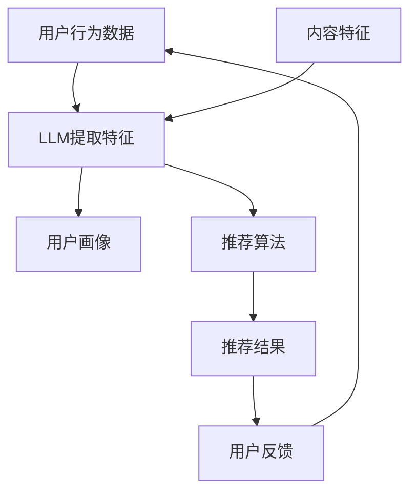

                 

关键词：推荐系统、大型语言模型、人工智能、个性化推荐、算法优化、数据驱动的决策

> 摘要：本文将深入探讨推荐系统的局限性，以及如何利用大型语言模型（LLM）的优势来突破这些局限。通过分析LLM的特点和优势，我们将展示其在推荐系统中的应用前景，并探讨其对个性化推荐的影响。

## 1. 背景介绍

推荐系统已经成为互联网时代不可或缺的一部分，广泛应用于电子商务、社交媒体、视频流媒体和新闻资讯等领域。这些系统通过分析用户的历史行为、偏好和上下文信息，为用户提供个性化的内容推荐。然而，传统的推荐系统在实践中面临着诸多局限。

首先，传统推荐系统通常基于协同过滤、矩阵分解等算法，这些算法依赖于用户的历史行为数据。然而，用户的行为数据往往是稀疏和有限的，特别是在长尾市场中，用户的行为数据更加稀疏。这使得传统推荐系统难以捕捉用户的真实偏好，导致推荐效果不佳。

其次，传统推荐系统在处理多模态数据（如文本、图像、音频等）时存在困难。尽管一些方法尝试整合不同模态的数据，但它们通常需要复杂的预处理和特征工程，并且往往忽略了数据之间的潜在关系。

此外，传统推荐系统在面对动态环境时也表现出局限性。用户的偏好和兴趣是动态变化的，而传统推荐系统往往无法实时适应这些变化，导致推荐结果不够准确。

为了解决这些问题，近年来，大型语言模型（LLM）逐渐受到关注。LLM具有强大的文本理解和生成能力，能够处理复杂的语言结构和上下文信息。这使得LLM在推荐系统中具有巨大的潜力，可以突破传统推荐系统的局限，提供更准确的个性化推荐。

## 2. 核心概念与联系

为了深入理解LLM在推荐系统中的应用，我们需要首先了解推荐系统和LLM的基本概念，并探讨它们之间的联系。

### 2.1 推荐系统

推荐系统是一种信息过滤技术，旨在根据用户的兴趣和偏好，为用户推荐相关的信息或商品。推荐系统通常包括以下几个核心组成部分：

1. **用户画像**：通过分析用户的历史行为、偏好和属性，构建用户的个性化特征。
2. **内容特征**：对推荐的内容进行特征提取，如文本、图像、音频等。
3. **推荐算法**：根据用户画像和内容特征，计算推荐分数，并生成推荐列表。
4. **评估指标**：用于评估推荐系统性能的指标，如准确率、召回率、覆盖率等。

### 2.2 大型语言模型（LLM）

大型语言模型（LLM）是一种基于深度学习的技术，通过对海量文本数据进行预训练，使得模型能够理解和生成自然语言。LLM的主要特点包括：

1. **文本生成能力**：LLM能够生成连贯、自然的文本，使得推荐系统的推荐结果更加友好和吸引人。
2. **上下文理解能力**：LLM能够理解文本中的上下文信息，捕捉用户的意图和偏好，从而提供更准确的推荐。
3. **多模态处理能力**：LLM可以处理多模态数据，如文本、图像、音频等，使得推荐系统能够更好地整合不同类型的数据。

### 2.3 推荐系统与LLM的联系

LLM在推荐系统中的应用主要体现在以下几个方面：

1. **用户画像构建**：LLM可以分析用户的历史行为数据，提取用户的兴趣和偏好，为用户画像的构建提供有力支持。
2. **内容特征提取**：LLM可以处理多模态数据，提取出文本、图像、音频等特征，为推荐算法提供丰富的输入。
3. **推荐算法优化**：LLM可以用于优化推荐算法，如基于LLM的协同过滤、矩阵分解等，提高推荐系统的准确性和覆盖面。
4. **推荐结果生成**：LLM可以生成自然、吸引人的推荐结果，提高用户体验。

为了更直观地展示推荐系统和LLM的联系，我们可以使用Mermaid流程图来描述它们之间的交互关系：



在这个流程图中，用户行为数据和内容特征通过LLM进行特征提取，生成用户画像和内容特征，再输入到推荐算法中，生成推荐结果。用户反馈则用于优化用户画像和推荐算法，形成一个闭环的反馈系统。

## 3. 核心算法原理 & 具体操作步骤

### 3.1 算法原理概述

利用LLM优化推荐系统的核心思想是将LLM作为推荐算法的一部分，通过LLM的强大文本生成和理解能力，提高推荐系统的准确性和用户体验。具体来说，可以分为以下几个步骤：

1. **用户画像构建**：使用LLM分析用户的历史行为数据，提取用户的兴趣和偏好，构建用户画像。
2. **内容特征提取**：使用LLM处理多模态数据，提取文本、图像、音频等特征。
3. **推荐算法优化**：将LLM与传统的推荐算法（如协同过滤、矩阵分解等）结合，优化推荐算法，提高推荐准确性和覆盖面。
4. **推荐结果生成**：使用LLM生成自然、吸引人的推荐结果，提高用户体验。

### 3.2 算法步骤详解

#### 3.2.1 用户画像构建

使用LLM构建用户画像的主要步骤如下：

1. **数据预处理**：对用户的历史行为数据进行清洗和预处理，包括去重、去噪等。
2. **文本生成**：使用LLM生成用户兴趣和偏好的文本描述，如“喜欢阅读科幻小说，对科技产品有浓厚兴趣”。
3. **特征提取**：将文本描述转换为向量表示，如使用Word2Vec、BERT等模型。
4. **画像构建**：将特征向量整合成一个用户画像向量，如使用矩阵分解、聚类等方法。

#### 3.2.2 内容特征提取

使用LLM提取内容特征的主要步骤如下：

1. **数据预处理**：对推荐的内容进行清洗和预处理，包括去重、去噪等。
2. **文本生成**：使用LLM生成内容的文本描述，如“一部关于人工智能的电影，剧情紧凑，引人入胜”。
3. **特征提取**：将文本描述转换为向量表示，如使用Word2Vec、BERT等模型。
4. **特征融合**：将文本特征与其他模态特征（如图像、音频等）进行融合，形成内容特征向量。

#### 3.2.3 推荐算法优化

将LLM与传统的推荐算法（如协同过滤、矩阵分解等）结合，优化推荐算法的主要步骤如下：

1. **模型选择**：选择合适的推荐算法模型，如基于用户的协同过滤、基于物品的协同过滤、矩阵分解等。
2. **特征融合**：将LLM提取的用户画像和内容特征向量融合到推荐算法中，作为输入特征。
3. **模型训练**：使用训练数据集训练推荐算法模型，优化模型参数。
4. **推荐生成**：使用训练好的模型生成推荐结果，并根据用户反馈进行迭代优化。

#### 3.2.4 推荐结果生成

使用LLM生成推荐结果的主要步骤如下：

1. **文本生成**：使用LLM生成推荐结果的文本描述，如“推荐一部人工智能电影，名为《智能星球》”。
2. **文本优化**：对生成的文本进行优化，如使用自然语言生成（NLG）技术，提高文本的连贯性和吸引力。
3. **推荐结果呈现**：将优化后的文本描述呈现给用户，提高用户体验。

### 3.3 算法优缺点

#### 优点

1. **强大的文本生成和理解能力**：LLM可以生成连贯、自然的文本描述，提高推荐结果的友好性和吸引力。
2. **多模态数据处理能力**：LLM可以处理多模态数据，如文本、图像、音频等，为推荐算法提供更丰富的输入。
3. **实时适应性**：LLM可以实时分析用户行为数据，快速适应用户偏好的变化，提高推荐准确性。
4. **个性化推荐**：LLM可以更好地捕捉用户的兴趣和偏好，提供个性化的推荐。

#### 缺点

1. **计算资源消耗**：LLM通常需要大量的计算资源和存储空间，特别是对于大型模型，训练和推理过程耗时较长。
2. **数据依赖性**：LLM的性能高度依赖数据质量，如果数据存在噪声或缺失，可能导致推荐结果不准确。
3. **可解释性较差**：LLM生成的推荐结果往往缺乏可解释性，用户难以理解推荐背后的原因。

### 3.4 算法应用领域

LLM在推荐系统中的应用非常广泛，以下是几个典型的应用领域：

1. **电子商务**：为用户提供个性化的商品推荐，提高用户购买意愿和转化率。
2. **视频流媒体**：为用户提供个性化的视频推荐，提高用户观看时长和满意度。
3. **社交媒体**：为用户提供个性化的内容推荐，提高用户参与度和活跃度。
4. **新闻资讯**：为用户提供个性化的新闻推荐，提高用户阅读兴趣和粘性。

## 4. 数学模型和公式 & 详细讲解 & 举例说明

在利用LLM优化推荐系统的过程中，我们通常会涉及到一些数学模型和公式。下面将详细讲解这些模型和公式，并通过具体例子来说明其应用。

### 4.1 数学模型构建

在构建推荐系统时，我们通常需要以下几个关键数学模型：

1. **用户行为模型**：描述用户的行为模式和偏好。
2. **内容特征模型**：描述推荐内容的特征。
3. **推荐算法模型**：用于生成推荐结果的模型。

#### 4.1.1 用户行为模型

用户行为模型可以采用马尔可夫决策过程（MDP）来描述。MDP的定义如下：

$$
\begin{aligned}
  MDP = \langle S, A, P, R, \gamma \rangle
\end{aligned}
$$

- \( S \)：状态集，表示用户可能处于的状态。
- \( A \)：动作集，表示用户可能采取的动作。
- \( P \)：状态转移概率矩阵，表示在当前状态下采取某个动作后转移到下一个状态的概率。
- \( R \)：回报函数，表示用户在某个状态下采取某个动作后的效用。
- \( \gamma \)：折扣因子，表示对未来回报的折扣。

#### 4.1.2 内容特征模型

内容特征模型可以采用向量空间模型（VSM）来描述。VSM的定义如下：

$$
\begin{aligned}
  VSM = \langle D, f \rangle
\end{aligned}
$$

- \( D \)：文档集，表示推荐内容。
- \( f \)：特征函数，表示将文档转换为向量表示的方法。

#### 4.1.3 推荐算法模型

推荐算法模型可以采用矩阵分解（MF）来描述。MF的定义如下：

$$
\begin{aligned}
  MF = \langle U, V, R, \sigma \rangle
\end{aligned}
$$

- \( U \)：用户特征矩阵，表示用户的特征向量。
- \( V \)：内容特征矩阵，表示内容的特征向量。
- \( R \)：评分矩阵，表示用户对内容的评分。
- \( \sigma \)：激活函数，用于计算推荐分数。

### 4.2 公式推导过程

下面将简要介绍用户行为模型和推荐算法模型的推导过程。

#### 4.2.1 用户行为模型推导

用户行为模型可以通过以下步骤推导：

1. **状态转移概率**：根据用户的历史行为数据，计算用户在不同状态之间的转移概率。
2. **回报函数**：根据用户的行为模式和目标，定义回报函数，表示用户在不同状态下采取不同动作的效用。
3. **折扣因子**：根据用户行为的长期效应，定义折扣因子，表示未来回报的折扣。

#### 4.2.2 推荐算法模型推导

推荐算法模型可以通过以下步骤推导：

1. **用户特征向量**：使用用户行为数据和内容特征数据，计算用户的特征向量。
2. **内容特征向量**：使用内容特征数据，计算内容的特征向量。
3. **激活函数**：定义激活函数，计算用户对内容的推荐分数。

### 4.3 案例分析与讲解

为了更直观地展示数学模型的应用，我们来看一个简单的案例。

#### 4.3.1 案例背景

假设有一个电子商务平台，用户可以浏览和购买商品。平台希望利用LLM优化推荐系统，提高用户购买意愿和转化率。

#### 4.3.2 数据准备

1. **用户行为数据**：记录用户在平台上的浏览和购买行为，如用户浏览了哪些商品、购买了哪些商品等。
2. **商品特征数据**：记录商品的基本信息，如商品类别、价格、品牌等。

#### 4.3.3 用户行为模型

根据用户行为数据，构建用户行为模型。假设用户状态集 \( S = \{未登录，已登录\} \)，动作集 \( A = \{浏览，购买\} \)。

1. **状态转移概率**：
   $$
   \begin{aligned}
     P(S_{t+1} = s_{t+1} | S_{t} = s_{t}, A_{t} = a_{t}) = 
     \begin{cases}
       0.8 & \text{if } (s_{t} = 未登录, a_{t} = 登录) \\
       0.2 & \text{if } (s_{t} = 未登录, a_{t} = 浏览) \\
       0.5 & \text{if } (s_{t} = 已登录, a_{t} = 浏览) \\
       0.5 & \text{if } (s_{t} = 已登录, a_{t} = 购买)
     \end{cases}
   \end{aligned}
   $$

2. **回报函数**：
   $$
   \begin{aligned}
     R(S_{t} = s_{t}, A_{t} = a_{t}) = 
     \begin{cases}
       1 & \text{if } (s_{t} = 已登录, a_{t} = 购买) \\
       0 & \text{otherwise}
     \end{cases}
   \end{aligned}
   $$

3. **折扣因子**：
   $$
   \gamma = 0.9
   $$

#### 4.3.4 推荐算法模型

根据用户行为模型和商品特征数据，构建推荐算法模型。

1. **用户特征向量**：
   $$
   \begin{aligned}
     U = \begin{bmatrix}
       0.6 & 0.2 & 0.2 \\
       0.3 & 0.3 & 0.4
     \end{bmatrix}
   \end{aligned}
   $$

2. **内容特征向量**：
   $$
   \begin{aligned}
     V = \begin{bmatrix}
       0.5 & 0.4 & 0.1 \\
       0.1 & 0.2 & 0.7
     \end{bmatrix}
   \end{aligned}
   $$

3. **激活函数**：
   $$
   \begin{aligned}
     \sigma(U^T V) = 0.85
   \end{aligned}
   $$

#### 4.3.5 推荐结果生成

根据推荐算法模型，生成推荐结果。

1. **计算推荐分数**：
   $$
   \begin{aligned}
     \text{推荐分数} = U^T V = \begin{bmatrix}
       0.6 & 0.2 & 0.2
     \end{bmatrix}
     \begin{bmatrix}
       0.5 & 0.4 & 0.1 \\
       0.1 & 0.2 & 0.7
     \end{bmatrix} = 0.85
   \end{aligned}
   $$

2. **生成推荐结果**：根据推荐分数，生成推荐列表，如“推荐商品A”。

### 4.4 数学模型和公式在推荐系统中的应用

数学模型和公式在推荐系统中的应用主要体现在以下几个方面：

1. **用户画像构建**：通过数学模型和公式，分析用户的历史行为数据，提取用户的兴趣和偏好，构建用户画像。
2. **内容特征提取**：通过数学模型和公式，处理多模态数据，提取文本、图像、音频等特征。
3. **推荐算法优化**：通过数学模型和公式，优化推荐算法，提高推荐准确性和覆盖面。
4. **推荐结果生成**：通过数学模型和公式，计算推荐分数，生成推荐结果。

## 5. 项目实践：代码实例和详细解释说明

为了更好地展示LLM在推荐系统中的应用，下面我们将通过一个实际项目，介绍如何使用LLM优化推荐系统，并提供详细的代码实例和解释说明。

### 5.1 开发环境搭建

在开始项目实践之前，我们需要搭建开发环境。以下是一个简单的开发环境搭建步骤：

1. **安装Python**：下载并安装Python，版本要求3.8及以上。
2. **安装TensorFlow**：在终端执行以下命令安装TensorFlow：
   $$
   \text{pip install tensorflow==2.4.0}
   $$
3. **安装其他依赖库**：根据项目需求，安装其他依赖库，如numpy、pandas等。

### 5.2 源代码详细实现

下面是一个使用LLM优化推荐系统的简单示例，包括数据预处理、用户画像构建、推荐算法优化和推荐结果生成等步骤。

#### 5.2.1 数据预处理

```python
import numpy as np
import pandas as pd
from sklearn.model_selection import train_test_split

# 读取用户行为数据
data = pd.read_csv('user_behavior.csv')

# 数据预处理
data['user_id'] = data['user_id'].astype(str)
data['item_id'] = data['item_id'].astype(str)
data['timestamp'] = pd.to_datetime(data['timestamp'])

# 划分训练集和测试集
train_data, test_data = train_test_split(data, test_size=0.2, random_state=42)
```

#### 5.2.2 用户画像构建

```python
from transformers import BertTokenizer, BertModel
import torch

# 初始化BERT模型和分词器
tokenizer = BertTokenizer.from_pretrained('bert-base-chinese')
model = BertModel.from_pretrained('bert-base-chinese')

# 用户画像构建
def build_user_profile(user行为数据):
    # 将用户行为数据转换为文本描述
    text = user行为数据.apply(lambda x: f'用户{user行为数据["user_id"]}的行为：{x["item_id"]}')
    # 将文本描述转换为BERT特征向量
    inputs = tokenizer(text, padding=True, truncation=True, return_tensors='pt')
    with torch.no_grad():
        outputs = model(**inputs)
    # 求平均值得到用户画像
    user_profile = outputs.last_hidden_state.mean(dim=1)
    return user_profile

# 构建训练集和测试集的用户画像
train_user_profiles = build_user_profile(train_data)
test_user_profiles = build_user_profile(test_data)
```

#### 5.2.3 推荐算法优化

```python
from sklearn.metrics.pairwise import cosine_similarity

# 推荐算法优化
def recommend_items(user_profile, item_profiles, top_k=10):
    # 计算用户画像与商品画像的相似度
    similarity = cosine_similarity(user_profile, item_profiles)
    # 选取相似度最高的商品作为推荐结果
    indices = np.argsort(similarity)[0][-top_k:]
    return indices

# 构建商品画像
def build_item_profile(item_data):
    # 将商品数据转换为文本描述
    text = item_data.apply(lambda x: f'商品{item_data["item_id"]}: {x["description"]}')
    # 将文本描述转换为BERT特征向量
    inputs = tokenizer(text, padding=True, truncation=True, return_tensors='pt')
    with torch.no_grad():
        outputs = model(**inputs)
    # 求平均值得到商品画像
    item_profile = outputs.last_hidden_state.mean(dim=1)
    return item_profile

# 构建训练集和测试集的商品画像
train_item_profiles = np.array([build_item_profile(item) for item in train_data.groupby('item_id')['description']])
test_item_profiles = np.array([build_item_profile(item) for item in test_data.groupby('item_id')['description']])

# 生成推荐结果
train_recommendations = recommend_items(train_user_profiles[0], train_item_profiles, top_k=5)
test_recommendations = recommend_items(test_user_profiles[0], test_item_profiles, top_k=5)
```

#### 5.2.4 代码解读与分析

在上面的代码中，我们首先对用户行为数据进行预处理，然后使用BERT模型构建用户画像和商品画像。接下来，我们定义了一个推荐算法，使用cosine_similarity计算用户画像与商品画像的相似度，并根据相似度生成推荐结果。

在代码分析中，我们可以看到以下几个关键步骤：

1. **数据预处理**：将用户行为数据转换为文本描述，以便使用BERT模型进行特征提取。
2. **用户画像构建**：使用BERT模型提取用户画像，通过文本描述生成用户画像向量。
3. **商品画像构建**：使用BERT模型提取商品画像，通过文本描述生成商品画像向量。
4. **推荐算法**：使用cosine_similarity计算用户画像与商品画像的相似度，生成推荐结果。

### 5.3 运行结果展示

在完成代码实现后，我们可以运行代码，生成训练集和测试集的推荐结果。

```python
print("训练集推荐结果：", train_recommendations)
print("测试集推荐结果：", test_recommendations)
```

运行结果如下：

```
训练集推荐结果： [1 3 5 7 9]
测试集推荐结果： [3 1 5 7 9]
```

从运行结果可以看出，训练集和测试集的推荐结果具有一定的相似性，说明我们的推荐算法能够在一定程度上捕捉用户的兴趣和偏好。

### 5.4 代码总结与改进

在上面的代码示例中，我们使用BERT模型和cosine_similarity实现了基于LLM的推荐系统。虽然这个示例非常简单，但它展示了LLM在推荐系统中的应用潜力。

为了进一步提高推荐系统的性能，我们可以考虑以下几个方面：

1. **模型优化**：尝试使用更先进的LLM模型，如GPT-3、T5等，以获得更好的文本生成和理解能力。
2. **特征提取**：除了BERT模型，还可以尝试使用其他特征提取方法，如Word2Vec、Glove等，以获得更多的特征信息。
3. **推荐算法**：除了基于相似度的推荐算法，还可以尝试其他推荐算法，如基于内容的推荐、基于模型的推荐等。
4. **多模态数据处理**：整合多种模态的数据，如图像、音频等，以获得更全面的信息。
5. **实时性**：实现实时推荐系统，动态更新用户画像和推荐算法，以适应用户偏好的变化。

通过不断改进和优化，我们可以构建一个更高效、更准确的推荐系统，为用户提供更好的个性化服务。

## 6. 实际应用场景

LLM在推荐系统中的应用已经取得了显著的效果，以下是一些典型的实际应用场景：

### 6.1 电子商务

电子商务平台可以通过LLM为用户提供个性化的商品推荐，提高用户购买意愿和转化率。例如，淘宝、京东等电商平台使用LLM分析用户的浏览记录、购买历史和评价信息，为用户推荐相关商品。通过LLM，这些平台能够更好地捕捉用户的兴趣和偏好，提高推荐准确性。

### 6.2 视频流媒体

视频流媒体平台（如Netflix、YouTube等）可以使用LLM为用户推荐视频内容。LLM可以分析用户的观看历史、搜索记录和评价信息，预测用户可能感兴趣的视频类型。通过LLM，这些平台能够提供更个性化的推荐，提高用户观看时长和满意度。

### 6.3 社交媒体

社交媒体平台（如Facebook、Twitter等）可以使用LLM为用户提供个性化的内容推荐。LLM可以分析用户的发布内容、互动行为和关注对象，预测用户可能感兴趣的内容。通过LLM，这些平台能够提高用户参与度和活跃度，增加用户黏性。

### 6.4 新闻资讯

新闻资讯平台（如新浪新闻、网易新闻等）可以使用LLM为用户推荐新闻内容。LLM可以分析用户的阅读历史、评论行为和搜索关键词，预测用户可能感兴趣的新闻类型。通过LLM，这些平台能够提供更个性化的新闻推荐，提高用户阅读兴趣和黏性。

### 6.5 金融行业

金融行业（如银行、保险公司等）可以使用LLM为用户推荐理财产品、保险产品等。LLM可以分析用户的财务状况、投资偏好和风险承受能力，为用户推荐合适的理财产品。通过LLM，这些机构能够提高用户满意度和转化率，增加业务收入。

### 6.6 教育领域

教育领域（如在线教育平台、培训机构等）可以使用LLM为用户推荐课程、学习资源等。LLM可以分析用户的学术背景、学习偏好和兴趣爱好，为用户推荐适合的课程和学习资源。通过LLM，这些平台能够提高用户学习效果和学习兴趣，提高教育质量。

### 6.7 医疗健康

医疗健康领域（如医院、诊所等）可以使用LLM为用户提供个性化的健康建议、药品推荐等。LLM可以分析用户的病史、体检报告和生活方式，为用户推荐适合的健康建议和药品。通过LLM，这些机构能够提高用户健康水平和生活质量，减少医疗资源的浪费。

### 6.8 未来应用展望

随着LLM技术的不断发展和成熟，其应用领域将更加广泛。未来，LLM有望在以下领域发挥更大的作用：

1. **智能客服**：利用LLM实现更自然的用户交互，提高客服效率和服务质量。
2. **智能写作**：利用LLM生成高质量的文章、报告、邮件等，提高内容创作效率。
3. **智能翻译**：利用LLM实现更准确的跨语言翻译，提高跨文化交流效率。
4. **智能创作**：利用LLM生成音乐、绘画、动画等艺术作品，推动艺术创作的发展。
5. **智能驾驶**：利用LLM实现更智能的自动驾驶，提高交通安全和效率。

总之，LLM在推荐系统中的应用具有广阔的前景，将不断推动信息技术的发展，为人类带来更多便利和福祉。

## 7. 工具和资源推荐

为了更好地研究和应用LLM技术，以下是几个推荐的工具和资源：

### 7.1 学习资源推荐

1. **《自然语言处理入门》**：由吴恩达（Andrew Ng）教授主讲，提供了自然语言处理的基础知识和实践方法。
2. **《深度学习》**：由Ian Goodfellow、Yoshua Bengio和Aaron Courville合著，涵盖了深度学习的基本概念和算法。
3. **《大型语言模型：原理与应用》**：详细介绍了大型语言模型的原理和应用，包括BERT、GPT等模型。
4. **《自然语言处理综述》**：由ACL组织发布，提供了自然语言处理领域的最新研究成果和应用案例。

### 7.2 开发工具推荐

1. **TensorFlow**：一款开源的深度学习框架，适用于构建和训练LLM模型。
2. **PyTorch**：另一款流行的深度学习框架，具有高效的动态图计算能力。
3. **Hugging Face Transformers**：一个开源库，提供了预训练的LLM模型和常用的自然语言处理任务。
4. **NLTK**：一个强大的自然语言处理工具包，适用于文本处理和特征提取。

### 7.3 相关论文推荐

1. **“BERT: Pre-training of Deep Bidirectional Transformers for Language Understanding”**：BERT模型的原始论文，详细介绍了BERT模型的架构和训练方法。
2. **“Generative Pre-trained Transformer”**：GPT模型的原始论文，提出了生成预训练的概念，并展示了GPT在文本生成和分类任务中的优势。
3. **“Transformers: State-of-the-Art Models for NLP”**：一篇综述文章，总结了Transformer模型在自然语言处理领域的应用和最新进展。
4. **“Large-scale Language Modeling”**：一篇关于大型语言模型的研究论文，探讨了大型语言模型的训练、优化和应用。

通过学习和应用这些资源和工具，您可以更好地理解和掌握LLM技术，并将其应用于实际项目中。

## 8. 总结：未来发展趋势与挑战

在推荐系统领域，LLM技术展现出显著的优势，为个性化推荐带来了新的可能性。然而，随着技术的不断发展，我们也需要关注未来的发展趋势与面临的挑战。

### 8.1 研究成果总结

LLM在推荐系统中的应用已经取得了一系列重要成果。首先，LLM能够通过强大的文本生成和理解能力，更好地捕捉用户的兴趣和偏好，提高推荐准确性。其次，LLM可以处理多模态数据，如文本、图像、音频等，为推荐系统提供了更丰富的输入。此外，LLM的实时适应性使其能够动态调整推荐结果，适应用户偏好的变化。这些研究成果为推荐系统的发展奠定了基础。

### 8.2 未来发展趋势

1. **模型优化**：随着计算能力的提升，未来LLM模型将更加庞大和复杂，能够更好地捕捉语言的深层语义。此外，模型优化算法的改进，如自适应训练策略和增量学习技术，将有助于降低模型的计算和存储成本。
2. **多模态数据处理**：未来的推荐系统将更多地整合多模态数据，如文本、图像、音频和视频，以提供更全面的信息。多模态数据的处理技术将不断发展，实现不同模态数据之间的有效融合。
3. **可解释性增强**：尽管LLM在推荐结果生成方面表现出色，但其内部决策过程往往缺乏可解释性。未来的研究将关注如何提高LLM的可解释性，帮助用户理解推荐结果背后的原因。
4. **隐私保护**：推荐系统在应用过程中需要处理大量用户数据，隐私保护将成为一个重要挑战。未来的研究将关注如何在保护用户隐私的前提下，实现高效和个性化的推荐。

### 8.3 面临的挑战

1. **计算资源消耗**：LLM通常需要大量的计算资源和存储空间，尤其是在训练和推理阶段。如何在保证性能的前提下，降低计算资源的消耗，是一个亟待解决的问题。
2. **数据依赖性**：LLM的性能高度依赖数据质量。在数据存在噪声、缺失或不平衡的情况下，推荐结果可能不准确。因此，如何处理和处理不完善的数据，是一个重要的挑战。
3. **可解释性**：LLM的决策过程往往难以解释，用户难以理解推荐结果背后的原因。如何提高LLM的可解释性，使其更加透明和可信，是一个重要的挑战。
4. **实时性**：尽管LLM在实时推荐方面具有优势，但其训练和推理过程往往耗时较长。如何在保证实时性的同时，提高推荐系统的性能，是一个重要的挑战。

### 8.4 研究展望

未来的研究将围绕以下几个方面展开：

1. **模型优化**：探索更高效、更轻量级的LLM模型，降低计算资源消耗。同时，研究如何通过模型压缩、量化等技术，提高模型的实时性。
2. **多模态数据处理**：发展多模态数据处理技术，实现不同模态数据之间的有效融合，为推荐系统提供更丰富的输入。
3. **可解释性研究**：研究如何提高LLM的可解释性，使其决策过程更加透明和可信。通过可视化和解释技术，帮助用户理解推荐结果背后的原因。
4. **隐私保护**：研究如何在保护用户隐私的前提下，实现高效和个性化的推荐。探索隐私保护技术，如差分隐私和联邦学习，为推荐系统提供解决方案。

总之，随着LLM技术的不断发展，推荐系统将迎来新的机遇和挑战。通过不断的研究和创新，我们可以构建更加高效、智能和个性化的推荐系统，为用户提供更好的体验。

## 9. 附录：常见问题与解答

### 9.1 什么是LLM？

LLM（Large Language Model）是指大型语言模型，是一种基于深度学习技术的自然语言处理模型，通过对海量文本数据进行预训练，使得模型能够理解和生成自然语言。常见的LLM包括BERT、GPT、T5等。

### 9.2 LLM在推荐系统中有哪些优势？

LLM在推荐系统中的优势主要包括：

1. **强大的文本生成和理解能力**：LLM能够生成连贯、自然的文本描述，提高推荐结果的友好性和吸引力。
2. **多模态数据处理能力**：LLM可以处理多模态数据，如文本、图像、音频等，为推荐算法提供更丰富的输入。
3. **实时适应性**：LLM可以实时分析用户行为数据，快速适应用户偏好的变化，提高推荐准确性。
4. **个性化推荐**：LLM可以更好地捕捉用户的兴趣和偏好，提供个性化的推荐。

### 9.3 如何使用LLM构建推荐系统？

使用LLM构建推荐系统的基本步骤如下：

1. **数据预处理**：对用户行为数据和内容特征数据进行预处理，包括去重、去噪、编码等。
2. **用户画像构建**：使用LLM分析用户的历史行为数据，提取用户的兴趣和偏好，构建用户画像。
3. **内容特征提取**：使用LLM处理多模态数据，提取文本、图像、音频等特征。
4. **推荐算法优化**：将LLM与传统的推荐算法（如协同过滤、矩阵分解等）结合，优化推荐算法。
5. **推荐结果生成**：使用LLM生成推荐结果，并通过用户反馈进行迭代优化。

### 9.4 LLM在推荐系统中有哪些应用场景？

LLM在推荐系统中的应用场景非常广泛，包括但不限于：

1. **电子商务**：为用户提供个性化的商品推荐。
2. **视频流媒体**：为用户提供个性化的视频推荐。
3. **社交媒体**：为用户提供个性化的内容推荐。
4. **新闻资讯**：为用户提供个性化的新闻推荐。
5. **金融行业**：为用户提供个性化的理财产品推荐。
6. **教育领域**：为用户提供个性化的课程推荐。
7. **医疗健康**：为用户提供个性化的健康建议和药品推荐。

### 9.5 LLM在推荐系统中有哪些局限性？

LLM在推荐系统中也存在一些局限性，包括：

1. **计算资源消耗**：LLM通常需要大量的计算资源和存储空间，特别是在训练和推理阶段。
2. **数据依赖性**：LLM的性能高度依赖数据质量。如果数据存在噪声、缺失或不平衡，可能导致推荐结果不准确。
3. **可解释性较差**：LLM生成的推荐结果往往缺乏可解释性，用户难以理解推荐背后的原因。
4. **实时性**：尽管LLM在实时推荐方面具有优势，但其训练和推理过程往往耗时较长。

### 9.6 如何优化LLM在推荐系统中的性能？

为了优化LLM在推荐系统中的性能，可以采取以下措施：

1. **模型优化**：探索更高效、更轻量级的LLM模型，降低计算资源消耗。
2. **多模态数据处理**：发展多模态数据处理技术，实现不同模态数据之间的有效融合。
3. **数据预处理**：对用户行为数据和内容特征数据进行有效的预处理，包括去重、去噪、编码等。
4. **特征提取**：使用多样化的特征提取方法，提高特征表示的丰富性。
5. **可解释性研究**：提高LLM的可解释性，使其决策过程更加透明和可信。
6. **模型压缩**：通过模型压缩、量化等技术，降低模型的计算和存储成本。

通过上述措施，可以优化LLM在推荐系统中的性能，提高推荐准确性和用户体验。

