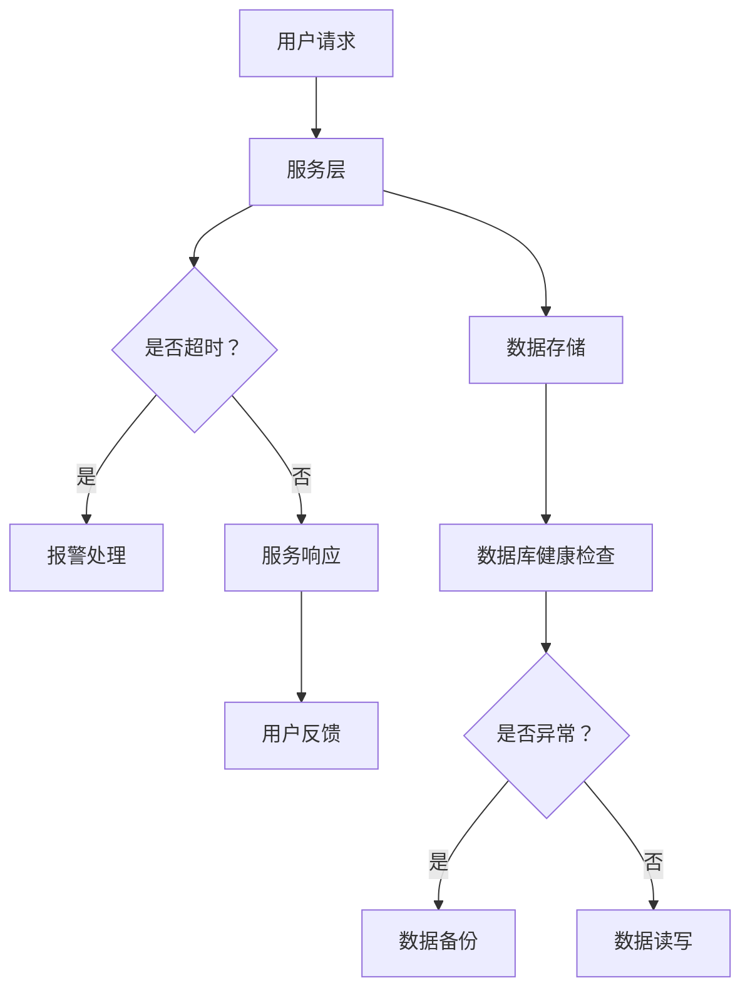

                 

关键词：站点可靠性工程、SRE、系统可靠性、实践、自动化、监控、容量规划

> 摘要：本文将探讨站点可靠性工程（SRE）的核心概念和实践方法，通过深入分析SRE的核心原理和具体操作步骤，揭示如何实现系统的高可靠性和稳定性。文章将结合实际案例，展示SRE在维护网站和系统中的重要作用，并提出未来发展的展望和挑战。

## 1. 背景介绍

随着互联网的快速发展，网站和在线服务的数量急剧增加，用户的期望也越来越高。可靠性成为网站和系统成功的关键因素。然而，传统的运维方式往往难以满足不断增长的需求，容易导致系统故障和用户体验下降。为了解决这个问题，站点可靠性工程（SRE）应运而生。

SRE（Site Reliability Engineering）是一种结合软件开发和系统运维的方法论，旨在确保系统的高可用性和稳定性。SRE的核心目标是通过自动化和监测手段，减少系统故障的发生，提高系统的响应速度和用户体验。与传统运维相比，SRE更加注重预防措施和故障恢复，而不是简单的故障修复。

## 2. 核心概念与联系

### 2.1 核心概念

- **可靠性**：系统在给定条件下，在特定时间内正常运行的概率。
- **稳定性**：系统在遭受干扰或故障时，能够快速恢复并保持正常工作的能力。
- **自动化**：通过编写脚本和工具，自动化执行重复性任务，减少人工干预。
- **监控**：实时监测系统状态，及时发现和解决问题。

### 2.2 架构联系（Mermaid 流程图）



## 3. 核心算法原理 & 具体操作步骤

### 3.1 算法原理概述

SRE的核心算法原理主要包括以下几个方面：

1. **自动化部署**：通过持续集成和持续部署（CI/CD）流程，自动化部署代码和配置。
2. **监控与报警**：使用监控工具，实时监测系统性能和健康状态，并设置报警机制。
3. **容量规划**：根据历史数据和业务需求，预测系统资源需求，并进行相应调整。
4. **故障恢复**：设计故障恢复策略，快速定位和解决故障。

### 3.2 算法步骤详解

1. **需求分析**：确定系统目标、性能指标和故障容忍度。
2. **监控方案设计**：选择合适的监控工具，制定监控策略。
3. **自动化部署**：构建CI/CD流水线，实现自动化部署。
4. **容量规划**：根据业务需求和系统负载，调整资源分配。
5. **故障恢复**：设计故障恢复方案，进行定期演练。

### 3.3 算法优缺点

**优点**：

- 提高系统可靠性：通过自动化和监控，减少人为错误和系统故障。
- 提高开发效率：自动化流程和工具减少重复性工作，提高开发效率。
- 降低运维成本：通过优化资源利用和故障恢复，降低运维成本。

**缺点**：

- 初始投入较大：需要搭建监控和自动化系统，初始投入较大。
- 学习成本高：SRE需要具备软件开发和系统运维的双重技能。

### 3.4 算法应用领域

SRE广泛应用于互联网企业、金融机构和大型企业，例如：

- 电子商务平台：保证交易系统的稳定性和可靠性。
- 金融系统：确保资金交易和数据存储的安全性和稳定性。
- 云服务提供商：提供可靠的云计算服务和资源管理。

## 4. 数学模型和公式 & 详细讲解 & 举例说明

### 4.1 数学模型构建

为了评估系统的可靠性，可以使用以下数学模型：

- **故障率**（λ）：单位时间内发生故障的次数。
- **平均无故障时间**（MTTF）：系统在两个连续故障之间的平均运行时间。
- **平均故障修复时间**（MTTR）：从故障发生到故障解决的平均时间。

### 4.2 公式推导过程

1. **故障率**：
   $$ \lambda = \frac{N_f}{T} $$
   其中，$N_f$ 为故障次数，$T$ 为总运行时间。

2. **平均无故障时间**：
   $$ MTTF = \frac{T}{N_f} $$
   其中，$T$ 为总运行时间，$N_f$ 为故障次数。

3. **平均故障修复时间**：
   $$ MTTR = \frac{T_r}{N_r} $$
   其中，$T_r$ 为故障修复时间，$N_r$ 为故障次数。

### 4.3 案例分析与讲解

假设一个系统的故障率为每天 0.1 次，平均故障修复时间为 2 小时。我们可以计算出：

- **平均无故障时间**：
  $$ MTTF = \frac{T}{N_f} = \frac{24}{0.1} = 240 \text{ 小时} $$

- **平均故障修复时间**：
  $$ MTTR = \frac{T_r}{N_r} = \frac{2}{0.1} = 20 \text{ 小时} $$

这意味着系统平均每 240 小时发生一次故障，每次故障修复需要 20 小时。

## 5. 项目实践：代码实例和详细解释说明

### 5.1 开发环境搭建

本文使用 Python 编写代码，需要安装以下依赖：

```bash
pip install requests prometheus_client
```

### 5.2 源代码详细实现

```python
from flask import Flask, jsonify
from prometheus_client import start_http_server, Summary
import requests

app = Flask(__name__)

# Prometheus metrics
request_duration = Summary('request_duration_seconds', 'Duration of requests')

@app.route('/')
@request_duration.time()
def home():
    try:
        response = requests.get('https://example.com')
        response.raise_for_status()
    except Exception as e:
        return jsonify(error=str(e)), 500
    return jsonify(status='success')

if __name__ == '__main__':
    start_http_server(8000)
    app.run(debug=True)
```

### 5.3 代码解读与分析

- **请求处理**：使用 Flask 框架处理 HTTP 请求。
- **Prometheus 监控**：使用 Prometheus 客户端收集请求持续时间指标。
- **异常处理**：捕获异常并返回相应的 HTTP 状态码。

### 5.4 运行结果展示

启动 Flask 应用后，访问 Prometheus 服务端（默认地址为 `http://localhost:8000/metrics`）可以查看监控数据。

## 6. 实际应用场景

### 6.1 电子商务平台

电子商务平台需要确保购物流程的稳定性和安全性。SRE 可以通过自动化部署和监控，确保系统在高峰期和促销活动中的稳定运行。

### 6.2 金融系统

金融系统对可靠性和安全性要求极高。SRE 可以通过自动化测试和监控，确保交易和数据存储的可靠性。

### 6.3 云服务提供商

云服务提供商需要提供可靠的服务。SRE 可以通过自动化部署和监控，确保服务器和资源的有效利用。

## 7. 工具和资源推荐

### 7.1 学习资源推荐

- 《站点可靠性工程（SRE）实践》：D bitrate 等著
- 《谷歌软件工程艺术》：David 等著

### 7.2 开发工具推荐

- Prometheus：开源监控工具
- Grafana：开源数据可视化和监控工具
- Kubernetes：容器编排工具

### 7.3 相关论文推荐

- "Principles of Site Reliability Engineering"：Google SRE 官方论文

## 8. 总结：未来发展趋势与挑战

### 8.1 研究成果总结

SRE 作为一种新兴的方法论，在互联网企业和大型企业中得到广泛应用。通过自动化和监控，SRE 提高了系统的可靠性和稳定性，降低了运维成本。

### 8.2 未来发展趋势

- **人工智能与 SRE 的结合**：利用机器学习技术，预测系统故障和性能瓶颈。
- **微服务架构**：在微服务架构中，SRE 可以更好地管理和服务。

### 8.3 面临的挑战

- **复杂系统管理**：随着系统规模的增长，SRE 的管理难度也相应增加。
- **技能要求**：SRE 需要具备软件开发和系统运维的双重技能。

### 8.4 研究展望

未来，SRE 将继续发展和完善，为系统可靠性提供更加高效和智能的解决方案。

## 9. 附录：常见问题与解答

### 9.1 SRE 与 DevOps 的区别是什么？

SRE 是 DevOps 的一个子集，专注于系统的可靠性。DevOps 涉及软件开发和运维的各个方面，包括自动化、监控、部署等。

### 9.2 SRE 的核心工具有哪些？

SRE 的核心工具包括 Prometheus、Grafana、Kubernetes 等。

### 9.3 如何评估系统的可靠性？

可以通过故障率、平均无故障时间和平均故障修复时间等指标来评估系统的可靠性。

----------------------------------------------------------------

以上便是《站点可靠性工程（SRE）实践：保持系统可靠》的全文内容。文章详细阐述了 SRE 的核心概念、算法原理、应用场景以及实践案例，并对未来发展趋势和挑战进行了展望。希望本文能对读者在了解和实践 SRE 方面有所帮助。作者：禅与计算机程序设计艺术 / Zen and the Art of Computer Programming。

