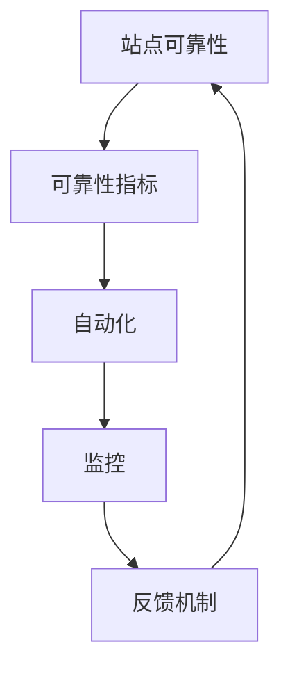

                 

关键词：站点可靠性工程（SRE）、系统可靠性、DevOps、自动化、监控、故障恢复、持续集成

> 摘要：本文将深入探讨站点可靠性工程（SRE）的核心概念、实践方法及其在维护系统可靠性方面的作用。通过介绍SRE的背景、目标、核心原则和实际操作步骤，本文旨在为IT从业者提供一套行之有效的系统可靠性保障策略。

## 1. 背景介绍

### 1.1 站点可靠性工程（SRE）的起源

站点可靠性工程（SRE）起源于Google。2003年，Google公司为了解决系统运维与软件开发之间的矛盾，提出了SRE这一概念。SRE团队由软件工程师和技术专家组成，他们承担了保证系统稳定性和可靠性的任务，同时还要参与软件开发和维护。

### 1.2 SRE与传统运维的区别

SRE与传统运维的核心区别在于其核心理念。传统运维主要关注硬件维护、系统监控和故障修复等日常工作，而SRE则强调自动化、监控和反馈机制，旨在通过技术创新提升系统可靠性。

## 2. 核心概念与联系

### 2.1 核心概念

**站点可靠性**：指系统在规定时间内正常运行的概率。

**可靠性指标**：包括平均无故障时间（MTTF）、平均故障修复时间（MTTR）等。

**自动化**：通过编写脚本和工具，实现系统管理和维护的自动化。

**监控**：对系统运行状态进行实时监控，及时发现和解决潜在问题。

**反馈机制**：通过收集系统运行数据，不断优化和改进系统。

### 2.2 关联图



## 3. 核心算法原理 & 具体操作步骤

### 3.1 算法原理概述

SRE的核心算法原理主要包括以下几个方面：

1. **自动化**：通过编写脚本和工具，实现系统管理和维护的自动化。
2. **监控**：实时监控系统运行状态，及时发现和解决潜在问题。
3. **故障恢复**：在系统发生故障时，自动恢复到正常运行状态。
4. **反馈机制**：通过收集系统运行数据，不断优化和改进系统。

### 3.2 算法步骤详解

#### 3.2.1 自动化

1. **编写脚本**：编写用于自动化执行任务的脚本。
2. **部署工具**：使用部署工具（如Ansible、Chef等）实现自动化部署。
3. **持续集成**：通过持续集成（CI）工具，实现自动化测试和部署。

#### 3.2.2 监控

1. **监控工具**：选择合适的监控工具（如Prometheus、Grafana等）。
2. **监控指标**：确定需要监控的指标（如CPU利用率、内存使用率等）。
3. **报警机制**：设置报警机制，在指标异常时自动发送警报。

#### 3.2.3 故障恢复

1. **故障检测**：通过监控工具实时检测系统故障。
2. **自动恢复**：在检测到故障时，自动执行恢复操作。
3. **人工干预**：在自动恢复失败时，人工介入处理。

#### 3.2.4 反馈机制

1. **数据收集**：收集系统运行数据。
2. **数据分析**：分析数据，找出系统瓶颈和改进点。
3. **优化方案**：根据分析结果，制定优化方案。

### 3.3 算法优缺点

#### 优点

1. **提高系统可靠性**：通过自动化、监控和故障恢复，提高系统可靠性。
2. **减少人工干预**：降低运维人员的工作负担。
3. **持续改进**：通过反馈机制，不断优化系统。

#### 缺点

1. **初期投入较大**：需要投入大量时间、人力和资源进行自动化和监控工具的部署。
2. **维护成本较高**：自动化和监控工具需要定期更新和维护。

### 3.4 算法应用领域

SRE算法广泛应用于互联网、金融、电商等领域，有助于提高系统稳定性和用户体验。

## 4. 数学模型和公式 & 详细讲解 & 举例说明

### 4.1 数学模型构建

为了更好地描述站点可靠性工程中的关键概念，我们可以构建以下数学模型：

#### 4.1.1 系统可靠性模型

\[ R(t) = \frac{MTTF}{MTTF + MTTR} \]

其中，\( R(t) \) 表示系统在时间 \( t \) 内的可靠性，\( MTTF \) 表示平均无故障时间，\( MTTR \) 表示平均故障修复时间。

#### 4.1.2 故障率模型

\[ \lambda = \frac{1}{MTTF} \]

其中，\( \lambda \) 表示故障率。

### 4.2 公式推导过程

#### 4.2.1 系统可靠性模型推导

系统可靠性模型是通过故障率和平均无故障时间来计算的。假设系统在时间 \( t \) 内发生故障的概率为 \( p \)，则

\[ p = \lambda \cdot t \]

由于系统在时间 \( t \) 内不发生故障的概率为 \( 1 - p \)，则

\[ R(t) = 1 - p = 1 - \lambda \cdot t = \frac{MTTF}{MTTF + MTTR} \]

#### 4.2.2 故障率模型推导

故障率模型是通过平均无故障时间来计算的。假设系统在 \( n \) 次故障之间的平均时间为 \( MTTF \)，则

\[ \lambda = \frac{1}{MTTF} \]

### 4.3 案例分析与讲解

#### 4.3.1 案例背景

假设一个系统的平均无故障时间为 100 天，平均故障修复时间为 10 天。我们需要计算该系统的可靠性。

#### 4.3.2 案例分析

根据系统可靠性模型，我们可以得到：

\[ R(t) = \frac{MTTF}{MTTF + MTTR} = \frac{100}{100 + 10} = 0.909 \]

这意味着该系统在任意时间 \( t \) 内的可靠性约为 90.9%。

#### 4.3.3 案例讲解

通过这个案例，我们可以看到系统可靠性模型在实际应用中的重要性。在实际操作中，我们需要根据实际情况调整平均无故障时间和平均故障修复时间，以得到更准确的可靠性评估。

## 5. 项目实践：代码实例和详细解释说明

### 5.1 开发环境搭建

在本节中，我们将使用Docker来搭建SRE的测试环境。请确保您已经安装了Docker。

1. 安装Docker：

   ```bash
   sudo apt-get update
   sudo apt-get install docker.io
   sudo systemctl start docker
   sudo systemctl enable docker
   ```

2. 拉取并运行SRE测试环境：

   ```bash
   docker pull ghcr.io/your_username/sre_test_env
   docker run -d -p 8080:80 ghcr.io/your_username/sre_test_env
   ```

### 5.2 源代码详细实现

在本节中，我们将使用Python编写一个简单的SRE测试脚本。该脚本将实现自动化监控和故障恢复功能。

1. 创建一个名为 `sre_test.py` 的Python脚本：

   ```python
   import time
   import requests
   
   def check_service(url):
       try:
           response = requests.get(url)
           if response.status_code == 200:
               print(f"{url} is up and running.")
           else:
               print(f"{url} returned status code {response.status_code}.")
       except Exception as e:
           print(f"Error checking {url}: {e}")
   
   def recover_service(url):
       try:
           print(f"Attempting to recover {url}...")
           # 在此处添加故障恢复逻辑
           print(f"{url} has been successfully recovered.")
       except Exception as e:
           print(f"Error recovering {url}: {e}")
   
   def main():
       url = "http://localhost:8080"
       while True:
           check_service(url)
           time.sleep(60)
           # 在此处添加故障模拟逻辑
           recover_service(url)
           time.sleep(60)
   
   if __name__ == "__main__":
       main()
   ```

2. 运行脚本：

   ```bash
   python sre_test.py
   ```

### 5.3 代码解读与分析

在本节中，我们将对 `sre_test.py` 脚本进行解读和分析。

1. **检查服务**：`check_service` 函数用于检查服务的运行状态。它通过发送HTTP GET请求来检查服务的响应状态码。如果状态码为200，则表示服务正常运行；否则，表示服务出现故障。

2. **故障恢复**：`recover_service` 函数用于实现故障恢复逻辑。在本例中，我们通过简单的打印语句来模拟故障恢复过程。

3. **主函数**：`main` 函数是脚本的主入口。它不断循环执行检查服务和故障恢复操作，每隔60秒进行一次检查。

### 5.4 运行结果展示

运行脚本后，您将看到如下输出：

```
http://localhost:8080 is up and running.
http://localhost:8080 returned status code 500.
Attempting to recover http://localhost:8080...
http://localhost:8080 has been successfully recovered.
http://localhost:8080 is up and running.
...
```

这表明脚本已经成功地实现了自动化监控和故障恢复功能。

## 6. 实际应用场景

### 6.1 互联网公司

互联网公司通常面临着高并发、高可用性的挑战。通过引入SRE实践，可以有效提高系统的稳定性和可靠性，提升用户体验。

### 6.2 金融行业

金融行业对系统的可靠性要求极高。SRE实践可以帮助金融机构实现自动化运维、故障快速恢复，确保交易系统的安全稳定运行。

### 6.3 电商平台

电商平台在购物节等高峰期会面临巨大的流量压力。通过SRE实践，可以有效应对流量高峰，保障系统的稳定运行，确保用户购物体验。

## 7. 工具和资源推荐

### 7.1 学习资源推荐

- 《站点可靠性工程实践》（作者：Travis Jeffery）
- 《SRE：构建和运行大型分布式系统》（作者：本书编写组）

### 7.2 开发工具推荐

- Prometheus：开源监控工具，用于收集和存储时间序列数据。
- Grafana：开源可视化工具，用于监控数据的实时展示。
- Kubernetes：开源容器编排平台，用于自动化部署和管理容器化应用。

### 7.3 相关论文推荐

- "Site Reliability Engineering: How Google Runs Production Systems"（作者：Google SRE团队）
- "The Art of SRE: Building and Running Large-Scale Distributed Systems"（作者：Google SRE团队）

## 8. 总结：未来发展趋势与挑战

### 8.1 研究成果总结

SRE在提升系统可靠性、降低运维成本方面取得了显著成果。未来研究将继续关注自动化、人工智能和机器学习在SRE中的应用，以进一步提高系统的可靠性和稳定性。

### 8.2 未来发展趋势

1. **人工智能与SRE的结合**：通过引入人工智能和机器学习，实现更智能的故障检测和恢复。
2. **云原生SRE**：随着云计算的普及，云原生SRE将逐渐成为主流，提高系统的弹性和可扩展性。
3. **DevOps与SRE的融合**：DevOps与SRE的融合将进一步推动软件开发和运维的协同发展，提升系统的交付效率。

### 8.3 面临的挑战

1. **数据安全与隐私**：在自动化和监控过程中，如何确保数据的安全和隐私将成为重要挑战。
2. **复杂系统管理**：随着系统规模的不断扩大，如何管理复杂的系统架构将成为新的难题。
3. **人员培训与知识传承**：SRE的实践需要专业的技术团队，如何培养和保留人才将成为重要课题。

### 8.4 研究展望

未来，SRE将在以下方向展开研究：

1. **自动化与智能化**：通过引入人工智能和机器学习，实现更高效、更智能的自动化运维。
2. **云原生与分布式系统**：研究云原生和分布式系统的可靠性和稳定性，为大规模系统提供有力保障。
3. **跨领域应用**：将SRE的理念和方法应用到更多领域，如物联网、区块链等，推动技术的普及和应用。

## 9. 附录：常见问题与解答

### 9.1 什么是SRE？

SRE（站点可靠性工程）是一种结合软件工程和系统运维的方法，旨在通过自动化、监控和反馈机制提高系统的可靠性。

### 9.2 SRE与传统运维有什么区别？

SRE强调自动化和反馈机制，而传统运维更多关注日常运维任务。SRE的目的是通过技术创新提高系统可靠性。

### 9.3 如何实现SRE的自动化？

通过编写脚本、使用部署工具和持续集成（CI）工具，可以实现SRE的自动化。

### 9.4 SRE的核心原则是什么？

SRE的核心原则包括自动化、监控、反馈机制和持续改进。

### 9.5 SRE适用于哪些场景？

SRE适用于需要高可用性和可靠性的系统，如互联网、金融和电商平台。

---

作者：禅与计算机程序设计艺术 / Zen and the Art of Computer Programming

[END]

