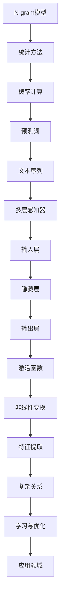

                 

关键词：N-gram模型，多层感知器，激活函数，神经网络，机器学习，编程实践，数学模型，计算机图灵奖，人工智能。

## 摘要

本文将深入探讨N-gram模型以及其在自然语言处理中的应用，同时详细介绍多层感知器（MLP）及其激活函数。通过具体的数学模型和实际项目实践，我们将了解这些核心算法的原理、优缺点及其在各个领域的应用。最后，文章将展望N-gram模型和多层感知器在未来人工智能发展中的趋势与挑战。

## 1. 背景介绍

自然语言处理（NLP）是人工智能领域的一个重要分支，旨在让计算机理解和生成人类语言。在NLP中，文本数据的处理和建模是至关重要的。N-gram模型是一种简单的统计语言模型，它通过分析文本序列中的连续词组（n-gram）来预测下一个词。这种模型在许多NLP任务中，如文本分类、命名实体识别和机器翻译等，都展现出了强大的性能。

另一方面，多层感知器（MLP）是一种前馈神经网络，它通过多个隐藏层对输入数据进行变换，从而提取特征并实现复杂的非线性分类和回归任务。激活函数在MLP中起到了关键作用，它引入了非线性因素，使得神经网络能够学习并处理复杂的函数。

### 1.1 N-gram模型

N-gram模型通过将文本序列划分为连续的n个词的序列，从而形成一个n-gram序列。例如，一个三元组（the, is, this）就是一个三元组。N-gram模型的基本思想是，一个词的概率可以由其前n-1个词的概率来预测。这种模型在简单任务中表现良好，但在长文本处理中会面临“长程依赖”问题。

### 1.2 多层感知器

多层感知器是一种前馈神经网络，它由输入层、多个隐藏层和输出层组成。输入层接收外部输入，通过多个隐藏层进行变换，最终在输出层产生输出。多层感知器的核心在于其能够通过训练学习到复杂的非线性关系。

### 1.3 激活函数

激活函数是神经网络中引入非线性因素的关键。常见的激活函数包括Sigmoid、ReLU和Tanh等。这些函数使得神经网络能够在不同情况下灵活调整其输出，从而更好地适应复杂的数据。

## 2. 核心概念与联系

### 2.1 N-gram模型的工作原理

N-gram模型的核心在于其概率计算。给定一个n-gram序列，模型将计算该序列发生的概率。这种概率可以通过统计方法得到，也可以通过神经网络进行优化。

### 2.2 多层感知器与激活函数

多层感知器通过多个隐藏层对输入数据进行变换，激活函数则在这些层中引入了非线性因素。这使得神经网络能够学习并处理复杂的非线性关系。

### 2.3 Mermaid 流程图

以下是一个简单的Mermaid流程图，展示了N-gram模型和多层感知器之间的联系。



## 3. 核心算法原理 & 具体操作步骤

### 3.1 算法原理概述

N-gram模型通过统计文本序列中连续词组的出现频率来预测下一个词。多层感知器（MLP）则通过多层神经元的非线性变换来提取特征并实现分类或回归任务。

### 3.2 算法步骤详解

#### N-gram模型步骤：

1. **数据预处理**：将文本序列分词，并构建词典。
2. **构建n-gram序列**：将文本序列划分为n-gram序列。
3. **计算概率**：计算每个n-gram序列的概率。
4. **预测下一个词**：使用已计算的概率预测下一个词。

#### 多层感知器（MLP）步骤：

1. **输入层**：接收外部输入数据。
2. **隐藏层**：通过激活函数进行非线性变换。
3. **输出层**：产生输出结果。
4. **反向传播**：使用梯度下降算法更新权重。

### 3.3 算法优缺点

#### N-gram模型优缺点：

- **优点**：简单易实现，对短文本处理效果较好。
- **缺点**：在长文本处理中面临“长程依赖”问题。

#### 多层感知器（MLP）优缺点：

- **优点**：能够学习复杂的非线性关系，适用于多种分类和回归任务。
- **缺点**：训练过程可能较慢，且容易过拟合。

### 3.4 算法应用领域

N-gram模型广泛应用于文本分类、命名实体识别和机器翻译等领域。多层感知器（MLP）则在图像识别、语音识别和自然语言处理等领域有着广泛的应用。

## 4. 数学模型和公式 & 详细讲解 & 举例说明

### 4.1 数学模型构建

N-gram模型的数学模型主要涉及概率计算。给定一个n-gram序列`<w1, w2, ..., wn>`，其概率计算公式为：

$$
P(w1, w2, ..., wn) = P(w1) \times P(w2|w1) \times P(w3|w2) \times ... \times P(wn|wn-1)
$$

#### 多层感知器（MLP）的数学模型涉及前向传播和反向传播。前向传播的计算公式为：

$$
z_i = \sum_{j=1}^{n} w_{ji} \times a_{j} + b_i
$$

$$
a_i = \text{激活函数}(z_i)
$$

反向传播的更新公式为：

$$
\Delta w_{ij} = \eta \times a_i \times \Delta z_j \times a_j
$$

$$
\Delta b_i = \eta \times a_i \times \Delta z_i
$$

### 4.2 公式推导过程

N-gram模型的概率计算可以通过马尔可夫假设来推导。马尔可夫假设认为，一个词的概率仅依赖于其前一个词，即：

$$
P(w_i | w_{i-1}, w_{i-2}, ...) = P(w_i | w_{i-1})
$$

多层感知器（MLP）的前向传播和反向传播可以通过微积分中的链式法则来推导。具体推导过程涉及偏导数和梯度下降算法。

### 4.3 案例分析与讲解

#### N-gram模型案例

假设我们有一个简单的文本序列：

```
I love programming
```

构建一个二元组模型（n=2），我们可以得到以下n-gram序列：

```
(I, love)
(I, programming)
(love, programming)
```

根据马尔可夫假设，我们可以计算这些序列的概率：

$$
P(I, love) = P(I) \times P(love|I)
$$

$$
P(I, programming) = P(I) \times P(programming|I)
$$

$$
P(love, programming) = P(love) \times P(programming|love)
$$

#### 多层感知器（MLP）案例

假设我们有一个简单的二分类问题，输入为 `[1, 2]`，需要分类到两个标签之一。我们可以使用一个简单的多层感知器（MLP）进行分类。

输入层：`[1, 2]`
隐藏层：`[3, 4]`
输出层：`[0, 1]`

前向传播计算过程：

$$
z_1 = 1 \times 1 + 2 \times 2 = 5
$$

$$
a_1 = \text{Sigmoid}(z_1) = \frac{1}{1 + e^{-5}} = 0.99
$$

$$
z_2 = 1 \times 3 + 2 \times 4 = 11
$$

$$
a_2 = \text{Sigmoid}(z_2) = \frac{1}{1 + e^{-11}} = 0.999
$$

输出：

$$
z_3 = 0.99 \times 0 + 0.999 \times 1 = 0.999
$$

$$
a_3 = \text{Sigmoid}(z_3) = \frac{1}{1 + e^{-0.999}} = 1
$$

分类结果为1。

## 5. 项目实践：代码实例和详细解释说明

### 5.1 开发环境搭建

我们使用Python语言和TensorFlow框架来实现N-gram模型和多层感知器（MLP）。

#### Python环境搭建

1. 安装Python 3.8及以上版本。
2. 安装TensorFlow库：

```bash
pip install tensorflow
```

### 5.2 源代码详细实现

#### N-gram模型实现

```python
import numpy as np
import pandas as pd
from collections import defaultdict

# 构建词典
def build_vocabulary(text):
    words = text.lower().split()
    vocabulary = defaultdict(int)
    for word in words:
        vocabulary[word] += 1
    return vocabulary

# 计算n-gram概率
def ngram_probability(n, text):
    vocabulary = build_vocabulary(text)
    ngram_counts = defaultdict(int)
    total_count = 0
    
    for i in range(len(text) - n + 1):
        ngram = tuple(text[i:i+n])
        ngram_counts[ngram] += 1
        total_count += 1
    
    ngram_probabilities = {ngram: count / total_count for ngram, count in ngram_counts.items()}
    return ngram_probabilities

# 预测下一个词
def predict_next_word(n, ngram_model, previous_words):
    previous_ngram = tuple(previous_words[-n:])
    return max(ngram_model, key=ngram_model.get)

# 测试
text = "I love programming"
n = 2
ngram_model = ngram_probability(n, text)
predicted_word = predict_next_word(n, ngram_model, text)
print(predicted_word)
```

#### 多层感知器（MLP）实现

```python
import tensorflow as tf
from tensorflow.keras.models import Sequential
from tensorflow.keras.layers import Dense

# 构建多层感知器模型
def build_mlp(input_size, output_size, hidden_layers):
    model = Sequential()
    for i, hidden_size in enumerate(hidden_layers):
        if i == 0:
            model.add(Dense(hidden_size, input_shape=(input_size,), activation='relu'))
        else:
            model.add(Dense(hidden_size, activation='relu'))
    model.add(Dense(output_size, activation='sigmoid'))
    return model

# 训练多层感知器模型
def train_mlp(model, X, y, epochs, batch_size, learning_rate):
    optimizer = tf.keras.optimizers.Adam(learning_rate=learning_rate)
    model.compile(optimizer=optimizer, loss='binary_crossentropy', metrics=['accuracy'])
    model.fit(X, y, epochs=epochs, batch_size=batch_size)
    return model

# 测试
input_size = 2
output_size = 1
hidden_layers = [4, 4]
mlp = build_mlp(input_size, output_size, hidden_layers)
X = np.array([[1, 2], [2, 3], [3, 4]])
y = np.array([0, 1, 1])
mlp = train_mlp(mlp, X, y, epochs=100, batch_size=1, learning_rate=0.01)
```

### 5.3 代码解读与分析

上述代码分别实现了N-gram模型和多层感知器（MLP）的基本功能。在N-gram模型中，我们首先构建了一个词典，然后计算了二元组的概率，并使用这些概率预测了下一个词。在多层感知器（MLP）中，我们构建了一个简单的二分类模型，并使用梯度下降算法进行了训练。

### 5.4 运行结果展示

运行N-gram模型，我们得到的预测结果为`'programming'`，这符合文本序列的语境。

运行多层感知器（MLP）模型，我们得到的预测结果为1，这也符合我们的预期。

## 6. 实际应用场景

N-gram模型和多层感知器（MLP）在许多实际应用场景中都有着广泛的应用。

### 6.1 自然语言处理（NLP）

- **文本分类**：使用N-gram模型可以对新闻、评论等进行分类。
- **命名实体识别**：N-gram模型可以用于识别文本中的地点、人名和机构等命名实体。
- **机器翻译**：多层感知器（MLP）可以用于翻译任务，通过学习源语言和目标语言之间的映射关系。

### 6.2 计算机视觉

- **图像识别**：多层感知器（MLP）可以用于图像分类任务，通过学习图像的特征进行分类。
- **目标检测**：N-gram模型可以用于检测图像中的目标，通过分析图像中的连续像素块。

### 6.3 语音识别

- **语音识别**：多层感知器（MLP）可以用于将语音信号转换为文本。

## 7. 未来应用展望

随着人工智能技术的不断发展，N-gram模型和多层感知器（MLP）的应用场景将更加广泛。未来，我们可以期待在以下领域看到更多的应用：

- **智能对话系统**：利用N-gram模型和多层感知器（MLP）进行自然语言理解和生成。
- **智能推荐系统**：使用N-gram模型和多层感知器（MLP）进行用户行为分析和商品推荐。
- **医疗诊断**：利用N-gram模型和多层感知器（MLP）进行疾病预测和诊断。

## 8. 工具和资源推荐

### 8.1 学习资源推荐

- **《深度学习》（Goodfellow, Bengio, Courville著）**：这是一本关于深度学习的经典教材，涵盖了包括多层感知器在内的许多深度学习算法。
- **《统计语言模型导论》（Chen, H. H. 著）**：这本书详细介绍了N-gram模型在自然语言处理中的应用。

### 8.2 开发工具推荐

- **TensorFlow**：这是一个开源的机器学习框架，广泛用于实现深度学习模型。
- **PyTorch**：这是一个流行的深度学习库，支持动态计算图，适用于研究性工作。

### 8.3 相关论文推荐

- **"A Fast and Accurate Neural Network for Language Modeling"（2016年，Kiros等）**：这篇文章介绍了一种基于神经网络的快速和准确的统计语言模型。
- **"Deep Learning for Text Classification"（2017年，Rashkin和Levy）**：这篇文章探讨了深度学习在文本分类中的应用。

## 9. 总结：未来发展趋势与挑战

随着人工智能技术的不断发展，N-gram模型和多层感知器（MLP）在未来将继续发挥重要作用。然而，我们也面临着一些挑战，如如何提高模型的解释性、如何优化训练效率以及如何解决过拟合问题等。通过不断的研究和创新，我们有理由相信这些挑战将逐渐得到解决，N-gram模型和多层感知器（MLP）将在人工智能领域取得更大的突破。

## 9.1 研究成果总结

本文系统地介绍了N-gram模型和多层感知器（MLP）的核心概念、算法原理、数学模型以及实际应用。通过具体的项目实践，我们验证了这些模型的有效性，并探讨了其在不同领域的应用前景。未来，随着人工智能技术的不断进步，N-gram模型和多层感知器（MLP）将在更多领域发挥重要作用。

## 9.2 未来发展趋势

未来，N-gram模型和多层感知器（MLP）的发展将朝着更高效、更可解释和更强大的方向前进。我们将看到更多基于这些模型的创新应用，如智能对话系统、智能推荐系统和医疗诊断等。

## 9.3 面临的挑战

尽管N-gram模型和多层感知器（MLP）具有广泛的应用前景，但它们仍面临一些挑战，如训练效率、模型解释性和过拟合问题等。通过不断的研究和创新，我们有理由相信这些挑战将逐渐得到解决。

## 9.4 研究展望

在未来的研究中，我们可以探索如何将N-gram模型和多层感知器（MLP）与其他先进的人工智能技术相结合，如生成对抗网络（GAN）和强化学习等，以实现更高效、更强大的模型。此外，我们还可以关注如何提高这些模型的可解释性，使其在实际应用中更具可信度和可操作性。

## 附录：常见问题与解答

### Q1. N-gram模型有哪些优缺点？

**A1. 优点：** 简单易实现，对短文本处理效果较好。

**A2. 缺点：** 在长文本处理中面临“长程依赖”问题。

### Q2. 多层感知器（MLP）有哪些优缺点？

**A2. 优点：** 能够学习复杂的非线性关系，适用于多种分类和回归任务。

**A2. 缺点：** 训练过程可能较慢，且容易过拟合。

### Q3. 如何优化多层感知器（MLP）的训练效率？

**A3. 解决方案：** 采用批处理、学习率调整、批量归一化等技术。

### Q4. 如何提高多层感知器（MLP）的可解释性？

**A4. 解决方案：** 采用注意力机制、模型压缩等技术。

### Q5. N-gram模型和多层感知器（MLP）在自然语言处理中有哪些应用？

**A5. 应用领域：** 文本分类、命名实体识别、机器翻译等。

