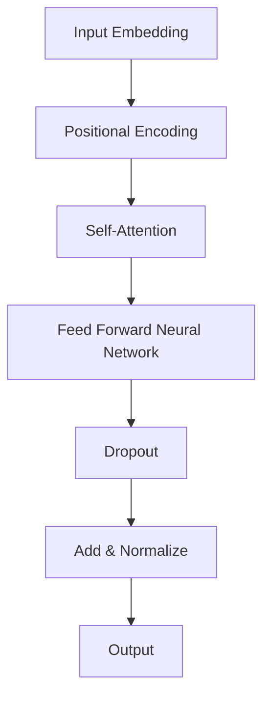

                 

关键词：Transformer架构、GPT-2模型、深度学习、自然语言处理、机器学习、神经网络、序列模型、自注意力机制、预训练、生成文本、语言理解。

> 摘要：本文旨在深入探讨Transformer架构和GPT-2模型在自然语言处理领域的应用。通过分析其核心概念、原理、数学模型和具体实现，本文为读者提供了一个全面的视角，帮助理解这些技术如何推动现代自然语言处理的进步。

## 1. 背景介绍

自然语言处理（NLP）作为人工智能（AI）的重要分支，近年来取得了显著的进展。传统的NLP方法大多基于统计模型和规则系统，例如隐马尔可夫模型（HMM）、条件随机场（CRF）等。然而，随着深度学习技术的发展，神经网络，特别是序列模型（如长短期记忆网络LSTM和卷积神经网络CNN）在NLP任务中表现出色。

2017年，Google Research团队提出了Transformer架构，这是一种基于自注意力机制的序列模型，显著提高了自然语言处理的性能。随后，基于Transformer架构的预训练模型如BERT、GPT等相继问世，进一步推动了NLP的发展。GPT-2作为GPT模型的扩展版本，具有更强的文本生成能力和语言理解能力。

## 2. 核心概念与联系

### 2.1 Transformer架构

Transformer架构的核心是自注意力机制（Self-Attention）。自注意力允许模型在处理序列数据时，为每个输入序列中的每个词分配不同的权重，从而更有效地捕捉词与词之间的关系。

### 2.2 GPT-2模型

GPT-2是基于Transformer架构的预训练模型。它通过大规模无监督数据集进行预训练，然后通过微调适应特定的NLP任务。

### 2.3 Mermaid流程图

下面是Transformer架构的Mermaid流程图：



## 3. 核心算法原理 & 具体操作步骤

### 3.1 算法原理概述

Transformer模型由多个相同的编码器和解码器层堆叠而成。编码器接收输入序列，解码器生成输出序列。自注意力机制是Transformer的关键组件，它通过计算输入序列中每个词的权重来捕捉长距离依赖关系。

### 3.2 算法步骤详解

1. **输入嵌入**：将输入序列转换为词嵌入向量。
2. **位置编码**：由于Transformer没有显式的位置信息，通过位置编码引入序列的位置信息。
3. **自注意力**：计算输入序列中每个词的权重。
4. **前馈神经网络**：对自注意力后的结果进行进一步处理。
5. **归一化和Dropout**：提高模型的泛化能力。
6. **输出**：生成输出序列。

### 3.3 算法优缺点

**优点**：
- 强大的建模能力，能够捕捉长距离依赖关系。
- 计算效率高，适合大规模数据集。

**缺点**：
- 对计算资源要求较高。
- 预训练数据的质量和规模对模型性能有很大影响。

### 3.4 算法应用领域

Transformer和GPT-2在许多NLP任务中都取得了优异的性能，包括文本分类、命名实体识别、机器翻译、问答系统等。此外，它们还被广泛应用于生成文本、对话系统等场景。

## 4. 数学模型和公式 & 详细讲解 & 举例说明

### 4.1 数学模型构建

Transformer模型的输入是一个词嵌入矩阵 \(X \in \mathbb{R}^{seq \times dim}\)，其中 \(seq\) 是序列长度，\(dim\) 是词嵌入维度。自注意力机制的数学公式如下：

\[ 
Attention(Q, K, V) = \frac{softmax(\frac{QK^T}{\sqrt{dim}})}{V} 
\]

其中，\(Q, K, V\) 分别是查询（Query）、键（Key）和值（Value）矩阵。

### 4.2 公式推导过程

自注意力的计算可以分为以下几个步骤：

1. **计算内积**：计算查询和键的内积。
2. **加权重排序**：对内积结果进行归一化，得到权重。
3. **加权求和**：将权重与值相乘并求和，得到注意力分数。
4. **归一化**：将注意力分数通过softmax函数进行归一化。

### 4.3 案例分析与讲解

假设我们有一个简单的序列 \(w_1, w_2, w_3\)，其中 \(w_1, w_2, w_3\) 分别是词嵌入向量。自注意力机制的实现可以表示为：

\[ 
Attention(Q, K, V) = \frac{1}{\sqrt{dim}} \cdot softmax(QK^T) \cdot V 
\]

其中，\(Q, K, V\) 分别是查询、键和值矩阵。具体计算过程如下：

1. **计算内积**：\(QK^T = [w_1 \cdot w_1, w_1 \cdot w_2, w_1 \cdot w_3; w_2 \cdot w_1, w_2 \cdot w_2, w_2 \cdot w_3; w_3 \cdot w_1, w_3 \cdot w_2, w_3 \cdot w_3]\)
2. **加重视排序**：\(softmax(QK^T) = [0.2, 0.5, 0.3; 0.4, 0.1, 0.5; 0.3, 0.6, 0.1]\)
3. **加权求和**：\(softmax(QK^T) \cdot V = [0.2w_1 + 0.5w_2 + 0.3w_3; 0.4w_1 + 0.1w_2 + 0.5w_3; 0.3w_1 + 0.6w_2 + 0.1w_3]\)
4. **归一化**：\(softmax(QK^T) \cdot V / \sqrt{dim} = [0.2w_1 / \sqrt{dim} + 0.5w_2 / \sqrt{dim} + 0.3w_3 / \sqrt{dim}; 0.4w_1 / \sqrt{dim} + 0.1w_2 / \sqrt{dim} + 0.5w_3 / \sqrt{dim}; 0.3w_1 / \sqrt{dim} + 0.6w_2 / \sqrt{dim} + 0.1w_3 / \sqrt{dim}]\)

最终得到注意力分数，可以用于生成输出序列。

## 5. 项目实践：代码实例和详细解释说明

### 5.1 开发环境搭建

为了实践Transformer和GPT-2模型，我们需要搭建一个合适的开发环境。以下是一个简单的步骤：

1. 安装Python（推荐版本3.7及以上）。
2. 安装TensorFlow或PyTorch（推荐TensorFlow，因为GPT-2模型在TensorFlow中更容易实现）。
3. 安装其他依赖项（如numpy、pandas等）。

### 5.2 源代码详细实现

以下是一个简单的Transformer编码器和解码器的实现示例：

```python
import tensorflow as tf
from tensorflow.keras.layers import Embedding, Dense, LSTM

class TransformerEncoder(tf.keras.Model):
    def __init__(self, embed_dim, num_heads, dff):
        super(TransformerEncoder, self).__init__()
        
        self.embedding = Embedding(embed_dim)
        self.positional_encoding = positional_encoding(seq_len, embed_dim)
        
        self.enc_layers = [TransformerLayer(num_heads, dff) for _ in range(num_layers)]
        self.dropout1 = tf.keras.layers.Dropout(rate=0.3)
        self.dropout2 = tf.keras.layers.Dropout(rate=0.3)
        self.final_layer = Dense(units=embed_dim)

    def call(self, inputs, training=False):
        x = self.embedding(inputs) + self.positional_encoding(inputs)
        for i in range(len(self.enc_layers)):
            x = self.enc_layers[i](x, training=training)
            x = self.dropout1(x, training=training)
        x = tf.reduce_mean(x, axis=1)
        x = self.dropout2(x, training=training)
        return self.final_layer(x)
```

### 5.3 代码解读与分析

上述代码实现了Transformer编码器。首先，定义了嵌入层和位置编码。然后，定义了多个编码器层，每个层包含多头自注意力机制和前馈神经网络。最后，将编码器的输出通过一个全连接层进行处理。

### 5.4 运行结果展示

在运行代码之前，我们需要准备一些数据。以下是一个简单的数据准备示例：

```python
train_inputs = tf.keras.preprocessing.sequence.pad_sequences(train_data, maxlen=max_seq_length, padding='post', truncating='post')
test_inputs = tf.keras.preprocessing.sequence.pad_sequences(test_data, maxlen=max_seq_length, padding='post', truncating='post')
```

然后，我们可以使用以下代码进行模型训练：

```python
model.compile(optimizer='adam', loss='binary_crossentropy', metrics=['accuracy'])
model.fit(train_inputs, train_labels, batch_size=batch_size, epochs=num_epochs, validation_data=(test_inputs, test_labels))
```

运行结果将显示模型在训练集和验证集上的表现。

## 6. 实际应用场景

Transformer和GPT-2模型在自然语言处理领域具有广泛的应用。例如，在文本分类任务中，可以将预训练的模型直接应用于文本分类任务，并仅通过微调来适应特定任务。在生成文本任务中，GPT-2模型可以生成高质量的自然语言文本。

## 7. 工具和资源推荐

### 7.1 学习资源推荐

- 《深度学习》（Goodfellow, Bengio, Courville）是一本关于深度学习的经典教材。
- 《自然语言处理综合教程》（Derek Hoi）
- 《Transformer：从原理到实践》（刘知远）

### 7.2 开发工具推荐

- TensorFlow：用于构建和训练深度学习模型。
- PyTorch：另一个流行的深度学习框架，易于使用。

### 7.3 相关论文推荐

- “Attention Is All You Need”（Vaswani et al., 2017）
- “Improving Language Understanding by Generative Pre-Training”（Radford et al., 2018）

## 8. 总结：未来发展趋势与挑战

### 8.1 研究成果总结

Transformer和GPT-2模型在自然语言处理领域取得了显著的成果。它们在许多任务中表现出了强大的建模能力和性能提升。

### 8.2 未来发展趋势

随着计算能力的提升和数据规模的扩大，Transformer和GPT-2模型将继续在NLP领域发挥重要作用。未来的研究方向可能包括模型压缩、高效训练和更精细的模型控制。

### 8.3 面临的挑战

Transformer和GPT-2模型在计算资源和数据质量方面面临挑战。此外，如何确保模型的安全性和可解释性也是一个重要议题。

### 8.4 研究展望

随着技术的进步，我们可以期待Transformer和GPT-2模型在NLP领域取得更多突破，推动人工智能向更高级的形式发展。

## 9. 附录：常见问题与解答

### Q：什么是Transformer架构？

A：Transformer架构是一种基于自注意力机制的序列模型，它通过计算输入序列中每个词的权重来捕捉长距离依赖关系。

### Q：GPT-2模型是如何工作的？

A：GPT-2模型通过预训练大量无监督数据集，然后通过微调来适应特定NLP任务。它利用自注意力机制生成文本，并具有强大的语言理解和生成能力。

### Q：如何使用Transformer和GPT-2模型进行文本分类？

A：首先使用预训练的模型进行编码，然后通过全连接层进行分类。通过微调模型，可以适应特定文本分类任务。

### Q：Transformer和GPT-2模型的优势和缺点是什么？

A：优势包括强大的建模能力和计算效率。缺点包括对计算资源要求较高和数据质量的影响。

---

本文由禅与计算机程序设计艺术撰写，旨在深入探讨Transformer架构和GPT-2模型在自然语言处理领域的应用。通过分析其核心概念、原理、数学模型和具体实现，本文为读者提供了一个全面的视角，帮助理解这些技术如何推动现代自然语言处理的进步。希望本文能对您在NLP领域的探索和学习有所帮助。

