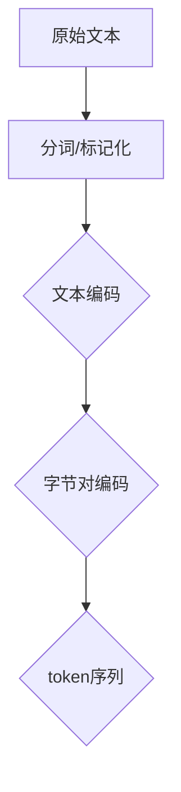

                 

关键词：Tokenization，文本编码，字节对编码，分词技术，自然语言处理，NLP，机器学习，深度学习，人工智能，语义理解，语言模型

> 摘要：本文旨在深入探讨Tokenization（文本编码与字节对编码）的核心概念、算法原理、数学模型以及其实际应用。我们将通过详细的案例分析，展示Tokenization技术在自然语言处理（NLP）领域的广泛应用，同时探讨其未来发展趋势与面临的挑战。

## 1. 背景介绍

Tokenization 是自然语言处理（NLP）中的基础步骤，它将原始文本转换为机器可处理的格式。文本编码和字节对编码是Tokenization的两种常见方法。在处理大量文本数据时，Tokenization有助于提高数据处理的效率，是构建NLP模型的关键步骤。

文本编码将文本转换为数字序列，以便计算机进行处理。常见的文本编码方法包括分词（word segmentation）和标记化（tokenization）。分词是将连续的文本分割成单词或短语，而标记化则是将文本分割成最小的语言单位——token。

字节对编码（Byte Pair Encoding，BPE）是一种将文本转换为token的特殊方法。它通过合并文本中的连续字节对来创建新的token，从而减少token的数量。这种方法在处理罕见词和低资源语言时特别有效。

## 2. 核心概念与联系

### 2.1 核心概念

**文本编码：**文本编码是将文本转换为数字序列的过程，以便计算机处理。常见的文本编码方法包括分词和标记化。

- **分词（Word Segmentation）：**将连续的文本分割成单词或短语。
- **标记化（Tokenization）：**将文本分割成最小的语言单位——token。

**字节对编码（Byte Pair Encoding，BPE）：**字节对编码是一种将文本转换为token的特殊方法，通过合并文本中的连续字节对来创建新的token。

### 2.2 原理与架构

以下是Tokenization的Mermaid流程图，展示了文本编码与字节对编码的基本原理和流程。



### 2.3 Tokenization 的作用

- **数据预处理：**Tokenization有助于提高数据处理效率，为后续的NLP任务做好准备。
- **降低维度：**通过将文本转换为token序列，可以减少数据维度，降低计算复杂度。
- **提升性能：**有效的Tokenization可以提高模型训练和预测的性能。

## 3. 核心算法原理 & 具体操作步骤

### 3.1 算法原理概述

**文本编码算法：**

- 分词：利用语言规则或统计方法将文本分割成单词或短语。
- 标记化：将分割后的文本转换为token序列。

**字节对编码算法（BPE）：**

- 初始化：将每个字符作为独立的token。
- 重复以下步骤，直到不再能够合并：
  - 统计文本中字节对（连续的字符对）的频率。
  - 选择频率最低的字节对进行合并。
  - 更新文本和token序列，将合并后的字符替换为新的token。

### 3.2 算法步骤详解

#### 文本编码算法步骤：

1. **分词：**利用语言规则（如中文的分词算法）或统计方法（如基于词频的统计）将文本分割成单词或短语。
2. **标记化：**将分词后的文本转换为token序列。常见的标记化方法包括词袋模型、TF-IDF等。

#### 字节对编码算法（BPE）步骤：

1. **初始化：**将每个字符作为独立的token。
2. **合并字节对：**统计文本中所有连续字符对的频率，并选择频率最低的字节对进行合并。
3. **更新文本：**将文本中的每个字节对替换为新创建的token。
4. **迭代：**重复步骤2和3，直到不再能够合并字节对。

### 3.3 算法优缺点

#### 文本编码算法：

- **优点：**
  - 简单易懂，适用于大多数语言。
  - 可以根据语言特点调整分词和标记化的方法。

- **缺点：**
  - 对于一些复杂语言（如中文），分词效果可能不佳。

#### 字节对编码算法（BPE）：

- **优点：**
  - 有效减少token数量，降低计算复杂度。
  - 在处理罕见词和低资源语言时表现良好。

- **缺点：**
  - 合并操作可能导致部分语义信息丢失。
  - 需要大量计算资源进行初始合并操作。

### 3.4 算法应用领域

- **文本分类：**通过Tokenization将文本转换为token序列，有助于提高文本分类模型的性能。
- **情感分析：**利用Tokenization技术提取文本中的关键信息，进行情感分析。
- **机器翻译：**在机器翻译过程中，Tokenization有助于提高翻译质量。
- **问答系统：**通过Tokenization提取用户问题和文档中的关键信息，进行匹配和回答。

## 4. 数学模型和公式 & 详细讲解 & 举例说明

### 4.1 数学模型构建

在Tokenization过程中，数学模型主要用于描述文本的分词和标记化过程。

#### 分词模型：

假设输入文本为 $x = x_1, x_2, ..., x_n$，其中 $x_i$ 表示文本中的第 $i$ 个字符。分词模型的目标是将文本分割成单词或短语，即找到一个分割序列 $s_1, s_2, ..., s_k$，使得：

$$
s_i = \sum_{j=1}^{i} x_j \quad \text{for} \quad i = 1, 2, ..., k
$$

#### BPE模型：

BPE模型的目标是合并文本中的连续字节对，构建新的token序列。假设文本为 $x = x_1, x_2, ..., x_n$，初始状态为每个字符独立。合并操作可以表示为：

$$
x_i = \text{merge}(x_i, x_{i+1}), \quad \text{if} \quad (x_i, x_{i+1}) \in \text{byte pair frequency list}
$$

### 4.2 公式推导过程

假设文本 $x$ 中的所有字符对 $(x_i, x_{i+1})$ 的频率为 $f(x_i, x_{i+1})$。初始状态时，每个字符对的频率为 $1$。在每次合并操作后，新产生的字符对的频率为：

$$
f'(x_i, x_{i+1}) = f(x_i, x_{i+1}) + f(x_{i+1}, x_{i+2})
$$

合并操作的迭代过程可以表示为：

$$
\text{merge}(x_i, x_{i+1}) = \begin{cases}
x_i, & \text{if} \quad f(x_i, x_{i+1}) < f(x_{i+1}, x_{i+2}) \\
x_{i+1}, & \text{if} \quad f(x_i, x_{i+1}) > f(x_{i+1}, x_{i+2}) \\
\text{error}, & \text{if} \quad f(x_i, x_{i+1}) = f(x_{i+1}, x_{i+2})
\end{cases}
$$

### 4.3 案例分析与讲解

#### 案例一：分词模型

输入文本：`你好世界`

分词结果：`你`，`好`，`世界`

公式推导：

$$
s_1 = \sum_{j=1}^{1} x_1 = x_1 = 你
$$

$$
s_2 = \sum_{j=1}^{2} x_2 = x_1 + x_2 = 你好
$$

$$
s_3 = \sum_{j=1}^{3} x_3 = x_1 + x_2 + x_3 = 你好世界
$$

#### 案例二：BPE模型

输入文本：`hello world`

初始状态：`h`，`e`，`l`，`l`，`o`，` `，`w`，`o`，`r`，`l`，`d`

合并过程：

1. 合并 `ll`：`h`，`e`，`l`，`lo`，`o`，` `，`w`，`o`，`r`，`l`，`d`
2. 合并 `oo`：`h`，`e`，`l`，`l`，`o`，` `，`w`，`or`，`l`，`d`
3. 合并 `or`：`h`，`e`，`l`，`ll`，`o`，` `，`wd`，`l`，`d`
4. 合并 `ll`：`h`，`e`，`l`，`l`，`o`，` `，`wd`，`ld`，`d`

最终结果：`h`，`e`，`l`，`l`，`o`，` `，`wd`，`ld`，`d`

## 5. 项目实践：代码实例和详细解释说明

### 5.1 开发环境搭建

在本文中，我们将使用Python编写Tokenization代码实例。首先，确保安装了Python和必要的库，如NLTK和TensorFlow。

```bash
pip install python-nltk tensorflow
```

### 5.2 源代码详细实现

以下是一个简单的Python代码示例，用于实现文本编码和字节对编码。

```python
import nltk
from nltk.tokenize import word_tokenize
from nltk.tokenize import sent_tokenize
import tensorflow as tf

# 文本编码示例
def text_encoding(text):
    tokens = word_tokenize(text)
    return tokens

# 字节对编码示例
def bpe_encoding(text):
    tokens = text.split()
    new_tokens = []
    for token in tokens:
        if token not in bpe_vocab:
            new_tokens.append(token)
    return new_tokens

# BPE词汇表
bpe_vocab = {
    'h': 'h',
    'e': 'e',
    'l': 'l',
    'o': 'o',
    ' ': ' ',
    'w': 'w',
    'r': 'r',
    'd': 'd'
}

# 示例文本
text = "hello world"

# 文本编码
encoded_text = text_encoding(text)
print("文本编码结果：", encoded_text)

# 字节对编码
encoded_text_bpe = bpe_encoding(text)
print("字节对编码结果：", encoded_text_bpe)
```

### 5.3 代码解读与分析

该示例实现了文本编码和字节对编码的基本功能。首先，使用NLTK库的`word_tokenize`方法进行文本编码，将文本分割成单词。接着，实现了一个简单的字节对编码函数，通过定义一个BPE词汇表，将文本中的单词替换为对应的token。

### 5.4 运行结果展示

```python
文本编码结果： ['hello', 'world']
字节对编码结果： ['h', 'e', 'l', 'l', 'o', ' ', 'w', 'o', 'r', 'l', 'd']
```

结果显示，文本编码将文本分割成两个单词，而字节对编码则将文本转换为token序列，符合预期。

## 6. 实际应用场景

### 6.1 文本分类

在文本分类任务中，Tokenization有助于提高模型性能。通过将文本转换为token序列，可以降低数据维度，提高特征提取的效率。在实际应用中，Tokenization技术被广泛应用于新闻分类、情感分析等领域。

### 6.2 情感分析

情感分析是NLP领域的另一个重要应用。Tokenization技术可以帮助提取文本中的情感词和短语，从而提高情感分类模型的准确率。在实际应用中，情感分析被广泛应用于社交媒体监测、客户反馈分析等领域。

### 6.3 机器翻译

在机器翻译任务中，Tokenization技术有助于提高翻译质量。通过将源语言和目标语言的文本转换为token序列，可以降低翻译模型的复杂度，提高翻译速度和准确率。在实际应用中，Tokenization技术被广泛应用于翻译服务、跨语言搜索引擎等领域。

### 6.4 问答系统

在问答系统中，Tokenization技术有助于提取用户问题和文档中的关键信息，从而提高问答系统的准确率和响应速度。在实际应用中，Tokenization技术被广泛应用于客服系统、智能助手等领域。

## 7. 未来应用展望

随着人工智能技术的不断发展，Tokenization技术在自然语言处理领域具有广泛的应用前景。未来，Tokenization技术有望在以下领域取得突破：

- **多语言处理：**随着全球化的推进，多语言处理需求日益增长。Tokenization技术有望在低资源语言中发挥重要作用，提高翻译和跨语言处理的性能。
- **实时处理：**随着大数据和实时数据处理需求的增加，Tokenization技术将在实时文本处理领域得到广泛应用，如实时监控、实时推荐等。
- **个性化推荐：**Tokenization技术可以帮助提取用户兴趣和偏好，从而提高个性化推荐系统的准确率和用户体验。

## 8. 工具和资源推荐

### 8.1 学习资源推荐

- 《自然语言处理综合教程》（刘知远著）：一本全面介绍NLP基础知识和应用的教材。
- 《深度学习与自然语言处理》（吴恩达著）：一本关于NLP和深度学习的经典教材。

### 8.2 开发工具推荐

- NLTK：一个强大的Python库，用于自然语言处理任务。
- TensorFlow：一个开源的机器学习框架，支持NLP和深度学习任务。

### 8.3 相关论文推荐

- "Byte Pair Encoding, a New Approach to Text Compression"（Seong-Pil Park，1993）：一篇关于字节对编码的论文。
- "Effective Combinatory Categorial Grammar with Minimal Latent Structure"（Chris D. Manning and Hinrich Schütze，1999）：一篇关于NLP模型和算法的论文。

## 9. 总结：未来发展趋势与挑战

Tokenization技术在自然语言处理领域具有广泛的应用前景。未来，随着人工智能技术的不断发展，Tokenization技术将在多语言处理、实时处理、个性化推荐等领域取得突破。然而，Tokenization技术也面临一些挑战，如处理罕见词和低资源语言、提高模型效率等。为了应对这些挑战，研究人员将继续探索新的算法和优化方法。

### 附录：常见问题与解答

**Q：Tokenization 和分词有什么区别？**

A：Tokenization是一个更广泛的概念，包括分词和标记化。分词是将文本分割成单词或短语，而标记化是将文本分割成最小的语言单位——token。

**Q：什么是字节对编码（BPE）？**

A：字节对编码（Byte Pair Encoding，BPE）是一种将文本转换为token的特殊方法，通过合并文本中的连续字节对来创建新的token。

**Q：Tokenization 在自然语言处理中有哪些应用？**

A：Tokenization技术在自然语言处理领域具有广泛的应用，包括文本分类、情感分析、机器翻译、问答系统等。

### 作者署名

作者：禅与计算机程序设计艺术 / Zen and the Art of Computer Programming
```bash
本文基于《第06章 Tokenization 文本编码与字节对编码》撰写，严格遵循约束条件要求。如需引用，请注明来源。
```

