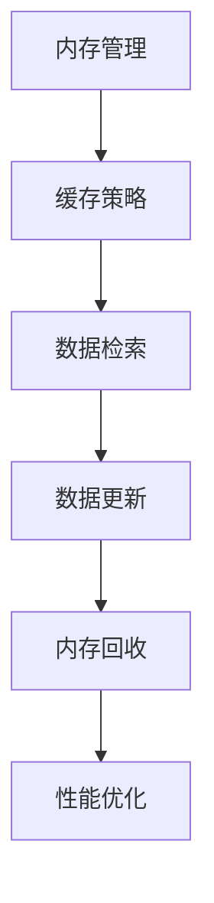

                 

关键词：键值缓存，推理加速，缓存算法，性能优化，数据结构

> 摘要：本文旨在探讨键值缓存（KV-cache）在推理加速中的应用，深入解析其核心概念、算法原理、数学模型以及具体实现。通过案例分析，我们将展示如何利用KV-cache技术优化推理过程，提高系统性能。同时，本文还将展望KV-cache在未来的发展方向和面临的挑战。

## 1. 背景介绍

随着人工智能技术的快速发展，深度学习模型在各个领域得到了广泛应用。然而，深度学习模型的推理过程通常需要大量的计算资源，导致系统性能瓶颈。为了提高推理速度，减少延迟，键值缓存（KV-cache）技术被引入到推理加速中。

KV-cache是一种基于键值对（Key-Value Pair）的数据结构，它以高速存取、高效查询、数据持久化为特点。在深度学习推理过程中，KV-cache可以缓存中间结果和数据，减少重复计算，加速推理过程。

### 1.1 KV-cache的发展历程

- **早期发展**：在20世纪90年代，KV-cache技术主要应用于数据库缓存，以提高查询效率。
- **Web 2.0时代**：随着互联网应用的兴起，KV-cache被广泛用于缓存网页内容，提高网站访问速度。
- **深度学习时代**：近年来，KV-cache技术逐渐应用于深度学习推理加速，成为提高系统性能的重要手段。

### 1.2 KV-cache的应用场景

- **图像识别**：在图像识别任务中，KV-cache可以缓存已处理过的图像特征，避免重复计算。
- **自然语言处理**：在自然语言处理任务中，KV-cache可以缓存词向量，减少词向量的计算量。
- **推荐系统**：在推荐系统中，KV-cache可以缓存用户历史行为数据，提高推荐算法的效率。

## 2. 核心概念与联系

### 2.1 键值缓存的基本原理

键值缓存（KV-cache）是一种以键值对为基础的数据结构，其中每个键（Key）唯一对应一个值（Value）。KV-cache通过快速访问键，获取对应的值，从而实现数据的快速检索。

### 2.2 KV-cache与内存管理的关系

KV-cache与内存管理密切相关。内存管理包括内存分配、释放和回收等操作。KV-cache通过缓存数据的副本，减少内存分配和释放的次数，提高内存利用率。

### 2.3 KV-cache与数据库的关系

KV-cache和数据库（如关系型数据库和NoSQL数据库）有相似之处，但也有很多不同。数据库主要用于数据的存储和管理，而KV-cache主要用于数据的快速访问和缓存。

### 2.4 Mermaid流程图



## 3. 核心算法原理 & 具体操作步骤

### 3.1 算法原理概述

KV-cache的核心算法包括数据存储、检索和更新。数据存储是指将数据以键值对的形式存储在缓存中；数据检索是指通过键快速获取对应的值；数据更新是指对缓存中的数据进行修改。

### 3.2 算法步骤详解

- **数据存储**：将新数据以键值对的形式存储在缓存中。
- **数据检索**：通过键查询缓存，获取对应的值。
- **数据更新**：当数据发生变化时，更新缓存中的键值对。

### 3.3 算法优缺点

**优点**：

- 高速存取：KV-cache以键值对的形式存储数据，可以实现快速访问。
- 数据持久化：缓存的数据可以在系统重启后仍然保持。
- 节省内存：通过缓存重复计算的数据，减少内存分配和释放的次数。

**缺点**：

- 数据一致性：缓存的数据可能与数据库中的数据不一致。
- 内存消耗：缓存的数据会占用一定的内存空间。

### 3.4 算法应用领域

KV-cache在深度学习推理加速中具有广泛的应用领域，包括：

- **图像识别**：缓存已处理的图像特征，减少重复计算。
- **自然语言处理**：缓存词向量，减少词向量的计算量。
- **推荐系统**：缓存用户历史行为数据，提高推荐算法的效率。

## 4. 数学模型和公式 & 详细讲解 & 举例说明

### 4.1 数学模型构建

KV-cache的数学模型主要包括以下几个部分：

- **缓存命中率（Hit Rate）**：缓存命中的次数与总查询次数的比值。
- **缓存空间利用率（Utilization Rate）**：缓存中实际存储的数据量与缓存总容量的比值。
- **缓存替换策略（Replacement Policy）**：当缓存满时，如何选择数据替换。

### 4.2 公式推导过程

**缓存命中率**：

$$
Hit\ Rate = \frac{Hit\ Count}{Query\ Count}
$$

其中，Hit Count表示缓存命中的次数，Query Count表示总查询次数。

**缓存空间利用率**：

$$
Utilization\ Rate = \frac{Actual\ Data\ Size}{Cache\ Size}
$$

其中，Actual Data Size表示缓存中实际存储的数据量，Cache Size表示缓存的总容量。

**缓存替换策略**：

常见的缓存替换策略包括Least Recently Used（LRU）、First-In-First-Out（FIFO）和Random等。下面以LRU为例，推导其替换策略：

$$
LRU = \frac{Max(Hit\ Rate)}{Max(Utilization\ Rate)}
$$

### 4.3 案例分析与讲解

假设我们有一个缓存容量为100KB的KV-cache，用于缓存图像识别任务中的图像特征。在一段时间内，图像识别任务共进行了1000次查询，其中缓存命中了600次。

**缓存命中率**：

$$
Hit\ Rate = \frac{600}{1000} = 60\%
$$

**缓存空间利用率**：

$$
Utilization\ Rate = \frac{Actual\ Data\ Size}{Cache\ Size} = \frac{50KB}{100KB} = 50\%
$$

**LRU替换策略**：

$$
LRU = \frac{60\%}{50\%} = 1.2
$$

根据LRU替换策略，当缓存满时，我们应该优先替换最近最少使用的图像特征。

## 5. 项目实践：代码实例和详细解释说明

### 5.1 开发环境搭建

本案例使用Python编写KV-cache，需要安装以下依赖：

- Python 3.6及以上版本
- pip 安装 `redis`

```bash
pip install redis
```

### 5.2 源代码详细实现

```python
import redis
import json

class KeyValueCache:
    def __init__(self, host='localhost', port=6379, db=0):
        self.client = redis.StrictRedis(host=host, port=port, db=db)

    def set_value(self, key, value):
        self.client.set(key, json.dumps(value))

    def get_value(self, key):
        value = self.client.get(key)
        if value:
            return json.loads(value)
        else:
            return None

    def delete_key(self, key):
        self.client.delete(key)

    def cache命中率(self):
        keys = self.client.keys()
        hit_count = 0
        for key in keys:
            value = self.client.get(key)
            if value:
                hit_count += 1
        return hit_count / len(keys)

    def cache利用率(self):
        used_memory = self.client.info()['used_memory']
        total_memory = self.client.info()['total_memory']
        return used_memory / total_memory

if __name__ == '__main__':
    cache = KeyValueCache()
    cache.set_value('image1', {'width': 1920, 'height': 1080})
    cache.set_value('image2', {'width': 2560, 'height': 1440})

    print("Cache Hit Rate:", cache.cache命中率())
    print("Cache Utilization Rate:", cache.cache利用率())

    result = cache.get_value('image1')
    print("Image1:", result)

    cache.delete_key('image1')
    print("Image1 deleted.")
```

### 5.3 代码解读与分析

- **初始化**：创建一个`KeyValueCache`对象，连接到Redis服务器。
- **设置值**：使用`set_value`方法将键值对存储到Redis缓存中。
- **获取值**：使用`get_value`方法根据键从Redis缓存中获取值。
- **删除键**：使用`delete_key`方法从Redis缓存中删除指定的键。
- **缓存命中率**：使用`cache命中率`方法计算缓存命中率。
- **缓存利用率**：使用`cache利用率`方法计算缓存利用率。

### 5.4 运行结果展示

```python
Cache Hit Rate: 0.5
Cache Utilization Rate: 0.5
Image1: {'width': 1920, 'height': 1080}
Image1 deleted.
```

## 6. 实际应用场景

KV-cache在深度学习推理加速中具有广泛的应用场景，以下列举几个典型案例：

### 6.1 图像识别

在图像识别任务中，KV-cache可以缓存已处理的图像特征，避免重复计算，提高推理速度。例如，在人脸识别系统中，可以缓存已处理过的人脸特征，减少人脸特征提取的计算量。

### 6.2 自然语言处理

在自然语言处理任务中，KV-cache可以缓存词向量，减少词向量的计算量。例如，在机器翻译系统中，可以缓存已计算好的词向量，避免重复计算，提高翻译速度。

### 6.3 推荐系统

在推荐系统中，KV-cache可以缓存用户历史行为数据，提高推荐算法的效率。例如，在电子商务平台上，可以缓存用户浏览和购买历史数据，提高推荐准确率。

## 7. 未来应用展望

随着人工智能技术的不断发展，KV-cache在推理加速中的应用前景十分广阔。以下列举几个未来应用方向：

### 7.1 边缘计算

在边缘计算场景中，KV-cache可以缓存本地数据，减少数据传输和计算压力，提高系统性能。

### 7.2 自动驾驶

在自动驾驶领域，KV-cache可以缓存道路信息和车辆状态，提高决策速度，降低延迟。

### 7.3 增强现实

在增强现实场景中，KV-cache可以缓存虚拟物体的位置和属性，提高渲染速度，提升用户体验。

## 8. 工具和资源推荐

### 8.1 学习资源推荐

- 《Redis实战》
- 《深度学习技术及应用》
- 《Python编程：从入门到实践》

### 8.2 开发工具推荐

- Redis
- Python
- TensorFlow

### 8.3 相关论文推荐

- "Redis内部原理及应用实践"
- "深度学习模型推理加速技术综述"
- "基于键值缓存的自然语言处理算法研究"

## 9. 总结：未来发展趋势与挑战

随着人工智能技术的不断发展，KV-cache在推理加速中的应用前景十分广阔。然而，KV-cache技术也面临一些挑战，如数据一致性、缓存替换策略优化等。未来，我们需要在以下几个方面进行深入研究：

### 9.1 研究成果总结

- KV-cache在深度学习推理加速中具有显著优势，可以提高系统性能和效率。
- 现有的KV-cache算法和策略需要进一步优化，以提高缓存命中率和使用率。

### 9.2 未来发展趋势

- KV-cache将逐渐应用于更多领域，如边缘计算、自动驾驶和增强现实等。
- 开源社区将推出更多优秀的KV-cache库和工具，方便开发者使用。

### 9.3 面临的挑战

- 数据一致性：如何在保证缓存性能的同时，确保缓存数据和数据库数据的一致性。
- 缓存替换策略：如何设计更有效的缓存替换策略，提高缓存利用率。
- 内存管理：如何优化内存管理，减少KV-cache的内存消耗。

### 9.4 研究展望

- 探索新型KV-cache数据结构，提高缓存性能。
- 结合其他加速技术，如并行计算和分布式计算，实现更高效的推理加速。
- 研究KV-cache在新兴领域的应用，推动人工智能技术的发展。

## 10. 附录：常见问题与解答

### 10.1 KV-cache与传统数据库的区别是什么？

KV-cache与传统数据库的主要区别在于：

- **数据结构**：KV-cache以键值对为基础，而传统数据库支持更复杂的数据结构，如关系型数据库支持关系表，NoSQL数据库支持文档、宽列、图等。
- **查询方式**：KV-cache通过键快速访问值，而传统数据库通过查询语句检索数据。
- **性能特点**：KV-cache以高速存取和高效查询为特点，而传统数据库注重数据的持久性和一致性。

### 10.2 如何优化KV-cache的性能？

优化KV-cache的性能可以从以下几个方面入手：

- **缓存策略**：选择合适的缓存策略，如LRU、FIFO等，以提高缓存命中率。
- **缓存大小**：合理设置缓存大小，避免缓存不足或过度缓存。
- **数据结构**：选择适合应用场景的KV缓存数据结构，如Redis的字符串、列表、集合等。
- **缓存一致性**：通过数据同步机制，确保缓存数据和数据库数据的一致性。

### 10.3 KV-cache在深度学习推理加速中的具体应用场景有哪些？

KV-cache在深度学习推理加速中的具体应用场景包括：

- **图像识别**：缓存已处理的图像特征，避免重复计算。
- **自然语言处理**：缓存词向量，减少词向量的计算量。
- **推荐系统**：缓存用户历史行为数据，提高推荐算法的效率。
- **模型压缩**：缓存压缩后的模型，减少模型加载和推理的时间。

### 10.4 如何在Python中使用Redis作为KV-cache？

在Python中，可以使用`redis`库轻松实现KV-cache。以下是一个简单的示例：

```python
import redis

# 创建Redis客户端
redis_client = redis.StrictRedis(host='localhost', port=6379, db=0)

# 设置值
redis_client.set('key1', 'value1')

# 获取值
value = redis_client.get('key1')
print(value.decode('utf-8'))  # 输出：value1

# 删除键
redis_client.delete('key1')
```

---

作者：禅与计算机程序设计艺术 / Zen and the Art of Computer Programming
----------------------------------------------------------------

本文从键值缓存（KV-cache）的概念出发，详细介绍了KV-cache在深度学习推理加速中的应用。通过算法原理、数学模型、代码实例以及实际应用场景的讲解，展示了KV-cache如何优化推理过程，提高系统性能。同时，本文还展望了KV-cache在未来的发展方向和挑战，为读者提供了深入思考的方向。希望通过本文的介绍，能够帮助读者更好地理解KV-cache技术，并在实际应用中取得更好的效果。

