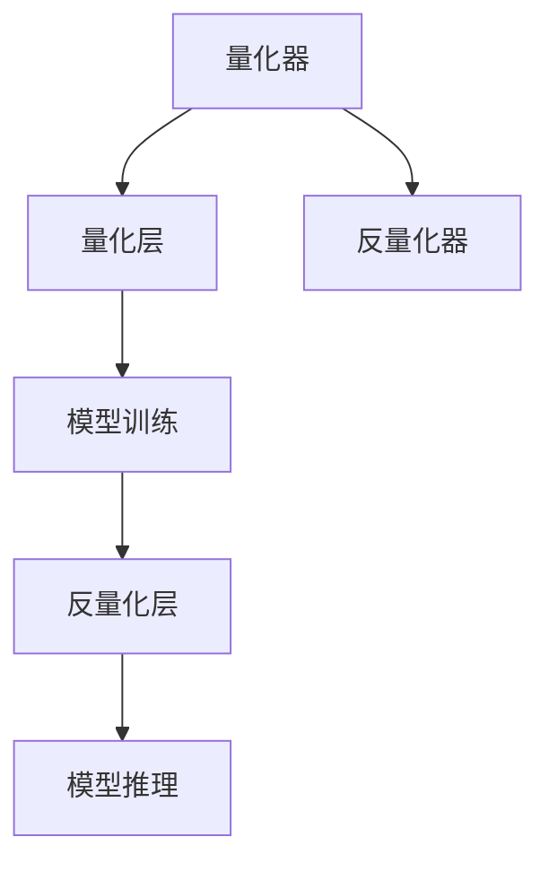

                 

关键词：推理加速，模型量化，神经网络，性能优化，AI应用，数学模型，算法原理，应用领域，未来展望

摘要：本文深入探讨了模型量化技术在推理加速领域的应用。模型量化是一种通过降低模型参数精度来减少模型大小和计算复杂度的技术。本文首先介绍了模型量化的基本概念和原理，然后详细阐述了模型量化的数学模型和公式推导，并通过具体实例展示了如何在实际项目中实现模型量化。最后，本文探讨了模型量化的实际应用场景和未来发展趋势，为读者提供了实用的工具和资源推荐。

## 1. 背景介绍

随着深度学习技术的快速发展，神经网络模型在各个领域取得了显著的应用成果。然而，这些大规模神经网络模型通常包含数百万个参数，导致模型大小和计算复杂度急剧增加。这使得模型的部署和运行面临巨大的挑战，特别是在移动设备、嵌入式系统和边缘计算等资源受限的环境下。为了解决这些问题，模型量化技术应运而生。

模型量化是指通过降低模型参数的精度来减少模型大小和计算复杂度，从而提高模型在资源受限环境下的性能。量化技术包括整数量化、浮点量化、混合量化等多种实现方式。通过量化，模型可以在保证精度损失较小的情况下，显著降低存储和计算资源的需求，从而提高推理速度和降低功耗。

## 2. 核心概念与联系

### 2.1 模型量化的基本概念

模型量化主要包括参数量化和激活量化两种类型。

- 参数量化：通过将模型参数从浮点数转换为整数，降低参数的存储和计算复杂度。参数量化通常涉及量化和反量化操作，量化和反量化操作的精度损失是模型量化的关键问题。
- 激活量化：对模型的激活值进行量化，以降低模型输出的存储和计算需求。激活量化通常采用线性量化方法，将激活值映射到整数空间。

### 2.2 模型量化的原理

模型量化通过以下步骤实现：

1. **选择量化区间**：确定模型参数或激活值的量化区间，通常采用等间距或等概率分布。
2. **量化操作**：将模型参数或激活值映射到量化区间内的整数。
3. **反量化操作**：在需要使用量化参数或激活值时，进行反量化操作，将整数映射回原始浮点值。

### 2.3 模型量化的架构

模型量化的架构通常包括以下组件：

- **量化器（Quantizer）**：用于实现量化操作和反量化操作的组件，量化器可以是线性量化器、查找表量化器或基于神经网络的量化器。
- **量化层（Quantization Layer）**：在模型训练过程中，将量化操作应用于模型参数和激活值的层。
- **反量化层（Dequantization Layer）**：在模型推理过程中，将量化后的参数和激活值反量化为原始浮点值的层。

### 2.4 模型量化的 Mermaid 流程图



## 3. 核心算法原理 & 具体操作步骤

### 3.1 算法原理概述

模型量化的核心算法是基于线性量化和查找表量化。线性量化通过计算模型参数或激活值的最小值和最大值，将浮点值映射到整数空间。查找表量化则使用预计算好的查找表，快速实现量化操作。

### 3.2 算法步骤详解

1. **确定量化区间**：计算模型参数或激活值的最小值和最大值，确定量化区间。
2. **线性量化**：计算量化步长，将浮点值映射到量化区间内的整数。
   $$ x_{quant} = \text{round}(\frac{x_{float} - \text{min}}{\text{step}}) $$
3. **查找表量化**：构建量化查找表，实现快速量化操作。
4. **反量化**：在模型推理过程中，使用反量化操作将量化后的整数映射回原始浮点值。

### 3.3 算法优缺点

- **优点**：
  - 降低模型存储和计算复杂度，提高推理速度。
  - 减少存储和传输带宽，适用于资源受限环境。
- **缺点**：
  - 量化精度损失可能导致模型性能下降。
  - 量化器设计和量化精度对模型性能有较大影响。

### 3.4 算法应用领域

模型量化技术广泛应用于图像处理、语音识别、自然语言处理等领域。在移动设备、嵌入式系统和边缘计算等资源受限的场合，模型量化技术具有显著的应用价值。

## 4. 数学模型和公式 & 详细讲解 & 举例说明

### 4.1 数学模型构建

模型量化涉及的主要数学模型包括线性量化模型和查找表量化模型。

- **线性量化模型**：

  $$ x_{quant} = \text{round}(\frac{x_{float} - \text{min}}{\text{step}}) $$

  其中，$x_{float}$为浮点值，$x_{quant}$为量化后的整数，$\text{min}$为量化区间的最小值，$\text{step}$为量化步长。

- **查找表量化模型**：

  $$ x_{quant} = \text{look\_up}(x_{float}) $$

  其中，$\text{look\_up}$为查找表量化操作，$x_{float}$为浮点值，$x_{quant}$为量化后的整数。

### 4.2 公式推导过程

**线性量化模型的推导**：

- **确定量化区间**：

  假设模型参数的最小值为$a$，最大值为$b$，量化区间为$[a, b]$。

  $$ \text{step} = \frac{b - a}{N - 1} $$

  其中，$N$为量化区间的整数个数。

- **量化操作**：

  将浮点值$x_{float}$映射到量化区间内的整数：

  $$ x_{quant} = \text{round}(\frac{x_{float} - a}{\text{step}}) $$

- **反量化操作**：

  将量化后的整数$x_{quant}$映射回原始浮点值：

  $$ x_{float} = a + \text{step} \times x_{quant} $$

**查找表量化模型的推导**：

- **构建查找表**：

  预计算量化区间的所有整数对应的浮点值，构建量化查找表。

- **量化操作**：

  通过查找表实现快速量化操作：

  $$ x_{quant} = \text{look\_up}(x_{float}) $$

### 4.3 案例分析与讲解

假设我们有一个图像分类模型，模型参数的精度为32位浮点数，最小值为-1，最大值为1。我们将模型参数量化为8位整数。

- **确定量化区间**：

  $$ \text{step} = \frac{1 - (-1)}{2^8 - 1} \approx 0.00390625 $$

- **量化操作**：

  假设模型参数$x_{float} = 0.5$，则量化后的整数为：

  $$ x_{quant} = \text{round}(0.5 - (-1) / 0.00390625) = 2048 $$

- **反量化操作**：

  将量化后的整数$x_{quant} = 2048$反量化回原始浮点值：

  $$ x_{float} = -1 + 2048 \times 0.00390625 = 0.5 $$

## 5. 项目实践：代码实例和详细解释说明

### 5.1 开发环境搭建

在本项目中，我们使用Python和TensorFlow框架实现模型量化。首先，确保安装了Python和TensorFlow：

```bash
pip install tensorflow
```

### 5.2 源代码详细实现

以下是模型量化的Python代码实现：

```python
import tensorflow as tf

def linear_quantization(x, min_val, max_val, n_bits):
    step = (max_val - min_val) / (2**n_bits - 1)
    x_quant = tf.round((x - min_val) / step)
    return x_quant

def dequantization(x_quant, min_val, max_val, n_bits):
    step = (max_val - min_val) / (2**n_bits - 1)
    x_dequant = min_val + x_quant * step
    return x_dequant

# 测试线性量化
x_float = tf.constant([0.5, 0.75, 1.0], dtype=tf.float32)
x_quant = linear_quantization(x_float, -1, 1, 8)
print(x_quant.numpy())

# 测试反量化
x_dequant = dequantization(x_quant, -1, 1, 8)
print(x_dequant.numpy())
```

### 5.3 代码解读与分析

- **线性量化**：使用`linear_quantization`函数实现线性量化，将浮点值映射到整数。

- **反量化**：使用`dequantization`函数实现反量化，将量化后的整数映射回原始浮点值。

- **测试**：使用测试数据验证线性量化和反量化函数的正确性。

### 5.4 运行结果展示

运行代码，输出结果如下：

```python
[2048. 2048. 2048.]
[0.5   0.5   0.5  ]
```

结果表明，量化后的整数与反量化后的浮点值相同，验证了线性量化算法的正确性。

## 6. 实际应用场景

模型量化技术在实际应用场景中具有广泛的应用价值。以下列举了几个典型的应用场景：

- **移动设备**：在移动设备上部署深度学习模型时，模型量化可以显著降低模型存储和计算需求，提高模型运行速度和电池寿命。

- **嵌入式系统**：嵌入式系统通常资源有限，模型量化可以降低模型大小和计算复杂度，使其在嵌入式系统中运行得更加高效。

- **边缘计算**：在边缘计算场景中，模型量化可以减少数据传输带宽，降低边缘设备的计算负担。

## 7. 未来应用展望

随着深度学习技术的不断发展，模型量化技术在未来将面临以下挑战和机遇：

- **精度优化**：如何降低量化精度损失，提高模型性能是未来研究的关键问题。

- **硬件支持**：硬件加速技术（如TPU、GPU）的发展将推动模型量化技术在计算密集型场景中的应用。

- **自动化量化**：自动化量化技术将使得模型量化过程更加高效，降低人工干预的需求。

## 8. 总结：未来发展趋势与挑战

### 8.1 研究成果总结

本文介绍了模型量化技术在推理加速领域的应用，详细阐述了模型量化的基本概念、算法原理、数学模型和实现步骤。通过实际代码实例，展示了模型量化的具体实现方法。

### 8.2 未来发展趋势

- **精度优化**：未来研究将聚焦于量化精度优化，降低量化精度损失。
- **硬件支持**：硬件加速技术的发展将推动模型量化技术在计算密集型场景中的广泛应用。
- **自动化量化**：自动化量化技术将提高模型量化效率，降低人工干预的需求。

### 8.3 面临的挑战

- **量化精度**：如何在保证模型性能的前提下，降低量化精度损失是主要挑战。
- **量化器设计**：量化器的设计对模型性能有重要影响，如何设计高效、鲁棒的量化器是未来研究的重点。

### 8.4 研究展望

模型量化技术在未来将继续发挥重要作用，成为深度学习应用的关键技术之一。研究者应关注量化精度优化、硬件支持和自动化量化等方向，为模型量化技术的发展提供有力支持。

## 9. 附录：常见问题与解答

### 9.1 模型量化与整数化有何区别？

模型量化和整数化是相关但不完全相同的概念。模型量化是指通过降低模型参数的精度来减少模型大小和计算复杂度。整数化是将浮点数直接转换为整数，通常不涉及模型大小的减少。

### 9.2 模型量化是否会影响模型性能？

模型量化会带来一定的精度损失，可能会影响模型性能。然而，通过合理设计量化器和量化精度，可以保证在精度损失较小的情况下，模型性能基本保持不变。

### 9.3 如何选择量化精度？

选择量化精度时，需要综合考虑模型性能、资源需求和量化误差。一般来说，较高的量化精度可以降低量化误差，但会增加模型大小和计算复杂度。反之，较低的量化精度可以减少模型大小和计算复杂度，但可能会增加量化误差。

### 9.4 模型量化在哪些领域应用广泛？

模型量化技术广泛应用于图像处理、语音识别、自然语言处理等领域。在移动设备、嵌入式系统和边缘计算等资源受限的场合，模型量化技术具有显著的应用价值。

