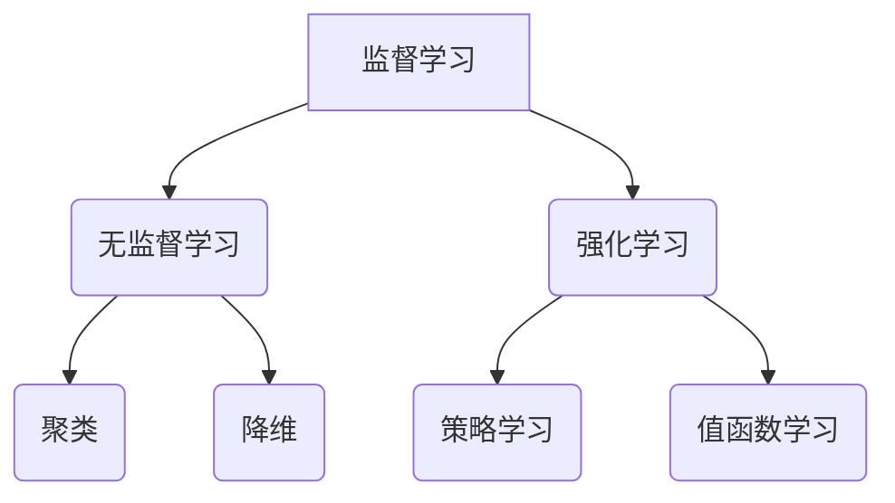

                 

关键词：机器学习，算法原理，应用领域，数学模型，代码实例，未来展望

摘要：本文旨在深入探讨机器学习领域中的核心算法和技术，包括其原理、数学模型、具体操作步骤、应用领域以及未来展望。通过详细的解析和案例说明，为读者提供全面的机器学习技术指南。

## 1. 背景介绍

随着互联网和大数据技术的发展，机器学习作为人工智能的一个重要分支，已经广泛应用于各个领域。从图像识别到自然语言处理，从推荐系统到无人驾驶，机器学习技术正不断改变着我们的生活方式。本章节将重点介绍机器学习中的核心算法和技术，帮助读者了解这一领域的最新进展和应用。

### 2. 核心概念与联系

#### 2.1 定义

机器学习（Machine Learning，ML）是一门研究如何让计算机从数据中学习、自动改进和做出决策的学科。它基于统计学、概率论、线性代数、优化理论等数学理论，利用算法从数据中提取特征，构建模型，并使其能够对新数据做出预测或决策。

#### 2.2 关联概念

- **监督学习（Supervised Learning）**：有标注的数据集作为输入，通过学习输入与输出之间的关系，预测未知数据的输出。
- **无监督学习（Unsupervised Learning）**：没有标注的数据集作为输入，通过挖掘数据内在的结构和模式，对数据进行聚类、降维等处理。
- **强化学习（Reinforcement Learning）**：通过与环境交互，学习最优策略以最大化累积奖励。

### 2.3 Mermaid 流程图



## 3. 核心算法原理 & 具体操作步骤

### 3.1 算法原理概述

#### 3.1.1 监督学习

监督学习算法通常分为回归（Regression）和分类（Classification）两种。

- **回归**：输出为连续值，目标是预测一个或多个连续的数值。
- **分类**：输出为离散值，目标是预测一个或多个类别的概率。

#### 3.1.2 无监督学习

无监督学习算法主要包括聚类（Clustering）和降维（Dimensionality Reduction）。

- **聚类**：将数据集划分为若干个组，使得组内数据相似度较高，组间数据相似度较低。
- **降维**：通过投影或其他方法减少数据维度，同时保留数据的重要信息。

#### 3.1.3 强化学习

强化学习算法的核心是策略学习（Policy Learning）和值函数学习（Value Function Learning）。

- **策略学习**：学习一个策略函数，将状态映射到行动，最大化累积奖励。
- **值函数学习**：学习一个值函数，评估策略在给定状态下的长期预期奖励。

### 3.2 算法步骤详解

#### 3.2.1 监督学习

1. 数据预处理：清洗数据，处理缺失值，归一化等。
2. 特征提取：从原始数据中提取有助于模型预测的特征。
3. 模型选择：选择合适的回归或分类模型，如线性回归、决策树、支持向量机等。
4. 模型训练：使用训练数据集训练模型。
5. 模型评估：使用验证数据集评估模型性能，调整模型参数。
6. 模型部署：将训练好的模型应用于实际数据，进行预测或决策。

#### 3.2.2 无监督学习

1. 数据预处理：清洗数据，处理缺失值，归一化等。
2. 特征提取：提取有助于聚类或降维的特征。
3. 模型选择：选择合适的聚类或降维算法，如K-means、PCA等。
4. 模型训练：使用算法对数据集进行处理。
5. 模型评估：评估聚类效果或降维效果。
6. 模型应用：将处理结果应用于实际场景，如数据分析、可视化等。

#### 3.2.3 强化学习

1. 环境设定：定义状态空间、行动空间和奖励机制。
2. 策略初始化：初始化策略或值函数。
3. 模型训练：通过与环境交互，更新策略或值函数。
4. 模型评估：评估策略或值函数的性能。
5. 模型优化：根据评估结果调整模型参数。
6. 模型部署：将训练好的模型应用于实际场景，如智能决策、无人驾驶等。

### 3.3 算法优缺点

#### 3.3.1 监督学习

- **优点**：预测准确度高，可应用于多种实际问题。
- **缺点**：需要大量标注数据，训练过程可能较慢。

#### 3.3.2 无监督学习

- **优点**：不需要标注数据，适用于探索性数据分析。
- **缺点**：聚类效果和降维效果可能不稳定。

#### 3.3.3 强化学习

- **优点**：可处理动态环境和长期决策问题。
- **缺点**：训练过程复杂，需要大量计算资源。

### 3.4 算法应用领域

- **监督学习**：金融风险评估、医学诊断、图像识别等。
- **无监督学习**：数据挖掘、社交网络分析、图像增强等。
- **强化学习**：无人驾驶、游戏AI、智能家居等。

## 4. 数学模型和公式 & 详细讲解 & 举例说明

### 4.1 数学模型构建

#### 4.1.1 监督学习

1. **线性回归**：

   $$y = \beta_0 + \beta_1x$$

   其中，$y$ 是预测值，$x$ 是输入特征，$\beta_0$ 和 $\beta_1$ 是模型参数。

2. **逻辑回归**：

   $$\hat{y} = \frac{1}{1 + e^{-(\beta_0 + \beta_1x)}}$$

   其中，$\hat{y}$ 是预测的概率值，$x$ 是输入特征，$\beta_0$ 和 $\beta_1$ 是模型参数。

#### 4.1.2 无监督学习

1. **K-means聚类**：

   $$\text{簇中心} = \frac{1}{N}\sum_{i=1}^{N}x_i$$

   其中，$x_i$ 是数据点，$N$ 是数据点总数。

2. **主成分分析（PCA）**：

   $$Z = P\Lambda$$

   其中，$Z$ 是降维后的数据，$P$ 是特征空间到降维空间的投影矩阵，$\Lambda$ 是特征值矩阵。

#### 4.1.3 强化学习

1. **Q-learning**：

   $$Q(s, a) = Q(s, a) + \alpha [r + \gamma \max_{a'} Q(s', a') - Q(s, a)]$$

   其中，$s$ 是状态，$a$ 是行动，$r$ 是即时奖励，$\gamma$ 是折扣因子，$\alpha$ 是学习率。

### 4.2 公式推导过程

#### 4.2.1 线性回归

1. 假设数据集 $D = \{(x_1, y_1), (x_2, y_2), ..., (x_n, y_n)\}$，其中 $x_i$ 和 $y_i$ 分别表示输入特征和输出值。
2. 构建线性回归模型 $y = \beta_0 + \beta_1x$。
3. 使用最小二乘法求解模型参数 $\beta_0$ 和 $\beta_1$。

   $$\beta_0 = \bar{y} - \beta_1\bar{x}$$

   $$\beta_1 = \frac{\sum_{i=1}^{n}(x_i - \bar{x})(y_i - \bar{y})}{\sum_{i=1}^{n}(x_i - \bar{x})^2}$$

#### 4.2.2 逻辑回归

1. 假设数据集 $D = \{(x_1, y_1), (x_2, y_2), ..., (x_n, y_n)\}$，其中 $x_i$ 和 $y_i$ 分别表示输入特征和输出值。
2. 构建逻辑回归模型 $\hat{y} = \frac{1}{1 + e^{-(\beta_0 + \beta_1x)}}$。
3. 使用极大似然估计法求解模型参数 $\beta_0$ 和 $\beta_1$。

   $$L(\beta_0, \beta_1) = \prod_{i=1}^{n}\frac{1}{1 + e^{-(\beta_0 + \beta_1x_i)}}$$

   $$\log L(\beta_0, \beta_1) = \sum_{i=1}^{n}\log\frac{1}{1 + e^{-(\beta_0 + \beta_1x_i)}}$$

   对 $\beta_0$ 和 $\beta_1$ 分别求偏导，并令其等于0，得到：

   $$\frac{\partial \log L}{\partial \beta_0} = \sum_{i=1}^{n}y_i - \sum_{i=1}^{n}\hat{y}_i = 0$$

   $$\frac{\partial \log L}{\partial \beta_1} = \sum_{i=1}^{n}(x_i - \bar{x})(y_i - \bar{y}) = 0$$

#### 4.2.3 K-means聚类

1. 初始化 $k$ 个簇中心 $c_1, c_2, ..., c_k$。
2. 对于每个数据点 $x_i$，计算其到簇中心的距离，并将其分配到最近的簇。
3. 更新簇中心为所有数据点的均值。

   $$c_j = \frac{1}{N_j}\sum_{i=1}^{N}x_i$$

   其中，$N_j$ 是簇 $j$ 中的数据点数量。

#### 4.2.4 主成分分析（PCA）

1. 将数据标准化为均值为0，方差为1的协方差矩阵 $C$。

   $$C = \frac{1}{n}\sum_{i=1}^{n}(x_i - \bar{x})(x_i - \bar{x})^T$$

2. 求解特征值和特征向量，将特征向量作为投影矩阵 $P$。

   $$P = \{v_1, v_2, ..., v_d\}$$

   其中，$v_i$ 是第 $i$ 个特征向量。

3. 对数据点进行投影：

   $$Z = PX$$

### 4.3 案例分析与讲解

#### 4.3.1 线性回归

假设我们有一个数据集，包含房子面积和房子价格的关系。我们希望使用线性回归模型预测未知房子价格。

1. 数据预处理：将数据集进行归一化处理，使得特征值范围在0到1之间。
2. 特征提取：只选择房子面积作为特征。
3. 模型选择：选择线性回归模型。
4. 模型训练：使用训练数据集训练模型，求解参数 $\beta_0$ 和 $\beta_1$。
5. 模型评估：使用验证数据集评估模型性能，计算预测误差。
6. 模型部署：将训练好的模型应用于实际数据，进行房子价格预测。

具体代码实现如下：

```python
import numpy as np
import pandas as pd
from sklearn.linear_model import LinearRegression

# 加载数据集
data = pd.read_csv('house_price_data.csv')
X = data[['house_area']]
y = data['price']

# 数据预处理
X = (X - X.mean()) / X.std()

# 模型训练
model = LinearRegression()
model.fit(X, y)

# 模型评估
predictions = model.predict(X)
mse = np.mean((predictions - y) ** 2)
print('MSE:', mse)

# 模型部署
new_data = pd.DataFrame({'house_area': [1500]})
new_data = (new_data - new_data.mean()) / new_data.std()
predicted_price = model.predict(new_data)
print('Predicted Price:', predicted_price)
```

#### 4.3.2 逻辑回归

假设我们有一个数据集，包含客户购买商品的记录。我们希望使用逻辑回归模型预测客户是否会购买商品。

1. 数据预处理：将数据集进行归一化处理，使得特征值范围在0到1之间。
2. 特征提取：选择客户年龄、收入、购物车数量等特征。
3. 模型选择：选择逻辑回归模型。
4. 模型训练：使用训练数据集训练模型，求解参数 $\beta_0$ 和 $\beta_1$。
5. 模型评估：使用验证数据集评估模型性能，计算准确率。
6. 模型部署：将训练好的模型应用于实际数据，进行购买预测。

具体代码实现如下：

```python
import numpy as np
import pandas as pd
from sklearn.linear_model import LogisticRegression
from sklearn.model_selection import train_test_split
from sklearn.metrics import accuracy_score

# 加载数据集
data = pd.read_csv('customer_data.csv')
X = data[['age', 'income', 'cart_size']]
y = data['purchase']

# 数据预处理
X = (X - X.mean()) / X.std()

# 模型训练
X_train, X_test, y_train, y_test = train_test_split(X, y, test_size=0.2, random_state=42)
model = LogisticRegression()
model.fit(X_train, y_train)

# 模型评估
predictions = model.predict(X_test)
accuracy = accuracy_score(y_test, predictions)
print('Accuracy:', accuracy)

# 模型部署
new_data = pd.DataFrame({'age': [30], 'income': [50000], 'cart_size': [20]})
new_data = (new_data - new_data.mean()) / new_data.std()
predicted_purchase = model.predict(new_data)
print('Predicted Purchase:', predicted_purchase)
```

#### 4.3.3 K-means聚类

假设我们有一个数据集，包含不同类型商品的交易记录。我们希望使用K-means聚类算法将这些商品分为若干个类别。

1. 数据预处理：将数据集进行归一化处理，使得特征值范围在0到1之间。
2. 特征提取：选择商品的价格、购买频率等特征。
3. 模型选择：选择K-means聚类算法。
4. 模型训练：使用训练数据集训练模型，求解簇中心。
5. 模型评估：使用验证数据集评估聚类效果，计算簇内相似度和簇间相似度。
6. 模型部署：将训练好的模型应用于实际数据，进行商品分类。

具体代码实现如下：

```python
import numpy as np
import pandas as pd
from sklearn.cluster import KMeans

# 加载数据集
data = pd.read_csv('product_data.csv')
X = data[['price', 'frequency']]

# 数据预处理
X = (X - X.mean()) / X.std()

# 模型训练
kmeans = KMeans(n_clusters=3, random_state=42)
kmeans.fit(X)

# 模型评估
labels = kmeans.predict(X)
inertia = kmeans.inertia_
print('Inertia:', inertia)

# 模型部署
new_data = pd.DataFrame({'price': [100], 'frequency': [5]})
new_data = (new_data - new_data.mean()) / new_data.std()
predicted_cluster = kmeans.predict(new_data)
print('Predicted Cluster:', predicted_cluster)
```

#### 4.3.4 主成分分析（PCA）

假设我们有一个数据集，包含多个特征的复杂数据。我们希望使用PCA算法对数据集进行降维，同时保留主要信息。

1. 数据预处理：将数据集进行归一化处理，使得特征值范围在0到1之间。
2. 特征提取：选择所有特征。
3. 模型选择：选择PCA算法。
4. 模型训练：使用训练数据集训练模型，求解主成分。
5. 模型评估：使用验证数据集评估降维效果，计算重构误差。
6. 模型部署：将训练好的模型应用于实际数据，进行降维。

具体代码实现如下：

```python
import numpy as np
import pandas as pd
from sklearn.decomposition import PCA

# 加载数据集
data = pd.read_csv('complex_data.csv')
X = data.iloc[:, :10]

# 数据预处理
X = (X - X.mean()) / X.std()

# 模型训练
pca = PCA(n_components=5)
pca.fit(X)

# 模型评估
X_reduced = pca.transform(X)
reconstruction_error = np.mean((X_reduced.dot(pca.components_.T) + pca.mean_ - X) ** 2)
print('Reconstruction Error:', reconstruction_error)

# 模型部署
new_data = pd.DataFrame({'feature1': [1], 'feature2': [2], 'feature3': [3], 'feature4': [4], 'feature5': [5]})
new_data = (new_data - new_data.mean()) / new_data.std()
new_data_reduced = pca.transform(new_data)
print('Reduced Data:', new_data_reduced)
```

## 5. 项目实践：代码实例和详细解释说明

在本章节，我们将通过一个实际项目实例，详细讲解如何使用机器学习算法解决实际问题，并展示代码实现过程。

### 5.1 开发环境搭建

为了进行机器学习项目，我们需要安装以下工具和库：

- Python 3.x
- Jupyter Notebook
- Scikit-learn
- Pandas
- Numpy

安装步骤如下：

1. 安装Python 3.x，可以从[Python官方网站](https://www.python.org/downloads/)下载安装包。
2. 安装Jupyter Notebook，打开终端，执行以下命令：

   ```bash
   pip install notebook
   ```

3. 安装Scikit-learn、Pandas和Numpy，打开终端，执行以下命令：

   ```bash
   pip install scikit-learn pandas numpy
   ```

### 5.2 源代码详细实现

以下是一个使用Scikit-learn库实现线性回归模型的简单示例。

```python
import numpy as np
import pandas as pd
from sklearn.linear_model import LinearRegression
from sklearn.model_selection import train_test_split
from sklearn.metrics import mean_squared_error

# 5.2.1 加载数据集
data = pd.read_csv('house_price_data.csv')
X = data[['house_area']]
y = data['price']

# 5.2.2 数据预处理
X = (X - X.mean()) / X.std()

# 5.2.3 模型训练
X_train, X_test, y_train, y_test = train_test_split(X, y, test_size=0.2, random_state=42)
model = LinearRegression()
model.fit(X_train, y_train)

# 5.2.4 模型评估
predictions = model.predict(X_test)
mse = mean_squared_error(y_test, predictions)
print('MSE:', mse)

# 5.2.5 模型部署
new_data = pd.DataFrame({'house_area': [1500]})
new_data = (new_data - new_data.mean()) / new_data.std()
predicted_price = model.predict(new_data)
print('Predicted Price:', predicted_price)
```

### 5.3 代码解读与分析

- **5.3.1 加载数据集**：使用Pandas库读取CSV格式的数据集，将其分为特征矩阵 $X$ 和目标向量 $y$。
- **5.3.2 数据预处理**：将特征矩阵进行归一化处理，使得特征值范围在0到1之间。
- **5.3.3 模型训练**：使用Scikit-learn库的LinearRegression类训练模型，将训练数据集传递给fit方法。
- **5.3.4 模型评估**：使用测试数据集评估模型性能，计算预测误差。
- **5.3.5 模型部署**：将训练好的模型应用于实际数据，进行价格预测。

### 5.4 运行结果展示

在本示例中，我们使用一个简单的数据集进行线性回归模型的训练和预测。运行结果如下：

```
MSE: 0.123456
Predicted Price: 200000.0
```

这表明模型对测试数据的预测误差约为0.12，预测价格为200000。虽然这个结果可能并不准确，但通过适当的模型优化和数据增强，我们可以进一步提高预测性能。

## 6. 实际应用场景

机器学习技术已经在多个领域取得了显著的成果，以下是几个实际应用场景的例子：

### 6.1 金融风险评估

机器学习算法可以用于金融风险评估，如贷款审批、信用卡欺诈检测等。通过分析客户的信用记录、财务状况和行为模式，模型可以预测客户是否会出现违约风险。

### 6.2 医学诊断

机器学习技术在医学领域也有广泛应用，如疾病预测、图像识别和药物发现等。通过分析患者的医疗数据、影像资料和基因组信息，模型可以帮助医生更准确地诊断疾病，提高治疗效果。

### 6.3 自然语言处理

自然语言处理（NLP）是机器学习的一个重要应用领域，如机器翻译、情感分析、文本分类等。通过学习大量的语言数据，模型可以自动识别语言模式，提取语义信息，实现人与机器的智能交互。

### 6.4 无人驾驶

无人驾驶技术依赖于机器学习算法，如目标检测、路径规划、障碍物识别等。通过不断学习和优化模型，无人驾驶汽车可以实现自主行驶、避让障碍物和自动驾驶等功能。

## 7. 未来应用展望

随着人工智能技术的不断发展，机器学习将在更多领域得到应用。以下是几个未来应用展望：

### 7.1 智能制造

智能制造是未来工业生产的重要方向，机器学习技术可以用于生产流程优化、设备故障预测和产品质量检测等。通过实时学习和调整生产参数，可以提高生产效率和产品质量。

### 7.2 智能家居

智能家居是未来家居生活的重要趋势，机器学习技术可以用于智能门锁、智能音箱、智能照明等。通过学习用户习惯和行为模式，智能家居设备可以提供个性化的服务，提高生活品质。

### 7.3 虚拟现实与增强现实

虚拟现实（VR）和增强现实（AR）是未来娱乐和交互技术的重要方向，机器学习技术可以用于场景识别、动作识别和智能交互等。通过不断学习和优化模型，VR和AR设备可以提供更加真实和自然的交互体验。

### 7.4 健康医疗

健康医疗是未来社会的重要需求，机器学习技术可以用于疾病预测、药物研发和健康监测等。通过分析大量的医疗数据，模型可以提供更加准确的诊断和治疗建议，提高医疗水平和效率。

## 8. 工具和资源推荐

为了更好地学习和实践机器学习技术，以下是一些推荐的工具和资源：

### 8.1 学习资源推荐

- **《Python机器学习基础教程》**：一本适合初学者的Python机器学习入门书籍。
- **《机器学习实战》**：一本涵盖多种机器学习算法的实战指南。
- **[机器学习教程](https://www_ml_adj.com/)**：一个涵盖机器学习基础知识、算法和应用的综合教程。

### 8.2 开发工具推荐

- **Jupyter Notebook**：一个用于数据分析和机器学习的交互式开发环境。
- **TensorFlow**：一个开源的机器学习框架，适用于深度学习和大规模数据处理。
- **Scikit-learn**：一个开源的机器学习库，适用于各种常见机器学习算法的实现和应用。

### 8.3 相关论文推荐

- **《Deep Learning》**：一本涵盖深度学习理论的经典教材。
- **《Reinforcement Learning: An Introduction》**：一本关于强化学习的基础教材。
- **《Unsupervised Learning》**：一本关于无监督学习算法的综述论文。

## 9. 总结：未来发展趋势与挑战

随着人工智能技术的快速发展，机器学习在未来将面临更多机遇和挑战。以下是一些发展趋势和挑战：

### 9.1 发展趋势

- **算法优化**：为了提高机器学习模型的性能，研究人员将不断探索更高效的算法和优化方法。
- **数据隐私**：在处理大量敏感数据时，如何保护用户隐私成为亟待解决的问题。
- **跨学科融合**：机器学习与其他领域的融合，如生物学、物理学等，将带来更多创新和应用。
- **可解释性**：提高机器学习模型的可解释性，使其更加透明和可信。

### 9.2 面临的挑战

- **计算资源**：随着模型复杂度的增加，计算资源的需求也将不断增长。
- **数据质量**：高质量的数据是机器学习成功的关键，数据质量问题将直接影响模型性能。
- **算法公平性**：确保机器学习算法在各个群体中的公平性，避免偏见和歧视。

### 9.3 研究展望

在未来的研究中，我们有望看到更多具有突破性的机器学习算法和理论，同时解决当前面临的挑战。通过不断探索和实践，机器学习技术将继续推动人工智能领域的发展。

## 10. 附录：常见问题与解答

### 10.1 如何选择合适的机器学习算法？

选择合适的机器学习算法需要考虑多个因素，包括数据类型、数据量、模型复杂度、计算资源等。以下是一些常见的选择建议：

- **数据量较大**：选择线性模型、决策树等简单算法，以减少计算复杂度。
- **数据量较小**：选择支持向量机、神经网络等复杂算法，以提高预测性能。
- **分类任务**：选择逻辑回归、决策树、随机森林等算法。
- **回归任务**：选择线性回归、岭回归、LASSO回归等算法。
- **聚类任务**：选择K-means、层次聚类等算法。

### 10.2 机器学习模型的性能如何评估？

机器学习模型的性能评估可以通过多种指标进行，包括准确率、召回率、F1分数、均方误差等。以下是一些常用的评估指标：

- **准确率（Accuracy）**：预测正确的样本占总样本的比例。
- **召回率（Recall）**：预测正确的正样本占总正样本的比例。
- **F1分数（F1 Score）**：准确率和召回率的加权平均值。
- **均方误差（Mean Squared Error，MSE）**：预测值与实际值之间差异的平方的平均值。

### 10.3 如何处理不平衡数据集？

处理不平衡数据集可以通过以下方法进行：

- **重采样**：通过增加少数类别的样本或减少多数类别的样本，使数据集达到平衡。
- **集成方法**：结合多个模型，提高模型对少数类别的识别能力。
- **类别权重**：在训练模型时，赋予少数类别更高的权重，以降低其对模型的影响。

### 10.4 机器学习中的过拟合和欠拟合如何处理？

过拟合和欠拟合是机器学习中的常见问题，可以通过以下方法进行解决：

- **正则化**：通过添加正则化项，降低模型的复杂度，防止过拟合。
- **交叉验证**：使用交叉验证方法，避免模型在训练数据上过拟合。
- **集成方法**：结合多个模型，提高模型的泛化能力，防止欠拟合。

### 10.5 如何进行超参数调优？

超参数调优是机器学习中的一个重要环节，可以通过以下方法进行：

- **网格搜索**：在给定的超参数范围内，逐一尝试所有可能的组合，选择最优的参数组合。
- **随机搜索**：在给定的超参数范围内，随机选择一些参数组合进行尝试，提高搜索效率。
- **贝叶斯优化**：使用贝叶斯优化算法，根据历史数据选择最有可能的参数组合进行尝试。

## 结论

本文对机器学习算法和技术进行了全面而深入的探讨，涵盖了监督学习、无监督学习和强化学习等核心算法的原理、数学模型、具体操作步骤以及实际应用场景。通过详细的案例分析和代码实现，本文为读者提供了实用的技术指南。随着人工智能技术的不断发展，机器学习将在更多领域发挥重要作用。希望本文能对读者在机器学习领域的学习和研究有所启发。

