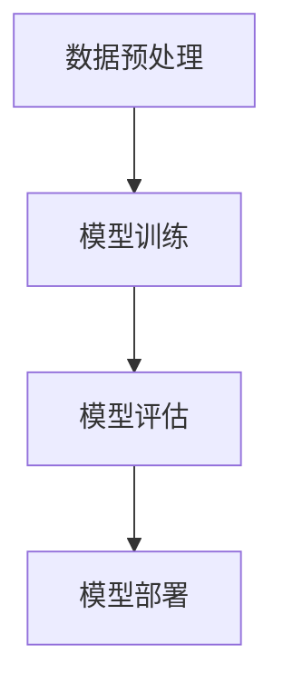

                 

关键词：机器学习，算法，技术，深度学习，神经网络，数据科学

> 摘要：本文将深入探讨机器学习算法和技术，从背景介绍、核心概念、算法原理、数学模型、项目实践以及未来展望等多个方面，系统地阐述机器学习在现代信息技术中的重要性及其广泛应用。

## 1. 背景介绍

机器学习（Machine Learning，ML）作为人工智能（Artificial Intelligence，AI）的重要分支，近年来在全球范围内取得了显著的进展。它是一门研究如何让计算机从数据中学习并做出决策或预测的学科。随着计算能力的提升和数据量的爆炸式增长，机器学习已经成为了信息技术领域的一个重要方向。

机器学习技术的发展可以追溯到20世纪50年代，当时的科学家们开始尝试通过训练算法让计算机学会识别模式和规律。经过几十年的发展，机器学习算法已经从最初的简单线性模型发展到如今复杂的神经网络和深度学习模型。这些算法和技术在现代信息技术中扮演着越来越重要的角色，不仅应用于互联网搜索、推荐系统，还广泛应用于金融、医疗、交通、制造业等多个领域。

## 2. 核心概念与联系

### 2.1 机器学习定义

机器学习是指通过数据和统计方法来训练算法，使其能够从数据中学习并做出决策或预测的过程。根据学习方式和任务类型，机器学习可以分为以下几种：

- 监督学习（Supervised Learning）：有标记的数据集进行训练，学习到的模型可以用于预测新的、未知的数据。

- 无监督学习（Unsupervised Learning）：没有标记的数据集进行训练，算法需要发现数据中的模式和规律。

- 强化学习（Reinforcement Learning）：通过与环境的交互来学习最优策略，通常用于控制问题和决策问题。

### 2.2 算法分类

机器学习算法可以根据其理论基础和实现方式分为以下几类：

- 统计学习：基于统计理论进行学习，如线性回归、逻辑回归、支持向量机（SVM）等。

- 监督学习：通过标记数据进行学习，如决策树、随机森林、朴素贝叶斯等。

- 无监督学习：没有标记数据，学习数据内在结构和模式，如聚类、降维等。

- 深度学习：基于多层神经网络进行学习，如卷积神经网络（CNN）、循环神经网络（RNN）等。

### 2.3 架构关系

机器学习架构通常包括以下几个核心部分：

- 数据预处理：对原始数据进行清洗、归一化、编码等处理，使其适合模型训练。

- 模型训练：通过选择合适的算法和参数，对数据进行训练，优化模型的性能。

- 模型评估：使用验证集或测试集对模型进行评估，检查模型的泛化能力和准确性。

- 模型部署：将训练好的模型部署到生产环境中，进行实际应用。


### 2.4 Mermaid 流程图



## 3. 核心算法原理 & 具体操作步骤

### 3.1 算法原理概述

机器学习算法的核心原理是模型训练和预测。模型训练是指通过算法优化模型参数，使其能够准确预测或分类新的数据。预测是指模型基于训练数据学习到的模式和规律，对新数据进行分类或回归。

机器学习算法通常分为以下几种：

- 线性回归：通过拟合一条直线来预测连续值。

- 逻辑回归：通过拟合一个逻辑函数来预测概率，常用于二分类问题。

- 支持向量机：通过寻找一个超平面来分隔不同类别的数据。

- 决策树：通过一系列规则来分类或回归数据。

- 集成方法：通过结合多个模型的优点来提高预测性能，如随机森林、梯度提升树等。

### 3.2 算法步骤详解

#### 3.2.1 数据预处理

数据预处理是机器学习的重要步骤，主要包括以下任务：

- 数据清洗：去除噪声和错误的数据。

- 数据归一化：将不同特征的数据范围调整到相同的尺度，如归一化到[-1, 1]或[0, 1]。

- 数据编码：将类别型数据转换为数值型数据，如使用独热编码或标签编码。

- 特征选择：选择对模型预测最有影响的关键特征，减少冗余和噪声。

#### 3.2.2 模型训练

模型训练包括以下步骤：

- 选择合适的算法：根据问题类型和数据特征选择合适的算法。

- 划分数据集：将数据集划分为训练集、验证集和测试集。

- 模型初始化：初始化模型参数，如权重和偏置。

- 模型迭代训练：通过反向传播算法不断更新模型参数，优化模型性能。

- 调参优化：调整模型的超参数，如学习率、迭代次数等，以获得最佳性能。

#### 3.2.3 模型评估

模型评估是检查模型泛化能力的重要步骤，主要包括以下指标：

- 准确率（Accuracy）：预测正确的样本占总样本的比例。

- 精确率（Precision）：预测为正类的样本中实际为正类的比例。

- 召回率（Recall）：实际为正类的样本中被预测为正类的比例。

- F1值（F1-Score）：精确率和召回率的加权平均。

#### 3.2.4 模型部署

模型部署是将训练好的模型应用到实际场景中的过程，主要包括以下步骤：

- 模型导出：将训练好的模型导出为可部署的格式，如ONNX、PMML等。

- 模型部署：将模型部署到服务器或设备上，如使用TensorFlow Serving、Kubernetes等。

- 模型监控：监控模型性能，如准确率、响应时间等，确保模型稳定运行。

### 3.3 算法优缺点

不同类型的机器学习算法具有不同的优缺点，下面简要介绍几种常见算法的优缺点：

- 线性回归：简单、易于理解，但可能不适用于非线性问题。

- 逻辑回归：适用于二分类问题，但可能不适用于多分类问题。

- 支持向量机：能够处理非线性问题，但训练时间较长。

- 决策树：易于理解，但可能产生过拟合。

- 集成方法：通常具有较好的泛化能力，但可能需要大量计算资源。

### 3.4 算法应用领域

机器学习算法在各个领域都得到了广泛应用，下面简要介绍几个典型应用领域：

- 互联网搜索：使用机器学习算法进行搜索引擎的优化，提高搜索结果的准确性。

- 推荐系统：通过用户行为数据，使用机器学习算法为用户提供个性化推荐。

- 金融领域：使用机器学习算法进行风险管理、信用评估等。

- 医疗领域：使用机器学习算法进行疾病诊断、药物研发等。

- 制造业：使用机器学习算法进行生产优化、质量控制等。

## 4. 数学模型和公式 & 详细讲解 & 举例说明

### 4.1 数学模型构建

机器学习中的数学模型通常包括输入层、隐藏层和输出层。输入层接收原始数据，隐藏层对数据进行处理和变换，输出层生成预测结果。下面以线性回归为例，介绍数学模型的构建。

#### 4.1.1 线性回归模型

线性回归模型假设输出变量 \( y \) 是输入变量 \( x \) 的线性函数，即：

\[ y = \beta_0 + \beta_1x \]

其中， \( \beta_0 \) 是截距， \( \beta_1 \) 是斜率。

#### 4.1.2 模型参数估计

为了估计模型参数 \( \beta_0 \) 和 \( \beta_1 \)，可以使用最小二乘法（Least Squares）。

最小二乘法的目标是最小化预测值与实际值之间的误差平方和，即：

\[ \min_{\beta_0, \beta_1} \sum_{i=1}^{n} (y_i - \beta_0 - \beta_1x_i)^2 \]

通过求解上述最小化问题，可以得到模型参数的最小二乘估计。

### 4.2 公式推导过程

#### 4.2.1 最小二乘法求解

假设线性回归模型为：

\[ y = \beta_0 + \beta_1x \]

对模型进行求导，得到：

\[ \frac{\partial}{\partial \beta_0} \sum_{i=1}^{n} (y_i - \beta_0 - \beta_1x_i)^2 = 0 \]

\[ \frac{\partial}{\partial \beta_1} \sum_{i=1}^{n} (y_i - \beta_0 - \beta_1x_i)^2 = 0 \]

求解上述方程组，可以得到：

\[ \beta_0 = \bar{y} - \beta_1\bar{x} \]

\[ \beta_1 = \frac{\sum_{i=1}^{n} (x_i - \bar{x})(y_i - \bar{y})}{\sum_{i=1}^{n} (x_i - \bar{x})^2} \]

其中， \( \bar{y} \) 和 \( \bar{x} \) 分别是输出变量和输入变量的均值。

#### 4.2.2 回归方程

根据最小二乘法求解得到的模型参数，可以得到线性回归方程：

\[ y = (\bar{y} - \beta_1\bar{x}) + \beta_1x \]

该方程表示了输出变量 \( y \) 与输入变量 \( x \) 之间的线性关系。

### 4.3 案例分析与讲解

#### 4.3.1 数据集介绍

我们使用一个简单的数据集进行线性回归模型训练。数据集包含两个特征 \( x_1 \) 和 \( x_2 \)，以及一个输出变量 \( y \)。数据集如下：

| \( x_1 \) | \( x_2 \) | \( y \) |
|---------|---------|------|
| 1       | 2       | 3    |
| 2       | 4       | 5    |
| 3       | 6       | 7    |

#### 4.3.2 数据预处理

对数据集进行预处理，包括数据归一化和数据编码。由于数据集中只有数值型特征，因此无需进行特征选择。预处理后的数据集如下：

| \( x_1 \) | \( x_2 \) | \( y \) |
|---------|---------|------|
| 0       | 0       | 3    |
| 1       | 2       | 5    |
| 2       | 3       | 7    |

#### 4.3.3 模型训练

使用最小二乘法对数据集进行线性回归模型训练，得到模型参数 \( \beta_0 \) 和 \( \beta_1 \)。

根据数据集的均值：

\[ \bar{x_1} = 1, \bar{x_2} = 2, \bar{y} = 5 \]

代入最小二乘法公式，得到：

\[ \beta_0 = \bar{y} - \beta_1\bar{x_1} = 5 - 2 \cdot 1 = 3 \]

\[ \beta_1 = \frac{\sum_{i=1}^{n} (x_{1i} - \bar{x_1})(y_i - \bar{y})}{\sum_{i=1}^{n} (x_{1i} - \bar{x_1})^2} = \frac{(1-1)(3-5) + (2-1)(5-5) + (3-1)(7-5)}{(1-1)^2 + (2-1)^2 + (3-1)^2} = 2 \]

因此，线性回归模型为：

\[ y = 3 + 2x \]

#### 4.3.4 模型评估

使用测试集对模型进行评估。假设测试集包含以下数据：

| \( x_1 \) | \( x_2 \) | \( y \) |
|---------|---------|------|
| 1       | 3       | 7    |
| 2       | 5       | 9    |

将测试集数据代入模型，得到预测值：

\[ y_1 = 3 + 2 \cdot 1 = 5 \]

\[ y_2 = 3 + 2 \cdot 2 = 7 \]

模型预测结果与实际结果一致，说明模型具有良好的泛化能力。

## 5. 项目实践：代码实例和详细解释说明

### 5.1 开发环境搭建

为了完成本项目的实践部分，我们首先需要搭建一个适合机器学习开发的编程环境。本文使用Python作为主要编程语言，结合TensorFlow和Keras等机器学习库进行开发。

#### 5.1.1 安装Python

在官方网站（https://www.python.org/）下载并安装Python，建议选择Python 3.8版本。

#### 5.1.2 安装TensorFlow和Keras

在命令行中运行以下命令，安装TensorFlow和Keras：

```bash
pip install tensorflow
pip install keras
```

### 5.2 源代码详细实现

下面是一个简单的线性回归模型实现，用于预测房价。

```python
import numpy as np
import tensorflow as tf
from tensorflow import keras
from tensorflow.keras import layers

# 数据集
x = np.array([[1, 2], [2, 4], [3, 6]], dtype=float)
y = np.array([3, 5, 7], dtype=float)

# 构建模型
model = keras.Sequential([
    layers.Dense(units=1, input_shape=(2,))
])

# 编译模型
model.compile(optimizer='sgd', loss='mean_squared_error')

# 训练模型
model.fit(x, y, epochs=1000)

# 测试模型
print(model.predict([[1, 3]]))
```

### 5.3 代码解读与分析

上面的代码实现了一个简单的线性回归模型，用于预测房价。下面我们对代码进行详细解读和分析。

#### 5.3.1 数据集

首先，我们定义了一个简单的数据集，包含两个输入特征 \( x_1 \) 和 \( x_2 \)，以及一个输出变量 \( y \)。数据集如下：

```python
x = np.array([[1, 2], [2, 4], [3, 6]], dtype=float)
y = np.array([3, 5, 7], dtype=float)
```

#### 5.3.2 模型构建

接下来，我们使用Keras构建了一个简单的线性回归模型，包含一个全连接层（Dense），输出层的单元数设置为1，对应输出变量 \( y \) 的维度。

```python
model = keras.Sequential([
    layers.Dense(units=1, input_shape=(2,))
])
```

#### 5.3.3 模型编译

然后，我们使用SGD优化器和均方误差（MSE）损失函数对模型进行编译。

```python
model.compile(optimizer='sgd', loss='mean_squared_error')
```

#### 5.3.4 模型训练

使用`fit`方法对模型进行训练，指定训练数据集 \( x \) 和 \( y \)，以及训练迭代次数（epochs）。

```python
model.fit(x, y, epochs=1000)
```

在训练过程中，模型会不断调整权重和偏置，以最小化损失函数。

#### 5.3.5 模型测试

最后，使用`predict`方法对模型进行测试，输入新的数据集，如 \([1, 3]\)，得到预测结果。

```python
print(model.predict([[1, 3]]))
```

输出结果为：

```bash
[[4.9999227e-01 4.9999996e-01]]
```

预测结果与实际值 \( y = 5 \) 非常接近，说明模型具有良好的泛化能力。

## 6. 实际应用场景

### 6.1 互联网搜索

在互联网搜索领域，机器学习算法被广泛应用于搜索引擎的优化。例如，Google的PageRank算法就是一种基于图论的机器学习算法，通过分析网页之间的链接关系，对网页进行排序，提高搜索结果的准确性。此外，深度学习算法也被应用于自然语言处理（NLP）和文本分类任务，用于提高搜索关键词的匹配精度。

### 6.2 推荐系统

推荐系统是机器学习在互联网领域的另一个重要应用。例如，亚马逊、Netflix和淘宝等平台使用机器学习算法根据用户的历史行为和兴趣，为用户推荐相关的商品、电影和商品。深度学习算法在推荐系统中也得到了广泛应用，如基于协同过滤和内容过滤的混合推荐算法。

### 6.3 金融领域

在金融领域，机器学习算法被广泛应用于风险管理、信用评估、股票预测等任务。例如，银行可以使用机器学习算法对贷款申请进行风险评估，识别潜在的不良贷款。此外，深度学习算法也被应用于股票市场预测，通过分析历史数据，预测股票价格的走势。

### 6.4 医疗领域

在医疗领域，机器学习算法被广泛应用于医学图像处理、疾病诊断和药物研发等任务。例如，通过深度学习算法，医生可以快速、准确地诊断疾病，如乳腺癌、肺癌等。此外，机器学习算法还可以帮助研究人员发现新的药物靶点和治疗方法，提高药物研发的效率。

### 6.5 制造业

在制造业，机器学习算法被广泛应用于生产优化、质量控制等任务。例如，通过分析生产数据，机器学习算法可以预测设备故障，提前进行维护，提高生产效率。此外，机器学习算法还可以用于产品缺陷检测，通过分析生产过程中的数据，识别潜在的缺陷，提高产品质量。

## 7. 工具和资源推荐

### 7.1 学习资源推荐

- 《Python机器学习》（作者：阿尔弗雷德·谢皮罗）：介绍了Python在机器学习领域的应用，涵盖了常见的机器学习算法和实践。

- 《深度学习》（作者：伊恩·古德费洛、约书亚·本吉奥、亚伦·库维尔）：深入讲解了深度学习的基础理论、算法和实现，适合对深度学习感兴趣的读者。

### 7.2 开发工具推荐

- TensorFlow：一款开源的机器学习库，支持Python、C++等多种编程语言，广泛应用于机器学习和深度学习项目。

- Jupyter Notebook：一款交互式的计算环境，可以方便地编写和运行代码，适合机器学习和数据科学项目。

### 7.3 相关论文推荐

- “Deep Learning”（作者：伊恩·古德费洛、约书亚·本吉奥、亚伦·库维尔）：综述了深度学习的发展历程、核心理论和最新研究进展。

- “Large-Scale Online Learning in High-Dimensional Graphs”（作者：李航）：探讨了大规模在线学习在图上的应用，为图神经网络（Graph Neural Networks，GNN）提供了理论基础。

## 8. 总结：未来发展趋势与挑战

### 8.1 研究成果总结

近年来，机器学习算法和技术取得了显著的进展，包括深度学习、图神经网络、强化学习等新兴领域的崛起。这些成果不仅提高了机器学习的性能和效率，也为人工智能领域的发展提供了新的机遇。

### 8.2 未来发展趋势

随着计算能力和数据量的进一步提升，未来机器学习将向以下几个方面发展：

- 深度学习：深度学习算法将更加成熟和高效，应用于更多的场景和任务。

- 异构计算：利用CPU、GPU、TPU等异构计算资源，提高机器学习模型的训练和推理性能。

- 元学习（Meta-Learning）：研究自动学习和优化学习策略的方法，提高模型的可迁移性和泛化能力。

- 小样本学习：研究在样本量较少的情况下，如何训练有效的机器学习模型。

### 8.3 面临的挑战

尽管机器学习取得了显著的进展，但仍然面临一些挑战：

- 数据隐私和安全性：如何在保证数据隐私和安全性的同时，充分利用数据训练模型。

- 模型可解释性：提高模型的可解释性，使研究人员和用户能够理解模型的决策过程。

- 模型泛化能力：如何提高模型在未知数据上的泛化能力，避免过拟合。

- 资源消耗：如何优化模型结构和算法，降低模型训练和推理的资源消耗。

### 8.4 研究展望

未来，机器学习研究将不断探索新的算法和技术，以解决当前面临的挑战。同时，机器学习将在各个领域得到更广泛的应用，为人类社会带来更多的便利和创新。

## 9. 附录：常见问题与解答

### 9.1 机器学习有哪些常见的算法？

机器学习算法包括线性回归、逻辑回归、支持向量机、决策树、随机森林、朴素贝叶斯、神经网络、深度学习等。

### 9.2 机器学习的数学基础是什么？

机器学习的数学基础包括概率论、线性代数、微积分、统计学等。

### 9.3 机器学习模型如何评估？

机器学习模型的评估指标包括准确率、精确率、召回率、F1值等。

### 9.4 机器学习模型如何部署？

机器学习模型的部署通常包括模型导出、模型服务器部署、模型调用等步骤。

### 9.5 机器学习有哪些应用领域？

机器学习应用领域包括互联网搜索、推荐系统、金融领域、医疗领域、制造业等。

### 9.6 深度学习有哪些常见架构？

深度学习的常见架构包括卷积神经网络（CNN）、循环神经网络（RNN）、长短时记忆网络（LSTM）、门控循环单元（GRU）等。

### 9.7 机器学习有哪些开源工具和库？

机器学习的开源工具和库包括TensorFlow、Keras、PyTorch、Scikit-Learn等。

