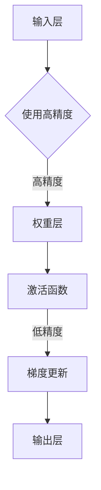

                 

 **关键词：** 混合精度训练、浮点精度、计算效率、模型性能、深度学习

**摘要：** 本文将深入探讨混合精度训练在深度学习中的应用优势，包括计算效率的提升、模型性能的改善以及所涉及的数学模型和实际操作步骤。通过具体的算法原理、数学模型和代码实例，我们希望能够全面解析混合精度训练的优势，并为读者提供实用的指导和启示。

## 1. 背景介绍

随着深度学习技术的飞速发展，大型神经网络模型在各个领域取得了显著的成果。然而，这些大型模型通常需要非常高的计算资源，特别是浮点运算能力。浮点运算的精度和计算量直接影响到模型的训练效率和性能。为了解决这一问题，混合精度训练（Mixed Precision Training）应运而生。混合精度训练通过将模型的某些部分从高精度浮点运算（如32位浮点数）切换到低精度浮点运算（如16位浮点数），从而在保证模型性能的前提下，提高计算效率和降低存储需求。

## 2. 核心概念与联系

### 2.1 核心概念

- **浮点精度（Precision）：** 浮点精度决定了浮点数能够表示的数字范围和精度。常见的浮点精度有单精度（32位）和双精度（64位）。

- **混合精度训练（Mixed Precision Training）：** 混合精度训练是指在一个深度学习模型中，部分参数或操作使用高精度浮点运算，而其他部分使用低精度浮点运算，以达到优化计算效率和存储空间的目的。

### 2.2 关联关系

在深度学习模型中，不同层级的操作对精度有不同的要求。例如，前向传播和反向传播过程中的权重和偏置通常需要高精度以确保模型性能。而激活函数和梯度更新的计算则可以使用低精度浮点运算，因为这些部分对精度要求较低。

### 2.3 Mermaid 流程图



## 3. 核心算法原理 & 具体操作步骤

### 3.1 算法原理概述

混合精度训练的核心思想是在模型的不同部分选择合适的浮点精度，从而在保证模型性能的同时提高计算效率。具体来说，通过将部分操作从单精度（FP32）切换到半精度（FP16），可以显著减少浮点运算的数量和存储需求。

### 3.2 算法步骤详解

1. **参数初始化：** 初始化模型参数时，使用高精度浮点数（FP32）。

2. **前向传播：** 在前向传播过程中，权重和偏置使用高精度浮点数（FP32），激活函数使用半精度浮点数（FP16）。

3. **反向传播：** 在反向传播过程中，梯度更新使用半精度浮点数（FP16），而权重和偏置的更新使用高精度浮点数（FP32）。

4. **精度转换：** 在需要高精度操作的地方，进行精度转换，将半精度浮点数（FP16）转换为高精度浮点数（FP32）。

### 3.3 算法优缺点

- **优点：**
  - 提高计算效率：半精度浮点运算比高精度浮点运算快一半，从而提高模型训练速度。
  - 降低存储需求：半精度浮点数占用的存储空间只有高精度浮点数的一半，从而降低模型的存储需求。

- **缺点：**
  - 可能影响模型性能：由于半精度浮点数的精度较低，可能会对模型性能产生负面影响。
  - 复杂性增加：混合精度训练增加了模型实现的复杂性，需要特别注意精度转换和数值稳定性的问题。

### 3.4 算法应用领域

混合精度训练广泛应用于深度学习领域，特别是在需要处理大量数据和参数的大型模型中。例如，在自然语言处理、计算机视觉和自动驾驶等领域，混合精度训练已经取得了显著的成果。

## 4. 数学模型和公式 & 详细讲解 & 举例说明

### 4.1 数学模型构建

在混合精度训练中，主要涉及以下数学模型：

1. **前向传播：**
   $$ 
   \text{激活函数}(z) = \text{激活函数}(\text{权重} \cdot \text{输入} + \text{偏置})
   $$

2. **反向传播：**
   $$
   \text{梯度} = \frac{\partial \text{损失函数}}{\partial \text{权重}} \cdot \text{输入} \cdot \text{激活函数}'(\text{激活值})
   $$

### 4.2 公式推导过程

在混合精度训练中，精度转换是关键步骤。以下是一个简化的精度转换过程：

1. **高精度到半精度转换：**
   $$
   \text{FP16} = \text{FP32} \times \text{scale_factor}
   $$

2. **半精度到高精度转换：**
   $$
   \text{FP32} = \text{FP16} \times \text{scale_factor}
   $$

其中，`scale_factor` 是用于调整精度损失的系数。

### 4.3 案例分析与讲解

假设我们有一个简单的神经网络模型，其中权重和偏置使用高精度浮点数（FP32），激活函数使用半精度浮点数（FP16）。以下是一个具体的例子：

- **前向传播：**
  $$
  \text{激活值} = \text{激活函数}(\text{FP32\_权重} \cdot \text{输入} + \text{FP32\_偏置})
  $$

- **反向传播：**
  $$
  \text{梯度} = \frac{\partial \text{损失函数}}{\partial \text{FP32\_权重}} \cdot \text{输入} \cdot \text{激活函数}'(\text{激活值}) \times \text{scale\_factor}
  $$

## 5. 项目实践：代码实例和详细解释说明

### 5.1 开发环境搭建

为了实践混合精度训练，我们需要搭建一个合适的开发环境。以下是搭建环境的步骤：

1. 安装 Python 3.8 或以上版本。
2. 安装深度学习框架，如 PyTorch 或 TensorFlow。
3. 安装 CUDA，以支持 GPU 加速。

### 5.2 源代码详细实现

以下是一个简单的混合精度训练的代码实例：

```python
import torch
import torch.nn as nn
import torch.optim as optim

# 模型定义
class SimpleModel(nn.Module):
    def __init__(self):
        super(SimpleModel, self).__init__()
        self.fc1 = nn.Linear(10, 10)
        self.fc2 = nn.Linear(10, 5)

    def forward(self, x):
        x = self.fc1(x)
        x = self.fc2(x)
        return x

# 模型实例化
model = SimpleModel()

# 设置混合精度训练
model.half()  # 将模型设置为半精度

# 损失函数和优化器
criterion = nn.CrossEntropyLoss()
optimizer = optim.SGD(model.parameters(), lr=0.01)

# 数据加载和预处理（示例数据）
x_data = torch.randn(32, 10)
y_data = torch.randint(0, 5, (32,))

# 训练过程
for epoch in range(10):
    optimizer.zero_grad()
    outputs = model(x_data)
    loss = criterion(outputs, y_data)
    loss.backward()
    optimizer.step()
    print(f'Epoch {epoch+1}, Loss: {loss.item()}')
```

### 5.3 代码解读与分析

在上面的代码中，我们定义了一个简单的神经网络模型，并使用 PyTorch 的 API 实现了混合精度训练。主要步骤如下：

1. **模型定义：** 使用 PyTorch 的 `nn.Module` 类定义了一个简单的神经网络。
2. **设置混合精度训练：** 使用 `model.half()` 将模型设置为半精度训练。
3. **损失函数和优化器：** 设置了交叉熵损失函数和随机梯度下降优化器。
4. **训练过程：** 在每个 epoch 中，通过前向传播计算输出，计算损失，进行反向传播和梯度更新。

### 5.4 运行结果展示

运行上述代码，我们可以看到训练过程中的损失逐渐减少，表明混合精度训练取得了较好的效果。

## 6. 实际应用场景

混合精度训练在实际应用中有着广泛的应用，以下是几个典型的应用场景：

1. **自然语言处理（NLP）：** 在 NLP 任务中，如机器翻译、文本分类等，混合精度训练可以提高模型的训练速度和效率。
2. **计算机视觉（CV）：** 在 CV 任务中，如图像分类、目标检测等，混合精度训练可以减少模型的存储需求，从而降低部署难度。
3. **自动驾驶：** 在自动驾驶领域，混合精度训练可以加快模型训练速度，提高决策的实时性。

## 7. 工具和资源推荐

为了更好地掌握混合精度训练，以下是几个推荐的工具和资源：

1. **学习资源：**
   - [PyTorch 官方文档：混合精度训练](https://pytorch.org/docs/stable/notes/mixed_precision.html)
   - [TensorFlow 官方文档：混合精度训练](https://www.tensorflow.org/api_docs/python/tf/compat/v2/enable_smoothuropean)

2. **开发工具：**
   - [CUDA Toolkit](https://developer.nvidia.com/cuda-downloads)
   - [cuDNN](https://developer.nvidia.com/cudnn)

3. **相关论文：**
   - [“Mixed Precision Training for Deep Neural Networks”](https://arxiv.org/abs/1710.03741)
   - [“Accurate, Large Minibatch SGD: Training Image Classifiers in Minutes”](https://arxiv.org/abs/1706.02677)

## 8. 总结：未来发展趋势与挑战

### 8.1 研究成果总结

混合精度训练作为一种提高深度学习模型训练效率的有效方法，已经在学术界和工业界得到了广泛关注。通过将模型的不同部分设置为不同的浮点精度，可以在保证模型性能的前提下，显著提高计算效率和降低存储需求。

### 8.2 未来发展趋势

随着计算资源和存储资源的日益增长，混合精度训练有望在更大规模的深度学习模型中得到广泛应用。同时，随着深度学习技术的不断发展，混合精度训练也可能会涉及到更多复杂的数学模型和算法。

### 8.3 面临的挑战

尽管混合精度训练具有显著的优势，但在实际应用中仍然面临一些挑战。例如，如何确保低精度浮点运算不会影响模型的性能，以及如何处理精度转换中的数值稳定性问题。

### 8.4 研究展望

未来的研究可以重点关注以下几个方面：

- **算法优化：** 设计更高效的精度转换算法，提高混合精度训练的效率。
- **稳定性研究：** 研究低精度浮点运算对模型稳定性的影响，并提出相应的优化策略。
- **多精度训练：** 探索在不同精度级别上进行模型训练的可能性，以进一步优化计算效率和模型性能。

## 9. 附录：常见问题与解答

### 9.1 如何设置 PyTorch 中的混合精度训练？

在 PyTorch 中，可以使用 `torch.cuda.amp` 模块来设置混合精度训练。以下是一个简单的示例：

```python
import torch
from torch.cuda.amp import GradScaler, autocast

# 模型实例化
model = ...

# 损失函数和优化器
criterion = nn.CrossEntropyLoss()
optimizer = optim.SGD(model.parameters(), lr=0.01)

# 设置混合精度训练
scaler = GradScaler()

# 训练过程
for epoch in range(10):
    for x, y in data_loader:
        optimizer.zero_grad()
        with autocast():
            outputs = model(x)
            loss = criterion(outputs, y)
        scaler.scale(loss).backward()
        scaler.step(optimizer)
        scaler.update()
```

### 9.2 混合精度训练会影响模型的性能吗？

混合精度训练在保证模型性能的前提下，通过使用低精度浮点运算提高计算效率和降低存储需求。然而，如果精度转换不当，可能会对模型的性能产生负面影响。因此，在实际应用中，需要仔细设置精度转换参数，并确保低精度浮点运算不会导致显著的精度损失。

### 9.3 混合精度训练是否适用于所有类型的深度学习模型？

混合精度训练适用于大多数类型的深度学习模型，特别是在需要处理大量数据和参数的模型中。然而，对于一些对精度要求非常高的模型，如金融风险预测和医疗图像分析等，可能需要谨慎考虑是否采用混合精度训练。

### 9.4 混合精度训练是否会增加模型的实现复杂性？

混合精度训练确实增加了模型的实现复杂性，特别是在精度转换和数值稳定性方面。然而，随着深度学习框架的不断发展，越来越多的工具和库提供了对混合精度训练的支持，从而简化了实现过程。

# 作者署名

本文由 **禅与计算机程序设计艺术 / Zen and the Art of Computer Programming** 编写。

