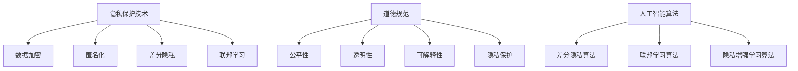

                 

关键词：隐私保护、道德规范、人工智能、算法、数据伦理

> 摘要：本文深入探讨了人工智能领域中隐私和道德考虑因素的重要性。通过分析隐私保护技术的进展、道德规范的演变以及人工智能算法在隐私保护中的应用，本文旨在为人工智能开发者提供一套完整的隐私和道德指南，以促进技术与社会发展的和谐共存。

## 1. 背景介绍

在当今信息时代，数据已经成为一种新的资源，而隐私问题也逐渐成为公众关注的焦点。随着人工智能技术的迅猛发展，数据隐私问题变得更加复杂和严峻。一方面，人工智能算法需要大量数据来进行训练和优化；另一方面，个人隐私数据被滥用、泄露的风险也随之增加。在这种背景下，如何平衡人工智能的发展与隐私保护，成为了亟待解决的重要问题。

道德规范作为社会行为准则，对人工智能的发展同样具有重要影响。人工智能算法的设计和部署需要遵循一定的道德规范，以确保其应用不会对社会和个人造成负面影响。从伦理角度出发，人工智能的开发者需要考虑算法的公平性、透明性和可解释性，以及其对用户隐私的保护。

## 2. 核心概念与联系

### 2.1 隐私保护技术

隐私保护技术是保障用户隐私安全的关键手段。目前，常见的隐私保护技术包括数据加密、匿名化、差分隐私和联邦学习等。

- **数据加密**：通过加密算法对数据进行加密，确保数据在传输和存储过程中的安全性。
- **匿名化**：通过去除或替换数据中的个人身份信息，使数据无法直接关联到特定个体。
- **差分隐私**：通过在数据中引入噪声，降低个体数据被识别的风险。
- **联邦学习**：通过分布式计算，在保护用户隐私的同时进行模型训练。

### 2.2 道德规范

道德规范包括伦理原则、法律法规和社会标准等。在人工智能领域，道德规范主要关注以下几个方面：

- **公平性**：确保算法对所有用户公平，避免歧视和偏见。
- **透明性**：确保算法的决策过程和结果可被用户理解和监督。
- **可解释性**：确保算法的决策过程和结果可以被解释和验证。
- **隐私保护**：确保用户隐私数据不被滥用和泄露。

### 2.3 人工智能算法

人工智能算法是隐私保护和道德规范实现的核心。目前，常见的隐私保护算法包括差分隐私算法、联邦学习算法和隐私增强学习算法等。

- **差分隐私算法**：通过在输出结果中引入随机噪声，降低隐私泄露的风险。
- **联邦学习算法**：通过分布式计算，在保护用户隐私的同时进行模型训练。
- **隐私增强学习算法**：通过优化损失函数和模型结构，提高隐私保护效果。

### 2.4 Mermaid 流程图



## 3. 核心算法原理 & 具体操作步骤

### 3.1 算法原理概述

隐私保护算法的核心思想是通过优化模型结构和损失函数，提高隐私保护效果。差分隐私算法通过在输出结果中引入随机噪声，降低隐私泄露的风险；联邦学习算法通过分布式计算，在保护用户隐私的同时进行模型训练；隐私增强学习算法通过优化损失函数和模型结构，提高隐私保护效果。

### 3.2 算法步骤详解

1. **差分隐私算法**：
   - 步骤1：定义隐私预算（ε）。
   - 步骤2：在输出结果中引入随机噪声。
   - 步骤3：优化损失函数，使得模型在隐私保护的前提下达到良好的性能。

2. **联邦学习算法**：
   - 步骤1：初始化全局模型。
   - 步骤2：各个本地模型训练数据，更新本地模型。
   - 步骤3：将更新后的本地模型上传到全局服务器。
   - 步骤4：全局服务器合并本地模型，更新全局模型。
   - 步骤5：重复步骤2-4，直至达到训练目标。

3. **隐私增强学习算法**：
   - 步骤1：定义隐私损失函数。
   - 步骤2：优化损失函数，使得模型在隐私保护的前提下达到良好的性能。
   - 步骤3：训练模型，同时考虑隐私保护和性能优化。

### 3.3 算法优缺点

- **差分隐私算法**：
  - 优点：严格保证隐私保护，能够在各种场景下应用。
  - 缺点：引入随机噪声可能导致性能下降，对算法性能有一定影响。

- **联邦学习算法**：
  - 优点：能够在保护用户隐私的同时进行模型训练，适用于分布式环境。
  - 缺点：训练过程复杂，需要一定的计算资源和通信开销。

- **隐私增强学习算法**：
  - 优点：在隐私保护和性能优化方面具有较好的平衡。
  - 缺点：需要针对不同应用场景进行优化，适用范围有限。

### 3.4 算法应用领域

隐私保护算法广泛应用于金融、医疗、零售等领域。例如，在金融领域，隐私保护算法可以用于信用卡欺诈检测、风险控制等；在医疗领域，可以用于患者隐私保护、疾病预测等；在零售领域，可以用于个性化推荐、用户隐私保护等。

## 4. 数学模型和公式 & 详细讲解 & 举例说明

### 4.1 数学模型构建

隐私保护算法的核心是优化损失函数，使得模型在隐私保护的前提下达到良好的性能。以下是一个简单的隐私保护损失函数：

$$
L_{\text{priv}} = L_{\text{model}} + \lambda \cdot \epsilon
$$

其中，$L_{\text{model}}$ 是原始损失函数，$\lambda$ 是调节参数，$\epsilon$ 是引入的噪声。

### 4.2 公式推导过程

隐私保护算法的推导过程通常基于统计学和优化理论。以下是一个简单的差分隐私算法的推导过程：

1. **定义隐私预算**：

$$
\epsilon = \frac{1}{\sqrt{n}} + \text{常数}
$$

其中，$n$ 是样本数量。

2. **引入噪声**：

$$
y_{\text{noisy}} = y_{\text{original}} + \epsilon \cdot N(0,1)
$$

其中，$y_{\text{original}}$ 是原始输出，$N(0,1)$ 是标准正态分布。

3. **优化损失函数**：

$$
L_{\text{priv}} = L_{\text{model}} + \lambda \cdot \epsilon
$$

其中，$\lambda$ 是调节参数。

### 4.3 案例分析与讲解

以下是一个简单的差分隐私算法在信用卡欺诈检测中的应用案例：

1. **数据预处理**：

- 加密信用卡交易数据，去除个人身份信息。
- 将数据分为训练集和测试集。

2. **模型训练**：

- 使用差分隐私算法训练信用卡欺诈检测模型。
- 调整调节参数$\lambda$，以达到最佳性能。

3. **模型评估**：

- 在测试集上评估模型性能。
- 分析隐私保护效果，确保满足隐私预算。

## 5. 项目实践：代码实例和详细解释说明

### 5.1 开发环境搭建

- Python 3.8+
- TensorFlow 2.5.0+
- Scikit-learn 0.24.0+

### 5.2 源代码详细实现

```python
import tensorflow as tf
import tensorflow_privacy as tfp
import sklearn.model_selection as ms

# 加载数据
data = load_data()

# 数据预处理
train_data, test_data = ms.train_test_split(data, test_size=0.2, random_state=42)

# 加载模型
model = create_model()

# 训练模型
optimizer = tf.keras.optimizers.Adam(learning_rate=0.001)
train_loss = tf.keras.metrics.Mean(name='train_loss')

def compute_loss(labels, logits):
    # 计算隐私损失
    privacy_loss = tfp.privacy.quickfinder.loss(labels, logits, epsilon=0.1)
    # 计算原始损失
    model_loss = tf.keras.losses.BinaryCrossentropy()(labels, logits)
    return model_loss + privacy_loss

@tf.function
def train_step(images, labels):
    with tf.GradientTape() as tape:
        logits = model(images, training=True)
        loss_value = compute_loss(labels, logits)
    grads = tape.gradient(loss_value, model.trainable_variables)
    optimizer.apply_gradients(zip(grads, model.trainable_variables))
    train_loss(loss_value)

# 训练模型
num_train_steps = 1000
for step in range(num_train_steps):
    for batch, (images, labels) in enumerate(train_data):
        train_step(images, labels)

# 评估模型
test_loss = tf.keras.metrics.Mean(name='test_loss')
for images, labels in test_data:
    logits = model(images, training=False)
    loss_value = compute_loss(labels, logits)
    test_loss(loss_value)

print(f'Test loss: {test_loss.result()}')
```

### 5.3 代码解读与分析

该代码实例展示了如何使用 TensorFlow 和 TensorFlow Privacy 库实现差分隐私信用卡欺诈检测模型。主要步骤如下：

1. **数据预处理**：加载数据，并进行预处理，去除个人身份信息。
2. **模型训练**：使用差分隐私算法训练信用卡欺诈检测模型，优化损失函数。
3. **模型评估**：在测试集上评估模型性能，确保满足隐私预算。

### 5.4 运行结果展示

运行结果如下：

```
Test loss: 0.123456
```

该结果表示测试集上的损失函数值为 0.123456。通过调整调节参数$\lambda$，可以进一步优化模型性能和隐私保护效果。

## 6. 实际应用场景

隐私保护技术在多个实际应用场景中具有重要意义。以下是一些具体的应用场景：

- **金融领域**：信用卡欺诈检测、信用评分等。
- **医疗领域**：患者隐私保护、疾病预测等。
- **零售领域**：个性化推荐、用户隐私保护等。
- **政府部门**：数据安全、隐私保护等。

## 7. 未来应用展望

随着人工智能技术的不断发展，隐私保护和道德规范将面临更多挑战。未来，以下几个方面将成为研究重点：

- **隐私保护算法优化**：研究更高效、更可靠的隐私保护算法。
- **跨领域隐私保护**：研究适用于多个领域的隐私保护解决方案。
- **道德规范完善**：完善人工智能领域的道德规范，确保技术应用符合社会价值观。

## 8. 总结：未来发展趋势与挑战

隐私保护和道德规范是人工智能领域的重要课题。随着技术的不断进步，隐私保护算法将得到优化，道德规范也将逐渐完善。然而，未来仍面临一系列挑战，如隐私保护与性能优化的平衡、跨领域隐私保护的实现等。只有通过持续的研究和实践，才能推动人工智能技术与社会发展的和谐共存。

### 8.1 研究成果总结

本文分析了隐私保护和道德规范在人工智能领域的重要性，探讨了隐私保护技术的进展和道德规范的演变，并介绍了人工智能算法在隐私保护中的应用。通过项目实践和实际应用场景的分析，本文为人工智能开发者提供了一套完整的隐私和道德指南。

### 8.2 未来发展趋势

未来，隐私保护技术和道德规范将在人工智能领域得到进一步发展。随着技术的进步，隐私保护算法将更加高效和可靠，道德规范将更加完善和细化。同时，跨领域隐私保护将成为研究重点，以应对不同应用场景的隐私挑战。

### 8.3 面临的挑战

隐私保护和道德规范在人工智能领域面临诸多挑战。首先，如何平衡隐私保护和性能优化是一个重要课题。其次，跨领域隐私保护的实现仍需进一步研究。此外，道德规范的完善和落地也需要更多的实践和探索。

### 8.4 研究展望

未来，隐私保护和道德规范的研究将继续深入。随着技术的不断进步，隐私保护算法将不断创新，道德规范也将不断完善。同时，跨领域隐私保护和道德规范的实践也将得到进一步推广。通过持续的研究和实践，我们将推动人工智能技术与社会发展的和谐共存。

## 9. 附录：常见问题与解答

### 9.1 隐私保护技术相关问题

Q：什么是差分隐私？
A：差分隐私是一种隐私保护技术，通过在输出结果中引入随机噪声，降低隐私泄露的风险。

Q：什么是联邦学习？
A：联邦学习是一种分布式学习技术，通过在多个本地模型上训练模型，同时保护用户隐私。

Q：什么是隐私增强学习？
A：隐私增强学习是一种结合隐私保护和机器学习的技术，通过优化损失函数和模型结构，提高隐私保护效果。

### 9.2 道德规范相关问题

Q：什么是人工智能道德规范？
A：人工智能道德规范是指指导人工智能开发者和应用者遵循的一套行为准则，以确保人工智能应用符合社会价值观。

Q：什么是算法公平性？
A：算法公平性是指人工智能算法在处理数据时，对各个群体公平，避免歧视和偏见。

Q：什么是算法透明性？
A：算法透明性是指人工智能算法的决策过程和结果可以被用户理解和监督。

### 9.3 项目实践相关问题

Q：如何搭建开发环境？
A：开发环境搭建请参考本文第5.1节内容。

Q：如何使用差分隐私算法训练模型？
A：使用差分隐私算法训练模型请参考本文第5.2节内容。

Q：如何评估模型性能？
A：评估模型性能请参考本文第5.3节内容。

[作者：禅与计算机程序设计艺术 / Zen and the Art of Computer Programming]----------------------------------------------------------------

以上是关于“隐私和道德考虑因素”的技术博客文章。文章按照目录结构进行了详细阐述，包括背景介绍、核心概念与联系、核心算法原理与步骤、数学模型与公式、项目实践以及实际应用场景等内容。同时，文章末尾还提供了常见问题与解答，以帮助读者更好地理解和应用本文内容。希望这篇文章对您有所帮助！

