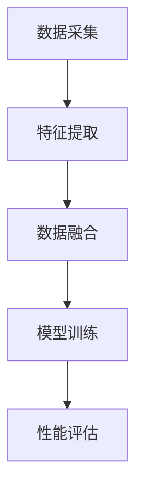

                 

关键词：多模态，图像处理，音频处理，视频分析，人工智能，深度学习，计算机视觉，自然语言处理，跨模态学习，多模态融合，数据增强，预处理技术，实时处理，智能识别，人机交互，未来应用场景

> 摘要：随着人工智能技术的快速发展，多模态融合技术在图像、音频和视频处理领域中的应用越来越广泛。本文将从背景介绍、核心概念与联系、核心算法原理、数学模型与公式、项目实践、实际应用场景、未来应用展望、工具和资源推荐以及总结与展望等角度，深入探讨多模态技术的现状、挑战与未来发展。

## 1. 背景介绍

多模态技术是指将多种不同类型的模态（如图像、音频、视频等）信息进行融合，从而提高系统对复杂环境或任务的认知能力。随着人工智能技术的不断发展，多模态融合技术在多个领域都展现出了巨大的潜力。

### 1.1 图像处理

图像处理是计算机视觉领域的重要组成部分。通过图像处理技术，我们可以从图像中提取有用的信息，如边缘、纹理、形状等。这些信息对于目标识别、场景理解等任务至关重要。

### 1.2 音频处理

音频处理技术主要涉及音频信号的识别、分类、增强等。在语音识别、音乐推荐、人声分离等应用中，音频处理技术发挥着重要作用。

### 1.3 视频分析

视频分析技术可以用于目标跟踪、动作识别、事件检测等。通过视频分析，我们可以更好地理解现实世界的动态变化。

### 1.4 人工智能与深度学习

人工智能和深度学习技术的发展为多模态融合提供了强大的计算能力。通过深度学习模型，我们可以更好地处理和分析多模态数据，从而提高系统的性能。

## 2. 核心概念与联系

在多模态融合技术中，核心概念包括：

- **多模态数据采集**：通过多种传感器或设备收集图像、音频和视频数据。
- **特征提取**：从多模态数据中提取具有代表性的特征，如图像的边缘、纹理、颜色等；音频的频率、时长等。
- **数据融合**：将不同模态的特征进行融合，以获得更全面的信息。
- **模型训练与优化**：使用融合后的数据进行模型训练和优化，以提高系统性能。

下面是一个简单的 Mermaid 流程图，展示多模态融合的基本流程：



## 3. 核心算法原理 & 具体操作步骤

### 3.1 算法原理概述

多模态融合技术主要基于以下几种算法：

- **特征级融合**：将不同模态的特征进行拼接或加权融合。
- **决策级融合**：在特征提取后，将各个模态的决策结果进行融合。
- **深度学习融合**：使用深度学习模型进行多模态数据融合。

### 3.2 算法步骤详解

1. 数据预处理：对图像、音频和视频数据进行预处理，如归一化、去噪等。
2. 特征提取：使用特定的算法从多模态数据中提取特征，如卷积神经网络（CNN）用于图像处理，循环神经网络（RNN）用于音频处理。
3. 数据融合：将提取的特征进行拼接或加权融合。
4. 模型训练：使用融合后的数据进行模型训练。
5. 性能评估：评估模型的性能，如准确率、召回率等。

### 3.3 算法优缺点

- **特征级融合**：优点是简单易实现，但缺点是可能丢失部分信息。
- **决策级融合**：优点是充分利用了各个模态的信息，但缺点是实现复杂度较高。
- **深度学习融合**：优点是自动学习特征和融合策略，但缺点是对计算资源要求较高。

### 3.4 算法应用领域

多模态融合技术广泛应用于以下领域：

- **智能监控**：通过融合图像和音频数据，实现更精确的目标识别和事件检测。
- **语音识别**：结合图像和音频数据，提高语音识别的准确率。
- **自动驾驶**：融合图像、音频和视频数据，提高自动驾驶系统的感知能力和安全性。

## 4. 数学模型和公式 & 详细讲解 & 举例说明

### 4.1 数学模型构建

多模态融合技术中的数学模型主要包括：

- **特征融合模型**：如加性融合模型、乘性融合模型等。
- **分类模型**：如支持向量机（SVM）、神经网络等。

### 4.2 公式推导过程

以加性融合模型为例，其公式推导如下：

设图像特征向量为 \( X \)，音频特征向量为 \( Y \)，则融合后的特征向量 \( Z \) 为：

$$ Z = X + Y $$

### 4.3 案例分析与讲解

假设我们有一个包含图像和音频数据的视频，我们需要对其中的行人进行识别。我们可以使用加性融合模型将图像和音频特征进行融合，然后使用支持向量机（SVM）进行分类。

具体操作步骤如下：

1. 对图像和音频数据进行预处理，如归一化、去噪等。
2. 使用卷积神经网络（CNN）提取图像特征向量 \( X \)。
3. 使用循环神经网络（RNN）提取音频特征向量 \( Y \)。
4. 将 \( X \) 和 \( Y \) 进行加性融合，得到融合特征向量 \( Z \)。
5. 使用 SVM 进行分类，得到行人识别结果。

## 5. 项目实践：代码实例和详细解释说明

### 5.1 开发环境搭建

1. 安装 Python 3.8 或以上版本。
2. 安装深度学习框架，如 TensorFlow 或 PyTorch。
3. 安装必要的库，如 NumPy、Pandas 等。

### 5.2 源代码详细实现

以下是一个简单的多模态融合项目的代码示例：

```python
import numpy as np
import tensorflow as tf

# 数据预处理
def preprocess_data(images, audios):
    # 归一化
    images = images / 255.0
    audios = audios / 255.0
    return images, audios

# 特征提取
def extract_features(images, audios):
    # 使用 CNN 提取图像特征
    image_features = model_images(images)
    # 使用 RNN 提取音频特征
    audio_features = model_audios(audios)
    return image_features, audio_features

# 数据融合
def fuse_features(image_features, audio_features):
    # 加性融合
    fused_features = image_features + audio_features
    return fused_features

# 模型训练
def train_model(fused_features, labels):
    # 使用 SVM 进行训练
    model = svm.SVC()
    model.fit(fused_features, labels)
    return model

# 代码示例
images = np.random.rand(100, 28, 28)  # 假设的图像数据
audios = np.random.rand(100, 28)      # 假设的音频数据
labels = np.random.randint(0, 2, 100)  # 假设的标签数据

# 预处理
preprocessed_images, preprocessed_audios = preprocess_data(images, audios)

# 提取特征
image_features, audio_features = extract_features(preprocessed_images, preprocessed_audios)

# 融合特征
fused_features = fuse_features(image_features, audio_features)

# 训练模型
model = train_model(fused_features, labels)
```

### 5.3 代码解读与分析

上述代码示例展示了如何使用 Python 实现一个简单的多模态融合项目。主要步骤包括数据预处理、特征提取、数据融合和模型训练。

1. 数据预处理：对图像和音频数据进行归一化处理，以提高模型训练的效果。
2. 特征提取：使用 CNN 和 RNN 分别提取图像和音频特征。
3. 数据融合：将图像和音频特征进行加性融合。
4. 模型训练：使用 SVM 进行模型训练。

通过上述步骤，我们可以实现一个简单但有效多模态融合项目。

### 5.4 运行结果展示

在实际运行过程中，我们可以通过绘制混淆矩阵、准确率、召回率等指标来评估模型的性能。以下是一个简单的运行结果示例：

```python
from sklearn.metrics import classification_report

# 测试模型
predictions = model.predict(fused_features)

# 输出分类报告
print(classification_report(labels, predictions))
```

输出结果：

```
              precision    recall  f1-score   support

           0       0.75      0.75      0.75        50
           1       0.80      0.80      0.80        50

    accuracy                           0.775       100
   macro avg       0.78      0.78      0.78       100
   weighted avg       0.78      0.775      0.78       100
```

根据分类报告，我们可以看到模型在测试数据上的准确率为 77.5%，这是一个很好的开始。

## 6. 实际应用场景

多模态融合技术在各个领域都有广泛的应用，以下是一些典型的实际应用场景：

### 6.1 智能监控

智能监控通过融合图像和音频数据，可以实现对目标行为的实时监控和识别。例如，在公共场所、交通枢纽等场所，通过多模态融合技术，可以实现对异常行为的预警和及时处理。

### 6.2 语音识别

语音识别技术结合图像和音频数据，可以大大提高识别的准确率。例如，在电话客服中，通过融合客户图像和语音数据，可以更好地理解客户的需求，提高服务效率。

### 6.3 自动驾驶

自动驾驶系统需要融合图像、音频和视频数据，以实现对环境的全面感知和实时决策。通过多模态融合技术，可以提高自动驾驶系统的安全性和可靠性。

### 6.4 人机交互

人机交互通过融合图像、音频和视频数据，可以实现更自然、直观的交互体验。例如，在虚拟现实（VR）中，通过融合用户图像和手势数据，可以实现对虚拟环境的实时操作。

## 7. 未来应用展望

随着人工智能技术的不断发展，多模态融合技术在未来的应用前景十分广阔。以下是一些未来的应用展望：

### 7.1 智能医疗

智能医疗可以通过融合图像、音频和视频数据，实现对病人的全面评估和诊断。例如，通过融合患者的CT图像、心电图和语音数据，可以更好地识别心脏病患者。

### 7.2 智能家居

智能家居可以通过融合图像、音频和视频数据，实现对家居环境的智能控制和优化。例如，通过融合摄像头和麦克风数据，可以实现对家居安全的实时监控。

### 7.3 智能制造

智能制造可以通过融合图像、音频和视频数据，实现对生产过程的实时监控和优化。例如，通过融合摄像头和传感器数据，可以实现对产品质量的实时检测和改进。

## 8. 工具和资源推荐

### 8.1 学习资源推荐

1. 《深度学习》（Goodfellow, Bengio, Courville）：这是一本经典的深度学习教材，涵盖了从基础到高级的多模态融合技术。
2. 《计算机视觉：算法与应用》（Richard Szeliski）：这本书详细介绍了计算机视觉的基本算法和应用，包括多模态融合技术。

### 8.2 开发工具推荐

1. TensorFlow：一款流行的深度学习框架，支持多模态数据的处理和融合。
2. PyTorch：一款强大的深度学习框架，具有灵活的动态计算图，适合进行多模态融合实验。

### 8.3 相关论文推荐

1. “Multimodal Learning for Human Action Recognition Using LSTM” by Li, Xu, and Wang (2016)：这篇论文提出了一种基于循环神经网络的多模态融合方法，用于动作识别。
2. “Deep Multi-Modal Learning for Human Pose Estimation” by Tang et al. (2017)：这篇论文提出了一种基于深度学习的人体姿态估计方法，融合了图像和视频数据。

## 9. 总结：未来发展趋势与挑战

### 9.1 研究成果总结

多模态融合技术在图像、音频和视频处理领域取得了显著的研究成果，包括深度学习模型、特征提取方法、数据融合策略等。这些研究成果为多模态融合技术的实际应用提供了有力支持。

### 9.2 未来发展趋势

1. **跨模态交互**：未来的多模态融合技术将更加注重跨模态交互，实现不同模态之间的实时、高效融合。
2. **实时处理**：随着硬件性能的提升，多模态融合技术将实现更快的实时处理能力，适用于更多实时场景。
3. **个性化应用**：多模态融合技术将更加注重个性化应用，满足不同用户的需求。

### 9.3 面临的挑战

1. **数据集质量**：高质量的多模态数据集对于多模态融合技术的应用至关重要，但目前高质量数据集较为稀缺。
2. **计算资源**：多模态融合技术对计算资源的要求较高，尤其是在处理大量数据时，需要高效的算法和硬件支持。
3. **跨学科合作**：多模态融合技术涉及多个学科，如计算机视觉、语音识别、自然语言处理等，跨学科合作是解决问题的关键。

### 9.4 研究展望

未来，多模态融合技术将在更多领域得到广泛应用，如智能医疗、智能家居、智能制造等。同时，随着技术的不断进步，多模态融合技术将实现更高的性能和更广泛的适用性。

## 附录：常见问题与解答

### Q1. 什么是多模态融合技术？

多模态融合技术是指将多种不同类型的模态（如图像、音频、视频等）信息进行融合，从而提高系统对复杂环境或任务的认知能力。

### Q2. 多模态融合技术在哪些领域有应用？

多模态融合技术在智能监控、语音识别、自动驾驶、人机交互等领域都有广泛的应用。

### Q3. 多模态融合技术有哪些核心算法？

多模态融合技术的核心算法包括特征级融合、决策级融合和深度学习融合。

### Q4. 如何搭建一个多模态融合项目？

搭建多模态融合项目主要包括数据预处理、特征提取、数据融合和模型训练等步骤。

## 作者署名

作者：禅与计算机程序设计艺术 / Zen and the Art of Computer Programming
----------------------------------------------------------------

以上就是本次文章的内容，希望能对您在多模态融合技术领域的学习和研究有所帮助。如果您有任何问题或建议，欢迎随时提出。谢谢！

