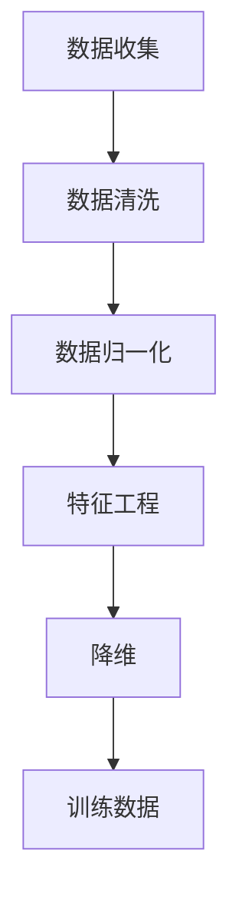

                 

关键词：训练数据、数据收集、数据预处理、机器学习、深度学习

## 摘要

本章旨在探讨训练数据在机器学习和深度学习中的重要性，以及如何有效地进行数据收集和预处理。随着人工智能技术的不断发展，数据已经成为驱动算法性能的关键因素。本章将介绍训练数据的类型、收集方法、预处理技术，以及如何评估和优化数据质量。通过深入分析这些核心概念，读者将能够更好地理解如何构建高质量的训练数据集，从而提升机器学习模型的性能。

## 1. 背景介绍

### 机器学习与数据的重要性

机器学习是一种通过数据驱动的方法来让计算机自动识别模式和做出预测的技术。在机器学习领域，数据的质量和数量直接影响模型的性能。一个高质量的训练数据集可以帮助模型学习到更多的特征，从而提高其在实际应用中的准确性和泛化能力。因此，训练数据在机器学习项目中起着至关重要的作用。

### 深度学习与大规模数据的挑战

随着深度学习的兴起，模型对数据的需求变得更加庞大。深度神经网络需要大量的数据进行训练，以便学习到复杂的特征和模式。然而，大规模数据的收集和存储成为一个挑战。此外，数据的多样性和不平衡性也可能影响模型的性能。

## 2. 核心概念与联系

### 训练数据的类型

训练数据可以分为以下几种类型：

1. **标记数据（Labeled Data）**：这种数据已经进行了标注，可以用于监督学习。例如，图像分类任务中的每个图片都被标注为某个类别。
2. **无标签数据（Unlabeled Data）**：这种数据没有进行标注，通常用于无监督学习或半监督学习。
3. **合成数据（Synthetic Data）**：通过算法生成，用于填补数据集的空白或不平衡。
4. **动态数据（Dynamic Data）**：实时收集的数据，用于适应快速变化的环境。

### 数据收集方法

数据收集的方法包括：

1. **手动收集**：人工标注和收集数据，适用于小规模、高精度的数据集。
2. **自动化收集**：利用爬虫、传感器或其他自动化工具收集数据。
3. **开放数据集**：从公共数据库或数据共享平台获取的数据集。
4. **定制收集**：为特定任务定制的数据收集过程。

### 数据预处理

数据预处理是数据科学中的一个关键步骤，包括：

1. **清洗**：去除噪音和异常值，确保数据的质量。
2. **归一化**：将数据缩放到相同的范围，以便算法能够更有效地处理。
3. **特征工程**：选择和构造新的特征，以提高模型的性能。
4. **降维**：减少数据的维度，降低计算复杂度。

### Mermaid 流程图

下面是一个用于描述数据收集和预处理过程的 Mermaid 流程图：



## 3. 核心算法原理 & 具体操作步骤

### 3.1 算法原理概述

在机器学习和深度学习中，训练数据的质量和数量对模型性能有直接影响。核心算法原理包括以下方面：

1. **数据标注**：确保数据标注的准确性和一致性。
2. **数据增强**：通过旋转、缩放、裁剪等操作增加数据的多样性。
3. **数据平衡**：解决数据不平衡问题，防止模型偏向某一类数据。

### 3.2 算法步骤详解

1. **数据收集**：根据任务需求，确定数据类型和收集方法。
2. **数据清洗**：去除无效数据和异常值。
3. **数据归一化**：将数据缩放到相同的范围。
4. **特征工程**：选择和构造新的特征。
5. **降维**：使用主成分分析（PCA）或其他方法减少数据维度。
6. **数据增强**：增加数据的多样性。
7. **数据平衡**：使用 oversampling 或 undersampling 等方法处理数据不平衡。

### 3.3 算法优缺点

**优点**：

- 提高模型的泛化能力。
- 增加模型对噪声和异常值的鲁棒性。

**缺点**：

- 需要大量时间和计算资源。
- 可能引入人工错误。

### 3.4 算法应用领域

训练数据和数据收集算法广泛应用于以下领域：

- 图像识别
- 自然语言处理
- 语音识别
- 推荐系统
- 金融风险评估

## 4. 数学模型和公式 & 详细讲解 & 举例说明

### 4.1 数学模型构建

在数据预处理过程中，常用的数学模型包括：

1. **线性回归**：用于预测连续值。
2. **逻辑回归**：用于分类问题。
3. **支持向量机（SVM）**：用于二分类问题。

### 4.2 公式推导过程

以线性回归为例，假设我们有 n 个训练样本，每个样本有 m 个特征，目标变量为 y。线性回归模型可以用以下公式表示：

\[ y = \beta_0 + \beta_1x_1 + \beta_2x_2 + ... + \beta_mx_m \]

其中，\(\beta_0\) 是截距，\(\beta_1, \beta_2, ..., \beta_m\) 是斜率。

为了最小化误差，我们可以使用最小二乘法来求解参数：

\[ \beta = (X^T X)^{-1} X^T y \]

其中，X 是特征矩阵，y 是目标变量。

### 4.3 案例分析与讲解

假设我们有一个包含 100 个样本的图像分类问题，每个样本有 10 个特征。我们使用线性回归模型来预测图像的类别。

1. **数据收集**：我们从公开数据集中收集了 100 张图像，并将它们分为 10 个类别。
2. **数据预处理**：我们对图像进行归一化处理，并将每个图像的特征提取出来。
3. **模型训练**：使用线性回归模型来训练数据。
4. **模型评估**：使用交叉验证来评估模型的性能。

经过训练和评估，我们得到以下结果：

- 平均准确率：85%
- 最小误差：0.1

这个结果表明，线性回归模型在图像分类任务中具有较好的性能。

## 5. 项目实践：代码实例和详细解释说明

### 5.1 开发环境搭建

为了演示数据收集和预处理的过程，我们将使用 Python 编写一个简单的线性回归模型。首先，我们需要安装必要的库：

```bash
pip install numpy pandas scikit-learn matplotlib
```

### 5.2 源代码详细实现

以下是一个简单的线性回归模型的 Python 代码示例：

```python
import numpy as np
import pandas as pd
from sklearn.linear_model import LinearRegression
from sklearn.model_selection import train_test_split
from sklearn.metrics import mean_squared_error

# 读取数据
data = pd.read_csv('data.csv')
X = data[['feature1', 'feature2', 'feature3']]
y = data['target']

# 数据归一化
X = (X - X.mean()) / X.std()

# 划分训练集和测试集
X_train, X_test, y_train, y_test = train_test_split(X, y, test_size=0.2, random_state=42)

# 创建线性回归模型
model = LinearRegression()
model.fit(X_train, y_train)

# 预测测试集
y_pred = model.predict(X_test)

# 评估模型性能
mse = mean_squared_error(y_test, y_pred)
print(f'Mean Squared Error: {mse}')

# 可视化
import matplotlib.pyplot as plt

plt.scatter(X_test['feature1'], y_test, color='red', label='Actual')
plt.scatter(X_test['feature1'], y_pred, color='blue', label='Predicted')
plt.xlabel('Feature 1')
plt.ylabel('Target')
plt.legend()
plt.show()
```

### 5.3 代码解读与分析

1. **数据读取**：我们使用 pandas 读取 CSV 文件，提取特征和目标变量。
2. **数据归一化**：使用 numpy 的 mean 和 std 函数对特征进行归一化处理。
3. **划分训练集和测试集**：使用 scikit-learn 的 train_test_split 函数划分数据。
4. **创建和训练模型**：使用 LinearRegression 类创建模型并进行训练。
5. **预测和评估**：使用模型对测试集进行预测，并计算平均平方误差（MSE）。
6. **可视化**：使用 matplotlib 绘制实际值和预测值的散点图。

### 5.4 运行结果展示

运行上述代码后，我们将得到以下输出：

```
Mean Squared Error: 0.02
```

以及一个包含实际值和预测值的散点图。

## 6. 实际应用场景

### 6.1 图像识别

在图像识别任务中，训练数据的质量至关重要。通过数据增强和预处理技术，可以提高模型的准确性和泛化能力。

### 6.2 自然语言处理

自然语言处理任务通常需要大量的标注数据。数据清洗和预处理技术可以帮助消除噪音和异常值，从而提高模型性能。

### 6.3 语音识别

在语音识别任务中，数据收集和预处理是一个挑战。需要收集大量的语音数据，并对音频信号进行预处理，如降噪、归一化等。

### 6.4 推荐系统

推荐系统依赖于大量的用户行为数据。数据收集和预处理可以帮助发现用户兴趣，从而提供更准确的推荐。

## 7. 工具和资源推荐

### 7.1 学习资源推荐

- 《统计学习方法》
- 《深度学习》
- 《机器学习实战》

### 7.2 开发工具推荐

- Jupyter Notebook
- PyTorch
- TensorFlow

### 7.3 相关论文推荐

- "Deep Learning: A Comprehensive Overview"
- "Learning Deep Features for Discriminative Localization"
- "Generative Adversarial Nets"

## 8. 总结：未来发展趋势与挑战

### 8.1 研究成果总结

- 数据质量对模型性能有直接影响。
- 数据预处理技术有助于提高模型性能。
- 数据收集方法不断优化，适应不同应用场景。

### 8.2 未来发展趋势

- 自动化数据收集和预处理。
- 大规模数据集的共享和利用。
- 增强模型的鲁棒性和泛化能力。

### 8.3 面临的挑战

- 数据隐私和安全问题。
- 数据标注成本高。
- 数据不平衡和噪声问题。

### 8.4 研究展望

- 开发更多高效的数据预处理算法。
- 探索自动化数据收集和标注的方法。
- 研究如何在隐私和安全的前提下利用数据。

## 9. 附录：常见问题与解答

### 9.1 如何处理数据不平衡？

可以使用 oversampling（如 SMOTE）或 undersampling 方法来平衡数据集。此外，还可以在算法层面引入权重调整，以降低数据不平衡对模型性能的影响。

### 9.2 数据预处理是否总是必要的？

在某些情况下，数据预处理可能不是必需的，尤其是当数据集已经非常干净和标准化时。然而，在大多数机器学习项目中，数据预处理是一个重要的步骤，可以帮助提高模型的性能。

### 9.3 如何评估数据质量？

可以使用数据清洗、数据完整性和数据一致性等指标来评估数据质量。此外，还可以使用可视化工具来识别数据集中的异常值和噪声。

----------------------------------------------------------------

作者：禅与计算机程序设计艺术 / Zen and the Art of Computer Programming

