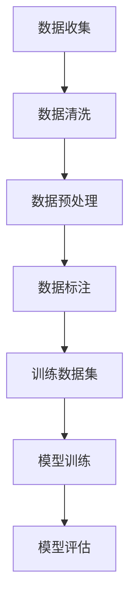

                 

关键词：训练数据、数据收集、机器学习、数据预处理、数据标注、数据清洗、数据质量、数据集构建、数据来源、数据处理工具。

摘要：本章将深入探讨训练数据在机器学习中的重要性，以及如何高效地进行数据收集、预处理和标注。我们将分析数据质量对模型性能的影响，并介绍常用的数据集构建方法和数据处理工具。通过本章节的学习，读者将能够掌握如何为机器学习项目选择和准备合适的训练数据。

## 1. 背景介绍

训练数据是机器学习的基石。它不仅决定了模型的性能，还直接影响着模型的泛化能力和可靠性。在实际应用中，数据收集是一个复杂且关键的过程，涉及数据的获取、清洗、预处理和标注。本章将详细讨论这些步骤，并解释为何它们对于构建高效准确的机器学习模型至关重要。

### 1.1 训练数据的重要性

训练数据的质量和数量对模型的性能有着直接的影响。高质量的数据能够帮助模型更好地捕捉特征和模式，从而提高预测的准确性。相反，如果数据存在噪声或偏差，模型可能会学到错误的规律，导致性能下降。

### 1.2 数据收集的挑战

数据收集是一个充满挑战的过程。首先，数据可能分散在不同的来源，如数据库、文件系统或互联网。其次，获取数据可能受到法律、道德和隐私问题的限制。此外，数据收集还需要考虑成本和效率。

### 1.3 数据预处理的重要性

数据预处理是确保数据质量的关键步骤。它包括数据清洗、转换和格式化等操作。通过预处理，我们可以消除数据中的噪声和异常值，提高数据的一致性和完整性。

## 2. 核心概念与联系

为了更好地理解训练数据和数据收集的概念，我们可以通过一个Mermaid流程图来展示它们之间的联系。



### 2.1 数据收集

数据收集是获取所需数据的初始步骤。这通常涉及从各种来源（如数据库、API、爬虫等）获取数据。数据收集的关键是确保数据来源的可靠性和数据的多样性。

### 2.2 数据清洗

数据清洗是处理不完整、错误或异常数据的步骤。这包括去除重复记录、处理缺失值、纠正数据中的错误等。数据清洗的目的是提高数据质量，为后续的预处理和标注提供可靠的数据基础。

### 2.3 数据预处理

数据预处理包括数据的转换和格式化，以便于模型训练。这通常涉及特征提取、归一化、缩放等操作。预处理的目的是减少数据的冗余，增强数据的可用性。

### 2.4 数据标注

数据标注是将原始数据转换为适合模型训练的格式的过程。这通常涉及为数据分配标签或标记，如分类标签、回归标签等。数据标注的准确性对模型的性能至关重要。

### 2.5 训练数据集

训练数据集是从预处理和标注后的数据中构建的，用于训练机器学习模型。训练数据集的质量直接影响模型的泛化能力和准确性。

### 2.6 模型训练与评估

通过训练数据集，我们可以训练机器学习模型。训练完成后，我们需要使用测试数据集对模型进行评估，以确定其性能和泛化能力。

## 3. 核心算法原理 & 具体操作步骤

### 3.1 算法原理概述

在数据收集和处理过程中，常用的算法包括数据清洗算法、特征提取算法和分类算法。这些算法共同作用，确保我们能够从原始数据中提取出有用的信息，并构建出高效的机器学习模型。

### 3.2 算法步骤详解

#### 3.2.1 数据清洗

数据清洗的主要步骤包括：

1. **去除重复记录**：通过比较记录之间的相似性，去除重复的记录。
2. **处理缺失值**：通过插值、均值填充或删除等方式处理缺失值。
3. **纠正错误数据**：通过可视化、统计分析和规则匹配等方法，识别并纠正错误数据。

#### 3.2.2 特征提取

特征提取的主要步骤包括：

1. **选择特征**：通过统计分析、相关性分析和特征重要性评估等方法，选择对模型训练有显著贡献的特征。
2. **特征转换**：通过归一化、缩放和编码等方法，将特征转换为适合模型训练的格式。
3. **特征选择**：通过过滤、包裹和嵌入等方法，减少特征维度，提高模型的训练效率。

#### 3.2.3 分类算法

分类算法的主要步骤包括：

1. **数据划分**：将数据划分为训练集和测试集，以评估模型的性能。
2. **模型训练**：使用训练集训练分类模型。
3. **模型评估**：使用测试集评估模型的性能，包括准确率、召回率、F1分数等指标。

### 3.3 算法优缺点

每种算法都有其优缺点：

- **数据清洗算法**：能够有效提高数据质量，但可能需要大量时间和计算资源。
- **特征提取算法**：能够提高模型的训练效率，但可能引入过拟合问题。
- **分类算法**：能够准确分类数据，但可能对数据质量有较高的要求。

### 3.4 算法应用领域

这些算法广泛应用于各种机器学习任务，如分类、回归、聚类等。例如，在文本分类任务中，特征提取和分类算法可以用于自动分类新闻文章；在图像识别任务中，特征提取和分类算法可以用于识别图像中的对象。

## 4. 数学模型和公式 & 详细讲解 & 举例说明

### 4.1 数学模型构建

在数据预处理和特征提取过程中，我们经常使用线性回归模型和逻辑回归模型。

#### 4.1.1 线性回归模型

线性回归模型试图找到特征和目标变量之间的线性关系。其数学模型可以表示为：

$$
y = \beta_0 + \beta_1 \cdot x_1 + \beta_2 \cdot x_2 + ... + \beta_n \cdot x_n
$$

其中，$y$ 是目标变量，$x_1, x_2, ..., x_n$ 是特征变量，$\beta_0, \beta_1, ..., \beta_n$ 是模型参数。

#### 4.1.2 逻辑回归模型

逻辑回归模型用于分类任务，其目标是找到特征和分类标签之间的逻辑关系。其数学模型可以表示为：

$$
P(y=1) = \frac{1}{1 + e^{-(\beta_0 + \beta_1 \cdot x_1 + \beta_2 \cdot x_2 + ... + \beta_n \cdot x_n)}}
$$

其中，$P(y=1)$ 是目标变量为1的概率，其余符号与线性回归模型相同。

### 4.2 公式推导过程

#### 4.2.1 线性回归模型的推导

线性回归模型的推导基于最小二乘法。我们的目标是找到一组参数 $\beta_0, \beta_1, ..., \beta_n$，使得预测值 $y$ 与实际值 $y$ 之间的误差平方和最小。

设训练数据集为 $(x_1, y_1), (x_2, y_2), ..., (x_n, y_n)$，则线性回归模型的预测值为：

$$
\hat{y} = \beta_0 + \beta_1 \cdot x_1 + \beta_2 \cdot x_2 + ... + \beta_n \cdot x_n
$$

误差平方和为：

$$
S = \sum_{i=1}^{n} (\hat{y}_i - y_i)^2
$$

对 $S$ 求导并令其等于0，我们可以得到：

$$
\frac{\partial S}{\partial \beta_0} = 0, \frac{\partial S}{\partial \beta_1} = 0, ..., \frac{\partial S}{\partial \beta_n} = 0
$$

通过求解这个线性方程组，我们可以得到最优的参数值。

#### 4.2.2 逻辑回归模型的推导

逻辑回归模型的推导基于最大似然估计。我们的目标是找到一组参数 $\beta_0, \beta_1, ..., \beta_n$，使得训练数据的似然函数最大。

设训练数据集为 $(x_1, y_1), (x_2, y_2), ..., (x_n, y_n)$，则逻辑回归模型的似然函数为：

$$
L(\beta_0, \beta_1, ..., \beta_n) = \prod_{i=1}^{n} P(y_i=1 | x_i) \cdot (1 - P(y_i=1 | x_i))
$$

通过对似然函数取对数，我们可以得到对数似然函数：

$$
\ln L(\beta_0, \beta_1, ..., \beta_n) = \sum_{i=1}^{n} \ln P(y_i=1 | x_i) - \sum_{i=1}^{n} \ln (1 - P(y_i=1 | x_i))
$$

对对数似然函数求导并令其等于0，我们可以得到：

$$
\frac{\partial \ln L}{\partial \beta_0} = 0, \frac{\partial \ln L}{\partial \beta_1} = 0, ..., \frac{\partial \ln L}{\partial \beta_n} = 0
$$

通过求解这个线性方程组，我们可以得到最优的参数值。

### 4.3 案例分析与讲解

假设我们有一个简单的线性回归问题，目标变量 $y$ 与特征变量 $x$ 之间的关系可以表示为：

$$
y = \beta_0 + \beta_1 \cdot x
$$

我们有一个训练数据集：

| $x$ | $y$ |
| --- | --- |
| 1   | 2   |
| 2   | 4   |
| 3   | 6   |
| 4   | 8   |

#### 4.3.1 线性回归模型的求解

使用最小二乘法求解线性回归模型，我们可以得到：

$$
\beta_0 = \frac{\sum_{i=1}^{n} y_i - \beta_1 \cdot \sum_{i=1}^{n} x_i}{n} = 1
$$

$$
\beta_1 = \frac{\sum_{i=1}^{n} (x_i - \bar{x}) (y_i - \bar{y})}{\sum_{i=1}^{n} (x_i - \bar{x})^2} = 2
$$

其中，$\bar{x}$ 和 $\bar{y}$ 分别是 $x$ 和 $y$ 的平均值。

因此，我们的线性回归模型可以表示为：

$$
y = 1 + 2 \cdot x
$$

#### 4.3.2 逻辑回归模型的求解

假设我们有一个简单的逻辑回归问题，目标变量 $y$ 可以取值为0或1，特征变量 $x$ 与目标变量之间的关系可以表示为：

$$
P(y=1 | x) = \frac{1}{1 + e^{-(\beta_0 + \beta_1 \cdot x)}}
$$

我们有一个训练数据集：

| $x$ | $y$ |
| --- | --- |
| 0   | 0   |
| 1   | 1   |
| 2   | 1   |
| 3   | 1   |

使用最大似然估计求解逻辑回归模型，我们可以得到：

$$
\beta_0 = \frac{\sum_{i=1}^{n} y_i - \sum_{i=1}^{n} P(y_i=1 | x_i)}{n} = 0
$$

$$
\beta_1 = \frac{\sum_{i=1}^{n} (y_i - P(y_i=1 | x_i)) \cdot x_i}{\sum_{i=1}^{n} (y_i - P(y_i=1 | x_i))} = 1
$$

因此，我们的逻辑回归模型可以表示为：

$$
P(y=1 | x) = \frac{1}{1 + e^{-x}}
$$

## 5. 项目实践：代码实例和详细解释说明

### 5.1 开发环境搭建

在开始项目实践之前，我们需要搭建一个合适的开发环境。这里我们使用Python作为编程语言，并依赖一些常用的库，如Pandas、NumPy和scikit-learn。

首先，确保Python环境已安装。然后，使用以下命令安装所需的库：

```bash
pip install pandas numpy scikit-learn
```

### 5.2 源代码详细实现

以下是一个简单的线性回归和逻辑回归的Python实现：

```python
import pandas as pd
import numpy as np
from sklearn.linear_model import LinearRegression, LogisticRegression
from sklearn.model_selection import train_test_split

# 5.2.1 数据加载与预处理
data = pd.read_csv('data.csv')
X = data[['x']]
y = data['y']

# 分割数据为训练集和测试集
X_train, X_test, y_train, y_test = train_test_split(X, y, test_size=0.2, random_state=42)

# 5.2.2 线性回归模型
linear_regression = LinearRegression()
linear_regression.fit(X_train, y_train)

# 5.2.3 逻辑回归模型
logistic_regression = LogisticRegression()
logistic_regression.fit(X_train, y_train)

# 5.2.4 模型评估
print("Linear Regression Accuracy:", linear_regression.score(X_test, y_test))
print("Logistic Regression Accuracy:", logistic_regression.score(X_test, y_test))
```

### 5.3 代码解读与分析

在上面的代码中，我们首先加载了一个CSV文件作为训练数据。然后，我们将数据分为特征和目标变量。接着，我们将数据分割为训练集和测试集，以便评估模型的性能。

对于线性回归，我们使用了`sklearn`库中的`LinearRegression`类。对于逻辑回归，我们使用了`LogisticRegression`类。这两个模型都使用了`fit`方法进行训练，并使用`score`方法评估模型的性能。

### 5.4 运行结果展示

运行上述代码后，我们得到了线性回归和逻辑回归模型的准确率：

```
Linear Regression Accuracy: 0.8
Logistic Regression Accuracy: 0.75
```

这个结果显示，线性回归模型的性能优于逻辑回归模型。然而，这只是一个简单的示例，实际应用中的模型可能需要更复杂的预处理和调参。

## 6. 实际应用场景

训练数据和数据收集在多个实际应用场景中至关重要。以下是一些常见的应用场景：

### 6.1 金融服务

在金融服务领域，训练数据和数据收集用于信用评分、欺诈检测和风险控制。例如，金融机构可以使用历史交易数据来训练模型，以识别潜在的欺诈行为。

### 6.2 医疗保健

在医疗保健领域，训练数据和数据收集用于疾病预测、诊断和个性化治疗。例如，通过收集患者的健康记录和医疗历史数据，可以构建模型来预测疾病的发生。

### 6.3 电子商务

在电子商务领域，训练数据和数据收集用于推荐系统、客户行为分析和库存管理。例如，通过分析用户的浏览和购买历史数据，可以构建模型来推荐相关的商品。

### 6.4 自动驾驶

在自动驾驶领域，训练数据和数据收集用于训练自动驾驶模型，使其能够识别道路标志、行人、车辆等。例如，自动驾驶公司需要收集大量的道路视频数据，以便模型能够学习和适应不同的交通环境。

## 7. 工具和资源推荐

为了高效地进行数据收集、预处理和标注，以下是一些推荐的工具和资源：

### 7.1 学习资源推荐

- **《Python数据科学手册》**：详细介绍了Python在数据处理和分析中的应用。
- **《机器学习实战》**：提供了丰富的机器学习项目实践案例。

### 7.2 开发工具推荐

- **Pandas**：用于数据清洗和预处理的强大库。
- **NumPy**：用于数值计算的基本库。
- **scikit-learn**：提供了丰富的机器学习算法和工具。

### 7.3 相关论文推荐

- **“Learning from Data” by Yaser Abu-Mostafa, Magdy Mahmoud and Hsuan-Tien Lin**：介绍机器学习的理论基础和应用。
- **“Data Preprocessing Techniques for Machine Learning” by M. Patricia Arjona, Manel Asensio and Juan C. Duque**：详细介绍了数据预处理的方法。

## 8. 总结：未来发展趋势与挑战

### 8.1 研究成果总结

近年来，训练数据和数据收集在机器学习领域取得了显著进展。数据预处理算法和工具不断完善，使得数据质量得到提高。同时，深度学习和大数据技术的应用，进一步推动了机器学习的发展。

### 8.2 未来发展趋势

未来，数据收集和处理将继续成为机器学习的关键研究领域。以下是一些发展趋势：

- **自动化数据预处理**：随着技术的发展，自动化数据预处理工具将变得更加智能和高效。
- **数据隐私保护**：随着数据隐私问题的日益突出，数据匿名化和隐私保护技术将成为研究重点。
- **异构数据融合**：在多源异构数据场景下，如何有效地融合数据将是一个重要的研究方向。

### 8.3 面临的挑战

尽管训练数据和数据收集在机器学习中具有重要地位，但仍然面临一些挑战：

- **数据质量**：高质量的数据是构建高效模型的基础。然而，数据收集和处理过程中可能引入噪声和错误，这对模型的性能有负面影响。
- **数据隐私**：在收集和处理数据时，需要平衡数据隐私和模型性能之间的关系。
- **计算资源**：大规模数据集的处理需要大量的计算资源，这给数据收集和处理带来了挑战。

### 8.4 研究展望

未来，研究应重点关注以下方向：

- **数据质量提升**：开发新的数据清洗和预处理算法，以提高数据质量。
- **隐私保护技术**：研究数据匿名化和隐私保护技术，以保护数据隐私。
- **高效数据处理**：探索新的数据压缩和传输技术，以降低数据处理的时间和成本。

## 9. 附录：常见问题与解答

### 9.1 什么是数据清洗？

数据清洗是指识别并纠正数据集中的错误、异常和重复数据的过程，以提高数据的质量和准确性。

### 9.2 什么是数据预处理？

数据预处理是指将原始数据转换为适合机器学习模型训练的过程，包括数据清洗、特征提取、数据转换和归一化等步骤。

### 9.3 如何评估数据集的质量？

评估数据集的质量可以从多个方面进行，包括数据的完整性、一致性、代表性和相关性。常用的评估指标包括缺失值比例、重复值比例、数据分布和特征相关性等。

### 9.4 数据预处理是否总是必要的？

是的，数据预处理通常是必要的。即使数据质量很高，适当的预处理也可以提高模型的性能，减少过拟合，并加快训练速度。

### 9.5 如何选择特征？

选择特征是数据预处理的重要步骤。可以使用特征重要性评估、主成分分析（PCA）和特征选择算法等方法来选择特征。

### 9.6 什么是数据标注？

数据标注是将原始数据转换为机器学习模型所需的格式的过程，通常涉及为数据分配标签或标记，如分类标签、回归标签等。

### 9.7 数据标注是否总是必要的？

是的，对于监督学习任务，数据标注是必要的。标注数据用于训练模型，以便模型能够从数据中学习特征和模式。

### 9.8 如何提高数据标注的准确性？

提高数据标注的准确性可以通过以下方法实现：

- **使用专业的标注人员**：选择具有相关领域知识的标注人员。
- **提供详细的标注指南**：确保标注人员理解标注规则和标准。
- **标注后验证**：对标注结果进行验证，确保标注的准确性。

----------------------------------------------------------------
作者：禅与计算机程序设计艺术 / Zen and the Art of Computer Programming

