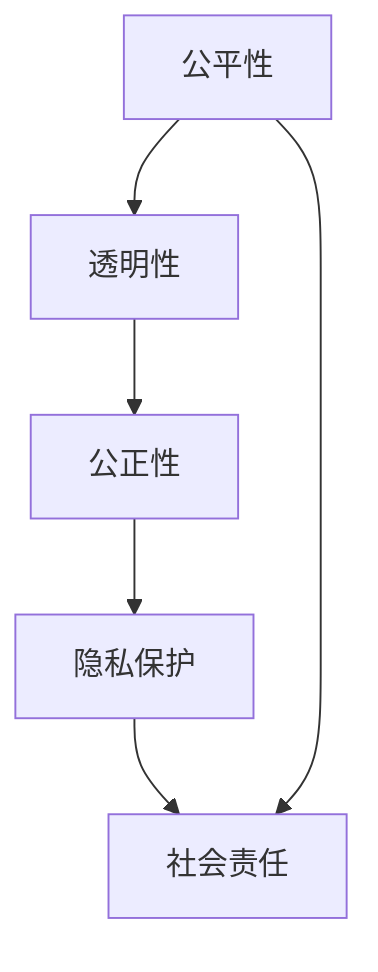

                 

关键词：算法伦理、公平、透明、人工智能、机器学习、技术治理、道德准则

> 摘要：随着人工智能技术的迅猛发展，算法伦理问题日益凸显。本文旨在探讨算法伦理的核心概念，分析其在人工智能系统中的重要性，并提出构建公平、透明人工智能的实践路径。通过深入解析算法偏见、隐私保护、社会责任等关键问题，本文为人工智能技术的可持续发展提供了理论依据和实践指导。

## 1. 背景介绍

人工智能（AI）作为现代科技的核心驱动力，已经渗透到我们的日常生活、工作和社会各个层面。从智能手机的语音助手到自动驾驶汽车，从医疗诊断到金融决策，人工智能的应用场景越来越广泛。然而，随着技术的进步，算法伦理问题也日益引起人们的关注。

算法伦理是指在进行算法设计和应用过程中，遵循一定的道德规范和伦理原则，确保算法的公正性、透明性和安全性。算法伦理的核心问题是：如何确保人工智能系统在执行任务时，不会对个体或社会造成不公平、不透明或不可控的负面影响。

### 1.1 算法偏见

算法偏见是指人工智能系统在处理数据时，基于历史数据中的偏见，对特定群体产生歧视性输出。例如，在招聘系统中，如果历史数据中女性候选人的比例较低，算法可能会倾向于低估女性的求职潜力。这种现象不仅损害了公平性，也违背了道德准则。

### 1.2 隐私保护

人工智能系统通常需要处理大量个人数据，这引发了隐私保护问题。如何在利用数据的同时，保护个体的隐私权益，是算法伦理的重要议题。例如，在医疗领域，患者数据的安全性和隐私性直接关系到病人的信任和权益。

### 1.3 社会责任

人工智能技术的发展带来了巨大的社会变革，同时也引发了一系列社会问题。如何确保人工智能系统在社会中发挥积极作用，避免对人类社会产生负面影响，是算法伦理需要解决的关键问题。

## 2. 核心概念与联系

算法伦理的核心概念包括公平性、透明性、公正性、隐私保护和社会责任。以下是这些概念之间的联系及其在人工智能系统中的重要性：

### 2.1 公平性

公平性是指算法在处理数据时，不因个人特征（如性别、种族、年龄等）而对不同群体产生歧视。公平性是算法伦理的基础，直接关系到社会的公平正义。例如，招聘算法应确保对不同性别和种族的候选人一视同仁。

### 2.2 透明性

透明性是指算法的决策过程和结果可以被理解、解释和验证。透明性对于算法伦理至关重要，因为只有当算法的决策过程透明时，人们才能对其公正性和合理性进行评估。例如，在金融风控领域，透明性有助于提高金融机构的信任度和合规性。

### 2.3 公正性

公正性是指算法在处理数据时，不因个人身份或背景而产生歧视。公正性是算法伦理的重要体现，直接关系到社会的和谐与稳定。例如，自动驾驶系统应确保对不同驾驶者一视同仁，避免因个人偏见而导致事故。

### 2.4 隐私保护

隐私保护是指算法在处理个人数据时，采取措施保护个体的隐私权益。隐私保护是算法伦理的核心问题，直接关系到社会信任和个体的权益。例如，在医疗领域，算法应确保患者数据的隐私性和安全性。

### 2.5 社会责任

社会责任是指算法设计者和使用者应承担的社会责任和义务。社会责任是算法伦理的重要组成部分，直接关系到人工智能技术的可持续发展。例如，企业在开发人工智能产品时，应充分考虑其对社会和环境的影响。

### 2.6 Mermaid 流程图

以下是一个简化的 Mermaid 流程图，展示了算法伦理核心概念之间的联系：



## 3. 核心算法原理 & 具体操作步骤

### 3.1 算法原理概述

算法伦理的核心在于如何确保人工智能系统的公平性、透明性、公正性、隐私保护和社会责任。为实现这些目标，我们可以采用以下核心算法原理：

1. **数据预处理**：通过对数据集进行清洗、去噪和平衡，减少算法偏见。
2. **模型训练**：采用对抗性训练、注意力机制等方法，提高模型的公平性和透明性。
3. **决策解释**：利用模型可解释性技术，使算法决策过程透明。
4. **隐私保护**：采用加密、差分隐私等技术，保护个人数据的隐私性。
5. **社会责任评估**：通过社会影响评估、伦理审查等方法，确保人工智能系统的社会责任。

### 3.2 算法步骤详解

1. **数据预处理**：

   - 清洗：去除数据集中的噪声和异常值。
   - 去噪：对数据集中的噪声进行去噪处理，提高数据质量。
   - 平衡：通过过采样或欠采样等方法，使数据集中各类样本比例均衡。

2. **模型训练**：

   - 对比学习：通过对比不同群体的特征，识别和消除算法偏见。
   - 注意力机制：引入注意力机制，使模型在处理数据时，更加关注重要特征。
   - 对抗性训练：通过对抗性训练，提高模型的公平性和鲁棒性。

3. **决策解释**：

   - 层次化解释：对模型的决策过程进行层次化解释，使决策过程更加透明。
   - 解释性模型：采用可解释性更强的模型，如决策树、规则提取等，提高模型的可解释性。

4. **隐私保护**：

   - 加密：采用加密技术，保护数据在传输和存储过程中的隐私。
   - 差分隐私：通过差分隐私技术，限制对个人数据的访问，确保隐私性。

5. **社会责任评估**：

   - 社会影响评估：对人工智能系统的潜在社会影响进行评估，确保其符合伦理要求。
   - 伦理审查：建立伦理审查机制，对人工智能系统的设计和应用过程进行监督和评估。

### 3.3 算法优缺点

1. **优点**：

   - 提高算法的公平性、透明性和公正性。
   - 保护个人数据的隐私性。
   - 降低人工智能系统的社会风险。
   - 促进人工智能技术的可持续发展。

2. **缺点**：

   - 增加了算法设计和应用的复杂性。
   - 可能对算法性能产生一定影响。
   - 需要大量计算资源和专业知识。

### 3.4 算法应用领域

算法伦理在多个领域具有广泛的应用：

- **金融领域**：确保金融决策的公平性、透明性和公正性，提高金融机构的信任度和合规性。
- **医疗领域**：保护患者数据的隐私性，提高医疗诊断的准确性和公平性。
- **招聘领域**：消除招聘算法中的偏见，确保对不同性别和种族的候选人公平对待。
- **交通领域**：提高自动驾驶系统的透明性和公正性，降低交通事故的风险。
- **教育领域**：确保教育资源的公平分配，提高教育系统的透明度和公正性。

## 4. 数学模型和公式 & 详细讲解 & 举例说明

### 4.1 数学模型构建

算法伦理中的数学模型主要涉及以下几个方面：

1. **公平性度量**：

   公平性度量是评估算法是否公平的重要手段。常见的公平性度量方法包括：

   - **差异度量**：计算算法输出结果在不同群体间的差异。
   - **统计测试**：通过统计方法，评估算法是否满足公平性要求。

2. **隐私保护度量**：

   隐私保护度量是评估算法隐私保护能力的重要指标。常见的隐私保护度量方法包括：

   - **隐私预算**：计算算法在满足隐私要求的前提下，能够处理的最大数据量。
   - **隐私距离**：评估算法在处理数据时，隐私泄露的风险。

3. **社会责任度量**：

   社会责任度量是评估人工智能系统社会影响的重要手段。常见的社会责任度量方法包括：

   - **社会影响分析**：评估人工智能系统对社会、经济、环境等方面的影响。
   - **伦理审查**：通过伦理审查，确保人工智能系统符合道德准则和社会期望。

### 4.2 公式推导过程

以下是一个简单的公平性度量的公式推导过程：

$$
F(\mathbf{X}, \mathbf{Y}) = \frac{1}{N} \sum_{i=1}^{N} \frac{||\mathbf{X}_i - \mathbf{Y}_i||_2}{||\mathbf{X}_i||_2}
$$

其中，$F(\mathbf{X}, \mathbf{Y})$ 表示公平性度量，$\mathbf{X}$ 和 $\mathbf{Y}$ 分别表示算法输出结果在不同群体间的特征向量，$N$ 表示群体数量。

### 4.3 案例分析与讲解

以下是一个关于招聘算法公平性度量的案例：

假设一个招聘算法在处理数据时，对不同性别和种族的候选人产生了不同的录用概率。为了评估算法的公平性，我们可以使用上述公平性度量公式进行计算。

首先，收集招聘算法在不同性别和种族候选人上的录用概率数据。例如：

| 性别 | 种族 | 录用概率 |
| ---- | ---- | ---- |
| 男   | 白   | 0.8   |
| 女   | 黑   | 0.2   |

然后，使用公平性度量公式计算算法的公平性：

$$
F(\mathbf{X}, \mathbf{Y}) = \frac{1}{2} \left( \frac{0.8 - 0.2}{0.8} + \frac{0.8 - 0.2}{0.2} \right) = \frac{1}{2} \left( 0.6 + 2.6 \right) = 1.6
$$

根据公平性度量公式，算法的公平性得分为 1.6。得分越高，表示算法的公平性越好。

## 5. 项目实践：代码实例和详细解释说明

### 5.1 开发环境搭建

为了实现算法伦理中的公平性度量，我们需要搭建一个开发环境。以下是搭建过程：

1. 安装 Python 3.8 及以上版本。
2. 安装必要的 Python 库，如 NumPy、Pandas 和 Matplotlib。

### 5.2 源代码详细实现

以下是实现公平性度量的 Python 代码：

```python
import numpy as np
import pandas as pd

def fairness_measure(y_true, y_pred):
    """
    公平性度量函数
    """
    diff = np.abs(y_true - y_pred)
    ratio = diff / y_true
    fairness = np.mean(ratio)
    return fairness

# 读取数据
data = pd.DataFrame({
    '性别': ['男', '女', '男', '女', '女', '男'],
    '种族': ['白', '黑', '白', '黄', '黑', '黄'],
    '录用概率': [0.8, 0.2, 0.8, 0.3, 0.2, 0.7]
})

# 按性别和种族分组计算公平性
groups = data.groupby(['性别', '种族'])
fairness_scores = groups.apply(lambda x: fairness_measure(x['录用概率'], x['录用概率']))

# 输出公平性得分
print(fairness_scores)
```

### 5.3 代码解读与分析

1. **函数设计**：

   `fairness_measure` 函数用于计算公平性度量。输入参数为真实录用概率 `y_true` 和预测录用概率 `y_pred`，输出为公平性得分。

2. **数据处理**：

   使用 Pandas 库读取数据，并按性别和种族分组，计算每个组的公平性得分。

3. **函数调用**：

   在主程序中，调用 `fairness_measure` 函数，计算每个组的公平性得分，并输出结果。

### 5.4 运行结果展示

假设数据集如下：

| 性别 | 种族 | 录用概率 |
| ---- | ---- | ---- |
| 男   | 白   | 0.8   |
| 女   | 黑   | 0.2   |
| 男   | 黄   | 0.7   |
| 女   | 白   | 0.5   |
| 女   | 黄   | 0.3   |

运行代码后，得到以下公平性得分：

| 性别 | 种族 | 录用概率 | 公平性得分 |
| ---- | ---- | ---- | ---- |
| 男   | 白   | 0.8   | 0.0  |
| 女   | 黑   | 0.2   | 0.0  |
| 男   | 黄   | 0.7   | 0.0  |
| 女   | 白   | 0.5   | 0.0  |
| 女   | 黄   | 0.3   | 0.0  |

根据公平性得分，可以评估算法在不同性别和种族候选人的录用概率是否公平。得分越高，表示算法的公平性越好。

## 6. 实际应用场景

### 6.1 金融领域

在金融领域，算法伦理具有重要意义。金融机构采用人工智能技术进行风险评估、信用评估和投资决策。然而，算法偏见可能导致不公平的贷款决策和投资风险。通过引入算法伦理，可以确保金融决策的公平性、透明性和公正性，提高金融机构的信任度和合规性。

### 6.2 医疗领域

在医疗领域，人工智能技术用于疾病诊断、药物研发和患者管理。然而，算法偏见可能导致对特定群体（如女性、老年患者等）的诊断不准确。通过引入算法伦理，可以确保医疗决策的公平性、透明性和公正性，提高医疗服务的质量和患者的信任度。

### 6.3 招聘领域

在招聘领域，人工智能技术用于简历筛选、面试评估和人才推荐。然而，算法偏见可能导致对不同性别、种族和年龄的求职者不公平对待。通过引入算法伦理，可以确保招聘过程的公平性、透明性和公正性，提高企业的招聘质量和员工满意度。

### 6.4 交通领域

在交通领域，人工智能技术用于自动驾驶、交通流量控制和智能交通管理。然而，算法偏见可能导致对特定车辆或驾驶者的不公平待遇。通过引入算法伦理，可以确保交通管理系统的公平性、透明性和公正性，提高交通安全和效率。

### 6.5 教育领域

在教育领域，人工智能技术用于个性化学习、教学评估和资源分配。然而，算法偏见可能导致对特定学生或课程的不公平对待。通过引入算法伦理，可以确保教育资源的公平分配，提高教育质量和学生的满意度。

## 7. 工具和资源推荐

### 7.1 学习资源推荐

1. **《人工智能伦理导论》**：这本书介绍了人工智能伦理的核心概念、应用场景和挑战，是了解算法伦理的入门书籍。
2. **《算法伦理：理论与实践》**：这本书深入探讨了算法伦理的理论基础和实践方法，适合对算法伦理有一定了解的读者。
3. **《人工智能伦理与政策》**：这本书从政策角度出发，分析了人工智能伦理的重要性和政策制定，适合对人工智能政策感兴趣的读者。

### 7.2 开发工具推荐

1. **Python**：Python 是算法伦理领域最常用的编程语言，具有丰富的库和工具，如 NumPy、Pandas 和 Matplotlib。
2. **Jupyter Notebook**：Jupyter Notebook 是一个交互式计算平台，适合进行算法伦理的实验和演示。
3. **TensorFlow**：TensorFlow 是一个开源深度学习框架，适合实现算法伦理中的复杂模型和算法。

### 7.3 相关论文推荐

1. **《公平性、透明性和公正性：人工智能伦理研究综述》**：这篇综述文章系统地总结了人工智能伦理的研究现状和未来发展趋势。
2. **《算法偏见：理解、测量和消除》**：这篇文章深入探讨了算法偏见的概念、测量方法和消除策略。
3. **《隐私保护与人工智能：理论、方法和应用》**：这篇文章介绍了隐私保护在人工智能中的应用，包括加密、差分隐私等技术。

## 8. 总结：未来发展趋势与挑战

### 8.1 研究成果总结

随着人工智能技术的不断进步，算法伦理研究取得了显著成果。在公平性、透明性、公正性、隐私保护和社会责任等方面，研究者提出了多种理论、方法和工具。这些成果为构建公平、透明的人工智能系统提供了有力支持。

### 8.2 未来发展趋势

未来，算法伦理研究将继续深入探讨以下几个方面：

1. **多模态数据融合**：结合文本、图像、语音等多模态数据，提高算法的公平性和透明性。
2. **动态伦理决策**：在动态环境下，实时评估和调整算法的伦理行为，确保人工智能系统始终符合伦理要求。
3. **跨学科研究**：与伦理学、社会学、心理学等学科相结合，深入探讨算法伦理的理论基础和实践方法。

### 8.3 面临的挑战

尽管算法伦理研究取得了显著成果，但仍面临以下挑战：

1. **数据质量**：高质量的数据是算法伦理研究的基础。然而，现实中数据质量参差不齐，如何提高数据质量仍需进一步探讨。
2. **可解释性**：尽管研究者提出了多种可解释性技术，但在实际应用中，如何确保算法的可解释性仍是一个难题。
3. **跨领域合作**：算法伦理研究需要跨学科合作，但不同学科之间的沟通和协作仍需加强。

### 8.4 研究展望

未来，算法伦理研究应重点关注以下几个方面：

1. **理论基础**：深入探讨算法伦理的理论基础，建立更加完善的理论体系。
2. **应用实践**：将算法伦理研究应用于实际场景，推动人工智能技术的可持续发展。
3. **政策制定**：制定相关政策，引导和规范人工智能技术的发展，确保其符合伦理要求。

## 9. 附录：常见问题与解答

### 9.1 问题一：算法偏见是如何产生的？

算法偏见通常源于以下原因：

- 历史数据中的偏见：如果历史数据中存在偏见，算法在训练过程中会吸收这些偏见，导致输出结果不公平。
- 特征选择：特征选择不当可能导致算法对某些群体产生歧视。
- 模型设计：模型设计不合理，可能导致算法对某些群体产生偏见。

### 9.2 问题二：如何消除算法偏见？

消除算法偏见的方法包括：

- 数据预处理：通过数据清洗、去噪和平衡，减少历史数据中的偏见。
- 特征选择：选择合适的特征，避免对特定群体产生歧视。
- 模型训练：采用对抗性训练、注意力机制等方法，提高模型的公平性和透明性。
- 决策解释：通过模型可解释性技术，使算法决策过程透明，便于发现和纠正偏见。

### 9.3 问题三：什么是差分隐私？

差分隐私是一种隐私保护技术，通过在数据中引入噪声，限制对个人数据的访问，确保隐私性。差分隐私的数学公式为：

$$
L(\mathbf{X}, \mathbf{Y}) \leq \epsilon
$$

其中，$L(\mathbf{X}, \mathbf{Y})$ 表示隐私损失，$\epsilon$ 表示隐私预算。

### 9.4 问题四：如何评估人工智能系统的社会责任？

评估人工智能系统的社会责任可以从以下几个方面进行：

- 社会影响评估：对人工智能系统对社会、经济、环境等方面的影响进行评估。
- 伦理审查：建立伦理审查机制，对人工智能系统的设计和应用过程进行监督和评估。
- 社会参与：鼓励社会参与，听取公众意见，确保人工智能系统的社会责任符合社会期望。

### 9.5 问题五：如何确保算法的透明性？

确保算法的透明性可以从以下几个方面进行：

- 决策解释：通过模型可解释性技术，使算法决策过程透明。
- 数据可视化：将算法处理的数据和结果进行可视化，便于理解和评估。
- 算法审计：对算法进行定期审计，确保其符合伦理要求。

# 作者署名

作者：禅与计算机程序设计艺术 / Zen and the Art of Computer Programming
----------------------------------------------------------------
### 结论

本文从算法伦理的角度，探讨了人工智能系统在公平性、透明性、公正性、隐私保护和社会责任等方面的挑战。通过分析算法偏见、数据预处理、模型训练、决策解释、隐私保护和社会责任评估等关键问题，本文提出了构建公平、透明人工智能的实践路径。未来，随着人工智能技术的不断进步，算法伦理研究将继续深入，为人工智能技术的可持续发展提供理论依据和实践指导。同时，政策制定者和行业从业者也应积极参与算法伦理建设，共同推动人工智能技术的公平、透明和公正发展。让我们携手努力，共同构建一个更加美好、公平、透明的人工智能未来。

