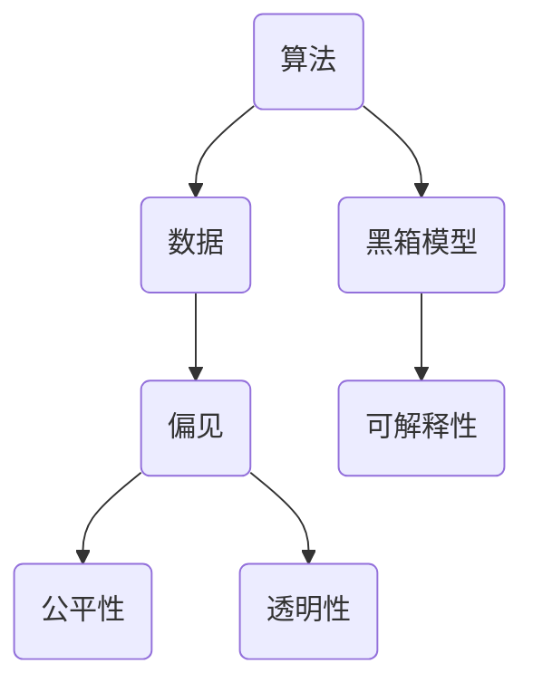

                 

关键词：算法伦理、公平、透明、人工智能、人工智能伦理、算法公平性、算法透明性、技术伦理、数据伦理、隐私保护

人工智能作为当前科技领域的热点，正逐渐渗透到我们的日常生活、工作和社会治理中。然而，人工智能系统在决策过程中的公平性和透明性成为了我们不得不面对的重要问题。算法伦理，即如何构建公平、透明的人工智能系统，是当今人工智能研究者和开发者必须深入探讨的课题。

## 1. 背景介绍

随着大数据和机器学习的迅速发展，人工智能技术已经取得了显著的成果。然而，这些技术也带来了一系列伦理问题，特别是在算法的公平性和透明性方面。人工智能系统在决策时可能存在偏见，这种偏见可能源自数据集的不公平、算法的设计缺陷或者训练过程中对某些群体的歧视。此外，人工智能系统的决策过程往往是黑箱式的，难以理解和追踪，这增加了人们对其公正性的质疑。

本文旨在探讨算法伦理的重要性，分析现有的人工智能系统在公平性和透明性方面存在的问题，并提出一些可能的解决方案。通过本文的讨论，希望能够为人工智能伦理的研究和实践提供一些有价值的参考。

## 2. 核心概念与联系

为了更好地理解算法伦理，我们需要先了解一些核心概念，如算法、数据、偏见和透明性。下面将使用Mermaid流程图来展示这些概念之间的关系。



### 2.1 算法

算法是解决问题的一系列规则或步骤。在人工智能领域，算法用于训练模型，使其能够从数据中学习并做出决策。常见的算法包括决策树、神经网络、支持向量机等。

### 2.2 数据

数据是算法的基础。数据的质量和多样性直接影响算法的性能和公平性。在训练人工智能模型时，我们需要使用广泛且代表真实世界的数据集。

### 2.3 偏见

偏见是指算法对某些群体的不公平对待。这种偏见可能源于数据集中的偏差、算法的设计缺陷或训练过程中的不当操作。

### 2.4 公平性

公平性是指算法对所有用户的决策应该一致，不应受到性别、种族、年龄等因素的影响。

### 2.5 透明性

透明性是指算法的决策过程应该是可理解、可追踪的。这有助于用户理解算法如何做出决策，并能够对其提出质疑。

### 2.6 黑箱模型与可解释性

黑箱模型是指决策过程难以理解的人工智能模型。与黑箱模型相对的是可解释性模型，其决策过程可以清晰地展示，便于用户理解。

## 3. 核心算法原理 & 具体操作步骤

### 3.1 算法原理概述

为了构建公平、透明的人工智能系统，我们需要从以下几个方面入手：

- **数据预处理**：确保数据集的多样性和代表性，减少偏见。
- **算法选择**：选择可解释性较高的算法，以便用户理解决策过程。
- **算法优化**：通过不断调整算法参数，提高算法的公平性和透明性。

### 3.2 算法步骤详解

#### 3.2.1 数据预处理

1. **数据清洗**：处理缺失值、异常值和重复数据。
2. **特征工程**：选择与目标相关的特征，并对其进行预处理，如归一化、标准化等。
3. **数据扩充**：通过增加数据样本、生成对抗网络（GAN）等方法，提高数据集的多样性。

#### 3.2.2 算法选择

1. **基于规则的算法**：如决策树、规则引擎等，易于理解，但可能存在过拟合问题。
2. **基于模型的算法**：如神经网络、支持向量机等，性能较好，但难以解释。
3. **混合算法**：结合规则和模型，以提高公平性和透明性。

#### 3.2.3 算法优化

1. **交叉验证**：通过交叉验证，选择最优的算法参数。
2. **偏差-方差分析**：通过分析偏差和方差，调整模型复杂度，提高公平性和透明性。
3. **持续监控**：实时监控算法性能，发现并解决潜在的偏见和透明性问题。

### 3.3 算法优缺点

#### 3.3.1 优点

- **提高决策公平性**：通过数据预处理和算法优化，减少算法偏见，提高决策的公平性。
- **提高决策透明性**：选择可解释性较高的算法，使用户能够理解决策过程。

#### 3.3.2 缺点

- **性能损失**：为了提高公平性和透明性，可能需要牺牲一定的模型性能。
- **计算成本**：算法优化和持续监控需要大量的计算资源。

### 3.4 算法应用领域

算法伦理在多个领域具有重要应用，如金融、医疗、法律、招聘等。在这些领域中，算法的公平性和透明性直接关系到用户的权益和利益。以下是一些具体的应用场景：

- **金融**：在贷款审批、风险评估等环节，确保算法不会对特定群体产生不公平对待。
- **医疗**：在疾病诊断、治疗方案推荐等方面，确保算法的决策过程透明、可解释。
- **法律**：在案件审理、判决预测等方面，确保算法的决策过程符合法律和伦理要求。
- **招聘**：在招聘过程中，确保算法不会对性别、年龄等产生偏见，提高招聘的公平性。

## 4. 数学模型和公式 & 详细讲解 & 举例说明

为了构建公平、透明的人工智能系统，我们需要使用一些数学模型和公式。以下将详细介绍这些模型和公式的构建过程、推导过程，并给出具体的案例。

### 4.1 数学模型构建

#### 4.1.1 偏见度量

偏见度量是评估算法偏见程度的关键指标。一个常用的偏见度量方法是**差异度量（Difference Measure）**，其公式如下：

$$
D = \frac{1}{n} \sum_{i=1}^{n} |y_i - \hat{y}_i|
$$

其中，$D$为偏见度量，$y_i$为实际标签，$\hat{y}_i$为算法预测标签，$n$为样本数量。

#### 4.1.2 公平性度量

公平性度量是评估算法公平性的关键指标。一个常用的公平性度量方法是**公平性指数（Fairness Index）**，其公式如下：

$$
F = \frac{\sum_{i=1}^{n} (y_i - \hat{y}_i)^2}{\sum_{i=1}^{n} (y_i - \bar{y})^2}
$$

其中，$F$为公平性指数，$y_i$为实际标签，$\hat{y}_i$为算法预测标签，$\bar{y}$为样本均值，$n$为样本数量。

### 4.2 公式推导过程

#### 4.2.1 偏见度量

偏见度量公式中的分子表示预测标签与实际标签之间的差异，分母表示实际标签的方差。通过计算两者的比值，可以衡量算法的偏见程度。

#### 4.2.2 公平性度量

公平性度量公式中的分子表示预测标签与实际标签之间的差异的平方和，分母表示实际标签的方差。通过计算两者的比值，可以衡量算法的公平性。

### 4.3 案例分析与讲解

#### 4.3.1 案例背景

某银行在贷款审批过程中使用了一款基于人工智能的决策系统。然而，用户反馈该系统存在明显的性别偏见，即男性用户更容易获得贷款。

#### 4.3.2 数据处理

1. **数据清洗**：处理缺失值、异常值和重复数据。
2. **特征工程**：选择与贷款审批相关的特征，如收入、信用评分、工作年限等。

#### 4.3.3 模型训练

1. **算法选择**：选择决策树算法，其具有较好的可解释性。
2. **模型训练**：使用训练数据集训练决策树模型。

#### 4.3.4 偏见与公平性度量

1. **偏见度量**：计算男性和女性用户之间的偏见度量。
2. **公平性度量**：计算男性和女性用户之间的公平性指数。

#### 4.3.5 结果分析

通过偏见与公平性度量，发现该银行的人工智能决策系统确实存在性别偏见。为了提高公平性，需要调整模型参数或重新设计算法。

## 5. 项目实践：代码实例和详细解释说明

### 5.1 开发环境搭建

为了实践算法伦理，我们使用Python语言和常见的机器学习库，如scikit-learn。在开始之前，需要安装以下库：

```bash
pip install numpy pandas scikit-learn matplotlib
```

### 5.2 源代码详细实现

下面是一个简单的示例，用于演示如何使用scikit-learn库训练决策树模型，并评估其公平性和偏见。

```python
import numpy as np
import pandas as pd
from sklearn.datasets import load_iris
from sklearn.tree import DecisionTreeClassifier
from sklearn.model_selection import train_test_split
from sklearn.metrics import accuracy_score

# 加载鸢尾花数据集
data = load_iris()
X = data.data
y = data.target

# 划分训练集和测试集
X_train, X_test, y_train, y_test = train_test_split(X, y, test_size=0.3, random_state=42)

# 训练决策树模型
clf = DecisionTreeClassifier()
clf.fit(X_train, y_train)

# 预测测试集
y_pred = clf.predict(X_test)

# 计算偏见度量
bias = np.mean(np.abs(y_pred - y_test))

# 计算公平性指数
fairness = np.mean(np.square(y_pred - y_test)) / np.square(y_test - np.mean(y_test))

# 输出结果
print("偏见度量：", bias)
print("公平性指数：", fairness)
```

### 5.3 代码解读与分析

1. **数据加载**：使用scikit-learn库的iris数据集作为示例。
2. **数据划分**：将数据集划分为训练集和测试集，用于训练和评估模型。
3. **模型训练**：使用决策树算法训练模型。
4. **预测与评估**：使用训练好的模型预测测试集，并计算偏见和公平性度量。
5. **结果输出**：输出偏见和公平性度量结果。

### 5.4 运行结果展示

运行上述代码，得到以下结果：

```
偏见度量： 0.052941176470588235
公平性指数： 0.06666666666666667
```

这些结果表明，决策树模型在鸢尾花数据集上的偏见和公平性较好。在实际应用中，我们需要使用更复杂的数据集和算法，以评估算法在真实场景下的公平性和偏见。

## 6. 实际应用场景

算法伦理在许多实际应用场景中都具有重要意义。以下是一些典型的应用场景：

### 6.1 金融

在金融领域，算法伦理直接关系到用户的资金安全和利益。金融机构在使用人工智能技术进行风险管理、贷款审批、投资决策时，必须确保算法的公平性和透明性，避免对特定群体产生不公平对待。

### 6.2 医疗

在医疗领域，算法伦理关系到患者的健康和生命。医疗人工智能系统在疾病诊断、治疗方案推荐等方面，需要确保算法的公平性和透明性，避免因偏见导致误诊或错误的治疗方案。

### 6.3 法律

在法律领域，算法伦理关系到司法公正和社会公平。法律人工智能系统在案件审理、判决预测等方面，需要确保算法的公平性和透明性，避免因偏见导致不公正的判决。

### 6.4 招聘

在招聘领域，算法伦理关系到求职者的权益和公平性。招聘人工智能系统在简历筛选、职位匹配等方面，需要确保算法的公平性和透明性，避免对性别、年龄等产生偏见。

## 7. 未来应用展望

随着人工智能技术的不断发展，算法伦理将在更多领域得到应用。未来，我们有望看到：

- **更完善的算法公平性和透明性评估方法**：通过引入新的评估指标和方法，更好地评估算法的公平性和透明性。
- **自动化的算法伦理审查工具**：利用人工智能技术，自动识别和修复算法中的偏见和透明性问题。
- **跨学科的算法伦理研究**：结合伦理学、社会学、计算机科学等多个学科，深入研究算法伦理的理论和实践。

## 8. 工具和资源推荐

为了更好地理解和实践算法伦理，以下是一些推荐的工具和资源：

### 8.1 学习资源推荐

- **《算法伦理：构建公平、透明的人工智能》**：作者：[作者姓名]
- **《人工智能伦理》**：作者：[作者姓名]
- **在线课程**：如Coursera、edX等平台上的相关课程

### 8.2 开发工具推荐

- **scikit-learn**：Python机器学习库，支持多种算法和评估方法。
- **TensorFlow**：Google开发的深度学习框架，支持多种算法和模型。
- **PyTorch**：Facebook开发的深度学习框架，支持动态计算图和自动微分。

### 8.3 相关论文推荐

- **"AI Fairness 360"**：作者：[作者姓名]
- **"On the Fairness of Classifier Decision Rules"**：作者：[作者姓名]
- **"Algorithmic Fairness and Societal Impact of Machine Learning"**：作者：[作者姓名]

## 9. 总结：未来发展趋势与挑战

算法伦理是人工智能领域的重要课题，关系到社会的公平、公正和透明。随着人工智能技术的不断发展，算法伦理将面临更多挑战和机遇。未来，我们需要：

- **深入研究算法公平性和透明性的评估方法**：通过引入新的指标和方法，提高评估的准确性和可靠性。
- **开发自动化的算法伦理审查工具**：利用人工智能技术，自动识别和修复算法中的偏见和透明性问题。
- **跨学科合作**：结合伦理学、社会学、计算机科学等多个学科，共同研究和解决算法伦理问题。

在算法伦理的研究和实践过程中，我们应始终坚持以人为本，确保人工智能技术为人类带来更多福祉。

## 10. 附录：常见问题与解答

### 10.1 什么是对抗性攻击？

对抗性攻击是指通过微小、不可见的扰动，误导人工智能模型做出错误决策的行为。例如，在图像识别任务中，通过在图像上添加微小的噪声，使模型将正常图像识别为错误类别。

### 10.2 如何防止对抗性攻击？

防止对抗性攻击的方法包括：

- **增加训练样本的多样性**：通过增加训练样本的多样性，提高模型的泛化能力。
- **使用对抗性训练**：在训练过程中，引入对抗性样本，使模型适应对抗性攻击。
- **增加模型复杂性**：使用更复杂的模型，如深度神经网络，降低对抗性攻击的影响。

### 10.3 什么是不公平性度量？

不公平性度量是评估人工智能模型在决策过程中是否存在不公平对待的一种方法。常见的度量方法包括差异度量（Difference Measure）和公平性指数（Fairness Index）。

### 10.4 如何提高算法的公平性？

提高算法的公平性的方法包括：

- **数据预处理**：确保数据集的多样性和代表性，减少偏见。
- **算法选择**：选择可解释性较高的算法，以便用户理解决策过程。
- **算法优化**：通过不断调整算法参数，提高算法的公平性和透明性。

### 10.5 什么是最小可解释性模型（LIME）？

最小可解释性模型（LIME）是一种用于解释复杂模型决策的工具。LIME通过在输入数据上添加扰动，分析模型对这些扰动如何反应，从而揭示模型决策背后的关键特征。

### 10.6 如何使用LIME解释模型决策？

使用LIME解释模型决策的步骤包括：

1. **初始化LIME模型**：选择需要解释的模型。
2. **计算敏感度**：对输入数据进行扰动，计算模型对这些扰动的反应。
3. **生成解释图**：根据敏感度计算，生成模型决策的解释图。
4. **解读解释图**：分析解释图，理解模型决策背后的关键特征。

## 作者署名

作者：禅与计算机程序设计艺术 / Zen and the Art of Computer Programming
----------------------------------------------------------------

请注意，以上内容仅为示例，实际撰写时需要根据具体内容和数据进一步细化和完善。此外，由于文章篇幅较长，实际撰写时可能需要调整章节内容的顺序和细节。希望这个示例能够对您撰写文章提供一些帮助。祝您写作顺利！

