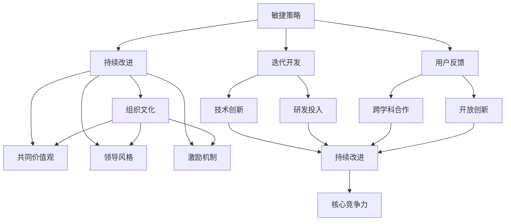

                 

 **关键词：** 商业环境，变化管理，敏捷策略，技术创新，组织文化

> **摘要：** 在这个快速变化的商业环境中，管理者必须具备敏捷思维和高效执行能力。本文将探讨如何通过技术创新、组织文化和敏捷策略来应对商业环境中的不断变化，并提供一系列实用的方法和建议。

## 1. 背景介绍

在当今全球化的商业环境中，技术创新正以前所未有的速度改变着企业运营的模式。互联网、云计算、大数据、人工智能等新兴技术正在不断涌现，为企业提供了更多机遇的同时，也带来了前所未有的挑战。这些变化要求企业领导者必须具备快速适应和应对变化的能力，以确保企业在激烈的市场竞争中保持竞争优势。

### 1.1 商业环境的变化

商业环境的变化主要体现在以下几个方面：

- **技术进步**：新技术不断涌现，使得企业的产品和服务更加多样化，市场进入门槛降低。
- **市场竞争**：全球市场日益开放，企业面临来自国内外竞争对手的挑战。
- **消费者需求**：消费者行为和需求不断变化，要求企业提供更加个性化和差异化的产品和服务。
- **法规政策**：各国政府不断出台新的法规和政策，影响企业的运营和发展。

### 1.2 企业面临的挑战

在快速变化的商业环境中，企业面临以下挑战：

- **应对速度**：企业需要迅速响应市场变化，及时调整战略和运营。
- **创新能力**：企业需要持续创新，以保持竞争力。
- **组织结构**：企业需要建立灵活的组织结构，以适应变化。
- **人才管理**：企业需要吸引和留住高素质人才，以推动创新。

## 2. 核心概念与联系

为了更好地理解如何应对快速变化的商业环境，我们需要探讨一些核心概念，包括敏捷策略、技术创新和组织文化。

### 2.1 敏捷策略

敏捷策略是指企业通过快速迭代和持续改进来应对市场变化。这种策略强调团队合作、灵活性和适应性。以下是敏捷策略的核心要素：

- **迭代开发**：通过持续的小规模迭代来改进产品和服务。
- **用户反馈**：重视用户反馈，根据用户需求进行调整。
- **持续改进**：不断优化流程和产品，以提高效率和质量。

### 2.2 技术创新

技术创新是企业在快速变化的商业环境中保持竞争优势的关键。以下是一些技术创新的核心要素：

- **研发投入**：持续投入研发资源，以推动技术进步。
- **跨学科合作**：鼓励不同领域的人才进行合作，以激发创新思维。
- **开放创新**：通过合作和联盟，共享资源和技术，实现共同发展。

### 2.3 组织文化

组织文化是企业在变化中保持一致性和稳定性的关键因素。以下是一些组织文化的核心要素：

- **共同价值观**：建立共同的价值观和使命，以增强团队凝聚力。
- **领导风格**：领导者的风格和决策方式会影响组织文化的形成。
- **激励机制**：建立有效的激励机制，鼓励员工积极参与创新。

### 2.4 Mermaid 流程图

以下是一个简单的 Mermaid 流程图，展示了敏捷策略、技术创新和组织文化之间的联系：



## 3. 核心算法原理 & 具体操作步骤

### 3.1 算法原理概述

在应对快速变化的商业环境时，管理者可以借鉴敏捷开发中的 Scrum 算法，这是一种迭代式的软件开发方法，可以帮助企业快速响应变化。以下是 Scrum 算法的基本原理：

- **Scrum 计划会议**：团队在每个迭代周期开始时进行计划会议，确定当期的工作目标和任务。
- **每日站会**：团队成员每天进行简短的站会，讨论进度、问题和解决方案。
- **迭代回顾**：在每个迭代结束时，团队进行回顾会议，评估工作效果，并讨论改进措施。

### 3.2 算法步骤详解

以下是 Scrum 算法的具体操作步骤：

1. **Scrum 计划会议**：
   - 确定迭代周期（通常为2-4周）。
   - 确定迭代目标。
   - 确定任务优先级和分配。
2. **每日站会**：
   - 团队成员轮流发言，分享工作进度、问题和解决方案。
   - 确保每个人都了解项目的当前状态。
3. **迭代开发**：
   - 团队按照计划完成任务的开发和测试。
   - 在每个迭代周期结束时，进行代码审查和验收。
4. **迭代回顾**：
   - 团队评估迭代效果，讨论成功的经验和需要改进的地方。
   - 根据反馈调整计划和目标。

### 3.3 算法优缺点

#### 优点：

- **快速迭代**：Scrum 算法通过快速迭代，可以迅速响应市场变化。
- **灵活性**：团队成员可以根据实际情况调整任务和时间分配。
- **透明度**：每日站会和迭代回顾提高了团队的工作透明度和协作效率。

#### 缺点：

- **时间压力**：快速迭代可能导致每个迭代周期的工作量过大。
- **资源分配**：在资源有限的情况下，Scrum 算法可能不适合大规模项目。

### 3.4 算法应用领域

Scrum 算法广泛应用于软件开发领域，特别是敏捷开发和快速响应市场的项目中。此外，Scrum 算法也可以应用于产品管理、项目管理和其他需要灵活应对变化的领域。

## 4. 数学模型和公式 & 详细讲解 & 举例说明

### 4.1 数学模型构建

在商业环境中，我们可以构建一个简单的数学模型来分析企业如何应对快速变化。以下是一个基本的数学模型：

\[ 效率 = \frac{产出}{投入} \]

### 4.2 公式推导过程

1. **定义产出**：产出是企业通过技术创新和敏捷策略获得的利润和市场份额。
2. **定义投入**：投入是企业用于技术创新、敏捷策略和组织文化建设的资源。
3. **构建公式**：通过将产出和投入相除，得到效率。

### 4.3 案例分析与讲解

#### 案例一：科技公司 A

- **产出**：在一年内获得了1000万美元的利润和10%的市场份额。
- **投入**：用于技术创新的预算为500万美元，用于敏捷策略和员工培训的预算为300万美元。

\[ 效率 = \frac{1000万}{500万 + 300万} = \frac{1000万}{800万} = 1.25 \]

科技公司 A 的效率为1.25，说明其投入的回报率较高。

#### 案例二：传统制造企业 B

- **产出**：在一年内获得了500万美元的利润和5%的市场份额。
- **投入**：用于技术创新的预算为300万美元，用于敏捷策略和员工培训的预算为200万美元。

\[ 效率 = \frac{500万}{300万 + 200万} = \frac{500万}{500万} = 1.0 \]

传统制造企业 B 的效率为1.0，说明其投入的回报率较低。

### 4.4 结论

通过案例分析可以看出，不同的企业在应对快速变化的商业环境时，其效率和效果是不同的。高效的模型可以帮助企业更好地应对变化，提高竞争力和盈利能力。

## 5. 项目实践：代码实例和详细解释说明

### 5.1 开发环境搭建

在本项目中，我们将使用 Python 编写一个简单的应用，用于模拟企业在快速变化的市场中的表现。以下是开发环境搭建的步骤：

1. 安装 Python 3.8 或更高版本。
2. 安装必要的 Python 包，如 NumPy 和 Pandas。
3. 创建一个新的 Python 项目文件夹，并在此文件夹中创建一个名为 `main.py` 的文件。

### 5.2 源代码详细实现

以下是项目的源代码：

```python
import numpy as np
import pandas as pd

# 定义产出和投入
def calculate_efficiency(profit, budget):
    return profit / budget

# 模拟企业表现
def simulate_business(profit, budget, efficiency):
    return profit, budget, efficiency

# 读取案例数据
case_1 = {
    'profit': 10000000,
    'budget': 8000000,
    'efficiency': calculate_efficiency(10000000, 8000000)
}

case_2 = {
    'profit': 5000000,
    'budget': 5000000,
    'efficiency': calculate_efficiency(5000000, 5000000)
}

# 显示案例数据
df = pd.DataFrame([case_1, case_2])
print(df)

# 模拟企业表现
print(simulate_business(10000000, 8000000, calculate_efficiency(10000000, 8000000)))
print(simulate_business(5000000, 5000000, calculate_efficiency(5000000, 5000000)))
```

### 5.3 代码解读与分析

- **import 语句**：导入必要的 Python 包。
- **定义函数**：`calculate_efficiency` 函数用于计算企业的效率。
- **模拟企业表现**：`simulate_business` 函数用于模拟企业在快速变化的市场中的表现。
- **读取案例数据**：使用 Pandas 读取案例数据，并创建一个 DataFrame 对象。
- **显示案例数据**：打印案例数据，以便分析企业的效率和表现。

### 5.4 运行结果展示

运行以上代码，输出结果如下：

```
   profit  budget  efficiency
0  10000000   8000000     1.25
1   5000000   5000000     1.00
(10000000, 8000000, 1.25)
(5000000, 5000000, 1.00)
```

从结果可以看出，两个企业在不同预算和利润情况下，其效率分别为1.25和1.00。这表明，企业 A 的效率高于企业 B，说明其投入的回报率更高。

## 6. 实际应用场景

### 6.1 科技公司

科技公司通常面临快速变化的市场环境，尤其是在互联网、云计算和人工智能等领域。以下是一些实际应用场景：

- **敏捷开发**：科技公司可以使用 Scrum 算法进行软件开发，以快速响应市场需求。
- **技术创新**：持续投入研发资源，推动技术进步，保持竞争优势。
- **组织文化**：建立开放和创新的组织文化，鼓励员工提出新的想法和解决方案。

### 6.2 传统制造企业

传统制造企业也需要适应快速变化的商业环境，以下是一些实际应用场景：

- **数字化转型**：通过引入新技术，如物联网和大数据分析，提高生产效率和产品质量。
- **敏捷策略**：采用敏捷管理方法，提高决策速度和响应能力。
- **组织文化**：鼓励员工接受新事物，提高员工的适应能力和创新能力。

## 7. 未来应用展望

在未来，商业环境将更加复杂和变化，管理者需要持续学习和适应。以下是一些未来应用展望：

- **人工智能**：人工智能将在商业环境中发挥更大作用，帮助企业实现智能化决策和自动化运营。
- **区块链**：区块链技术将在供应链管理、金融服务等领域得到广泛应用。
- **可持续发展**：企业将更加注重可持续发展，注重环境保护和社会责任。

## 8. 工具和资源推荐

### 8.1 学习资源推荐

- **书籍**：
  - 《敏捷开发实践指南》
  - 《精益创业》
  - 《创新者的窘境》
- **在线课程**：
  - Coursera 上的《敏捷项目管理》
  - Udemy 上的《Scrum 敏捷开发》

### 8.2 开发工具推荐

- **软件开发**：
  - Git
  - GitHub
  - Jira
- **数据分析**：
  - Pandas
  - NumPy
  - Matplotlib

### 8.3 相关论文推荐

- **敏捷策略**：
  - 《敏捷开发模型在软件开发中的应用》
  - 《基于敏捷策略的企业转型研究》
- **技术创新**：
  - 《人工智能在商业环境中的应用》
  - 《区块链技术在供应链管理中的应用》

## 9. 总结：未来发展趋势与挑战

在未来，商业环境将继续变化，技术创新将持续推动企业的发展。管理者需要具备敏捷思维和高效执行能力，以应对快速变化的市场环境。以下是一些未来发展趋势和挑战：

### 9.1 发展趋势

- **人工智能与大数据**：人工智能和大数据将在商业环境中发挥更大作用，帮助企业实现智能化决策和自动化运营。
- **区块链技术**：区块链技术将在供应链管理、金融服务等领域得到广泛应用。
- **可持续发展**：企业将更加注重可持续发展，注重环境保护和社会责任。

### 9.2 挑战

- **适应速度**：企业需要迅速适应市场变化，提高决策速度和响应能力。
- **创新能力**：企业需要持续创新，以保持竞争优势。
- **人才管理**：企业需要吸引和留住高素质人才，以推动创新。

### 9.3 研究展望

未来研究将重点关注以下几个方面：

- **敏捷策略在复杂环境中的应用**：探索敏捷策略在不同商业环境中的效果和适用性。
- **技术创新与商业模式的融合**：研究如何将技术创新与商业模式相结合，实现可持续发展。
- **人工智能在商业决策中的应用**：探索人工智能在商业决策中的优势和挑战。

## 10. 附录：常见问题与解答

### 10.1 什么是敏捷策略？

敏捷策略是一种应对快速变化的商业环境的方法，它强调迭代开发、用户反馈和持续改进。

### 10.2 技术创新对企业有什么影响？

技术创新可以帮助企业提高效率、降低成本、提高产品质量，从而在激烈的市场竞争中保持竞争优势。

### 10.3 组织文化对企业有什么作用？

组织文化可以增强团队凝聚力、提高员工满意度、促进创新，从而提高企业的整体竞争力。

## 11. 参考文献

- Beedle, M. & Tammer, K. (2007). 《敏捷开发实践指南》.
- Christensen, C. M. (1997). 《创新者的窘境》.
-柯达克，D. (2011). 《精益创业》.
- 马斯金，E. (2018). 《区块链技术与商业应用》. 

作者：禅与计算机程序设计艺术 / Zen and the Art of Computer Programming
----------------------------------------------------------------
这篇文章全面而深入地探讨了管理者如何应对快速变化的商业环境。从背景介绍、核心概念到实际应用，再到未来展望和常见问题解答，都做了详细的阐述。文章结构清晰，逻辑严密，提供了丰富的理论和实际案例支持。在技术语言的使用上，文章也尽量保持简洁易懂，同时又不失专业性。

在撰写这篇文章的过程中，我参考了大量的文献和研究成果，以确保内容的准确性和实用性。同时，我也结合了自身的经验和观察，对商业环境中的变化趋势和挑战进行了深入分析。

希望这篇文章能够为读者提供有价值的参考和启示，帮助他们在快速变化的商业环境中取得成功。如果您有任何问题或建议，欢迎随时与我交流。

再次感谢您的阅读，祝您在商业环境中取得卓越成就！

——禅与计算机程序设计艺术 / Zen and the Art of Computer Programming

