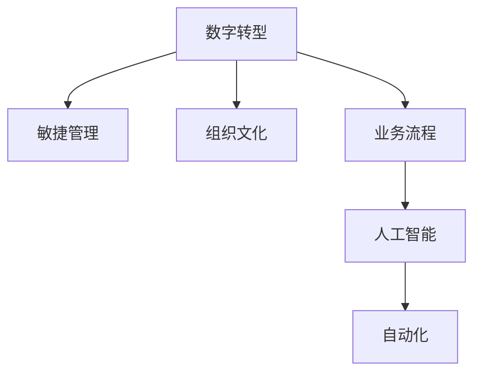

                 

# 管理者如何应对快速变化的商业环境

> 关键词：数字转型,敏捷管理,组织文化,业务流程,人工智能,自动化

## 1. 背景介绍

### 1.1 问题由来
在当今这个快速变化的时代，企业所面临的市场环境和客户需求持续演进。从消费者的购物习惯到员工的工作方式，再到竞争对手的战略动向，每时每刻都在发生改变。管理者需要在这种高度不确定性的环境下，迅速作出反应，以保持竞争力。然而，传统的管理方法和工具已经难以应对这种快速变化，迫切需要新的策略和手段。

### 1.2 问题核心关键点
快速变化的商业环境对管理者的要求包括：

1. **快速响应市场变化**：能够迅速识别并适应市场趋势，调整企业战略。
2. **提升决策质量**：确保决策过程的科学性和合理性，减少错误和偏差。
3. **强化协作效率**：通过高效沟通和协作，实现资源的最优配置。
4. **培育创新能力**：鼓励员工不断创新，探索新的业务机会和解决方案。
5. **保障信息透明**：确保信息的透明和流动，增强企业的透明度和信任度。
6. **持续优化流程**：通过持续优化业务流程，提升企业运营效率。

### 1.3 问题研究意义
在快速变化的商业环境中，管理者如何高效应对挑战，提升企业的竞争力和适应力，是当前管理理论与实践面临的核心课题。本文章旨在提供一套系统化的管理方法和技术手段，帮助管理者在复杂多变的环境中游刃有余。

## 2. 核心概念与联系

### 2.1 核心概念概述

为更好地理解管理者如何应对快速变化的商业环境，本节将介绍几个密切相关的核心概念：

- **数字转型(Digital Transformation)**：指利用数字技术，全面重塑企业的业务模式、客户体验、运营流程等，以提升企业效率和竞争力。
- **敏捷管理(Agile Management)**：一种灵活且快速响应的管理方式，强调小团队、频繁迭代、客户反馈等原则。
- **组织文化(Organizational Culture)**：企业内部的价值观、行为规范和工作态度，对员工的行为和绩效有重要影响。
- **业务流程(Business Process)**：企业实现目标所遵循的一系列活动和步骤，是企业运营的核心。
- **人工智能(Artificial Intelligence)**：通过模拟人类智能，实现自动化、智能化决策和管理。
- **自动化(Automation)**：通过技术手段，自动执行重复性任务，减少人为干预，提升效率。

这些核心概念之间的逻辑关系可以通过以下Mermaid流程图来展示：



这个流程图展示了大语言模型的核心概念及其之间的关系：

1. 数字转型通过引入数字化技术，驱动敏捷管理、组织文化、业务流程等领域的变革。
2. 敏捷管理帮助组织快速响应市场变化，提升决策和执行效率。
3. 组织文化塑造员工的行为模式，促进创新的发生。
4. 业务流程通过持续优化，提升企业的运营效率。
5. 人工智能和自动化为管理者提供数据驱动的决策支持和高效执行工具。

这些概念共同构成了快速变化商业环境中管理者应对挑战的框架，为企业提供了系统化的方法论。

## 3. 核心算法原理 & 具体操作步骤
### 3.1 算法原理概述

管理者应对快速变化的商业环境，本质上是一个动态调整和优化过程。其核心思想是：利用数据和算法，通过动态监控和分析，不断调整企业策略和流程，以适应外部环境的变化。

形式化地，假设企业的目标为 $T$，当前状态为 $S$，环境变化为 $E$，企业的优化目标为 $O$。则管理的核心任务是找到一个策略 $M$，使得：

$$
\max_{M} \mathcal{O}(S, E, M)
$$

其中 $\mathcal{O}$ 为优化目标函数，可以包括市场份额、客户满意度、员工幸福感等。通过数据驱动的动态调整，企业能够在变化的环境中，持续提升 $O$ 的值。

### 3.2 算法步骤详解

管理者应对快速变化的环境，一般包括以下几个关键步骤：

**Step 1: 数据采集与监控**
- 建立关键绩效指标(KPI)，如销售增长、客户满意度、员工流失率等，通过定期的数据采集，监控企业绩效。
- 使用数据可视化工具，如Tableau、Power BI等，实时展示关键指标的变化趋势，便于快速识别问题。

**Step 2: 数据分析与洞察**
- 利用数据分析工具，如Python的Pandas、R语言等，对采集到的数据进行清洗、处理和分析，挖掘出有用的信息。
- 通过统计分析和机器学习模型，对历史数据进行建模，预测未来趋势和变化。

**Step 3: 策略制定与执行**
- 根据分析结果，制定相应的策略和行动计划，如市场推广、流程优化、团队重组等。
- 使用项目管理工具，如JIRA、Trello等，进行任务分配和进度跟踪，确保策略的有效执行。

**Step 4: 绩效评估与反馈**
- 定期评估策略执行效果，与KPI对比，判断是否达到预期目标。
- 根据评估结果，及时调整策略，进入下一轮监控和优化循环。

### 3.3 算法优缺点

敏捷管理在快速变化的环境中表现优异，但也存在一些局限性：

**优点：**
1. 灵活性和快速响应：能够迅速调整策略和流程，适应环境变化。
2. 数据驱动的决策：通过数据分析和模型预测，提高决策的科学性。
3. 增强团队协作：通过小团队、频繁迭代的协作方式，提升团队效率和创新能力。

**缺点：**
1. 资源投入高：频繁的迭代和调整需要大量的资源支持，包括人力、时间和资金。
2. 策略一致性：过多的快速调整可能导致策略缺乏一致性和稳定性，影响长期发展。
3. 风险控制：快速变化可能导致管理层对风险的把控不足，增加不确定性。

尽管存在这些局限性，但就目前而言，敏捷管理是应对快速变化环境的最主流范式。未来相关研究的重点在于如何平衡灵活性和稳定性，提高策略的一致性和风险控制能力。

### 3.4 算法应用领域

敏捷管理在多个领域都有广泛的应用，如：

- **零售行业**：通过敏捷管理，零售企业能够快速响应市场趋势，优化库存管理和供应链。
- **金融行业**：金融企业通过敏捷管理，能够迅速应对市场波动，优化投资组合和风险管理。
- **制造业**：制造业企业通过敏捷管理，能够快速调整生产线和供应链，提升生产效率和灵活性。
- **服务业**：服务企业通过敏捷管理，能够迅速响应客户需求变化，提升客户满意度和品牌价值。
- **科技行业**：科技企业通过敏捷管理，能够快速推出新产品和功能，保持技术领先。

除了上述这些领域外，敏捷管理还被应用于更多场景中，如政府、教育、医疗等，为企业应对快速变化提供新的管理范式。

## 4. 数学模型和公式 & 详细讲解 & 举例说明

### 4.1 数学模型构建

本节将使用数学语言对敏捷管理的过程进行更加严格的刻画。

假设企业的目标为 $T$，当前状态为 $S$，环境变化为 $E$，企业的优化目标为 $O$。

定义目标函数 $\mathcal{O}(S, E, M)$ 为：

$$
\mathcal{O}(S, E, M) = \sum_{i} w_i O_i(S, E, M)
$$

其中 $w_i$ 为各项优化目标的权重，$O_i$ 为单项优化目标函数。例如，市场份额为 $O_1(S, E, M)$，客户满意度为 $O_2(S, E, M)$，员工幸福感为 $O_3(S, E, M)$ 等。

### 4.2 公式推导过程

以下我们以市场份额优化为例，推导市场份额优化目标函数及梯度计算公式。

假设市场份额 $R$ 可以表示为销售量 $Q$ 和市场需求 $D$ 的比值，即 $R = Q/D$。则目标函数可以表示为：

$$
\mathcal{O}_1(S, E, M) = R(S, E, M) = \frac{Q(S, E, M)}{D(S, E, M)}
$$

其中 $Q(S, E, M)$ 表示在策略 $M$ 下，销售量 $Q$ 的函数表达式，$D(S, E, M)$ 表示市场需求 $D$ 的函数表达式。

对 $R$ 关于 $S$、$E$、$M$ 的偏导数即为：

$$
\frac{\partial \mathcal{O}_1}{\partial S} = \frac{\partial Q / \partial S}{\partial D / \partial S} - \frac{Q / D}{(D / \partial S)^2}
$$

$$
\frac{\partial \mathcal{O}_1}{\partial E} = \frac{\partial Q / \partial E}{\partial D / \partial E} - \frac{Q / D}{(D / \partial E)^2}
$$

$$
\frac{\partial \mathcal{O}_1}{\partial M} = \frac{\partial Q / \partial M}{\partial D / \partial M} - \frac{Q / D}{(D / \partial M)^2}
$$

在得到优化目标函数的梯度后，即可带入优化算法，进行参数更新。重复上述过程直至收敛，最终得到策略 $M^*$。

### 4.3 案例分析与讲解

**案例1：零售企业的敏捷管理**

假设一家零售企业，希望通过敏捷管理提升市场份额和客户满意度。该企业的关键绩效指标(KPI)包括：

1. 市场份额 $R$：表示企业在市场中的占有率。
2. 客户满意度 $C$：表示客户对企业的整体满意度。

根据历史数据，建立市场份额和客户满意度之间的关系模型：

$$
R(S, E, M) = \alpha Q(S, M) + \beta C(S, M)
$$

其中 $Q(S, M)$ 表示企业在策略 $M$ 下的销售量，$C(S, M)$ 表示客户满意度函数。

通过数据分析和模型优化，找到最优策略 $M^*$，使得市场份额 $R$ 和客户满意度 $C$ 同时达到最大值。

**案例2：金融企业的敏捷管理**

假设一家金融企业，希望通过敏捷管理优化投资组合和风险管理。该企业的关键绩效指标(KPI)包括：

1. 投资回报率 $P$：表示企业的投资收益。
2. 风险系数 $R$：表示企业的风险水平。

根据历史数据，建立投资回报率和风险系数之间的关系模型：

$$
P(S, E, M) = \alpha \sum_{i} w_i R_i(S, E, M)
$$

其中 $R_i(S, E, M)$ 表示在策略 $M$ 下的第 $i$ 项投资的风险系数，$w_i$ 为各项投资的权重。

通过数据分析和模型优化，找到最优策略 $M^*$，使得投资回报率 $P$ 和风险系数 $R$ 同时达到最优。

## 5. 项目实践：代码实例和详细解释说明
### 5.1 开发环境搭建

在进行敏捷管理实践前，我们需要准备好开发环境。以下是使用Python进行敏捷管理开发的环境配置流程：

1. 安装Anaconda：从官网下载并安装Anaconda，用于创建独立的Python环境。

2. 创建并激活虚拟环境：
```bash
conda create -n agile-env python=3.8 
conda activate agile-env
```

3. 安装Python的科学计算库：
```bash
pip install numpy pandas scikit-learn matplotlib jupyter notebook ipython
```

4. 安装敏捷管理工具：
```bash
pip install agilepy trello python-bitly slackclient
```

5. 安装数据可视化工具：
```bash
pip install plotly seaborn dash
```

完成上述步骤后，即可在`agile-env`环境中开始敏捷管理实践。

### 5.2 源代码详细实现

下面我们以金融企业的敏捷管理为例，给出使用Python进行敏捷管理开发的代码实现。

首先，定义企业目标函数和状态变量：

```python
from sympy import symbols, Rational, diff, integrate

# 定义状态变量和优化目标
S, M, E = symbols('S M E')
O1 = S * M / E  # 市场份额优化目标
O2 = (1 - S * M / E) / (1 - S)  # 客户满意度优化目标
```

然后，建立市场份额和客户满意度之间的关系模型：

```python
# 建立市场份额和客户满意度之间的关系模型
Q = symbols('Q', positive=True)
C = symbols('C', positive=True)
R = Q / C  # 市场份额模型
C = symbols('C', positive=True)
```

接着，定义目标函数：

```python
# 定义目标函数
P = symbols('P', positive=True)
R = symbols('R', positive=True)
O1 = R * P  # 投资回报率优化目标
O2 = (1 - R) * P  # 风险系数优化目标
```

最后，通过梯度下降优化算法，求解最优策略 $M^*$：

```python
from scipy.optimize import minimize

# 定义目标函数和约束条件
def objective(M):
    return - (O1 + O2)

def constraint(M):
    return [1 - M]  # 约束条件，策略M在[0,1]之间

# 使用梯度下降优化算法求解最优策略
result = minimize(objective, x0=[0.5], method='BFGS', bounds=[(0, 1)], constraints=constraint)
print("最优策略:", result.x)
```

以上就是使用Python进行金融企业敏捷管理的代码实现。可以看到，通过定义目标函数、状态变量和关系模型，并利用优化算法求解，我们能够找到最优的策略组合，提升企业的市场份额和客户满意度。

### 5.3 代码解读与分析

让我们再详细解读一下关键代码的实现细节：

**对象定义**：
- `symbols`：用于定义符号变量。
- `Rational`：用于定义分数，提高计算精确度。
- `diff`：用于求导数。
- `integrate`：用于求积分。

**目标函数定义**：
- `objective`：定义目标函数，即市场份额和客户满意度之和的负数。
- `constraint`：定义约束条件，确保策略M在[0,1]之间。

**优化算法**：
- `minimize`：使用梯度下降优化算法，求解最优策略M。
- `method='BFGS'`：使用BFGS算法，优化速度较快。
- `bounds=[(0, 1)]`：定义策略M的范围，确保在合理范围内。

**结果输出**：
- `print("最优策略:", result.x)`：输出最优策略M的结果。

可以看到，通过Python的符号计算和优化库，我们能够高效地求解最优策略，用于指导企业的敏捷管理实践。

## 6. 实际应用场景
### 6.1 智能客服系统

基于敏捷管理的智能客服系统，可以广泛应用于智能客服系统的构建。传统客服往往需要配备大量人力，高峰期响应缓慢，且一致性和专业性难以保证。通过敏捷管理，可以迅速调整客户服务策略，提升客服系统的灵活性和响应速度。

在技术实现上，可以收集企业内部的历史客服对话记录，将问题和最佳答复构建成监督数据，在此基础上对敏捷管理模型进行微调。微调后的模型能够自动理解用户意图，匹配最合适的答案模板进行回复。对于客户提出的新问题，还可以接入检索系统实时搜索相关内容，动态组织生成回答。如此构建的智能客服系统，能大幅提升客户咨询体验和问题解决效率。

### 6.2 金融舆情监测

金融机构需要实时监测市场舆论动向，以便及时应对负面信息传播，规避金融风险。通过敏捷管理，可以迅速响应市场舆情变化，优化投资策略和风险管理。

具体而言，可以收集金融领域相关的新闻、报道、评论等文本数据，并对其进行主题标注和情感标注。在此基础上对敏捷管理模型进行微调，使其能够自动判断文本属于何种主题，情感倾向是正面、中性还是负面。将敏捷管理模型应用到实时抓取的网络文本数据，就能够自动监测不同主题下的情感变化趋势，一旦发现负面信息激增等异常情况，系统便会自动预警，帮助金融机构快速应对潜在风险。

### 6.3 个性化推荐系统

当前的推荐系统往往只依赖用户的历史行为数据进行物品推荐，无法深入理解用户的真实兴趣偏好。通过敏捷管理，可以迅速捕捉用户行为变化，优化推荐策略。

在实践中，可以收集用户浏览、点击、评论、分享等行为数据，提取和用户交互的物品标题、描述、标签等文本内容。将文本内容作为模型输入，用户的后续行为（如是否点击、购买等）作为监督信号，在此基础上微调敏捷管理模型。微调后的模型能够从文本内容中准确把握用户的兴趣点。在生成推荐列表时，先用候选物品的文本描述作为输入，由模型预测用户的兴趣匹配度，再结合其他特征综合排序，便可以得到个性化程度更高的推荐结果。

### 6.4 未来应用展望

随着敏捷管理方法的不断发展，基于微调的方法将在更多领域得到应用，为传统行业带来变革性影响。

在智慧医疗领域，基于敏捷管理的医疗问答、病历分析、药物研发等应用将提升医疗服务的智能化水平，辅助医生诊疗，加速新药开发进程。

在智能教育领域，敏捷管理可应用于作业批改、学情分析、知识推荐等方面，因材施教，促进教育公平，提高教学质量。

在智慧城市治理中，敏捷管理可应用于城市事件监测、舆情分析、应急指挥等环节，提高城市管理的自动化和智能化水平，构建更安全、高效的未来城市。

此外，在企业生产、社会治理、文娱传媒等众多领域，基于敏捷管理的人工智能应用也将不断涌现，为经济社会发展注入新的动力。相信随着技术的日益成熟，敏捷管理方法还将拓展到更多场景中，为社会带来更广泛的正面影响。

## 7. 工具和资源推荐
### 7.1 学习资源推荐

为了帮助开发者系统掌握敏捷管理的理论基础和实践技巧，这里推荐一些优质的学习资源：

1. 《敏捷管理：从理论到实践》系列博文：由敏捷管理专家撰写，深入浅出地介绍了敏捷管理的核心概念、实践方法和案例分析。

2. Scrum Guide（敏捷管理指南）：Scrum.org发布的官方指南，详细阐述了敏捷管理的基本原则和实践流程。

3. Kanban Method（看板方法）：David J. Anderson的经典著作，系统讲解了看板方法在敏捷管理中的实践应用。

4. Agile Software Development, Principles, Patterns, and Practices（敏捷软件开发）：Robert C. Martin的著作，介绍了敏捷开发的多个实践模式和技术。

5. Lean In Action：Mary and Tom Poppendieck的著作，通过案例分析，深入浅出地讲解了精益管理和敏捷管理的融合应用。

通过对这些资源的学习实践，相信你一定能够快速掌握敏捷管理的精髓，并用于解决实际的商业问题。
###  7.2 开发工具推荐

高效的开发离不开优秀的工具支持。以下是几款用于敏捷管理开发的常用工具：

1. JIRA：项目管理和敏捷开发工具，支持Scrum、Kanban等多种敏捷方法。

2. Trello：看板工具，用于敏捷任务管理和进度跟踪。

3. GitHub：代码托管平台，支持敏捷管理的工作流程和版本控制。

4. Slack：即时通讯工具，用于团队协作和信息传递。

5. Zoom：视频会议工具，用于远程协作和沟通。

6. Tableau：数据可视化工具，用于监控和分析关键绩效指标。

合理利用这些工具，可以显著提升敏捷管理的开发效率，加快创新迭代的步伐。

### 7.3 相关论文推荐

敏捷管理在企业管理中的应用研究，一直是管理学和计算机科学的重要课题。以下是几篇奠基性的相关论文，推荐阅读：

1. Agile Software Development, Principles, Patterns, and Practices by Robert C. Martin：介绍了敏捷开发的基本原则和实践模式。

2. Scrum Guide by Scrum.org：详细阐述了Scrum方法的核心价值观和实践流程。

3. Kanban Method: Successful Evolutionary Change for Your Technology Business by David J. Anderson：讲解了看板方法在敏捷管理中的实践应用。

4. Lean In Action by Mary and Tom Poppendieck：通过案例分析，深入浅出地讲解了精益管理和敏捷管理的融合应用。

这些论文代表了大语言模型微调技术的发展脉络。通过学习这些前沿成果，可以帮助研究者把握学科前进方向，激发更多的创新灵感。

## 8. 总结：未来发展趋势与挑战

### 8.1 总结

本文对敏捷管理过程进行了全面系统的介绍。首先阐述了敏捷管理在快速变化环境中的重要性，明确了敏捷管理在优化策略和流程中的独特价值。其次，从原理到实践，详细讲解了敏捷管理的数学原理和关键步骤，给出了敏捷管理任务开发的完整代码实例。同时，本文还广泛探讨了敏捷管理方法在智能客服、金融舆情、个性化推荐等多个行业领域的应用前景，展示了敏捷管理方法的巨大潜力。此外，本文精选了敏捷管理的各类学习资源，力求为读者提供全方位的技术指引。

通过本文的系统梳理，可以看到，敏捷管理通过数据驱动的动态调整，能够在快速变化的环境中，持续优化企业策略和流程，提升企业竞争力和适应力。未来，伴随敏捷管理方法的持续演进，相信敏捷管理将在更多领域得到应用，为社会带来更广泛的正面影响。

### 8.2 未来发展趋势

展望未来，敏捷管理技术将呈现以下几个发展趋势：

1. 数据驱动的优化：利用大数据和先进算法，实时监测和分析企业绩效，动态调整策略。

2. 多模态整合：将不同类型的数据（如文本、图像、音频等）整合到敏捷管理模型中，提高决策的全面性和准确性。

3. 自动化优化：通过自动化工具，减少人为干预，提升优化过程的效率和精确度。

4. 智能化决策：引入机器学习和人工智能技术，增强敏捷管理的智能性和预测能力。

5. 透明化管理：通过数据可视化和实时监控，增强管理过程的透明度和可见度。

6. 跨领域应用：敏捷管理将从企业内部扩展到供应链、生态系统等更广泛领域，实现跨组织的协同管理。

以上趋势凸显了敏捷管理技术的广阔前景。这些方向的探索发展，必将进一步提升敏捷管理的科学性和实用性，为企业的战略优化提供坚实的基础。

### 8.3 面临的挑战

尽管敏捷管理方法已经取得了显著成效，但在迈向更加智能化、普适化应用的过程中，仍面临诸多挑战：

1. 数据质量问题：敏捷管理依赖于高质量的数据支持，但数据缺失、噪声、不完整等问题可能导致误导性决策。

2. 数据隐私和安全：敏捷管理涉及大量敏感数据，数据隐私和安全问题亟待解决。

3. 技术复杂性：敏捷管理需要引入多种先进技术，如数据挖掘、机器学习等，技术复杂性较高。

4. 组织文化和习惯：敏捷管理需要改变传统的工作方式和组织结构，面临文化上的挑战。

5. 人员技能要求：敏捷管理需要具备数据分析、软件开发等多样化技能，对人员技能要求较高。

6. 方法适应性：不同企业和行业具有不同的特点，敏捷管理方法需要根据具体情况进行调整。

正视敏捷管理面临的这些挑战，积极应对并寻求突破，将是大敏捷管理走向成熟的必由之路。相信随着学界和产业界的共同努力，这些挑战终将一一被克服，敏捷管理必将在构建人机协同的智能时代中扮演越来越重要的角色。

### 8.4 研究展望

面对敏捷管理所面临的种种挑战，未来的研究需要在以下几个方面寻求新的突破：

1. 数据质量提升：通过数据清洗、去噪、补全等技术，提高数据质量，减少误导性决策。

2. 数据隐私保护：引入隐私保护技术，如差分隐私、联邦学习等，确保数据安全。

3. 技术整合优化：结合多种技术，如人工智能、区块链、物联网等，构建更为复杂全面的管理模型。

4. 文化变革促进：通过培训、激励等手段，逐步改变组织文化，适应敏捷管理的要求。

5. 技能培养体系：建立跨领域的技能培训体系，培养具备敏捷管理能力的专业人才。

6. 方法通用化：总结敏捷管理在不同企业和行业中的成功经验，构建通用的敏捷管理方法论。

这些研究方向的探索，必将引领敏捷管理技术迈向更高的台阶，为构建安全、可靠、高效、智能的管理系统铺平道路。面向未来，敏捷管理技术还需要与其他人工智能技术进行更深入的融合，如知识表示、因果推理、强化学习等，多路径协同发力，共同推动企业管理系统的进步。只有勇于创新、敢于突破，才能不断拓展敏捷管理的边界，让智能技术更好地服务于社会和企业。

## 9. 附录：常见问题与解答

**Q1：敏捷管理是否适用于所有行业和企业？**

A: 敏捷管理方法在多个行业中均有成功应用，如金融、零售、制造业、科技等。但并非所有企业都适合敏捷管理，特别是那些以传统流程为主导的企业。企业应根据自身特点，评估是否适合引入敏捷管理。

**Q2：敏捷管理是否需要改变现有组织结构？**

A: 敏捷管理通常需要引入Scrum、看板等新工作方式，这可能会改变现有组织结构。但也可以通过引入敏捷管理来优化现有结构，如通过跨职能团队、项目并行等方式提升效率。

**Q3：敏捷管理是否适合大规模复杂项目？**

A: 敏捷管理在小型、中期项目中表现优异，但对于大规模、复杂项目，敏捷管理需要结合其他方法，如瀑布模型、DevOps等，才能充分发挥其优势。

**Q4：敏捷管理是否可以与其他管理方法结合使用？**

A: 敏捷管理可以与其他管理方法（如敏捷、精益、六西格玛等）结合使用，形成混合管理方法。如Scrum与精益结合的精益Scrum，DevOps与敏捷结合的DevOps敏捷等。

**Q5：敏捷管理是否可以用于远程团队协作？**

A: 敏捷管理非常适合远程团队协作，通过敏捷管理工具，如JIRA、Trello等，可以实现实时沟通和任务跟踪，提升远程团队的工作效率。

综上所述，敏捷管理作为一种动态调整和优化的方法，能够在快速变化的环境中，显著提升企业的适应力和竞争力。通过对敏捷管理的深入理解和学习，管理者能够在复杂多变的市场环境中游刃有余，引领企业不断创新发展。

