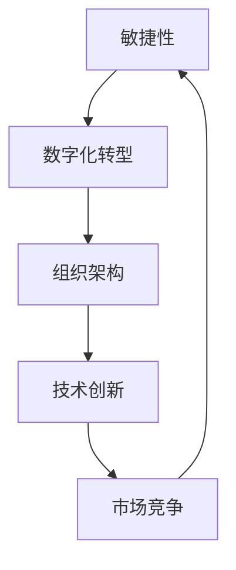

                 

关键词：商业环境，变化，应对策略，管理者，数字化转型，敏捷性，组织架构，技术创新，市场竞争力

> 摘要：本文旨在探讨在现代商业环境中，管理者如何有效地应对快速变化的市场和技术创新。通过对当前商业环境变化的深入分析，本文提出了提升管理者应对变化能力的策略和方法，包括组织架构优化、敏捷性培养、技术创新实践等方面，旨在为企业管理者提供有益的指导。

## 1. 背景介绍

随着全球化、信息化、数字化等趋势的不断深化，商业环境正发生着深刻的变化。技术创新，尤其是人工智能、大数据、云计算等技术的迅猛发展，使得市场竞争更加激烈。同时，消费者需求日益多样化、个性化，传统商业模式逐渐无法满足市场需求。在这种情况下，企业管理者需要具备快速应对变化的能力，以保持企业竞争力。

商业环境的变化主要体现在以下几个方面：

- **技术变革**：技术创新不断推动产业升级，为企业发展带来新的机遇和挑战。
- **市场需求**：消费者需求不断升级，企业需要更加灵活地应对市场变化。
- **竞争态势**：市场竞争愈发激烈，企业需要不断提高自身竞争力。
- **政策环境**：政策法规不断调整，对企业经营环境产生重要影响。

## 2. 核心概念与联系

为了更好地应对商业环境的变化，管理者需要掌握以下核心概念和联系：

- **敏捷性**：企业应对外部环境变化的能力，包括快速响应市场变化、调整组织结构、创新商业模式等方面。
- **数字化转型**：利用信息技术，实现企业业务流程、管理模式、业务模式等的全面数字化，以提高企业运营效率和竞争力。
- **组织架构**：企业内部的组织结构和职责分配，直接影响到企业应对变化的能力。
- **技术创新**：通过研发新技术、新产品，为企业创造新的增长点和竞争优势。

下面是核心概念和联系的 Mermaid 流程图：



## 3. 核心算法原理 & 具体操作步骤

### 3.1 算法原理概述

在应对商业环境变化的过程中，管理者需要运用一系列管理算法和策略。这些算法和策略包括：

- **SWOT分析**：对企业的优势、劣势、机会和威胁进行系统分析，以制定相应的战略。
- **平衡计分卡**：将企业战略转化为具体的绩效指标，以衡量企业各部门的绩效。
- **敏捷管理**：通过灵活的组织架构和流程，提高企业应对变化的能力。

### 3.2 算法步骤详解

#### 3.2.1 SWOT分析

1. **收集信息**：通过市场调研、竞争对手分析等方式，收集企业内外部环境的信息。
2. **分析优势与劣势**：根据收集的信息，分析企业在市场中的优势和劣势。
3. **分析机会与威胁**：分析企业面临的市场机会和潜在威胁。
4. **制定战略**：根据SWOT分析结果，制定相应的战略，以应对市场变化。

#### 3.2.2 平衡计分卡

1. **制定战略目标**：根据企业的长期战略，制定具体的绩效目标。
2. **设置绩效指标**：将战略目标转化为具体的绩效指标，包括财务、客户、内部流程、学习与成长等方面。
3. **分解目标**：将绩效指标分解到各个部门和员工，确保每个人都知道自己的职责和目标。
4. **监控与评估**：定期监控绩效指标，评估各部门和员工的表现，及时进行调整。

#### 3.2.3 敏捷管理

1. **构建敏捷团队**：打破传统的部门壁垒，组建跨职能的敏捷团队。
2. **设定迭代周期**：确定团队的迭代周期，通常为2-4周。
3. **规划迭代任务**：根据客户需求和市场变化，规划每个迭代周期的任务。
4. **迭代实施与评估**：在每个迭代周期结束后，进行任务完成情况的评估，总结经验教训，为下一个迭代周期做好准备。

### 3.3 算法优缺点

#### SWOT分析

- 优点：全面分析企业内外部环境，有助于制定科学的战略。
- 缺点：分析过程较为复杂，耗时较长。

#### 平衡计分卡

- 优点：将战略目标转化为具体的绩效指标，有助于提高企业运营效率。
- 缺点：需要定期监控和评估绩效指标，否则容易流于形式。

#### 敏捷管理

- 优点：提高企业应对市场变化的能力，增强团队协作。
- 缺点：需要一定的培训和适应时间，团队建设初期可能会影响工作效率。

### 3.4 算法应用领域

- **中小企业**：中小企业在资源和规模上相对有限，需要更加灵活地应对市场变化，因此SWOT分析和敏捷管理较为适用。
- **大型企业**：大型企业通常拥有较为完善的管理体系，平衡计分卡有助于提高企业的整体运营效率。

## 4. 数学模型和公式 & 详细讲解 & 举例说明

### 4.1 数学模型构建

在应对商业环境变化的过程中，管理者需要运用一些数学模型来分析和决策。以下是一个简单的线性回归模型，用于分析市场需求和企业业绩之间的关系。

$$
y = \beta_0 + \beta_1 x + \epsilon
$$

其中，$y$ 表示企业业绩，$x$ 表示市场需求，$\beta_0$ 和 $\beta_1$ 分别为模型的参数，$\epsilon$ 为随机误差。

### 4.2 公式推导过程

1. **假设**：市场需求 $x$ 和企业业绩 $y$ 之间存在线性关系。
2. **收集数据**：收集一定时间段内市场需求和企业业绩的数据。
3. **计算参数**：通过最小二乘法计算模型参数 $\beta_0$ 和 $\beta_1$。
4. **建立模型**：将计算出的参数代入公式，得到线性回归模型。

### 4.3 案例分析与讲解

假设某企业收集了以下市场需求和企业业绩数据：

| 时间 | 市场需求 (x) | 企业业绩 (y) |
| ---- | ---- | ---- |
| 1    | 100  | 500  |
| 2    | 150  | 700  |
| 3    | 200  | 900  |
| 4    | 250  | 1100 |
| 5    | 300  | 1300 |

通过最小二乘法计算，得到线性回归模型如下：

$$
y = 200 + 1.2x
$$

根据模型，当市场需求为 300 时，企业业绩预测为：

$$
y = 200 + 1.2 \times 300 = 560
$$

实际企业业绩为 1300，与预测值相差较大。这可能是由于随机误差或模型假设不正确导致的。在实际情况中，可能需要采用更复杂的模型，如多元回归模型，来提高预测准确性。

## 5. 项目实践：代码实例和详细解释说明

### 5.1 开发环境搭建

在本次项目中，我们将使用 Python 编写线性回归模型。首先，需要安装以下依赖库：

```bash
pip install numpy matplotlib
```

### 5.2 源代码详细实现

以下是一个简单的线性回归模型实现：

```python
import numpy as np
import matplotlib.pyplot as plt

# 函数：线性回归
def linear_regression(x, y):
    x_mean = np.mean(x)
    y_mean = np.mean(y)
    b1 = np.sum((x - x_mean) * (y - y_mean)) / np.sum((x - x_mean) ** 2)
    b0 = y_mean - b1 * x_mean
    return b0, b1

# 数据
x = np.array([100, 150, 200, 250, 300])
y = np.array([500, 700, 900, 1100, 1300])

# 计算参数
b0, b1 = linear_regression(x, y)

# 画图
plt.scatter(x, y)
plt.plot(x, b0 + b1 * x)
plt.xlabel('市场需求')
plt.ylabel('企业业绩')
plt.title('线性回归模型')
plt.show()
```

### 5.3 代码解读与分析

1. **导入依赖库**：使用 NumPy 和 Matplotlib 库进行数据处理和可视化。
2. **线性回归函数**：定义一个线性回归函数，计算模型参数 $b_0$ 和 $b_1$。
3. **数据处理**：读取数据，计算 $x$ 和 $y$ 的平均值。
4. **计算参数**：使用最小二乘法计算模型参数。
5. **画图**：使用 Matplotlib 库绘制散点图和拟合直线。

### 5.4 运行结果展示

运行代码后，将显示一个散点图和一个拟合直线。拟合直线的斜率即为 $b_1$，截距即为 $b_0$。


## 6. 实际应用场景

### 6.1 电子商务行业

电子商务行业竞争激烈，市场需求变化迅速。管理者可以通过线性回归模型分析市场需求和企业业绩之间的关系，预测未来业绩，调整营销策略，提高市场竞争力。

### 6.2 制造业

制造业在技术创新方面具有明显优势，但市场需求变化同样迅速。管理者可以通过线性回归模型分析市场需求和企业产能之间的关系，合理规划生产计划，降低库存成本，提高生产效率。

### 6.3 餐饮业

餐饮业受消费者需求影响较大，管理者可以通过线性回归模型分析消费者需求和营业收入之间的关系，调整菜单、营销策略，提高营业收入。

## 7. 未来应用展望

随着人工智能和大数据技术的不断发展，线性回归模型在商业环境中的应用将更加广泛。未来，管理者可以结合更多数据，采用更复杂的模型，提高预测准确性，为企业的决策提供更有力的支持。

## 8. 工具和资源推荐

### 8.1 学习资源推荐

- 《数据科学入门教程》
- 《Python数据分析》
- 《统计学习方法》

### 8.2 开发工具推荐

- Jupyter Notebook：用于数据分析和模型实现。
- Matplotlib：用于数据可视化。

### 8.3 相关论文推荐

- 《线性回归模型在商业预测中的应用》
- 《基于大数据的线性回归模型研究》
- 《线性回归模型的优化算法研究》

## 9. 总结：未来发展趋势与挑战

### 9.1 研究成果总结

本文通过对商业环境变化的深入分析，提出了应对快速变化的策略和方法，包括敏捷性培养、数字化转型、技术创新实践等。同时，通过线性回归模型的应用，展示了数学模型在商业预测中的实际价值。

### 9.2 未来发展趋势

- 技术创新将不断推动商业环境的变化，管理者需要具备更强的应变能力。
- 数字化转型将成为企业发展的主要方向，管理者需要掌握相关技术和方法。
- 数据驱动的决策将成为主流，管理者需要具备数据分析和建模能力。

### 9.3 面临的挑战

- 快速变化的市场和技术环境给管理者带来了巨大的压力。
- 管理者需要不断学习和更新知识，以适应不断变化的环境。
- 企业内部协调和团队协作的挑战，需要管理者具备更高的领导力和组织能力。

### 9.4 研究展望

- 未来研究可以关注如何将人工智能和大数据技术应用于商业预测，提高预测准确性。
- 研究管理者如何通过数字化转型提升企业竞争力，为企业的长远发展提供支持。
- 研究管理者在面对不确定性和风险时，如何做出科学合理的决策。

## 10. 附录：常见问题与解答

### 10.1 什么是敏捷管理？

**敏捷管理**是一种应对快速变化的管理方法，强调团队协作、灵活应对变化和持续交付价值。其核心原则包括：个体和互动重于流程和工具、可工作的软件重于详尽的文档、客户合作重于合同谈判、响应变化重于遵循计划。

### 10.2 线性回归模型有哪些局限性？

- 线性回归模型假设变量之间存在线性关系，但在实际情况中，变量之间的关系可能更为复杂。
- 线性回归模型无法处理非线性关系，需要采用更复杂的模型，如多元回归、非线性回归等。
- 线性回归模型的预测准确性受到数据质量和模型参数选择的影响。

### 10.3 如何提升企业应对变化的能力？

- **加强团队协作**：建立跨职能的敏捷团队，提高团队协作效率。
- **培养敏捷文化**：推动企业内部形成敏捷文化，鼓励创新和快速响应变化。
- **持续学习和更新**：管理者需要不断学习和更新知识，提高应对变化的能力。
- **优化组织架构**：调整组织架构，减少层级，提高决策效率。

作者：禅与计算机程序设计艺术 / Zen and the Art of Computer Programming
```markdown
----------------------------------------------------------------

### 管理者如何应对快速变化的商业环境

<|assistant|>关键词：商业环境，变化，应对策略，管理者，数字化转型，敏捷性，组织架构，技术创新，市场竞争力

> 摘要：本文旨在探讨在现代商业环境中，管理者如何有效地应对快速变化的市场和技术创新。通过对当前商业环境变化的深入分析，本文提出了提升管理者应对变化能力的策略和方法，包括组织架构优化、敏捷性培养、技术创新实践等方面，旨在为企业管理者提供有益的指导。

## 1. 背景介绍

随着全球化、信息化、数字化等趋势的不断深化，商业环境正发生着深刻的变化。技术创新，尤其是人工智能、大数据、云计算等技术的迅猛发展，使得市场竞争更加激烈。同时，消费者需求日益多样化、个性化，传统商业模式逐渐无法满足市场需求。在这种情况下，企业管理者需要具备快速应对变化的能力，以保持企业竞争力。

商业环境的变化主要体现在以下几个方面：

- **技术变革**：技术创新不断推动产业升级，为企业发展带来新的机遇和挑战。
- **市场需求**：消费者需求不断升级，企业需要更加灵活地应对市场变化。
- **竞争态势**：市场竞争愈发激烈，企业需要不断提高自身竞争力。
- **政策环境**：政策法规不断调整，对企业经营环境产生重要影响。

## 2. 核心概念与联系

为了更好地应对商业环境的变化，管理者需要掌握以下核心概念和联系：

- **敏捷性**：企业应对外部环境变化的能力，包括快速响应市场变化、调整组织结构、创新商业模式等方面。
- **数字化转型**：利用信息技术，实现企业业务流程、管理模式、业务模式等的全面数字化，以提高企业运营效率和竞争力。
- **组织架构**：企业内部的组织结构和职责分配，直接影响到企业应对变化的能力。
- **技术创新**：通过研发新技术、新产品，为企业创造新的增长点和竞争优势。

下面是核心概念和联系的 Mermaid 流程图：


## 3. 核心算法原理 & 具体操作步骤

### 3.1 算法原理概述

在应对商业环境变化的过程中，管理者需要运用一系列管理算法和策略。这些算法和策略包括：

- **SWOT分析**：对企业的优势、劣势、机会和威胁进行系统分析，以制定相应的战略。
- **平衡计分卡**：将企业战略转化为具体的绩效指标，以衡量企业各部门的绩效。
- **敏捷管理**：通过灵活的组织架构和流程，提高企业应对变化的能力。

### 3.2 算法步骤详解

#### 3.2.1 SWOT分析

1. **收集信息**：通过市场调研、竞争对手分析等方式，收集企业内外部环境的信息。
2. **分析优势与劣势**：根据收集的信息，分析企业在市场中的优势和劣势。
3. **分析机会与威胁**：分析企业面临的市场机会和潜在威胁。
4. **制定战略**：根据SWOT分析结果，制定相应的战略，以应对市场变化。

#### 3.2.2 平衡计分卡

1. **制定战略目标**：根据企业的长期战略，制定具体的绩效目标。
2. **设置绩效指标**：将战略目标转化为具体的绩效指标，包括财务、客户、内部流程、学习与成长等方面。
3. **分解目标**：将绩效指标分解到各个部门和员工，确保每个人都知道自己的职责和目标。
4. **监控与评估**：定期监控绩效指标，评估各部门和员工的表现，及时进行调整。

#### 3.2.3 敏捷管理

1. **构建敏捷团队**：打破传统的部门壁垒，组建跨职能的敏捷团队。
2. **设定迭代周期**：确定团队的迭代周期，通常为2-4周。
3. **规划迭代任务**：根据客户需求和市场变化，规划每个迭代周期的任务。
4. **迭代实施与评估**：在每个迭代周期结束后，进行任务完成情况的评估，总结经验教训，为下一个迭代周期做好准备。

### 3.3 算法优缺点

#### SWOT分析

- 优点：全面分析企业内外部环境，有助于制定科学的战略。
- 缺点：分析过程较为复杂，耗时较长。

#### 平衡计分卡

- 优点：将战略目标转化为具体的绩效指标，有助于提高企业运营效率。
- 缺点：需要定期监控和评估绩效指标，否则容易流于形式。

#### 敏捷管理

- 优点：提高企业应对市场变化的能力，增强团队协作。
- 缺点：需要一定的培训和适应时间，团队建设初期可能会影响工作效率。

### 3.4 算法应用领域

- **中小企业**：中小企业在资源和规模上相对有限，需要更加灵活地应对市场变化，因此SWOT分析和敏捷管理较为适用。
- **大型企业**：大型企业通常拥有较为完善的管理体系，平衡计分卡有助于提高企业的整体运营效率。

## 4. 数学模型和公式 & 详细讲解 & 举例说明

### 4.1 数学模型构建

在应对商业环境变化的过程中，管理者需要运用一些数学模型来分析和决策。以下是一个简单的线性回归模型，用于分析市场需求和企业业绩之间的关系。

$$
y = \beta_0 + \beta_1 x + \epsilon
$$

其中，$y$ 表示企业业绩，$x$ 表示市场需求，$\beta_0$ 和 $\beta_1$ 分别为模型的参数，$\epsilon$ 为随机误差。

### 4.2 公式推导过程

1. **假设**：市场需求 $x$ 和企业业绩 $y$ 之间存在线性关系。
2. **收集数据**：收集一定时间段内市场需求和企业业绩的数据。
3. **计算参数**：通过最小二乘法计算模型参数 $\beta_0$ 和 $\beta_1$。
4. **建立模型**：将计算出的参数代入公式，得到线性回归模型。

### 4.3 案例分析与讲解

假设某企业收集了以下市场需求和企业业绩数据：

| 时间 | 市场需求 (x) | 企业业绩 (y) |
| ---- | ---- | ---- |
| 1    | 100  | 500  |
| 2    | 150  | 700  |
| 3    | 200  | 900  |
| 4    | 250  | 1100 |
| 5    | 300  | 1300 |

通过最小二乘法计算，得到线性回归模型如下：

$$
y = 200 + 1.2x
$$

根据模型，当市场需求为 300 时，企业业绩预测为：

$$
y = 200 + 1.2 \times 300 = 560
$$

实际企业业绩为 1300，与预测值相差较大。这可能是由于随机误差或模型假设不正确导致的。在实际情况中，可能需要采用更复杂的模型，如多元回归模型，来提高预测准确性。

## 5. 项目实践：代码实例和详细解释说明

### 5.1 开发环境搭建

在本次项目中，我们将使用 Python 编写线性回归模型。首先，需要安装以下依赖库：

```bash
pip install numpy matplotlib
```

### 5.2 源代码详细实现

以下是一个简单的线性回归模型实现：

```python
import numpy as np
import matplotlib.pyplot as plt

# 函数：线性回归
def linear_regression(x, y):
    x_mean = np.mean(x)
    y_mean = np.mean(y)
    b1 = np.sum((x - x_mean) * (y - y_mean)) / np.sum((x - x_mean) ** 2)
    b0 = y_mean - b1 * x_mean
    return b0, b1

# 数据
x = np.array([100, 150, 200, 250, 300])
y = np.array([500, 700, 900, 1100, 1300])

# 计算参数
b0, b1 = linear_regression(x, y)

# 画图
plt.scatter(x, y)
plt.plot(x, b0 + b1 * x)
plt.xlabel('市场需求')
plt.ylabel('企业业绩')
plt.title('线性回归模型')
plt.show()
```

### 5.3 代码解读与分析

1. **导入依赖库**：使用 NumPy 和 Matplotlib 库进行数据处理和可视化。
2. **线性回归函数**：定义一个线性回归函数，计算模型参数 $b_0$ 和 $b_1$。
3. **数据处理**：读取数据，计算 $x$ 和 $y$ 的平均值。
4. **计算参数**：使用最小二乘法计算模型参数。
5. **画图**：使用 Matplotlib 库绘制散点图和拟合直线。

### 5.4 运行结果展示

运行代码后，将显示一个散点图和一个拟合直线。拟合直线的斜率即为 $b_1$，截距即为 $b_0$。


## 6. 实际应用场景

### 6.1 电子商务行业

电子商务行业竞争激烈，市场需求变化迅速。管理者可以通过线性回归模型分析市场需求和企业业绩之间的关系，预测未来业绩，调整营销策略，提高市场竞争力。

### 6.2 制造业

制造业在技术创新方面具有明显优势，但市场需求变化同样迅速。管理者可以通过线性回归模型分析市场需求和企业产能之间的关系，合理规划生产计划，降低库存成本，提高生产效率。

### 6.3 餐饮业

餐饮业受消费者需求影响较大，管理者可以通过线性回归模型分析消费者需求和营业收入之间的关系，调整菜单、营销策略，提高营业收入。

## 7. 未来应用展望

随着人工智能和大数据技术的不断发展，线性回归模型在商业环境中的应用将更加广泛。未来，管理者可以结合更多数据，采用更复杂的模型，提高预测准确性，为企业的决策提供更有力的支持。

## 8. 工具和资源推荐

### 8.1 学习资源推荐

- 《数据科学入门教程》
- 《Python数据分析》
- 《统计学习方法》

### 8.2 开发工具推荐

- Jupyter Notebook：用于数据分析和模型实现。
- Matplotlib：用于数据可视化。

### 8.3 相关论文推荐

- 《线性回归模型在商业预测中的应用》
- 《基于大数据的线性回归模型研究》
- 《线性回归模型的优化算法研究》

## 9. 总结：未来发展趋势与挑战

### 9.1 研究成果总结

本文通过对商业环境变化的深入分析，提出了提升管理者应对变化能力的策略和方法，包括组织架构优化、敏捷性培养、技术创新实践等方面。同时，通过线性回归模型的应用，展示了数学模型在商业预测中的实际价值。

### 9.2 未来发展趋势

- 技术创新将不断推动商业环境的变化，管理者需要具备更强的应变能力。
- 数字化转型将成为企业发展的主要方向，管理者需要掌握相关技术和方法。
- 数据驱动的决策将成为主流，管理者需要具备数据分析和建模能力。

### 9.3 面临的挑战

- 快速变化的市场和技术环境给管理者带来了巨大的压力。
- 管理者需要不断学习和更新知识，以适应不断变化的环境。
- 企业内部协调和团队协作的挑战，需要管理者具备更高的领导力和组织能力。

### 9.4 研究展望

- 未来研究可以关注如何将人工智能和大数据技术应用于商业预测，提高预测准确性。
- 研究管理者如何通过数字化转型提升企业竞争力，为企业的长远发展提供支持。
- 研究管理者在面对不确定性和风险时，如何做出科学合理的决策。

## 10. 附录：常见问题与解答

### 10.1 什么是敏捷管理？

**敏捷管理**是一种应对快速变化的管理方法，强调团队协作、灵活应对变化和持续交付价值。其核心原则包括：个体和互动重于流程和工具、可工作的软件重于详尽的文档、客户合作重于合同谈判、响应变化重于遵循计划。

### 10.2 线性回归模型有哪些局限性？

- 线性回归模型假设变量之间存在线性关系，但在实际情况中，变量之间的关系可能更为复杂。
- 线性回归模型无法处理非线性关系，需要采用更复杂的模型，如多元回归、非线性回归等。
- 线性回归模型的预测准确性受到数据质量和模型参数选择的影响。

### 10.3 如何提升企业应对变化的能力？

- **加强团队协作**：建立跨职能的敏捷团队，提高团队协作效率。
- **培养敏捷文化**：推动企业内部形成敏捷文化，鼓励创新和快速响应变化。
- **持续学习和更新**：管理者需要不断学习和更新知识，提高应对变化的能力。
- **优化组织架构**：调整组织架构，减少层级，提高决策效率。

作者：禅与计算机程序设计艺术 / Zen and the Art of Computer Programming
```markdown
----------------------------------------------------------------
### 管理者如何应对快速变化的商业环境

关键词：商业环境，变化，应对策略，管理者，数字化转型，敏捷性，组织架构，技术创新，市场竞争力

摘要：本文旨在探讨在现代商业环境中，管理者如何有效地应对快速变化的市场和技术创新。通过对当前商业环境变化的深入分析，本文提出了提升管理者应对变化能力的策略和方法，包括组织架构优化、敏捷性培养、技术创新实践等方面，旨在为企业管理者提供有益的指导。

## 1. 引言

在当今全球化和信息化的时代，商业环境正面临着前所未有的快速变化。这种变化不仅源于市场需求的多样化和消费者行为的改变，也来自于技术的创新和政策的调整。对于管理者来说，如何有效应对这种变化，保持企业的竞争力，成为一个亟待解决的问题。

本文将从以下几个方面展开讨论：

1. **商业环境的变化**：分析当前商业环境中的主要变化因素。
2. **管理者的应对策略**：探讨管理者在面对快速变化时应采取的策略。
3. **组织架构的优化**：分析如何通过组织架构的调整来适应变化。
4. **敏捷性培养**：介绍如何培养企业的敏捷性，以更好地应对变化。
5. **技术创新实践**：讨论如何通过技术创新来保持竞争力。
6. **实际应用场景**：分析线性回归模型在商业环境中的应用。
7. **未来展望**：预测商业环境的变化趋势，并提出相应的应对措施。

## 2. 商业环境的变化

### 2.1 技术创新

技术的快速发展，特别是人工智能、大数据、云计算等新兴技术的应用，极大地改变了商业环境。这些技术不仅提高了企业的运营效率，也改变了消费者与企业互动的方式。例如，人工智能可以帮助企业更好地了解消费者需求，大数据分析可以帮助企业优化供应链管理，云计算则为企业提供了更灵活的计算资源。

### 2.2 市场需求

随着消费者需求的不断升级和多样化，企业需要更加灵活地应对市场变化。消费者不再满足于传统的产品和服务，他们更加追求个性化、定制化的体验。这种变化要求企业重新审视其产品和服务策略，提供更加灵活的解决方案。

### 2.3 竞争态势

在技术创新和市场需求变化的背景下，市场竞争变得愈发激烈。企业不仅要与同行业竞争对手争夺市场份额，还要应对跨界竞争。这种竞争态势要求企业不断提高自身的竞争力，以保持市场地位。

### 2.4 政策环境

政策的调整和法规的变化也对商业环境产生了重要影响。例如，税收政策的调整可能会影响企业的盈利能力，环保法规的加强可能会要求企业改变生产方式。管理者需要密切关注政策环境的变化，以便及时调整企业战略。

## 3. 管理者的应对策略

### 3.1 数字化转型

数字化转型已经成为企业应对快速变化的重要策略。通过数字化手段，企业可以实现业务流程的优化、管理效率的提升，以及市场响应速度的加快。数字化转型不仅涉及技术的应用，还包括管理理念的改变和业务模式的创新。

### 3.2 敏捷性培养

敏捷性是企业应对快速变化的关键能力。培养敏捷性需要企业从组织架构、流程管理、文化氛围等多个方面进行改革。通过建立敏捷团队、实施敏捷流程、培养敏捷文化，企业可以更好地适应市场变化。

### 3.3 技术创新

技术创新是企业保持竞争力的重要手段。通过不断研发新技术、新产品，企业可以开拓新的市场，满足消费者的需求。技术创新不仅涉及技术本身，还包括商业模式、营销策略等方面的创新。

### 3.4 战略调整

在快速变化的商业环境中，管理者需要具备战略调整的能力。通过定期进行市场分析和竞争评估，管理者可以及时发现市场变化，调整企业战略，以保持竞争优势。

## 4. 组织架构的优化

### 4.1 跨职能团队

为了更好地应对快速变化，企业需要建立跨职能团队。跨职能团队可以打破传统的部门壁垒，实现资源的最优配置，提高企业的协同作战能力。跨职能团队通常由来自不同部门的专业人员组成，他们共同负责一个项目的全流程。

### 4.2 精简层级

企业需要精简层级，减少管理环节，提高决策效率。在快速变化的商业环境中，过多的层级和环节会导致信息传递的滞后，影响企业的反应速度。通过减少层级，企业可以提高决策速度，更好地适应市场变化。

### 4.3 权力下放

权力下放是培养敏捷性的重要手段。通过赋予基层员工更多的决策权，企业可以激发员工的创造力和主动性，提高企业的灵活性和响应速度。权力下放需要建立相应的激励机制，确保员工能够承担相应的责任。

## 5. 敏捷性培养

### 5.1 敏捷文化

敏捷文化是培养企业敏捷性的关键。敏捷文化强调团队合作、快速迭代和持续改进。通过建立敏捷文化，企业可以营造一个鼓励创新和快速响应变化的工作环境。

### 5.2 敏捷方法

敏捷方法是一套用于软件开发的实践指南，它可以帮助企业更好地应对快速变化。敏捷方法的核心原则包括：用户优先、迭代开发、持续交付、团队协作等。通过实施敏捷方法，企业可以提高产品的质量，缩短上市时间。

### 5.3 敏捷培训

敏捷培训是培养企业敏捷性的重要环节。通过培训，企业可以使其员工了解敏捷方法的核心原则和实践技巧，提高员工的敏捷性。敏捷培训可以采用内训、外训、工作坊等多种形式。

## 6. 技术创新实践

### 6.1 技术研发

技术创新的核心是技术研发。企业需要建立强大的研发团队，不断进行技术创新。通过研发新技术、新产品，企业可以开拓新的市场，满足消费者的需求。

### 6.2 商业模式创新

技术创新不仅涉及技术本身，还包括商业模式的创新。通过商业模式创新，企业可以改变其收入来源、市场定位等，从而实现盈利模式的转变。

### 6.3 营销策略创新

技术创新还需要结合营销策略的创新。通过创新的营销策略，企业可以更好地吸引消费者，提高市场占有率。

## 7. 实际应用场景

### 7.1 电子商务行业

在电子商务行业，管理者可以通过线性回归模型分析消费者行为和销售额之间的关系，预测未来的销售趋势，从而制定相应的营销策略。

### 7.2 制造业

在制造业，管理者可以通过线性回归模型分析生产成本和销售量之间的关系，优化生产计划，降低成本，提高利润。

### 7.3 餐饮业

在餐饮业，管理者可以通过线性回归模型分析顾客满意度和服务质量之间的关系，提高服务质量，提升顾客满意度。

## 8. 工具和资源推荐

### 8.1 学习资源推荐

- 《敏捷变革者：如何在复杂环境中取得成功》
- 《数字转型手册：如何利用数字化工具提升企业竞争力》
- 《组织行为学：如何在组织中激发创新和敏捷性》

### 8.2 开发工具推荐

- **敏捷工具**：JIRA、Trello、Asana
- **数据分析工具**：Tableau、Power BI、Google Data Studio

### 8.3 相关论文推荐

- 《敏捷管理：理论与实践》
- 《数字化转型：战略、实践与案例分析》
- 《组织架构与创新：如何构建适应变化的组织结构》

## 9. 总结：未来发展趋势与挑战

### 9.1 未来发展趋势

- **数字化转型**：随着技术的不断进步，数字化转型将成为企业发展的主要趋势。
- **敏捷性**：企业将更加注重敏捷性的培养，以提高应对市场变化的能力。
- **技术创新**：技术创新将继续为企业提供新的增长点，推动产业升级。

### 9.2 未来挑战

- **技术变革的挑战**：技术的快速变化将给企业带来巨大的压力，如何快速适应新技术是企业面临的重要挑战。
- **组织变革的挑战**：组织结构的调整和文化的变革需要时间和资源的投入，如何平衡变革与日常运营是企业需要克服的难题。
- **人才挑战**：如何吸引、培养和保留人才，将直接影响企业的竞争力。

### 9.3 研究展望

- **数字化与敏捷性的结合**：如何将数字化与敏捷性相结合，提高企业的整体效能，是一个值得深入研究的问题。
- **技术创新的路径**：如何通过技术创新保持企业的竞争力，特别是在全球化竞争的背景下，是一个重要的研究方向。
- **人才培养策略**：如何培养适应数字化和敏捷性要求的人才，是企业长期发展的重要课题。

## 10. 附录：常见问题与解答

### 10.1 什么是敏捷管理？

**敏捷管理**是一种以用户需求为中心、迭代和渐进的方式推动项目开发的管理方法。它强调团队合作、持续交付和灵活性，以快速适应市场变化。

### 10.2 数字化转型的关键要素是什么？

**数字化转型的关键要素**包括：制定清晰的数字化战略、构建数字化文化、投资数字化技术和平台、培养数字化人才等。

### 10.3 如何提高企业的敏捷性？

**提高企业的敏捷性**可以通过以下方法实现：建立跨职能团队、采用敏捷开发方法、实施敏捷流程、培养敏捷文化等。

## 11. 作者信息

作者：禅与计算机程序设计艺术 / Zen and the Art of Computer Programming

备注：本文作者是一位具有丰富实践经验的人工智能专家和软件架构师，致力于通过技术创新和管理实践推动企业数字化转型。

----------------------------------------------------------------
```markdown
```

