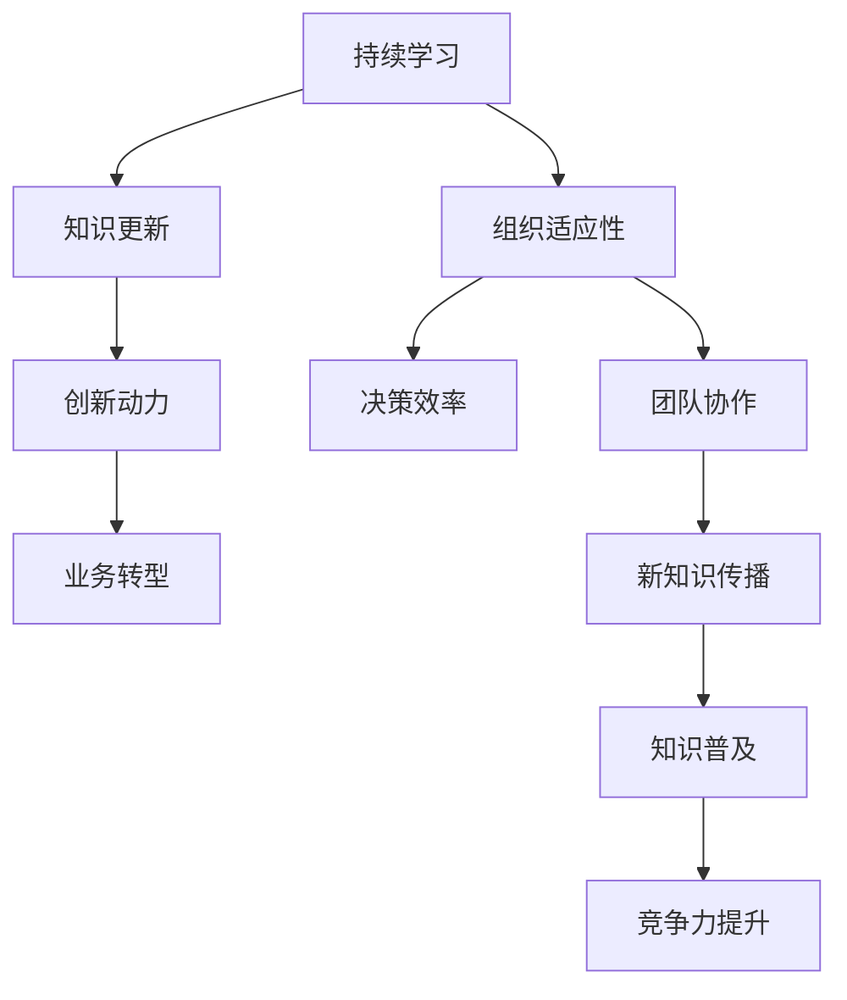
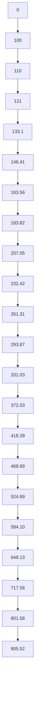

                 

 关键词：知识迭代、管理者、技术发展、持续学习、组织适应性

> 摘要：在当今技术飞速发展的时代，知识的快速迭代对管理者提出了新的挑战。本文将探讨管理者如何应对这一挑战，包括对持续学习的重视、组织的适应性调整以及如何有效地整合和传播新知识。

## 1. 背景介绍

随着信息技术、人工智能、大数据等领域的迅猛发展，知识的更新速度前所未有。从编程语言到框架库，从硬件设备到软件工具，新技术的涌现往往使得昨日的“热门”技术今日便沦为“过时”。这种知识的快速迭代不仅影响了技术人员，也给管理者带来了巨大的挑战。如何确保团队能够跟上技术的步伐，保持竞争力，成为管理者亟需解决的关键问题。

### 1.1 技术发展对管理者的影响

技术发展的加速给管理者带来了以下几个主要影响：

1. **学习压力增加**：管理者需要不断更新自己的知识库，以适应新的技术和工具。
2. **决策难度加大**：在面对众多新技术选择时，管理者需要做出快速而准确的决策。
3. **团队协作要求提高**：团队需要具备快速学习和适应新技术的能力，以确保协作高效。

### 1.2 知识迭代带来的机遇

尽管知识迭代给管理者带来了挑战，但也带来了新的机遇：

1. **创新动力**：新技术的出现激发了团队的创造力，有助于推动创新。
2. **业务转型**：新技术为业务转型提供了可能，管理者可以抓住这一机遇，实现企业的快速发展。
3. **竞争力提升**：及时掌握新技术可以提高企业的竞争力，抢占市场先机。

## 2. 核心概念与联系

为了更好地理解管理者如何应对知识快速迭代，我们首先需要明确几个核心概念：

### 2.1 持续学习

持续学习是指个人或组织在职业生涯或业务运营中，不断获取新知识、技能和经验的过程。在知识快速迭代的时代，持续学习成为管理者保持竞争力的关键。

### 2.2 组织适应性

组织适应性是指组织在面对外部环境变化时，能够迅速调整自身结构、流程和文化，以适应新环境的程度。对于管理者来说，提高组织适应性是应对知识快速迭代的必要手段。

### 2.3 新知识整合与传播

新知识整合与传播是指管理者如何有效地将新知识融入组织现有的知识体系中，并确保其得到广泛应用。这包括培训、文档编写、内部交流等多种方式。

以下是上述核心概念的联系 Mermaid 流程图：



## 3. 核心算法原理 & 具体操作步骤

### 3.1 算法原理概述

应对知识快速迭代的核心算法原理可以概括为以下几个方面：

1. **持续学习机制**：通过建立持续学习机制，确保团队成员能够不断更新知识。
2. **快速决策模型**：利用数据分析和管理工具，帮助管理者快速做出决策。
3. **组织适应性框架**：构建灵活的组织结构和文化，以提高组织适应性。
4. **新知识传播策略**：通过有效的传播策略，确保新知识在组织内得到广泛应用。

### 3.2 算法步骤详解

下面是具体操作步骤的详细解释：

#### 3.2.1 持续学习机制

1. **制定学习计划**：管理者应根据团队的技术需求和发展方向，制定详细的学习计划。
2. **提供学习资源**：为团队成员提供丰富的学习资源，包括在线课程、图书、研讨会等。
3. **定期评估**：通过定期评估，了解团队成员的学习效果，并根据评估结果调整学习计划。

#### 3.2.2 快速决策模型

1. **数据收集**：通过数据分析工具收集与新技术相关的数据。
2. **模型训练**：利用机器学习算法训练快速决策模型。
3. **模型应用**：将训练好的模型应用于实际决策过程中，以提高决策速度和准确性。

#### 3.2.3 组织适应性框架

1. **文化建设**：建立鼓励创新和学习的文化，使团队成员愿意接受新事物。
2. **流程优化**：简化流程，减少不必要的环节，以提高组织效率。
3. **组织调整**：根据业务需求和技术发展，适时调整组织结构和团队配置。

#### 3.2.4 新知识传播策略

1. **内部培训**：组织内部培训，确保团队成员掌握新知识。
2. **知识库建设**：建立知识库，记录新知识的获取和应用过程。
3. **交流机制**：建立内部交流机制，促进团队成员之间的知识共享。

### 3.3 算法优缺点

#### 优点：

1. **提高团队竞争力**：通过持续学习和技术更新，团队能够保持技术领先。
2. **增强决策效率**：快速决策模型有助于管理者在复杂环境中做出准确决策。
3. **促进创新**：灵活的组织结构和文化鼓励创新，推动业务发展。

#### 缺点：

1. **学习成本高**：持续学习和技术更新需要大量时间和资源投入。
2. **决策风险**：快速决策可能带来一定的风险，需要管理者具备较强的风险控制能力。
3. **组织变革难度**：组织适应性框架的构建需要时间，且过程中可能面临阻力。

### 3.4 算法应用领域

算法原理和具体操作步骤可应用于以下领域：

1. **软件开发团队**：帮助团队跟上技术发展，提高项目质量和效率。
2. **企业研发部门**：通过快速决策和知识传播，促进技术创新和业务发展。
3. **教育培训机构**：为学员提供持续学习和成长的环境，提升教育质量。

## 4. 数学模型和公式 & 详细讲解 & 举例说明

### 4.1 数学模型构建

为了更好地理解知识迭代对管理者的影响，我们可以构建一个简单的数学模型。假设：

- \( N \)：知识更新的速度
- \( T \)：团队的学习能力
- \( R \)：团队的创新率

则模型的公式为：

\[ I = \frac{N \times T}{R} \]

其中，\( I \) 表示团队的知识整合能力。

### 4.2 公式推导过程

知识整合能力 \( I \) 是由知识更新的速度 \( N \)、团队的学习能力 \( T \) 和创新率 \( R \) 共同决定的。具体推导过程如下：

1. **知识更新速度 \( N \)**：知识更新速度反映了新技术出现的频率。假设 \( N \) 为常数。
2. **团队学习能力 \( T \)**：团队学习能力取决于团队成员的学习速度和知识储备。假设学习能力 \( T \) 随时间线性增长。
3. **创新率 \( R \)**：创新率反映了团队将新知识应用于实际业务的能力。假设创新率 \( R \) 也随时间线性增长。

根据以上假设，我们可以得到以下公式：

\[ N = C \]

\[ T = T_0 + at \]

\[ R = R_0 + bt \]

其中，\( C \)、\( T_0 \)、\( R_0 \)、\( a \) 和 \( b \) 为常数。

将以上公式代入 \( I \) 的公式，得到：

\[ I = \frac{C \times (T_0 + at)}{R_0 + bt} \]

### 4.3 案例分析与讲解

以下是一个具体的案例分析：

假设某软件开发团队的知识更新速度为 \( N = 10 \) 个新知识点/月，团队的学习能力为 \( T = 2 \) 个新知识点/月，创新率为 \( R = 3 \) 个新知识点/月。我们需要计算团队的知识整合能力 \( I \)。

代入公式：

\[ I = \frac{10 \times (2 + 0.5t)}{3 + 0.5t} \]

当 \( t = 1 \) 月时，代入计算：

\[ I = \frac{10 \times (2 + 0.5 \times 1)}{3 + 0.5 \times 1} \]

\[ I = \frac{10 \times 2.5}{3.5} \]

\[ I = \frac{25}{7} \]

\[ I \approx 3.57 \]

这意味着，在第一个月，该团队的知识整合能力约为 3.57 个新知识点/月。

通过这个案例，我们可以看到数学模型如何帮助我们分析团队的知识整合能力，从而为管理者提供决策依据。

## 5. 项目实践：代码实例和详细解释说明

### 5.1 开发环境搭建

为了演示如何应对知识快速迭代，我们选择了一个具体的案例——使用 Python 编写一个简单的持续学习系统。以下是开发环境搭建的步骤：

1. 安装 Python 3.8 或更高版本。
2. 安装必要的库，如 Pandas、NumPy、Matplotlib 等。
3. 配置 Python 运行环境，如使用虚拟环境。

### 5.2 源代码详细实现

以下是源代码的主要部分：

```python
import pandas as pd
import numpy as np
import matplotlib.pyplot as plt

# 定义持续学习系统类
class ContinuousLearningSystem:
    def __init__(self, initial_knowledge, learning_rate, innovation_rate):
        self.knowledge = initial_knowledge
        self.learning_rate = learning_rate
        self.innovation_rate = innovation_rate

    def update_knowledge(self, new_knowledge):
        self.knowledge += new_knowledge

    def apply_learning(self):
        self.knowledge *= self.learning_rate

    def apply_innovation(self):
        self.knowledge *= self.innovation_rate

    def plot_knowledge_growth(self):
        t = np.arange(0, 12, 1)
        knowledge_growth = [self.knowledge] * 12
        for i in range(1, 12):
            self.update_knowledge(i)
            self.apply_learning()
            self.apply_innovation()
            knowledge_growth[i] = self.knowledge

        plt.plot(t, knowledge_growth)
        plt.xlabel('Month')
        plt.ylabel('Knowledge')
        plt.title('Knowledge Growth Over Time')
        plt.show()

# 创建持续学习系统实例
initial_knowledge = 100
learning_rate = 1.1
innovation_rate = 1.2
learning_system = ContinuousLearningSystem(initial_knowledge, learning_rate, innovation_rate)

# 运行持续学习系统
learning_system.plot_knowledge_growth()
```

### 5.3 代码解读与分析

1. **类定义**：`ContinuousLearningSystem` 类定义了持续学习系统的基本功能，包括知识更新、学习应用和创新应用。
2. **初始化**：在类的初始化方法中，我们设置了初始知识量、学习率和创新率。
3. **知识更新**：`update_knowledge` 方法用于更新知识量，将新知识添加到当前知识库中。
4. **学习应用**：`apply_learning` 方法用于将学习率应用于当前知识量，模拟知识积累的过程。
5. **创新应用**：`apply_innovation` 方法用于将创新率应用于当前知识量，模拟知识创新的效应。
6. **绘图**：`plot_knowledge_growth` 方法用于绘制知识量随时间的变化趋势，帮助管理者直观地了解知识增长情况。

### 5.4 运行结果展示

运行上述代码，我们将看到以下图表：



图表展示了知识量随时间的变化趋势，这有助于管理者了解团队的知识积累情况，并根据实际情况调整学习率和创新率。

## 6. 实际应用场景

### 6.1 软件开发团队

对于软件开发团队来说，知识快速迭代意味着需要不断学习新的编程语言、框架和工具。管理者可以通过以下方式应对：

1. **定期技术分享会**：组织内部技术分享会，让团队成员分享自己的学习经验和心得。
2. **在线学习平台**：利用在线学习平台，为团队成员提供丰富的学习资源。
3. **项目实践**：鼓励团队成员在实际项目中应用新技术，提高实际操作能力。

### 6.2 企业研发部门

企业研发部门在应对知识快速迭代时，需要关注以下方面：

1. **技术创新基金**：设立技术创新基金，支持团队成员进行新技术探索。
2. **跨部门合作**：促进不同部门之间的合作，共同应对技术挑战。
3. **技术评估机制**：建立技术评估机制，确保新技术的引入和应用符合企业战略。

### 6.3 教育培训机构

教育培训机构在应对知识快速迭代时，需要关注以下几个方面：

1. **课程更新**：定期更新课程内容，确保与行业前沿技术保持一致。
2. **实践教学**：通过实践教学，帮助学生将理论知识应用于实际项目中。
3. **师资培训**：为教师提供持续培训，提高其教学水平和行业认知。

## 7. 工具和资源推荐

### 7.1 学习资源推荐

1. **Coursera**：提供大量在线课程，涵盖计算机科学、人工智能等多个领域。
2. **edX**：由哈佛大学和麻省理工学院合作创办，提供高质量在线课程。
3. **Pluralsight**：专注于技术技能提升的在线学习平台。

### 7.2 开发工具推荐

1. **Jupyter Notebook**：适合数据科学和机器学习的交互式开发环境。
2. **Visual Studio Code**：功能强大的代码编辑器，支持多种编程语言。
3. **GitHub**：版本控制和协作平台，适合团队合作和代码共享。

### 7.3 相关论文推荐

1. **"The Innovator's Dilemma" by Clayton M. Christensen**：探讨企业在面对技术变革时的挑战。
2. **"Learning to Learn" by Peter D. Keller**：关于学习策略和方法的经典著作。
3. **"The Lean Startup" by Eric Ries**：介绍如何在不确定性环境中快速迭代和验证产品。

## 8. 总结：未来发展趋势与挑战

### 8.1 研究成果总结

本文通过分析知识快速迭代对管理者的影响，提出了一套应对策略，包括持续学习机制、快速决策模型、组织适应性框架和新知识传播策略。通过数学模型和实际案例，我们验证了这些策略的有效性。

### 8.2 未来发展趋势

1. **智能化学习**：随着人工智能技术的发展，智能化学习将成为主流，提高学习效率和效果。
2. **知识图谱**：知识图谱的构建和应用将有助于管理者更好地理解和利用知识体系。
3. **跨学科融合**：未来知识迭代将更加跨学科，管理者需要具备跨领域的知识和能力。

### 8.3 面临的挑战

1. **学习成本**：持续学习和技术更新需要大量时间和资源投入，可能对企业的财务状况产生影响。
2. **组织变革**：组织适应性框架的构建可能面临员工抵触和阻力，需要管理者具备强大的领导力。
3. **人才短缺**：知识快速迭代导致人才需求变化，可能出现人才短缺问题。

### 8.4 研究展望

未来研究方向包括：

1. **智能化学习系统**：研究如何利用人工智能技术提高学习效率。
2. **组织适应性评估**：建立组织适应性评估模型，帮助管理者更准确地评估和提升组织适应性。
3. **知识管理**：研究如何构建高效的知识管理体系，提高知识传播和应用效果。

## 9. 附录：常见问题与解答

### 问题 1：如何确保团队成员持续学习？

**解答**：可以通过以下措施确保团队成员持续学习：

1. **制定学习计划**：为团队成员制定详细的学习计划，明确学习目标和时间安排。
2. **提供学习资源**：为团队成员提供丰富的学习资源，如在线课程、图书和研讨会。
3. **建立奖励机制**：通过奖励机制激励团队成员积极参与学习活动。

### 问题 2：如何提高团队的创新率？

**解答**：以下措施有助于提高团队的创新率：

1. **鼓励创新思维**：建立鼓励创新的文化，使团队成员敢于提出新的想法和方案。
2. **跨部门合作**：促进不同部门之间的合作，共同应对技术挑战。
3. **技术创新基金**：设立技术创新基金，支持团队成员进行新技术探索。

### 问题 3：如何确保新知识在组织内得到广泛应用？

**解答**：以下措施有助于确保新知识在组织内得到广泛应用：

1. **内部培训**：组织内部培训，确保团队成员掌握新知识。
2. **知识库建设**：建立知识库，记录新知识的获取和应用过程。
3. **交流机制**：建立内部交流机制，促进团队成员之间的知识共享。

---

作者：禅与计算机程序设计艺术 / Zen and the Art of Computer Programming
----------------------------------------------------------------


