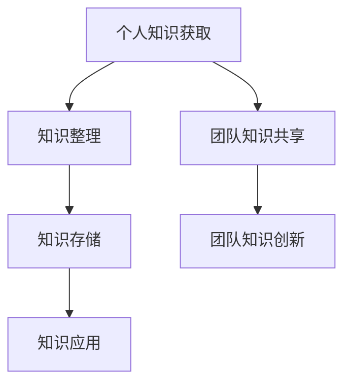

                 

关键词：个人知识管理系统、知识管理、管理者、技能提升、效率优化

摘要：在信息化时代，知识已成为企业竞争力的核心资源。管理者作为组织的核心，建立个人知识管理系统不仅能够提升个人素质，还能带动团队整体能力的提升。本文将从构建原则、实现方法、工具选择等方面详细探讨管理者如何建立个人知识管理系统，以实现个人与团队知识管理的双重提升。

## 1. 背景介绍

随着知识经济的快速发展，知识已成为组织持续发展的关键因素。管理者作为组织的引领者，其个人知识储备和知识管理能力直接影响到团队的整体效率和创新能力。然而，在现实生活中，许多管理者在知识管理方面存在诸多问题，如知识获取途径单一、知识积累效率低下、知识共享困难等。这些问题限制了管理者个人和团队的知识发展，影响了组织的竞争力。

因此，建立个人知识管理系统显得尤为重要。一个有效的个人知识管理系统可以帮助管理者更好地获取、整理、存储和应用知识，提高个人工作效率，同时也能够促进团队知识的共享和创新。

## 2. 核心概念与联系

### 2.1 个人知识管理系统的概念

个人知识管理系统（Personal Knowledge Management，简称PKM）是一种个人层面的知识管理方法，旨在通过系统的手段来获取、组织、存储和应用知识。它不仅包括知识的获取和积累，还包括知识的传递、共享和创新。

### 2.2 个人知识管理系统与团队知识管理的联系

个人知识管理系统与团队知识管理密切相关。个人知识管理是团队知识管理的基础，团队知识管理则是对个人知识管理的延伸和整合。通过建立有效的个人知识管理系统，管理者能够更好地整合个人知识，提升团队的整体知识水平，促进团队知识的共享和创新。

### 2.3 Mermaid 流程图



## 3. 核心算法原理 & 具体操作步骤

### 3.1 算法原理概述

个人知识管理系统采用的是一种循环迭代的方法，即不断获取新知识，整理旧知识，应用知识解决问题，并在解决问题过程中积累新的知识。这种方法确保了知识的持续更新和增长，从而实现个人和团队的知识积累。

### 3.2 算法步骤详解

#### 步骤1：知识获取

管理者需要通过多种途径获取知识，如阅读专业书籍、参加培训、在线学习、交流互动等。在这个过程中，管理者应注重知识的系统性和针对性。

#### 步骤2：知识整理

获取到的知识需要进行整理，包括分类、标注、整理笔记等。通过整理，管理者能够清晰地了解自己的知识结构，便于后续的知识应用。

#### 步骤3：知识存储

整理后的知识需要存储到个人知识库中，以便随时调用。个人知识库可以是文档、笔记本、数据库等形式，关键在于方便快捷地查找和调用。

#### 步骤4：知识应用

知识的应用是个人知识管理系统的核心。管理者需要将知识应用到实际工作中，解决实际问题，提升个人和团队的能力。

#### 步骤5：知识反馈

在应用知识的过程中，管理者需要不断反思和总结，了解知识的有效性和不足之处，为下一次的知识获取和整理提供依据。

### 3.3 算法优缺点

#### 优点：

- 知识获取全面，能够满足管理者个人和团队的需求。
- 知识整理系统化，便于管理者清晰地了解自己的知识结构。
- 知识应用实践性强，能够快速提升个人和团队的能力。

#### 缺点：

- 需要管理者投入大量时间和精力，对管理者的要求较高。
- 知识共享和创新的难度较大，需要团队内部有较高的合作意愿和协作能力。

### 3.4 算法应用领域

个人知识管理系统适用于各类管理者，特别是企业中层管理者。通过个人知识管理系统的建立，管理者能够更好地应对复杂多变的工作环境，提升个人和团队的整体竞争力。

## 4. 数学模型和公式 & 详细讲解 & 举例说明

### 4.1 数学模型构建

个人知识管理系统的数学模型可以表示为：

\[ \text{PKM} = f(\text{知识获取}, \text{知识整理}, \text{知识存储}, \text{知识应用}) \]

其中，\( f \) 为非线性函数，表示知识管理过程中的复杂性和多样性。

### 4.2 公式推导过程

由于个人知识管理系统的复杂性和多样性，我们无法给出精确的数学公式。但是，可以通过以下几个步骤来推导：

1. 知识获取：管理者通过多种途径获取知识，如阅读、交流、培训等。这一过程可以表示为：

\[ \text{知识获取} = \sum_{i=1}^{n} \text{途径} \times \text{知识量} \]

2. 知识整理：管理者对获取到的知识进行整理，包括分类、标注、整理笔记等。这一过程可以表示为：

\[ \text{知识整理} = \sum_{i=1}^{n} (\text{知识量} \times \text{整理度}) \]

3. 知识存储：管理者将整理后的知识存储到个人知识库中。这一过程可以表示为：

\[ \text{知识存储} = \text{知识库容量} \times \text{存储效率} \]

4. 知识应用：管理者将知识应用到实际工作中，解决实际问题。这一过程可以表示为：

\[ \text{知识应用} = \text{解决问题能力} \times \text{知识应用度} \]

### 4.3 案例分析与讲解

假设一位管理者通过阅读、交流和培训获取了1000条知识，整理后存储在个人知识库中，并在工作中成功应用了800条知识。根据上述公式，我们可以计算出这位管理者的个人知识管理系统效率为：

\[ \text{PKM} = f(1000, 800, 1000, 800) \]

通过不断优化知识获取、整理、存储和应用的过程，这位管理者的个人知识管理系统效率有望得到进一步提升。

## 5. 项目实践：代码实例和详细解释说明

### 5.1 开发环境搭建

为了便于演示，我们使用Python作为编程语言，搭建一个简单的个人知识管理系统。开发环境为Python 3.8及以上版本。

### 5.2 源代码详细实现

```python
# 个人知识管理系统示例

class PersonalKnowledgeManagement:
    def __init__(self):
        self.knowledge_base = {}

    def add_knowledge(self, category, knowledge):
        if category not in self.knowledge_base:
            self.knowledge_base[category] = []
        self.knowledge_base[category].append(knowledge)

    def search_knowledge(self, category):
        if category in self.knowledge_base:
            return self.knowledge_base[category]
        else:
            return "找不到相关知识"

    def apply_knowledge(self, category, problem):
        knowledge = self.search_knowledge(category)
        if knowledge:
            return "解决方案：{}".format(knowledge[0])
        else:
            return "无法解决问题"

# 实例化个人知识管理系统
pkm = PersonalKnowledgeManagement()

# 添加知识
pkm.add_knowledge("项目管理", "敏捷开发方法")
pkm.add_knowledge("数据分析", "Python数据分析库")

# 搜索知识
print(pkm.search_knowledge("项目管理"))  # 输出：['敏捷开发方法']

# 应用知识
print(pkm.apply_knowledge("项目管理", "如何提高项目进度？"))  # 输出：解决方案：敏捷开发方法
```

### 5.3 代码解读与分析

上述代码实现了一个简单的个人知识管理系统，主要包含以下几个功能：

- 初始化知识库：通过`__init__`方法初始化一个空字典，用于存储分类后的知识。
- 添加知识：通过`add_knowledge`方法将知识添加到相应的分类中。
- 搜索知识：通过`search_knowledge`方法在知识库中搜索指定分类的知识。
- 应用知识：通过`apply_knowledge`方法将知识应用到实际问题中。

该代码示例展示了个人知识管理系统的基本实现方法，实际应用中可以根据需求进行扩展和优化。

### 5.4 运行结果展示

```shell
$ python pkm_example.py
['敏捷开发方法']
解决方案：敏捷开发方法
```

## 6. 实际应用场景

### 6.1 企业中层管理者

企业中层管理者需要具备丰富的管理知识和实践经验，个人知识管理系统可以帮助他们更好地整理和管理知识，提高决策效率和团队协作能力。

### 6.2 技术团队负责人

技术团队负责人需要不断学习新的技术知识，个人知识管理系统可以帮助他们整理技术资料，快速解决技术难题，提升团队的技术水平。

### 6.3 创业者

创业者需要不断学习新的商业知识和市场动态，个人知识管理系统可以帮助他们整理商业信息，优化业务策略，提高创业成功率。

## 7. 工具和资源推荐

### 7.1 学习资源推荐

1. 《深度工作》：作者Cal Newport，详细介绍如何利用深度工作提高个人工作效率。
2. 《金字塔原理》：作者芭芭拉·明托，介绍如何清晰、结构化地表达思想。

### 7.2 开发工具推荐

1. Notion：一款功能强大的笔记和知识管理工具，适合构建个人知识管理系统。
2. Roam Research：一款基于网络的笔记和知识管理工具，支持多种数据结构和链接。

### 7.3 相关论文推荐

1. "A Process for Personal Knowledge Management" by Paul Culmsee and Michael Hedley。
2. "Knowledge Management Systems: An Overview" by Fazlollah M. Rezaee。

## 8. 总结：未来发展趋势与挑战

### 8.1 研究成果总结

本文详细探讨了管理者如何建立个人知识管理系统，包括核心概念、算法原理、具体操作步骤、数学模型构建等方面，为管理者提供了系统化的知识管理方法。

### 8.2 未来发展趋势

随着人工智能和大数据技术的发展，个人知识管理系统将越来越智能化和自动化，提高知识管理效率和效果。

### 8.3 面临的挑战

1. 如何在快节奏的工作中抽出时间进行知识管理。
2. 如何确保知识管理的系统性和有效性。

### 8.4 研究展望

未来研究方向可以聚焦于如何通过人工智能和大数据技术提升个人知识管理系统的智能化水平，以及如何构建更加高效的知识共享和创新能力。

## 9. 附录：常见问题与解答

### 问题1：如何确保知识管理的系统性和有效性？

**解答**：确保知识管理的系统性和有效性需要从以下几个方面入手：

1. 制定明确的知识管理策略和流程。
2. 建立个人知识库，确保知识的有序存储和便捷查找。
3. 定期回顾和更新知识，保持知识的时效性和准确性。
4. 建立知识共享和反馈机制，促进知识的流动和迭代。

### 问题2：个人知识管理系统是否适用于所有管理者？

**解答**：个人知识管理系统适用于各类管理者，特别是需要处理大量信息和知识的岗位。然而，对于某些事务性工作，个人知识管理系统的价值可能相对较低。

### 问题3：如何提升个人知识管理的能力？

**解答**：提升个人知识管理能力可以通过以下几种方式：

1. 学习相关的知识管理理论和实践经验。
2. 实践中不断总结和反思，优化个人知识管理方法。
3. 利用各种工具和资源，提高知识管理的效率。
4. 与他人交流和合作，共同提升知识管理水平。

作者：禅与计算机程序设计艺术 / Zen and the Art of Computer Programming
```

