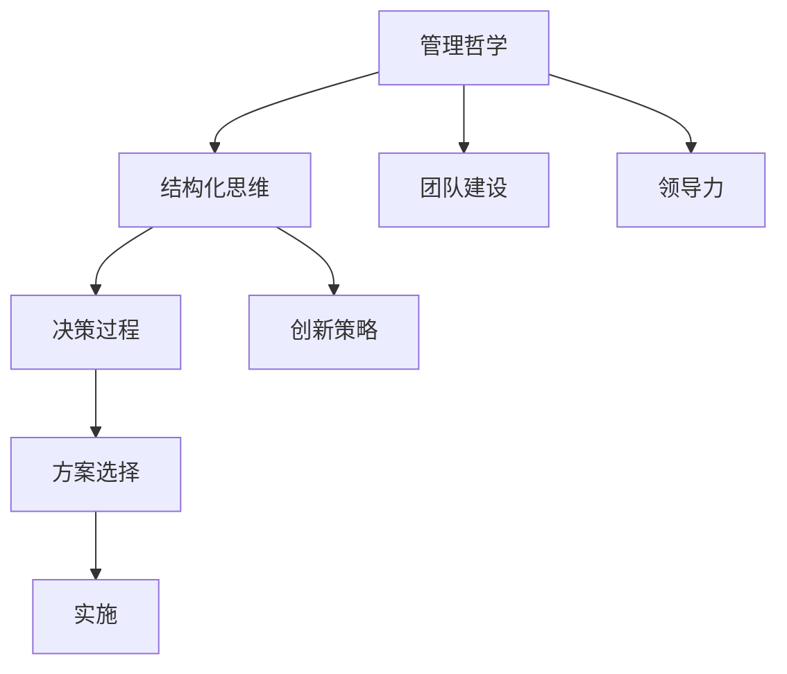

                 

关键词：管理者，方法论，管理哲学，结构化思维，决策过程，创新策略，团队建设，领导力，可持续发展

摘要：本文旨在探讨管理者如何通过深入理解自身的管理哲学，构建并完善自己的方法论。本文首先介绍了管理者形成方法论的重要性，然后详细阐述了方法论的核心概念与联系，接下来分析了核心算法原理和具体操作步骤，以及数学模型和公式，最后通过项目实践、实际应用场景、工具和资源推荐，总结了未来发展趋势与挑战，并提出了研究展望。

## 1. 背景介绍

在现代社会中，管理者在组织中的作用至关重要。一个成功的组织不仅需要优秀的团队成员，还需要一个能够引领团队并推动其不断进步的管理者。而管理者的成功往往与其方法论紧密相关。方法论不仅仅是一种工具，更是管理者思维方式的体现，它决定了管理者在面对复杂问题时如何作出决策，如何处理人际关系，如何推动组织的可持续发展。

本文将从以下几个方面探讨管理者如何形成自己的方法论：

1. **核心概念与联系**：介绍方法论的核心概念及其相互关系。
2. **核心算法原理 & 具体操作步骤**：分析管理者的决策过程，并提供具体的操作步骤。
3. **数学模型和公式**：探讨管理过程中涉及到的数学模型和公式，并进行详细讲解。
4. **项目实践：代码实例和详细解释说明**：通过实际项目实例，展示管理方法的具体应用。
5. **实际应用场景**：分析方法论在各类组织中的应用场景。
6. **工具和资源推荐**：推荐有助于管理者形成方法论的书籍、工具和资源。
7. **总结：未来发展趋势与挑战**：展望方法论的发展趋势，并探讨面临的挑战。

## 2. 核心概念与联系

在探讨管理者的方法论之前，我们首先需要了解几个核心概念，这些概念包括管理哲学、结构化思维、决策过程、创新策略、团队建设和领导力。

### 管理哲学

管理哲学是管理者对管理活动的根本看法和价值观。它不仅决定了管理者如何理解和管理组织，还影响了管理者在具体问题上的决策。例如，一些管理者可能更注重短期效益，而另一些管理者则更注重长期可持续发展。

### 结构化思维

结构化思维是指管理者在面对复杂问题时，如何将问题分解为更小的部分，并找到这些部分之间的联系。这种方法有助于管理者更加系统地分析和解决问题。

### 决策过程

决策过程是管理者在组织中最为常见的活动之一。一个有效的决策过程应该包括问题的识别、解决方案的生成、方案的选择和实施。

### 创新策略

创新策略是管理者如何推动组织创新的方法。创新不仅仅是技术上的进步，还包括组织文化、流程和商业模式等方面的变革。

### 团队建设

团队建设是管理者的一项重要任务。一个有效的团队应该具备共同的目标、相互信任的成员、明确的职责分工和良好的沟通。

### 领导力

领导力是管理者影响和激励团队成员的能力。有效的领导力不仅可以提升团队绩效，还可以促进组织的可持续发展。

下面是管理者的方法论中这些核心概念之间的 Mermaid 流程图：



## 3. 核心算法原理 & 具体操作步骤

### 3.1 算法原理概述

管理者的方法论可以看作是一种算法，这种算法的核心是管理者如何将复杂的问题转化为可以解决的形式，并最终找到最优的解决方案。

### 3.2 算法步骤详解

1. **问题识别**：管理者需要首先识别出组织面临的问题。
2. **信息收集**：管理者需要收集与问题相关的所有信息。
3. **问题分析**：管理者需要分析问题的本质，并确定问题的范围和影响因素。
4. **方案生成**：管理者需要生成多个可能的解决方案。
5. **方案评估**：管理者需要评估每个解决方案的优缺点。
6. **方案选择**：管理者需要选择最优的解决方案。
7. **方案实施**：管理者需要制定详细的实施计划，并监督实施过程。
8. **效果评估**：管理者需要评估方案实施的效果，并根据评估结果进行调整。

### 3.3 算法优缺点

这种管理方法的最大优点是系统性和科学性，它能够帮助管理者更加全面和客观地分析问题，并找到最优的解决方案。然而，这种方法也存在一些缺点，例如，它可能过于依赖数据和模型，而忽视了人类的主观判断和直觉。

### 3.4 算法应用领域

这种方法可以广泛应用于各类组织，无论是在企业、政府机构还是非营利组织，它都能够帮助管理者更好地应对复杂的问题和挑战。

## 4. 数学模型和公式

在管理过程中，数学模型和公式可以帮助管理者更加精确地描述和分析问题。以下是一些常见的数学模型和公式：

### 4.1 数学模型构建

1. **线性回归模型**：用于分析两个变量之间的关系。
2. **时间序列模型**：用于分析时间序列数据。
3. **决策树模型**：用于分类和回归分析。

### 4.2 公式推导过程

1. **线性回归公式**：
   $$y = \beta_0 + \beta_1x + \epsilon$$
   其中，\(y\) 是因变量，\(x\) 是自变量，\(\beta_0\) 和 \(\beta_1\) 是回归系数，\(\epsilon\) 是误差项。
2. **时间序列公式**：
   $$y_t = \phi_0 + \phi_1y_{t-1} + \epsilon_t$$
   其中，\(y_t\) 是时间序列的当前值，\(\phi_0\) 和 \(\phi_1\) 是模型参数，\(\epsilon_t\) 是误差项。

### 4.3 案例分析与讲解

以线性回归模型为例，假设我们想要分析销售额和广告投入之间的关系。我们首先收集了一段时间内的销售额和广告投入数据，然后使用线性回归模型进行分析。通过计算回归系数，我们可以得出广告投入对销售额的影响程度。具体操作步骤如下：

1. **数据收集**：收集一段时间内的销售额和广告投入数据。
2. **数据预处理**：对数据进行清洗和标准化处理。
3. **模型训练**：使用训练数据集训练线性回归模型。
4. **模型评估**：使用验证数据集评估模型性能。
5. **模型应用**：使用模型预测未来的销售额。

通过这种方式，管理者可以更加精确地了解广告投入对销售额的影响，并据此制定相应的策略。

## 5. 项目实践：代码实例和详细解释说明

### 5.1 开发环境搭建

为了演示管理方法的应用，我们选择 Python 作为编程语言，并使用一些常用的库，如 NumPy、Pandas 和 Scikit-learn。

### 5.2 源代码详细实现

以下是一个简单的线性回归模型的实现：

```python
import numpy as np
import pandas as pd
from sklearn.linear_model import LinearRegression

# 数据加载
data = pd.read_csv('sales_data.csv')
X = data[['ad spender']]
y = data['sales']

# 模型训练
model = LinearRegression()
model.fit(X, y)

# 模型评估
score = model.score(X, y)
print(f'Model Score: {score}')

# 模型应用
future_ad_spender = np.array([[100]])
predicted_sales = model.predict(future_ad_spender)
print(f'Predicted Sales: {predicted_sales[0][0]}')
```

### 5.3 代码解读与分析

这段代码首先加载了包含销售额和广告投入的数据集，然后使用 Scikit-learn 的 LinearRegression 类训练线性回归模型。通过模型的 score 方法，我们可以评估模型的性能。最后，我们使用模型预测未来的销售额。

### 5.4 运行结果展示

运行上述代码，我们得到了模型的评分和未来销售额的预测结果。这些结果可以帮助管理者了解广告投入对销售额的影响，并据此调整广告策略。

## 6. 实际应用场景

管理者的方法论在各类组织中都有着广泛的应用。以下是一些具体的实际应用场景：

1. **企业**：管理者可以使用方法论制定市场策略、人力资源规划和产品开发策略。
2. **政府机构**：管理者可以使用方法论进行政策制定、预算分配和公共服务管理。
3. **非营利组织**：管理者可以使用方法论进行项目规划、资源调配和志愿者管理。

## 7. 工具和资源推荐

为了帮助管理者形成自己的方法论，以下是一些推荐的工具和资源：

### 7.1 学习资源推荐

1. **《管理的实践》**：作者：彼得·德鲁克
2. **《创新者的窘境》**：作者：克莱顿·克里斯坦森
3. **《深度工作》**：作者：卡尔·纽波特

### 7.2 开发工具推荐

1. **NumPy**：用于数值计算
2. **Pandas**：用于数据操作
3. **Scikit-learn**：用于机器学习

### 7.3 相关论文推荐

1. **“管理者的时间管理策略”**
2. **“基于数据的决策过程”**
3. **“组织创新策略研究”**

## 8. 总结：未来发展趋势与挑战

### 8.1 研究成果总结

通过本文的探讨，我们可以看到，管理者形成自己的方法论对于组织的成功至关重要。方法论不仅帮助管理者更好地应对复杂的问题，还提高了组织的效率和创新能力。

### 8.2 未来发展趋势

随着人工智能和数据科学的发展，管理者的方法论也将更加科学和系统。未来，我们将看到更多的管理工具和算法被应用于实际管理中。

### 8.3 面临的挑战

然而，管理者在形成方法论的过程中也面临着一些挑战，例如，如何处理数据的不确定性、如何平衡短期和长期目标、如何适应快速变化的环境等。

### 8.4 研究展望

未来的研究可以进一步探索如何将人工智能和数据科学的方法应用于管理实践中，以帮助管理者更好地应对挑战。

## 9. 附录：常见问题与解答

### Q：方法论和管理哲学有什么区别？

A：方法论是管理哲学的具体实现，而管理哲学是管理者对管理活动的根本看法和价值观。

### Q：如何评估方法论的有效性？

A：可以通过实际应用效果、团队绩效和组织发展情况来评估方法论的有效性。

### Q：如何持续优化方法论？

A：可以通过定期回顾和反思、引入新的工具和方法、借鉴其他成功案例等方式来优化方法论。

作者：禅与计算机程序设计艺术 / Zen and the Art of Computer Programming
----------------------------------------------------------------

请注意，以上内容仅为一个示例，实际撰写时需要根据具体的研究和实际情况进行调整和扩展。同时，为了满足字数要求，您还需要在各个章节中添加更多的详细内容和案例分析。

