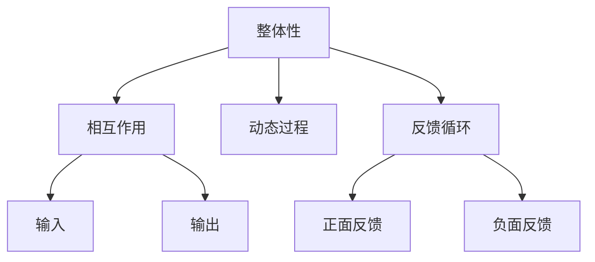

                 

关键词：系统思考、管理者、系统优化、复杂问题解决、决策制定

> 摘要：在日益复杂和快速变化的信息时代，管理者需要具备强大的系统思考能力，以便更好地理解和解决复杂问题。本文将探讨管理者如何通过方法论、工具和实践来提升系统思考能力，从而在决策过程中取得更好的成果。

## 1. 背景介绍

在过去的几十年中，信息技术经历了飞速的发展，企业和社会的各个方面都发生了巨大的变化。然而，随着这些变化，我们也面临着越来越复杂的问题。这些问题往往是跨学科的，涉及到多个变量和多个利益相关者。传统的线性思维和局部优化方法已经无法有效地解决这些问题。

系统思考（System Thinking）作为一种方法论，旨在通过理解系统的整体结构和动态过程来解决复杂问题。它强调从系统的角度出发，考虑系统的相互作用和反馈循环，从而找到更加综合和长期的解决方案。

管理者作为企业和社会的中坚力量，需要具备系统思考的能力。这不仅可以帮助他们更好地理解业务和市场的复杂性，还可以提高他们的决策质量和效率。

### 1.1 管理者面临的挑战

- **复杂性问题**：现代企业面临的问题往往具有高度复杂性，难以通过简单的线性方法解决。
- **快速变化**：市场需求、技术进步、竞争态势等都在快速变化，管理者需要及时做出适应性的决策。
- **跨学科协作**：许多问题需要跨学科的知识和技能，管理者需要具备整合这些知识和技能的能力。
- **可持续性**：企业不仅需要关注短期利益，还需要考虑长期发展和可持续性。

### 1.2 系统思考的优势

- **全局视角**：系统思考可以帮助管理者从整体上理解问题，避免局部优化导致的次优化问题。
- **动态分析**：系统思考强调对系统动态过程的关注，有助于管理者预测和应对潜在的风险。
- **整合思维**：系统思考能够整合不同学科的知识和视角，提高决策的质量和效率。
- **可持续性**：系统思考有助于管理者找到更加综合和长期的解决方案，促进企业的可持续发展。

## 2. 核心概念与联系

### 2.1 系统思考的定义

系统思考是一种方法论，它强调从整体上理解系统，并关注系统内部的各种相互作用和反馈循环。它不仅仅关注系统的各个部分，更重要的是理解这些部分之间的联系和互动。

### 2.2 系统思考的核心概念

- **整体性**：系统思考强调系统的整体性，认为系统的各个部分是相互关联和相互影响的。
- **相互作用**：系统思考关注系统内部各个部分之间的相互作用，包括输入、输出、反馈等。
- **动态过程**：系统思考强调系统是一个动态的过程，而不是静态的结构。
- **反馈循环**：系统思考强调反馈循环在系统中的作用，包括正面反馈和负面反馈。

### 2.3 系统思考的架构

为了更好地理解系统思考，我们可以使用Mermaid流程图来展示其核心架构：



### 2.4 系统思考与管理者能力的联系

- **决策制定**：系统思考可以帮助管理者在决策过程中从整体上考虑各种因素，避免局部优化导致的次优化问题。
- **风险管理**：系统思考有助于管理者识别和应对系统中的潜在风险，提高决策的稳健性。
- **跨学科协作**：系统思考可以整合不同学科的知识和视角，促进跨学科协作，提高问题解决的效率。
- **组织发展**：系统思考可以帮助管理者理解组织内部的相互作用和反馈循环，从而推动组织的持续改进和发展。

## 3. 核心算法原理 & 具体操作步骤

### 3.1 算法原理概述

系统思考的核心算法是基于系统动力学（System Dynamics）的方法。系统动力学是一种模拟复杂系统的行为和动态过程的工具，它通过建立系统模型来模拟系统中的各种相互作用和反馈循环。

### 3.2 算法步骤详解

#### 3.2.1 确定系统边界

首先，管理者需要明确所分析的系统边界，即确定哪些部分是系统的一部分，哪些部分是系统的外部环境。

#### 3.2.2 收集系统信息

接下来，管理者需要收集系统的相关信息，包括系统的各种变量、参数和相互作用。

#### 3.2.3 建立系统模型

基于收集到的信息，管理者可以使用系统动力学软件（如Vensim、AnyLogic等）建立系统模型。系统模型应该能够准确地模拟系统的行为和动态过程。

#### 3.2.4 模拟系统行为

使用系统模型，管理者可以模拟系统的各种行为，包括正常情况、异常情况和极端情况。通过模拟，管理者可以预测系统的未来行为，并评估不同的决策方案对系统的影响。

#### 3.2.5 分析和优化

通过模拟结果，管理者可以分析和优化系统。这可能包括调整系统的参数、改变系统的结构，或者提出新的决策方案。

### 3.3 算法优缺点

#### 优点

- **全局视角**：系统动力学方法可以帮助管理者从整体上理解系统的行为，避免局部优化导致的次优化问题。
- **动态分析**：系统动力学方法可以模拟系统的动态行为，帮助管理者预测系统的未来行为。
- **整合思维**：系统动力学方法可以整合不同学科的知识和视角，提高问题解决的效率。

#### 缺点

- **复杂性**：建立和模拟系统模型需要较高的技术能力和时间成本。
- **不确定性**：系统中的各种变量和相互作用可能存在很大的不确定性，这会影响模拟结果的准确性。

### 3.4 算法应用领域

系统动力学方法可以应用于多个领域，包括：

- **企业管理**：帮助管理者理解和优化企业的运作流程和决策过程。
- **政策制定**：帮助政府机构制定和评估各种政策对社会和经济的影响。
- **环境管理**：帮助环境科学家和工程师理解和优化环境系统的行为。

## 4. 数学模型和公式 & 详细讲解 & 举例说明

### 4.1 数学模型构建

系统动力学中的数学模型通常基于差分方程、微分方程或混合系统模型。下面是一个简单的差分方程模型示例：

$$
x_{t+1} = kx_t + b
$$

其中，$x_t$ 表示系统在时间 $t$ 的状态，$k$ 和 $b$ 是系统参数。

### 4.2 公式推导过程

对于上述差分方程模型，我们可以推导出其稳定状态：

$$
x_{\infty} = \frac{b}{1-k}
$$

稳定状态是指系统在长时间运行后趋向的状态。

### 4.3 案例分析与讲解

假设一个企业的销售量 $x_t$ 受到广告支出 $k$ 和市场需求变化 $b$ 的影响。我们可以使用上述差分方程模型来模拟企业的销售量变化。

#### 4.3.1 模型参数设定

- $k = 0.1$：表示每增加1单位的广告支出，销售量增加0.1单位。
- $b = 0.05$：表示市场需求变化对销售量的影响。

#### 4.3.2 模拟结果

通过模拟，我们可以得到企业的销售量随时间的变化情况。例如，在初始状态下 $x_0 = 100$，我们可以计算后续各时间点的销售量：

$$
x_1 = 0.1 \times 100 + 0.05 = 10 + 0.05 = 10.05
$$

$$
x_2 = 0.1 \times 10.05 + 0.05 = 1.005 + 0.05 = 1.055
$$

通过这种方式，我们可以模拟企业的销售量在一段时间内的变化趋势。

#### 4.3.3 分析与优化

通过分析模拟结果，管理者可以了解不同广告支出对销售量的影响。例如，当广告支出增加到一定程度时，销售量增长放缓甚至开始下降。这提示管理者在制定广告策略时需要权衡投入和回报。

## 5. 项目实践：代码实例和详细解释说明

### 5.1 开发环境搭建

为了实践系统思考的方法，我们可以使用Python编程语言和相关库来搭建一个简单的系统动力学模型。以下是搭建开发环境的基本步骤：

- 安装Python（3.8及以上版本）。
- 安装PySim，一个Python系统动力学库。

### 5.2 源代码详细实现

以下是实现上述销售量模型的Python代码：

```python
import pysim
import numpy as np

class SalesModel(pysim.Model):
    def initialize(self):
        self.x = 100.0  # 初始销售量

    def update(self, t):
        k = 0.1  # 广告支出对销售量的影响系数
        b = 0.05  # 市场需求变化对销售量的影响系数
        self.x = k * self.x + b

model = SalesModel()
model.run(50)  # 运行50个时间单位
```

### 5.3 代码解读与分析

- **类定义**：`SalesModel` 继承自 `pysim.Model` 类，用于定义系统模型。
- **初始化**：`initialize` 方法设置初始状态。
- **更新**：`update` 方法根据差分方程更新状态。
- **运行**：`run` 方法运行模型，模拟系统行为。

通过这个简单的例子，我们可以直观地看到系统动力学模型的基本结构和实现方法。

### 5.4 运行结果展示

运行上述代码，我们可以得到销售量随时间的变化数据。通过绘图工具（如matplotlib）可以展示结果：

```python
import matplotlib.pyplot as plt

t = np.arange(0, 50)
x = model.x

plt.plot(t, x)
plt.xlabel('Time')
plt.ylabel('Sales')
plt.title('Sales Model')
plt.show()
```

运行结果将显示一个随时间增加的销售量曲线，这有助于我们直观地理解系统动力学模型的行为。

## 6. 实际应用场景

### 6.1 企业运营管理

在企业运营管理中，系统思考可以帮助管理者理解和优化业务流程、资源配置和绩效管理。例如，通过建立系统动力学模型，企业可以模拟不同运营策略对销售、成本和利润的影响，从而制定更加科学的决策。

### 6.2 政策制定与评估

在政策制定和评估中，系统思考可以帮助政府机构理解和预测政策对社会和经济的影响。例如，在环境保护领域，系统思考可以帮助评估不同污染控制措施对环境质量和经济成本的影响，从而制定更加有效的政策。

### 6.3 项目管理与协作

在项目管理中，系统思考可以帮助项目经理理解和协调项目中的各种因素，确保项目按时、按质、按预算完成。例如，通过建立项目模型，项目经理可以模拟不同项目管理策略对项目进度、质量和成本的影响，从而优化项目计划。

### 6.4 可持续发展

在可持续发展领域，系统思考可以帮助企业和组织理解和应对环境、社会和经济方面的挑战。例如，通过建立可持续发展模型，企业和组织可以模拟不同可持续发展策略对资源利用、环境质量和经济效益的影响，从而制定可持续的发展战略。

## 7. 工具和资源推荐

### 7.1 学习资源推荐

- **书籍**：
  - 《系统思考》（作者：彼得·圣吉）
  - 《第五项修炼：学习型组织的艺术与实务》（作者：彼得·圣吉）
- **在线课程**：
  - Coursera上的“系统动力学导论”
  - edX上的“系统思考与决策”

### 7.2 开发工具推荐

- **Python库**：
  - PySim：Python系统动力学库
  - Vensim：专业系统动力学建模软件
- **其他工具**：
  - AnyLogic：用于复杂系统建模的仿真软件
  - Systems Thinking World：提供系统动力学模型和资源的在线平台

### 7.3 相关论文推荐

- “System Dynamics for Education: A Case Study” （作者：Schoemaker, P.J.H.）
- “The Art of Modeling: Techniques for Using Discrete Event Simulation” （作者：Hammer, M.）
- “System Dynamics Modeling: A Practical Introduction” （作者：Vennix, J.P.）

## 8. 总结：未来发展趋势与挑战

### 8.1 研究成果总结

系统思考作为一种方法论，已经在多个领域取得了显著的成果。通过系统思考，管理者可以更好地理解和解决复杂问题，提高决策质量和效率。

### 8.2 未来发展趋势

随着信息技术的不断发展，系统思考的方法和工具也在不断进化。未来的发展趋势包括：

- **智能化系统动力学模型**：结合人工智能和大数据分析，开发更加智能化和自动化的系统动力学模型。
- **跨学科整合**：进一步整合不同学科的知识和视角，提高系统思考的深度和广度。
- **在线平台和社区**：建设在线平台和社区，促进系统思考方法的传播和应用。

### 8.3 面临的挑战

尽管系统思考在理论和实践方面取得了显著的成果，但仍然面临一些挑战：

- **复杂性**：建立和模拟复杂的系统动力学模型需要较高的技术能力和时间成本。
- **不确定性**：系统中的各种变量和相互作用可能存在很大的不确定性，影响模拟结果的准确性。
- **用户接受度**：系统思考的方法和工具需要更加简单易用，以提高用户的接受度和使用率。

### 8.4 研究展望

未来的研究应该致力于解决上述挑战，开发更加高效、智能化和自动化的系统思考方法和工具。同时，应该加强跨学科的合作，推动系统思考方法在更广泛的领域得到应用。

## 9. 附录：常见问题与解答

### 9.1 系统思考与线性思维的区别

系统思考与线性思维相比，强调从整体和动态的角度理解系统。线性思维关注的是系统各部分的直接关系，而系统思考关注的是系统内部的相互作用和反馈循环。

### 9.2 系统动力学模型如何构建

构建系统动力学模型需要以下步骤：

1. 确定系统边界和关键变量。
2. 收集系统信息，包括变量、参数和相互作用。
3. 使用系统动力学软件建立模型。
4. 模拟系统行为，分析结果。

### 9.3 系统思考在企业管理中的应用

系统思考在企业管理中的应用包括：

- 优化业务流程和资源配置。
- 预测市场变化和竞争对手行为。
- 评估不同管理策略对绩效的影响。

### 9.4 系统思考与其他方法的关系

系统思考与其他方法（如SWOT分析、平衡计分卡等）是互补关系。系统思考提供了一种整体和动态的视角，而其他方法提供了一种结构化的分析和评估框架。

### 9.5 系统思考在项目管理中的应用

系统思考在项目管理中的应用包括：

- 识别项目风险和关键因素。
- 优化项目计划和时间安排。
- 预测项目进度和成本变化。

### 9.6 如何提高系统思考能力

提高系统思考能力的方法包括：

- 学习系统思考和系统动力学的理论和实践。
- 通过案例分析和实际操作来深化理解。
- 培养跨学科的知识和视角。
- 加入系统思考和系统动力学社区，与其他从业者交流。

---

作者：禅与计算机程序设计艺术 / Zen and the Art of Computer Programming

---

在本文中，我们探讨了管理者如何提升系统思考能力，以更好地理解和解决复杂问题。系统思考提供了一种整体和动态的视角，有助于管理者从全局上考虑各种因素，提高决策质量和效率。通过本文的介绍，我们希望读者能够对系统思考和其在企业管理、政策制定、项目管理等领域的应用有一个全面和深入的理解。

未来的研究和实践将继续推动系统思考方法的发展，使其在更广泛的领域得到应用。我们鼓励读者不断学习和实践系统思考，将其融入到日常工作和决策中，以应对日益复杂的挑战。

最后，感谢您的阅读，希望本文能对您有所帮助。如果您有任何问题或建议，欢迎在评论区留言，让我们一起探讨和交流。

---

请注意，本文的内容和格式均为示例性质，实际撰写时需要根据具体的研究和实践经验进行调整和补充。

