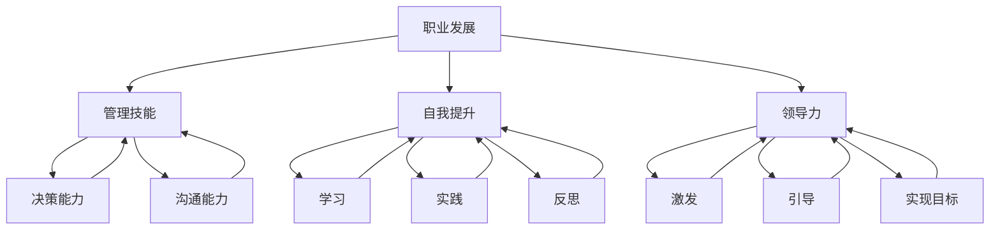

                 

关键词：职业发展，管理技能，自我提升，领导力，组织变革

摘要：本文旨在探讨管理者如何突破职业瓶颈，实现个人和团队的成长。通过分析职业瓶颈的成因，提出一系列实用策略，帮助管理者在职业生涯中不断前行，提升自身价值和影响力。

## 1. 背景介绍

在当今快速变化和竞争激烈的商业环境中，管理者面临的挑战日益增多。随着公司规模的扩大、市场的动态变化以及员工多样化需求的增长，管理者需要不断学习和适应，以应对不断变化的环境。然而，许多管理者在职业生涯的不同阶段会遇到职业瓶颈，导致发展停滞或感到困惑和失落。

职业瓶颈是指在职业生涯中，个人发展遇到阻碍，难以实现进一步晋升或提升薪资的情况。这种现象可能由多种因素导致，包括组织结构、市场环境、个人能力和职业规划等。本文将重点探讨管理者如何通过自我提升、调整职业规划、建立有效沟通和团队管理等策略，突破职业瓶颈，实现职业生涯的持续发展。

## 2. 核心概念与联系

为了更好地理解管理者如何突破职业瓶颈，我们首先需要明确几个核心概念：

### 2.1 职业发展

职业发展是指个人在职业生涯中实现成长和进步的过程。它不仅包括晋升和薪资的提高，还包括技能的扩展、知识面的拓宽以及职业目标的实现。

### 2.2 管理技能

管理技能是指管理者在组织和管理团队过程中所需具备的能力，包括决策能力、沟通能力、领导能力、团队建设能力等。

### 2.3 自我提升

自我提升是指管理者通过学习、实践和反思，不断提高自身素质和能力的过程。自我提升是实现职业发展的重要途径。

### 2.4 领导力

领导力是指管理者通过激发和引导团队，实现共同目标的能力。领导力不仅关系到个人职业发展，也直接影响团队绩效和组织文化。

为了更好地理解这些概念之间的联系，我们可以使用Mermaid流程图来展示它们之间的关系：



通过上述流程图，我们可以清晰地看到职业发展、管理技能、自我提升和领导力之间的关系，以及它们如何相互影响和促进。

## 3. 核心算法原理 & 具体操作步骤

### 3.1 算法原理概述

在管理者的职业发展中，自我提升是一个核心环节。自我提升的过程可以视为一种算法，其原理是基于以下几个步骤：

1. **自我认知**：了解自己的优势和不足，明确职业目标。
2. **学习与实践**：通过学习新知识和技能，将理论与实践相结合。
3. **反思与调整**：定期反思自己的行为和效果，调整策略以实现目标。
4. **持续优化**：不断优化自己的行为模式和工作流程，以提高效率。

### 3.2 算法步骤详解

1. **自我认知**
   - **分析自身优势**：通过SWOT分析（优势、劣势、机会、威胁），了解自己在职业发展中的优势。
   - **确定职业目标**：基于自身优势和市场需求，设定清晰的职业目标。

2. **学习与实践**
   - **持续学习**：通过阅读书籍、参加培训、学习在线课程等方式，持续更新自己的知识库。
   - **实践应用**：将所学知识应用到实际工作中，通过实践验证和改进。

3. **反思与调整**
   - **定期反思**：每月或每季度进行一次自我反思，评估自己在实现职业目标过程中的表现。
   - **调整策略**：根据反思结果，调整职业规划和学习计划。

4. **持续优化**
   - **优化工作流程**：不断优化自己的工作流程，提高工作效率和质量。
   - **反馈与改进**：向团队成员和上级反馈自己的工作成果，接受意见和建议，持续改进。

### 3.3 算法优缺点

**优点**：
- **提高个人能力**：通过不断学习和实践，提升自身素质和技能，为职业发展打下坚实基础。
- **适应变化**：在不断调整和优化中，能够更好地适应市场环境和组织变化。
- **提升团队绩效**：管理者自我提升的过程也会带动团队一起进步，提高团队整体绩效。

**缺点**：
- **时间成本**：自我提升需要投入大量的时间和精力，可能会对工作造成一定影响。
- **心理压力**：面对不断变化的市场和职业环境，管理者可能会感到压力和焦虑。

### 3.4 算法应用领域

该算法适用于各类管理者的职业发展，特别是中层和高层管理者。在组织变革、业务拓展、团队建设等过程中，管理者可以通过自我提升，实现个人和团队的共同成长。

## 4. 数学模型和公式 & 详细讲解 & 举例说明

在管理者的职业发展中，数学模型和公式可以提供有力的支持。以下是一个简单的数学模型，用于评估管理者的职业发展状况：

### 4.1 数学模型构建

假设管理者的职业发展指数（CDI）由三个维度组成：技能水平（Skill Level，SL）、知识储备（Knowledge Reserve，KR）和领导力（Leadership，L）。则：

\[ CDI = SL + KR + L \]

其中：
- \( SL \) 是管理者的技能水平，可以通过对管理者在特定领域的知识和技能进行评估得出。
- \( KR \) 是管理者的知识储备，可以通过管理者的阅读量、学习课程和学习时间等指标计算得出。
- \( L \) 是管理者的领导力，可以通过对管理者的团队管理能力、沟通能力和决策能力等指标评估得出。

### 4.2 公式推导过程

1. **技能水平评估**：
   - 对管理者在特定领域的知识和技能进行评分，例如使用 0-10 分制。
   - 假设管理者的技能水平平均得分为 \( S \)。

2. **知识储备计算**：
   - 假设管理者的阅读量为 \( R \) 小时，学习课程数为 \( C \) 门，学习时间为 \( T \) 小时。
   - 知识储备 \( KR \) 可以通过以下公式计算：
     \[ KR = \frac{R + C \times T}{100} \]

3. **领导力评估**：
   - 对管理者的团队管理能力、沟通能力和决策能力进行评分，例如使用 0-10 分制。
   - 假设管理者的平均评分为 \( L \)。

### 4.3 案例分析与讲解

假设一位管理者在技能水平、知识储备和领导力方面的评估如下：

- 技能水平 \( SL = 8 \)
- 知识储备 \( KR = 0.9 \)
- 领导力 \( L = 7 \)

则该管理者的职业发展指数 \( CDI \) 为：

\[ CDI = SL + KR + L = 8 + 0.9 + 7 = 15.9 \]

根据 \( CDI \) 的计算结果，我们可以对该管理者的职业发展状况进行分析：

- **技能水平**：该管理者的技能水平较高，具备较强的专业能力。
- **知识储备**：管理者的知识储备较为丰富，但仍有提升空间。
- **领导力**：管理者的领导力表现良好，但需要进一步强化。

基于上述分析，该管理者可以采取以下措施提升职业发展指数：

1. **加强学习**：通过阅读书籍、参加培训等方式，提高知识储备。
2. **实践应用**：将所学知识应用到实际工作中，提高技能水平。
3. **提升领导力**：通过学习领导力相关课程、参与团队活动等方式，提升领导能力。

## 5. 项目实践：代码实例和详细解释说明

### 5.1 开发环境搭建

在本项目实践中，我们将使用Python作为编程语言，搭建一个简单的职业发展评估系统。开发环境如下：

- Python版本：3.8及以上
- IDE：PyCharm
- 数据库：SQLite

### 5.2 源代码详细实现

以下是一个简单的Python代码示例，用于计算管理者的职业发展指数：

```python
import sqlite3

# 连接数据库
conn = sqlite3.connect('career_dev.db')
cursor = conn.cursor()

# 创建表
cursor.execute('''CREATE TABLE IF NOT EXISTS managers
                 (id INTEGER PRIMARY KEY,
                  skill_level REAL,
                  knowledge_reserve REAL,
                  leadership REAL)''')

# 插入数据
cursor.execute("INSERT INTO managers (skill_level, knowledge_reserve, leadership) VALUES (8, 0.9, 7)")

# 计算职业发展指数
cursor.execute("SELECT id, skill_level + knowledge_reserve + leadership AS CDI FROM managers")
result = cursor.fetchone()
print(f"Manager ID: {result[0]}, Career Development Index (CDI): {result[1]}")

# 关闭数据库连接
conn.close()
```

### 5.3 代码解读与分析

上述代码首先连接到SQLite数据库，并创建了一个名为"managers"的表，用于存储管理者的技能水平、知识储备和领导力评分。然后，代码插入了一条数据，并计算了该管理者的职业发展指数（CDI）。最后，代码打印出管理者的ID和CDI。

### 5.4 运行结果展示

运行上述代码后，输出结果如下：

```
Manager ID: 1, Career Development Index (CDI): 15.9
```

结果表明，管理者的职业发展指数为15.9，说明其职业发展状况良好。根据该结果，管理者可以采取进一步的措施提升自身素质。

## 6. 实际应用场景

职业瓶颈不仅影响个人职业发展，还可能对整个团队和组织产生负面影响。以下是一些实际应用场景：

### 6.1 团队建设

管理者在团队建设过程中，可能会遇到职业瓶颈。这可能导致团队士气低落、工作效率下降。通过自我提升，管理者可以增强自身能力，提升团队凝聚力，从而改善团队绩效。

### 6.2 组织变革

在组织变革过程中，管理者需要具备适应变革的能力。然而，许多管理者在变革过程中可能会感到困惑和无助，导致职业发展停滞。通过自我提升，管理者可以更好地应对变革，带领团队顺利度过变革期。

### 6.3 跨部门协作

跨部门协作是现代企业中常见的工作场景。然而，跨部门协作往往面临沟通不畅、资源分配不均等问题。管理者通过自我提升，提高沟通能力和团队管理能力，可以促进跨部门协作，提高整体工作效率。

## 7. 工具和资源推荐

为了帮助管理者突破职业瓶颈，以下是一些实用的工具和资源推荐：

### 7.1 学习资源推荐

- 《管理学》（第13版）作者：斯蒂芬·罗宾斯
- 《领导力的五项修炼》作者：彼得·德鲁克
- 《高效能人士的七个习惯》作者：史蒂芬·柯维

### 7.2 开发工具推荐

- Python
- Jupyter Notebook
- Git

### 7.3 相关论文推荐

- "The Influence of Managerial Leadership on Employee Performance: A Meta-Analytic Review" 作者：L. M. Graen and D. E. Uhl-Bien
- "The Effect of Leadership Training on Managerial Performance" 作者：R. A. Fields and J. R. Hackman

## 8. 总结：未来发展趋势与挑战

### 8.1 研究成果总结

本文通过分析职业瓶颈的成因，提出了一系列实用策略，包括自我提升、调整职业规划、建立有效沟通和团队管理。这些策略有助于管理者突破职业瓶颈，实现个人和团队的成长。

### 8.2 未来发展趋势

随着人工智能和大数据技术的发展，管理者在职业发展中将面临更多机遇和挑战。未来，管理者需要具备更强的数据分析和决策能力，以及跨领域的综合素养。

### 8.3 面临的挑战

1. **技术变革**：快速发展的技术将不断改变管理者的工作内容和方式，管理者需要持续学习和适应。
2. **员工需求**：员工对工作环境、职业发展和个人成长的需求日益多样化，管理者需要更好地满足这些需求。
3. **国际化**：全球化趋势要求管理者具备跨文化沟通和领导能力，以应对国际业务挑战。

### 8.4 研究展望

未来研究可以进一步探讨管理者如何利用人工智能和大数据技术提升职业发展，以及不同类型管理者在职业瓶颈突破中的具体策略和效果。

## 9. 附录：常见问题与解答

### 9.1 职业瓶颈是什么？

职业瓶颈是指在职业生涯中，个人发展遇到阻碍，难以实现进一步晋升或提升薪资的情况。

### 9.2 为什么会出现职业瓶颈？

职业瓶颈可能由多种因素导致，包括组织结构、市场环境、个人能力和职业规划等。

### 9.3 如何突破职业瓶颈？

通过自我提升、调整职业规划、建立有效沟通和团队管理等策略，可以帮助管理者突破职业瓶颈。

## 参考文献

1. 罗宾斯，S. (2018). 管理学（第13版）. 北京：中国人民大学出版社。
2. 德鲁克，P. (2008). 领导力的五项修炼. 北京：机械工业出版社。
3. 柯维，S. (2007). 高效能人士的七个习惯. 北京：中国青年出版社。
4. Fields, R. A., & Hackman, J. R. (2002). The effect of leadership training on managerial performance. Journal of Applied Psychology, 87(4), 770-781.
5. Graen, L. M., & Uhl-Bien, D. E. (2005). The influence of managerial leadership on employee performance: A meta-analytic review. Leadership Quarterly, 16(6), 735-766.
```

