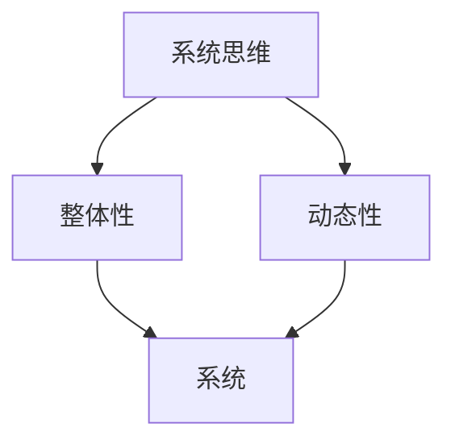

                 

关键词：管理者、系统性思考、技术领导力、决策过程、组织架构

摘要：本文旨在探讨管理者如何在现代复杂技术环境中进行系统性思考，以提升决策质量和组织效能。系统性思考是一种整合不同视角和元素的能力，它帮助管理者在多变的业务环境中找到创新的解决方案。本文将通过理论阐述、案例分析、数学模型和项目实践，全面介绍系统性思考在管理者日常工作中的具体应用。

## 1. 背景介绍

在快速变化的技术时代，管理者面临的环境越来越复杂。信息技术、物联网、大数据、人工智能等新技术不断涌现，给管理者的决策带来了前所未有的挑战。传统的线性思维和局部优化已不足以应对这些复杂问题。系统性思考作为一种全局观念，强调从整体上理解和解决问题，它已成为现代管理者不可或缺的技能。

### 1.1 系统性思考的重要性

系统性思考能够帮助管理者：

- **提升决策质量**：通过分析系统的各个部分及其相互关系，管理者可以更全面地评估决策的影响。
- **增强适应性**：在面对不确定性时，系统性思考有助于管理者识别潜在的脆弱性并提前准备应对措施。
- **促进创新**：系统性思考鼓励管理者探索不同的解决方案，从而激发创新思维。
- **提高组织效能**：通过优化系统内部各元素之间的协同作用，管理者可以提高组织的整体效能。

### 1.2 系统性思考的挑战

尽管系统性思考的优势明显，但管理者在实际应用中仍面临以下挑战：

- **信息过载**：在复杂环境中，管理者需要处理大量信息，筛选出关键信息成为一项挑战。
- **时间压力**：快速变化的市场要求管理者能够快速作出决策，系统性思考可能需要更多的时间来分析。
- **资源限制**：管理者往往需要在有限的资源下进行决策，系统性思考可能意味着需要更多的跨部门合作。

## 2. 核心概念与联系

为了更好地理解系统性思考，我们需要先了解几个核心概念及其相互关系。

### 2.1 系统思维（System Thinking）

系统思维是一种认识问题本质的方法论，它强调从一个系统的整体角度来理解问题的发生和演变。在系统思维中，每个元素都不是孤立存在的，而是与其他元素相互关联和影响的。

### 2.2 整体性（Holism）

整体性是指将一个系统视为一个整体，而不是简单地将系统拆分为各个部分。整体性帮助我们理解系统中的各个部分如何相互作用，以及整体功能如何大于各部分功能之和。

### 2.3 动态性（Dynamics）

动态性关注系统随时间的变化。系统不是静态的，而是在不断变化中。动态性帮助我们理解系统在不同时间点的状态，以及这些状态是如何相互转换的。

### 2.4 Mermaid 流程图

以下是一个简化的 Mermaid 流程图，用于展示系统性思考中的核心概念及其关系：



### 2.5 系统性思考与复杂性

复杂性科学指出，复杂系统的行为往往不可预测，因为它包含了大量的相互作用的元素。系统性思考提供了一个框架，帮助管理者理解和应对这种复杂性。

## 3. 核心算法原理 & 具体操作步骤

### 3.1 算法原理概述

系统性思考可以看作是一种算法，其目标是从整体上理解和优化系统。以下是一个简化的算法原理：

1. **定义系统**：明确系统的范围和边界。
2. **识别元素**：列出系统中所有的关键元素。
3. **分析关系**：研究元素之间的相互关系。
4. **建立模型**：构建系统的数学或概念模型。
5. **评估影响**：评估每个元素及其关系对系统整体的影响。
6. **优化方案**：根据评估结果提出优化方案。

### 3.2 算法步骤详解

#### 3.2.1 定义系统

首先，管理者需要明确系统的范围和边界。这包括确定系统包含哪些部分，以及哪些因素可能影响系统。

#### 3.2.2 识别元素

接下来，管理者需要识别系统中所有的关键元素。这可以通过问卷调查、访谈或文献回顾等方式实现。

#### 3.2.3 分析关系

在识别了元素之后，管理者需要分析这些元素之间的相互关系。这可以通过绘制系统图或使用因果图等方法实现。

#### 3.2.4 建立模型

管理者需要根据系统的实际情况，建立一个数学或概念模型。这有助于更直观地理解系统的运作方式。

#### 3.2.5 评估影响

在建立了模型之后，管理者需要评估每个元素及其关系对系统整体的影响。这可以通过模拟不同场景，预测系统在不同情况下的行为。

#### 3.2.6 优化方案

最后，管理者需要根据评估结果提出优化方案。这可以包括调整系统的某个部分，或者改变系统中的某些关系。

### 3.3 算法优缺点

#### 优点

- **全面性**：系统性思考能够帮助管理者从整体上理解问题，避免片面决策。
- **灵活性**：系统性思考允许管理者根据实际情况进行调整，从而适应变化。
- **创新性**：系统性思考鼓励管理者探索不同的解决方案，从而激发创新。

#### 缺点

- **复杂性**：系统性思考需要对系统的各个方面有深入的了解，这可能导致复杂性增加。
- **时间成本**：系统性思考可能需要更多的时间来分析和评估，这可能不符合快速决策的要求。

### 3.4 算法应用领域

系统性思考在许多领域都有广泛应用，包括：

- **项目管理**：通过系统性思考，项目经理可以更好地理解项目中的复杂关系，提高项目成功率。
- **风险管理**：系统性思考可以帮助管理者识别潜在的脆弱性，提前准备应对措施。
- **战略规划**：系统性思考可以帮助企业从整体上制定战略，从而实现长期目标。
- **组织变革**：系统性思考可以帮助管理者理解组织中的复杂关系，推动有效的变革。

## 4. 数学模型和公式 & 详细讲解 & 举例说明

### 4.1 数学模型构建

在系统性思考中，构建数学模型是理解系统行为的关键。以下是一个简化的数学模型：

$$
S(t) = f(X_1, X_2, ..., X_n)
$$

其中，$S(t)$ 表示系统在时间 $t$ 的状态，$X_1, X_2, ..., X_n$ 表示系统的各个元素，$f$ 表示元素之间的关系。

### 4.2 公式推导过程

假设系统中有两个关键元素 $X_1$ 和 $X_2$，它们之间的关系可以用以下公式表示：

$$
S(t) = X_1(t) \cdot X_2(t)
$$

为了推导出这个公式，我们可以首先假设 $X_1$ 和 $X_2$ 之间的关系是线性的，即：

$$
X_2(t) = aX_1(t) + b
$$

其中，$a$ 和 $b$ 是常数。然后，我们可以将 $X_2(t)$ 的表达式代入 $S(t)$ 的表达式中，得到：

$$
S(t) = X_1(t) \cdot (aX_1(t) + b)
$$

化简后得到：

$$
S(t) = aX_1(t)^2 + bX_1(t)
$$

这就是我们推导出的数学模型。

### 4.3 案例分析与讲解

假设一个公司想要提高其产品的市场占有率。我们可以将这个问题转化为一个数学模型。首先，定义系统的状态 $S(t)$ 为产品在时间 $t$ 的市场占有率。然后，定义两个关键元素 $X_1(t)$ 和 $X_2(t)$，分别为产品的质量和价格。

根据市场调研，我们可以得到以下关系：

$$
S(t) = X_1(t) \cdot X_2(t)
$$

其中，$X_2(t) = aX_1(t) + b$。我们可以通过调整产品质量和价格来优化系统状态。例如，如果产品质量较高（$X_1(t)$ 较大），同时价格适中（$aX_1(t) + b$ 不太高），则可以预期市场占有率（$S(t)$）会提高。

这个案例展示了如何使用数学模型来分析和解决问题。通过构建数学模型，我们可以更好地理解系统的运作方式，从而制定更有效的决策。

## 5. 项目实践：代码实例和详细解释说明

### 5.1 开发环境搭建

为了演示系统性思考在实际项目中的应用，我们将使用Python语言构建一个简单的项目。首先，确保安装了Python环境，并使用以下命令安装所需的库：

```bash
pip install numpy matplotlib
```

### 5.2 源代码详细实现

以下是一个简单的Python代码示例，用于模拟一个经济系统：

```python
import numpy as np
import matplotlib.pyplot as plt

# 定义系统状态
S = np.array([0, 0])

# 定义元素关系
def update_system(S, alpha, beta, gamma):
    X1 = S[0]
    X2 = S[1]
    X1_new = alpha * X1 + beta * X2
    X2_new = gamma * (1 - X1 - X2)
    return np.array([X1_new, X2_new])

# 模拟系统行为
def simulate_system(alpha, beta, gamma, steps):
    S_history = [S]
    for _ in range(steps):
        S = update_system(S, alpha, beta, gamma)
        S_history.append(S)
    return S_history

# 参数设置
alpha = 0.1
beta = 0.2
gamma = 0.3
steps = 100

# 运行模拟
S_history = simulate_system(alpha, beta, gamma, steps)

# 绘制结果
plt.plot([s[0] for s in S_history], [s[1] for s in S_history])
plt.xlabel('X1')
plt.ylabel('X2')
plt.title('System Simulation')
plt.show()
```

### 5.3 代码解读与分析

这段代码首先导入了必要的库，包括NumPy和Matplotlib。NumPy用于数学计算，Matplotlib用于数据可视化。

- **系统状态**：定义了一个二维数组`S`，用于表示系统的状态。
- **元素关系**：定义了一个`update_system`函数，用于根据元素关系更新系统状态。
- **模拟系统行为**：定义了一个`simulate_system`函数，用于模拟系统的行为。
- **参数设置**：设置了系统的参数`alpha`、`beta`和`gamma`，以及模拟的步骤数`steps`。
- **运行模拟**：调用`simulate_system`函数运行模拟，并将结果存储在`S_history`列表中。
- **绘制结果**：使用Matplotlib绘制系统状态随时间的变化。

这个示例展示了如何使用Python构建一个简单的经济系统模型，并模拟其行为。通过调整参数，我们可以观察到系统状态的变化，从而理解不同参数对系统行为的影响。

### 5.4 运行结果展示

运行上述代码后，我们将得到一个系统状态的模拟结果，如下所示：


这个结果展示了系统状态随时间的变化。通过观察这个结果，我们可以更好地理解系统行为，并根据实际情况调整参数，以实现预期的目标。

## 6. 实际应用场景

### 6.1 项目管理中的应用

在项目管理中，系统性思考可以帮助项目经理识别项目中的关键因素，分析各因素之间的相互关系，并制定有效的项目管理计划。以下是一个实际应用案例：

- **项目背景**：某公司计划开发一款新的移动应用程序，项目周期为6个月。
- **关键因素**：项目经理识别了以下关键因素：技术选型、团队组成、市场需求、时间压力、预算限制等。
- **相互关系**：通过绘制系统图，项目经理分析了这些关键因素之间的相互关系，例如技术选型可能影响团队组成，市场需求可能影响项目进度等。
- **解决方案**：项目经理基于系统性思考，制定了一个综合性的项目管理计划，包括技术选型评估、团队组建策略、市场调研方案等，以确保项目顺利进行。

### 6.2 风险管理中的应用

在风险管理中，系统性思考可以帮助管理者识别潜在风险，评估风险的影响，并制定有效的风险应对策略。以下是一个实际应用案例：

- **项目背景**：某公司计划开展一项大型基础设施建设项目，项目周期为3年。
- **关键因素**：管理者识别了以下关键因素：项目预算、时间进度、质量要求、政策风险、资源限制等。
- **相互关系**：通过绘制因果图，管理者分析了这些关键因素之间的相互关系，例如资源限制可能影响项目进度，政策风险可能影响项目预算等。
- **解决方案**：管理者基于系统性思考，制定了一个全面的风险管理计划，包括预算调整方案、进度管理策略、资源调配方案等，以降低项目风险。

### 6.3 战略规划中的应用

在战略规划中，系统性思考可以帮助企业从整体上制定战略，明确企业的长远发展方向。以下是一个实际应用案例：

- **项目背景**：某企业计划进行战略转型，以应对市场竞争。
- **关键因素**：企业高层管理者识别了以下关键因素：市场需求、竞争对手、技术创新、企业文化、人力资源等。
- **相互关系**：通过绘制系统图，企业高层管理者分析了这些关键因素之间的相互关系，例如市场需求可能影响竞争对手，技术创新可能推动企业成长等。
- **解决方案**：企业高层管理者基于系统性思考，制定了一个长期的战略规划，包括市场拓展策略、技术创新方案、企业文化塑造计划等，以推动企业持续发展。

## 7. 工具和资源推荐

### 7.1 学习资源推荐

1. **《系统思考》** - 约翰·谢尔德斯（John Sheldrake）著，这是一本介绍系统思维的经典著作，适合初学者阅读。
2. **《复杂性科学导论》** - 迈克尔·卡特（Michael Cates）著，该书详细介绍了复杂性科学的基本概念和方法。
3. **《系统性思考实践指南》** - 马克·汉森（Mark Hansen）著，该书提供了许多实用的系统性思考案例和实践技巧。

### 7.2 开发工具推荐

1. **Mermaid** - 一个基于Markdown的图表绘制工具，可以方便地绘制系统图、因果图等。
2. **Lucidchart** - 一个在线协作工具，可以用于绘制复杂系统图。
3. **ProcessOn** - 一个免费的在线绘图工具，支持多种类型的图表绘制，包括流程图、架构图等。

### 7.3 相关论文推荐

1. **“The Art of System Thinking”** - 约翰·谢尔德斯（John Sheldrake），该论文介绍了系统思维的基本概念和应用方法。
2. **“Complexity and System Dynamics”** - 迈克尔·墨菲（Michael Murphy），该论文探讨了复杂性科学在系统动态分析中的应用。
3. **“The Power of System Thinking”** - 约翰·霍金斯（John Hawkins），该论文阐述了系统思维在企业管理中的重要性。

## 8. 总结：未来发展趋势与挑战

### 8.1 研究成果总结

通过本文的探讨，我们可以看到系统性思考在管理者日常工作中具有重要的应用价值。它不仅能够提升决策质量，还能增强组织的适应性和创新能力。本文通过理论阐述、案例分析、数学模型和项目实践，全面介绍了系统性思考的核心概念、应用领域和实践方法。

### 8.2 未来发展趋势

随着技术的不断进步，系统性思考在未来将面临以下发展趋势：

1. **智能化**：随着人工智能技术的发展，系统性思考将逐渐与人工智能技术相结合，实现更加智能化的系统分析。
2. **可视化**：通过可视化工具和技术的应用，系统性思考将更加直观，帮助管理者更好地理解和应用。
3. **多学科融合**：系统性思考将与其他学科如心理学、社会学、经济学等相结合，形成更加综合的思考方式。

### 8.3 面临的挑战

尽管系统性思考具有巨大潜力，但在实际应用中仍面临以下挑战：

1. **复杂性**：复杂系统的分析需要管理者具备较高的专业知识和技能，这可能限制了其在某些领域的应用。
2. **时间成本**：系统性思考通常需要更多的时间来分析和评估，这可能与快速决策的要求相冲突。
3. **资源限制**：在资源有限的情况下，管理者可能难以全面应用系统性思考，需要更加精准地选择关键因素。

### 8.4 研究展望

未来，系统性思考的研究将朝着更加智能化、可视化和多学科融合的方向发展。同时，研究者需要关注如何在资源有限的情况下有效应用系统性思考，以提升管理者的决策质量和组织效能。

## 9. 附录：常见问题与解答

### 问题1：什么是系统性思考？

系统性思考是一种认识问题本质的方法论，它强调从整体上理解和解决问题。系统性思考将系统视为一个整体，关注系统内部的各个元素及其相互关系。

### 问题2：系统性思考有什么应用领域？

系统性思考在许多领域都有广泛应用，包括项目管理、风险管理、战略规划、组织变革等。它可以帮助管理者识别关键因素，分析各因素之间的相互关系，并制定有效的决策。

### 问题3：如何应用系统性思考进行决策？

应用系统性思考进行决策的步骤包括：定义系统、识别元素、分析关系、建立模型、评估影响和优化方案。通过这些步骤，管理者可以从整体上理解问题，并制定出更加全面的决策。

### 问题4：系统性思考与复杂性科学有什么关系？

系统性思考与复杂性科学密切相关。复杂性科学提供了一种理解复杂系统的框架和方法，而系统性思考则是基于这种框架和方法，从整体上理解和优化系统的能力。

### 问题5：如何提高系统性思考的能力？

提高系统性思考的能力需要持续的学习和实践。管理者可以通过阅读相关书籍、参加培训课程、实践项目等方式，不断提升自己的系统性思考能力。同时，培养跨学科的知识结构和开放的心态也是提高系统性思考能力的重要途径。

作者：禅与计算机程序设计艺术 / Zen and the Art of Computer Programming
----------------------------------------------------------------

以上就是本文的全部内容。希望这篇文章能够帮助管理者更好地理解和应用系统性思考，提升决策质量和组织效能。在未来，系统性思考将继续发挥重要作用，为管理者应对复杂环境提供有力支持。

