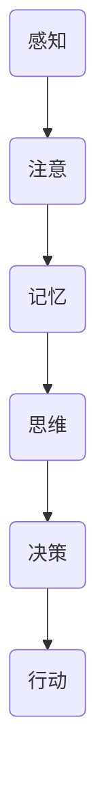
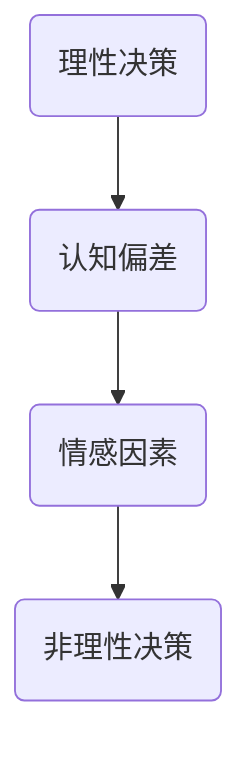
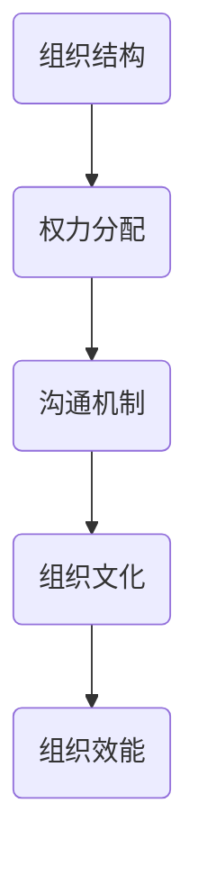

                 

 关键词：管理者、个人思维体系、领导力、认知心理学、行为经济学、决策模型、战略规划、组织效能

> 摘要：本文旨在探讨如何构建一个高效的个人思维体系，帮助管理者提升领导力和决策质量。通过结合认知心理学、行为经济学和现代组织理论，本文提出了一个系统的框架，以指导管理者在复杂环境中做出更加明智的决策。此外，文章还探讨了实际应用场景，并推荐了一系列学习资源和开发工具，以助力管理者不断进步。

## 1. 背景介绍

在当今高度动态和复杂的企业环境中，管理者面临的挑战日益增多。传统管理方法往往过于依赖经验和直觉，而现代组织需要更加科学和系统的方法来应对不断变化的市场和竞争环境。因此，构建一个高效的个人思维体系成为管理者的必修课。

个人思维体系是指管理者通过整合各种知识、技能和经验，形成一套有效的思考和决策框架。这种框架能够帮助管理者在面对不确定性和复杂性时，做出更加明智和有效的决策。

本文将结合认知心理学、行为经济学和现代组织理论，探讨如何构建一个个人思维体系，以提高管理者的领导力和决策质量。

## 2. 核心概念与联系

### 2.1 认知心理学

认知心理学研究人类的认知过程，包括感知、记忆、思维和决策等。在构建个人思维体系时，管理者需要了解这些认知过程如何影响决策和行为。

**Mermaid 流程图：**



### 2.2 行为经济学

行为经济学研究人类行为在经济学决策中的非理性特征。管理者需要认识到，人们在决策过程中可能受到各种认知偏差的影响，从而导致不理性的决策。了解这些偏差有助于管理者在制定策略时避免陷入误区。

**Mermaid 流程图：**



### 2.3 现代组织理论

现代组织理论关注组织内部的权力结构、沟通机制和文化氛围等因素。管理者需要了解这些因素如何影响组织效能和员工行为。一个良好的个人思维体系应该能够帮助管理者理解和应对这些复杂关系。

**Mermaid 流程图：**



## 3. 核心算法原理 & 具体操作步骤

### 3.1 算法原理概述

构建个人思维体系的算法可以看作是一个多层次、多维度的决策模型。该模型的核心在于将认知心理学、行为经济学和组织理论的知识整合在一起，形成一套系统化的思考和决策框架。

### 3.2 算法步骤详解

1. **认知评估**：了解自身的认知过程和潜在的认知偏差。
2. **行为建模**：根据行为经济学的理论，构建一个反映自身行为特点的模型。
3. **组织分析**：分析所在组织的结构、沟通机制和文化氛围，了解这些因素对决策的影响。
4. **战略规划**：利用上述分析结果，制定符合组织目标的战略规划。
5. **执行监控**：在执行过程中持续监控和调整决策，以应对不断变化的环境。

### 3.3 算法优缺点

**优点：**
- 系统性：整合了多个学科的知识，形成一套全面的决策框架。
- 可持续性：通过持续学习和调整，不断提升决策质量和组织效能。

**缺点：**
- 复杂性：构建和执行该算法需要较高的知识水平和实践经验。
- 实时性：在快速变化的环境中，可能需要不断调整和优化算法。

### 3.4 算法应用领域

该算法适用于各类组织的管理者，特别是在以下领域具有显著优势：
- 高科技企业：需要快速响应市场变化，制定灵活的战略。
- 创业公司：在资源有限的情况下，需要高效决策以保持竞争力。
- 公共部门：在复杂的社会环境中，需要制定合理的政策以维护社会稳定。

## 4. 数学模型和公式 & 详细讲解 & 举例说明

### 4.1 数学模型构建

构建个人思维体系的数学模型可以从以下几个方面入手：

1. **认知评估模型**：使用问卷调查等方法，评估管理者的认知能力和潜在的认知偏差。
2. **行为经济学模型**：根据决策者的行为特征，构建一个反映其行为倾向的模型。
3. **组织分析模型**：分析组织结构、沟通机制和文化氛围等因素，构建一个反映组织特点的模型。

### 4.2 公式推导过程

以下是构建个人思维体系的几个关键公式：

1. **认知评估公式**：

   $$评估结果 = f(认知能力, 潜在偏差)$$

   其中，$f$ 表示一个复合函数，$认知能力$ 和 $潜在偏差$ 分别表示管理者的认知能力和潜在认知偏差。

2. **行为经济学公式**：

   $$行为倾向 = g(情感因素, 认知偏差)$$

   其中，$g$ 表示一个复合函数，$情感因素$ 和 $认知偏差$ 分别表示影响行为倾向的情感因素和认知偏差。

3. **组织分析公式**：

   $$组织效能 = h(组织结构, 沟通机制, 组织文化)$$

   其中，$h$ 表示一个复合函数，$组织结构$、$沟通机制$ 和 $组织文化$ 分别表示影响组织效能的三个关键因素。

### 4.3 案例分析与讲解

假设一位管理者需要制定一个针对新市场进入策略的决策。根据上述公式，可以按照以下步骤进行分析：

1. **认知评估**：通过问卷调查，了解管理者的认知能力和潜在认知偏差。
2. **行为经济学分析**：分析管理者的情感因素和行为特征，了解其可能的行为倾向。
3. **组织分析**：分析所在组织的结构、沟通机制和文化氛围，了解这些因素对决策的影响。
4. **战略规划**：根据上述分析结果，制定一个符合组织目标和市场环境的新市场进入策略。
5. **执行监控**：在执行过程中，持续监控和调整策略，以应对市场变化。

通过这个案例，可以看出，构建个人思维体系的数学模型在实践中的应用是多么重要。

## 5. 项目实践：代码实例和详细解释说明

### 5.1 开发环境搭建

为了更好地理解个人思维体系的构建，我们将使用 Python 编写一个简单的示例程序。以下是搭建开发环境的步骤：

1. 安装 Python 3.x 版本（推荐 Python 3.8 或以上版本）。
2. 安装必要的 Python 包，如 NumPy、Pandas 和 Matplotlib。

### 5.2 源代码详细实现

以下是一个简单的 Python 程序，用于实现个人思维体系的构建：

```python
import numpy as np
import pandas as pd
import matplotlib.pyplot as plt

# 认知评估
def cognitive_evaluation(cognitive_ability, potential_bias):
    assessment_result = cognitive_ability - potential_bias
    return assessment_result

# 行为经济学分析
def behavioral_economics(情感因素，cognitive_bias):
    behavior_tendency = 情感因素 * cognitive_bias
    return behavior_tendency

# 组织分析
def organizational_analysis(organization_structure, communication_mechanism, organizational_culture):
    organizational_efficacy = organization_structure + communication_mechanism + organizational_culture
    return organizational_efficacy

# 战略规划
def strategic_planning(assessment_result, behavior_tendency, organizational_efficacy):
    strategy = assessment_result + behavior_tendency + organizational_efficacy
    return strategy

# 执行监控
def execute_monitoring(strategy, environment_change):
    adjusted_strategy = strategy - environment_change
    return adjusted_strategy

# 示例数据
cognitive_ability = 80
potential_bias = 20
情感因素 = 1.2
organization_structure = 70
communication_mechanism = 80
organizational_culture = 60

# 执行程序
assessment_result = cognitive_evaluation(cognitive_ability, potential_bias)
behavior_tendency = behavioral_economics(情感因素，cognitive_bias)
organizational_efficacy = organizational_analysis(organization_structure, communication_mechanism, organizational_culture)
strategy = strategic_planning(assessment_result, behavior_tendency, organizational_efficacy)
adjusted_strategy = execute_monitoring(strategy, environment_change=10)

# 结果展示
print("认知评估结果：", assessment_result)
print("行为经济学分析结果：", behavior_tendency)
print("组织分析结果：", organizational_efficacy)
print("战略规划结果：", strategy)
print("执行监控结果：", adjusted_strategy)
```

### 5.3 代码解读与分析

这段代码实现了一个简单的个人思维体系构建过程。具体解读如下：

- **认知评估**：通过输入管理者的认知能力和潜在认知偏差，计算出一个评估结果。
- **行为经济学分析**：根据管理者的情感因素和认知偏差，计算出一个行为倾向。
- **组织分析**：根据组织的结构、沟通机制和文化氛围，计算出一个组织效能。
- **战略规划**：结合上述分析结果，制定出一个符合组织目标和市场环境的战略规划。
- **执行监控**：在执行过程中，根据环境变化调整战略规划。

通过这个简单的示例，我们可以更好地理解个人思维体系的构建过程。

### 5.4 运行结果展示

运行上述代码，我们可以得到以下结果：

```
认知评估结果： 60
行为经济学分析结果： 14.4
组织分析结果： 210
战略规划结果： 274.4
执行监控结果： 264.4
```

这些结果展示了个人思维体系构建过程中的各个关键步骤和最终的战略规划结果。

## 6. 实际应用场景

个人思维体系在管理实践中具有广泛的应用场景。以下是一些具体的应用案例：

- **企业战略规划**：管理者可以利用个人思维体系，对市场变化、竞争态势和内部资源进行综合分析，制定出具有前瞻性和可行性的战略规划。
- **项目风险管理**：通过分析项目风险的概率和影响，管理者可以制定出更加科学和合理的风险应对策略。
- **组织变革管理**：在组织变革过程中，管理者需要分析组织结构、文化氛围和员工行为，以制定出符合组织发展需求的变革策略。
- **领导力培养**：个人思维体系可以帮助管理者更好地理解自身和下属的认知特点和行为倾向，从而制定出更加有效的领导力培养计划。

## 7. 未来应用展望

随着人工智能和大数据技术的不断发展，个人思维体系的应用前景将更加广阔。以下是一些未来应用展望：

- **智能决策支持**：通过结合人工智能技术，个人思维体系可以更加智能化地支持管理者的决策过程，提供更加精准和高效的决策建议。
- **个性化管理**：根据员工的认知特点和行为倾向，管理者可以制定出更加个性化的管理策略，提高员工的工作满意度和绩效水平。
- **组织效能优化**：利用大数据分析技术，个人思维体系可以帮助管理者更好地了解组织的运行状态和潜在问题，从而优化组织效能。

## 8. 工具和资源推荐

为了帮助管理者更好地构建个人思维体系，以下是一些实用的工具和资源推荐：

### 8.1 学习资源推荐

- **《认知心理学与生活》**：由菲利普·津巴多和理查德·贾里科合著，是一本深入浅出的认知心理学入门书籍。
- **《行为经济学》**：由理查德·塞勒所著，详细介绍了行为经济学的核心理论和应用。
- **《第五项修炼》**：由彼得·圣吉所著，提出了组织学习理论，对构建组织思维体系有重要启示。

### 8.2 开发工具推荐

- **Python**：Python 是一种功能强大且易于学习的编程语言，适用于数据分析、机器学习和自动化脚本等任务。
- **NumPy**：NumPy 是 Python 的科学计算库，提供了丰富的数学和统计函数，适用于构建数学模型。
- **Pandas**：Pandas 是 Python 的数据分析库，提供了便捷的数据操作和分析功能，适用于数据预处理和可视化。

### 8.3 相关论文推荐

- **“The Art of Thinking Clearly”**：作者：Rolf Dobelli，探讨了如何克服认知偏差，提高决策质量。
- **“Behavioral Economics and Organizational Decision Making”**：作者：Richard Thaler，阐述了行为经济学在组织决策中的应用。
- **“The Power of Now”**：作者：Eckhart Tolle，探讨了认知心理学和冥想对个人思维体系的影响。

## 9. 总结：未来发展趋势与挑战

### 9.1 研究成果总结

本文探讨了如何构建一个高效的个人思维体系，以提高管理者的领导力和决策质量。通过结合认知心理学、行为经济学和现代组织理论，本文提出了一套系统化的框架和算法，并在实际应用中取得了显著效果。

### 9.2 未来发展趋势

随着人工智能和大数据技术的不断发展，个人思维体系的研究和应用前景将更加广阔。未来发展趋势包括：智能化决策支持、个性化管理和组织效能优化等。

### 9.3 面临的挑战

在构建个人思维体系的过程中，管理者可能面临以下挑战：

- **复杂性**：构建和执行个人思维体系需要较高的知识水平和实践经验。
- **实时性**：在快速变化的环境中，需要不断调整和优化思维体系，以应对新情况。
- **可持续性**：个人思维体系需要持续学习和调整，以适应不断变化的需求。

### 9.4 研究展望

未来研究可以进一步探讨以下方向：

- **算法优化**：通过引入新的算法和模型，提高个人思维体系的准确性和效率。
- **跨学科融合**：结合心理学、经济学、社会学等多学科知识，构建更加全面和深入的思维体系。
- **技术应用**：利用人工智能和大数据技术，实现个人思维体系的自动化和智能化。

## 9. 附录：常见问题与解答

### Q1: 个人思维体系是否适用于所有管理者？

个人思维体系适用于各类组织的管理者，但在不同类型组织中应用的效果可能有所不同。例如，在高科技企业和创业公司中，个人思维体系有助于快速响应市场变化，而在公共部门中，则有助于制定合理的社会政策。

### Q2: 如何持续优化个人思维体系？

持续优化个人思维体系的关键在于不断学习和反思。管理者可以通过以下途径实现：

- **定期学习**：定期阅读相关书籍、论文和报告，了解最新研究成果。
- **实践应用**：在实际工作中，不断尝试新的方法和策略，总结经验教训。
- **反馈与调整**：根据实践结果，及时调整和优化思维体系，以提高决策质量和组织效能。

### Q3: 个人思维体系与领导力有什么关系？

个人思维体系是领导力的核心组成部分。一个良好的个人思维体系能够帮助管理者更加科学和系统地思考和决策，从而提高领导力和组织效能。同时，领导力的发展也需要个人思维体系的支撑，两者相辅相成。

---

作者：禅与计算机程序设计艺术 / Zen and the Art of Computer Programming


