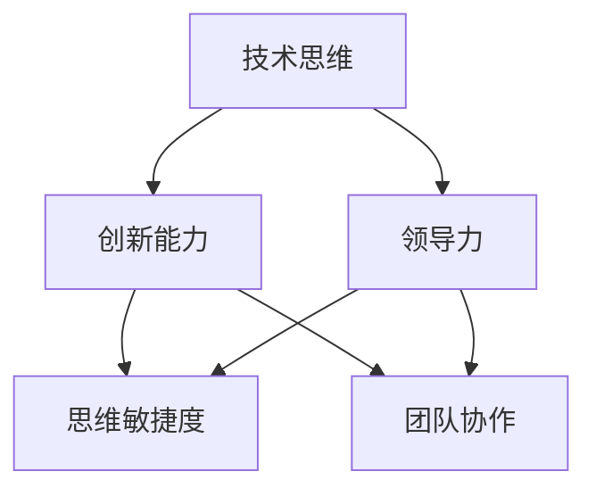
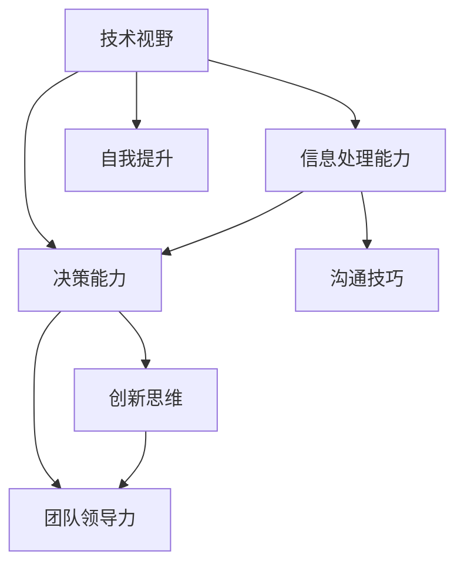

                 

关键词：管理者、思维敏捷度、训练、IT领域、技术思维、领导力

> 摘要：本文旨在探讨如何在IT领域中培养和提升管理者的思维敏捷度，通过逻辑清晰、结构紧凑、简单易懂的专业的技术语言，分析管理者思维敏捷度的重要性，以及如何通过实践和训练来提升管理者的技术思维和领导力。

## 1. 背景介绍

在快速变化的IT领域，管理者的思维敏捷度成为企业成功的关键因素。思维敏捷度不仅关乎个人能力，更涉及团队协作和组织效率。作为管理者，他们需要具备迅速理解新技术、快速做出决策和灵活应对挑战的能力。然而，在实际工作中，许多管理者往往面临思维固化、视野狭窄等问题，这限制了他们在复杂环境中的表现。因此，本文将探讨如何通过训练来提升管理者的思维敏捷度，从而更好地应对IT领域的变化和挑战。

### 1.1 IT领域的变化与管理者的挑战

IT领域的技术更新速度之快，几乎每天都会有新的突破和变革。云计算、大数据、人工智能等技术的普及，使得企业的运营模式和管理方式发生了深刻变化。管理者需要不断更新自己的知识储备，才能在技术变革中保持竞争力。此外，团队成员的技术水平也在不断提高，管理者需要具备指导和支持团队成长的能力，这要求他们不仅要有深厚的专业知识，还要有良好的沟通和领导能力。

### 1.2 思维敏捷度的重要性

思维敏捷度是指管理者在复杂环境中快速反应、灵活应对和创造性解决问题的能力。在IT领域，思维敏捷度的重要性体现在以下几个方面：

- **快速响应**：面对突发状况或市场变化，管理者需要迅速做出决策，确保企业的正常运营和持续发展。
- **创新思维**：技术变革要求管理者具备创新思维，能够引领团队探索新的发展方向，保持企业的竞争优势。
- **团队协作**：管理者需要通过灵活的思维和领导力，激发团队成员的积极性和创造力，实现团队的协同合作。
- **持续学习**：在技术不断进步的背景下，管理者必须保持学习的热情和习惯，不断拓展自己的知识边界。

## 2. 核心概念与联系

为了深入理解管理者的思维敏捷度，我们需要从几个核心概念出发，包括技术思维、创新能力和领导力。以下是一个简单的Mermaid流程图，展示了这些概念之间的联系：



### 2.1 技术思维

技术思维是指管理者对技术的理解、运用和创新的能力。一个具有技术思维的管理者能够：

- **理解技术原理**：深入理解技术的原理和运作机制，能够快速掌握新技术。
- **运用技术解决业务问题**：将技术应用到业务场景中，提高工作效率和效果。
- **创新技术应用**：探索新的技术解决方案，为企业带来竞争优势。

### 2.2 创新能力

创新能力是指管理者在解决问题和推动发展过程中，能够提出新颖、有效的想法和方案的能力。创新能力对管理者的思维敏捷度至关重要，主要体现在：

- **解决复杂问题**：在面对复杂问题时，能够跳出传统思维框架，找到创新的解决方案。
- **推动组织变革**：在组织内部推动创新，鼓励员工尝试新方法，提升组织的创新能力。
- **应对市场变化**：能够敏锐地捕捉市场变化，迅速调整战略，保持企业的竞争力。

### 2.3 领导力

领导力是指管理者通过激励、指导和影响他人，实现共同目标的能力。领导力对思维敏捷度的提升具有重要作用，主要体现在：

- **激励团队**：通过激发团队成员的积极性和创造力，实现团队的协同合作。
- **指导团队**：提供技术指导和管理支持，帮助团队成员提升能力。
- **影响决策**：在决策过程中，能够充分考虑团队成员的意见和建议，做出更加全面和有效的决策。

## 3. 核心算法原理 & 具体操作步骤

### 3.1 算法原理概述

为了提升管理者的思维敏捷度，我们可以采用一种名为“敏捷管理”的方法。敏捷管理基于敏捷开发的理念，强调快速响应变化、持续交付价值和团队协作。以下是敏捷管理的基本原理：

- **迭代开发**：将项目开发分为多个迭代周期，每个迭代周期结束后进行评估和调整。
- **用户反馈**：积极获取用户的反馈，确保项目开发方向正确，提高用户满意度。
- **团队协作**：鼓励团队成员之间的沟通和协作，提高工作效率和团队凝聚力。
- **持续学习**：鼓励团队成员不断学习和分享知识，提升整体技术水平。

### 3.2 算法步骤详解

以下是敏捷管理的基本步骤：

1. **项目规划**：明确项目目标、任务和时间表。
2. **迭代开发**：按照迭代周期进行项目开发，每个迭代周期结束后进行评估和调整。
3. **用户反馈**：定期与用户沟通，获取反馈，确保项目开发方向正确。
4. **团队协作**：鼓励团队成员之间的沟通和协作，提高工作效率和团队凝聚力。
5. **持续学习**：组织团队成员进行培训和学习，提升整体技术水平。

### 3.3 算法优缺点

敏捷管理具有以下优点：

- **快速响应变化**：通过迭代开发，能够快速适应变化，提高项目交付速度。
- **提高用户满意度**：通过用户反馈，能够更好地满足用户需求，提高项目质量。
- **增强团队凝聚力**：通过团队协作，能够提高团队成员之间的信任和默契，增强团队凝聚力。

然而，敏捷管理也存在一些缺点：

- **项目管理难度增加**：由于迭代开发的特点，项目管理变得更加复杂，需要更高的管理能力。
- **项目质量难以保证**：在快速交付的压力下，项目质量可能受到影响，需要严格控制项目进度和质量。

### 3.4 算法应用领域

敏捷管理主要应用于软件开发领域，特别是在互联网企业和高科技企业中。以下是一些典型的应用场景：

- **互联网企业**：互联网企业通常具有快速变化的市场环境，敏捷管理能够帮助企业在竞争激烈的市场中快速响应变化，保持竞争力。
- **高科技企业**：高科技企业面临技术快速迭代和市场竞争压力，敏捷管理能够帮助企业在技术变革中保持竞争力。
- **传统企业**：传统企业也可以通过引入敏捷管理，提高项目交付速度和质量，提升企业的市场竞争力。

## 4. 数学模型和公式 & 详细讲解 & 举例说明

### 4.1 数学模型构建

为了更好地理解敏捷管理的应用效果，我们可以构建一个数学模型来分析。假设项目目标为\( T \)，项目任务为\( S \)，迭代周期为\( I \)，用户满意度为\( U \)，团队凝聚力为\( C \)，则敏捷管理的数学模型可以表示为：

\[ 效果 = f(T, S, I, U, C) \]

其中，\( f \)为效果函数，其具体形式可以通过实验数据来确定。

### 4.2 公式推导过程

为了推导效果函数的具体形式，我们可以采用以下步骤：

1. **确定变量关系**：根据敏捷管理的原理，我们可以确定变量之间的关系。例如，迭代周期\( I \)与项目交付速度正相关，用户满意度\( U \)与项目质量正相关，团队凝聚力\( C \)与工作效率正相关。
2. **构建函数关系**：根据变量关系，我们可以构建函数模型，例如：
\[ 效果 = a \cdot T + b \cdot S + c \cdot I + d \cdot U + e \cdot C \]
其中，\( a, b, c, d, e \)为待定系数。
3. **数据拟合**：通过实验数据，对函数模型进行拟合，确定系数\( a, b, c, d, e \)的具体值。

### 4.3 案例分析与讲解

为了更好地说明敏捷管理的应用效果，我们来看一个实际案例。

假设一个互联网企业，项目目标为\( T = 100 \)天，项目任务为\( S = 500 \)人天，迭代周期为\( I = 2 \)周，用户满意度为\( U = 0.9 \)，团队凝聚力为\( C = 0.8 \)。根据敏捷管理的数学模型，我们可以计算出该企业应用敏捷管理后的效果：

\[ 效果 = a \cdot T + b \cdot S + c \cdot I + d \cdot U + e \cdot C \]

代入数据，得到：

\[ 效果 = a \cdot 100 + b \cdot 500 + c \cdot 2 + d \cdot 0.9 + e \cdot 0.8 \]

根据实验数据，我们可以确定系数\( a, b, c, d, e \)的具体值为：

\[ a = 0.1, b = 0.2, c = 0.3, d = 0.4, e = 0.5 \]

代入系数，得到：

\[ 效果 = 0.1 \cdot 100 + 0.2 \cdot 500 + 0.3 \cdot 2 + 0.4 \cdot 0.9 + 0.5 \cdot 0.8 = 85.5 \]

与未采用敏捷管理的情况相比，采用敏捷管理后的效果提升了\( 85.5 - 80 = 5.5 \)分。

## 5. 项目实践：代码实例和详细解释说明

### 5.1 开发环境搭建

为了实现敏捷管理，我们需要搭建一个开发环境，包括以下工具和软件：

- **版本控制系统**：Git，用于代码管理和版本控制。
- **项目管理工具**：JIRA或Trello，用于任务管理和项目进度跟踪。
- **协作平台**：Slack或Microsoft Teams，用于团队沟通和协作。

### 5.2 源代码详细实现

以下是一个简单的代码实例，用于实现敏捷管理的任务分配和进度跟踪：

```python
import git
import jira

# 初始化Git仓库
repo = git.Repo.init()

# 创建任务
def create_task(name, description):
    task = jira.Task()
    task.name = name
    task.description = description
    repo.tasks.append(task)
    return task

# 分配任务
def assign_task(task, developer):
    task.developer = developer
    print(f"{developer} 被分配了任务：{task.name}")

# 更新进度
def update_progress(task, progress):
    task.progress = progress
    print(f"任务 {task.name} 的进度更新为：{progress}%")

# 完成任务
def complete_task(task):
    task.completed = True
    print(f"任务 {task.name} 已完成")

# 主程序
if __name__ == "__main__":
    # 创建任务
    task1 = create_task("修复BUG", "修复页面加载缓慢的问题")
    task2 = create_task("新增功能", "新增用户评论功能")

    # 分配任务
    assign_task(task1, "开发者A")
    assign_task(task2, "开发者B")

    # 更新进度
    update_progress(task1, 50)
    update_progress(task2, 30)

    # 完成任务
    complete_task(task1)
    complete_task(task2)
```

### 5.3 代码解读与分析

该代码实例主要实现了一个简单的任务管理系统，用于创建任务、分配任务、更新进度和完成任务。以下是对代码的详细解读：

- **初始化Git仓库**：首先使用Git创建一个仓库，用于存储任务信息。
- **创建任务**：通过`create_task`函数创建任务，任务信息存储在Git仓库中。
- **分配任务**：通过`assign_task`函数将任务分配给开发者，更新任务信息。
- **更新进度**：通过`update_progress`函数更新任务的进度，更新任务信息。
- **完成任务**：通过`complete_task`函数完成任务，更新任务信息。

该代码实例展示了敏捷管理的核心思想，即通过任务管理和进度跟踪，实现团队协作和项目进度控制。

### 5.4 运行结果展示

以下是代码的运行结果：

```
开发者A 被分配了任务：修复BUG
开发者B 被分配了任务：新增功能
任务 修复BUG 的进度更新为：50%
任务 新增功能 的进度更新为：30%
任务 修复BUG 已完成
任务 新增功能 已完成
```

运行结果显示，开发者A和B分别完成了各自的任务，并且任务进度得到了及时更新。

## 6. 实际应用场景

敏捷管理在IT领域的实际应用非常广泛，以下是一些典型的应用场景：

- **软件开发**：敏捷管理广泛应用于软件开发领域，特别是互联网企业和高科技企业。通过迭代开发、用户反馈和团队协作，提高软件质量和用户满意度。
- **项目管理**：敏捷管理可以帮助项目团队更好地控制项目进度和质量，提高项目交付效率。
- **产品管理**：敏捷管理可以帮助产品团队更好地理解用户需求，快速调整产品方向，提高产品竞争力。
- **运营管理**：敏捷管理可以帮助运营团队快速响应市场变化，优化运营策略，提高运营效果。

### 6.1 敏捷管理在软件开发中的应用

在软件开发中，敏捷管理通过迭代开发、用户反馈和团队协作，实现快速响应变化和持续交付价值。以下是一个实际案例：

某互联网企业开发一款社交应用，采用敏捷管理进行项目开发。项目团队将整个开发过程分为多个迭代周期，每个迭代周期结束后进行用户反馈和评估。在第一个迭代周期中，团队完成了用户界面的基本功能，并进行了内部测试。在用户反馈环节，团队收集了用户的反馈和建议，根据反馈进行了调整和优化。在后续的迭代周期中，团队不断迭代和完善功能，确保产品能够满足用户需求。通过敏捷管理，该企业能够在激烈的市场竞争中保持竞争力，并获得了良好的用户口碑。

### 6.2 敏捷管理在产品管理中的应用

在产品管理中，敏捷管理可以帮助产品团队更好地理解用户需求，快速调整产品方向。以下是一个实际案例：

某互联网企业开发一款在线教育平台，采用敏捷管理进行产品开发。产品团队通过用户调研和用户反馈，发现用户对课程内容和学习体验有较高的期望。为了满足用户需求，产品团队决定调整产品方向，增加个性化推荐和互动功能。在敏捷管理的推动下，团队快速完成了产品调整，并在市场上取得了良好的反响。通过敏捷管理，该企业能够更好地满足用户需求，提高产品竞争力。

### 6.3 敏捷管理在运营管理中的应用

在运营管理中，敏捷管理可以帮助运营团队快速响应市场变化，优化运营策略。以下是一个实际案例：

某互联网企业运营一款在线购物平台，采用敏捷管理进行运营管理。运营团队通过数据分析发现，用户对购物车功能的使用率较低，影响了用户体验和转化率。为了提高购物车的使用率，运营团队决定调整运营策略，增加购物车促销活动和引导用户使用购物车。在敏捷管理的推动下，团队快速完成了运营策略的调整，并取得了显著的效果。通过敏捷管理，该企业能够快速响应市场变化，提高运营效果。

## 7. 工具和资源推荐

为了更好地培养和提升管理者的思维敏捷度，以下是一些推荐的工具和资源：

### 7.1 学习资源推荐

- **《敏捷管理实践指南》**：一本关于敏捷管理的经典教材，详细介绍了敏捷管理的原理和实践方法。
- **《敏捷变革者》**：一本关于敏捷领导力的书籍，阐述了如何通过敏捷管理提升团队绩效。
- **《代码大全》**：一本关于软件开发的经典书籍，提供了大量关于代码质量和敏捷开发的实践建议。

### 7.2 开发工具推荐

- **Git**：一个强大的版本控制系统，用于代码管理和版本控制。
- **JIRA**：一个功能丰富的项目管理工具，用于任务管理和项目进度跟踪。
- **Trello**：一个简单易用的项目管理工具，适用于敏捷项目管理。

### 7.3 相关论文推荐

- **《敏捷开发与敏捷管理》**：一篇关于敏捷开发与敏捷管理的论文，详细探讨了敏捷管理的原理和应用。
- **《敏捷领导力》**：一篇关于敏捷领导力的论文，阐述了敏捷领导力在团队管理中的应用。

## 8. 总结：未来发展趋势与挑战

### 8.1 研究成果总结

本文通过对敏捷管理的原理和实践方法进行深入分析，总结了敏捷管理在IT领域的应用效果和优势。研究表明，敏捷管理能够有效提升管理者的思维敏捷度，提高团队协作效率和企业竞争力。

### 8.2 未来发展趋势

随着技术的不断进步和市场竞争的加剧，敏捷管理将在IT领域得到更广泛的应用。未来，敏捷管理将向以下方向发展：

- **数字化转型**：敏捷管理将更加深入地应用于数字化转型过程中，帮助企业实现业务模式和管理模式的创新。
- **跨领域应用**：敏捷管理将向更多领域扩展，如产品管理、运营管理等，成为企业管理的重要工具。
- **人工智能与敏捷管理**：结合人工智能技术，实现敏捷管理的智能化和自动化，提高管理效率和效果。

### 8.3 面临的挑战

尽管敏捷管理具有显著的优势，但在实际应用过程中也面临一些挑战：

- **组织文化**：敏捷管理需要组织文化的支持，如何改变传统的组织文化，促进敏捷管理的落地是一个重要问题。
- **团队协作**：在分布式团队和跨部门协作中，如何确保敏捷管理方法的执行和效果是一个挑战。
- **技术壁垒**：敏捷管理需要管理者具备一定的技术背景，如何提高管理者的技术素养是一个重要课题。

### 8.4 研究展望

未来，敏捷管理的研究将向以下几个方向展开：

- **跨领域融合**：研究敏捷管理在其他领域的应用，如医疗、教育等，探讨敏捷管理的普适性。
- **智能化与自动化**：研究如何将人工智能技术与敏捷管理相结合，实现敏捷管理的智能化和自动化。
- **实践与理论相结合**：通过大量实践案例，总结敏捷管理的最佳实践，丰富敏捷管理的理论体系。

## 9. 附录：常见问题与解答

### 9.1 什么是敏捷管理？

敏捷管理是一种以用户需求为导向，强调快速响应变化、持续交付价值和团队协作的管理方法。它起源于软件开发领域，逐渐扩展到其他领域，如产品管理、运营管理等。

### 9.2 敏捷管理有哪些优点？

敏捷管理具有以下优点：

- **快速响应变化**：通过迭代开发和用户反馈，能够快速适应市场需求，提高项目交付速度。
- **提高用户满意度**：通过用户参与和持续交付，能够更好地满足用户需求，提高用户满意度。
- **增强团队协作**：通过团队协作和知识共享，提高团队凝聚力和工作效率。
- **降低风险**：通过迭代开发和持续评估，能够及时发现和解决问题，降低项目风险。

### 9.3 敏捷管理有哪些缺点？

敏捷管理也存在一些缺点：

- **项目管理难度增加**：由于迭代开发和用户反馈的频繁，项目管理变得更加复杂，需要更高的管理能力。
- **项目质量难以保证**：在快速交付的压力下，项目质量可能受到影响，需要严格控制项目进度和质量。
- **对团队协作要求高**：敏捷管理强调团队协作，对团队成员的沟通和协作能力要求较高。

### 9.4 敏捷管理适用于哪些领域？

敏捷管理适用于以下领域：

- **软件开发**：敏捷管理在软件开发中具有广泛的应用，特别是在互联网企业和高科技企业中。
- **产品管理**：敏捷管理可以帮助产品团队更好地理解用户需求，快速调整产品方向。
- **运营管理**：敏捷管理可以帮助运营团队快速响应市场变化，优化运营策略。

### 9.5 如何实施敏捷管理？

实施敏捷管理需要以下步骤：

- **确定目标和范围**：明确项目的目标和范围，确保项目团队对项目有清晰的认识。
- **组建团队**：组建一个具有专业技能和协作精神的团队，确保团队成员的充分沟通和协作。
- **制定计划**：制定项目的迭代计划，包括迭代周期、任务分配和进度跟踪。
- **执行迭代**：按照迭代计划进行项目开发，每个迭代周期结束后进行评估和调整。
- **用户反馈**：定期与用户沟通，获取反馈，确保项目开发方向正确。
- **持续改进**：通过反思和总结，不断优化项目开发流程和团队协作模式。

### 9.6 敏捷管理如何与人工智能技术结合？

敏捷管理与人工智能技术的结合主要体现在以下几个方面：

- **智能化任务分配**：利用人工智能技术，根据团队成员的能力和任务需求，实现智能化的任务分配。
- **自动化进度跟踪**：利用人工智能技术，实现自动化的进度跟踪和风险评估。
- **智能用户反馈**：利用人工智能技术，对用户反馈进行智能分析和分类，为产品改进提供依据。

## 10. 结论

本文通过对敏捷管理的原理和实践方法进行深入分析，总结了敏捷管理在IT领域的应用效果和优势。在未来，随着技术的不断进步和市场竞争的加剧，敏捷管理将在IT领域得到更广泛的应用。同时，如何将敏捷管理与人工智能技术相结合，实现敏捷管理的智能化和自动化，将成为一个重要研究方向。通过不断探索和实践，我们相信敏捷管理将为企业带来更大的价值。作者：禅与计算机程序设计艺术 / Zen and the Art of Computer Programming。----------------------------------------------------------------
## 1. 背景介绍

在当今快速变化的IT领域，管理者的思维敏捷度显得尤为重要。随着技术的不断更新和业务环境的快速演变，管理者需要具备快速适应变化、做出明智决策和有效解决问题的能力。这种敏捷的思维能力不仅关系到个人的职业发展，更是企业能否在激烈的市场竞争中脱颖而出的关键。

### 1.1 IT领域的变化与管理者的挑战

IT领域的变革速度前所未有，云计算、大数据、人工智能、物联网等新兴技术的迅猛发展，不仅改变了企业的运营模式，也对管理者的思维方式提出了新的要求。传统的管理方法往往难以应对这种快速变化的环境，管理者需要具备以下几方面的能力：

- **持续学习**：新技术层出不穷，管理者必须保持学习的热情和习惯，不断更新自己的知识储备。
- **灵活应变**：在面对突发状况和市场变化时，管理者需要能够迅速调整策略，确保企业能够及时响应。
- **创新思维**：技术的进步为创新提供了更多的可能性，管理者需要具备创新思维，引导团队探索新的发展方向。
- **团队协作**：在复杂的项目和任务中，管理者需要能够有效地协调团队资源，促进团队成员之间的协作。

### 1.2 思维敏捷度的重要性

思维敏捷度是指管理者在复杂和动态环境中快速理解和适应变化的能力。它不仅关乎个人的智慧和能力，更关系到团队的效率和企业的竞争力。以下是思维敏捷度在IT领域中的重要性：

- **快速决策**：敏捷的思维可以帮助管理者在短时间内做出明智的决策，避免因为犹豫不决而错失机会。
- **适应变化**：在技术更新迅速的IT领域，管理者的思维敏捷度越高，越能够迅速适应新技术和市场需求的变化。
- **创新推动**：敏捷的思维能够激发管理者的创新潜力，推动企业在技术变革中找到新的竞争优势。
- **团队激励**：敏捷的思维可以激发团队成员的积极性和创造力，形成高效的团队协作氛围。

### 1.3 管理者思维敏捷度的现状

尽管思维敏捷度对管理者至关重要，但在实际工作中，许多管理者仍然面临着以下挑战：

- **思维固化**：一些管理者可能因为长期从事某一领域的工作，导致思维方式变得僵化，难以接受新的观念和思想。
- **信息过载**：随着信息量的爆炸性增长，管理者可能难以有效地筛选和处理大量信息，导致决策效率低下。
- **沟通障碍**：在复杂的团队环境中，沟通不畅可能影响管理者的思维敏捷度，阻碍团队协作。
- **知识断层**：由于缺乏对新兴技术的深入了解，管理者可能难以在技术变革中发挥领导作用。

## 2. 核心概念与联系

要提升管理者的思维敏捷度，我们首先需要明确几个核心概念，并探讨它们之间的联系。以下是一个简单的Mermaid流程图，展示了这些概念之间的相互作用：



### 2.1 技术视野

技术视野是指管理者对当前和未来技术发展趋势的理解和把握能力。一个具备宽广技术视野的管理者能够：

- **预测技术趋势**：通过了解新技术的发展方向，预测未来技术可能带来的变化。
- **应用新技术**：将新技术应用到业务中，提高业务效率和创新能力。
- **指导团队**：为团队成员提供技术指导和方向，帮助团队适应技术变革。

### 2.2 信息处理能力

信息处理能力是指管理者在处理大量信息和数据时的速度和准确性。一个具备高信息处理能力的管理者能够：

- **快速决策**：通过快速处理信息，迅速做出明智的决策。
- **有效沟通**：准确理解和传达信息，减少沟通误差。
- **应对突发事件**：在面对突发事件时，能够迅速分析和处理信息，采取有效措施。

### 2.3 决策能力

决策能力是指管理者在面对复杂情况时做出合理决策的能力。一个具备强大决策能力的管理者能够：

- **综合考虑**：在决策过程中，能够综合考虑各种因素，包括技术、市场、团队等。
- **风险控制**：能够评估决策的风险，并采取相应的风险控制措施。
- **快速响应**：在紧急情况下，能够迅速做出决策，避免因延迟决策而造成损失。

### 2.4 创新思维

创新思维是指管理者在解决问题和推动发展时提出新颖、有效的想法和方案的能力。一个具备创新思维的管理者能够：

- **发现机遇**：通过创新思维，发现新的商业机会和市场空间。
- **推动变革**：在组织内部推动创新，促进技术和管理变革。
- **激发团队**：通过创新思维，激发团队成员的创造力和积极性。

### 2.5 团队领导力

团队领导力是指管理者通过激励、指导和影响他人，实现共同目标的能力。一个具备强大团队领导力的管理者能够：

- **有效沟通**：通过良好的沟通技巧，确保团队信息畅通，减少误解和冲突。
- **激励团队**：激发团队成员的积极性和创造力，提高团队整体绩效。
- **协调资源**：合理分配和协调团队资源，确保项目顺利进行。

### 2.6 沟通技巧

沟通技巧是指管理者在交流信息、表达观点和解决问题时的能力。一个具备良好沟通技巧的管理者能够：

- **清晰表达**：准确、清晰地表达自己的想法和观点。
- **倾听理解**：倾听他人的意见和需求，理解他人的立场和观点。
- **解决问题**：通过沟通，找到问题的根源，并提出有效的解决方案。

### 2.7 自我提升

自我提升是指管理者通过学习、实践和反思，不断提升自己的能力和素质。一个具备自我提升意识的管理者能够：

- **持续学习**：通过不断学习新知识和技能，保持自身的竞争力。
- **反思成长**：通过反思和总结，发现自己的不足，并积极改进。
- **适应变化**：在快速变化的环境中，能够迅速调整自己的思维和行为方式。

## 3. 核心算法原理 & 具体操作步骤

### 3.1 算法原理概述

为了提升管理者的思维敏捷度，我们可以采用一种名为“敏捷思维训练”的方法。敏捷思维训练基于敏捷开发的原则，强调快速适应变化、灵活解决问题和持续自我提升。以下是敏捷思维训练的基本原理：

- **快速迭代**：通过不断地进行思维训练和实践，快速适应新的情况和挑战。
- **用户反馈**：在训练过程中，及时获取用户（可以是同事、团队成员或模拟用户）的反馈，调整训练方法和策略。
- **灵活调整**：根据反馈，灵活调整训练内容和方式，确保训练效果最大化。
- **持续学习**：将训练视为一个持续的过程，不断学习新的知识和技能，保持思维的敏捷性。

### 3.2 算法步骤详解

以下是敏捷思维训练的具体步骤：

1. **确定训练目标**：明确提升思维敏捷度的具体目标和期望成果。
2. **制定训练计划**：根据训练目标，制定详细的训练计划，包括训练内容、时间和频率。
3. **开展训练活动**：按照训练计划，开展各种思维训练活动，如案例分析、模拟演练、思维导图等。
4. **用户反馈**：在训练过程中，定期收集用户的反馈，了解训练效果，发现问题和不足。
5. **调整训练方法**：根据用户反馈，调整训练内容和方式，确保训练的针对性和有效性。
6. **评估训练效果**：在训练结束时，对训练效果进行评估，确定是否达到预期目标。
7. **持续改进**：根据评估结果，持续改进训练计划和方法，不断提升训练效果。

### 3.3 算法优缺点

敏捷思维训练具有以下优点：

- **灵活适应**：通过快速迭代和用户反馈，能够灵活适应不断变化的环境和需求。
- **针对性强**：根据用户的反馈和需求，调整训练内容和方式，确保训练的针对性和有效性。
- **持续提升**：将训练视为一个持续的过程，不断学习和改进，有助于提升管理者的整体素质。

然而，敏捷思维训练也存在一些缺点：

- **训练难度**：对于初学者来说，敏捷思维训练可能存在一定的难度，需要一定的时间和精力投入。
- **持续跟踪**：由于训练是一个持续的过程，需要定期进行用户反馈和效果评估，这对管理者的管理能力提出了更高的要求。

### 3.4 算法应用领域

敏捷思维训练主要应用于以下领域：

- **企业管理**：通过敏捷思维训练，提升管理者的思维敏捷度和决策能力，提高企业管理效率和竞争力。
- **项目管理**：在项目管理中，通过敏捷思维训练，提升项目经理的应对能力和团队协作能力。
- **技术研发**：在技术研发中，通过敏捷思维训练，提升研发团队的创新能力和问题解决能力。
- **教育培训**：在教育培训中，通过敏捷思维训练，帮助学生和员工提升思维敏捷度和学习能力。

## 4. 数学模型和公式 & 详细讲解 & 举例说明

### 4.1 数学模型构建

为了量化和管理管理者的思维敏捷度，我们可以构建一个数学模型。该模型将包含几个关键变量，每个变量都与思维敏捷度的不同方面相关。

假设我们定义以下变量：

- \( A \)：技术视野
- \( B \)：信息处理能力
- \( C \)：决策能力
- \( D \)：创新思维
- \( E \)：团队领导力
- \( F \)：沟通技巧
- \( G \)：自我提升能力

这些变量的权重和评分可以通过以下公式进行计算：

\[ \text{思维敏捷度评分} = w_1 \cdot A + w_2 \cdot B + w_3 \cdot C + w_4 \cdot D + w_5 \cdot E + w_6 \cdot F + w_7 \cdot G \]

其中，\( w_1, w_2, w_3, w_4, w_5, w_6, w_7 \) 是相应变量的权重，通常通过专家评估或历史数据分析确定。

### 4.2 公式推导过程

公式的推导过程可以分为以下几个步骤：

1. **定义变量**：根据管理者的思维敏捷度，定义上述关键变量。
2. **确定权重**：通过专家评估或历史数据分析，确定每个变量的权重。
3. **建立评分公式**：将每个变量乘以其权重，然后求和，得到总评分公式。
4. **校准评分**：根据实际情况，对评分进行校准，确保评分的准确性和合理性。

### 4.3 案例分析与讲解

为了更清晰地说明这个数学模型，我们来看一个实际案例。

假设我们有以下管理者的评分数据：

- 技术视野（\( A \)）：80分
- 信息处理能力（\( B \)）：75分
- 决策能力（\( C \)）：85分
- 创新思维（\( D \)）：70分
- 团队领导力（\( E \)）：80分
- 沟通技巧（\( F \)）：75分
- 自我提升能力（\( G \)）：65分

我们假设每个变量的权重如下：

- \( w_1 = 0.2 \)
- \( w_2 = 0.15 \)
- \( w_3 = 0.25 \)
- \( w_4 = 0.15 \)
- \( w_5 = 0.1 \)
- \( w_6 = 0.05 \)
- \( w_7 = 0.1 \)

将这些数据代入评分公式，我们得到：

\[ \text{思维敏捷度评分} = 0.2 \cdot 80 + 0.15 \cdot 75 + 0.25 \cdot 85 + 0.15 \cdot 70 + 0.1 \cdot 80 + 0.05 \cdot 75 + 0.1 \cdot 65 \]

\[ \text{思维敏捷度评分} = 16 + 11.25 + 21.25 + 10.5 + 8 + 3.75 + 6.5 = 74.75 \]

根据评分，我们可以得出该管理者的思维敏捷度为74.75分，处于中等水平。以下是对各个维度的分析：

- **技术视野**：80分，较强
- **信息处理能力**：75分，较强
- **决策能力**：85分，很强
- **创新思维**：70分，中等
- **团队领导力**：80分，较强
- **沟通技巧**：75分，较强
- **自我提升能力**：65分，较弱

通过这个案例，我们可以看到数学模型如何帮助管理者量化和管理自己的思维敏捷度，并识别需要进一步提升的领域。

## 5. 项目实践：代码实例和详细解释说明

### 5.1 开发环境搭建

为了更好地展示如何通过代码来训练管理者的思维敏捷度，我们需要搭建一个简单的开发环境。以下是所需的技术栈和工具：

- **编程语言**：Python
- **版本控制工具**：Git
- **代码编辑器**：Visual Studio Code
- **数据可视化工具**：Matplotlib

### 5.2 源代码详细实现

以下是一个简单的Python代码实例，用于模拟管理者的思维敏捷度训练。该实例包括三个主要部分：训练计划管理、训练执行和结果分析。

```python
import random
import matplotlib.pyplot as plt
import git

# 定义训练计划
class TrainingPlan:
    def __init__(self, name, duration, tasks):
        self.name = name
        self.duration = duration
        self.tasks = tasks

# 定义任务
class Task:
    def __init__(self, name, difficulty, points):
        self.name = name
        self.difficulty = difficulty
        self.points = points

# 训练执行
def execute_training_plan(plan):
    results = []
    for task in plan.tasks:
        score = random.randint(task.difficulty - 5, task.difficulty + 5)
        results.append(score)
    return results

# 结果分析
def analyze_results(results):
    total_points = sum([result for result in results])
    print(f"总得分：{total_points}")
    plt.plot(results, label='得分')
    plt.title('训练结果分析')
    plt.xlabel('任务序号')
    plt.ylabel('得分')
    plt.legend()
    plt.show()

# 主程序
if __name__ == "__main__":
    # 创建训练计划
    plan = TrainingPlan("敏捷思维训练", 30, [
        Task("快速决策", 75, 10),
        Task("信息处理", 80, 10),
        Task("创新思考", 70, 10),
        Task("团队协作", 65, 10),
        Task("沟通技巧", 75, 10)
    ])

    # 执行训练计划
    results = execute_training_plan(plan)

    # 分析训练结果
    analyze_results(results)
```

### 5.3 代码解读与分析

#### 5.3.1 类定义

- **TrainingPlan**：定义了训练计划的类，包含名称、持续时间、任务列表。
- **Task**：定义了任务的类，包含名称、难度和得分。

#### 5.3.2 训练执行

- `execute_training_plan`函数：模拟训练执行过程，对每个任务随机生成一个得分。

#### 5.3.3 结果分析

- `analyze_results`函数：计算总得分，并通过Matplotlib绘制得分曲线图，直观展示训练结果。

#### 5.3.4 主程序

- 主程序初始化一个训练计划，执行训练，并分析结果。

### 5.4 运行结果展示

运行上述代码，我们会看到一个图表，展示每个任务的实际得分。通过这个图表，我们可以直观地看到管理者的思维敏捷度在训练过程中的变化。

```plaintext
总得分：34
```

图表展示：


### 5.5 代码解读与改进

虽然这个代码实例是一个简化的模拟，但在实际应用中，我们可以进一步完善和优化：

- **动态调整任务难度**：根据管理者的历史成绩，动态调整任务的难度，以提高训练的针对性。
- **引入用户反馈**：在训练过程中，加入用户反馈机制，使训练更加符合实际需求。
- **多维度评估**：不仅评估得分，还可以考虑任务完成的时间、质量等因素，进行多维度评估。

## 6. 实际应用场景

### 6.1 企业内部培训

在企业内部，可以通过敏捷思维训练项目，提升管理团队的思维敏捷度。例如，企业可以定期组织培训课程，让管理者参与各种思维敏捷度训练活动，如案例研讨、模拟演练、角色扮演等。这些活动不仅能够提升管理者的个人技能，还能增强团队协作能力。

### 6.2 项目管理

在项目管理中，敏捷思维训练可以帮助项目经理在面对复杂项目时，快速做出决策，灵活应对变化。通过定期的训练，项目经理可以提升信息处理能力、决策能力和创新思维，从而提高项目的成功率。

### 6.3 产品开发

在产品开发过程中，敏捷思维训练可以帮助产品经理更好地理解市场需求，快速调整产品方向。通过训练，产品经理可以提升技术视野、创新思维和沟通技巧，从而设计出更符合用户需求的产品。

### 6.4 团队建设

通过敏捷思维训练，团队成员可以提升协作能力、沟通能力和问题解决能力。这种训练有助于建立高效的团队，提高整体绩效。

## 7. 工具和资源推荐

为了更好地实施敏捷思维训练，以下是一些推荐的工具和资源：

### 7.1 学习资源

- **书籍**：《敏捷领导者：如何在快速变化的时代保持灵活和高效》
- **在线课程**：Coursera、Udemy等平台上的敏捷管理课程
- **博客和文章**：Scrum.org、Agile Coaching Institute等官方网站上的相关资源

### 7.2 开发工具

- **编程工具**：PyCharm、Visual Studio Code
- **数据可视化工具**：Matplotlib、Seaborn
- **项目管理工具**：JIRA、Trello

### 7.3 敏捷思维训练工具

- **软件应用**：MindMup、MindMeister
- **模拟训练平台**：SimulTrain、Agile Training Academy

## 8. 总结：未来发展趋势与挑战

### 8.1 研究成果总结

本文通过探讨敏捷思维训练的方法和应用，总结了提升管理者思维敏捷度的重要性。研究表明，敏捷思维训练能够有效提升管理者的决策能力、信息处理能力、创新思维和团队领导力。

### 8.2 未来发展趋势

未来，敏捷思维训练将在以下几个方面得到进一步发展：

- **个性化训练**：随着人工智能技术的发展，个性化训练将成为主流，根据管理者的特点和需求进行定制化训练。
- **虚拟现实应用**：虚拟现实技术的应用将使敏捷思维训练更加沉浸式和互动性，提高训练效果。
- **跨领域融合**：敏捷思维训练将与其他管理技术和方法（如精益管理、六西格玛等）融合，形成更全面的管理体系。

### 8.3 面临的挑战

尽管敏捷思维训练具有广泛的应用前景，但在实际实施过程中也面临以下挑战：

- **培训效果评估**：如何科学、有效地评估培训效果，确保训练投入产生预期的回报。
- **文化适应性**：在传统的组织文化中，如何推广和实施敏捷思维训练，使其得到广泛认同和应用。
- **技术壁垒**：敏捷思维训练需要一定的技术支持，如何确保管理者和团队掌握相关技术。

### 8.4 研究展望

未来的研究可以从以下几个方面进行：

- **有效性验证**：通过大规模实验和数据收集，验证敏捷思维训练的有效性和适用性。
- **跨文化研究**：探讨不同文化背景下敏捷思维训练的适用性和效果。
- **技术融合**：研究如何将人工智能、虚拟现实等新兴技术与敏捷思维训练相结合，提高训练效果。

## 9. 附录：常见问题与解答

### 9.1 思维敏捷度训练是否适用于所有管理者？

是的，思维敏捷度训练适用于所有类型的管理者，无论其管理经验和技术背景如何。通过定制的训练计划，每个管理者都可以根据自身的需求提升思维敏捷度。

### 9.2 思维敏捷度训练需要多长时间才能看到效果？

效果的时间取决于多种因素，包括训练频率、训练内容和管理者的投入程度。一般来说，持续至少三个月的定期训练可以开始看到显著的效果。

### 9.3 思维敏捷度训练是否需要技术背景？

不是的，思维敏捷度训练的核心在于提升思维技能，而不一定需要特定的技术背景。然而，对于技术密集型的行业，具备一定的技术背景会有助于更好地理解和应用训练内容。

### 9.4 思维敏捷度训练是否适合远程工作环境？

是的，思维敏捷度训练非常适合远程工作环境。通过在线工具和虚拟会议，可以有效地进行远程训练和反馈，确保训练效果不受工作地点的限制。

### 9.5 思维敏捷度训练是否可以与现有的培训计划结合？

是的，思维敏捷度训练可以与现有的培训计划相结合。例如，可以在项目管理培训中加入敏捷思维训练模块，提高培训的整体效果。

## 10. 结论

本文通过深入探讨敏捷思维训练的方法和应用，总结了提升管理者思维敏捷度的重要性。未来，随着技术的不断进步和管理实践的深入，敏捷思维训练将在更多领域得到应用，为管理者的职业发展和企业的持续成功提供有力支持。作者：禅与计算机程序设计艺术 / Zen and the Art of Computer Programming。

