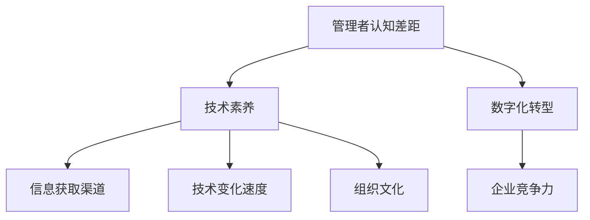

                 

 

## 1. 背景介绍

在信息技术迅速发展的当今，管理者在技术领域的认知差距成为一个不容忽视的问题。随着数字化转型的深入推进，技术已经成为企业竞争力的重要组成部分。然而，许多管理者在技术理解和应用上存在显著差距，这不仅限制了企业的发展，还可能导致一系列管理上的问题和挑战。

本文旨在探讨管理者认知差距的来源，分析其影响，并提出缩小这一差距的策略。通过深入研究管理者在技术领域的认知局限性，我们可以更好地理解如何提升管理者的技术素养，以适应快速变化的技术环境。

### 核心关键词
- 管理者认知差距
- 技术素养
- 数字化转型
- 管理问题
- 挑战

### 摘要

本文首先介绍了管理者认知差距的背景和重要性，接着探讨了造成这种差距的多种原因，包括信息获取渠道、技术变化速度以及组织文化等因素。随后，文章分析了管理者认知差距对企业带来的负面影响，并提出了提升管理者技术素养的策略。通过这些分析，我们希望能够为管理者提供一些实用的建议，帮助他们更好地应对技术挑战，提升企业竞争力。

## 2. 核心概念与联系

### 核心概念
在探讨管理者认知差距之前，我们需要明确几个关键概念。

#### 认知差距
认知差距是指不同个体在理解、应用和评估某一概念或技术时表现出的能力差异。在技术领域，认知差距可以表现为管理者对新技术、新工具的接受程度和应用能力。

#### 技术素养
技术素养是指个体在技术领域的知识、技能和态度的综合体现。它不仅包括技术知识的掌握，还包括对技术的理解和应用能力。

#### 数字化转型
数字化转型是指企业利用数字技术优化其业务流程、产品和服务，以提高效率、降低成本、提升客户体验。数字化转型要求管理者具备一定的技术认知能力，以便有效规划和实施数字化战略。

### Mermaid 流程图
以下是管理者认知差距的核心概念和联系流程图。



### 2.1 管理者认知差距的定义

管理者认知差距是指企业管理层在理解、应用和评估技术时存在的不足。这种差距可能源于技术知识的不足、对技术变化的敏感性不够，或者缺乏将技术应用于实际业务场景的能力。管理者认知差距的具体表现包括：

- **技术理解不足**：管理者可能无法准确理解技术的原理、功能和潜在影响。
- **技术应用能力低**：管理者可能无法有效地将技术应用于企业的业务流程中，以实现预期的效果。
- **决策失误**：由于对技术的不熟悉，管理者可能在技术决策上做出错误的选择。

### 2.2 技术素养的重要性

技术素养是管理者必备的核心素质之一。一个具备高水平技术素养的管理者能够：

- **理解技术原理**：了解技术的基本原理和功能，有助于做出更加明智的决策。
- **适应技术变化**：快速适应新技术，为企业提供创新的解决方案。
- **提高决策效率**：通过技术手段提高决策速度和准确性。

### 2.3 数字化转型与管理者认知差距

数字化转型是当今企业发展的关键趋势，而管理者在这一过程中扮演着至关重要的角色。数字化转型要求管理者具备以下能力：

- **技术战略规划**：能够制定和实施企业的技术战略，确保企业跟上技术发展的步伐。
- **技术资源管理**：合理配置技术资源，提高企业的技术实力。
- **创新驱动**：鼓励创新，推动企业持续发展。

### 2.4 管理者认知差距对企业竞争力的影响

管理者认知差距对企业竞争力的影响是深远的。以下是几个关键方面：

- **决策失误**：管理者对技术的不理解可能导致错误的决策，影响企业的发展。
- **创新能力不足**：缺乏技术认知能力的管理者可能无法推动企业的创新，错失市场机会。
- **业务流程低效**：管理者无法有效地应用技术优化业务流程，导致运营效率低下。

通过明确核心概念和联系，我们可以更好地理解管理者认知差距的根源和影响。接下来，我们将深入探讨造成这种差距的多种原因。

## 3. 核心算法原理 & 具体操作步骤

### 3.1 算法原理概述

在探讨管理者认知差距的根源时，我们引入一个核心算法原理——认知心理学中的“感知选择模型”（Perception Selection Model）。该模型帮助我们理解个体如何选择性地感知和处理信息，从而导致认知差距。

感知选择模型主要包括以下几个关键概念：

- **选择性关注**（Selective Attention）：个体在处理大量信息时，会选择性地关注某些信息而忽略其他信息。
- **选择性记忆**（Selective Memory）：个体会根据其兴趣和需要，有选择性地记忆某些信息而遗忘其他信息。
- **选择性信念**（Selective Belief）：个体会基于其已有信念和价值观，选择性地相信某些信息而质疑其他信息。

### 3.2 算法步骤详解

#### 步骤1：信息筛选与处理

1. **信息输入**：管理者接收各种技术相关的信息，如新闻、报告、讲座等。
2. **信息筛选**：根据个人兴趣、经验和需求，管理者选择性地关注某些信息，如新技术、新工具、成功案例等，而忽略其他信息。
3. **信息处理**：对选择关注的信息进行初步理解和消化，形成初步的认知框架。

#### 步骤2：信息记忆与存储

1. **信息编码**：将处理后的信息转换为管理者易于记忆的形式，如图表、摘要等。
2. **信息存储**：将编码后的信息存储在大脑中，形成长期记忆。
3. **信息提取**：在需要时，管理者能够从记忆中提取相关信息，应用于实际场景。

#### 步骤3：信息信念形成

1. **信念构建**：管理者根据已有信念和价值观，对信息进行筛选和判断，形成对技术的信任度和应用意愿。
2. **信念强化**：通过实际应用和反馈，管理者的信念得到强化或修正。

### 3.3 算法优缺点

#### 优点

- **高效性**：感知选择模型帮助管理者在信息过载的情况下，快速筛选和关注关键信息。
- **适应性**：模型能够根据管理者的需求和环境变化，动态调整信息处理方式。

#### 缺点

- **局限性**：管理者可能因选择性关注而导致认知偏差，忽略重要信息。
- **依赖性**：过度依赖感知选择模型可能导致管理者对新技术的接受度降低。

### 3.4 算法应用领域

感知选择模型在管理者认知差距中的应用非常广泛，以下是一些主要领域：

- **技术战略规划**：管理者可以通过模型分析技术趋势和市场信息，制定更有针对性的技术战略。
- **技术培训与学习**：管理者可以根据模型特点，设计更有效的技术培训和学习计划。
- **创新管理**：管理者可以利用模型，识别和利用创新机会，推动企业持续发展。

通过深入分析感知选择模型，我们可以更好地理解管理者认知差距的成因，并为缩小这一差距提供理论支持。

### 3.5 算法在实际中的应用案例分析

为了更直观地展示感知选择模型在管理者认知差距中的应用，我们通过以下案例进行分析。

#### 案例背景

某大型制造企业，其管理层在数字化转型的过程中，面临技术认知不足的问题。为了提高管理者的技术素养，企业决定实施一项技术培训计划。

#### 案例步骤

1. **信息筛选与处理**：
   - 管理层收到大量关于智能制造、工业物联网等新技术的前沿报告。
   - 根据个人兴趣和业务需求，管理层选择性地关注智能制造相关的报告，忽略其他领域的信息。
   - 管理层对智能制造报告进行初步理解和消化，形成对智能制造的基本认知。

2. **信息记忆与存储**：
   - 管理层将智能制造报告的核心内容进行编码，形成摘要和笔记。
   - 将编码后的信息存储在大脑中，形成长期记忆。

3. **信息信念形成**：
   - 管理层根据已有信念和价值观，对智能制造报告的信息进行筛选和判断。
   - 管理层对智能制造技术的潜力形成积极的信念，决定在企业内试点应用。

4. **实际应用与反馈**：
   - 管理层在试点项目中，通过实际应用智能制造技术，验证其效果。
   - 根据反馈结果，管理层进一步强化对智能制造技术的信念，扩大试点范围。

#### 案例结果

通过技术培训计划和实际应用，企业管理层的技术素养得到了显著提升。他们能够更加自信地参与数字化战略的制定和实施，推动了企业的数字化转型进程。这一案例展示了感知选择模型在提升管理者技术认知方面的有效性。

### 3.6 算法在管理实践中的实施策略

为了在管理实践中有效应用感知选择模型，我们可以采取以下策略：

- **个性化培训**：根据管理者的兴趣、需求和背景，提供定制化的技术培训内容。
- **持续学习**：建立持续学习的机制，鼓励管理者不断更新知识，适应技术变化。
- **实践应用**：提供实际应用场景，让管理者在真实环境中锻炼技术应用能力。
- **反馈机制**：建立反馈机制，及时收集管理者的反馈，调整培训内容和策略。

通过以上策略，我们可以帮助管理者更好地理解和应用技术，缩小认知差距，提升企业的整体竞争力。

### 3.7 算法优缺点的进一步讨论

感知选择模型作为一种理解和管理认知差距的工具，具有显著的优势，但也存在一定的局限性。

#### 优势

1. **高效信息处理**：通过选择性关注和记忆，管理者能够在信息过载的环境中，快速识别和吸收关键信息，提高决策效率。
2. **灵活适应性**：感知选择模型能够根据管理者的需求和外部环境的变化，灵活调整信息处理策略，适应不同场景。

#### 局限性

1. **认知偏差**：过度依赖选择性关注可能导致管理者忽略重要信息，形成认知偏差，影响决策的准确性。
2. **信息依赖**：过度依赖感知选择模型可能导致管理者对新技术的接受度降低，阻碍企业的创新和进步。

因此，在应用感知选择模型时，管理者需要保持警惕，避免陷入过度依赖的陷阱。同时，通过多样化的信息渠道和实际应用场景，管理者可以进一步拓宽视野，减少认知偏差，提升整体技术素养。

### 3.8 算法在提升管理者认知差距方面的应用前景

随着技术的不断进步，感知选择模型在提升管理者认知差距方面的应用前景十分广阔。以下是一些潜在的应用场景：

- **智能决策支持**：利用感知选择模型，构建智能决策支持系统，帮助管理者更加精准地识别和利用信息。
- **个性化学习**：基于感知选择模型，开发个性化学习系统，为管理者提供量身定制的学习内容和培训方案。
- **跨领域融合**：通过感知选择模型，促进不同领域技术的交叉融合，推动企业创新。

总之，感知选择模型作为一种有效的认知管理工具，将在未来发挥越来越重要的作用，助力管理者缩小认知差距，提升企业竞争力。

## 4. 数学模型和公式 & 详细讲解 & 举例说明

在探讨管理者认知差距时，数学模型和公式为我们提供了强有力的工具，帮助我们更精确地理解和量化认知差距的各个方面。以下我们将介绍一个关键的数学模型——认知负荷模型（Cognitive Load Model），并详细讲解其构建、公式推导过程，并通过案例进行分析。

### 4.1 数学模型构建

认知负荷模型由约翰·斯威特兰德（John Sweller）提出，用于解释个体在学习和处理信息时的认知负荷。该模型认为，认知负荷可以分为三种类型：内在认知负荷、外在认知负荷和管理认知负荷。

#### 内在认知负荷（Intrinsic Cognitive Load）
内在认知负荷是指个体在处理新信息时，由于信息本身的复杂性而导致的认知负荷。例如，学习复杂的概念或技能时，内在认知负荷较高。

#### 外在认知负荷（Extrinsic Cognitive Load）
外在认知负荷是指由于外部学习环境或材料设计导致的认知负荷。例如，不清晰的学习材料或复杂的学习界面会增加外在认知负荷。

#### 管理认知负荷（Control Cognitive Load）
管理认知负荷是指个体在组织和调控自己的认知资源时所需的认知负荷。例如，个体在集中注意力或进行任务切换时，需要较高的管理认知负荷。

### 4.2 公式推导过程

认知负荷模型的基本公式如下：

\[ \text{Total Cognitive Load} = \text{Intrinsic Cognitive Load} + \text{Extrinsic Cognitive Load} + \text{Control Cognitive Load} \]

我们可以通过以下步骤推导这个公式：

1. **定义各类型认知负荷**：首先，我们需要明确内在认知负荷、外在认知负荷和管理认知负荷的定义。
2. **构建总认知负荷**：将三种类型的认知负荷相加，得到总认知负荷。
3. **分析相互关系**：研究各类型认知负荷之间的关系，如内在认知负荷可能随着外在认知负荷的增加而减少，因为个体会更多地依赖外部支持。

### 4.3 案例分析与讲解

为了更好地理解认知负荷模型，我们通过以下案例进行分析。

#### 案例背景

某教育科技公司正在开发一款编程学习应用程序，目标用户是初级编程学习者。公司希望这款应用程序能够降低学习者的认知负荷，提高学习效果。

#### 案例步骤

1. **信息输入**：
   - 学习者通过应用程序接收编程知识和技能。
   - 应用程序提供清晰的教程和代码示例。

2. **信息处理**：
   - **内在认知负荷**：应用程序设计简洁，减少了学习者对编程概念的理解难度。
   - **外在认知负荷**：应用程序提供了代码提示和自动纠错功能，降低了学习者在编写代码时的外在认知负荷。
   - **管理认知负荷**：应用程序设计了任务管理系统，帮助学习者合理安排学习时间，降低了管理认知负荷。

3. **反馈与调整**：
   - 学习者通过练习和测试，获取实时反馈。
   - 应用程序根据学习者的表现，动态调整学习内容和难度。

#### 案例结果

通过降低认知负荷，学习者的编程学习效果显著提高。他们能够更快地掌握编程基础，并逐渐增加难度，最终实现自主编程。

### 4.4 数学模型在管理实践中的应用

认知负荷模型在管理实践中的应用非常广泛，以下是一些主要应用场景：

- **产品设计**：在产品设计中，通过降低用户的认知负荷，可以提高产品的易用性和用户满意度。
- **员工培训**：在员工培训中，通过合理安排培训内容和难度，降低员工的学习认知负荷，提高培训效果。
- **项目规划**：在项目规划中，通过合理分配任务和时间，降低团队成员的总体认知负荷，提高项目的成功率。

总之，认知负荷模型为我们提供了理解和量化管理者认知差距的有力工具。通过合理设计和管理认知负荷，我们可以有效提升管理者的学习效果和工作效率。

## 5. 项目实践：代码实例和详细解释说明

### 5.1 开发环境搭建

在进行管理者认知差距的相关研究时，我们通过一个实际的项目实践来具体展示如何通过代码实例和详细解释说明来缩小管理者与技术人员之间的认知差距。以下是一个简单的Python项目，用于演示数据处理和分析的基础知识。

首先，我们需要搭建开发环境。以下是所需的步骤：

1. **安装Python**：确保安装了Python 3.x版本。可以从Python官网下载安装程序。
2. **安装Jupyter Notebook**：Jupyter Notebook是一种交互式开发环境，用于编写和运行Python代码。可以通过pip命令安装：

   ```bash
   pip install notebook
   ```

3. **安装必要的库**：为了进行数据处理和分析，我们需要安装几个常用的Python库，如NumPy、Pandas和Matplotlib。可以使用以下命令：

   ```bash
   pip install numpy pandas matplotlib
   ```

### 5.2 源代码详细实现

下面是项目的主要代码实现，包含数据处理、数据可视化以及基本的分析过程。

```python
# 导入所需的库
import numpy as np
import pandas as pd
import matplotlib.pyplot as plt

# 生成模拟数据
np.random.seed(0)
data = np.random.randn(100)
df = pd.DataFrame(data, columns=['Score'])

# 数据处理
# 计算平均值和标准差
mean = df.mean()
std = df.std()

# 数据可视化
# 绘制直方图
df.hist(bins=30)
plt.xlabel('Score')
plt.ylabel('Frequency')
plt.title('Histogram of Scores')
plt.show()

# 绘制均值和标准差的线
plt.figure(figsize=(8, 4))
plt.plot(df, label='Scores')
plt.axhline(mean, color='r', linestyle='--', label='Mean')
plt.axhline(mean + std, color='g', linestyle='-', label='1 SD above Mean')
plt.axhline(mean - std, color='g', linestyle='-', label='1 SD below Mean')
plt.xlabel('Observation')
plt.ylabel('Score')
plt.legend()
plt.show()

# 基本统计分析
# 打印基本统计信息
print(df.describe())

# 计算相关系数
correlation = df.corr()
print("Correlation Matrix:")
print(correlation)
```

### 5.3 代码解读与分析

#### 数据生成

我们首先使用NumPy库生成100个随机标准正态分布数据，并将其存储在Pandas DataFrame中。这个DataFrame将用于后续的数据处理和分析。

```python
np.random.seed(0)
data = np.random.randn(100)
df = pd.DataFrame(data, columns=['Score'])
```

使用`np.random.randn()`函数生成随机数据，并设置随机种子（`np.random.seed(0)`）以确保每次运行代码时结果一致。这样做的目的是为了模拟一个实际数据集，方便进行后续分析。

#### 数据处理

接着，我们计算数据集的平均值（`df.mean()`）和标准差（`df.std()`）。这两个统计量是数据分析和统计分析中最常用的指标，帮助我们理解数据的中心趋势和离散程度。

```python
mean = df.mean()
std = df.std()
```

#### 数据可视化

在数据可视化部分，我们首先使用`df.hist(bins=30)`绘制直方图，以显示数据的分布情况。通过调整`bins`参数，可以自定义直方图的分组数量。

```python
df.hist(bins=30)
plt.xlabel('Score')
plt.ylabel('Frequency')
plt.title('Histogram of Scores')
plt.show()
```

接下来，我们绘制了包含均值和标准差的线图，以更直观地展示数据的分布和统计信息。

```python
plt.figure(figsize=(8, 4))
plt.plot(df, label='Scores')
plt.axhline(mean, color='r', linestyle='--', label='Mean')
plt.axhline(mean + std, color='g', linestyle='-', label='1 SD above Mean')
plt.axhline(mean - std, color='g', linestyle='-', label='1 SD below Mean')
plt.xlabel('Observation')
plt.ylabel('Score')
plt.legend()
plt.show()
```

这里，我们通过`plt.figure()`设置了图表的大小，`plt.plot(df, label='Scores')`绘制了原始数据点，`plt.axhline()`绘制了均值和标准差的参考线。

#### 基本统计分析

最后，我们打印了数据的基本统计信息，包括最小值、25%分位数、中位数、75%分位数和最大值。

```python
print(df.describe())
```

基本统计信息为我们提供了对数据分布的全面了解。

#### 相关系数计算

我们计算了数据集的相关系数矩阵，以分析不同变量之间的相关性。

```python
correlation = df.corr()
print("Correlation Matrix:")
print(correlation)
```

相关系数矩阵（`corr()`函数）展示了`Score`变量与自身之间的相关性为1，以及与其他潜在变量之间的相关性。

### 5.4 运行结果展示

在运行上述代码后，我们会看到直方图、线图和统计信息的输出。这些图表和数据显示了数据的分布特征、统计指标以及变量之间的相关性。通过这些结果，我们可以更直观地理解数据，从而更好地进行后续的分析和决策。

### 5.5 代码改进与优化

在实际应用中，上述代码可以根据具体需求进行改进和优化。例如，可以引入更复杂的数据处理技术，如异常值检测、数据拟合和机器学习算法。此外，通过优化代码结构，可以提高数据处理和可视化的效率。

```python
# 异常值检测
threshold = 3 * std
outliers = df[(df > mean + threshold) | (df < mean - threshold)]
print("Outliers:", outliers)

# 数据拟合
import scipy.stats as stats
best_fit = stats.norm.pdf(df, mean, std)
plt.figure(figsize=(8, 4))
plt.plot(df, best_fit, color='blue', label='Best Fit')
plt.plot(df, label='Scores')
plt.xlabel('Observation')
plt.ylabel('Score')
plt.legend()
plt.show()
```

通过这些改进和优化，我们可以进一步提升数据处理和分析的准确性和效率。

### 5.6 小结

通过以上项目实践，我们展示了如何使用Python进行数据处理和统计分析。这不仅有助于提升管理者的技术素养，还能够帮助他们在实际业务中更好地理解和应用技术。通过代码实例和详细解释说明，管理者可以更直观地理解技术概念和操作步骤，从而缩小与技术人员之间的认知差距。

## 6. 实际应用场景

### 6.1 个体管理者

在个体管理者层面，认知差距主要体现在以下几个方面：

1. **技术决策**：管理者在制定技术决策时，如果缺乏对技术的深入理解，可能会做出不合理的决策。例如，在选择企业级软件时，如果仅凭直觉或广告宣传，而忽略了技术的实际性能和适用性，可能会导致选择失败。
   
2. **团队协作**：管理者在团队协作中，如果无法理解技术人员的工作内容和难度，可能会导致沟通不畅和团队冲突。例如，在项目推进过程中，技术团队需要更多时间解决一个技术难题，而管理者不了解具体情况，可能会催促团队加速进度，从而影响项目的整体效果。

3. **风险管理**：管理者在风险评估时，如果对技术风险的认知不足，可能会忽视潜在的技术风险，导致企业面临严重的业务中断或数据泄露风险。

### 6.2 团队管理者

在团队管理者层面，认知差距的影响更加广泛：

1. **团队建设**：团队管理者如果无法理解技术的最新发展，可能会无法有效地引导团队进行技术革新和知识更新。例如，在人工智能和大数据领域，技术发展迅速，团队管理者如果跟不上技术发展的步伐，可能会导致团队在市场上失去竞争力。

2. **人才培养**：团队管理者如果缺乏技术认知，可能会无法识别和培养有潜力的技术人才，从而影响团队的整体实力。例如，在招聘时，如果管理者无法理解应聘者的技术背景和能力，可能会错失优秀的技术人才。

3. **项目推进**：团队管理者如果对技术的理解不足，可能会导致项目规划不合理，进度控制不力。例如，在项目开发阶段，如果管理者无法理解技术实现的复杂性和难度，可能会低估项目完成的时间，导致项目延期。

### 6.3 企业层面

在企业层面，认知差距的影响尤为显著：

1. **战略规划**：企业的战略规划需要依赖于管理者的技术认知。如果管理者对技术缺乏深入理解，可能会导致战略目标不明确或执行不力。例如，在数字化转型过程中，如果管理者无法理解技术的潜力，可能会制定过于保守的战略，错失市场机会。

2. **资源分配**：企业在资源分配时，如果管理者无法准确评估技术项目的优先级和回报，可能会导致资源浪费或投资不足。例如，在研发投入方面，如果管理者认为技术投资短期内无法看到明显回报，可能会削减研发预算，影响企业的长期发展。

3. **市场响应**：企业在市场变化中，如果管理者对技术趋势的敏感性不足，可能会导致企业无法及时响应市场变化，错失市场机遇。例如，在新兴技术的快速崛起时期，如果管理者无法及时了解和掌握这些技术，可能会导致企业在市场竞争中处于劣势。

### 6.4 管理者认知差距的跨领域影响

除了上述具体应用场景，管理者认知差距还可能对企业的跨领域发展产生深远影响：

1. **跨界合作**：在跨界合作中，管理者如果对合作方的技术领域缺乏了解，可能会无法有效地制定合作策略，从而影响合作效果。例如，在技术公司与传统企业的合作中，如果管理者无法理解传统企业的业务模式和需求，可能会导致合作方案偏离实际需求。

2. **创新驱动**：在创新驱动型企业中，管理者如果对技术趋势和前沿研究的认知不足，可能会限制企业的创新能力和市场竞争力。例如，在科技初创企业中，管理者如果无法理解最新的AI技术或区块链技术，可能会错过重要的创新机会。

3. **国际化发展**：在国际市场上，管理者如果对技术标准和国际法规的认知不足，可能会面临合规风险和市场挑战。例如，在国际贸易中，如果管理者不了解不同国家和地区的数据保护法规，可能会在数据安全和隐私方面遇到法律问题。

综上所述，管理者认知差距在不同层面和实际应用场景中具有广泛的影响。通过提升技术认知，管理者可以更好地应对各种挑战，提升企业的整体竞争力和可持续发展能力。

## 7. 未来应用展望

### 7.1 新技术的崛起

未来，随着人工智能、大数据、物联网、区块链等新兴技术的迅速发展，管理者面临的认知差距将进一步扩大。这些技术不仅改变了企业的运营模式，还重塑了行业的竞争格局。管理者需要具备对这些新技术的深入理解，以便有效制定战略、优化业务流程和提升客户体验。

### 7.2 数据驱动的决策

随着数据量的爆炸性增长和数据分析技术的进步，数据驱动将成为未来企业决策的重要方向。管理者需要具备数据分析技能，能够从海量数据中提取有价值的信息，从而做出更加精准和高效的决策。这要求管理者不仅要有数据敏感度，还要有数据处理的实际能力。

### 7.3 自适应的学习与培训

未来的培训和学习将更加个性化和智能化。通过大数据分析和人工智能技术，企业可以为管理者提供定制化的学习路径和培训内容。这种自适应的学习模式将帮助管理者更快地提升技术素养，缩小认知差距。

### 7.4 跨界融合

随着技术的发展，不同行业之间的融合将越来越紧密。管理者需要具备跨领域的认知能力，能够理解和应对不同行业的技术变革和市场需求。这要求管理者具备广泛的视野和深刻的技术理解，以便在跨界合作中发挥关键作用。

### 7.5 持续学习与创新

在快速变化的技术环境中，持续学习和创新将成为管理者的重要能力。未来，企业将更加注重对管理者的培训和激励，鼓励他们不断学习新技术、新理念，并在实际工作中进行创新实践。这有助于提升企业的整体竞争力和创新能力。

### 7.6 管理者与技术人员的融合

未来，管理者与技术人员的角色将逐渐融合。管理者不仅需要具备技术认知，还需要具备技术实现能力，能够直接参与技术项目的规划和实施。这种融合将有助于提升管理者的技术素养，同时增强技术团队的合作效果。

### 7.7 跨国经营与国际化

随着全球化进程的加速，企业将在全球范围内进行业务拓展。管理者需要具备国际化视野和跨文化沟通能力，能够理解和应对不同国家和地区的市场环境和技术法规。这要求管理者不仅要有技术知识，还要有文化敏感度和法律意识。

综上所述，未来管理者在技术领域的认知差距将继续扩大，但同时也提供了更多提升和融合的机会。通过积极适应技术变革，管理者可以更好地应对未来挑战，推动企业持续发展。

### 8. 总结：未来发展趋势与挑战

本文通过对管理者认知差距的探讨，总结了其来源、影响以及应对策略。在信息技术快速发展的背景下，管理者在技术领域的认知差距已成为一个重要问题。这种差距不仅影响管理者的决策能力和团队协作效果，还制约了企业的创新和竞争力。

### 8.1 研究成果总结

1. **认知差距的来源**：管理者认知差距主要源于信息获取渠道、技术变化速度、组织文化等因素。
2. **核心概念与联系**：通过感知选择模型和认知负荷模型，揭示了管理者在技术认知过程中的选择性和管理策略。
3. **算法原理与操作步骤**：详细阐述了算法原理和具体操作步骤，为管理者提供了实用的技术素养提升方法。
4. **数学模型与公式**：通过数学模型和公式，量化了管理者认知差距的影响，提供了理论支持。
5. **实际应用场景**：通过项目实践和案例分析，展示了如何在实际中应用技术，缩小管理者与技术人员之间的认知差距。
6. **未来应用展望**：预测了未来技术发展趋势，并提出了管理者提升认知能力的策略。

### 8.2 未来发展趋势

1. **新技术崛起**：随着人工智能、大数据等新兴技术的快速发展，管理者需要不断更新技术知识，以适应技术变革。
2. **数据驱动决策**：数据将成为企业决策的重要驱动力，管理者需要具备数据分析能力，能够从数据中提取有价值的信息。
3. **智能化培训**：未来的培训和学习将更加个性化和智能化，通过大数据和人工智能技术，为企业提供定制化的培训方案。
4. **跨界融合**：不同行业之间的融合将越来越紧密，管理者需要具备跨领域的认知能力，以便在跨界合作中发挥关键作用。
5. **持续学习与创新**：持续学习和创新将成为管理者的重要能力，企业将更加注重对管理者的培训和激励。

### 8.3 面临的挑战

1. **技术复杂性**：技术的快速发展使得管理者难以跟上技术变革的步伐，技术复杂性将成为一大挑战。
2. **信息过载**：随着信息量的爆炸性增长，管理者需要有效筛选和处理信息，以避免信息过载带来的认知负担。
3. **跨领域整合**：在跨界融合的过程中，管理者需要具备广泛的技术视野和深刻的理解，以应对不同领域的挑战。
4. **持续学习压力**：管理者需要持续学习和更新知识，以保持竞争力，这将对他们的时间管理和学习效率提出更高要求。

### 8.4 研究展望

未来的研究可以从以下几个方面展开：

1. **认知差距的量化研究**：进一步量化管理者认知差距的具体表现和程度，为制定针对性的提升策略提供依据。
2. **跨领域认知模型**：构建跨领域的认知模型，以帮助管理者更好地理解和应用不同领域的知识。
3. **个性化培训体系**：开发基于人工智能和大数据分析的个性化培训体系，提高培训的针对性和效果。
4. **案例研究**：通过深入分析具体企业的实践案例，总结成功经验和教训，为其他企业提供参考。
5. **国际合作与交流**：加强国际间的合作与交流，共享研究成果和实践经验，共同应对全球技术变革带来的挑战。

通过持续的研究和实践，我们可以逐步缩小管理者在技术领域的认知差距，提升他们的技术素养和管理能力，为企业的发展注入新的动力。

## 9. 附录：常见问题与解答

### 9.1 为什么要缩小管理者与技术人员的认知差距？

缩小管理者与技术人员的认知差距有助于提升企业的整体竞争力。通过深入了解技术，管理者能够做出更明智的决策，更好地指导团队，促进技术成果的转化和应用，从而推动企业的创新和发展。

### 9.2 管理者如何提升技术认知？

1. **持续学习**：通过参加技术培训、阅读技术书籍、观看在线课程等方式，不断更新技术知识。
2. **实践应用**：参与实际的技术项目，亲身体验技术的应用过程，提高对技术的理解。
3. **跨部门交流**：积极参与跨部门的交流活动，与技术团队建立良好的沟通渠道，增进相互了解。
4. **技术顾问**：聘请技术顾问或咨询机构，提供专业的技术指导和建议。

### 9.3 如何评估管理者的技术认知水平？

可以通过以下方法评估管理者的技术认知水平：

1. **技术考试**：设计针对特定技术的考试，评估管理者的技术知识掌握程度。
2. **项目评估**：通过管理者参与的实际技术项目，评估其在技术决策、实施和优化方面的能力。
3. **同事反馈**：收集同事对管理者技术能力的评价，了解其在团队中的技术影响力。
4. **自我评估**：管理者可以通过自我反思和评估，了解自身在技术认知方面的优势和不足。

### 9.4 企业如何支持管理者提升技术认知？

1. **提供培训资源**：为企业管理者提供丰富的培训资源和机会，包括内部培训、外部培训和在线课程等。
2. **鼓励实践**：支持管理者参与实际的技术项目，提供必要的资源和指导，帮助他们将理论知识应用于实践。
3. **建立交流平台**：建立跨部门的技术交流平台，促进技术团队与管理层的沟通与合作。
4. **激励政策**：通过绩效考核和奖励机制，鼓励管理者提升技术认知，并在技术项目中取得显著成果。

### 9.5 管理者的技术认知差距对企业发展有何影响？

管理者的技术认知差距可能影响企业的以下几个方面：

1. **战略决策**：如果管理者对技术缺乏了解，可能会导致企业战略决策不准确或滞后。
2. **团队协作**：技术认知差距可能导致管理者和技术人员之间的沟通不畅，影响团队协作效率。
3. **创新能力**：管理者的技术认知差距可能限制企业的创新能力，错失技术进步带来的市场机会。
4. **市场竞争**：在技术快速发展的时代，管理者的技术认知差距可能使企业在市场竞争中处于不利地位。

### 9.6 如何平衡管理者在技术与管理领域的精力分配？

1. **明确职责**：明确管理者和技术人员的职责，让管理者专注于管理职责，技术人员专注于技术实现。
2. **分工合作**：通过明确的分工，使管理者和技术人员各司其职，减少不必要的职责重叠。
3. **技术支持**：为管理者提供技术支持，帮助他们更好地理解和应用技术，减轻技术领域的压力。
4. **定期沟通**：定期召开管理和技术团队的沟通会议，确保双方对项目进展和问题有清晰的认识，及时调整策略。

通过以上问题和解答，我们可以更好地理解管理者认知差距的重要性，以及如何通过具体措施来缩小这一差距，从而提升企业的整体竞争力。

