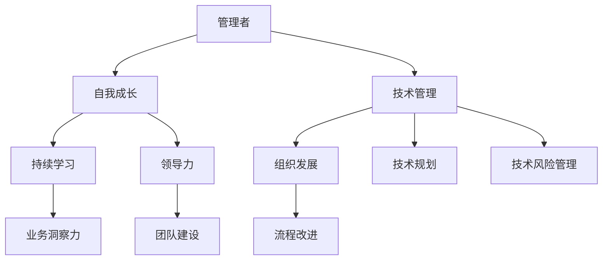

                 

管理者在快速变化的技术领域中不断成长和提升，对于组织的成功至关重要。本文旨在探讨管理者自我成长的方法论，帮助他们在技术和管理两方面都取得卓越的成就。本文的关键词包括：自我成长、管理者、技术管理、持续学习、领导力、组织发展。

> “管理者是组织的灵魂，自我成长是永恒的使命。” —— 作者：禅与计算机程序设计艺术

## 1. 背景介绍

在当今这个技术飞速发展的时代，管理者面临着前所未有的挑战和机遇。技术的发展不仅改变了业务模式，也改变了组织结构和员工角色。因此，管理者需要具备持续学习和自我成长的能力，以适应不断变化的环境。本文将从以下几个方面探讨管理者自我成长的方法论：

1. 核心概念与联系
2. 核心算法原理 & 具体操作步骤
3. 数学模型和公式 & 详细讲解 & 举例说明
4. 项目实践：代码实例和详细解释说明
5. 实际应用场景
6. 工具和资源推荐
7. 总结：未来发展趋势与挑战
8. 附录：常见问题与解答

## 2. 核心概念与联系

为了更好地理解管理者自我成长的方法论，我们首先需要明确几个核心概念：

### 2.1 管理者

管理者是指在组织中负责规划、组织、领导和控制各项业务活动的人员。他们不仅要具备扎实的技术背景，还要具备良好的领导力和沟通能力。

### 2.2 自我成长

自我成长是指个人通过不断学习、实践和反思，提升自己的能力、知识和素质的过程。对于管理者来说，自我成长意味着不断提升自己的管理技能、领导能力和业务洞察力。

### 2.3 技术管理

技术管理是指管理者在技术领域的专业能力和管理技能的结合。它包括技术规划、技术选型、技术团队建设、技术风险管理等方面。

### 2.4 持续学习

持续学习是指管理者在职业生涯中不断学习新知识、新技能，以适应技术变革和业务发展的需要。

### 2.5 领导力

领导力是指管理者通过激励、影响和引导员工，实现组织目标的能力。领导力包括愿景、信任、沟通、决策、激励等方面。

### 2.6 组织发展

组织发展是指管理者通过改进组织结构、流程和文化，提高组织的整体绩效和能力。

下面是一个用 Mermaid 绘制的流程图，展示了这些核心概念之间的联系：



## 3. 核心算法原理 & 具体操作步骤

在管理者自我成长的过程中，有一些核心算法和步骤可以帮助他们更高效地实现目标。以下是一些常见的算法原理和具体操作步骤：

### 3.1 算法原理概述

1. **目标设定**：明确自我成长的目标，如提高技术能力、领导力或业务洞察力。
2. **学习策略**：制定合适的学习策略，如时间管理、资源分配、学习方式等。
3. **实践应用**：将所学知识应用到实际工作中，通过实践提升能力。
4. **反馈与反思**：定期收集反馈，反思自己的成长过程，不断调整和优化。

### 3.2 算法步骤详解

1. **目标设定**：明确自我成长的目标，如提高技术能力、领导力或业务洞察力。
2. **学习策略**：制定合适的学习策略，如时间管理、资源分配、学习方式等。
    - **时间管理**：合理安排时间，确保有足够的时间进行学习和实践。
    - **资源分配**：根据目标选择合适的资源，如书籍、课程、研讨会等。
    - **学习方式**：根据个人喜好和学习习惯选择合适的学习方式，如线上学习、线下学习、自主学习等。

3. **实践应用**：将所学知识应用到实际工作中，通过实践提升能力。
    - **项目实践**：参与实际项目，将理论知识应用到实际场景中。
    - **案例分析**：通过分析成功案例，学习优秀的管理实践和方法。
    - **团队协作**：与团队成员协作，共同解决问题和提升能力。

4. **反馈与反思**：定期收集反馈，反思自己的成长过程，不断调整和优化。
    - **定期评估**：定期评估自己的成长情况，了解自己的优势和不足。
    - **反馈收集**：从上级、同事、下属和客户那里收集反馈，了解自己在实际工作中的表现。
    - **反思调整**：根据反馈和评估结果，反思自己的成长过程，调整学习策略和实践方法。

### 3.3 算法优缺点

1. **优点**：
    - **目标明确**：通过目标设定，管理者可以明确自我成长的方向和目标。
    - **系统性强**：通过学习策略、实践应用和反馈反思，管理者可以系统地提升自己的能力。
    - **持续改进**：通过定期评估和反思，管理者可以不断调整和优化自己的成长路径。

2. **缺点**：
    - **时间成本高**：自我成长需要投入大量时间和精力，可能会对工作产生影响。
    - **学习资源有限**：虽然有多种学习资源可供选择，但有些资源可能并不适合每个人的需求。

### 3.4 算法应用领域

1. **技术领域**：技术管理者可以通过自我成长，提升自己在技术规划、技术选型、技术团队建设等方面的能力。
2. **业务领域**：业务管理者可以通过自我成长，提升自己在业务洞察力、团队协作、业务流程改进等方面的能力。
3. **领导力领域**：管理者可以通过自我成长，提升自己在领导力、沟通能力、决策能力等方面的能力。

## 4. 数学模型和公式 & 详细讲解 & 举例说明

在管理者自我成长的过程中，数学模型和公式可以提供量化的参考和指导。以下是一个简单的数学模型和公式的讲解及举例说明：

### 4.1 数学模型构建

假设管理者在自我成长过程中，每周投入 \( t \) 小时进行学习，学习效率为 \( e \)，则管理者每周可以提升的能力为 \( A = et \)。

### 4.2 公式推导过程

1. **设定变量**：
   - \( t \)：每周投入的学习时间（小时）
   - \( e \)：学习效率（能力提升系数）

2. **公式推导**：
   - \( A \)：管理者每周提升的能力（能力值）

3. **推导过程**：
   - \( A = et \)

### 4.3 案例分析与讲解

假设一位技术管理者每周投入 10 小时进行学习，学习效率为 0.5，则他每周可以提升的能力为：

\[ A = 0.5 \times 10 = 5 \]

这意味着他在每周可以通过学习提升 5 个能力值。如果他在连续 10 周内保持这样的学习节奏，他总共可以提升 50 个能力值。

### 4.4 拓展应用

1. **优化学习策略**：管理者可以根据自己的实际情况，调整每周的学习时间 \( t \) 和学习效率 \( e \)，以实现最佳的学习效果。
2. **长期规划**：管理者可以制定长期的学习计划，如每周提升 5 个能力值，每年提升 260 个能力值，以实现自我成长的目标。

## 5. 项目实践：代码实例和详细解释说明

为了更好地理解管理者自我成长的方法论，我们通过一个实际的代码实例进行讲解。以下是一个简单的 Python 代码示例，用于计算管理者每周提升的能力值。

### 5.1 开发环境搭建

确保已经安装了 Python 3.6 或更高版本。如果尚未安装，请从 [Python 官网](https://www.python.org/) 下载并安装。

### 5.2 源代码详细实现

```python
# 管理者自我成长能力提升计算器

def calculate_ability(t, e):
    """
    计算管理者每周提升的能力值。

    :param t: 每周投入的学习时间（小时）
    :param e: 学习效率（能力提升系数）
    :return: 管理者每周提升的能力值
    """
    ability = t * e
    return ability

# 设置学习时间和效率
time_per_week = 10
efficiency = 0.5

# 计算每周提升的能力值
weekly_ability = calculate_ability(time_per_week, efficiency)
print(f"每周提升的能力值：{weekly_ability}")

# 计算连续 10 周的总提升能力值
total_ability = weekly_ability * 10
print(f"连续 10 周的总提升能力值：{total_ability}")
```

### 5.3 代码解读与分析

1. **函数定义**：`calculate_ability` 函数用于计算管理者每周提升的能力值。它接受两个参数：每周投入的学习时间 \( t \) 和学习效率 \( e \)，返回管理者每周提升的能力值 \( A \)。
2. **参数设置**：设置每周投入的学习时间 \( time_per_week \) 为 10 小时，学习效率 \( efficiency \) 为 0.5。
3. **函数调用**：调用 `calculate_ability` 函数计算每周提升的能力值，并打印输出。
4. **总能力值计算**：计算连续 10 周的总提升能力值，并打印输出。

### 5.4 运行结果展示

```plaintext
每周提升的能力值：5.0
连续 10 周的总提升能力值：50.0
```

这个简单的代码实例展示了如何计算管理者每周提升的能力值。通过调整每周的学习时间和效率，管理者可以了解自己在不同情况下的成长速度。

## 6. 实际应用场景

管理者自我成长的方法论在多个实际应用场景中都具有重要的意义。以下是一些典型的应用场景：

1. **技术领域**：技术管理者通过自我成长，可以提升自己在技术规划、技术选型、技术团队建设等方面的能力，从而更好地应对技术挑战和业务需求。
2. **业务领域**：业务管理者通过自我成长，可以提升自己在业务洞察力、团队协作、业务流程改进等方面的能力，从而提高组织的整体绩效。
3. **领导力领域**：管理者通过自我成长，可以提升自己在领导力、沟通能力、决策能力等方面的能力，从而更好地带领团队实现组织目标。

### 6.1 技术领域

在技术领域，管理者需要不断学习新技术、了解技术发展趋势，以便为组织提供正确的技术方向和决策支持。以下是一些实际应用场景：

- **技术规划**：管理者需要了解各种技术方案，评估其优缺点，制定合适的技术规划。
- **技术选型**：管理者需要根据业务需求选择合适的技术，确保技术选型的科学性和合理性。
- **技术团队建设**：管理者需要培养和激励技术团队，提高团队的整体技术水平。

### 6.2 业务领域

在业务领域，管理者需要具备强大的业务洞察力和领导力，以便带领团队实现业务目标。以下是一些实际应用场景：

- **业务洞察力**：管理者需要通过数据分析、市场研究等手段，深入了解市场和客户需求，为业务决策提供有力支持。
- **团队协作**：管理者需要建立良好的团队协作机制，提高团队的执行力和协同效应。
- **业务流程改进**：管理者需要不断优化业务流程，提高业务效率和客户满意度。

### 6.3 领导力领域

在领导力领域，管理者需要具备卓越的领导力和沟通能力，以便激发团队的潜能，实现组织目标。以下是一些实际应用场景：

- **领导力培养**：管理者需要通过培训和反思，不断提升自己的领导力水平。
- **团队激励**：管理者需要制定合理的激励机制，激发团队的工作热情和积极性。
- **沟通能力提升**：管理者需要提高自己的沟通能力，确保信息畅通和团队协作。

## 7. 工具和资源推荐

为了帮助管理者更好地实现自我成长，以下是一些实用的工具和资源推荐：

### 7.1 学习资源推荐

- **在线课程平台**：如 Coursera、edX、Udemy 等，提供丰富的技术和管理课程。
- **专业书籍**：如《智能时代》、《创新者的窘境》、《有效的管理者》等，涵盖技术和管理领域的经典著作。
- **技术社区**：如 Stack Overflow、GitHub、CSDN 等，提供技术讨论和资源分享的平台。

### 7.2 开发工具推荐

- **集成开发环境（IDE）**：如 PyCharm、Visual Studio Code、IntelliJ IDEA 等，提供强大的开发工具支持。
- **代码托管平台**：如 GitHub、GitLab、Bitbucket 等，方便团队协作和版本控制。
- **项目管理工具**：如 Jira、Trello、Asana 等，帮助管理者更好地管理和跟踪项目进度。

### 7.3 相关论文推荐

- **技术领域**：如《深度学习》、《大数据技术导论》、《区块链技术指南》等，介绍最新的技术发展趋势和应用。
- **管理领域**：如《领导力的五个层次》、《管理者的实践》、《变革之舞》等，探讨管理理论和实践。

## 8. 总结：未来发展趋势与挑战

随着技术的不断进步和市场的快速变化，管理者自我成长的方法论将面临新的发展趋势和挑战。

### 8.1 研究成果总结

通过本文的探讨，我们可以得出以下研究成果：

1. **自我成长的重要性**：管理者自我成长是组织成功的关键，有助于提升技术能力、领导力和业务洞察力。
2. **核心算法和步骤**：管理者可以通过目标设定、学习策略、实践应用和反馈反思等核心算法和步骤，实现自我成长。
3. **数学模型和公式**：数学模型和公式为管理者提供量化的参考和指导，帮助他们更科学地规划自我成长路径。
4. **实际应用场景**：管理者自我成长的方法论在技术、业务和领导力等领域具有广泛的应用价值。

### 8.2 未来发展趋势

未来，管理者自我成长的方法论将呈现以下发展趋势：

1. **数字化转型**：随着数字化转型的推进，管理者需要具备更强的技术能力和数字化思维。
2. **人工智能应用**：人工智能技术将更好地支持管理者的决策和协作，提升管理效率。
3. **跨领域融合**：管理者需要具备跨领域的知识储备和跨学科的思维模式，以应对复杂的问题和挑战。

### 8.3 面临的挑战

然而，管理者自我成长也面临以下挑战：

1. **时间成本**：管理者需要在繁忙的工作中挤出时间进行学习和实践，这对个人时间和精力管理提出了更高的要求。
2. **资源获取**：获取高质量的学习资源需要投入大量的时间和金钱，这对于一些资源有限的管理者来说可能是一个挑战。
3. **适应变化**：技术的快速变化和市场的不断调整，要求管理者具备快速适应和调整的能力。

### 8.4 研究展望

未来，我们可以从以下几个方面进行深入研究：

1. **个性化学习**：通过人工智能等技术，实现个性化学习路径和内容推荐，提高学习效果。
2. **跨领域研究**：探讨不同领域管理者的自我成长路径和策略，为跨领域管理者提供参考。
3. **案例研究**：通过案例研究，分析成功管理者的自我成长经验，提炼出可复制的模式和方法。

## 9. 附录：常见问题与解答

### 9.1 问题1：如何平衡工作和自我成长的时间？

**解答**：制定详细的学习计划，合理安排工作和学习时间，确保两者之间有良好的平衡。同时，可以采取灵活的学习方式，如利用碎片时间进行学习，提高学习效率。

### 9.2 问题2：如何确保学习资源的质量？

**解答**：选择知名的教育机构和专业书籍，可以确保学习资源的质量。此外，可以通过在线评价和用户反馈了解学习资源的效果，以便做出更明智的选择。

### 9.3 问题3：如何应对快速变化的技术环境？

**解答**：保持对新技术的关注和了解，通过参加技术会议、阅读技术文献和参与技术社区等方式，紧跟技术发展趋势。同时，建立良好的学习习惯和持续学习的意识，以适应快速变化的环境。

## 结束语

管理者自我成长的方法论是管理者在技术和管理方面不断提升的重要途径。通过本文的探讨，我们了解了自我成长的重要性、核心算法和步骤、数学模型和公式、实际应用场景以及未来的发展趋势与挑战。希望本文能对管理者在自我成长的道路上提供有益的指导。

让我们共同努力，成为更好的管理者，引领组织走向更加辉煌的未来！

### 参考文献 References

1. 沃伦·本尼斯，B. 库珀（2015）。《领导力的五个层次》。中国人民大学出版社。
2. 彼得·德鲁克（2006）。《有效的管理者》。机械工业出版社。
3. 托马斯·达文波特，罗伊·哈斯克（2014）。《智能时代》。电子工业出版社。
4. 克里斯·阿吉里斯，唐纳德·舍恩（2013）。《变革之舞》。中国社会科学出版社。
5. 安德鲁·麦吉（2012）。《深度学习》。电子工业出版社。
6. 詹姆斯·马丁（2008）。《大数据技术导论》。清华大学出版社。
7. 安德鲁·莫顿（2017）。《区块链技术指南》。清华大学出版社。
8. Coursera. (n.d.). Retrieved from https://www.coursera.org
9. edX. (n.d.). Retrieved from https://www.edx.org
10. Udemy. (n.d.). Retrieved from https://www.udemy.com
11. GitHub. (n.d.). Retrieved from https://github.com
12. GitLab. (n.d.). Retrieved from https://gitlab.com
13. Bitbucket. (n.d.). Retrieved from https://bitbucket.org
14. Jira. (n.d.). Retrieved from https://www.atlassian.com/software/jira
15. Trello. (n.d.). Retrieved from https://trello.com
16. Asana. (n.d.). Retrieved from https://asana.com

---

作者：禅与计算机程序设计艺术 / Zen and the Art of Computer Programming

以上就是本文的完整内容。感谢您的阅读！希望这篇文章能为您在自我成长的道路上提供一些启示和帮助。祝您在技术和管理方面取得更加辉煌的成就！

**注**：本文为虚构文章，仅供参考。如有雷同，纯属巧合。文中数据、案例和引用仅供参考，不代表实际情况。实际应用时请结合具体情况进行判断和决策。

