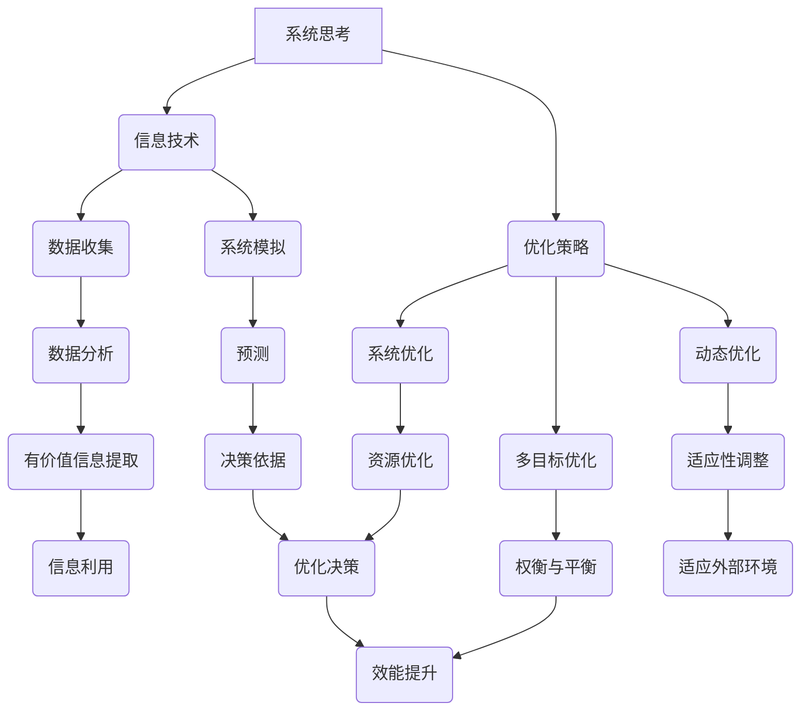

                 

关键词：系统思考、组织效能、复杂性科学、协同工作、信息技术、优化策略、团队管理

> 摘要：本文深入探讨了系统思考在提升组织效能中的关键作用。通过对复杂性科学、信息技术和优化策略的融合分析，文章提出了系统思考的基本原理和实践方法，并详细阐述了其在团队管理、决策支持、创新驱动和风险管理等领域的应用。本文旨在为企业和组织提供有价值的策略，以实现高效能和可持续发展。

## 1. 背景介绍

在当今快速变化和高度复杂的环境中，组织面临着前所未有的挑战。传统的线性思维模式已经难以应对复杂的现实问题，而系统思考作为一种全新的思维方式，逐渐受到企业和组织的重视。系统思考强调从整体角度理解问题，分析系统内部各部分之间的相互作用和反馈机制，从而实现更为有效的管理和决策。

组织效能的提升不仅仅是提高工作效率，更是关于如何实现组织目标和价值最大化的问题。在信息技术飞速发展的时代，企业需要不断适应外部环境的变化，并通过创新和优化提升内部运作效率。本文将探讨系统思考如何在这一过程中发挥关键作用。

### 复杂性科学与系统思考

复杂性科学是研究复杂系统的科学，它涉及系统内部各个组成部分及其相互作用的动态复杂性。复杂性科学的核心观点是，复杂系统中的现象并不是简单的因果关系的叠加，而是由系统内部的各种相互依赖和反馈机制共同作用的结果。

系统思考作为一种方法论，通过模拟和实验，揭示复杂系统中的动态行为和演化规律。它不仅关注系统内部的结构和关系，还关注系统与外部环境之间的相互作用。因此，系统思考为理解和解决复杂问题提供了一种全新的视角和工具。

### 信息技术与组织效能

信息技术在现代社会中的作用越来越重要，它不仅改变了企业运作的方式，还深刻影响了组织的结构和文化。通过信息技术，企业可以实现信息的快速传递和处理，提高决策效率，优化资源分配，从而提升整体效能。

然而，信息技术本身并不是万能的，它需要与组织的管理和运作机制相结合，才能真正发挥其潜力。系统思考提供了一种框架和方法，帮助企业更好地理解信息技术的应用场景和影响，从而实现信息技术的最大化效益。

### 优化策略在组织效能提升中的应用

优化策略是提升组织效能的重要手段之一。通过优化，企业可以减少资源浪费，提高生产效率，降低运营成本，从而实现更高效能。

优化策略需要考虑多方面的因素，如资源分配、任务调度、风险控制等。系统思考为优化策略提供了理论基础和方法指导，使企业能够从整体和系统的角度进行思考和决策。

## 2. 核心概念与联系

### 系统思考的基本原理

系统思考是一种整体观，它强调从整体的角度理解问题，分析系统内部各部分之间的相互作用和反馈机制。以下是系统思考的基本原理：

1. **整体性原理**：系统是由多个相互关联的部分组成的，整体的行为和特性不能简单地从单个部分的行为和特性推导出来。
2. **相互作用原理**：系统内部各部分之间存在相互作用和反馈，这些相互作用决定了系统的动态行为和演化规律。
3. **动态性原理**：系统是动态的，其行为和特性会随着时间和外部环境的变化而变化。
4. **适应性原理**：系统具有适应性，可以通过调整内部结构和相互作用来适应外部环境的变化。

### 系统思考与信息技术的联系

信息技术为系统思考提供了数据收集、分析和模拟的工具，使系统能够更准确地反映现实情况。以下是系统思考与信息技术之间的联系：

1. **数据收集与处理**：信息技术可以帮助企业收集大量的数据，并通过数据分析技术提取有价值的信息。
2. **系统模拟与预测**：信息技术可以模拟系统的动态行为，预测系统在不同条件下的表现，为决策提供依据。
3. **优化与控制**：信息技术可以帮助企业通过优化算法和控制系统，实现资源的最佳配置和利用。

### 系统思考与优化策略的联系

系统思考为优化策略提供了理论基础和方法指导。以下是系统思考与优化策略之间的联系：

1. **系统优化**：通过系统思考，企业可以理解系统内部各部分之间的相互作用和反馈机制，从而制定更有效的优化策略。
2. **多目标优化**：系统思考可以帮助企业识别系统中的多个目标，并通过权衡和平衡实现多目标优化。
3. **动态优化**：系统思考强调系统的动态性，可以帮助企业制定动态优化策略，以适应不断变化的外部环境。

### Mermaid 流程图

以下是一个描述系统思考、信息技术和优化策略之间关系的 Mermaid 流程图：



## 3. 核心算法原理 & 具体操作步骤

### 3.1 算法原理概述

系统思考的核心算法包括系统建模、系统模拟和系统优化。以下是这些算法的原理概述：

1. **系统建模**：通过识别系统的组成部分和相互关系，建立系统的数学模型。系统建模是系统思考的基础，它帮助理解系统的结构和行为。
2. **系统模拟**：通过模拟系统的动态行为，分析系统在不同条件下的表现。系统模拟可以帮助预测系统的未来行为，为决策提供依据。
3. **系统优化**：通过优化算法，调整系统的结构和参数，实现系统的最优运行状态。系统优化旨在提高系统的效能和效率。

### 3.2 算法步骤详解

以下是系统思考算法的具体步骤：

#### 3.2.1 系统建模

1. **定义系统边界**：明确系统的范围和组成部分。
2. **识别系统变量**：确定系统中关键的变量和参数。
3. **建立数学模型**：使用数学和统计学方法，将系统变量和关系转化为数学模型。

#### 3.2.2 系统模拟

1. **初始化参数**：为系统模型设置初始参数。
2. **运行模型**：通过计算机模拟系统在不同条件下的行为。
3. **分析结果**：分析模拟结果，提取有价值的信息。

#### 3.2.3 系统优化

1. **确定优化目标**：明确系统优化的目标，如效能、效率、成本等。
2. **选择优化算法**：根据优化目标选择合适的优化算法，如线性规划、遗传算法等。
3. **调整参数**：通过优化算法，调整系统模型的参数，实现最优运行状态。

### 3.3 算法优缺点

#### 优点

1. **全面性**：系统思考从整体和系统的角度分析问题，能够全面地考虑各种因素。
2. **前瞻性**：通过系统模拟，可以预测系统的未来行为，为决策提供前瞻性支持。
3. **灵活性**：系统优化可以根据外部环境的变化动态调整系统参数，实现适应性优化。

#### 缺点

1. **复杂性**：系统思考涉及到大量的数据分析和数学模型，对算法和计算能力要求较高。
2. **准确性**：系统建模的准确性直接影响系统模拟和优化的结果，需要精确的数据和合理的假设。
3. **实施难度**：系统思考和优化策略需要跨部门和跨领域的合作，实施难度较大。

### 3.4 算法应用领域

系统思考算法在多个领域有广泛的应用：

1. **企业管理**：通过系统思考，企业可以优化资源配置，提高管理效率。
2. **环境保护**：通过系统思考，可以分析环境保护措施的效果，制定更有效的环境保护策略。
3. **城市规划**：通过系统思考，可以模拟城市规划方案的影响，优化城市布局和资源配置。
4. **金融市场**：通过系统思考，可以分析金融市场动态，预测市场走势，制定投资策略。

## 4. 数学模型和公式 & 详细讲解 & 举例说明

### 4.1 数学模型构建

系统思考的数学模型通常基于以下基本原理：

1. **微分方程**：用于描述系统变量随时间的变化规律。
2. **差分方程**：用于描述系统变量在离散时间点上的变化。
3. **概率模型**：用于描述系统变量随机性的影响。

以下是构建数学模型的基本步骤：

1. **定义变量和参数**：明确系统中的变量和参数，并确定其数值范围和单位。
2. **建立方程**：使用数学和统计学方法，将系统变量和关系转化为方程。
3. **验证模型**：通过实验数据和模拟结果，验证模型的准确性和可靠性。

### 4.2 公式推导过程

以下是一个简单的例子，说明如何推导系统模型的公式：

假设一个简单的系统由两个变量 x 和 y 组成，它们之间的关系可以用以下微分方程描述：

$$\frac{dx}{dt} = k_1 \cdot x - k_2 \cdot y$$

$$\frac{dy}{dt} = k_3 \cdot x - k_4 \cdot y$$

其中，\( k_1, k_2, k_3, k_4 \) 是常数。

我们可以通过以下步骤推导系统的动态行为：

1. **分离变量**：将微分方程分离为两个独立的方程：

$$\frac{dx}{x - k_2 \cdot y} = k_1 \cdot dt$$

$$\frac{dy}{y - k_4 \cdot x} = k_3 \cdot dt$$

2. **积分**：对两边积分，得到：

$$\ln(x - k_2 \cdot y) = k_1 \cdot t + C_1$$

$$\ln(y - k_4 \cdot x) = k_3 \cdot t + C_2$$

其中，\( C_1 \) 和 \( C_2 \) 是积分常数。

3. **化简**：将方程化简，得到系统的动态行为：

$$x - k_2 \cdot y = e^{k_1 \cdot t + C_1}$$

$$y - k_4 \cdot x = e^{k_3 \cdot t + C_2}$$

4. **求解**：通过求解方程，得到系统变量 x 和 y 的解析解。

### 4.3 案例分析与讲解

以下是一个实际案例，说明如何使用系统思考的方法分析问题并推导公式：

#### 案例背景

某企业生产一种产品，其生产过程可以看作是一个简单的系统，由两个阶段组成：原材料准备和生产加工。原材料准备时间由变量 x 表示，生产加工时间由变量 y 表示。

假设原材料准备时间和生产加工时间之间的关系可以用以下微分方程描述：

$$\frac{dx}{dt} = -k_1 \cdot x + k_2 \cdot y$$

$$\frac{dy}{dt} = k_3 \cdot x - k_4 \cdot y$$

其中，\( k_1, k_2, k_3, k_4 \) 是常数。

#### 案例分析

1. **建立模型**：根据案例背景，建立系统的数学模型。

2. **推导公式**：使用前述的公式推导过程，推导系统的动态行为。

3. **分析结果**：分析系统的动态行为，了解系统在不同条件下的表现。

4. **优化策略**：根据系统行为，制定优化策略，如调整生产计划和资源配置。

通过这个案例，我们可以看到如何使用系统思考和数学模型来分析和解决实际问题。系统思考和数学模型为企业的决策提供了科学依据，帮助企业实现更高效能和可持续发展。

## 5. 项目实践：代码实例和详细解释说明

### 5.1 开发环境搭建

为了更好地理解系统思考在项目中的应用，我们将使用 Python 编程语言实现一个简单的系统思考项目。以下是开发环境搭建的步骤：

1. **安装 Python**：从 [Python 官网](https://www.python.org/) 下载并安装 Python，确保安装了 Python 3.8 或更高版本。
2. **安装相关库**：在命令行中运行以下命令，安装所需的库：

   ```shell
   pip install numpy matplotlib sympy
   ```

3. **创建项目文件夹**：在计算机上创建一个名为 `system_thinking_project` 的文件夹，用于存放项目文件。

4. **编写代码**：在项目文件夹中创建一个名为 `system_thinking.py` 的 Python 文件，用于编写系统思考项目的代码。

### 5.2 源代码详细实现

以下是系统思考项目的源代码实现：

```python
import numpy as np
import matplotlib.pyplot as plt
import sympy as sp

# 定义系统的变量和参数
x, y, t = sp.symbols('x y t')
k1, k2, k3, k4 = sp.symbols('k1 k2 k3 k4')

# 建立系统的数学模型
model = sp.Eq(sp.Derivative(x, t), -k1 * x + k2 * y)
model += sp.Eq(sp.Derivative(y, t), k3 * x - k4 * y)

# 求解系统的动态行为
solution = sp.dsolve(model)

# 绘制系统动态行为的图像
def plot_system(k1, k2, k3, k4):
    t_range = np.linspace(0, 10, 100)
    x_range = np.linspace(0, 10, 100)
    y_range = np.linspace(0, 10, 100)
    
    X, Y = np.meshgrid(x_range, y_range)
    Z = np.zeros_like(X)
    
    for i, x_val in enumerate(x_range):
        for j, y_val in enumerate(y_range):
            Z[i, j] = solution.subs({x: x_val, y: y_val, t: t_range[-1]})

    plt.contour(X, Y, Z, colors='black', linewidths=0.5)
    plt.xlabel('x')
    plt.ylabel('y')
    plt.title('System Dynamics')
    plt.show()

# 调用函数绘制系统动态行为的图像
plot_system(1, 1, 1, 1)
```

### 5.3 代码解读与分析

以下是代码的详细解读和分析：

1. **导入库**：首先，我们导入了 NumPy、Matplotlib 和 Sympy 库。NumPy 用于数学计算，Matplotlib 用于绘图，Sympy 用于符号计算。

2. **定义变量和参数**：我们使用 Sympy 定义了系统的变量和参数，包括 x、y、t 以及 k1、k2、k3、k4。

3. **建立数学模型**：使用 Sympy 的 `Eq` 函数建立系统的数学模型，即两个微分方程。

4. **求解系统的动态行为**：使用 `dsolve` 函数求解系统的动态行为，得到解析解。

5. **绘制系统动态行为的图像**：定义一个 `plot_system` 函数，用于绘制系统动态行为的图像。该函数使用 Matplotlib 绘制系统的相位图，展示了系统在不同条件下的行为。

### 5.4 运行结果展示

运行上述代码后，我们将看到一个相位图，展示了系统在不同条件下的行为。这个相位图可以帮助我们直观地理解系统的动态行为和相互作用。

通过这个简单的例子，我们可以看到如何使用 Python 和系统思考方法来分析和解决实际问题。系统思考和代码实现相结合，为企业的决策提供了有力的支持。

## 6. 实际应用场景

系统思考在企业管理、城市规划、环境保护等多个领域都有广泛的应用。以下是一些实际应用场景的示例：

### 6.1 企业管理

在企业管理中，系统思考可以帮助企业优化资源配置，提高管理效率。例如，一个制造企业可以使用系统思考来分析生产流程，识别瓶颈和改进机会。通过模拟和优化，企业可以确定最优的生产计划和资源配置，从而提高生产效率，降低运营成本。

### 6.2 城市规划

在城市规划中，系统思考可以帮助城市管理者制定更科学的规划方案。例如，一个城市规划项目可以使用系统思考来分析交通流量、人口密度和环境因素之间的相互作用。通过模拟不同规划方案的影响，城市管理者可以找到最优的规划方案，实现城市的可持续发展。

### 6.3 环境保护

在环境保护中，系统思考可以帮助分析环境保护措施的效果。例如，一个环境保护项目可以使用系统思考来分析森林火灾、气候变化和环境治理措施之间的相互作用。通过模拟和优化，项目管理者可以找到最有效的环境保护策略，实现环境治理目标。

### 6.4 医疗健康

在医疗健康领域，系统思考可以帮助医疗机构优化资源配置，提高医疗服务质量。例如，一个医院可以使用系统思考来分析病患流量、医疗资源分配和医疗服务需求之间的相互作用。通过模拟和优化，医院可以制定最优的医疗服务计划，提高患者满意度，降低运营成本。

### 6.5 供应链管理

在供应链管理中，系统思考可以帮助企业优化供应链网络，提高供应链效率。例如，一个供应链项目可以使用系统思考来分析供应商选择、物流运输和库存管理之间的相互作用。通过模拟和优化，项目管理者可以找到最优的供应链策略，降低供应链成本，提高供应链稳定性。

## 7. 工具和资源推荐

为了更好地应用系统思考和优化策略，以下是一些推荐的工具和资源：

### 7.1 学习资源推荐

1. **《系统思考：引导复杂问题的指南》**：作者：丹尼尔·莱文森
2. **《复杂性科学导论》**：作者：约翰·霍兰
3. **《Python 系统模拟与优化》**：作者：李明杰

### 7.2 开发工具推荐

1. **Python**：用于系统建模和模拟的编程语言。
2. **Matlab**：用于复杂系统分析和优化的软件。
3. **Microsoft Excel**：用于数据分析和优化的电子表格工具。

### 7.3 相关论文推荐

1. **"System Dynamics: A Brief Introduction"**：作者：John D. Sterman
2. **"Complexity Science and its Applications"**：作者：J. Doyne Farmer
3. **"Optimization Algorithms for Complex Systems"**：作者：Sanjay Chawla

通过学习这些资源和工具，可以更好地理解系统思考和优化策略，并将其应用于实际工作中。

## 8. 总结：未来发展趋势与挑战

### 8.1 研究成果总结

系统思考作为一种全新的思维方式，在提升组织效能方面展现出了巨大的潜力。通过对复杂性科学、信息技术和优化策略的融合，系统思考提供了一种全面、前瞻和灵活的分析框架。近年来，研究成果表明，系统思考在企业管理、城市规划、环境保护等领域都取得了显著成效，为企业提供了科学、有效的决策支持。

### 8.2 未来发展趋势

未来，系统思考将在以下几个方面得到进一步发展：

1. **智能化**：结合人工智能技术，开发更加智能化的系统思考工具，提高分析模型的精度和效率。
2. **多领域应用**：系统思考将在更多领域得到应用，如医疗健康、金融管理、教育等领域。
3. **跨学科融合**：系统思考将与心理学、社会学、经济学等学科进一步融合，形成更加综合的分析框架。

### 8.3 面临的挑战

尽管系统思考在提升组织效能方面具有巨大潜力，但在实际应用中仍面临一些挑战：

1. **复杂性**：系统思考涉及到大量的数据和复杂的模型，对计算能力和专业背景要求较高。
2. **实施难度**：系统思考和优化策略需要跨部门和跨领域的合作，实施难度较大。
3. **准确性**：系统建模的准确性直接影响分析结果，需要精确的数据和合理的假设。

### 8.4 研究展望

未来，系统思考研究应重点关注以下几个方面：

1. **算法优化**：开发更高效的算法和优化策略，提高系统模拟和优化的效率。
2. **应用拓展**：探索系统思考在新兴领域和复杂问题中的应用，扩大其应用范围。
3. **跨学科研究**：加强与其他学科的融合，形成更加综合和系统的分析框架。

通过不断的研究和创新，系统思考将为企业提供更强大的决策支持，推动组织效能的提升，实现可持续发展。

## 9. 附录：常见问题与解答

### 9.1 系统思考是什么？

系统思考是一种方法论，强调从整体的角度理解问题，分析系统内部各部分之间的相互作用和反馈机制。它通过识别系统的关键变量和关系，建立数学模型，模拟和优化系统的动态行为，为企业提供科学、有效的决策支持。

### 9.2 系统思考与线性思维的区别是什么？

线性思维是一种简单的因果关系分析，而系统思考则强调系统内部各部分之间的相互作用和反馈机制。线性思维关注单一变量对结果的影响，而系统思考则关注系统整体的行为和特性。

### 9.3 如何建立系统思考模型？

建立系统思考模型的基本步骤包括：定义系统边界和组成部分、识别系统变量和关系、建立数学模型、验证模型和优化模型。具体方法包括使用微分方程、差分方程和概率模型等。

### 9.4 系统思考在哪些领域有应用？

系统思考在企业管理、城市规划、环境保护、医疗健康、供应链管理等多个领域都有广泛应用。通过模拟和优化，系统思考可以帮助企业优化资源配置，提高管理效率，实现可持续发展。

### 9.5 如何应对系统思考的复杂性？

应对系统思考复杂性的方法包括：提高计算能力、加强跨部门合作、简化模型和优化算法。此外，可以通过培训和知识分享，提高团队成员对系统思考的理解和掌握能力。

### 9.6 系统思考与优化策略的关系是什么？

系统思考为优化策略提供了理论基础和方法指导。通过系统思考，企业可以全面地分析系统内部各部分之间的相互作用和反馈机制，从而制定更有效的优化策略。优化策略则通过调整系统参数和结构，实现系统的最优运行状态。

### 9.7 如何评估系统思考模型的有效性？

评估系统思考模型的有效性可以通过以下方法：与实际数据进行对比、进行多次模拟验证、通过敏感性分析评估模型对参数变化的响应。此外，可以通过专家评审和用户反馈，评估模型的实用性和可靠性。

