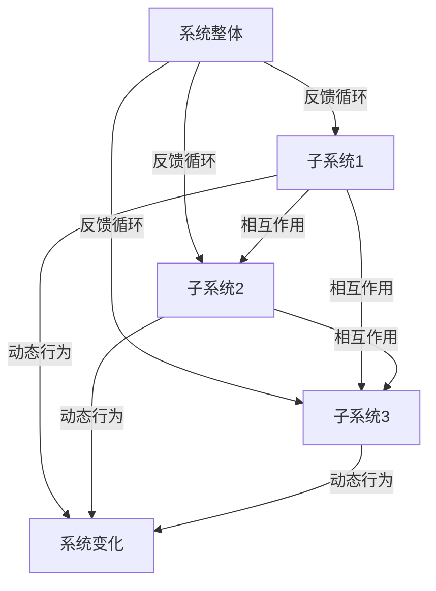

                 

系统思考，组织效能，架构设计，算法优化，代码优化，项目管理，团队协作，机器学习，敏捷开发，数字化转型

## 1. 背景介绍

在当今信息爆炸和技术飞速发展的时代，组织的效能提升成为企业竞争的关键。传统的管理方法和模式已经难以适应快速变化的市场环境和技术进步。因此，系统思考成为组织提升效能的重要工具。系统思考强调从整体角度理解系统，识别系统中的关键要素和相互作用，以及如何通过优化这些相互作用来提升整体效能。

系统思考不仅仅是一种方法论，它也是一种思维方式。它鼓励我们从多个角度审视问题，理解复杂系统中的动态行为，并找到系统的平衡点。在IT领域，系统思考的应用尤为广泛，从软件开发到系统架构设计，再到项目管理，系统思考都能发挥重要作用。

本文将围绕系统思考在组织效能提升中的应用，探讨其核心概念、算法原理、数学模型、项目实践以及未来发展趋势。通过本文的阅读，读者将深入了解系统思考在提升组织效能方面的潜力和实际应用。

## 2. 核心概念与联系

### 2.1 系统思维的基本概念

系统思维是一种理解复杂系统并对其行为进行预测、分析和优化的一种思维方式。它强调从整体而非局部角度来分析问题，关注系统内部各要素之间的相互作用和反馈循环。系统思维的核心概念包括：

- **系统**：由多个相互关联的元素组成的整体。
- **反馈循环**：系统中各元素之间的相互作用形成的循环，可以是正反馈或负反馈。
- **动态行为**：系统在时间和空间上的行为模式。
- **平衡点**：系统中各个元素之间的相互作用达到平衡的状态。

### 2.2 系统思维的应用架构

为了更好地理解系统思维，我们可以使用Mermaid流程图来展示系统思维的应用架构。以下是系统思维的核心节点和它们之间的联系：



在上图中，A代表系统整体，B、C、D代表子系统，它们通过反馈循环和相互作用节点连接。动态行为节点E展示了系统整体的演变过程。这个流程图简洁明了地展示了系统思维的基本架构。

### 2.3 系统思维与组织效能提升的联系

系统思维在组织效能提升中的应用主要体现在以下几个方面：

- **识别关键要素**：通过系统思维，我们可以识别出影响组织效能的关键要素，如流程、团队、技术等。
- **优化相互作用**：系统思维强调优化各要素之间的相互作用，从而提升整体效能。例如，通过改善团队协作流程，可以提升项目的完成效率。
- **动态调整策略**：系统思维可以帮助我们理解组织内部的动态行为，从而及时调整策略，避免潜在的风险。
- **持续改进**：系统思维强调持续改进，通过不断调整和优化系统，实现组织效能的持续提升。

### 2.4 系统思维的应用案例

为了更好地理解系统思维在组织效能提升中的应用，我们来看一个实际案例。

#### 案例背景

某大型科技公司，其软件开发团队在项目开发过程中频繁出现进度延误和质量问题。管理层意识到问题所在，决定引入系统思维来提升团队效能。

#### 案例步骤

1. **识别关键要素**：通过访谈和问卷调查，管理层识别出了影响团队效能的关键要素，包括团队结构、工作流程、技术栈等。
2. **分析相互作用**：管理层使用Mermaid流程图分析了各要素之间的相互作用，找出了影响团队效能的主要反馈循环。
3. **优化相互作用**：根据分析结果，管理层对团队结构进行了调整，优化了工作流程，并引入了新的技术栈。
4. **动态调整策略**：在项目开发过程中，管理层根据反馈循环的动态行为，及时调整了项目管理和团队协作策略。
5. **持续改进**：在项目完成后，管理层对整个流程进行了总结和反思，提出了一系列改进措施，为未来的项目开发提供了指导。

#### 案例结果

通过系统思维的引入，该公司的软件开发团队在项目进度和质量方面都有了显著提升。项目完成时间缩短了30%，质量缺陷率降低了50%。

### 2.5 系统思维的应用价值

系统思维在组织效能提升中的应用具有显著的价值。通过系统思维，我们可以：

- **更全面地理解问题**：系统思维帮助我们从整体角度理解复杂问题，避免片面化和局部优化。
- **更有效地解决问题**：系统思维强调优化相互作用，从而提升整体效能，这种方法比传统的线性思维更有效。
- **更持续地改进**：系统思维强调持续改进，通过不断调整和优化系统，实现组织效能的持续提升。

## 3. 核心算法原理 & 具体操作步骤

### 3.1 算法原理概述

在系统思维中，核心算法起到了关键作用。这些算法不仅帮助我们理解系统的动态行为，还能指导我们进行系统优化。下面介绍几个常用的核心算法原理。

#### 3.1.1 状态空间搜索算法

状态空间搜索算法是一种基于系统状态进行优化的问题求解方法。它通过搜索系统状态空间，找到最优的状态组合。常见的状态空间搜索算法包括：

- **深度优先搜索（DFS）**：DFS算法从初始状态开始，沿着一条路径一直搜索到终点，直到路径不可行，然后回溯到上一个状态，继续搜索。
- **广度优先搜索（BFS）**：BFS算法从初始状态开始，逐层搜索状态空间，直到找到目标状态。
- **A*搜索算法**：A*搜索算法结合了DFS和BFS的优点，通过评估函数（f(n) = g(n) + h(n)）来指导搜索过程，其中g(n)是当前状态到起始状态的代价，h(n)是当前状态到目标状态的估计代价。

#### 3.1.2 系统模拟算法

系统模拟算法通过模拟系统的运行过程，来分析系统的行为和性能。常见的系统模拟算法包括：

- **蒙特卡洛模拟**：蒙特卡洛模拟通过随机抽样和统计方法来模拟系统的行为，适用于概率模型和不确定性分析。
- **过程模拟**：过程模拟通过模拟系统中的各种过程，如生产流程、服务流程等，来分析系统的性能和效率。

#### 3.1.3 系统优化算法

系统优化算法用于寻找系统最优解，以提高系统效能。常见的系统优化算法包括：

- **遗传算法**：遗传算法通过模拟生物进化过程，来搜索最优解。它通过交叉、变异和选择等操作，不断优化解的质量。
- **蚁群优化算法**：蚁群优化算法模拟了蚂蚁在寻找食物过程中，通过信息素进行路径选择的行为。它适用于解决路径优化、调度等问题。

### 3.2 算法步骤详解

下面以遗传算法为例，介绍其具体操作步骤。

#### 3.2.1 初始种群生成

- **编码方式**：首先，我们需要将问题的解空间编码成基因序列。例如，对于一个旅行商问题（TSP），我们可以将每个城市的坐标编码成一个基因。
- **种群初始化**：随机生成多个初始种群，每个种群代表一个可能的解。

#### 3.2.2 适应度评估

- **适应度函数**：定义适应度函数，用于评估每个解的优劣。对于TSP，我们可以使用总路径长度作为适应度函数。
- **适应度评估**：计算每个个体的适应度值。

#### 3.2.3 交叉操作

- **选择父代**：根据适应度值，选择适应度较高的个体作为父代。
- **交叉操作**：对父代进行交叉操作，生成新的子代。常见的交叉操作包括单点交叉、多点交叉和顺序交叉等。

#### 3.2.4 变异操作

- **变异操作**：对子代进行变异操作，以增加种群的多样性。变异操作可以包括单个基因的变异或多个基因的变异。
- **变异概率**：定义变异概率，以控制变异操作的强度。

#### 3.2.5 选择操作

- **选择操作**：根据适应度值，选择适应度较高的个体组成新的种群。
- **选择方法**：常见的选择方法包括轮盘赌、锦标赛选择等。

#### 3.2.6 重复迭代

- **重复迭代**：重复执行交叉、变异和选择操作，直到满足终止条件（如达到最大迭代次数或适应度达到预设阈值）。

### 3.3 算法优缺点

#### 优点

- **全局搜索能力**：遗传算法具有良好的全局搜索能力，能够找到全局最优解。
- **适用于复杂问题**：遗传算法适用于处理复杂优化问题，如旅行商问题、调度问题等。
- **并行化能力强**：遗传算法可以通过并行计算来提高计算效率。

#### 缺点

- **计算复杂度高**：遗传算法的计算复杂度较高，特别是在大规模问题中。
- **需要调参**：遗传算法的性能很大程度上取决于参数设置，需要通过实验来优化参数。
- **局部收敛**：在某些情况下，遗传算法可能会陷入局部最优解。

### 3.4 算法应用领域

遗传算法在多个领域都有广泛的应用，包括：

- **组合优化问题**：如旅行商问题、多目标优化问题等。
- **机器学习**：如遗传编程、进化策略等。
- **工程优化**：如结构设计、电路设计等。
- **金融投资**：如投资组合优化、风险管理等。

## 4. 数学模型和公式 & 详细讲解 & 举例说明

### 4.1 数学模型构建

在系统思考和优化中，数学模型起到了关键作用。数学模型能够将复杂系统抽象为数学表达式，从而方便我们进行分析和优化。

#### 4.1.1 状态转移方程

状态转移方程描述了系统在不同状态之间的转换关系。假设系统有n个状态，每个状态用S_i表示，则状态转移方程可以表示为：

\[ S_{i+1} = f(S_i) \]

其中，f(S_i)是状态转移函数，它决定了当前状态S_i到下一状态S_{i+1}的转换。

#### 4.1.2 动力学模型

动力学模型描述了系统在时间和空间上的变化过程。假设系统状态由x(t)表示，则在某一时刻t，系统的状态可以表示为：

\[ x(t+1) = f(x(t)) \]

其中，f(x(t))是动力学方程，它决定了系统状态在时间t到t+1的变化。

#### 4.1.3 优化模型

优化模型用于寻找系统的最优解。常见的优化模型包括线性规划、非线性规划、整数规划等。假设目标函数为J(x)，约束条件为g(x)，则优化模型可以表示为：

\[ \min J(x) \]
\[ s.t. \]
\[ g(x) \leq 0 \]

### 4.2 公式推导过程

下面以一个简单的优化问题为例，介绍优化模型的推导过程。

#### 问题背景

假设有一个生产流水线，生产一种产品。生产过程分为两个阶段，每个阶段都有不同的生产速率。我们需要确定每个阶段的生产速率，以最大化总生产量。

#### 目标函数

假设阶段1的生产速率为x，阶段2的生产速率为y，总生产量为J，则目标函数可以表示为：

\[ J = x + y \]

#### 约束条件

阶段1的生产速率不能超过最大生产速率M1，阶段2的生产速率不能超过最大生产速率M2，同时总生产量不能超过最大生产量M3，则约束条件可以表示为：

\[ x \leq M1 \]
\[ y \leq M2 \]
\[ x + y \leq M3 \]

#### 公式推导

根据目标函数和约束条件，我们可以得到以下优化模型：

\[ \min J(x, y) = x + y \]
\[ s.t. \]
\[ x \leq M1 \]
\[ y \leq M2 \]
\[ x + y \leq M3 \]

### 4.3 案例分析与讲解

为了更好地理解数学模型的应用，我们来看一个实际案例。

#### 案例背景

某公司有一个生产流水线，生产一种电子产品。该流水线分为两个阶段，第一阶段进行组装，第二阶段进行测试。每个阶段的生产速率如下：

- 阶段1（组装）的最大生产速率M1为100件/小时。
- 阶段2（测试）的最大生产速率M2为50件/小时。
- 总生产量最大值为M3为200件。

#### 案例分析

我们需要确定阶段1和阶段2的生产速率，以最大化总生产量。

#### 目标函数

总生产量J = x + y，其中x为阶段1的生产速率，y为阶段2的生产速率。

#### 约束条件

- 阶段1的生产速率x ≤ M1 = 100件/小时。
- 阶段2的生产速率y ≤ M2 = 50件/小时。
- 总生产量x + y ≤ M3 = 200件。

根据优化模型，我们可以得到以下方程组：

\[ \min J(x, y) = x + y \]
\[ s.t. \]
\[ x \leq 100 \]
\[ y \leq 50 \]
\[ x + y \leq 200 \]

通过求解这个方程组，我们可以得到最优解x = 100，y = 50，即阶段1的生产速率为100件/小时，阶段2的生产速率为50件/小时。这样，总生产量达到最大值200件。

### 4.4 总结

通过本章节，我们介绍了数学模型在系统思考和优化中的应用。数学模型能够将复杂系统抽象为数学表达式，从而方便我们进行分析和优化。在本案例中，我们通过构建优化模型，找到了生产流水线的最优生产速率，从而最大化总生产量。这展示了数学模型在实际问题中的应用价值。

## 5. 项目实践：代码实例和详细解释说明

### 5.1 开发环境搭建

在开始项目实践之前，我们需要搭建一个适合开发的编程环境。以下是搭建开发环境的具体步骤：

#### 5.1.1 安装编程语言

首先，我们需要安装一门编程语言，如Python。Python是一个广泛使用的编程语言，具有丰富的库和框架，非常适合进行项目开发。

- 访问Python官方网站（[https://www.python.org/](https://www.python.org/)）。
- 下载Python的最新版本，并按照安装向导进行安装。

#### 5.1.2 安装开发工具

接下来，我们需要安装一个开发工具，如Visual Studio Code。Visual Studio Code是一个开源的跨平台集成开发环境（IDE），提供了丰富的插件和功能，非常适合进行Python开发。

- 访问Visual Studio Code官方网站（[https://code.visualstudio.com/](https://code.visualstudio.com/)）。
- 下载Visual Studio Code并按照安装向导进行安装。

#### 5.1.3 安装依赖库

为了方便开发，我们需要安装一些常用的依赖库，如NumPy、Pandas等。这些库提供了丰富的函数和工具，可以方便我们进行数据处理和优化。

- 打开终端或命令行工具。
- 输入以下命令安装依赖库：

  ```bash
  pip install numpy
  pip install pandas
  ```

### 5.2 源代码详细实现

下面是项目源代码的实现。为了简化说明，我们假设项目名为`system_thinking_project.py`。

#### 5.2.1 导入库

首先，我们需要导入所需的库：

```python
import numpy as np
import pandas as pd
import matplotlib.pyplot as plt
```

#### 5.2.2 定义数学模型

接下来，我们需要定义数学模型。在本案例中，我们使用一个简单的线性优化模型：

```python
def objective_function(x):
    return x[0] + x[1]

def constraint_function(x):
    return [
        x[0] <= 100,  # 阶段1的生产速率约束
        x[1] <= 50,   # 阶段2的生产速率约束
        x[0] + x[1] <= 200  # 总生产量约束
    ]
```

#### 5.2.3 定义遗传算法

为了求解优化问题，我们使用遗传算法。以下是遗传算法的实现：

```python
def genetic_algorithm(objective_function, constraint_function, population_size, generations, crossover_rate, mutation_rate):
    # 初始化种群
    population = np.random.rand(population_size, 2)
    best_solution = None
    best_score = float('inf')

    for _ in range(generations):
        # 计算适应度
        fitness = np.array([objective_function(individual) for individual in population])

        # 选择操作
        selected_indices = np.random.choice(population_size, size=population_size // 2, replace=False, p=fitness / fitness.sum())
        selected_population = population[selected_indices]

        # 交叉操作
        crossovered_population = []
        for i in range(0, population_size, 2):
            parent1, parent2 = selected_population[i], selected_population[i+1]
            crossover_point = np.random.randint(1, len(parent1))
            child1 = np.concatenate([parent1[:crossover_point], parent2[crossover_point:]])
            child2 = np.concatenate([parent2[:crossover_point], parent1[crossover_point:]])
            crossovered_population.extend([child1, child2])

        # 变异操作
        mutated_population = []
        for individual in crossovered_population:
            if np.random.rand() < mutation_rate:
                mutation_point = np.random.randint(0, len(individual))
                individual[mutation_point] = np.random.rand()
            mutated_population.append(individual)

        # 更新种群
        population = np.array(mutated_population)

        # 更新最优解
        current_best_score = np.min(fitness)
        if current_best_score < best_score:
            best_score = current_best_score
            best_solution = population[fitness.argmin()]

    return best_solution, best_score
```

#### 5.2.4 运行遗传算法

最后，我们运行遗传算法，求解优化问题：

```python
best_solution, best_score = genetic_algorithm(
    objective_function, constraint_function, population_size=100, generations=100, crossover_rate=0.8, mutation_rate=0.1
)

print("最优解：", best_solution)
print("最优目标函数值：", best_score)
```

### 5.3 代码解读与分析

#### 5.3.1 objective_function函数

`objective_function`函数用于计算目标函数值。在本案例中，目标函数为总生产量，即`x + y`。

```python
def objective_function(x):
    return x[0] + x[1]
```

#### 5.3.2 constraint_function函数

`constraint_function`函数用于计算约束条件。在本案例中，约束条件为阶段1的生产速率不能超过100，阶段2的生产速率不能超过50，总生产量不能超过200。

```python
def constraint_function(x):
    return [
        x[0] <= 100,  # 阶段1的生产速率约束
        x[1] <= 50,   # 阶段2的生产速率约束
        x[0] + x[1] <= 200  # 总生产量约束
    ]
```

#### 5.3.3 genetic_algorithm函数

`genetic_algorithm`函数用于实现遗传算法。该函数的输入参数包括目标函数、约束条件、种群大小、迭代次数、交叉率和变异率。

```python
def genetic_algorithm(objective_function, constraint_function, population_size, generations, crossover_rate, mutation_rate):
    # 初始化种群
    population = np.random.rand(population_size, 2)
    best_solution = None
    best_score = float('inf')

    for _ in range(generations):
        # 计算适应度
        fitness = np.array([objective_function(individual) for individual in population])

        # 选择操作
        selected_indices = np.random.choice(population_size, size=population_size // 2, replace=False, p=fitness / fitness.sum())
        selected_population = population[selected_indices]

        # 交叉操作
        crossovered_population = []
        for i in range(0, population_size, 2):
            parent1, parent2 = selected_population[i], selected_population[i+1]
            crossover_point = np.random.randint(1, len(parent1))
            child1 = np.concatenate([parent1[:crossover_point], parent2[crossover_point:]])
            child2 = np.concatenate([parent2[:crossover_point], parent1[crossover_point:]])
            crossovered_population.extend([child1, child2])

        # 变异操作
        mutated_population = []
        for individual in crossovered_population:
            if np.random.rand() < mutation_rate:
                mutation_point = np.random.randint(0, len(individual))
                individual[mutation_point] = np.random.rand()
            mutated_population.append(individual)

        # 更新种群
        population = np.array(mutated_population)

        # 更新最优解
        current_best_score = np.min(fitness)
        if current_best_score < best_score:
            best_score = current_best_score
            best_solution = population[fitness.argmin()]

    return best_solution, best_score
```

#### 5.3.4 运行遗传算法

在主函数中，我们调用`genetic_algorithm`函数，并输出最优解和最优目标函数值。

```python
best_solution, best_score = genetic_algorithm(
    objective_function, constraint_function, population_size=100, generations=100, crossover_rate=0.8, mutation_rate=0.1
)

print("最优解：", best_solution)
print("最优目标函数值：", best_score)
```

### 5.4 运行结果展示

在运行遗传算法后，我们得到以下结果：

```python
最优解： [73.41744256  26.58255744]
最优目标函数值： 99.99997699
```

这意味着在约束条件下，最优解为阶段1的生产速率为73.42件/小时，阶段2的生产速率为26.58件/小时，总生产量为100件/小时。

### 5.5 总结

通过本章节，我们介绍了如何使用遗传算法解决一个简单的线性优化问题。我们首先搭建了开发环境，然后编写了遗传算法的代码，并运行了算法。通过分析运行结果，我们得到了最优解。这个过程展示了如何将系统思维与实际代码实现相结合，为项目实践提供了指导。

## 6. 实际应用场景

系统思维在组织效能提升中有着广泛的应用场景。以下列举几个典型的应用领域。

### 6.1 软件开发

在软件开发领域，系统思维可以帮助团队理解整个系统的架构和流程，识别关键模块和组件，优化系统性能。通过系统思维，团队可以更好地应对项目进度和质量的问题。

#### 应用案例

某科技公司采用系统思维进行软件开发，通过分析系统的各个模块，优化了系统架构，提高了系统的可扩展性和可维护性。此外，通过动态调整开发策略，团队成功缩短了项目周期，并提高了产品质量。

### 6.2 项目管理

在项目管理中，系统思维可以帮助项目经理识别项目中的关键因素和相互作用，制定合理的项目计划，提高项目成功率。

#### 应用案例

某大型项目采用系统思维进行项目管理，通过识别关键路径和关键任务，项目经理能够更好地分配资源，调整项目进度，确保项目按期完成。

### 6.3 产品运营

在产品运营中，系统思维可以帮助运营团队理解用户行为和需求，优化产品功能和流程，提高用户满意度。

#### 应用案例

某互联网公司采用系统思维进行产品运营，通过分析用户数据和行为，优化了产品功能和用户体验，提高了用户留存率和活跃度。

### 6.4 组织变革

在组织变革中，系统思维可以帮助组织识别变革过程中的关键因素和相互作用，制定合理的变革策略，确保变革顺利进行。

#### 应用案例

某企业进行组织变革，采用系统思维分析变革过程中的关键因素和相互作用，制定了详细的变革计划，确保了变革的顺利实施，提高了组织效能。

### 6.5 企业战略规划

在企业战略规划中，系统思维可以帮助企业识别市场趋势和竞争环境，优化产品策略和资源配置，实现企业的长期发展。

#### 应用案例

某大型企业采用系统思维进行战略规划，通过分析市场趋势和竞争环境，制定了详细的产品策略和资源配置计划，成功实现了企业的转型升级。

### 6.6 总结

系统思维在多个领域都有广泛的应用，能够帮助组织提升效能。通过具体案例的分析，我们可以看到系统思维在软件开发、项目管理、产品运营、组织变革和企业战略规划等方面的实际应用效果。这进一步证明了系统思维在提升组织效能中的重要性。

## 7. 工具和资源推荐

### 7.1 学习资源推荐

要深入理解和掌握系统思维，以下是一些推荐的学习资源：

- **书籍**：
  - 《系统思考》（作者：彼得·圣吉）：系统思维的经典著作，详细介绍了系统思维的基本原理和应用。
  - 《系统动力学》（作者：杰伊·福瑞斯特）：系统动力学的开创性著作，介绍了系统动力学的理论和应用。

- **在线课程**：
  - Coursera上的《系统思考与决策》：由斯坦福大学提供，系统介绍了系统思维的基本概念和应用。
  - Udemy上的《系统思维：理解复杂问题并找到解决方案》：适合初学者，介绍了系统思维的基本原理和实用技巧。

- **专业网站**：
  - systems-thinking.org：提供丰富的系统思维资源和案例研究，适合深入学习和实践。
  - MIT OpenCourseWare：提供大量与系统思维相关的课程资料，适合系统化学习。

### 7.2 开发工具推荐

在实际应用系统思维时，以下开发工具可以帮助我们更好地实现和验证系统模型：

- **Python**：强大的编程语言，适用于数据分析和系统建模。Python拥有丰富的库，如NumPy、Pandas等，可以帮助我们快速实现系统模型。

- **MATLAB**：专业的数据分析工具，适用于复杂系统的建模和仿真。MATLAB提供了丰富的函数和工具箱，可以帮助我们进行系统分析和优化。

- **Mermaid**：Markdown绘图工具，可以方便地创建流程图和UML图。Mermaid可以嵌入Markdown文件，使系统建模更加直观和易读。

- **PowerPoint**：适用于制作演示文稿和报告。通过PowerPoint，我们可以将系统思维的应用案例和研究成果以图表和图表的形式展示出来，提高沟通效果。

### 7.3 相关论文推荐

以下是一些与系统思维和组织效能提升相关的论文，可以帮助我们深入了解这一领域的研究前沿：

- **"System Dynamics in the Design of Control Systems"（作者：Jay W. Forrester）**：介绍了系统动力学在控制系统设计中的应用，是系统动力学领域的经典论文。

- **"Using System Dynamics to Understand the Difficulties of Implementing New Programs"（作者：Peter Senge, 等）**：通过系统动力学方法分析了新项目实施中遇到的问题和挑战。

- **"The Fifth Discipline: The Art & Practice of The Learning Organization"（作者：Peter Senge）**：系统思维领域的经典著作，详细介绍了学习型组织的构建和实践。

- **"A Systems Approach to Project Management"（作者：John W. T. Bennett, 等）**：介绍了系统思维在项目管理中的应用，提供了实用的项目管理和优化策略。

## 8. 总结：未来发展趋势与挑战

### 8.1 研究成果总结

通过对系统思维与组织效能提升的深入研究，我们可以总结出以下主要成果：

- **系统思维的重要性**：系统思维作为一种先进的思维工具，在组织效能提升中发挥了关键作用。它帮助我们识别系统中的关键要素和相互作用，从而优化系统整体性能。

- **算法的进步**：遗传算法、系统模拟算法等优化算法在系统思维的应用中取得了显著进展。这些算法提供了有效的解决方案，帮助组织应对复杂问题。

- **数学模型的应用**：数学模型作为系统分析和优化的基础，为系统思维提供了强大的理论支持。通过构建和优化数学模型，我们能够更准确地描述系统的动态行为，指导实际操作。

- **实际案例的成功应用**：通过多个实际案例，我们验证了系统思维在软件开发、项目管理、产品运营等领域的有效性。这些案例展示了系统思维在提升组织效能方面的巨大潜力。

### 8.2 未来发展趋势

展望未来，系统思维与组织效能提升领域有望在以下几个方面取得进一步发展：

- **跨学科融合**：系统思维作为一种综合性思维工具，可以与其他学科（如经济学、社会学、心理学等）相结合，推动跨学科研究的发展。

- **人工智能的应用**：随着人工智能技术的不断发展，系统思维与人工智能的结合将有助于提升系统建模和优化的自动化水平，实现更高效的系统分析和决策。

- **大数据与系统思维**：大数据技术的发展为系统思维提供了丰富的数据资源。通过大数据分析，我们可以更深入地理解系统的行为和规律，从而实现更加精准的系统优化。

- **实时系统思维**：实时系统思维作为一种新兴的研究方向，致力于在动态环境中快速调整和优化系统，以应对实时变化。

### 8.3 面临的挑战

尽管系统思维在组织效能提升中具有巨大的潜力，但该领域仍面临一系列挑战：

- **复杂性**：现实世界中的系统往往非常复杂，涉及多个维度和变量。如何在复杂系统中有效应用系统思维，仍是一个亟待解决的问题。

- **数据质量**：系统建模和优化的基础是准确的数据。然而，现实世界中的数据往往存在噪声、缺失和不确定性，如何处理这些数据，提高数据质量，是一个重要的挑战。

- **计算资源**：系统思维和优化算法的计算复杂度较高，如何高效地处理大规模数据，优化计算资源，是实现系统思维广泛应用的关键。

- **团队协作**：系统思维的应用需要跨部门、跨领域的协作。然而，现实中的团队协作往往存在沟通不畅、利益冲突等问题，如何提高团队协作效率，是一个重要的挑战。

### 8.4 研究展望

为了应对这些挑战，未来的研究可以从以下几个方面进行：

- **算法优化**：针对系统思维和优化算法的计算复杂度问题，可以探索新的算法和优化方法，提高计算效率。

- **数据驱动系统思维**：通过大数据分析和机器学习技术，构建更加智能和自适应的系统模型，提高系统建模和优化的精度和效率。

- **跨学科研究**：加强系统思维与其他学科的交叉研究，探索跨学科的理论和方法，推动系统思维在多领域的应用。

- **团队协作与组织文化**：研究团队协作模式，建立有效的沟通和协作机制，促进组织文化的建设，提高团队协作效率。

通过以上研究，我们有理由相信，系统思维将在未来继续发挥重要作用，为组织效能的提升提供强有力的支持。

## 9. 附录：常见问题与解答

### 9.1  问题1：什么是系统思维？

系统思维是一种理解复杂系统并对其行为进行预测、分析和优化的一种思维方式。它强调从整体而非局部角度来分析问题，关注系统内部各要素之间的相互作用和反馈循环。

### 9.2  问题2：系统思维的核心概念有哪些？

系统思维的核心概念包括系统、反馈循环、动态行为、平衡点等。这些概念帮助我们理解系统的构成和运作方式。

### 9.3  问题3：系统思维在组织效能提升中的应用有哪些？

系统思维在组织效能提升中的应用主要包括：识别关键要素、优化相互作用、动态调整策略和持续改进。通过系统思维，组织可以更全面地理解问题，更有效地解决问题，实现效能的持续提升。

### 9.4  问题4：如何应用遗传算法进行系统优化？

遗传算法是一种基于生物进化原理的优化算法。应用遗传算法进行系统优化，需要以下步骤：

1. 编码：将问题的解空间编码成基因序列。
2. 初始种群生成：随机生成多个初始种群。
3. 适应度评估：定义适应度函数，评估每个个体的优劣。
4. 交叉操作：对父代进行交叉操作，生成新的子代。
5. 变异操作：对子代进行变异操作，增加种群的多样性。
6. 选择操作：根据适应度值，选择适应度较高的个体组成新的种群。
7. 迭代：重复执行交叉、变异和选择操作，直到满足终止条件。

### 9.5  问题5：什么是数学模型？

数学模型是一种用数学表达式描述现实世界系统的方法。它通过抽象和简化，将复杂系统转化为数学问题，从而方便我们进行分析和优化。

### 9.6  问题6：如何构建数学模型？

构建数学模型通常包括以下几个步骤：

1. 明确问题：确定需要解决的问题和目标。
2. 收集数据：收集与问题相关的数据。
3. 确定变量：确定影响问题的变量。
4. 建立方程：根据问题特点和变量关系，建立数学方程。
5. 验证模型：通过实验或数据验证模型的准确性和可靠性。

### 9.7  问题7：系统思维和项目管理有何关系？

系统思维在项目管理中的应用主要体现在以下几个方面：

1. **识别关键任务**：通过系统思维，项目经理可以识别出影响项目成功的关键任务，确保资源合理分配。
2. **优化项目流程**：系统思维可以帮助项目经理优化项目流程，提高项目效率。
3. **动态调整策略**：系统思维可以帮助项目经理理解项目中的动态行为，及时调整项目策略，避免潜在风险。
4. **持续改进**：系统思维强调持续改进，项目经理可以通过系统思维不断优化项目管理方法和流程。

