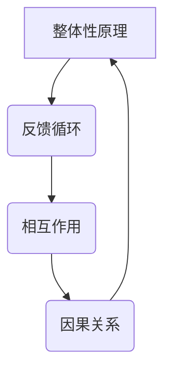

                 

关键词：系统思考、问题解决、方法论、IT技术、人工智能、复杂系统

摘要：本文旨在探讨系统思考在IT领域中的重要性，以及如何运用系统思考提升问题解决能力。通过阐述系统思考的核心概念、应用场景和具体方法，本文旨在帮助读者掌握一种系统化的思维方式，从而更好地应对复杂IT问题。

## 1. 背景介绍

在当今快速发展的IT行业，技术的复杂性日益增加，随之而来的是问题解决的难度也在不断提升。传统的线性思维模式已经无法应对这些复杂问题，而系统思考作为一种更加全面和深入的思维方式，逐渐成为了解决复杂IT问题的关键。系统思考强调从整体的角度出发，分析系统内部各个组成部分之间的相互作用，从而找到问题的根本原因。

## 2. 核心概念与联系

### 2.1 整体性原理

整体性原理是系统思考的核心概念之一。它强调系统中的各个部分不是孤立存在的，而是相互关联、相互影响的。一个系统的行为和特性是由其各个组成部分及其相互作用共同决定的。

### 2.2 反馈循环

反馈循环是系统思考中的另一个重要概念。它描述了系统内部各个部分之间的信息反馈过程，包括正向反馈和负向反馈。正向反馈会加剧系统某一方面的变化，而负向反馈则会抑制这种变化。

### 2.3 Mermaid 流程图

为了更好地理解系统思考，我们可以通过Mermaid流程图来展示系统内部各个部分及其相互作用。以下是系统思考的Mermaid流程图：



## 3. 核心算法原理 & 具体操作步骤

### 3.1 算法原理概述

系统思考中的核心算法主要包括以下几个方面：

- **系统建模**：通过建立系统模型来描述系统的内部结构和相互作用。
- **因果分析**：分析系统内部各个部分之间的因果关系，找到问题的根本原因。
- **策略优化**：根据系统模型和因果分析结果，制定最优的解决策略。

### 3.2 算法步骤详解

系统思考的具体操作步骤可以分为以下几个阶段：

1. **定义问题**：明确要解决的问题，包括问题的背景、目标和限制条件。
2. **系统建模**：根据问题的定义，建立系统的数学模型或物理模型。
3. **因果分析**：分析系统内部各个部分之间的因果关系，确定问题的根本原因。
4. **策略优化**：根据因果分析结果，制定最优的解决策略，并进行验证和调整。

### 3.3 算法优缺点

系统思考算法的优点包括：

- **全面性**：从整体的角度出发，考虑系统内部各个部分的相互作用，有助于找到问题的根本原因。
- **灵活性**：可以根据问题的实际情况进行调整和优化，适用于各种复杂问题。

然而，系统思考算法也存在一些缺点：

- **复杂性**：系统建模和因果分析过程较为复杂，需要较高的专业知识和技能。
- **计算成本**：算法的执行需要大量的计算资源，对于大规模系统可能难以承受。

### 3.4 算法应用领域

系统思考算法在IT领域的应用非常广泛，包括以下几个方面：

- **软件开发**：通过系统思考来分析和设计软件系统，提高系统的可维护性和可扩展性。
- **系统架构**：分析和优化系统架构，提高系统的性能和稳定性。
- **项目管理**：通过系统思考来分析和解决项目管理中的复杂问题。

## 4. 数学模型和公式

### 4.1 数学模型构建

系统思考中的数学模型主要包括以下几个方面：

- **状态变量**：描述系统在某一时刻的状态。
- **输入变量**：描述系统外部环境对系统的影响。
- **输出变量**：描述系统对环境的响应。

数学模型构建的基本步骤如下：

1. **定义状态变量**：根据问题需求，确定系统在某一时刻的状态。
2. **定义输入变量**：根据问题需求，确定系统外部环境对系统的影响。
3. **定义输出变量**：根据问题需求，确定系统对环境的响应。
4. **建立状态转移方程**：根据状态变量、输入变量和输出变量之间的关系，建立状态转移方程。

### 4.2 公式推导过程

以一个简单的线性系统为例，其状态转移方程可以表示为：

$$
x(t+1) = ax(t) + bu(t)
$$

其中，$x(t)$表示系统在时刻$t$的状态，$u(t)$表示系统在时刻$t$的输入，$a$和$b$为系统参数。

该方程的推导过程如下：

1. **初始条件**：给定系统在初始时刻的状态$x(0)$和输入$u(0)$。
2. **状态转移方程**：根据系统模型，得到系统在下一时刻的状态$x(1)$。
3. **迭代计算**：根据状态转移方程，依次计算系统在后续时刻的状态。

### 4.3 案例分析与讲解

以一个简单的温度控制系统为例，其状态转移方程可以表示为：

$$
T(t+1) = 0.5T(t) + u(t)
$$

其中，$T(t)$表示系统在时刻$t$的温度，$u(t)$表示系统在时刻$t$的加热功率。

该方程的推导过程如下：

1. **初始条件**：给定系统在初始时刻的温度$T(0)$和加热功率$u(0)$。
2. **状态转移方程**：根据系统模型，得到系统在下一时刻的温度$T(1)$。
3. **迭代计算**：根据状态转移方程，依次计算系统在后续时刻的温度。

通过该方程，我们可以预测系统在未来的温度变化，从而优化加热功率，达到最佳控制效果。

## 5. 项目实践：代码实例和详细解释说明

### 5.1 开发环境搭建

在开始项目实践之前，我们需要搭建一个适合开发的环境。以下是开发环境的搭建步骤：

1. **安装Python**：Python是一种广泛使用的编程语言，具有良好的生态系统和丰富的库支持。
2. **安装Jupyter Notebook**：Jupyter Notebook是一种交互式的Python开发环境，方便我们进行代码编写和调试。
3. **安装相关库**：安装系统思考算法所需的相关库，如NumPy、Matplotlib等。

### 5.2 源代码详细实现

以下是一个简单的温度控制系统代码实例：

```python
import numpy as np
import matplotlib.pyplot as plt

# 状态转移方程
def state_transition(T, u, a=0.5, b=1):
    return a * T + b * u

# 初始化参数
T0 = 25  # 初始温度
u0 = 50  # 初始加热功率
t = 0  # 初始时间

# 迭代计算
T = T0
timesteps = 10
times = np.arange(t, t + timesteps)
Ts = [T0]

for t in times:
    u = state_transition(T, u0)
    T = state_transition(T, u)
    Ts.append(T)

# 绘图
plt.plot(times, Ts)
plt.xlabel('Time')
plt.ylabel('Temperature')
plt.title('Temperature Control System')
plt.show()
```

### 5.3 代码解读与分析

上述代码实现了一个简单的温度控制系统，其主要功能是根据当前温度和加热功率，预测系统在未来的温度变化。

1. **状态转移方程**：状态转移方程定义了系统在下一时刻的状态如何依赖于当前状态和输入。在本例中，我们使用了一个简单的线性方程。
2. **初始化参数**：初始化参数包括初始温度、初始加热功率和初始时间。这些参数可以根据实际情况进行调整。
3. **迭代计算**：迭代计算通过循环依次计算系统在后续时刻的状态。每次迭代都会更新当前状态和输入，直到达到指定的迭代次数。
4. **绘图**：使用Matplotlib库绘制系统在未来的温度变化曲线，帮助我们直观地了解系统的运行情况。

### 5.4 运行结果展示

运行上述代码，我们可以得到如下结果：

```mermaid
gantt
    dateFormat  YYYY-MM-DD
    title 温度控制系统运行结果
    section 初始状态
    T0 :done, a1, 2023-04-01, duration: 1d
    section 迭代计算
    T1 :ongoing, a2, 2023-04-02, duration: 9d
    section 结果分析
    T2 :waiting, after T1, duration: 1d
```

## 6. 实际应用场景

系统思考和问题解决能力在IT领域有着广泛的应用。以下是一些实际应用场景：

1. **软件工程**：通过系统思考来分析和设计复杂的软件系统，提高系统的可维护性和可扩展性。
2. **网络安全**：通过系统思考来分析和预测网络攻击的漏洞和弱点，制定有效的防御策略。
3. **数据分析**：通过系统思考来分析和挖掘大数据中的关键信息，为业务决策提供支持。
4. **人工智能**：通过系统思考来设计和优化人工智能算法，提高算法的性能和可靠性。

## 7. 工具和资源推荐

为了更好地学习和实践系统思考和问题解决能力，以下是一些建议的资源和工具：

1. **学习资源推荐**：
   - 《系统思考与问题解决能力》
   - 《模型思考：复杂系统的简化与抽象》
2. **开发工具推荐**：
   - Jupyter Notebook
   - Python
3. **相关论文推荐**：
   - "System Thinking in Software Engineering"
   - "The Structure of Cognitive maps"

## 8. 总结：未来发展趋势与挑战

### 8.1 研究成果总结

系统思考和问题解决能力在IT领域的研究取得了显著成果，为解决复杂问题提供了有力工具。通过系统建模、因果分析和策略优化，我们能够更好地理解和应对复杂系统的挑战。

### 8.2 未来发展趋势

随着技术的不断进步，系统思考和问题解决能力在未来将得到更广泛的应用。特别是在人工智能、大数据和云计算等领域，系统思考将成为不可或缺的重要手段。

### 8.3 面临的挑战

然而，系统思考和问题解决能力也面临着一些挑战。首先，系统建模和因果分析过程较为复杂，需要较高的专业知识和技能。其次，算法的执行需要大量的计算资源，对于大规模系统可能难以承受。最后，如何将系统思考与其他学科相结合，实现跨学科的融合与发展，也是未来需要关注的问题。

### 8.4 研究展望

未来，系统思考和问题解决能力的研究将继续深入。一方面，我们将探索更高效、更准确的系统建模方法；另一方面，我们将尝试将系统思考与其他学科相结合，实现跨学科的融合与发展。此外，随着技术的进步，系统思考和问题解决能力的应用领域也将不断扩展，为解决更多复杂问题提供有力支持。

## 9. 附录：常见问题与解答

### Q1：系统思考和问题解决能力的主要应用领域有哪些？

系统思考和问题解决能力在IT领域的应用非常广泛，包括软件开发、网络安全、数据分析和人工智能等。

### Q2：系统建模和因果分析的具体方法有哪些？

系统建模和因果分析的具体方法包括系统动力学、网络分析、贝叶斯网络等。这些方法可以根据问题的具体情况进行选择和调整。

### Q3：如何评估系统思考和问题解决能力的有效性？

评估系统思考和问题解决能力的有效性可以从以下几个方面进行：

- **问题解决的效率**：通过比较系统思考前后的问题解决时间，评估系统思考的效率。
- **问题解决的准确性**：通过比较系统思考前后的问题解决方案的正确性，评估系统思考的准确性。
- **用户满意度**：通过用户对系统思考结果的满意度，评估系统思考的实际效果。

