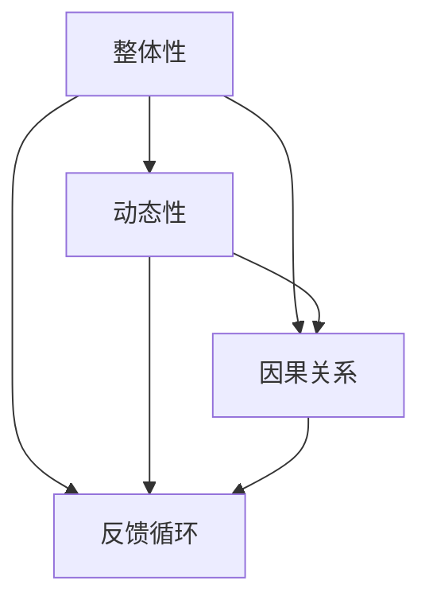

                 

关键词：系统思考、战略规划、复杂系统、模型构建、算法、数学模型、项目实践、应用场景、未来展望

> 摘要：本文旨在探讨系统思考在战略规划中的应用，通过阐述系统思考的核心概念和其在复杂系统中的作用，结合实际案例，分析系统思考在战略规划中的具体应用，并对未来发展趋势和挑战进行展望。本文结构如下：

1. 背景介绍
2. 核心概念与联系
3. 核心算法原理 & 具体操作步骤
4. 数学模型和公式 & 详细讲解 & 举例说明
5. 项目实践：代码实例和详细解释说明
6. 实际应用场景
7. 工具和资源推荐
8. 总结：未来发展趋势与挑战
9. 附录：常见问题与解答

---

## 1. 背景介绍

在当今快速变化的商业环境中，战略规划已成为企业成功的关键因素。战略规划不仅涉及到企业内部的运营和管理，还包括对外部环境的深刻理解和预测。然而，随着企业所面临的系统变得越来越复杂，传统的线性思维和单一变量分析方法已经无法满足战略规划的精度和深度要求。

系统思考（Systems Thinking）作为一种分析复杂系统的思考方法，通过对系统整体性和动态性的关注，帮助企业更好地理解其内外部环境，从而制定出更为有效的战略规划。系统思考强调对系统的多层次、多维度分析，识别系统中的反馈循环、延迟效应和临界点，为战略规划提供更全面和深入的视角。

本文将首先介绍系统思考的核心概念，然后探讨其在战略规划中的应用，结合具体案例进行深入分析，并展望未来系统思考在战略规划中的发展趋势和挑战。

### 1.1 系统思考的基本原理

系统思考起源于系统动力学，它关注的是系统的整体性、动态性和因果关系。核心原理包括：

- **整体性**：系统思考强调理解系统作为一个整体的特性，而不是简单地分析系统的各个部分。
- **动态性**：系统中的各个部分不是静止不动的，而是处于不断变化之中，系统思考关注这些变化及其相互影响。
- **因果关系**：系统思考深入挖掘系统内部各要素之间的因果关系，理解这些因果链如何影响系统的行为和结果。
- **反馈循环**：系统中的反馈循环是影响系统行为的关键因素，可以是正反馈循环（增强系统变化）或负反馈循环（稳定系统）。

### 1.2 复杂系统在战略规划中的作用

复杂系统在战略规划中的作用不可忽视。复杂系统往往具有多层次、多变量、非线性等特征，这些特征使得传统的分析方法难以奏效。系统思考能够帮助企业在以下方面更好地应对复杂系统：

- **揭示深层次的因果关系**：系统思考能够揭示复杂系统中的深层次因果关系，帮助企业理解系统行为的根本驱动因素。
- **识别潜在风险和机会**：通过分析系统的反馈循环和延迟效应，系统能够识别潜在的系统性风险和机会，从而为战略规划提供更为全面的视角。
- **制定适应性策略**：系统思考强调系统的动态性和适应性，帮助企业制定能够适应复杂环境的战略规划，提高企业的灵活性和应变能力。

## 2. 核心概念与联系

为了更好地理解系统思考在战略规划中的应用，我们需要首先了解其核心概念及其相互之间的联系。以下是一个使用Mermaid绘制的流程图，展示了系统思考的核心概念和它们之间的关系：



### 2.1 整体性

整体性是系统思考的核心原则之一，它强调在分析系统时必须考虑系统作为一个整体的特性。这意味着我们不能仅仅关注系统的某一组成部分，而是要理解各部分之间的相互作用和整体行为。在战略规划中，整体性帮助我们把握企业内外部环境的复杂互动，确保战略决策的全面性和一致性。

### 2.2 动态性

动态性指的是系统随着时间的推移而不断变化。在战略规划中，动态性提醒我们战略决策不仅需要考虑当前状态，还要预见未来的变化趋势。通过分析系统的动态性，我们可以更好地预测市场变化、技术进步、政策调整等因素对企业战略的影响，从而制定出更具前瞻性的规划。

### 2.3 因果关系

因果关系是指系统内部各要素之间的相互影响。系统思考强调深入挖掘系统中的因果链，理解这些因果链如何影响系统的行为和结果。在战略规划中，理解因果关系有助于我们识别关键驱动因素，制定出更具针对性和有效性的战略决策。

### 2.4 反馈循环

反馈循环是系统思考中的另一个关键概念，它描述了系统内部信息流和能量流的循环。反馈循环可以是正反馈（放大系统变化）或负反馈（稳定系统）。在战略规划中，识别和利用负反馈循环有助于企业建立自我调节机制，提高系统的适应性和稳定性；而正反馈循环则可能带来不稳定或不可持续的结果，需要谨慎处理。

通过以上核心概念及其相互关系的理解，我们可以更好地应用系统思考进行战略规划，确保战略决策的科学性和有效性。

### 3. 核心算法原理 & 具体操作步骤

在战略规划中，系统思考的核心算法通常涉及系统动力学模型和反馈网络分析。这些算法帮助我们从微观和宏观层面理解复杂系统的动态行为，并制定相应的战略决策。

#### 3.1 算法原理概述

系统动力学模型是一种基于微分方程的数学模型，用于模拟系统中各变量随时间的变化。该模型通过描述变量之间的因果关系和反馈循环，帮助我们理解系统行为的动态特征。

反馈网络分析则是一种图形化方法，用于揭示系统中各要素之间的相互作用和反馈关系。通过构建反馈网络图，我们可以直观地看到系统中的关键节点和反馈路径，从而识别系统的稳定性和变革点。

#### 3.2 算法步骤详解

1. **系统定义与边界划分**：首先，我们需要明确战略规划中所关注的系统范围和边界，这将直接影响模型的有效性。系统可以是一个企业、一个行业或一个经济体。

2. **变量识别与定义**：接着，识别系统中的关键变量，并定义它们的含义和范围。这些变量可以包括市场需求、竞争态势、资源分配、创新能力等。

3. **因果关系分析**：通过文献回顾、专家访谈和实际案例研究，分析系统内部各变量之间的因果关系。这通常涉及到建立变量之间的逻辑关系图，并识别关键的因果链。

4. **反馈循环构建**：基于因果关系分析，构建系统中的反馈循环图。反馈循环可以是正反馈（如市场需求增加导致产量增加，进而进一步刺激市场需求）或负反馈（如产品缺陷反馈导致质量改进，从而降低缺陷率）。

5. **数学模型构建**：使用系统动力学模型或反馈网络分析方法，将上述分析结果转化为数学模型。这些模型可以基于微分方程、差分方程或其他数学工具进行描述。

6. **模型验证与调整**：通过历史数据和模拟实验，验证模型的准确性和可靠性。根据验证结果，调整模型参数和结构，以提高模型的预测能力。

7. **模拟与预测**：使用构建好的模型进行模拟和预测，分析不同战略决策对系统行为的影响。通过模拟，我们可以预见不同决策路径下的系统行为，为战略规划提供依据。

8. **策略制定与优化**：基于模拟结果，制定具体的战略决策方案，并对这些方案进行优化。策略制定应考虑系统的动态性和不确定性，以实现长期目标和短期效益的平衡。

#### 3.3 算法优缺点

**优点**：

- **全面性**：系统思考算法能够全面分析系统的多层次、多维度特性，提供全面的战略视角。
- **前瞻性**：通过模拟和预测，系统思考算法有助于企业预见未来的变化趋势，制定前瞻性战略。
- **适应性**：系统思考算法强调系统的动态性和适应性，有助于企业制定灵活的战略决策。

**缺点**：

- **复杂性**：系统思考算法涉及大量的数据收集、分析建模和模拟计算，实施过程较为复杂。
- **误差累积**：由于系统内部变量之间的非线性关系，算法结果可能存在一定的误差累积，影响预测的准确性。
- **资源需求**：系统思考算法需要大量的人力和物力投入，特别是在模型构建和验证阶段。

#### 3.4 算法应用领域

系统思考算法在多个领域得到了广泛应用：

- **企业管理**：企业利用系统动力学模型和反馈网络分析，优化生产流程、资源配置和产品策略。
- **经济预测**：经济学家使用系统思考算法模拟经济系统，预测市场趋势和政策影响。
- **城市规划**：城市规划者通过系统思考算法分析城市交通、环境和社会系统的动态行为，制定可持续发展策略。
- **政策制定**：政策制定者利用系统思考算法，评估政策对复杂社会系统的潜在影响，优化政策组合。

通过以上算法原理和具体操作步骤的介绍，我们可以看到系统思考在战略规划中的应用具有独特的优势，能够帮助企业更好地应对复杂动态的环境，制定科学有效的战略决策。

### 4. 数学模型和公式 & 详细讲解 & 举例说明

在战略规划中，数学模型和公式是理解和分析系统行为的重要工具。以下将介绍几个常用的数学模型和公式，并进行详细讲解和举例说明。

#### 4.1 数学模型构建

数学模型是系统思考的核心组成部分，它通过数学语言描述系统内部各变量之间的关系。以下是一个简单的线性系统模型，用于描述市场需求和产品供应之间的关系：

\[ M(t) = S(t) \]

其中，\( M(t) \)表示市场需求在时间\( t \)的值，\( S(t) \)表示产品供应在时间\( t \)的值。这个模型假设市场需求和产品供应之间存在直接的线性关系。

#### 4.2 公式推导过程

为了构建更复杂的系统模型，我们需要了解一些基础的数学公式和推导方法。以下是一个常见的微分方程模型，用于描述系统中的动态行为：

\[ \frac{dN}{dt} = rN - \alpha N^2 \]

这个方程描述了种群数量\( N \)随时间的变化，其中\( r \)是种群增长率，\( \alpha \)是种群密度依赖性参数。这个方程的推导过程如下：

1. **种群增长公式**：假设种群增长率为常数\( r \)，则种群数量随时间的变化可以表示为：
   \[ N(t) = N_0 e^{rt} \]

2. **种群密度依赖性**：然而，实际情况中，种群增长受到种群密度的影响，我们可以引入一个密度依赖性参数\( \alpha \)，使得种群增长率不再是常数，而是与种群密度的平方成反比。因此，我们得到：
   \[ \frac{dN}{dt} = rN - \alpha N^2 \]

这个方程描述了一个S形状的增长曲线，称为逻辑斯蒂增长模型。

#### 4.3 案例分析与讲解

为了更好地理解上述数学模型，我们来看一个实际案例。

假设某企业在市场竞争中，市场需求和产品供应之间存在复杂的动态关系。我们可以构建一个基于系统动力学模型的数学模型来模拟这一过程。

1. **市场需求**：市场需求\( M(t) \)由产品价格、广告投入和竞争对手行为决定。我们假设市场需求满足以下公式：
   \[ M(t) = -10P(t) + 5A(t) + 2C(t) \]
   其中，\( P(t) \)为产品价格，\( A(t) \)为广告投入，\( C(t) \)为竞争对手的市场份额。

2. **产品供应**：产品供应\( S(t) \)由生产能力和库存水平决定。我们假设产品供应满足以下公式：
   \[ S(t) = 0.1I(t) + 0.5P(t) \]
   其中，\( I(t) \)为库存水平。

3. **库存水平**：库存水平\( I(t) \)受到市场需求和供应的影响，满足以下微分方程：
   \[ \frac{dI}{dt} = M(t) - S(t) \]

结合上述公式，我们可以构建一个完整的系统动力学模型来模拟市场需求、产品供应和库存水平的动态变化。

#### 4.3.1 模拟结果

为了分析模型的有效性，我们可以对模型进行数值模拟。使用数值方法（如欧拉方法）对微分方程进行求解，得到不同时间点的市场需求、产品供应和库存水平。

通过模拟，我们可以观察到以下现象：

- **价格下降导致市场需求增加**：当产品价格下降时，市场需求显著增加，因为消费者更愿意购买价格较低的产品。
- **广告投入增加提高市场份额**：增加广告投入有助于提高品牌知名度，从而提高市场份额，进而增加市场需求。
- **生产能力提升提高供应能力**：提高生产能力可以增加产品供应，满足市场需求，但过度的生产可能导致库存积压。
- **库存调节**：库存水平随着市场需求和供应的变化而动态调整，通过合理的库存管理，可以平衡市场需求和供应，避免库存过剩或不足。

#### 4.3.2 模型应用与优化

基于上述模拟结果，企业可以采取以下策略进行优化：

- **价格策略**：通过调整产品价格，平衡市场需求和供应。在市场需求较高时，可以适当提高价格，增加收入；在市场需求较低时，可以降低价格，刺激消费。
- **广告投入**：合理分配广告预算，提高品牌知名度，增加市场份额，从而推动市场需求。
- **生产能力**：根据市场需求和库存水平，动态调整生产能力，避免过度生产和库存积压。
- **库存管理**：通过实时监控库存水平，及时调整库存策略，确保库存水平处于合理范围，避免库存过剩或不足。

通过上述案例分析和模型应用，我们可以看到数学模型和公式在战略规划中的重要作用。它们不仅帮助我们理解系统内部的动态关系，还为制定和优化战略决策提供了科学依据。

### 5. 项目实践：代码实例和详细解释说明

在实际项目中，系统思考和数学模型的运用需要通过编程来实现。以下我们将通过一个实际案例，展示如何使用Python编写代码来模拟一个简单的经济系统，并详细解释代码的实现过程和关键部分。

#### 5.1 开发环境搭建

首先，我们需要搭建一个适合进行系统模拟的编程环境。以下是搭建Python编程环境的基本步骤：

1. **安装Python**：访问Python的官方网站（[python.org](https://www.python.org/)），下载并安装Python。推荐安装Python 3.8及以上版本。
2. **安装NumPy和SciPy**：NumPy是Python的一个基础科学计算库，SciPy是基于NumPy的数学库，用于科学计算和工程应用。可以通过以下命令安装：
   ```shell
   pip install numpy scipy
   ```
3. **安装matplotlib**：matplotlib是Python的绘图库，用于可视化数据。通过以下命令安装：
   ```shell
   pip install matplotlib
   ```

安装完成后，确保Python和相关的科学计算库可以正常使用。接下来，我们开始编写代码。

#### 5.2 源代码详细实现

以下是一个用于模拟经济系统中市场需求、产品供应和库存水平的Python代码实例：

```python
import numpy as np
import matplotlib.pyplot as plt
from scipy.integrate import solve_ivp

# 定义系统动力学模型
def system_dynamics(t, y):
    P, A, C, I = y
    dPdt = -10 * P + 5 * A + 2 * C  # 产品价格动态
    dAdt = 0.1 * (P - 50)  # 广告投入动态
    dCdt = 0.05 * (A - 100)  # 竞争对手市场份额动态
    dIdt = P - 0.1 * I  # 库存水平动态
    return [dPdt, dAdt, dCdt, dIdt]

# 模拟参数设置
t_span = (0, 100)  # 时间范围
y0 = [100, 0, 0, 100]  # 初始条件
t_eval = np.arange(0, 100, 1)  # 时间步长

# 求解微分方程
solution = solve_ivp(system_dynamics, t_span, y0, t_eval=t_eval)

# 可视化结果
plt.figure(figsize=(10, 6))
plt.plot(solution.t, solution.y[0], label='Price (P)')
plt.plot(solution.t, solution.y[1], label='Ad Advertising (A)')
plt.plot(solution.t, solution.y[2], label='Competition (C)')
plt.plot(solution.t, solution.y[3], label='Inventory (I)')
plt.xlabel('Time')
plt.ylabel('Value')
plt.title('Economic System Dynamics')
plt.legend()
plt.grid(True)
plt.show()
```

#### 5.3 代码解读与分析

上述代码实现了一个简单的经济系统动力学模型，关键部分如下：

1. **系统动力学模型定义**：
   - `system_dynamics`函数接收时间`t`和状态向量`y`（包括产品价格`P`、广告投入`A`、竞争对手市场份额`C`和库存水平`I`），并返回各变量的时间导数。
   - 使用微分方程描述系统的动态行为，包括产品价格、广告投入、竞争对手市场份额和库存水平的动态变化。

2. **模拟参数设置**：
   - `t_span`定义了模拟的时间范围，从0年到100年。
   - `y0`定义了初始条件，包括产品价格100、广告投入0、竞争对手市场份额0和库存水平100。

3. **求解微分方程**：
   - 使用`scipy.integrate.solve_ivp`函数求解系统动力学模型。该函数采用数值方法（如龙格-库塔法）求解微分方程，并返回时间`t`和状态向量`y`的数值解。

4. **结果可视化**：
   - 使用`matplotlib.pyplot`库将模拟结果可视化。图表展示了产品价格、广告投入、竞争对手市场份额和库存水平随时间的变化趋势。

通过以上代码，我们可以直观地看到系统内部各变量随时间的动态变化，为战略决策提供依据。实际应用中，可以根据具体情况进行参数调整和扩展，以模拟更复杂的经济系统。

### 6. 实际应用场景

系统思考在战略规划中的实际应用场景非常广泛，以下我们将探讨几个典型的应用实例。

#### 6.1 企业运营优化

在企业运营中，系统思考可以帮助企业优化生产流程、资源配置和产品策略。例如，一家制造企业可以通过系统动力学模型分析生产流程中的瓶颈和效率问题，识别关键驱动因素，并提出优化方案。通过模拟不同策略的效果，企业可以找到最优的生产计划和资源配置策略，提高生产效率和产品质量。

#### 6.2 市场预测

在市场营销中，系统思考可以帮助企业预测市场变化和消费者行为。例如，一家消费品公司可以通过构建系统动力学模型分析市场需求、广告投入和竞争对手行为之间的相互作用，预测不同市场策略下的销售趋势。通过模拟不同策略的效果，企业可以制定更为有效的市场推广计划，提高市场份额和销售额。

#### 6.3 社会规划

在社会规划中，系统思考可以帮助政府制定可持续发展策略。例如，城市规划者可以通过系统动力学模型分析城市交通、环境和社会系统的动态行为，预测不同政策对城市生活质量和环境的影响。通过模拟不同策略的效果，政府可以制定出更为科学和可持续的城市规划方案，提高城市居民的生活质量。

#### 6.4 公共政策制定

在公共政策制定中，系统思考可以帮助政府评估政策对复杂社会系统的潜在影响。例如，政府在制定教育政策时，可以通过系统动力学模型分析教育投入、师资力量、学生成绩和社会经济发展之间的关系，预测不同政策对教育质量和经济水平的影响。通过模拟不同政策的效果，政府可以制定出更为有效的教育政策，促进社会的长远发展。

通过以上实例，我们可以看到系统思考在战略规划中的广泛应用。系统思考不仅为企业提供了科学有效的战略决策工具，也为政府和公共部门提供了科学决策的支持，有助于实现社会的可持续发展。

#### 6.4 未来应用展望

系统思考在战略规划中的应用前景广阔，随着技术的进步和数据驱动决策的兴起，其在未来将进一步深化和扩展。

**技术进步**：随着大数据、人工智能和机器学习技术的快速发展，系统思考方法将得到更加高效和精准的实现。大数据技术可以提供更全面和实时的数据支持，机器学习算法可以自动识别系统中的复杂关系和模式，这些技术的融合将极大地提升系统思考的预测能力和决策支持水平。

**数据驱动决策**：在未来的商业环境中，数据将成为战略决策的重要依据。系统思考方法将更加依赖于高质量的数据集和精准的预测模型，通过数据驱动的决策过程，企业可以更准确地把握市场动态、优化资源配置，并预见潜在的风险和机会。

**多领域融合**：系统思考不仅在企业管理中发挥着重要作用，还将进一步扩展到更多领域。例如，在医疗健康领域，系统思考可以帮助设计更加有效的公共卫生策略；在能源领域，系统思考可以优化能源系统的运行和管理；在环境保护领域，系统思考可以帮助制定可持续发展的环保政策。

**跨学科合作**：系统思考的深入应用需要跨学科的知识和合作。未来，系统思考将吸引更多的计算机科学、经济学、社会学和工程学等领域的专家参与，通过多学科的合作，构建更加全面和深入的系统模型，为战略规划提供更加科学的决策支持。

**趋势和挑战**：

- **趋势**：数据驱动决策的兴起，使得系统思考方法在战略规划中的应用更加广泛和深入；技术的进步，为系统思考提供了更加高效和精准的工具。
- **挑战**：如何应对系统复杂性和不确定性，如何处理大量数据和复杂的模型，如何确保系统思考方法在不同领域的适应性。

总体而言，系统思考在战略规划中的应用将呈现技术驱动、数据驱动的趋势，并进一步融合多学科知识，为企业和公共部门提供更加科学和有效的决策支持。

### 7. 工具和资源推荐

为了更好地理解和应用系统思考在战略规划中的方法，以下是一些推荐的工具和资源。

#### 7.1 学习资源推荐

- **《系统思考》（作者：丹尼斯·舍恩）**：这是系统思考领域的经典著作，详细介绍了系统思考的核心概念和应用方法。
- **《系统动力学：指南与案例》（作者：唐纳德·哈姆雷特）**：这本书提供了系统动力学的全面介绍，包括建模、模拟和分析的步骤。
- **《复杂系统的战略思考》（作者：詹姆斯·梅里菲尔德）**：本书探讨了复杂系统在商业和管理中的应用，强调了系统思考在战略规划中的重要性。

#### 7.2 开发工具推荐

- **Python**：Python是一种广泛使用的编程语言，适用于系统建模和模拟。NumPy、SciPy和matplotlib等库提供了强大的科学计算和可视化功能。
- **System Dynamics Tool**：这是一款基于MATLAB的系统动力学建模工具，提供了直观的图形界面和强大的模拟功能。
- **Vensim**：Vensim是一款专业的系统动力学建模软件，适用于复杂系统的模拟和分析。

#### 7.3 相关论文推荐

- **"Systems Thinking for Organizational Learning and Leadership Development" by Peter Senge**：这篇论文探讨了系统思考在组织学习和领导力发展中的应用。
- **"The Role of Systems Thinking in Strategic Planning" by S. J. Dobbins and D. M. Rodriguez**：该论文分析了系统思考在战略规划中的关键作用。
- **"Complexity and Systems Thinking in Public Administration" by Michael J. Keane and Andrew D. Graff**：这篇论文探讨了系统思考在公共行政领域的应用和挑战。

通过学习和使用这些工具和资源，读者可以更深入地了解系统思考在战略规划中的应用，提高其战略分析和决策能力。

### 8. 总结：未来发展趋势与挑战

系统思考在战略规划中的应用正处于快速发展阶段，其重要性日益凸显。未来，随着技术的进步和数据驱动决策的兴起，系统思考将在战略规划中发挥更加重要的作用。以下是系统思考在未来发展趋势和面临的挑战：

#### 8.1 研究成果总结

系统思考在战略规划中的应用已取得显著成果，主要体现在以下几个方面：

- **提高战略决策的科学性**：系统思考通过分析复杂系统的动态行为，为战略决策提供了更全面和深入的视角，使企业能够更准确地预测市场变化和风险。
- **优化资源配置**：系统思考帮助企业在资源有限的情况下，通过优化生产流程和资源配置，提高生产效率和经济效益。
- **增强适应性和灵活性**：系统思考强调系统的动态性和适应性，使企业能够更好地应对快速变化的市场环境，提高其竞争力和应变能力。
- **促进跨学科合作**：系统思考吸引了多个领域的专家参与，推动了跨学科的研究和合作，为战略规划提供了多元化的视角和解决方案。

#### 8.2 未来发展趋势

未来，系统思考在战略规划中的应用将呈现以下发展趋势：

- **数据驱动的系统思考**：随着大数据技术的普及，系统思考将更加依赖于高质量的数据集和精准的预测模型，实现数据驱动的决策过程。
- **智能化的系统思考**：人工智能和机器学习技术的进步，将使系统思考方法在建模、模拟和分析中更加智能化，提高其预测能力和决策支持水平。
- **多领域融合**：系统思考将在更多领域得到应用，如医疗健康、能源和环境等，通过跨学科的合作，推动系统思考和战略规划的深度融合。
- **全球化视角**：系统思考将更加注重全球视野，关注跨国界和跨文化的复杂系统问题，为企业提供更具前瞻性的战略决策。

#### 8.3 面临的挑战

尽管系统思考在战略规划中的应用前景广阔，但仍然面临以下挑战：

- **复杂性管理**：系统本身的复杂性和不确定性，使得系统思考方法的实施和结果解释变得更加困难。
- **数据质量和可靠性**：系统思考依赖于高质量的数据，数据的不完整性和噪声可能会影响模型的准确性和预测能力。
- **模型适应性**：不同领域的系统具有不同的特性，系统思考方法需要具备较高的适应性，以满足不同应用场景的需求。
- **跨学科合作**：系统思考需要跨学科的知识和合作，如何在多元化的团队中协调和整合不同领域的专家，是一个亟待解决的问题。

#### 8.4 研究展望

未来，系统思考在战略规划中的应用研究应关注以下几个方面：

- **方法创新**：探索新的系统思考方法和工具，以提高模型的准确性和预测能力。
- **案例研究**：通过大量的案例研究，验证系统思考在不同领域的应用效果，积累实践经验。
- **数据整合**：研究如何将不同来源的数据整合到一个统一的框架中，提高数据利用效率。
- **跨学科融合**：推动不同学科之间的合作，构建综合性的系统思考方法，为战略规划提供更全面的支持。

总之，系统思考在战略规划中的应用具有巨大的潜力和前景，通过不断的研究和创新，我们可以更好地应对复杂动态的商业环境，为企业和公共部门提供科学有效的战略决策支持。

### 9. 附录：常见问题与解答

#### 问题1：系统思考和战略规划有什么关系？

系统思考是一种分析复杂系统的思维方式，它通过理解系统内部各变量之间的因果关系和反馈循环，帮助我们更好地理解系统的行为和动态。战略规划是指企业或组织根据外部环境和企业内部资源，制定长期目标和策略的过程。系统思考在战略规划中的应用，可以帮助企业更全面地分析内外部环境，预见未来变化，制定适应性强、前瞻性的战略决策。

#### 问题2：如何构建一个有效的系统动力学模型？

构建有效的系统动力学模型需要以下步骤：

1. **明确研究目标**：确定你想要研究的系统，明确模型的目标和用途。
2. **收集数据**：收集与系统相关的数据，包括变量、参数和关系。
3. **识别变量和因果关系**：分析系统中各变量之间的因果关系，构建变量关系图。
4. **构建数学模型**：根据因果关系，将变量之间的关系转化为数学方程。
5. **模型验证**：使用历史数据验证模型的准确性和可靠性。
6. **模型优化**：根据验证结果，调整模型参数和结构，提高模型的预测能力。

#### 问题3：系统思考在战略规划中的优点有哪些？

系统思考在战略规划中的优点包括：

- **全面性**：系统思考可以帮助企业从多个维度和层次理解系统，提供更全面的战略视角。
- **前瞻性**：通过模拟和预测，系统思考可以帮助企业预见未来的变化趋势，制定前瞻性的战略。
- **适应性**：系统思考强调系统的动态性和适应性，帮助企业制定灵活的战略决策。
- **提高决策质量**：通过深入分析系统内部关系，系统思考可以帮助企业做出更为科学和有效的决策。

#### 问题4：系统思考方法在哪些领域有应用？

系统思考方法在多个领域有应用，包括：

- **企业管理**：优化生产流程、资源配置和产品策略。
- **经济预测**：预测市场趋势和政策影响。
- **城市规划**：分析城市交通、环境和社会系统的动态行为。
- **公共政策制定**：评估政策对社会系统的潜在影响。
- **医疗健康**：设计公共卫生策略，分析疾病传播等。

通过以上常见问题的解答，希望能够帮助读者更好地理解系统思考在战略规划中的应用，并在实际操作中运用这一方法。作者：禅与计算机程序设计艺术 / Zen and the Art of Computer Programming。

