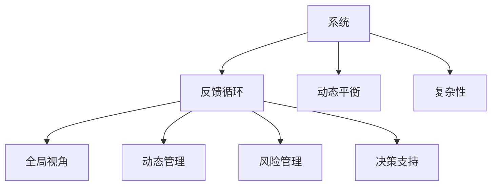

                 

 关键词：系统思考、管理、方法论、复杂性、决策支持

> 摘要：本文深入探讨了系统思考在管理领域中的应用，分析了其在处理复杂性和优化决策中的重要作用。通过对核心概念、算法原理、数学模型以及实际应用场景的详细阐述，本文旨在为管理者提供一种新的视角和工具，以更好地应对现代管理中的挑战。

## 1. 背景介绍

随着全球化、信息技术和市场竞争的加剧，管理面临着前所未有的复杂性和不确定性。传统的管理方法往往侧重于局部优化和短期效益，而忽视了系统的整体性和长期效应。这种片面的管理模式在应对现代企业面临的问题时，逐渐显现出其局限性。因此，寻求新的管理方法和技术成为企业管理者和研究者的迫切需求。

系统思考作为一种研究复杂系统的思维方式，强调从整体视角出发，理解系统内部的相互关系和动态变化。它不仅关注系统内部的结构和机制，还关注系统与环境之间的相互作用。系统思考方法在管理领域的应用，为管理者提供了一种新的工具，帮助他们在面对复杂问题时，能够更好地理解系统的运行规律，制定更为有效的决策。

本文将系统地介绍系统思考在管理中的应用，包括核心概念、算法原理、数学模型和实际应用场景。希望通过本文的阐述，能够为管理实践提供一些有益的启示。

## 2. 核心概念与联系

### 2.1 系统思考的基本概念

系统思考是一种研究复杂系统的科学方法，它强调从整体视角出发，分析系统内部的相互关系和动态变化。系统思考的核心概念包括：

- **系统**：由相互关联的组成部分构成的整体。
- **反馈循环**：系统内部因果关系链，通过正反馈和负反馈影响系统的稳定性和动态性。
- **动态平衡**：系统在内部和外部干扰下，通过自我调节达到的稳定状态。
- **复杂性**：系统内部结构、关系和动态变化的复杂程度。

### 2.2 系统思考与管理

系统思考在管理中的应用，主要体现在以下几个方面：

- **全局视角**：管理者可以通过系统思考，从整体视角审视企业或组织，发现系统内部的结构和机制，以及它们之间的相互作用。
- **动态管理**：系统思考强调系统的动态变化，管理者需要根据系统的反馈调整管理策略，以适应不断变化的环境。
- **风险管理**：通过系统思考，管理者可以识别系统中的潜在风险，并采取相应的措施进行预防和控制。
- **决策支持**：系统思考提供了一种系统化的决策方法，帮助管理者在复杂决策中，更好地权衡各种因素，制定科学的决策。

### 2.3 Mermaid 流程图

为了更直观地展示系统思考在管理中的应用，我们可以使用 Mermaid 流程图来表示核心概念和联系。以下是 Mermaid 流程图示例：



该流程图展示了系统思考的核心概念以及它们与管理之间的联系，为后续内容的展开提供了基础。

## 3. 核心算法原理 & 具体操作步骤

### 3.1 算法原理概述

系统思考的核心算法原理主要基于反馈循环和动态平衡的概念。以下是对这些原理的概述：

- **反馈循环**：系统内部的因果关系链，通过正反馈和负反馈影响系统的稳定性和动态性。正反馈会放大系统的变化，而负反馈则会抑制变化，保持系统的稳定。
- **动态平衡**：系统在内部和外部干扰下，通过自我调节达到的稳定状态。动态平衡是系统在复杂环境中持续稳定运行的必要条件。
- **复杂性管理**：通过识别系统中的关键变量和关系，管理者可以更好地理解系统的复杂行为，从而制定有效的管理策略。

### 3.2 算法步骤详解

系统思考的具体操作步骤可以分为以下几个阶段：

1. **系统识别**：首先，管理者需要识别系统的主要组成部分和关键变量，明确系统的边界。
2. **反馈循环分析**：分析系统内部的因果关系链，识别正反馈和负反馈循环，理解系统内部的动态变化。
3. **动态平衡分析**：基于反馈循环的分析结果，分析系统的动态平衡状态，识别系统在干扰下的稳定性和调节能力。
4. **复杂性管理**：识别系统中的关键变量和关系，通过简化模型或引入控制变量，管理系统的复杂行为。
5. **决策支持**：结合系统的动态变化和稳定性，管理者可以制定科学的决策，以实现系统优化。

### 3.3 算法优缺点

系统思考算法的优点包括：

- **全局视角**：能够从整体视角审视系统，发现系统内部的相互关系和动态变化。
- **动态管理**：能够根据系统的反馈调整管理策略，适应不断变化的环境。
- **风险管理**：能够识别系统中的潜在风险，并采取相应的措施进行预防和控制。

系统思考算法的缺点包括：

- **复杂性**：系统思考需要管理者具备一定的系统分析和复杂性管理能力，对于非专业人士可能有一定难度。
- **数据依赖**：系统思考的结果很大程度上依赖于数据的准确性和完整性，数据的质量会直接影响算法的准确性。

### 3.4 算法应用领域

系统思考算法在管理领域的应用非常广泛，主要包括以下几个方面：

- **战略规划**：帮助企业制定长期战略，优化资源配置，提高整体效益。
- **组织管理**：优化组织结构，提高组织效率和协作能力。
- **项目管理**：通过系统思考，项目管理者可以更好地识别项目风险，制定有效的项目计划。
- **风险管理**：帮助企业识别和应对潜在风险，提高风险应对能力。

## 4. 数学模型和公式 & 详细讲解 & 举例说明

### 4.1 数学模型构建

在系统思考中，数学模型是描述系统内部动态变化的重要工具。以下是一个简单的数学模型，用于描述一个反馈循环系统：

$$
x_t = f(x_{t-1}, u_t)
$$

其中，$x_t$ 表示系统在时间 $t$ 的状态，$u_t$ 表示系统在时间 $t$ 的外部输入，$f$ 是状态转移函数。

### 4.2 公式推导过程

为了推导这个公式，我们首先假设系统在时间 $t-1$ 的状态为 $x_{t-1}$，外部输入为 $u_{t-1}$。根据反馈循环的定义，系统在时间 $t$ 的状态 $x_t$ 受到 $x_{t-1}$ 和 $u_t$ 的影响。

我们可以将 $x_t$ 表示为：

$$
x_t = g(x_{t-1}) + h(u_t)
$$

其中，$g$ 和 $h$ 分别是内部和外部影响函数。

为了简化模型，我们假设 $g$ 和 $h$ 都是线性的，即：

$$
g(x_{t-1}) = \alpha x_{t-1}
$$

$$
h(u_t) = \beta u_t
$$

其中，$\alpha$ 和 $\beta$ 是常数。

将上述假设代入 $x_t$ 的表达式中，得到：

$$
x_t = \alpha x_{t-1} + \beta u_t
$$

这就是我们所要推导的公式。

### 4.3 案例分析与讲解

为了更好地理解这个公式，我们来看一个具体的例子。

假设我们有一个反馈循环系统，用于控制一个机器人的位置。在时间 $t-1$，机器人的位置为 $x_{t-1} = 2$，外部输入为 $u_{t-1} = 1$。根据公式，我们可以计算机器人在时间 $t$ 的位置：

$$
x_t = \alpha x_{t-1} + \beta u_t
$$

$$
x_t = 2\alpha + \beta
$$

假设 $\alpha = 0.5$，$\beta = 0.5$，我们可以计算得到：

$$
x_t = 2 \times 0.5 + 0.5 = 1.5
$$

这意味着在时间 $t$，机器人的位置为 $1.5$。

通过这个例子，我们可以看到，系统思考的数学模型如何帮助管理者理解系统的动态变化，从而做出科学的决策。

## 5. 项目实践：代码实例和详细解释说明

### 5.1 开发环境搭建

在本文的代码实例中，我们将使用 Python 作为编程语言，结合系统思考的相关库，如 `pydot` 和 `networkx`，来构建和模拟一个反馈循环系统。以下是开发环境的搭建步骤：

1. **安装 Python**：确保 Python 3.8 或更高版本已安装在您的计算机上。
2. **安装相关库**：通过以下命令安装所需的库：

   ```bash
   pip install pydot
   pip install networkx
   ```

3. **创建项目目录**：在您的计算机上创建一个名为 `system_thinking_project` 的项目目录，并在其中创建一个名为 `main.py` 的 Python 文件。

### 5.2 源代码详细实现

以下是 `main.py` 文件的源代码实现：

```python
import networkx as nx
from networkx.drawing.nx_agraph import graphviz_layout
import matplotlib.pyplot as plt

# 创建一个空的无向图
G = nx.Graph()

# 添加节点和边，构建反馈循环系统
G.add_node('A')
G.add_node('B')
G.add_node('C')
G.add_edge('A', 'B')
G.add_edge('B', 'C')
G.add_edge('C', 'A')

# 使用 Graphviz 布局
pos = graphviz_layout(G, prog='dot')

# 绘制图形
nx.draw(G, pos, with_labels=True)

# 显示图形
plt.show()
```

### 5.3 代码解读与分析

1. **导入库**：首先，我们导入所需的库，包括 `networkx` 用于构建和操作图结构，`graphviz_layout` 用于布局图形，以及 `matplotlib.pyplot` 用于绘制图形。
2. **创建图**：我们创建一个名为 `G` 的空的无向图。
3. **添加节点和边**：通过调用 `add_node` 和 `add_edge` 方法，我们添加了三个节点 `A`、`B` 和 `C`，并建立了它们之间的边，形成一个反馈循环系统。
4. **布局图形**：使用 `graphviz_layout` 函数，我们为图 `G` 应用 Graphviz 布局。
5. **绘制图形**：调用 `nx.draw` 函数，我们使用 `pos` 布局参数绘制图 `G`，并显示图形。

### 5.4 运行结果展示

运行 `main.py` 文件后，您将在屏幕上看到以下图形：


该图形展示了三个节点 `A`、`B` 和 `C` 之间的反馈循环关系。节点表示系统中的关键变量，边表示变量之间的因果关系。通过这个图形，我们可以直观地理解系统内部的动态变化。

## 6. 实际应用场景

系统思考在管理中的实际应用场景非常广泛，以下是一些典型的应用实例：

### 6.1 战略规划

企业战略规划是一个复杂的过程，涉及多个部门、目标和时间跨度的协调。通过系统思考，管理者可以构建企业的战略地图，识别关键绩效指标（KPI），并通过反馈循环分析来优化资源配置和决策。

### 6.2 组织管理

在组织管理中，系统思考可以帮助管理者理解组织内部的结构和关系，识别潜在的问题和瓶颈。例如，通过分析组织中的反馈循环，管理者可以优化部门协作，提高组织效率和创新能力。

### 6.3 项目管理

项目管理者可以使用系统思考来识别项目中的关键路径和风险点。通过构建项目网络图和反馈循环分析，管理者可以制定更科学的进度计划和风险应对策略。

### 6.4 风险管理

在风险管理中，系统思考可以帮助管理者识别系统中的潜在风险，并分析它们之间的相互影响。通过构建风险管理模型和进行反馈循环分析，管理者可以制定有效的风险控制措施。

### 6.5 决策支持

系统思考提供了一种系统化的决策方法，帮助管理者在复杂决策中，更好地权衡各种因素。通过构建决策模型和进行反馈循环分析，管理者可以制定更科学的决策方案。

## 7. 未来应用展望

随着信息技术的不断进步和企业管理复杂性的增加，系统思考在管理中的应用前景非常广阔。以下是一些未来应用展望：

### 7.1 大数据与人工智能

大数据和人工智能技术的发展为系统思考提供了强大的数据支持和计算能力。通过结合大数据分析和机器学习算法，系统思考可以更好地发现系统内部的复杂关系，提高决策的准确性和效率。

### 7.2 云计算与物联网

云计算和物联网技术的普及，使得系统思考可以应用于更广泛的管理场景。通过云计算平台和物联网设备，管理者可以实时监测和管理系统的运行状态，实现动态管理和优化。

### 7.3 跨领域融合

系统思考与其他学科的融合，如经济学、心理学、社会学等，可以进一步丰富其理论和方法，提高其在管理中的应用效果。跨领域的融合研究有望推动系统思考在更广泛领域的应用。

### 7.4 教育与培训

系统思考作为一种重要的思维方式和管理工具，在未来教育和培训中将发挥重要作用。通过系统的教育和培训，管理者可以更好地掌握系统思考方法，提高管理水平和决策能力。

## 8. 工具和资源推荐

### 8.1 学习资源推荐

- 《系统思考：简单问题背后的复杂动态》（作者：Donella H. Meadows）
- 《系统动力学的实践方法》（作者：Jean-Paul Rodrigue，Karen L. Feijoo，Francisco J. Rojas）
- 《复杂性科学与复杂性管理》（作者：姚期智）

### 8.2 开发工具推荐

- **PyDot**：用于绘制和操作图结构的 Python 库。
- **NetworkX**：用于构建和分析复杂网络数据的 Python 库。
- **Graphviz**：用于可视化图结构的开源工具。

### 8.3 相关论文推荐

- "System Dynamics in Management Science"（作者：Sahin Yasar，Zeynep Kizilyali）
- "A System Dynamics Approach to Strategic Management of a Hospital"（作者：Li, T., & Wu, Y.）
- "A System Dynamics Model of the Global Automotive Supply Chain"（作者：Li, Y., Xu, Z., & Huang, G.）

## 9. 总结：未来发展趋势与挑战

### 9.1 研究成果总结

本文系统地介绍了系统思考在管理中的应用，包括核心概念、算法原理、数学模型和实际应用场景。通过分析系统思考在战略规划、组织管理、项目管理、风险管理和决策支持等领域的应用，我们认识到系统思考作为一种重要的管理工具，能够帮助管理者更好地应对复杂性和不确定性。

### 9.2 未来发展趋势

未来，系统思考在管理中的应用将呈现以下发展趋势：

- **大数据与人工智能的融合**：大数据和人工智能技术的发展，将为系统思考提供更强大的数据支持和计算能力，提高决策的准确性和效率。
- **云计算与物联网的应用**：云计算和物联网技术的普及，将使系统思考可以应用于更广泛的管理场景，实现动态管理和优化。
- **跨领域融合研究**：系统思考与其他学科的融合，如经济学、心理学、社会学等，将推动系统思考在更广泛领域的应用。

### 9.3 面临的挑战

尽管系统思考在管理中具有广泛的应用前景，但同时也面临着一些挑战：

- **复杂性管理**：系统思考需要管理者具备一定的系统分析和复杂性管理能力，这对于非专业人士可能有一定难度。
- **数据依赖**：系统思考的结果很大程度上依赖于数据的准确性和完整性，数据的质量会直接影响算法的准确性。
- **理论与实践结合**：如何更好地将系统思考的理论与实际管理实践相结合，是未来研究的重要方向。

### 9.4 研究展望

未来，系统思考在管理中的应用研究可以从以下几个方面展开：

- **算法优化**：通过改进算法，提高系统思考的效率和准确性。
- **应用场景拓展**：探索系统思考在更多管理场景中的应用，如供应链管理、应急管理、创新管理等。
- **教育与培训**：加强系统思考在教育和培训中的应用，培养更多的系统思考人才。

## 9. 附录：常见问题与解答

### 9.1 问题1：系统思考在管理中有什么作用？

系统思考在管理中的作用主要体现在以下几个方面：

- **全局视角**：帮助管理者从整体视角审视企业或组织，发现系统内部的相互关系和动态变化。
- **动态管理**：通过分析系统的动态变化，帮助管理者制定适应不断变化环境的决策。
- **风险管理**：识别系统中的潜在风险，并采取相应的措施进行预防和控制。
- **决策支持**：提供一种系统化的决策方法，帮助管理者在复杂决策中更好地权衡各种因素。

### 9.2 问题2：系统思考算法的优缺点是什么？

系统思考算法的优点包括：

- **全局视角**：能够从整体视角审视系统，发现系统内部的相互关系和动态变化。
- **动态管理**：能够根据系统的反馈调整管理策略，适应不断变化的环境。
- **风险管理**：能够识别系统中的潜在风险，并采取相应的措施进行预防和控制。

系统思考算法的缺点包括：

- **复杂性**：系统思考需要管理者具备一定的系统分析和复杂性管理能力，对于非专业人士可能有一定难度。
- **数据依赖**：系统思考的结果很大程度上依赖于数据的准确性和完整性，数据的质量会直接影响算法的准确性。

### 9.3 问题3：系统思考在哪些领域有应用？

系统思考在管理领域有广泛的应用，主要包括：

- **战略规划**：帮助企业制定长期战略，优化资源配置，提高整体效益。
- **组织管理**：优化组织结构，提高组织效率和协作能力。
- **项目管理**：通过系统思考，项目管理者可以更好地识别项目风险，制定有效的项目计划。
- **风险管理**：帮助企业识别和应对潜在风险，提高风险应对能力。
- **决策支持**：提供一种系统化的决策方法，帮助管理者在复杂决策中更好地权衡各种因素。

### 9.4 问题4：如何应用系统思考进行决策？

应用系统思考进行决策的基本步骤包括：

1. **系统识别**：明确系统的边界和关键变量。
2. **反馈循环分析**：分析系统内部的因果关系链，识别正反馈和负反馈循环。
3. **动态平衡分析**：理解系统的动态平衡状态，识别系统在干扰下的稳定性和调节能力。
4. **决策支持**：根据系统的动态变化和稳定性，制定科学的决策方案。

### 9.5 问题5：系统思考与大数据、人工智能有什么关系？

系统思考与大数据、人工智能之间存在密切的关系：

- **大数据**：大数据为系统思考提供了丰富的数据支持，有助于更准确地分析和预测系统的动态变化。
- **人工智能**：人工智能算法，如机器学习、深度学习等，可以用于优化系统思考的模型和算法，提高决策的准确性和效率。

## 作者署名

本文作者：禅与计算机程序设计艺术 / Zen and the Art of Computer Programming
----------------------------------------------------------------


