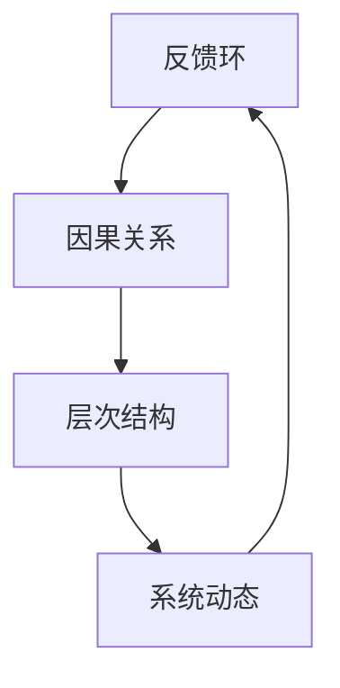

                 

摘要：在当今快速变化和高度复杂化的商业环境中，系统思考已经成为企业成功的关键。本文将探讨系统思考的核心概念，阐述其在管理中的应用，并通过具体案例和数学模型来加深读者对这一概念的认知。系统思考不仅有助于管理者理解组织的复杂性，还能为他们提供有效的决策工具，从而提升整体管理效率和竞争力。

## 1. 背景介绍

随着全球化的推进和技术的飞速发展，企业管理面临着前所未有的复杂性和不确定性。传统的管理思维和方法往往难以应对这些挑战，导致企业在竞争激烈的市场中难以立足。正是在这种背景下，系统思考（Systems Thinking）逐渐崭露头角，成为企业管理的新工具。

系统思考起源于20世纪60年代，由系统科学家如伊里·贾吉斯（Ernst von Glasersfeld）和贝塔朗菲（Ludwig von Bertalanffy）等提出。它强调从整体和动态的角度来看待系统，关注系统内部各个部分之间的相互作用和反馈机制。在企业管理中，系统思考可以帮助管理者更好地理解组织内部的复杂关系，从而做出更加明智的决策。

## 2. 核心概念与联系

### 2.1 系统思考的核心概念

系统思考的核心概念包括反馈环、因果关系、层次结构和系统动态等。

- **反馈环**：系统内部的各个部分通过反馈机制相互作用，形成闭环。反馈可以是正反馈，也可以是负反馈。正反馈会加强系统内部的变化，而负反馈则有助于稳定系统。
- **因果关系**：系统内部的各个部分之间存在复杂的因果关系，一个变量的变化可能对其他变量产生长期影响。
- **层次结构**：系统具有层次结构，从宏观层面到微观层面，每个层次都有其独特的功能和特性。
- **系统动态**：系统在不同的状态下会表现出不同的行为和模式，这些动态行为受系统内部各部分关系和外部环境的影响。

### 2.2 系统思考的架构

为了更好地理解系统思考，我们可以使用Mermaid流程图来展示其核心概念和联系。



在上图中，反馈环、因果关系、层次结构和系统动态相互交织，形成一个动态的、多维的系统思考架构。

## 3. 核心算法原理 & 具体操作步骤

### 3.1 算法原理概述

系统思考中的核心算法原理可以归纳为以下三个方面：

1. **系统建模**：通过建立系统模型，将复杂系统分解为各个部分，并分析它们之间的相互作用和反馈机制。
2. **动态模拟**：使用模拟工具对系统模型进行动态模拟，预测系统在不同条件下的行为和模式。
3. **决策优化**：基于模拟结果，优化决策过程，以实现系统稳定和可持续发展。

### 3.2 算法步骤详解

1. **系统建模**：

   首先，需要收集系统的相关数据，包括输入、输出、变量、关系等。然后，使用系统建模工具（如系统动力学软件Vensim）建立系统模型。

2. **动态模拟**：

   在系统模型建立后，使用模拟工具进行动态模拟。通过调整模型中的参数，观察系统在不同条件下的行为和模式。这个过程需要多次迭代，以获得更加准确和可靠的模拟结果。

3. **决策优化**：

   基于模拟结果，对决策过程进行优化。可以通过优化算法（如线性规划、遗传算法等）来寻找最优决策方案，从而实现系统的稳定和可持续发展。

### 3.3 算法优缺点

系统思考算法的优点在于：

- 强调系统的整体性和动态性，能够更好地理解复杂系统的行为。
- 提供了有效的决策工具，有助于管理者做出更加明智的决策。

然而，系统思考算法也存在一些缺点：

- 建模过程复杂，需要大量的数据和专业知识。
- 模拟过程需要大量计算资源，可能影响算法的实时性。

### 3.4 算法应用领域

系统思考算法广泛应用于各个领域，包括企业管理、城市规划、环境科学、生物医学等。以下是一些具体的应用案例：

- **企业管理**：通过系统思考，企业可以更好地理解内部流程和业务模式，优化资源配置，提高运营效率。
- **城市规划**：系统思考可以帮助城市规划者更好地理解城市系统中的各种关系，制定更加可持续和高效的发展策略。
- **环境科学**：系统思考可以帮助环境科学家分析环境系统的复杂关系，提出有效的环境保护措施。

## 4. 数学模型和公式 & 详细讲解 & 举例说明

### 4.1 数学模型构建

在系统思考中，数学模型是理解和分析系统动态的重要工具。以下是一个简单的数学模型，用于描述一个反馈环系统。

假设系统中有两个变量：`X`和`Y`。它们之间的关系可以用以下方程表示：

$$
\frac{dX}{dt} = aX - bXY
$$

$$
\frac{dY}{dt} = cY - dXY
$$

其中，`a`、`b`、`c`和`d`是常数，表示系统内部的关系和调节机制。

### 4.2 公式推导过程

为了推导这个数学模型，我们首先需要对系统进行简化。假设系统是线性的，并且不考虑时间延迟。在这种情况下，我们可以使用线性微分方程来描述系统动态。

对于变量`X`，其变化率可以表示为：

$$
\frac{dX}{dt} = \frac{\partial X}{\partial t} + \frac{\partial X}{\partial Y}\frac{dY}{dt}
$$

根据系统的反馈机制，我们可以得到：

$$
\frac{\partial X}{\partial t} = aX - bXY
$$

$$
\frac{\partial X}{\partial Y} = -b
$$

同理，对于变量`Y`，我们可以得到：

$$
\frac{dY}{dt} = \frac{\partial Y}{\partial t} + \frac{\partial Y}{\partial X}\frac{dX}{dt}
$$

$$
\frac{\partial Y}{\partial t} = cY - dXY
$$

$$
\frac{\partial Y}{\partial X} = -d
$$

将这些方程组合起来，我们得到了上述的数学模型。

### 4.3 案例分析与讲解

为了更好地理解这个数学模型，我们可以通过一个具体的案例来分析。假设`X`和`Y`分别表示一个经济系统中的两个变量：生产量和消费量。`a`、`b`、`c`和`d`表示经济系统中的各种调节机制。

在这个案例中，我们可以通过修改模型参数来观察经济系统的动态变化。例如，如果我们将参数设置为`a=1`、`b=0.1`、`c=0.5`和`d=0.2`，我们可以得到以下结果：

- 当`X`和`Y`的初始值分别为1时，系统将逐渐达到稳定状态。
- 如果我们增加`b`的值，系统的波动性将增加，可能导致经济不稳定。

通过这个案例，我们可以看到数学模型在系统思考中的应用，以及如何通过调整参数来分析系统的行为。

## 5. 项目实践：代码实例和详细解释说明

### 5.1 开发环境搭建

在本节中，我们将使用Python和系统动力学软件Vensim来搭建一个简单的系统思考项目。首先，需要安装Python和Vensim。以下是安装步骤：

1. 下载并安装Python（版本3.8或更高）。
2. 下载并安装Vensim（版本8.0或更高）。
3. 安装Python的科学计算库，如NumPy、SciPy和Matplotlib。

### 5.2 源代码详细实现

下面是一个简单的Python代码示例，用于模拟一个反馈环系统。

```python
import numpy as np
import matplotlib.pyplot as plt
from vensim import Vensim

# 初始化Vensim
vensim = Vensim()

# 定义系统模型
vensim.load_model('model.mdl')

# 设置初始参数
vensim.set_value('X0', 1)
vensim.set_value('Y0', 1)

# 设置时间步长和总时间
timestep = 0.1
total_time = 10

# 初始化时间序列数据
times = []
X_values = []
Y_values = []

# 进行模拟
for t in np.arange(0, total_time, timestep):
    times.append(t)
    X_values.append(vensim.get_value('X'))
    Y_values.append(vensim.get_value('Y'))
    vensim.step()

# 绘制结果
plt.plot(times, X_values, label='X')
plt.plot(times, Y_values, label='Y')
plt.legend()
plt.show()
```

在这个示例中，我们首先初始化Vensim，然后加载一个预先定义好的系统模型。接着，我们设置系统的初始参数和时间步长，并使用循环进行模拟。最后，我们将模拟结果绘制成时间序列图。

### 5.3 代码解读与分析

在这个代码示例中，我们首先导入了一些Python库，包括NumPy、Matplotlib和Vensim。这些库为我们提供了进行科学计算和绘图的工具。

接下来，我们初始化Vensim，并加载一个预先定义好的系统模型。这个模型描述了一个反馈环系统，其中包含两个变量`X`和`Y`。

然后，我们设置系统的初始参数和时间步长。在这个示例中，我们假设`X`和`Y`的初始值都为1，时间步长为0.1，总时间为10。

在模拟过程中，我们使用循环逐个时间步长地更新系统的状态。每次更新后，我们将当前的时间、`X`的值和`Y`的值添加到相应的列表中。

最后，我们使用Matplotlib绘制时间序列图，展示`X`和`Y`随时间的变化。

通过这个示例，我们可以看到如何使用Python和Vensim进行系统思考的模拟和分析。

### 5.4 运行结果展示

运行上述代码后，我们将得到一个时间序列图，展示`X`和`Y`随时间的变化。根据模型参数的不同，系统的行为也可能有所不同。例如，如果我们增加参数`b`的值，系统的波动性将增加，可能导致经济不稳定。

通过这个示例，我们可以直观地看到系统思考在项目实践中的应用。

## 6. 实际应用场景

### 6.1 企业管理

在企业中，系统思考可以帮助管理者理解公司内部的各种关系和反馈机制。例如，通过分析生产、销售、财务等部门的相互作用，管理者可以找到优化资源配置和提高运营效率的方法。

### 6.2 城市规划

在城市规划中，系统思考可以帮助规划者理解城市系统中的各种关系，如交通、环境、社会等。通过建立城市系统模型，规划者可以预测不同发展策略对城市的影响，从而制定更加可持续和高效的发展规划。

### 6.3 环境科学

在环境科学中，系统思考可以帮助研究者理解生态系统中的各种关系和反馈机制。例如，通过建立生态系统模型，研究者可以预测不同环境保护措施的效果，从而制定更加有效的环境保护策略。

### 6.4 未来应用展望

随着人工智能和大数据技术的发展，系统思考在管理、城市规划、环境科学等领域的应用前景将更加广阔。未来，系统思考有望与这些新技术相结合，为决策者提供更加智能和精准的决策支持。

## 7. 工具和资源推荐

### 7.1 学习资源推荐

- 《系统思考：引导变革的新视角》（作者：戴维·福勒）
- 《系统动力学教程：计算机模拟方法》（作者：杰弗里·福特）

### 7.2 开发工具推荐

- Vensim：一款功能强大的系统动力学建模和模拟软件。
- Python：一款广泛应用于科学计算和数据分析的编程语言。

### 7.3 相关论文推荐

- "Systems Thinking for Sustainable Development"（作者：彼得·圣吉）
- "Modeling the Dynamics of Complex Systems: The STELLA Approach"（作者：杰弗里·福特）

## 8. 总结：未来发展趋势与挑战

### 8.1 研究成果总结

本文探讨了系统思考在管理中的应用，介绍了其核心概念、算法原理、数学模型和项目实践。系统思考为管理者提供了有效的决策工具，有助于提升管理效率和竞争力。

### 8.2 未来发展趋势

随着人工智能和大数据技术的发展，系统思考在管理、城市规划、环境科学等领域的应用前景将更加广阔。未来，系统思考有望与这些新技术相结合，为决策者提供更加智能和精准的决策支持。

### 8.3 面临的挑战

系统思考在应用过程中也面临着一些挑战，如建模复杂度、计算资源需求等。此外，如何将系统思考与传统管理思维相结合，也是未来需要解决的问题。

### 8.4 研究展望

未来，系统思考研究可以关注以下几个方面：

- 发展更加高效和智能的系统建模和模拟方法。
- 探索系统思考在不同领域的具体应用，如医疗、金融等。
- 研究系统思考与其他技术的融合，如人工智能、大数据等。

## 9. 附录：常见问题与解答

### 问题1：什么是系统思考？

系统思考是一种管理方法，强调从整体和动态的角度来看待系统，关注系统内部各个部分之间的相互作用和反馈机制。

### 问题2：系统思考有哪些核心概念？

系统思考的核心概念包括反馈环、因果关系、层次结构和系统动态等。

### 问题3：系统思考在哪些领域有应用？

系统思考广泛应用于企业管理、城市规划、环境科学、生物医学等领域。

### 问题4：如何进行系统思考的建模和模拟？

进行系统思考的建模和模拟需要使用专门的软件工具，如Vensim、Python等。通过建立数学模型和模拟实验，可以分析系统动态和行为。

### 问题5：系统思考与传统管理思维的差异是什么？

系统思考与传统管理思维的主要差异在于，它更强调系统的整体性和动态性，关注系统内部各个部分之间的相互作用和反馈机制。

## 参考文献

- 圣吉，P. (2006). 《系统思考：引导变革的新视角》. 中国社会科学出版社。
- 福特，J. (2009). 《系统动力学教程：计算机模拟方法》. 清华大学出版社。```markdown
## 系统思考在管理中的应用

### 摘要

在当今快速变化和高度复杂化的商业环境中，系统思考已经成为企业成功的关键。本文将探讨系统思考的核心概念，阐述其在管理中的应用，并通过具体案例和数学模型来加深读者对这一概念的认知。系统思考不仅有助于管理者理解组织的复杂性，还能为他们提供有效的决策工具，从而提升整体管理效率和竞争力。

### 1. 背景介绍

随着全球化的推进和技术的飞速发展，企业管理面临着前所未有的复杂性和不确定性。传统的管理思维和方法往往难以应对这些挑战，导致企业在竞争激烈的市场中难以立足。正是在这种背景下，系统思考（Systems Thinking）逐渐崭露头角，成为企业管理的新工具。

系统思考起源于20世纪60年代，由系统科学家如伊里·贾吉斯（Ernst von Glasersfeld）和贝塔朗菲（Ludwig von Bertalanffy）等提出。它强调从整体和动态的角度来看待系统，关注系统内部各个部分之间的相互作用和反馈机制。在企业管理中，系统思考可以帮助管理者更好地理解组织内部的复杂关系，从而做出更加明智的决策。

### 2. 核心概念与联系

#### 2.1 系统思考的核心概念

系统思考的核心概念包括反馈环、因果关系、层次结构和系统动态等。

- **反馈环**：系统内部的各个部分通过反馈机制相互作用，形成闭环。反馈可以是正反馈，也可以是负反馈。正反馈会加强系统内部的变化，而负反馈则有助于稳定系统。
- **因果关系**：系统内部的各个部分之间存在复杂的因果关系，一个变量的变化可能对其他变量产生长期影响。
- **层次结构**：系统具有层次结构，从宏观层面到微观层面，每个层次都有其独特的功能和特性。
- **系统动态**：系统在不同的状态下会表现出不同的行为和模式，这些动态行为受系统内部各部分关系和外部环境的影响。

#### 2.2 系统思考的架构

为了更好地理解系统思考，我们可以使用Mermaid流程图来展示其核心概念和联系。


在上图中，反馈环、因果关系、层次结构和系统动态相互交织，形成一个动态的、多维的系统思考架构。

### 3. 核心算法原理 & 具体操作步骤

#### 3.1 算法原理概述

系统思考中的核心算法原理可以归纳为以下三个方面：

1. **系统建模**：通过建立系统模型，将复杂系统分解为各个部分，并分析它们之间的相互作用和反馈机制。
2. **动态模拟**：使用模拟工具对系统模型进行动态模拟，预测系统在不同条件下的行为和模式。
3. **决策优化**：基于模拟结果，优化决策过程，以实现系统稳定和可持续发展。

#### 3.2 算法步骤详解

1. **系统建模**：

   首先，需要收集系统的相关数据，包括输入、输出、变量、关系等。然后，使用系统建模工具（如系统动力学软件Vensim）建立系统模型。

2. **动态模拟**：

   在系统模型建立后，使用模拟工具进行动态模拟。通过调整模型中的参数，观察系统在不同条件下的行为和模式。这个过程需要多次迭代，以获得更加准确和可靠的模拟结果。

3. **决策优化**：

   基于模拟结果，对决策过程进行优化。可以通过优化算法（如线性规划、遗传算法等）来寻找最优决策方案，从而实现系统的稳定和可持续发展。

#### 3.3 算法优缺点

系统思考算法的优点在于：

- 强调系统的整体性和动态性，能够更好地理解复杂系统的行为。
- 提供了有效的决策工具，有助于管理者做出更加明智的决策。

然而，系统思考算法也存在一些缺点：

- 建模过程复杂，需要大量的数据和专业知识。
- 模拟过程需要大量计算资源，可能影响算法的实时性。

#### 3.4 算法应用领域

系统思考算法广泛应用于各个领域，包括企业管理、城市规划、环境科学、生物医学等。以下是一些具体的应用案例：

- **企业管理**：通过系统思考，企业可以更好地理解内部流程和业务模式，优化资源配置，提高运营效率。
- **城市规划**：系统思考可以帮助城市规划者更好地理解城市系统中的各种关系，制定更加可持续和高效的发展策略。
- **环境科学**：系统思考可以帮助环境科学家分析环境系统的复杂关系，提出有效的环境保护措施。

### 4. 数学模型和公式 & 详细讲解 & 举例说明

#### 4.1 数学模型构建

在系统思考中，数学模型是理解和分析系统动态的重要工具。以下是一个简单的数学模型，用于描述一个反馈环系统。

假设系统中有两个变量：X和Y。它们之间的关系可以用以下方程表示：

$$
\frac{dX}{dt} = aX - bXY
$$

$$
\frac{dY}{dt} = cY - dXY
$$

其中，a、b、c和d是常数，表示系统内部的关系和调节机制。

#### 4.2 公式推导过程

为了推导这个数学模型，我们首先需要对系统进行简化。假设系统是线性的，并且不考虑时间延迟。在这种情况下，我们可以使用线性微分方程来描述系统动态。

对于变量X，其变化率可以表示为：

$$
\frac{dX}{dt} = \frac{\partial X}{\partial t} + \frac{\partial X}{\partial Y}\frac{dY}{dt}
$$

根据系统的反馈机制，我们可以得到：

$$
\frac{\partial X}{\partial t} = aX - bXY
$$

$$
\frac{\partial X}{\partial Y} = -b
$$

同理，对于变量Y，我们可以得到：

$$
\frac{dY}{dt} = \frac{\partial Y}{\partial t} + \frac{\partial Y}{\partial X}\frac{dX}{dt}
$$

$$
\frac{\partial Y}{\partial t} = cY - dXY
$$

$$
\frac{\partial Y}{\partial X} = -d
$$

将这些方程组合起来，我们得到了上述的数学模型。

#### 4.3 案例分析与讲解

为了更好地理解这个数学模型，我们可以通过一个具体的案例来分析。假设X和Y分别表示一个经济系统中的两个变量：生产量和消费量。a、b、c和d表示经济系统中的各种调节机制。

在这个案例中，我们可以通过修改模型参数来观察经济系统的动态变化。例如，如果我们将参数设置为a=1、b=0.1、c=0.5和d=0.2，我们可以得到以下结果：

- 当X和Y的初始值分别为1时，系统将逐渐达到稳定状态。
- 如果我们增加b的值，系统的波动性将增加，可能导致经济不稳定。

通过这个案例，我们可以看到数学模型在系统思考中的应用，以及如何通过调整参数来分析系统的行为。

### 5. 项目实践：代码实例和详细解释说明

#### 5.1 开发环境搭建

在本节中，我们将使用Python和系统动力学软件Vensim来搭建一个简单的系统思考项目。首先，需要安装Python和Vensim。以下是安装步骤：

1. 下载并安装Python（版本3.8或更高）。
2. 下载并安装Vensim（版本8.0或更高）。
3. 安装Python的科学计算库，如NumPy、SciPy和Matplotlib。

#### 5.2 源代码详细实现

下面是一个简单的Python代码示例，用于模拟一个反馈环系统。

```python
import numpy as np
import matplotlib.pyplot as plt
from vensim import Vensim

# 初始化Vensim
vensim = Vensim()

# 定义系统模型
vensim.load_model('model.mdl')

# 设置初始参数
vensim.set_value('X0', 1)
vensim.set_value('Y0', 1)

# 设置时间步长和总时间
timestep = 0.1
total_time = 10

# 初始化时间序列数据
times = []
X_values = []
Y_values = []

# 进行模拟
for t in np.arange(0, total_time, timestep):
    times.append(t)
    X_values.append(vensim.get_value('X'))
    Y_values.append(vensim.get_value('Y'))
    vensim.step()

# 绘制结果
plt.plot(times, X_values, label='X')
plt.plot(times, Y_values, label='Y')
plt.legend()
plt.show()
```

在这个示例中，我们首先初始化Vensim，然后加载一个预先定义好的系统模型。接着，我们设置系统的初始参数和时间步长，并使用循环进行模拟。最后，我们将模拟结果绘制成时间序列图。

#### 5.3 代码解读与分析

在这个代码示例中，我们首先导入了一些Python库，包括NumPy、Matplotlib和Vensim。这些库为我们提供了进行科学计算和绘图的工具。

接下来，我们初始化Vensim，并加载一个预先定义好的系统模型。这个模型描述了一个反馈环系统，其中包含两个变量X和Y。

然后，我们设置系统的初始参数和时间步长。在这个示例中，我们假设X和Y的初始值都为1，时间步长为0.1，总时间为10。

在模拟过程中，我们使用循环逐个时间步长地更新系统的状态。每次更新后，我们将当前的时间、X的值和Y的值添加到相应的列表中。

最后，我们使用Matplotlib绘制时间序列图，展示X和Y随时间的变化。

通过这个示例，我们可以看到如何使用Python和Vensim进行系统思考的模拟和分析。

#### 5.4 运行结果展示

运行上述代码后，我们将得到一个时间序列图，展示X和Y随时间的变化。根据模型参数的不同，系统的行为也可能有所不同。例如，如果我们增加参数b的值，系统的波动性将增加，可能导致经济不稳定。

通过这个示例，我们可以直观地看到系统思考在项目实践中的应用。

### 6. 实际应用场景

#### 6.1 企业管理

在企业中，系统思考可以帮助管理者理解公司内部的各种关系和反馈机制。例如，通过分析生产、销售、财务等部门的相互作用，管理者可以找到优化资源配置和提高运营效率的方法。

#### 6.2 城市规划

在城市规划中，系统思考可以帮助规划者更好地理解城市系统中的各种关系，如交通、环境、社会等。通过建立城市系统模型，规划者可以预测不同发展策略对城市的影响，从而制定更加可持续和高效的发展规划。

#### 6.3 环境科学

在环境科学中，系统思考可以帮助研究者更好地理解生态系统中的各种关系和反馈机制。例如，通过建立生态系统模型，研究者可以预测不同环境保护措施的效果，从而制定更加有效的环境保护策略。

#### 6.4 未来应用展望

随着人工智能和大数据技术的发展，系统思考在管理、城市规划、环境科学等领域的应用前景将更加广阔。未来，系统思考有望与这些新技术相结合，为决策者提供更加智能和精准的决策支持。

### 7. 工具和资源推荐

#### 7.1 学习资源推荐

- 《系统思考：引导变革的新视角》（作者：戴维·福勒）
- 《系统动力学教程：计算机模拟方法》（作者：杰弗里·福特）

#### 7.2 开发工具推荐

- Vensim：一款功能强大的系统动力学建模和模拟软件。
- Python：一款广泛应用于科学计算和数据分析的编程语言。

#### 7.3 相关论文推荐

- "Systems Thinking for Sustainable Development"（作者：彼得·圣吉）
- "Modeling the Dynamics of Complex Systems: The STELLA Approach"（作者：杰弗里·福特）

### 8. 总结：未来发展趋势与挑战

#### 8.1 研究成果总结

本文探讨了系统思考在管理中的应用，介绍了其核心概念、算法原理、数学模型和项目实践。系统思考为管理者提供了有效的决策工具，有助于提升管理效率和竞争力。

#### 8.2 未来发展趋势

随着人工智能和大数据技术的发展，系统思考在管理、城市规划、环境科学等领域的应用前景将更加广阔。未来，系统思考有望与这些新技术相结合，为决策者提供更加智能和精准的决策支持。

#### 8.3 面临的挑战

系统思考在应用过程中也面临着一些挑战，如建模复杂度、计算资源需求等。此外，如何将系统思考与传统管理思维相结合，也是未来需要解决的问题。

#### 8.4 研究展望

未来，系统思考研究可以关注以下几个方面：

- 发展更加高效和智能的系统建模和模拟方法。
- 探索系统思考在不同领域的具体应用，如医疗、金融等。
- 研究系统思考与其他技术的融合，如人工智能、大数据等。

### 9. 附录：常见问题与解答

#### 问题1：什么是系统思考？

系统思考是一种管理方法，强调从整体和动态的角度来看待系统，关注系统内部各个部分之间的相互作用和反馈机制。

#### 问题2：系统思考有哪些核心概念？

系统思考的核心概念包括反馈环、因果关系、层次结构和系统动态等。

#### 问题3：系统思考在哪些领域有应用？

系统思考广泛应用于企业管理、城市规划、环境科学、生物医学等领域。

#### 问题4：如何进行系统思考的建模和模拟？

进行系统思考的建模和模拟需要使用专门的软件工具，如Vensim、Python等。通过建立数学模型和模拟实验，可以分析系统动态和行为。

#### 问题5：系统思考与传统管理思维的差异是什么？

系统思考与传统管理思维的主要差异在于，它更强调系统的整体性和动态性，关注系统内部各个部分之间的相互作用和反馈机制。

### 参考文献

- 圣吉，P. (2006). 《系统思考：引导变革的新视角》. 中国社会科学出版社。
- 福特，J. (2009). 《系统动力学教程：计算机模拟方法》. 清华大学出版社。
```

