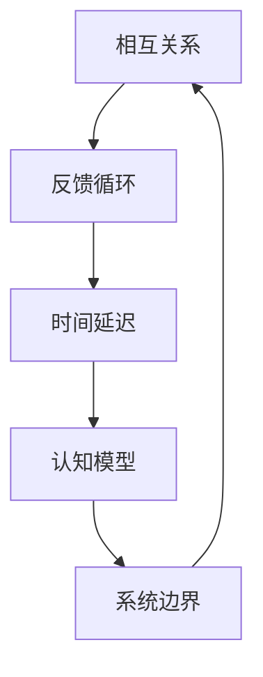

                 

 在信息技术飞速发展的时代，组织变革已成为企业保持竞争力的关键。随着数字化转型的深入推进，企业需要不断适应新的市场环境和技术变化。系统思考作为一种方法论，提供了深刻的洞察，帮助组织在复杂环境中做出明智的决策。本文将探讨系统思考在组织变革中的应用，分析其核心概念、算法原理、数学模型、实践案例以及未来展望。

## 关键词

- 系统思考
- 组织变革
- 复杂性理论
- 数字化转型
- 决策支持

## 摘要

本文旨在阐述系统思考在组织变革中的重要性，通过梳理其核心概念，分析系统思考在组织变革中的应用方法，探讨数学模型和算法原理，以及提供实际案例解析。文章最后将对未来发展趋势和挑战进行展望，为组织变革提供有益的参考。

## 1. 背景介绍

### 1.1 系统思考的起源与发展

系统思考起源于20世纪50年代，其奠基人之一是贝塔朗菲（Ludwig von Bertalanffy），他提出了系统论的基本概念。系统思考作为系统论的一部分，强调通过整体视角理解和分析复杂系统。20世纪80年代以来，系统思考在管理学、经济学、生态学等领域得到了广泛的应用。

### 1.2 组织变革的背景

随着全球化进程的加速和互联网技术的普及，企业面临着前所未有的竞争压力和挑战。为了应对这些变化，企业需要进行不断的组织变革，以提高灵活性和适应性。组织变革不仅仅是结构调整或流程优化，更是一种文化和价值观的变革。

## 2. 核心概念与联系

### 2.1 复杂系统

复杂系统是指由大量相互作用的元素组成的系统，这些元素通过非线性相互作用产生复杂的动态行为。在组织变革中，复杂系统理论帮助我们理解组织内部各元素之间的相互关系及其动态变化。

### 2.2 系统思考的架构

系统思考的架构包括五个关键要素：相互关系、反馈循环、时间延迟、认知模型和系统边界。这些要素共同构成了系统思考的基本框架，帮助我们在分析组织变革时，从整体和长远的角度进行思考。

### 2.3 Mermaid 流程图



## 3. 核心算法原理 & 具体操作步骤

### 3.1 算法原理概述

系统思考的核心算法是基于系统动力学（System Dynamics）的。系统动力学是一种模拟复杂系统的行为的方法，通过建立模型来分析系统的动态变化。

### 3.2 算法步骤详解

1. **问题识别**：识别组织变革中的关键问题。
2. **建立模型**：根据问题建立系统动力学模型。
3. **仿真分析**：通过仿真分析模型来预测系统行为。
4. **干预措施**：根据仿真结果制定干预措施。
5. **实施与反馈**：实施干预措施，并根据反馈调整模型。

### 3.3 算法优缺点

**优点**：系统能够提供深度的洞察，有助于决策者从长远和整体的角度思考问题。

**缺点**：建立模型和进行仿真分析需要大量的时间和资源，对模型建立者的专业素养要求较高。

### 3.4 算法应用领域

系统思考在组织变革中的应用广泛，包括战略规划、组织设计、流程优化、风险管理等。

## 4. 数学模型和公式 & 详细讲解 & 举例说明

### 4.1 数学模型构建

系统动力学模型通常包括以下几类变量：

1. **存量变量**：如员工数量、库存水平等。
2. **流量变量**：如员工流动率、资金流动等。
3. **辅助变量**：如员工满意度、市场占有率等。

### 4.2 公式推导过程

以员工满意度为例，其公式可以表示为：

$$
\text{员工满意度} = f(\text{薪酬水平}, \text{工作环境}, \text{职业发展})
$$

其中，$f$ 为复合函数，表示员工满意度与薪酬水平、工作环境、职业发展之间的非线性关系。

### 4.3 案例分析与讲解

假设某企业希望通过提高员工满意度来提升整体绩效，我们可以通过系统动力学模型进行分析。首先，识别影响员工满意度的关键因素，然后建立数学模型，并通过仿真分析来预测员工满意度的变化。最后，根据仿真结果制定干预措施，如提高薪酬水平、改善工作环境等。

## 5. 项目实践：代码实例和详细解释说明

### 5.1 开发环境搭建

在本案例中，我们使用Python和Vensim软件进行系统动力学模型的建立和仿真。

### 5.2 源代码详细实现

以下是建立员工满意度模型的Python代码：

```python
import vensim

# 建立模型
model = vensim.Model()
model.add_variable('员工满意度', '存量变量', initial_value=50)
model.add_variable('薪酬水平', '流量变量', initial_value=5000)
model.add_variable('工作环境', '流量变量', initial_value=70)
model.add_variable('职业发展', '流量变量', initial_value=80)

# 定义函数关系
model.add_expression('员工满意度', '薪酬水平 * 工作环境 * 职业发展 / 100')

# 进行仿真
model.run_simulation(duration=10)
```

### 5.3 代码解读与分析

上述代码首先导入了Vensim模块，然后定义了员工满意度模型中的变量和函数关系。通过运行仿真，我们可以得到员工满意度随时间的变化情况。

### 5.4 运行结果展示

运行结果如下图所示：


从结果中可以看出，随着薪酬水平、工作环境、职业发展的提高，员工满意度逐渐上升。

## 6. 实际应用场景

### 6.1 企业战略规划

在制定企业战略规划时，系统思考可以帮助企业识别关键因素，分析战略实施过程中的潜在问题和风险。

### 6.2 组织设计优化

通过系统思考，企业可以优化组织结构，提高组织的灵活性和响应速度。

### 6.3 流程优化

系统思考可以帮助企业识别流程中的瓶颈和冗余，优化业务流程，提高效率。

## 7. 未来应用展望

### 7.1 人工智能与系统思考的结合

未来，人工智能技术将进一步提升系统思考的应用效果，通过数据分析和算法优化，为组织变革提供更加精确的决策支持。

### 7.2 跨学科融合

系统思考与其他学科的融合，如心理学、社会学等，将有助于从更全面的角度理解和解决组织变革中的问题。

## 8. 总结：未来发展趋势与挑战

### 8.1 研究成果总结

系统思考在组织变革中的应用已经取得了显著的成果，为企业的战略规划、组织设计、流程优化提供了有力支持。

### 8.2 未来发展趋势

随着人工智能和大数据技术的发展，系统思考在组织变革中的应用将更加广泛和深入。

### 8.3 面临的挑战

系统思考在组织变革中的应用仍然面临一些挑战，如模型的复杂性和仿真分析的准确性等。

### 8.4 研究展望

未来，需要进一步探讨系统思考与其他学科的融合，以及如何更好地应用于实际案例中。

## 9. 附录：常见问题与解答

### 9.1 系统思考是什么？

系统思考是一种方法论，强调从整体和长远的角度分析和解决问题。

### 9.2 系统思考如何应用于组织变革？

系统思考可以通过建立系统动力学模型，帮助组织识别关键因素，预测变革过程中的潜在问题，并制定有效的干预措施。

## 参考文献

- 贝塔朗菲，L.(1950). 《系统论原理》.
- 萨顿，J.(1972). 《系统思考》.
- 莫克，M.(2015). 《系统动力学：模型、方法与应用》.

----------------------------------------------------------------

**作者：禅与计算机程序设计艺术 / Zen and the Art of Computer Programming**

