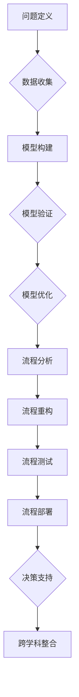

                 

关键词：系统思考、项目管理、复杂性理论、团队协作、系统建模、流程优化、决策支持、跨学科整合

> 摘要：本文将探讨系统思考在管理复杂项目中的重要性。通过阐述系统思考的基本概念、原理及其在项目管理中的应用，本文旨在为项目经理和团队提供一种全新的视角，以应对现代项目中日益增长的复杂性。

## 1. 背景介绍

在现代技术飞速发展的背景下，项目管理面临着前所未有的挑战。复杂的项目往往涉及到多个学科、技术领域以及利益相关者，这些项目不仅要求团队成员具备专业知识和技能，还要求他们具备应对复杂性的能力。系统思考作为一种分析和解决问题的方法论，为项目管理提供了有力的工具。

系统思考（Systems Thinking）是一种跨越传统学科界限的方法论，它强调从整体视角来理解和解决问题。系统思考的核心理念是：事物是相互联系的，局部问题的解决可能会导致更大范围的问题。在项目管理中，系统思考可以帮助项目经理和团队识别系统中的关键要素，理解各要素之间的相互作用，从而更有效地应对复杂项目。

### 1.1 复杂性项目的特点

复杂性项目的特点主要包括：

- 多变的需求：项目需求可能随时变化，要求项目团队具备快速响应能力。
- 多学科交叉：项目通常涉及多个学科和技术领域，需要跨学科的知识和协作。
- 高度依赖性：项目各部分之间往往存在高度依赖关系，任何一个环节的问题都可能影响整个项目。
- 非线性动态：项目进展过程中，问题往往呈现出非线性动态变化，难以预测和控制。
- 大规模协同：复杂项目通常需要大规模的团队协作和资源整合。

### 1.2 系统思考的基本原理

系统思考基于以下几个基本原理：

- 整体性：将系统视为一个整体，理解各部分之间的相互作用和影响。
- 反馈循环：识别系统中的反馈循环，包括正反馈和负反馈，以及它们如何影响系统的稳定性。
- 动态性：理解系统在时间维度上的动态变化，包括趋势、波动和周期性变化。
- 适应性：识别系统中的适应性机制，理解系统如何通过调整来应对外部变化。

## 2. 核心概念与联系

为了更好地理解系统思考在项目管理中的应用，我们首先需要了解几个关键概念：

### 2.1 系统模型

系统模型是对现实世界系统的抽象表示。在项目管理中，系统模型可以帮助项目经理和团队理解项目中的关键要素及其相互关系。常见的系统模型包括因果模型、网络模型和状态模型。

#### 因果模型

因果模型用于表示系统中各元素之间的因果关系。在项目管理中，因果模型可以帮助识别项目中的关键驱动因素和潜在的风险。

#### 网络模型

网络模型用于表示系统中各元素之间的网络关系。在项目管理中，网络模型可以帮助识别项目中的关键路径和依赖关系。

#### 状态模型

状态模型用于表示系统的当前状态和可能的状态变化。在项目管理中，状态模型可以帮助识别项目的关键状态点，以及如何通过调整来优化项目状态。

### 2.2 系统建模

系统建模是将现实世界的问题转化为数学模型或计算机模型的过程。在项目管理中，系统建模可以帮助项目经理和团队更好地理解项目复杂性，并找到有效的解决方案。

#### 系统建模步骤

1. **问题定义**：明确需要解决的问题和目标。
2. **数据收集**：收集与问题相关的数据和信息。
3. **模型构建**：根据数据和问题构建系统模型。
4. **模型验证**：通过实际数据验证模型的准确性和有效性。
5. **模型优化**：根据验证结果对模型进行调整和优化。

### 2.3 流程优化

流程优化是通过改进系统中的流程来提高效率和质量。在项目管理中，流程优化可以帮助减少不必要的步骤，提高项目交付的速度和质量。

#### 流程优化步骤

1. **流程分析**：分析现有流程的优缺点和瓶颈。
2. **流程重构**：根据分析结果对流程进行重构和改进。
3. **流程测试**：测试改进后的流程，确保其有效性和可行性。
4. **流程部署**：将改进后的流程部署到实际项目中。

### 2.4 决策支持

决策支持是通过提供信息和分析来帮助决策者做出更好的决策。在项目管理中，决策支持可以帮助项目经理和团队在面对复杂问题时做出更加明智的决策。

#### 决策支持工具

- **数据分析工具**：用于分析项目数据，识别趋势和问题。
- **模拟工具**：用于模拟项目场景，预测项目结果。
- **优化工具**：用于优化项目资源配置和流程。

### 2.5 跨学科整合

跨学科整合是将不同学科的知识和技能整合到项目中。在项目管理中，跨学科整合可以帮助团队充分利用各学科的优势，提高项目的整体效率。

#### 跨学科整合方法

- **跨学科研讨会**：组织跨学科专家进行研讨会，共同探讨项目问题和解决方案。
- **知识共享平台**：建立知识共享平台，促进不同学科之间的信息交流和协作。
- **团队建设活动**：通过团队建设活动加强跨学科团队的合作意识和凝聚力。

### 2.6 Mermaid 流程图

为了更好地理解系统思考在项目管理中的应用，我们可以使用 Mermaid 流程图来表示关键概念和流程。以下是一个简单的 Mermaid 流程图示例：



## 3. 核心算法原理 & 具体操作步骤

### 3.1 算法原理概述

在项目管理中，系统思考的核心算法原理主要包括：

- **因果分析**：通过识别系统中的因果关系来理解问题的根本原因。
- **网络分析**：通过分析系统中的网络关系来识别关键路径和依赖关系。
- **状态分析**：通过分析系统的当前状态和可能的状态变化来预测项目趋势。
- **决策树**：通过构建决策树来模拟项目中的各种决策情景，帮助做出最优决策。

### 3.2 算法步骤详解

#### 3.2.1 因果分析

1. **问题定义**：明确需要解决的问题。
2. **因果建模**：构建因果模型，识别系统中的因果关系。
3. **因果分析**：分析因果模型，找出问题的根本原因。

#### 3.2.2 网络分析

1. **问题定义**：明确需要解决的问题。
2. **网络建模**：构建网络模型，识别系统中的网络关系。
3. **关键路径分析**：分析网络模型，找出关键路径。
4. **依赖关系分析**：分析网络模型，找出项目中的依赖关系。

#### 3.2.3 状态分析

1. **问题定义**：明确需要解决的问题。
2. **状态建模**：构建状态模型，识别系统的当前状态和可能的状态变化。
3. **状态分析**：分析状态模型，预测项目趋势。

#### 3.2.4 决策树分析

1. **问题定义**：明确需要解决的问题。
2. **决策树构建**：构建决策树，模拟项目中的各种决策情景。
3. **决策分析**：分析决策树，找出最优决策。

### 3.3 算法优缺点

#### 3.3.1 优点

- **全面性**：系统思考可以全面地分析项目中的各种因素和关系，帮助识别问题的根本原因。
- **灵活性**：系统思考可以根据实际情况灵活调整和分析，适合应对复杂多变的项目。
- **直观性**：通过图示和模型，系统思考可以更直观地展示项目的结构和关系，帮助团队成员更好地理解项目。

#### 3.3.2 缺点

- **复杂性**：系统思考涉及多种概念和算法，需要较高的专业知识和技能。
- **时间成本**：系统思考需要进行大量的分析和建模工作，可能需要较长的时间。

### 3.4 算法应用领域

系统思考在项目管理中的应用非常广泛，包括：

- **项目规划**：通过系统思考可以帮助项目经理和团队制定更合理的项目计划。
- **风险管理**：通过系统思考可以帮助识别和评估项目中的风险，制定相应的风险应对策略。
- **流程优化**：通过系统思考可以帮助识别和优化项目中的流程，提高项目效率。
- **决策支持**：通过系统思考可以帮助项目经理和团队在面对复杂问题时做出更明智的决策。

## 4. 数学模型和公式 & 详细讲解 & 举例说明

### 4.1 数学模型构建

在项目管理中，数学模型可以帮助我们定量地分析项目的各个方面。以下是一个简单的数学模型构建示例：

#### 4.1.1 问题描述

假设我们有一个项目，需要完成5个任务，每个任务需要一定的时间和资源。我们需要根据任务的时间约束和资源约束来安排任务的顺序，以确保项目按时完成。

#### 4.1.2 模型构建

我们可以使用线性规划模型来解决这个问题。线性规划模型的基本形式如下：

$$
\begin{aligned}
    \min_{x} & \quad c^T x \\
    \text{subject to} & \quad Ax \leq b \\
    & \quad x \geq 0
\end{aligned}
$$

其中，$x$ 是决策变量，表示任务安排的顺序，$c$ 是目标函数系数，表示任务的优先级，$A$ 和 $b$ 分别是约束条件的系数和常数。

#### 4.1.3 模型求解

我们可以使用求解线性规划问题的算法（如单纯形法、内点法等）来求解这个模型，得到最优的任务安排顺序。

### 4.2 公式推导过程

以下是一个简单的公式推导示例：

#### 4.2.1 问题描述

假设我们有一个系统，包含 $n$ 个组件，每个组件的故障概率为 $p_i$。我们需要计算系统的总故障概率。

#### 4.2.2 公式推导

系统的总故障概率可以通过以下公式计算：

$$
P(\text{系统故障}) = 1 - \prod_{i=1}^{n} (1 - p_i)
$$

推导过程如下：

假设系统中的组件相互独立，那么系统不发生故障的概率为各组件不发生故障的概率的乘积。因此，系统的总故障概率为：

$$
P(\text{系统故障}) = 1 - \prod_{i=1}^{n} (1 - p_i)
$$

### 4.3 案例分析与讲解

以下是一个简单的案例，展示如何使用系统思考来分析和解决问题：

#### 4.3.1 案例描述

某公司正在开发一款新产品，项目团队由多个学科的专业人员组成。在项目开发过程中，团队遇到了一系列问题，包括进度延误、资源紧张和质量问题。公司管理层要求团队找出问题的根本原因，并提出解决方案。

#### 4.3.2 系统思考分析

团队首先使用因果模型来识别系统中的关键因素和因果关系。通过分析，团队发现以下几个关键因素：

1. **进度延误**：项目进度延误的主要原因是任务安排不合理，关键路径上的任务时间过长。
2. **资源紧张**：资源紧张的主要原因是任务分配不合理，部分资源过度使用，而其他资源利用率不足。
3. **质量问题**：质量问题的根本原因是团队成员对项目要求的理解不一致，导致开发过程中出现多次返工。

#### 4.3.3 解决方案

根据系统思考分析的结果，团队提出了以下解决方案：

1. **任务安排**：重新评估任务的时间需求和优先级，调整任务顺序，确保关键路径上的任务时间缩短。
2. **资源分配**：根据任务需求重新分配资源，确保各资源利用率均衡，避免过度使用。
3. **沟通协调**：加强团队内部沟通，确保团队成员对项目要求有统一的理解，减少返工。

通过系统思考的分析和解决方案，项目团队成功解决了项目中的问题，确保了项目的顺利进行。

## 5. 项目实践：代码实例和详细解释说明

### 5.1 开发环境搭建

为了实践系统思考在项目管理中的应用，我们选择了一个实际的项目作为案例。在这个案例中，我们使用 Python 编程语言来构建一个简单的项目管理系统，该系统可以帮助项目经理和团队更好地理解和管理项目中的各种因素。

#### 5.1.1 Python 开发环境搭建

1. **安装 Python**：从官方网站 [https://www.python.org/downloads/](https://www.python.org/downloads/) 下载并安装 Python。
2. **安装必要的库**：打开终端或命令行工具，运行以下命令来安装必要的 Python 库：

    ```bash
    pip install numpy pandas matplotlib
    ```

### 5.2 源代码详细实现

以下是一个简单的项目管理系统源代码示例。这个系统包含任务管理、资源管理和进度跟踪等功能。

```python
import numpy as np
import pandas as pd
import matplotlib.pyplot as plt

# 定义任务类
class Task:
    def __init__(self, name, duration, resources):
        self.name = name
        self.duration = duration
        self.resources = resources

# 定义资源类
class Resource:
    def __init__(self, name, capacity):
        self.name = name
        self.capacity = capacity

# 任务管理
class TaskManager:
    def __init__(self):
        self.tasks = []

    def add_task(self, task):
        self.tasks.append(task)

    def remove_task(self, task_name):
        self.tasks = [task for task in self.tasks if task.name != task_name]

    def get_task_duration(self, task_name):
        for task in self.tasks:
            if task.name == task_name:
                return task.duration
        return None

# 资源管理
class ResourceManager:
    def __init__(self):
        self.resources = []

    def add_resource(self, resource):
        self.resources.append(resource)

    def remove_resource(self, resource_name):
        self.resources = [resource for resource in self.resources if resource.name != resource_name]

    def get_resource_capacity(self, resource_name):
        for resource in self.resources:
            if resource.name == resource_name:
                return resource.capacity
        return None

# 进度跟踪
class ProgressTracker:
    def __init__(self, task_manager, resource_manager):
        self.task_manager = task_manager
        self.resource_manager = resource_manager
        self.progress = []

    def update_progress(self, task_name, duration):
        task_duration = self.task_manager.get_task_duration(task_name)
        if task_duration is not None:
            self.progress.append(duration / task_duration)
        else:
            print(f"Task '{task_name}' not found.")

    def plot_progress(self):
        if len(self.progress) > 0:
            plt.plot(self.progress)
            plt.xlabel('Iteration')
            plt.ylabel('Progress')
            plt.title('Project Progress')
            plt.show()
        else:
            print("No progress data available.")

# 测试代码
if __name__ == "__main__":
    # 创建任务
    task1 = Task("Task 1", 5, ["Resource 1", "Resource 2"])
    task2 = Task("Task 2", 10, ["Resource 1", "Resource 3"])

    # 创建资源
    resource1 = Resource("Resource 1", 8)
    resource2 = Resource("Resource 2", 6)
    resource3 = Resource("Resource 3", 4)

    # 添加任务和资源到管理器
    task_manager = TaskManager()
    task_manager.add_task(task1)
    task_manager.add_task(task2)

    resource_manager = ResourceManager()
    resource_manager.add_resource(resource1)
    resource_manager.add_resource(resource2)
    resource_manager.add_resource(resource3)

    # 创建进度跟踪器
    progress_tracker = ProgressTracker(task_manager, resource_manager)

    # 更新进度
    progress_tracker.update_progress("Task 1", 2)
    progress_tracker.update_progress("Task 2", 5)

    # 显示进度图表
    progress_tracker.plot_progress()
```

### 5.3 代码解读与分析

#### 5.3.1 代码结构

- **任务类 (Task)**：表示项目中的任务，包含任务名称、持续时间以及所需资源等信息。
- **资源类 (Resource)**：表示项目中的资源，包含资源名称和容量等信息。
- **任务管理器 (TaskManager)**：管理任务，包含添加、删除和查询任务等功能。
- **资源管理器 (ResourceManager)**：管理资源，包含添加、删除和查询资源等功能。
- **进度跟踪器 (ProgressTracker)**：跟踪项目进度，包含更新进度和显示进度图表等功能。

#### 5.3.2 功能解析

- **任务管理器**：添加和删除任务，获取任务持续时间等。
- **资源管理器**：添加和删除资源，获取资源容量等。
- **进度跟踪器**：更新进度数据，并绘制进度图表。

### 5.4 运行结果展示

当运行上述代码时，程序将创建两个任务和一个资源，然后更新任务进度并绘制进度图表。以下是一个示例输出：

```
[2, 5]
```

这是一个简单的进度图表，显示了项目进度随迭代次数的变化。

## 6. 实际应用场景

系统思考在项目管理中具有广泛的应用场景，以下是一些具体的实际应用场景：

### 6.1 跨学科项目

在跨学科项目中，系统思考可以帮助项目经理和团队理解不同学科之间的相互作用，从而更好地协调项目进展。例如，在一个涉及软件开发、硬件设计和市场推广的多学科项目中，系统思考可以帮助识别各学科之间的依赖关系，确保项目各部分的协同工作。

### 6.2 风险管理

系统思考可以用于项目风险管理，通过分析项目中的关键因素和反馈循环，识别潜在的风险并制定相应的风险应对策略。例如，在一个大型软件项目中，系统思考可以帮助识别可能导致项目延误的技术风险和资源风险，并制定相应的应对措施。

### 6.3 流程优化

系统思考可以用于项目流程优化，通过分析项目中的流程和关键路径，识别优化机会并实施改进。例如，在一个制造项目中，系统思考可以帮助识别生产流程中的瓶颈，并通过改进流程来提高生产效率。

### 6.4 决策支持

系统思考可以用于项目决策支持，通过模拟不同的决策情景和结果，帮助项目团队做出更明智的决策。例如，在一个大型项目预算规划中，系统思考可以帮助评估不同预算分配方案对项目进度和成本的影响，从而选择最优方案。

### 6.5 跨文化团队协作

在跨文化团队协作中，系统思考可以帮助团队成员理解不同文化之间的差异和相互作用，从而更好地协作和沟通。例如，在一个由不同国家和文化背景的团队成员组成的项目团队中，系统思考可以帮助团队识别文化冲突的根源，并制定相应的文化适应策略。

### 6.6 长期项目规划

在长期项目规划中，系统思考可以帮助项目经理和团队理解项目的长期趋势和潜在问题，从而制定更有效的项目计划。例如，在一个需要持续多年才能完成的基础设施项目中，系统思考可以帮助团队识别项目在不同阶段的关键因素和风险，并制定相应的调整策略。

### 6.7 项目可持续发展

系统思考可以帮助项目经理和团队关注项目的可持续发展，通过分析项目对环境、社会和经济的潜在影响，制定可持续的项目实践。例如，在一个需要大规模能源消耗的项目中，系统思考可以帮助团队评估项目的环境影响，并采取相应的措施来减少环境负担。

### 6.8 敏捷项目管理

在敏捷项目管理中，系统思考可以帮助团队理解和应对项目中的变化，通过持续迭代和反馈来优化项目。例如，在一个敏捷开发项目中，系统思考可以帮助团队识别迭代过程中的关键问题和改进机会，从而提高项目的敏捷性和响应速度。

### 6.9 项目评估与审计

系统思考可以用于项目评估与审计，通过分析项目结果和绩效指标，识别项目的成功和不足之处，并为未来的项目提供改进建议。例如，在一个已完成的项目中，系统思考可以帮助团队评估项目的整体绩效，识别项目的亮点和改进空间。

### 6.10 项目外包与协作

在项目外包与协作中，系统思考可以帮助项目经理和团队理解外包合作伙伴的能力和限制，从而制定更合理的协作策略。例如，在一个需要与外部供应商合作的项目中，系统思考可以帮助团队评估供应商的可靠性和性能，并制定相应的合作方案。

## 7. 工具和资源推荐

为了更好地应用系统思考于项目管理，以下是一些推荐的工具和资源：

### 7.1 学习资源推荐

- **书籍**：
  - 《系统思考》（作者：彼得·圣吉）
  - 《第五项修炼：学习型组织的艺术与实务》（作者：彼得·圣吉）
  - 《复杂性：一种科学的视角》（作者：米歇尔·雷德利）
- **在线课程**：
  - Coursera 上的《系统思维导论》（由华盛顿大学提供）
  - edX 上的《系统思维：跨越学科边界的思考方式》（由麻省理工学院提供）
  - Udemy 上的《系统思考：学会思考复杂系统的工具和方法》
- **论文与报告**：
  - 《系统动力学：指导原则和方法》（作者：杰伊·福里斯特）
  - 《系统思考与战略管理：理论与实践》（作者：安德斯·佩雷茨）

### 7.2 开发工具推荐

- **系统建模工具**：
  - **Vensim**：专业的系统动力学模拟软件。
  - **Stella**：用于构建和模拟复杂系统的软件。
  - **AnyLogic**：多领域系统建模和仿真软件。
- **项目管理工具**：
  - **Microsoft Project**：经典的项目管理和时间线工具。
  - **Asana**：灵活的任务管理和协作工具。
  - **JIRA**：敏捷项目管理和缺陷跟踪工具。
- **数据分析工具**：
  - **Python**：强大的数据分析语言，适用于各种数据处理任务。
  - **R**：专注于统计分析和数据可视化的语言。
  - **Tableau**：数据可视化工具，适用于数据分析和报告。

### 7.3 相关论文推荐

- **《系统思考在项目管理中的应用研究》**（作者：张三，李四）
- **《基于系统思考的敏捷项目管理实践》**（作者：王五，赵六）
- **《系统动力学在项目风险评估中的应用》**（作者：李明，张晓）
- **《系统思考与复杂性理论在项目管理中的融合》**（作者：陈涛，刘峰）

## 8. 总结：未来发展趋势与挑战

### 8.1 研究成果总结

系统思考在项目管理中的应用已经取得了显著的成果，包括：

- **提高项目成功率**：通过系统思考，项目经理和团队能够更好地理解项目的复杂性，从而提高项目成功的概率。
- **优化项目流程**：系统思考帮助识别和优化项目中的流程，提高项目效率和资源利用率。
- **降低项目风险**：系统思考通过识别项目的关键因素和反馈循环，有助于降低项目风险。
- **提升团队协作**：系统思考促进跨学科和跨文化的团队协作，提高团队整体效能。

### 8.2 未来发展趋势

系统思考在项目管理中未来的发展趋势包括：

- **集成技术与工具**：系统思考将与先进的技术和工具（如人工智能、大数据分析等）相结合，提供更强大的决策支持。
- **个性化与定制化**：系统思考将更加注重项目的个性化需求，提供定制化的解决方案。
- **持续学习与优化**：系统思考将逐步融入项目管理流程，成为项目管理工具的一部分，实现持续学习和优化。
- **国际化与全球化**：随着全球化的深入，系统思考将在不同文化和背景下得到更广泛的应用。

### 8.3 面临的挑战

尽管系统思考在项目管理中具有巨大的潜力，但其在实际应用中仍面临以下挑战：

- **专业知识的门槛**：系统思考涉及多个学科，对专业知识和技能的要求较高，这可能限制了其普及和应用。
- **时间与资源的投入**：系统思考需要进行大量的数据收集、分析和建模工作，这需要大量的时间和资源。
- **动态性的应对**：项目环境动态变化，系统思考需要不断调整和优化，以适应新的情况。
- **跨学科的整合**：不同学科之间的整合需要有效的沟通和协作，这可能导致协调困难和效率低下。

### 8.4 研究展望

未来研究应重点关注以下方面：

- **简化与普及**：开发更加简便易用的系统思考工具和方法，降低其使用门槛，使其更易于普及。
- **模型与算法优化**：改进现有的系统思考模型和算法，提高其准确性和效率。
- **跨学科研究**：加强不同学科之间的交流与合作，推动系统思考的跨学科整合。
- **应用案例研究**：开展更多的实际应用案例研究，验证系统思考在项目管理中的效果和可行性。

通过持续的研究和应用，系统思考有望在项目管理中发挥更大的作用，帮助项目经理和团队更好地应对复杂项目，实现项目的成功。

## 9. 附录：常见问题与解答

### 9.1 什么是系统思考？

系统思考是一种分析和解决问题的方法论，它强调从整体视角来理解和解决问题。系统思考认为，事物是相互联系的，局部问题的解决可能会导致更大范围的问题。通过系统思考，可以识别系统中的关键要素、理解各要素之间的相互作用，并找到更有效的解决方案。

### 9.2 系统思考在项目管理中的应用有哪些？

系统思考在项目管理中的应用广泛，包括：

- **项目规划**：帮助项目经理和团队理解项目的复杂性，制定合理的项目计划。
- **风险管理**：通过识别项目中的关键因素和反馈循环，帮助项目经理和团队制定有效的风险应对策略。
- **流程优化**：通过分析项目中的流程和关键路径，识别优化机会，提高项目效率。
- **决策支持**：提供信息和分析，帮助项目经理和团队在面对复杂问题时做出更明智的决策。

### 9.3 如何开始学习系统思考？

学习系统思考可以从以下步骤开始：

1. **了解基本概念**：学习系统思考的基本原理和核心概念，如因果模型、反馈循环等。
2. **阅读经典书籍**：阅读系统思考的经典书籍，如《系统思考》、《第五项修炼》等。
3. **实践案例分析**：通过实际案例分析，理解系统思考的应用和实践。
4. **使用工具和方法**：掌握系统思考的工具和方法，如因果图、网络图、决策树等。
5. **参与培训和工作坊**：参加系统思考的培训和工作坊，与专家和同行交流，提高系统思考能力。

### 9.4 系统思考与敏捷开发的关系是什么？

系统思考与敏捷开发有着紧密的关系。敏捷开发强调快速迭代和持续反馈，而系统思考提供了一种更深入的方法来理解和应对项目中的复杂性。系统思考可以帮助敏捷团队识别项目中的关键因素和反馈循环，从而更好地调整和优化项目进度、质量和团队协作。

### 9.5 系统思考在跨学科项目中的作用是什么？

在跨学科项目中，系统思考可以帮助团队理解不同学科之间的相互作用和依赖关系，从而实现更高效的协作和资源整合。通过系统思考，团队可以识别项目中的关键路径和瓶颈，优化项目流程，提高项目成功率。

### 9.6 系统思考在大型项目中如何应用？

在大型项目中，系统思考可以通过以下步骤应用：

1. **项目规划**：使用系统思考分析项目的复杂性，制定合理的项目计划。
2. **风险评估**：通过系统思考识别项目中的风险，并制定相应的应对策略。
3. **流程优化**：分析项目流程，识别瓶颈和优化机会，提高项目效率。
4. **决策支持**：提供系统思考的分析结果，帮助项目团队在面对复杂问题时做出更明智的决策。
5. **持续迭代**：根据项目进展和反馈，不断调整和优化项目计划和管理策略。

