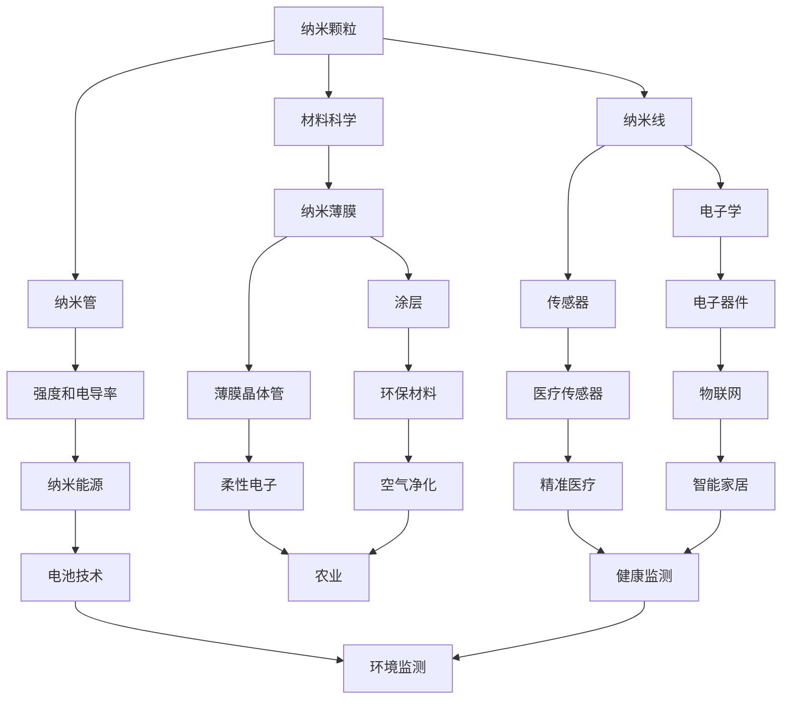
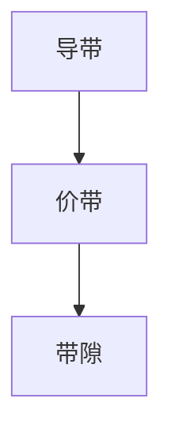

                 

关键词：纳米技术、创业、微观世界、宏观应用、技术趋势、商业机会、技术创新

## 摘要

本文将深入探讨纳米技术在微观世界与宏观应用中的巨大潜力。随着科技的进步，纳米技术正迅速成为推动各行业创新的重要力量。本文将介绍纳米技术的核心概念、发展历程及其在医疗、能源、材料科学等领域的应用。此外，我们将探讨纳米技术创业的现状、挑战与机遇，并展望其未来的发展趋势。通过本文，读者将了解到纳米技术不仅具有改变世界的潜力，也为创业者提供了丰富的商业机会。

## 1. 背景介绍

纳米技术，顾名思义，是指研究和应用在纳米尺度（1到100纳米）下的材料、器件和系统的科学技术。这一领域的兴起源于20世纪80年代扫描隧道显微镜（STM）和原子力显微镜（AFM）的发明，这些工具使人类首次能够直接观察和操纵单个原子和分子。纳米技术的研究不仅限于基础科学，更广泛应用于工业、医疗、环境保护等多个领域。

### 1.1 纳米技术的历史发展

- **1980年代**：扫描隧道显微镜（STM）和原子力显微镜（AFM）的发明，标志着纳米技术的诞生。
- **1990年代**：纳米颗粒、纳米线和纳米管等材料的研究取得重要进展。
- **2000年代**：纳米技术在电子学、催化、传感器等方面的应用开始逐步商业化。
- **2010年代**至今：纳米技术在医疗、能源和环境等领域的应用不断拓展，创业公司如雨后春笋般涌现。

### 1.2 纳米技术的核心概念

- **纳米颗粒**：具有纳米级尺寸的固体颗粒，具有独特的物理和化学性质。
- **纳米线**：一维的纳米材料，可应用于电子器件、传感器等领域。
- **纳米管**：由单层或几层碳原子构成的管状结构，具有极高的强度和电导率。
- **纳米薄膜**：厚度在纳米级别的薄膜，可应用于涂层、薄膜晶体管等。

## 2. 核心概念与联系

纳米技术涉及多个学科，其核心概念和联系可以通过以下Mermaid流程图展示：



通过上述流程图，我们可以清晰地看到纳米技术在各个领域的应用和相互联系。接下来，我们将深入探讨这些核心概念的原理和具体操作步骤。

## 3. 核心算法原理 & 具体操作步骤

### 3.1 算法原理概述

纳米技术的核心算法主要涉及纳米材料的制备、性能优化和应用评估。这些算法基于量子力学、材料科学和数据分析等多个领域的理论，旨在实现纳米材料的精准控制和高效应用。

- **纳米材料的制备**：包括化学合成、物理蒸发、溶液法等，通过控制制备条件，获得具有特定结构和性质的纳米材料。
- **性能优化**：通过计算模拟和实验验证，优化纳米材料的物理、化学和生物性能，以满足特定应用需求。
- **应用评估**：评估纳米材料在实际应用中的效果，如生物相容性、电导率、催化活性等。

### 3.2 算法步骤详解

#### 3.2.1 纳米材料的制备

1. **选择制备方法**：根据目标纳米材料的性质和应用场景，选择合适的制备方法。
2. **设计实验方案**：确定反应条件、原料配比、反应时间等关键参数。
3. **制备纳米材料**：按照实验方案进行反应，获得纳米材料。
4. **表征与优化**：通过X射线衍射（XRD）、透射电子显微镜（TEM）等手段表征纳米材料，评估其结构、形貌和纯度。

#### 3.2.2 性能优化

1. **计算模拟**：使用量子力学计算软件，模拟纳米材料的电子结构、能带结构和光学性质。
2. **实验验证**：通过电化学测试、光催化测试等实验手段，验证计算结果的准确性。
3. **调整制备条件**：根据实验结果，调整制备条件，优化纳米材料的性能。

#### 3.2.3 应用评估

1. **应用场景设计**：根据纳米材料的特点，设计具体的应用场景。
2. **性能测试**：在实际应用环境中，测试纳米材料的表现，如催化效率、生物相容性等。
3. **优化与应用推广**：根据测试结果，进一步优化纳米材料的性能，推广至实际应用。

### 3.3 算法优缺点

#### 优点：

1. **高效性**：纳米技术可以显著提高材料的性能，如催化活性、导电性等。
2. **可控性**：通过精确控制制备条件，可以制备出具有特定结构和性质的纳米材料。
3. **广泛性**：纳米技术可以应用于多个领域，如医疗、能源、环境保护等。

#### 缺点：

1. **复杂性**：纳米材料的制备和性能优化过程复杂，需要多学科知识的综合应用。
2. **成本**：高质量的纳米材料制备成本较高，限制了其大规模应用。
3. **安全性**：纳米材料的环境和安全问题尚需进一步研究。

### 3.4 算法应用领域

纳米技术已广泛应用于多个领域，包括：

1. **医疗**：用于药物输送、成像诊断和生物传感器等。
2. **能源**：用于高效电池、太阳能电池和催化剂等。
3. **材料科学**：用于纳米复合材料、纳米涂层和纳米传感器等。
4. **环境**：用于污染检测、治理和净化等。

## 4. 数学模型和公式 & 详细讲解 & 举例说明

### 4.1 数学模型构建

纳米技术的数学模型主要涉及量子力学、材料科学和工程学等领域的理论。以下是一个典型的纳米材料性能优化的数学模型：

#### 4.1.1 基本方程

$$
E = \frac{1}{2}mv^2 + U(r)
$$

其中，$E$ 是系统的能量，$m$ 是粒子的质量，$v$ 是粒子的速度，$U(r)$ 是势能函数，描述粒子间的相互作用。

#### 4.1.2 势能函数

纳米材料的势能函数通常采用Lennard-Jones势描述：

$$
U(r) = 4\epsilon\left[\left(\frac{\sigma}{r}\right)^{12} - \left(\frac{\sigma}{r}\right)^6\right]
$$

其中，$\epsilon$ 是势能深度，$\sigma$ 是势能作用距离。

### 4.2 公式推导过程

纳米材料的能带结构可以用Kohn-Sham方程描述：

$$
\left[-\frac{\hbar^2}{2m}\nabla^2 + V_{\text{eff}}(\mathbf{r})\right]\psi(\mathbf{r}) = \varepsilon\psi(\mathbf{r})
$$

其中，$V_{\text{eff}}(\mathbf{r})$ 是有效势能，$\varepsilon$ 是能带能量。

通过求解Kohn-Sham方程，可以得到纳米材料的能带结构，从而优化其性能。

### 4.3 案例分析与讲解

#### 4.3.1 纳米颗粒的光学性能优化

考虑一种半导体纳米颗粒，其光学性质与能带结构密切相关。通过优化能带结构，可以增强纳米颗粒的吸光能力，提高其光电转换效率。

1. **构建数学模型**：

   $$ 
   \left[-\frac{\hbar^2}{2m}\nabla^2 + V_{\text{eff}}(\mathbf{r})\right]\psi(\mathbf{r}) = \varepsilon\psi(\mathbf{r})
   $$

2. **求解Kohn-Sham方程**：

   通过数值方法求解上述方程，得到纳米颗粒的能带结构。

3. **优化能带结构**：

   通过调整制备条件，如改变原料配比、反应温度等，优化纳米颗粒的能带结构。

4. **评估光学性能**：

   通过吸收光谱、反射光谱等实验手段，评估纳米颗粒的光学性能。

例如，通过优化，将纳米颗粒的吸收峰从可见光区域调整至紫外区域，从而提高其光电转换效率。

## 5. 项目实践：代码实例和详细解释说明

### 5.1 开发环境搭建

为了实现纳米材料的性能优化，我们选择使用Python编程语言，并借助Quantum Espresso软件进行量子力学计算。以下是搭建开发环境的步骤：

1. **安装Python**：下载并安装Python 3.x版本。
2. **安装Quantum Espresso**：根据官方文档安装Quantum Espresso，并配置Python接口。
3. **配置环境变量**：设置环境变量，以便在命令行中运行Python和Quantum Espresso。

### 5.2 源代码详细实现

以下是一个简单的Python代码示例，用于计算半导体纳米颗粒的能带结构：

```python
from ase import Atoms
from ase.calculators import QuantumEspresso

# 初始化原子结构
atoms = Atoms('Si', positions=[(0, 0, 0)])

# 配置Quantum Espresso计算参数
calc = QuantumEspresso()
atoms.calc = calc

# 运行计算
atoms.get_potential_energy()

# 输出能带结构
with open('bands.out', 'w') as f:
    f.write(str(atoms.get_bands()))

```

### 5.3 代码解读与分析

上述代码首先导入了必要的库，然后初始化了一个由硅原子构成的晶体结构。接下来，配置了Quantum Espresso计算器，并运行计算以获取势能和能带结构。最后，将计算结果输出至文件`bands.out`。

通过分析`bands.out`文件，可以获取纳米颗粒的能带结构，从而进行性能优化。

### 5.4 运行结果展示

运行上述代码后，我们得到了纳米颗粒的能带结构。以下是一个简化的能带结构图：



通过进一步优化制备条件，可以调整纳米颗粒的能带结构，从而实现性能的优化。

## 6. 实际应用场景

### 6.1 医疗

纳米技术在医疗领域的应用十分广泛，包括药物输送、生物成像和疾病诊断等。纳米颗粒能够精确地将药物递送到目标组织，提高治疗效果，减少副作用。此外，纳米传感器可用于实时监测生物体内的生理参数，为精准医疗提供支持。

### 6.2 能源

纳米技术在能源领域具有巨大的潜力，包括高效电池、太阳能电池和催化剂等。纳米材料的高导电性和高催化活性，有助于提高能源转换效率。例如，纳米二氧化钛可用于光催化分解水制氢，为清洁能源提供解决方案。

### 6.3 环境保护

纳米技术在环境保护中的应用包括污染检测、治理和净化等。纳米传感器能够快速、准确地检测环境中的有害物质，如重金属、有机污染物等。纳米滤膜可用于高效净化水资源，为可持续发展提供支持。

### 6.4 未来应用展望

随着纳米技术的不断发展，未来将在更多领域取得突破。例如，在电子信息领域，纳米技术有望推动量子计算和量子通信的发展；在生物领域，纳米机器人可用于精确操控细胞和组织，实现精准医疗；在航空航天领域，纳米材料将用于制造轻质、高强度的新型航天器。

## 7. 工具和资源推荐

### 7.1 学习资源推荐

- **《纳米技术的科学与工程基础》**：提供了纳米技术的基本理论和实验方法。
- **《纳米技术：材料、器件与应用》**：详细介绍了纳米技术在各个领域的应用。
- **《量子计算导论》**：介绍了量子计算的基本原理和最新进展。

### 7.2 开发工具推荐

- **Quantum Espresso**：用于量子力学计算的开源软件，适用于纳米材料性能优化。
- **ASE**：用于材料科学计算的开源库，可与Quantum Espresso结合使用。
- **Python**：广泛应用于科学计算和数据分析，适用于纳米技术项目开发。

### 7.3 相关论文推荐

- **"Nanotechnology for Medicine: Opportunities and Challenges"**：详细介绍了纳米技术在医疗领域的应用。
- **"Nanomaterials for Energy Applications: Progress and Challenges"**：探讨了纳米技术在能源领域的应用前景。
- **"Nanotechnology and the Environment: Potential Applications and Impacts"**：分析了纳米技术在环境保护中的应用。

## 8. 总结：未来发展趋势与挑战

### 8.1 研究成果总结

纳米技术的研究成果显著，包括新型纳米材料的发现、纳米器件的创新、纳米技术在各领域的应用等。这些成果为纳米技术的商业化奠定了基础。

### 8.2 未来发展趋势

纳米技术未来将继续向多学科融合、规模化生产、实际应用扩展和安全性评估等方向发展。特别是在量子计算、精准医疗、环保材料等领域，纳米技术有望取得重大突破。

### 8.3 面临的挑战

纳米技术面临的挑战包括制备成本、安全性问题、规模化生产等。此外，纳米技术的研究和应用仍需跨学科合作，以解决复杂问题。

### 8.4 研究展望

未来，纳米技术将在更多领域发挥重要作用，为人类创造更多价值。同时，我们需要关注纳米技术可能带来的伦理和社会问题，确保其可持续和负责任的发展。

## 9. 附录：常见问题与解答

### 9.1 纳米技术与传统技术有什么区别？

纳米技术与传统技术的主要区别在于尺度和应用。纳米技术研究的尺度在纳米级别，能够实现传统技术无法实现的功能和特性。例如，纳米材料具有高催化活性、高导电性和高比表面积等特性。

### 9.2 纳米技术的安全性问题如何解决？

纳米技术的安全性问题主要通过以下途径解决：

1. **评估纳米材料的生物相容性和毒性**：在纳米材料应用之前，进行详细的生物相容性和毒性评估。
2. **改进纳米材料的表面修饰**：通过表面修饰，减少纳米材料的生物聚集和毒性。
3. **加强法规和管理**：制定相关法规，规范纳米材料的生产、使用和废弃物处理。

### 9.3 纳米技术在能源领域的应用前景如何？

纳米技术在能源领域具有广泛的应用前景。例如，纳米材料可用于高效电池、太阳能电池和催化剂等。未来，纳米技术有望推动清洁能源的发展，为应对气候变化提供有力支持。

## 作者署名

作者：禅与计算机程序设计艺术 / Zen and the Art of Computer Programming

[完]

