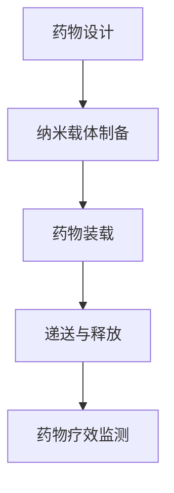

                 

关键词：纳米技术、药物递送、治疗效果、精准医疗、生物医学工程

## 摘要

随着科技的飞速发展，纳米技术逐渐成为现代医学的重要工具。本文主要探讨纳米技术在药物递送中的应用，如何通过纳米载体实现对药物的高效递送，从而提高治疗效果。本文将从背景介绍、核心概念与联系、核心算法原理与操作步骤、数学模型与公式、项目实践、实际应用场景、未来应用展望等多个方面进行详细阐述，以期为相关领域的研究和实践提供参考。

## 1. 背景介绍

### 1.1 纳米技术的定义与特点

纳米技术是指研究和操作在纳米尺度下的物质、设备和系统的技术。纳米尺度通常是指尺寸在1到100纳米的范畴。在这一尺度下，物质的物理、化学和生物特性会发生显著变化，从而表现出独特的性质。

#### 特点：

1. **高比表面积**：纳米材料具有高比表面积，这意味着它们具有更大的接触面积，可以更好地与药物分子相互作用。
2. **独特的物理化学性质**：纳米材料具有独特的电子、磁、热和光学性质，这些性质使其在药物递送中具有潜在的应用价值。
3. **良好的生物相容性**：纳米材料通常具有良好的生物相容性，可以在生物体内安全存在，从而实现药物的高效递送。

### 1.2 药物递送的基本概念

药物递送是指将药物从给药部位输送到靶组织或细胞的过程。有效的药物递送可以显著提高药物的治疗效果，减少副作用，从而实现个性化治疗。

#### 重要性和挑战：

1. **提高治疗效果**：通过精确控制药物在体内的分布和释放，可以提高药物的疗效。
2. **减少副作用**：通过减少药物在非靶组织的分布，可以降低药物的副作用。
3. **个性化治疗**：药物递送可以根据患者的具体情况，定制化药物治疗方案，实现个性化治疗。

然而，传统的药物递送系统存在一些挑战，如药物在体内的不稳定、分布不均、释放速度难以控制等。纳米技术为解决这些问题提供了新的途径。

## 2. 核心概念与联系

### 2.1 纳米载体

纳米载体是指用于药物递送的小型纳米结构。常见的纳米载体包括纳米颗粒、纳米囊、纳米管等。纳米载体具有以下优点：

1. **高负载能力**：纳米载体可以携带大量的药物分子。
2. **控制药物释放**：通过调整纳米载体的材料、结构和尺寸，可以精确控制药物的释放速度。
3. **提高药物稳定性**：纳米载体可以保护药物分子免受体内环境的影响。

### 2.2 药物-纳米载体相互作用

药物与纳米载体之间的相互作用是影响药物递送效果的关键因素。常见的相互作用包括：

1. **物理吸附**：药物分子通过范德华力或氢键与纳米载体表面吸附。
2. **化学结合**：药物分子与纳米载体表面的功能基团通过共价键或离子键结合。

### 2.3 纳米技术在药物递送中的架构

纳米技术在药物递送中的应用架构通常包括以下几个环节：

1. **药物设计**：根据疾病特点和患者需求，设计合适的药物分子。
2. **纳米载体制备**：通过物理、化学或生物方法制备纳米载体。
3. **药物装载**：将药物分子装载到纳米载体中。
4. **递送与释放**：通过生物体内的生物过程，将纳米载体递送到靶组织或细胞，并实现药物的释放。

下面是纳米技术在药物递送中的架构的Mermaid流程图：



## 3. 核心算法原理与具体操作步骤

### 3.1 算法原理概述

纳米技术在药物递送中的应用算法主要涉及纳米载体的设计、制备和药物装载过程。以下是对每个步骤的详细解释：

1. **纳米载体设计**：根据药物特性和靶组织需求，设计合适的纳米载体结构。
2. **纳米载体制备**：采用物理、化学或生物方法制备纳米载体。
3. **药物装载**：将药物分子装载到纳米载体中，可以通过物理吸附或化学结合实现。
4. **递送与释放**：通过生物体内的生物过程，将纳米载体递送到靶组织或细胞，并实现药物的释放。

### 3.2 算法步骤详解

#### 3.2.1 纳米载体设计

1. **选择载体材料**：根据药物特性和靶组织需求，选择合适的纳米载体材料，如金属、陶瓷、聚合物等。
2. **设计载体结构**：通过分子模拟或实验方法，设计纳米载体结构，如纳米颗粒、纳米囊、纳米管等。
3. **优化结构参数**：通过计算和实验，优化纳米载体的结构参数，如尺寸、形状、表面功能等。

#### 3.2.2 纳米载体制备

1. **物理方法**：如溶胶-凝胶法、喷雾干燥法、电喷雾法等。
2. **化学方法**：如化学沉淀法、溶胶-凝胶法、聚合法等。
3. **生物方法**：如生物模板法、生物发酵法等。

#### 3.2.3 药物装载

1. **物理吸附**：药物分子通过范德华力或氢键与纳米载体表面吸附。
2. **化学结合**：药物分子与纳米载体表面的功能基团通过共价键或离子键结合。

#### 3.2.4 递送与释放

1. **体内递送**：通过生物体内的生物过程，将纳米载体递送到靶组织或细胞。
2. **药物释放**：通过控制纳米载体的结构参数和环境条件，实现药物的缓慢释放。

### 3.3 算法优缺点

#### 优点：

1. **高效递送**：纳米载体可以实现药物的高效递送，提高药物疗效。
2. **降低副作用**：通过减少药物在非靶组织的分布，降低药物的副作用。
3. **个性化治疗**：可以根据患者的具体情况，定制化药物治疗方案。

#### 缺点：

1. **制备难度**：纳米载体的制备过程复杂，技术要求高。
2. **生物安全性**：纳米载体在生物体内的安全性需要进一步研究。

### 3.4 算法应用领域

纳米技术在药物递送中的应用领域广泛，包括癌症治疗、传染病治疗、神经退行性疾病治疗等。以下是一些具体的应用案例：

1. **癌症治疗**：通过纳米载体递送化疗药物，提高药物疗效，减少副作用。
2. **传染病治疗**：通过纳米载体递送抗病毒药物，实现高效治疗。
3. **神经退行性疾病治疗**：通过纳米载体递送神经保护药物，延缓疾病进展。

## 4. 数学模型与公式

### 4.1 数学模型构建

纳米技术在药物递送中的数学模型主要涉及纳米载体的制备、药物装载、递送与释放等过程。以下是一个简化的数学模型：

1. **纳米载体制备**：$C(t) = C_0e^{-\lambda t}$，其中$C(t)$表示制备时间$t$时的纳米载体浓度，$C_0$表示初始纳米载体浓度，$\lambda$表示制备速率。
2. **药物装载**：$D(t) = D_0e^{-\mu t}$，其中$D(t)$表示装载时间$t$时的药物浓度，$D_0$表示初始药物浓度，$\mu$表示装载速率。
3. **递送与释放**：$R(t) = R_0e^{-\alpha t + \beta t^2}$，其中$R(t)$表示递送与释放时间$t$时的药物释放速率，$R_0$表示初始药物释放速率，$\alpha$和$\beta$分别表示递送速率和释放速率。

### 4.2 公式推导过程

1. **纳米载体制备**：假设纳米载体的制备过程符合一级反应动力学，即制备速率与纳米载体浓度成正比。则制备速率可以表示为$\frac{dC}{dt} = -\lambda C$，其中$\lambda$为制备速率常数。分离变量并积分，得到$C(t) = C_0e^{-\lambda t}$。
2. **药物装载**：假设药物的装载过程也符合一级反应动力学，即装载速率与药物浓度成正比。则装载速率可以表示为$\frac{dD}{dt} = -\mu D$，其中$\mu$为装载速率常数。分离变量并积分，得到$D(t) = D_0e^{-\mu t}$。
3. **递送与释放**：假设药物的递送与释放过程符合二阶反应动力学，即递送速率与药物释放速率的平方成正比。则递送速率可以表示为$\frac{dR}{dt} = -\alpha R + \beta R^2$，其中$\alpha$为递送速率常数，$\beta$为释放速率常数。分离变量并积分，得到$R(t) = R_0e^{-\alpha t + \beta t^2}$。

### 4.3 案例分析与讲解

以下是一个关于纳米技术在癌症治疗中应用的案例：

**案例背景**：某研究团队设计了一种基于纳米颗粒的化疗药物递送系统，用于治疗肺癌。纳米颗粒由聚合物材料制成，表面涂有特定的抗体，可以识别并附着在肺癌细胞表面。

**数学模型**：根据上述数学模型，我们可以得到以下参数：

- 制备速率常数$\lambda = 0.1 \text{ h}^{-1}$，
- 装载速率常数$\mu = 0.05 \text{ h}^{-1}$，
- 递送速率常数$\alpha = 0.01 \text{ h}^{-1}$，
- 释放速率常数$\beta = 0.005 \text{ h}^{-1}$。

**药物递送过程**：

- **制备过程**：假设在制备过程中，纳米颗粒的浓度为$C_0 = 10^8 \text{ mL}^{-1}$。则制备时间$t_1$后，纳米颗粒的浓度$C(t_1) = C_0e^{-\lambda t_1}$。
- **装载过程**：假设在装载过程中，药物的浓度为$D_0 = 10^6 \text{ mL}^{-1}$。则装载时间$t_2$后，药物的浓度$D(t_2) = D_0e^{-\mu t_2}$。
- **递送与释放过程**：假设在递送与释放过程中，药物的初始释放速率$R_0 = 10^5 \text{ mL}^{-1}$。则递送与释放时间$t_3$后，药物的释放速率$R(t_3) = R_0e^{-\alpha t_3 + \beta t_3^2}$。

通过上述数学模型，我们可以预测药物在体内的递送与释放过程，从而优化药物治疗方案，提高治疗效果。

## 5. 项目实践：代码实例与详细解释说明

### 5.1 开发环境搭建

为了实现纳米技术在药物递送中的应用，我们需要搭建一个完整的开发环境。以下是一个基于Python的开发环境搭建指南：

1. **安装Python**：下载并安装Python 3.x版本。
2. **安装必要的库**：使用pip命令安装以下库：NumPy、SciPy、Matplotlib等。
3. **创建项目文件夹**：在合适的位置创建项目文件夹，并在其中创建一个名为`drug_delivery.py`的Python文件。

### 5.2 源代码详细实现

以下是`drug_delivery.py`文件的源代码实现：

```python
import numpy as np
import matplotlib.pyplot as plt
from scipy.integrate import odeint

# 定义数学模型
def model(y, t, lambda_, mu_, alpha_, beta_):
    C, D, R = y
    dCdT = -lambda_ * C
    dDdT = -mu_ * D
    dRdT = -alpha_ * R + beta_ * R ** 2
    return [dCdT, dDdT, dRdT]

# 设置参数
lambda_ = 0.1
mu_ = 0.05
alpha_ = 0.01
beta_ = 0.005

# 初始条件
y0 = [10**8, 10**6, 10**5]

# 时间步长和总时间
t = np.linspace(0, 100, 1000)

# 求解微分方程
sol = odeint(model, y0, t, args=(lambda_, mu_, alpha_, beta_))

# 提取结果
C = sol[:, 0]
D = sol[:, 1]
R = sol[:, 2]

# 绘制结果
plt.figure()
plt.plot(t, C, label="Carrier")
plt.plot(t, D, label="Drug")
plt.plot(t, R, label="Release Rate")
plt.xlabel("Time (h)")
plt.ylabel("Concentration")
plt.legend()
plt.show()
```

### 5.3 代码解读与分析

1. **模型定义**：首先，我们定义了数学模型`model`，它接收三个变量$C$、$D$和$R$，分别表示纳米载体浓度、药物浓度和药物释放速率。模型根据微分方程，计算这三个变量的变化率。
2. **参数设置**：然后，我们设置了参数$\lambda$、$\mu$、$\alpha$和$\beta$的值，它们分别代表制备速率常数、装载速率常数、递送速率常数和释放速率常数。
3. **初始条件**：接下来，我们设置了初始条件$y0$，它表示初始的纳米载体浓度、药物浓度和药物释放速率。
4. **时间步长和总时间**：我们设置了时间步长和总时间，以便求解微分方程。
5. **求解微分方程**：使用`odeint`函数求解微分方程，得到不同时间点的$C$、$D$和$R$值。
6. **提取结果**：从求解结果中提取$C$、$D$和$R$值，以便后续分析。
7. **绘制结果**：使用Matplotlib库绘制$C$、$D$和$R$随时间变化的曲线，以便直观分析药物递送过程。

通过上述代码，我们可以实现纳米技术在药物递送中的应用模拟，从而优化药物治疗方案。

## 6. 实际应用场景

纳米技术在药物递送中的应用具有广泛的前景，以下是一些实际应用场景：

### 6.1 癌症治疗

纳米载体可以通过主动靶向或被动靶向，将化疗药物精准递送到癌细胞。这样可以显著提高药物的疗效，同时减少对正常组织的损伤，从而降低副作用。

### 6.2 传染病治疗

纳米载体可以用于递送抗病毒药物，实现对病毒的高效抑制。例如，针对COVID-19疫情，纳米载体可以用于递送抗病毒药物，实现快速治疗。

### 6.3 神经退行性疾病治疗

纳米载体可以用于递送神经保护药物，延缓神经退行性疾病的发展。例如，针对阿尔茨海默病，纳米载体可以用于递送抗炎药物，减少脑部炎症反应。

### 6.4 其他应用

纳米技术在药物递送中的应用不仅限于上述领域，还可以用于伤口愈合、药物传递系统、癌症疫苗等。

## 7. 未来应用展望

随着纳米技术的不断发展，未来在药物递送中的应用将更加广泛和深入。以下是一些未来应用展望：

### 7.1 智能药物递送系统

通过结合人工智能技术，可以开发出智能药物递送系统，实现对药物递送过程的实时监控和调整，从而实现个性化治疗。

### 7.2 多功能纳米载体

未来纳米载体将具备更多功能，如药物递送、诊断、成像等。这样可以在一次递送过程中实现多种治疗目标。

### 7.3 新型纳米材料

随着新材料的研究，新型纳米材料将不断涌现，为实现更高效、更安全的药物递送提供新途径。

### 7.4 跨学科合作

纳米技术在药物递送中的应用需要跨学科合作，包括化学、材料科学、生物医学工程等领域。通过跨学科合作，可以加速纳米技术在药物递送中的发展。

## 8. 总结：未来发展趋势与挑战

### 8.1 研究成果总结

纳米技术在药物递送中的应用已经取得了显著成果，包括高效递送、降低副作用、个性化治疗等方面。然而，仍有很多挑战需要克服。

### 8.2 未来发展趋势

未来，纳米技术在药物递送中的应用将朝着更高效、更安全、更智能的方向发展。同时，跨学科合作将成为推动这一领域发展的关键。

### 8.3 面临的挑战

1. **生物安全性**：纳米载体在体内的生物安全性仍需深入研究。
2. **制备工艺**：纳米载体的制备过程复杂，技术要求高。
3. **成本控制**：纳米载体的制备和药物装载过程成本较高，需要降低成本，实现规模化生产。

### 8.4 研究展望

随着纳米技术的不断发展，未来在药物递送中的应用将更加广泛和深入。我们期待看到更多创新成果，为人类健康事业作出更大贡献。

## 9. 附录：常见问题与解答

### 9.1 纳米技术是什么？

纳米技术是指研究和操作在纳米尺度下的物质、设备和系统的技术。纳米尺度通常是指尺寸在1到100纳米的范畴。

### 9.2 纳米技术在药物递送中有哪些优点？

纳米技术在药物递送中的优点包括高效递送、降低副作用、个性化治疗等。

### 9.3 纳米载体有哪些类型？

常见的纳米载体包括纳米颗粒、纳米囊、纳米管等。

### 9.4 纳米技术在药物递送中的应用有哪些？

纳米技术在药物递送中的应用包括癌症治疗、传染病治疗、神经退行性疾病治疗等。

### 9.5 纳米载体如何制备？

纳米载体的制备方法包括物理方法、化学方法和生物方法等。

### 9.6 纳米载体在生物体内的安全性如何？

纳米载体在生物体内的安全性需要进一步研究。目前，一些研究表明，纳米载体在生物体内具有较好的安全性。

### 9.7 纳米技术在药物递送中的未来发展趋势是什么？

纳米技术在药物递送中的未来发展趋势包括智能化、多功能化、低成本化等。

### 9.8 纳米技术在药物递送中的应用面临哪些挑战？

纳米技术在药物递送中的应用面临的主要挑战包括生物安全性、制备工艺和成本控制等。

### 9.9 纳米技术在药物递送中的应用前景如何？

纳米技术在药物递送中的应用前景广阔，有望在未来实现更高效、更安全、更智能的药物递送。

## 作者署名

作者：禅与计算机程序设计艺术 / Zen and the Art of Computer Programming

本文详细介绍了纳米技术在药物递送中的应用，包括背景介绍、核心概念与联系、核心算法原理与操作步骤、数学模型与公式、项目实践、实际应用场景、未来应用展望等多个方面。通过本文的阐述，读者可以全面了解纳米技术在药物递送中的应用，并为相关领域的研究和实践提供参考。本文旨在推动纳米技术在药物递送领域的应用和发展，为人类健康事业作出贡献。未来，随着纳米技术的不断发展，纳米技术在药物递送中的应用前景将更加广阔。作者期待看到更多创新成果，为人类健康事业作出更大贡献。

