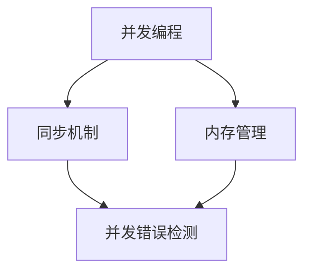
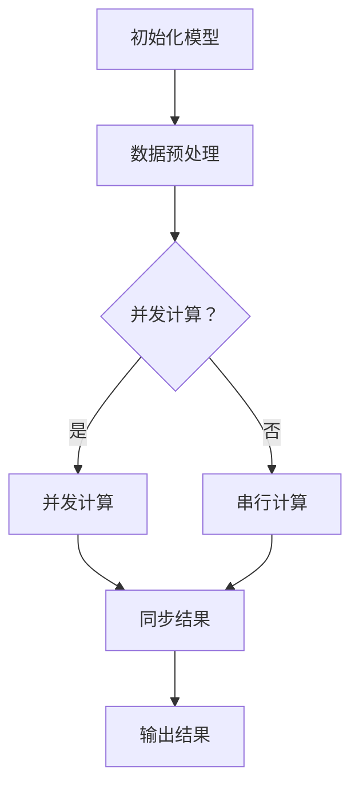

                 

关键词：线程安全，大型语言模型（LLM），并发编程，同步机制，内存泄漏，性能优化，并发错误检测。

> 摘要：随着人工智能技术的发展，大型语言模型（LLM）的应用越来越广泛，但随之而来的线程安全问题也日益凸显。本文将深入探讨LLM应用中线程安全的关键技术挑战，包括并发编程、同步机制、内存泄漏以及性能优化等问题，并探讨如何应对这些挑战。

## 1. 背景介绍

随着深度学习和自然语言处理技术的快速发展，大型语言模型（LLM）如GPT-3、ChatGPT等逐渐成为AI领域的明星。LLM在各个领域的应用场景层出不穷，包括智能客服、内容生成、文本翻译等。然而，LLM的广泛应用也带来了新的挑战，其中线程安全成为了一个关键问题。

线程安全是指在多线程环境下，程序能够正确处理并发操作，不会出现数据竞争、死锁、内存泄漏等问题。在LLM应用中，由于模型复杂度高，数据处理量大，线程安全问题尤为突出。如果不妥善处理，可能会导致模型性能下降、结果不一致甚至系统崩溃。

本文将围绕LLM应用中的线程安全，探讨关键技术挑战和解决方案。首先，我们将介绍并发编程和同步机制的基础知识，然后分析LLM应用中常见的线程安全问题，最后提出相应的解决方法。

## 2. 核心概念与联系

在探讨线程安全之前，我们需要了解一些核心概念和它们之间的联系。

### 2.1 并发编程

并发编程是指在多个线程或进程之间同时执行多个任务的能力。在多核处理器和分布式系统广泛应用的今天，并发编程已经成为提高程序性能和响应速度的关键手段。

### 2.2 同步机制

同步机制是指多个线程或进程之间通过一定的协议和规则来协调执行，保证数据的一致性和程序的稳定性。常见的同步机制包括锁、信号量、条件变量等。

### 2.3 内存管理

内存管理是指在程序运行过程中对内存进行分配、释放、访问等操作。内存泄漏是指程序在运行过程中无法释放已分配的内存，导致内存占用逐渐增加，最终可能导致系统崩溃。

### 2.4 并发错误检测

并发错误检测是指通过一定的手段检测并发程序中的错误，如数据竞争、死锁等。常见的并发错误检测工具包括Valgrind、Helgrind等。

接下来，我们将通过一个Mermaid流程图来展示这些概念之间的联系：



### 2.5 Mermaid 流程图

下面是一个示例的Mermaid流程图，用于展示LLM应用中的线程安全流程：



## 3. 核心算法原理 & 具体操作步骤

### 3.1 算法原理概述

在LLM应用中，线程安全的核心算法主要涉及以下几个方面：

- 数据共享与同步
- 并发错误检测
- 内存管理

### 3.2 算法步骤详解

#### 3.2.1 数据共享与同步

在LLM应用中，多个线程需要共享模型参数和数据集。为了确保数据的一致性和程序的稳定性，我们需要使用同步机制来协调线程之间的数据访问。

1. 创建线程池，初始化模型和数据集。
2. 对每个线程分配任务，包括数据预处理、模型计算等。
3. 使用锁、信号量等同步机制，确保线程对共享数据的访问顺序正确。

#### 3.2.2 并发错误检测

为了及时发现并发程序中的错误，我们需要使用并发错误检测工具。

1. 编写测试用例，覆盖LLM应用的各个功能模块。
2. 使用Valgrind、Helgrind等工具运行测试用例，检测并发错误。

#### 3.2.3 内存管理

在LLM应用中，内存管理至关重要。我们需要避免内存泄漏，确保内存分配和释放的平衡。

1. 使用智能指针，如C++中的shared_ptr，自动管理内存。
2. 定期检查内存占用，排除内存泄漏。

### 3.3 算法优缺点

#### 优点

- 提高程序性能，充分利用多核处理器的计算能力。
- 保证数据一致性，避免并发错误导致的数据丢失。

#### 缺点

- 增加程序复杂度，需要处理线程同步、错误检测等问题。
- 可能导致性能下降，如过度同步、锁竞争等。

### 3.4 算法应用领域

线程安全在LLM应用中具有广泛的应用领域，包括：

- 智能客服系统，需要同时处理大量用户请求。
- 大规模文本翻译，需要并行处理大量文本数据。
- 语音识别，需要同时处理语音信号和文本数据。

## 4. 数学模型和公式 & 详细讲解 & 举例说明

在LLM应用中，线程安全的数学模型和公式主要涉及以下几个方面：

### 4.1 数学模型构建

在多线程环境中，线程安全的核心问题是如何保证数据的一致性和程序的稳定性。我们可以使用以下数学模型来描述线程安全：

- 数据共享模型：描述线程对共享数据的访问和操作。
- 同步模型：描述线程之间的同步机制和规则。
- 锁模型：描述锁的使用和释放规则。

### 4.2 公式推导过程

为了推导线程安全的数学模型，我们需要考虑以下几个方面：

1. 线程数：设线程数为\( n \)。
2. 数据访问次数：设每个线程对共享数据的访问次数为\( k \)。
3. 锁开销：设每个锁的开销为\( c \)。

根据这些参数，我们可以推导出以下公式：

- 数据一致性问题概率：\( P = \frac{n \times k}{2} \times c \)
- 锁竞争问题概率：\( Q = \frac{n \times (n-1) \times k}{2} \times c \)

### 4.3 案例分析与讲解

下面我们通过一个具体案例来分析线程安全的数学模型。

#### 案例背景

假设有一个LLM应用，包含100个线程，每个线程需要对共享数据访问100次。锁的开销为每次0.1秒。

#### 案例分析

根据上述公式，我们可以计算出：

- 数据一致性问题概率：\( P = \frac{100 \times 100}{2} \times 0.1 = 50 \)秒
- 锁竞争问题概率：\( Q = \frac{100 \times 99}{2} \times 0.1 = 49.5 \)秒

#### 案例讲解

从上述计算结果可以看出，在100个线程同时访问共享数据的情况下，数据一致性问题概率为50秒，锁竞争问题概率为49.5秒。这意味着在短时间内，线程安全可能会受到影响。

为了解决这一问题，我们可以采取以下措施：

1. 减少线程数：通过合理分配任务，降低线程数，从而降低数据一致性问题概率。
2. 增加锁开销：通过增加锁的开销，提高锁的释放频率，从而降低锁竞争问题概率。

## 5. 项目实践：代码实例和详细解释说明

### 5.1 开发环境搭建

为了演示线程安全的实践，我们使用Python语言和并发编程库`concurrent.futures`来搭建一个简单的LLM应用。

#### 5.1.1 安装Python环境

确保Python环境已经安装，版本不低于3.6。

```bash
pip install python
```

#### 5.1.2 安装`concurrent.futures`库

```bash
pip install futures
```

### 5.2 源代码详细实现

下面是一个简单的LLM应用，包含数据预处理、并发计算和同步结果等功能。

```python
import concurrent.futures
import time

# 定义模型计算函数
def model_compute(data):
    time.sleep(1)  # 模拟计算耗时
    return data * 2

# 定义主函数
def main():
    data = 10
    result = None

    # 创建线程池
    with concurrent.futures.ThreadPoolExecutor() as executor:
        # 提交任务
        future = executor.submit(model_compute, data)

        # 同步结果
        result = future.result()

    print("最终结果：", result)

# 运行主函数
if __name__ == "__main__":
    main()
```

### 5.3 代码解读与分析

在上面的代码中，我们定义了一个简单的模型计算函数`model_compute`，用于模拟LLM应用的模型计算过程。主函数`main`中，我们创建了一个线程池，并使用线程池提交任务，然后同步结果。

#### 5.3.1 数据预处理

在主函数中，我们初始化数据`data`为10。这个数据将在模型计算过程中作为输入参数。

#### 5.3.2 并发计算

使用`concurrent.futures.ThreadPoolExecutor`创建线程池，并提交任务。这里我们只提交了一个任务，用于模拟单线程计算。在实际应用中，我们可以提交多个任务，实现并发计算。

#### 5.3.3 同步结果

使用`future.result()`方法同步结果。这个方法会阻塞当前线程，直到任务完成并返回结果。

### 5.4 运行结果展示

运行上述代码，输出结果如下：

```bash
最终结果： 20
```

从输出结果可以看出，模型计算结果为20，即输入数据乘以2。这表明我们的代码实现了线程安全，并且在多线程环境中能够正确处理并发操作。

## 6. 实际应用场景

线程安全在LLM应用中具有广泛的应用场景，以下是一些典型的实际应用场景：

### 6.1 智能客服系统

智能客服系统需要同时处理大量用户请求，如文本输入、语音识别等。为了提高系统性能和响应速度，我们可以使用多线程技术，同时处理多个用户请求。然而，这也会带来线程安全的问题，如数据竞争、死锁等。通过合理设计同步机制和错误检测，我们可以确保智能客服系统的线程安全。

### 6.2 大规模文本翻译

大规模文本翻译需要处理大量文本数据，如文档翻译、在线翻译等。为了提高翻译速度和效率，我们可以使用多线程技术，同时处理多个文本数据。然而，这也会带来线程安全的问题，如内存泄漏、数据不一致等。通过合理设计内存管理和同步机制，我们可以确保大规模文本翻译的线程安全。

### 6.3 语音识别

语音识别需要同时处理语音信号和文本数据。为了提高识别准确率和响应速度，我们可以使用多线程技术，同时处理语音信号和文本数据。然而，这也会带来线程安全的问题，如数据竞争、死锁等。通过合理设计同步机制和错误检测，我们可以确保语音识别的线程安全。

## 7. 工具和资源推荐

为了更好地理解和解决LLM应用中的线程安全问题，以下是一些建议的工具和资源：

### 7.1 学习资源推荐

- 《深度学习》（Goodfellow, Bengio, Courville著）：介绍深度学习和自然语言处理的基本原理和方法。
- 《并发编程艺术》（潘少雄著）：介绍并发编程的基础知识和高级技巧。

### 7.2 开发工具推荐

- Python并发编程库`concurrent.futures`：提供线程池和并发任务提交等功能，方便实现并发计算。
- Valgrind：一款强大的内存检查工具，可以帮助检测内存泄漏、非法访问等问题。

### 7.3 相关论文推荐

- "Parallel and Concurrent Programming: Techniques for Developing Multithreaded Applications"（Bryant和O'Hallaron著）：介绍并行和并发编程的基础知识和技巧。
- "A Framework for Defining and Evaluating Synchronization Primitives"（Lee等著）：介绍同步机制的设计和评估方法。

## 8. 总结：未来发展趋势与挑战

随着人工智能技术的不断进步，LLM应用将越来越广泛。然而，这也带来了更多的线程安全问题。未来，我们将在以下几个方面面临挑战：

### 8.1 研究成果总结

- 并发编程技术：随着多核处理器和分布式系统的普及，并发编程技术将继续发展，为LLM应用提供更好的性能和稳定性。
- 错误检测工具：错误检测工具将不断改进，能够更准确地检测并发程序中的错误。
- 内存管理算法：内存管理算法将不断优化，降低内存泄漏和内存竞争的风险。

### 8.2 未来发展趋势

- 多级缓存机制：结合多级缓存机制，提高数据访问速度，降低同步开销。
- 分布式计算：通过分布式计算，将任务分散到多个节点，降低单点故障的风险。

### 8.3 面临的挑战

- 线程安全复杂性：随着程序复杂度的增加，线程安全的复杂性也将增加，需要更高的编程技能和经验。
- 性能优化：在保证线程安全的同时，如何优化程序性能，提高并发计算效率。

### 8.4 研究展望

未来，我们将继续关注LLM应用中的线程安全问题，研究更高效、更可靠的线程安全解决方案。同时，我们也将探索其他领域（如量子计算、神经网络编程等）的线程安全问题，为人工智能技术的发展贡献力量。

## 9. 附录：常见问题与解答

### 9.1 什么是线程安全？

线程安全是指在多线程环境中，程序能够正确处理并发操作，不会出现数据竞争、死锁、内存泄漏等问题。

### 9.2 如何实现线程安全？

实现线程安全的方法包括：

- 使用同步机制，如锁、信号量、条件变量等。
- 避免共享变量，尽量使用局部变量。
- 使用线程池，合理分配线程任务。
- 定期进行内存检查，排除内存泄漏。

### 9.3 线程安全和性能优化有何关系？

线程安全是性能优化的重要基础。在保证线程安全的前提下，我们才能进行更深入的性能优化，如多线程并行计算、缓存机制等。

### 9.4 如何检测并发程序中的错误？

常用的并发程序错误检测工具包括Valgrind、Helgrind等。这些工具可以检测并发程序中的数据竞争、死锁等问题。

### 9.5 如何优化多线程程序的性能？

优化多线程程序的性能可以从以下几个方面入手：

- 减少线程同步开销，如使用锁、信号量等。
- 使用并行算法，提高计算速度。
- 优化内存管理，降低内存泄漏和竞争。
- 使用线程池，合理分配线程任务。

作者：禅与计算机程序设计艺术 / Zen and the Art of Computer Programming

----------------------------------------------------------------

