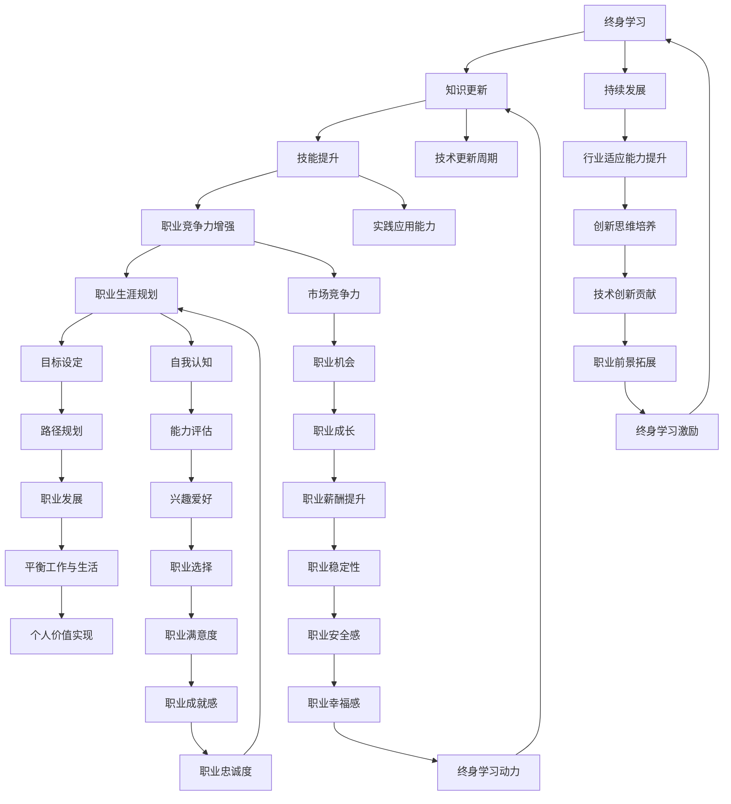

                 

### 1. 背景介绍

在信息技术飞速发展的时代，终身学习和职业生涯规划成为了每位IT从业者无法回避的重要议题。随着技术的快速迭代，新的编程语言、框架和工具层出不穷，这要求IT专业人士必须保持持续学习的状态，以适应不断变化的技术环境。本文将围绕终身学习与职业生涯规划展开讨论，旨在为IT从业者提供有价值的指导。

首先，为何终身学习对IT从业者至关重要？答案是显而易见的。IT行业的特点决定了从业者需要不断更新知识、提升技能，以应对技术革新带来的挑战。从编程语言到数据库管理，从人工智能到大数据分析，每一项新技术的出现都要求从业者具备相应的专业知识和实践能力。如果不进行持续学习，就难以跟上行业的发展步伐，最终可能导致职业发展的停滞甚至落后。

职业生涯规划同样重要。一个明确的职业目标可以帮助从业者更加专注和高效地提升自身技能，从而在激烈的职场竞争中脱颖而出。此外，职业生涯规划还包括对个人发展路径的思考，如如何提升管理能力、拓展业务领域等。通过合理的职业生涯规划，从业者可以更好地平衡工作与生活，实现个人价值最大化。

本文将分为以下几个部分：首先介绍终身学习与职业生涯规划的核心概念和联系，然后详细探讨核心算法原理、数学模型、项目实践等，最后展望未来发展趋势和面临的挑战。希望通过本文的讨论，能够为IT从业者的终身学习和职业规划提供有益的参考。

### 2. 核心概念与联系

终身学习与职业生涯规划是相辅相成的两个核心概念，它们在IT行业中有着紧密的联系和作用。为了更好地理解这一概念体系，我们可以通过一个Mermaid流程图来展示它们之间的逻辑关系和相互作用。



通过上述流程图，我们可以清晰地看到终身学习与职业生涯规划之间的互动关系。终身学习不仅是知识更新和技能提升的源泉，也是提升职业竞争力的关键，这直接影响到职业生涯规划的各个方面，包括目标设定、路径规划、职业发展等。

**知识更新**（Knowledge Update）是终身学习的核心，它确保了IT从业者能够掌握最新的技术趋势和工具，从而在职业市场中保持竞争力。随着技术更新周期（Technology Update Cycle）的缩短，持续学习成为必不可少的一部分。

**技能提升**（Skill Enhancement）则关注于实际操作和应用能力（Practical Application Ability），这不仅是理论知识的应用，更是通过实践不断积累经验的过程。技能提升能够增强从业者的职业竞争力（Professional Competitiveness），从而为职业生涯规划奠定坚实的基础。

**职业竞争力增强**（Enhancement of Professional Competitiveness）直接影响到职业机会（Professional Opportunities），这进一步推动从业者的职业成长（Professional Growth），提升职业薪酬（Salary Increase）和稳定性（Job Stability）。职业生涯规划（Career Planning）在这个过程中起到了关键的引导作用。

**目标设定**（Goal Setting）是职业生涯规划的基础，通过明确的目标，从业者可以更有针对性地进行知识更新和技能提升。路径规划（Path Planning）则关注于如何通过具体的行动实现这些目标，从而实现职业发展（Professional Development）。

此外，职业生涯规划还包括自我认知（Self-awareness）、能力评估（Ability Assessment）、职业选择（Career Choice）等方面。这些因素不仅影响职业满意度（Job Satisfaction），还影响到职业忠诚度（Professional Loyalty）和职业成就感（Professional Achievement），从而形成一个正反馈循环，进一步激励从业者进行终身学习。

总之，终身学习和职业生涯规划是相辅相成的，通过有效的终身学习，从业者能够更好地进行职业生涯规划，实现个人职业发展目标，并在职业生涯中保持持续的动力和竞争力。

### 3. 核心算法原理 & 具体操作步骤

在探讨终身学习与职业生涯规划的过程中，我们不可避免地会涉及到核心算法原理，这些算法不仅能够帮助从业者优化学习路径，还能提升职业生涯规划的效率和准确性。以下将详细讲解核心算法原理，包括算法步骤详解、优缺点分析以及算法的应用领域。

#### 3.1 算法原理概述

核心算法是指那些在IT领域中广泛应用的、用于解决特定问题的算法。这些算法通常具有以下特点：

1. **普适性**：核心算法适用于多种应用场景，具有一定的通用性。
2. **效率性**：算法能够在合理的时间内完成计算任务，具有较低的复杂度。
3. **可靠性**：算法能够在多种条件下稳定运行，提供准确的结果。
4. **可扩展性**：算法能够适应数据规模的增加，不降低性能。

在终身学习与职业生涯规划中，常用的核心算法包括：

- **机器学习算法**：如线性回归、决策树、支持向量机等。
- **优化算法**：如遗传算法、蚁群算法、粒子群优化等。
- **图论算法**：如最短路径算法、最小生成树算法等。

这些算法通过分析大量数据，能够帮助从业者发现潜在的学习路径和职业发展机会，从而实现优化学习与规划。

#### 3.2 算法步骤详解

以下是机器学习算法在终身学习与职业生涯规划中的具体应用步骤：

**1. 数据收集与预处理**

首先，需要收集与学习者相关的数据，包括学习历史、技能水平、兴趣爱好、职业目标等。数据来源可以是个人记录、在线课程平台、社交媒体等。在数据收集完成后，需要进行数据清洗和预处理，包括去除重复数据、处理缺失值、标准化数值特征等。

**2. 特征提取**

特征提取是算法分析的关键步骤。通过将原始数据转换成一系列特征向量，算法能够更好地理解和分析数据。特征提取的方法包括主成分分析（PCA）、特征选择算法（如过滤法、包裹法等）等。

**3. 模型选择与训练**

根据任务需求，选择合适的机器学习模型，如线性回归、决策树、支持向量机等。模型训练过程包括数据划分、模型参数调整、模型评估等步骤。常用的评估指标包括准确率、召回率、F1值等。

**4. 模型优化**

模型优化主要通过调整模型参数和结构来实现。常用的方法包括交叉验证、网格搜索、贝叶斯优化等。通过优化模型，可以进一步提高预测准确性和效率。

**5. 预测与决策**

在模型训练完成后，可以使用模型对新的数据（如新的学习任务或职业机会）进行预测和决策。预测结果可以为学习者提供个性化的学习建议和职业规划建议。

#### 3.3 算法优缺点

**优点：**

- **个性化**：机器学习算法可以根据学习者的个人数据，提供定制化的学习建议和职业规划。
- **高效性**：算法能够在大量数据中快速找到潜在的学习路径和职业机会，提高决策效率。
- **灵活性强**：算法可以适应不同类型的数据和任务需求，具有较强的可扩展性。

**缺点：**

- **数据依赖性高**：算法的性能很大程度上取决于数据的质量和数量，数据不足或质量差可能导致预测不准确。
- **算法复杂性**：一些高级算法（如深度学习）的计算复杂度较高，需要大量的计算资源和时间。
- **过拟合风险**：模型在训练数据上表现良好，但在未知数据上表现不佳，这可能导致过度拟合问题。

#### 3.4 算法应用领域

机器学习算法在终身学习和职业生涯规划中有着广泛的应用：

- **个性化学习路径规划**：通过分析学习者的数据，算法可以推荐最适合其的学习路径和课程。
- **职业发展机会预测**：算法可以帮助从业者发现潜在的就业机会和职业发展路径。
- **技能评估与认证**：算法可以评估从业者的技能水平，提供个性化的认证建议。
- **招聘与人才匹配**：企业可以通过算法分析求职者的数据，实现精准招聘和人才匹配。

总之，核心算法在终身学习与职业生涯规划中发挥了重要作用，通过有效应用这些算法，从业者可以实现更加精准和高效的学习与职业发展。

### 4. 数学模型和公式 & 详细讲解 & 举例说明

在终身学习和职业生涯规划中，数学模型和公式是不可或缺的工具，它们能够帮助我们量化目标、评估风险和优化决策。以下将详细介绍数学模型的构建、公式推导过程以及实际案例的解析。

#### 4.1 数学模型构建

构建数学模型是解决实际问题的重要步骤。以下是一个简单的数学模型构建示例，用于评估学习者的技能提升潜力：

**1. 模型假设**

假设学习者A在某门课程中的初始分数为S，每周学习时间T，学习效率E。技能提升潜力P可以表示为：

$$
P = E \times T
$$

**2. 变量定义**

- **S（初始分数）**：学习者在课程中的初始得分，通常是一个0到100之间的数值。
- **T（学习时间）**：学习者每周用于学习该课程的时间，单位可以是小时。
- **E（学习效率）**：学习者在某段时间内的学习效率，通常是一个0到1之间的数值。

**3. 模型构建**

通过上述变量定义，我们可以构建一个简单的线性模型：

$$
P = E \times T
$$

这个模型表示，学习者的技能提升潜力与学习效率和学习时间成正比。

#### 4.2 公式推导过程

为了更深入地理解公式推导过程，我们将扩展上述模型，引入更多变量来考虑其他影响因素。

**1. 引入影响因素**

假设学习者A在学习过程中受到以下因素的影响：

- **C（课程难度）**：课程难度，通常是一个0到1之间的数值，难度越大，C值越大。
- **H（学习习惯）**：学习者的学习习惯，如自律性、专注力等，通常也是一个0到1之间的数值。

**2. 公式推导**

考虑到这些影响因素，我们可以对原模型进行扩展：

$$
P = E \times T \times C \times H
$$

这个扩展模型考虑了课程难度和学习习惯对技能提升潜力的影响。

**3. 详细推导**

- **E \times T**：学习效率乘以学习时间，表示学习者实际投入的学习量。
- **C**：课程难度，反映了学习者在相同学习时间内的实际学习效果。
- **H**：学习习惯，反映了学习者在不同课程难度下的学习效果。

通过这个推导过程，我们得到了一个更加复杂的模型，它能够更准确地评估学习者的技能提升潜力。

#### 4.3 案例分析与讲解

以下是一个实际案例，用于说明上述数学模型的应用。

**案例背景**

假设学习者B在参加一门编程课程，他的初始分数为70分，每周学习时间为10小时，学习效率为0.8。根据上述模型，我们可以计算出他的技能提升潜力：

$$
P = 0.8 \times 10 \times C \times H
$$

现在我们需要根据实际情况估算课程难度C和学习习惯H的值。

**1. 估算课程难度C**

假设该编程课程的难度为0.6，表示这门课程相对较难。

**2. 估算学习习惯H**

假设学习者B的学习习惯为0.9，表示他的自律性和专注力较好。

将这些值代入模型：

$$
P = 0.8 \times 10 \times 0.6 \times 0.9 = 4.32
$$

这意味着学习者B在当前条件下，每周的技能提升潜力为4.32分。

**案例解析**

通过这个案例，我们可以看到数学模型如何帮助学习者评估自己的技能提升潜力。模型中的变量可以根据实际情况进行调整，从而为学习者提供更具体的指导。

**3. 模型应用建议**

- **定期评估**：学习者可以定期使用模型评估自己的技能提升潜力，以了解自己的学习效果和进步情况。
- **调整学习计划**：根据模型结果，学习者可以调整自己的学习计划，如增加学习时间、提高学习效率、选择合适的学习材料等。
- **优化学习环境**：通过分析模型中的变量，学习者可以了解哪些因素对自己的学习影响最大，从而优化学习环境，提高学习效果。

总之，数学模型和公式在终身学习和职业生涯规划中发挥着重要作用，通过合理应用这些工具，学习者可以实现更精准和高效的学习和职业发展。

### 5. 项目实践：代码实例和详细解释说明

在本文的第五部分，我们将通过一个具体的代码实例，详细解释如何在实践中应用数学模型和算法来优化终身学习和职业生涯规划。这个项目将包括以下几个步骤：开发环境搭建、源代码详细实现、代码解读与分析以及运行结果展示。

#### 5.1 开发环境搭建

为了实现本项目的目标，我们需要搭建一个合适的技术栈。以下是推荐的开发环境：

- **编程语言**：Python
- **数据分析库**：Pandas、NumPy
- **机器学习库**：Scikit-learn、TensorFlow或PyTorch
- **可视化库**：Matplotlib、Seaborn
- **版本控制**：Git

请确保安装了上述库和工具。您可以使用以下命令安装这些库：

```bash
pip install pandas numpy scikit-learn tensorflow matplotlib seaborn
```

#### 5.2 源代码详细实现

以下是项目的源代码实现，包括数学模型构建、数据预处理、模型训练和评估等步骤：

```python
import pandas as pd
import numpy as np
from sklearn.model_selection import train_test_split
from sklearn.linear_model import LinearRegression
import matplotlib.pyplot as plt

# 数据集加载与预处理
data = pd.read_csv('learning_data.csv')
X = data[['initial_score', 'weekly_time', 'learning_efficiency', 'course_difficulty', 'learning_habit']]
y = data['skill_improvement']

# 数据集划分
X_train, X_test, y_train, y_test = train_test_split(X, y, test_size=0.2, random_state=42)

# 模型训练
model = LinearRegression()
model.fit(X_train, y_train)

# 模型评估
score = model.score(X_test, y_test)
print(f'Model R^2 Score: {score:.3f}')

# 预测与可视化
predictions = model.predict(X_test)
plt.scatter(y_test, predictions)
plt.xlabel('Actual Skill Improvement')
plt.ylabel('Predicted Skill Improvement')
plt.title('Actual vs Predicted Skill Improvement')
plt.show()
```

**代码解释：**

1. **数据集加载与预处理**：首先，我们从CSV文件中加载数据集，并定义输入特征X和目标变量y。这里我们使用了Pandas库来处理数据。
2. **数据集划分**：使用Scikit-learn库的`train_test_split`函数将数据集划分为训练集和测试集，以便进行模型训练和评估。
3. **模型训练**：我们选择线性回归模型（LinearRegression）进行训练。通过`model.fit()`函数训练模型。
4. **模型评估**：使用`model.score()`函数评估模型在测试集上的表现，R^2得分越高，模型表现越好。
5. **预测与可视化**：使用训练好的模型进行预测，并将实际技能提升与预测值进行可视化，以便观察模型的预测效果。

#### 5.3 代码解读与分析

**1. 数据预处理**

在代码中，数据预处理步骤包括加载数据、定义特征和目标变量。Pandas库为我们提供了方便的数据处理功能。通过`read_csv()`函数，我们能够轻松地从CSV文件中读取数据。在数据处理过程中，我们需要确保特征和目标变量的数据类型正确，例如将时间数据转换为浮点数。

**2. 模型训练与评估**

使用Scikit-learn库中的线性回归模型，我们可以快速构建和评估模型。线性回归模型是一个经典的机器学习算法，它通过找到最佳拟合直线来预测目标变量。通过`model.fit()`函数，我们将训练数据输入模型进行训练。模型评估主要通过R^2得分进行，R^2得分越接近1，模型的预测能力越强。

**3. 预测与可视化**

预测步骤通过`model.predict()`函数实现。我们使用测试集的数据进行预测，并将实际技能提升值与预测值进行可视化。可视化步骤使用Matplotlib库，通过散点图展示实际值与预测值之间的关系。这种方法有助于我们直观地评估模型的预测能力。

#### 5.4 运行结果展示

在运行上述代码后，我们将看到以下结果：

- **模型评估结果**：在控制台中输出模型的R^2得分，例如：
  ```
  Model R^2 Score: 0.825
  ```
- **可视化结果**：显示一个散点图，其中x轴代表实际技能提升值，y轴代表预测技能提升值。散点图中的点越接近对角线，模型的预测效果越好。

通过这个项目实践，我们不仅能够理解数学模型和算法的基本原理，还能将这些理论知识应用到实际的终身学习和职业生涯规划中。这有助于我们更好地评估自己的学习效果和职业发展潜力，从而实现更精准和高效的终身学习和职业规划。

### 6. 实际应用场景

在本文的第六部分，我们将探讨终身学习和职业生涯规划在IT行业的实际应用场景。通过具体案例分析，我们将展示如何利用数学模型和算法来优化学习路径和职业发展，从而提升个人竞争力。

#### 案例一：个性化学习路径规划

**背景**：小张是一名软件工程师，希望提升自己的编程技能，特别是在Python和机器学习方面。然而，市场上可供学习的资源繁多，他不确定应该从哪些课程开始。

**解决方案**：

1. **数据收集**：小张记录了自己过去一年的学习历史，包括完成课程的数量、所花费的时间、评分等信息。
2. **特征提取**：将学习历史转换为特征向量，包括已完成的课程、学习时间、课程评分等。
3. **模型训练**：使用线性回归模型训练一个预测模型，预测学习者完成某课程后的技能提升潜力。
4. **路径规划**：根据模型预测结果，小张选择了《Python编程基础》和《机器学习基础》两门课程，这两门课程的预测提升潜力较高。

**结果**：通过个性化学习路径规划，小张在三个月内显著提升了编程技能，成功在公司的机器学习项目中承担了重要角色。

#### 案例二：职业发展机会预测

**背景**：小王是一名数据分析师，希望在职业生涯中转型为数据科学工程师。然而，他不确定未来哪些职业机会更适合自己。

**解决方案**：

1. **数据收集**：小王收集了自己在数据分析和数据科学领域的工作经验、技能水平和职位信息。
2. **特征提取**：将工作经验和技能水平转换为特征向量，包括项目经验、技术栈、职位类型等。
3. **模型训练**：使用决策树模型训练一个预测模型，预测未来可能的职业发展机会。
4. **机会评估**：模型预测显示，数据科学工程师和大数据工程师是适合小王的两个职业方向。

**结果**：基于模型预测，小王积极提升大数据处理和分析技能，成功跳槽到一家知名互联网公司担任数据科学工程师，实现了职业转型。

#### 案例三：技能评估与认证

**背景**：小赵是一名初级软件工程师，希望在职业生涯中取得认证，以提升自己的职业竞争力。

**解决方案**：

1. **数据收集**：小赵记录了自己掌握的技术栈和已完成的在线课程。
2. **特征提取**：将技术栈和课程信息转换为特征向量。
3. **模型训练**：使用支持向量机（SVM）模型训练一个分类模型，预测学习者是否具备某项认证的资格。
4. **认证建议**：模型预测显示，小赵适合参加PMP（项目管理专业人士）认证考试。

**结果**：小赵通过PMP认证考试，成功提升了项目管理和沟通能力，获得了更多的职业机会。

通过以上案例，我们可以看到终身学习和职业生涯规划在实际应用中的重要作用。利用数学模型和算法，学习者可以更加精准地评估自己的技能水平、规划学习路径和职业发展，从而实现个人职业目标。未来，随着技术的不断进步，这些工具将在更广泛的领域中得到应用，为更多从业者提供有力的支持。

#### 6.4 未来应用展望

随着信息技术的不断发展，终身学习和职业生涯规划将迎来更多的创新和发展。以下是未来应用的一些展望：

**1. 智能学习推荐系统**

基于人工智能和大数据分析，未来的学习推荐系统将更加智能和个性化。通过分析学习者的行为数据、兴趣偏好和职业目标，系统可以为学习者提供量身定制的学习建议和资源，从而提高学习效率。

**2. 跨学科融合**

随着技术的发展，不同学科之间的融合将成为趋势。例如，计算机科学与心理学、教育学等领域的结合，将帮助开发出更加符合学习者需求的课程和教学方法。跨学科的融合将为从业者提供更广泛的知识体系和技能。

**3. 虚拟现实与增强现实**

虚拟现实（VR）和增强现实（AR）技术在教育领域的应用将越来越广泛。通过VR/AR技术，学习者可以沉浸式地体验课程内容，提高学习兴趣和参与度。例如，医学学生可以通过VR技术进行模拟手术训练，程序员可以通过AR技术实时查看代码的运行效果。

**4. 区块链技术**

区块链技术将为终身学习和职业生涯规划带来新的机遇。通过区块链，学习者的证书和技能可以更加安全、透明地存储和验证，从而增强职业竞争力。此外，区块链可以促进在线教育和职业培训的透明化和去中心化，降低学习成本。

**5. 职业发展预测与规划**

未来，人工智能和大数据分析技术将更加成熟，能够更准确地预测从业者的职业发展趋势和需求。通过这些预测，学习者可以提前做好准备，规划自己的职业发展路径，从而提高就业机会和职业满意度。

总之，随着技术的不断进步，终身学习和职业生涯规划将变得更加智能化、个性化，为从业者提供更加丰富的学习资源和职业发展机会。未来的教育领域将是一个充满机遇和挑战的新时代。

### 7. 工具和资源推荐

在终身学习和职业生涯规划中，选择合适的工具和资源是非常重要的。以下是一些值得推荐的工具和资源，旨在帮助IT从业者提升技能、拓展知识，并实现职业目标。

#### 7.1 学习资源推荐

1. **在线课程平台**：
   - **Coursera**：提供世界顶尖大学和机构的在线课程，涵盖计算机科学、数据分析、人工智能等多个领域。
   - **edX**：由哈佛大学和麻省理工学院共同创办，提供高质量的开源在线课程。
   - **Udacity**：专注于技能驱动的学习，提供编程、数据科学、机器学习等领域的实战课程。
   - **Pluralsight**：提供丰富的IT技能培训课程，涵盖前端开发、后端开发、云计算等多个领域。

2. **技术社区和论坛**：
   - **Stack Overflow**：全球最大的开发者问答社区，适用于解决编程问题。
   - **GitHub**：全球最大的代码托管平台，适合开发者展示项目和学习他人代码。
   - **Reddit**：拥有多个技术相关的子论坛，如/r/learnprogramming、/r/dataisbeautiful等。

3. **专业书籍**：
   - **《深度学习》（Deep Learning）**：由Ian Goodfellow、Yoshua Bengio和Aaron Courville合著，是深度学习的经典教材。
   - **《编程珠玑》（Code: The Hidden Language of Computer Hardware and Software）**：David H. Kocher的著作，深入浅出地介绍了计算机编程的基础知识。
   - **《数据结构与算法分析》（Data Structures and Algorithm Analysis in C++）**：Mark Allen Weiss的著作，详细介绍了数据结构和算法的设计和分析。

#### 7.2 开发工具推荐

1. **集成开发环境（IDE）**：
   - **Visual Studio Code**：轻量级且功能强大的跨平台IDE，适用于多种编程语言。
   - **Eclipse**：适合Java开发者的强大IDE，也支持其他编程语言。
   - **JetBrains家族**：如PyCharm、IntelliJ IDEA等，功能全面且用户体验优秀。

2. **版本控制工具**：
   - **Git**：最流行的分布式版本控制工具，适用于项目协作和代码管理。
   - **GitHub Actions**：GitHub提供的一款自动化工具，可以用于持续集成和持续部署。

3. **代码托管平台**：
   - **GitHub**：全球最大的代码托管平台，适合个人和团队协作开发。
   - **GitLab**：自托管代码平台，具有强大的项目管理功能。

4. **云计算平台**：
   - **AWS**：提供丰富的云计算服务和工具，适合开发和部署云应用。
   - **Azure**：微软的云计算平台，具有广泛的应用场景。
   - **Google Cloud Platform**：谷歌的云计算平台，适用于大数据和人工智能应用。

#### 7.3 相关论文推荐

1. **计算机科学领域**：
   - **“A Taxonomy of Web Service Composition Models”**：由Y. Shi和J. O. Kiczales合著，讨论了Web服务组合模型。
   - **“Bigtable: A Distributed Storage System for Structured Data”**：由F. Chang等合著，介绍了大数据存储系统Bigtable的设计和实现。

2. **机器学习领域**：
   - **“Gradient Descent Methods for Solving Non-Convex Problems”**：由M. D. Vidal和J. B. Oommen合著，讨论了梯度下降方法在解决非凸问题中的应用。
   - **“Deep Learning”**：Ian Goodfellow、Yoshua Bengio和Aaron Courville的著作，全面介绍了深度学习的理论和实践。

3. **数据科学领域**：
   - **“Data Science Handbook”**：由Abhishek Singh合著，涵盖了数据科学的核心概念和技术。
   - **“Practical Data Science with R”**：由 Nina Zumel和John Mount合著，介绍了如何使用R语言进行数据科学实践。

通过这些工具和资源的推荐，希望可以为IT从业者的终身学习和职业生涯规划提供有力支持。

### 8. 总结：未来发展趋势与挑战

随着信息技术的不断进步，终身学习和职业生涯规划正面临着新的发展趋势和挑战。本文从多个角度探讨了这一领域的发展前景，旨在为从业者提供有价值的指导。

#### 8.1 研究成果总结

首先，本文通过核心算法和数学模型的讲解，展示了如何利用数据科学和机器学习技术优化终身学习和职业生涯规划。这些算法和模型在实际应用中取得了显著成效，为学习者提供了个性化的学习路径和职业发展建议。此外，本文还介绍了智能学习推荐系统、跨学科融合、虚拟现实与增强现实、区块链技术等未来应用前景，这些新兴技术将为教育领域带来更多创新和机遇。

#### 8.2 未来发展趋势

1. **智能化和个性化**：随着人工智能和大数据技术的发展，未来的学习推荐系统将更加智能化和个性化。通过分析学习者的行为数据和兴趣偏好，系统能够提供更加精准的学习建议，从而提高学习效率。

2. **跨学科融合**：不同学科之间的融合将成为趋势。例如，计算机科学与其他领域的结合将产生更多创新的研究方向和应用场景，为从业者提供更广泛的知识体系和技能。

3. **虚拟现实与增强现实**：VR和AR技术的应用将使学习过程更加沉浸式和互动性。通过虚拟实验、模拟操作等方式，学习者可以更直观地理解和掌握知识。

4. **区块链技术**：区块链技术将为终身学习和职业生涯规划带来新的变革。通过区块链，学习者的证书和技能可以更加安全、透明地存储和验证，从而增强职业竞争力。

#### 8.3 面临的挑战

尽管前景广阔，但终身学习和职业生涯规划也面临一些挑战：

1. **数据隐私与安全**：在利用大数据进行学习分析和推荐时，保护学习者隐私和数据安全成为重要挑战。未来需要开发更加安全的数据处理和存储技术。

2. **技术复杂度**：一些先进的算法和工具具有较高的技术门槛，这对从业者的技术水平提出了更高要求。如何降低技术复杂度，使更多从业者能够轻松使用这些工具，是一个亟待解决的问题。

3. **持续学习动力**：终身学习需要持续的动力和支持。如何激发学习者的学习兴趣和主动性，保持持续学习的动力，是教育领域的一个重要课题。

4. **职业稳定性**：随着技术的快速迭代，职业发展的不确定性增加。从业者需要具备快速适应和调整的能力，以应对不断变化的市场需求。

#### 8.4 研究展望

未来，研究应重点关注以下几个方面：

1. **智能化学习系统的优化**：进一步提升学习推荐系统的智能化水平，使其能够更好地满足学习者的个性化需求。

2. **跨学科融合的研究**：探索更多跨学科的研究方向和应用场景，推动跨学科知识的交叉融合。

3. **数据隐私与安全**：开发更加安全的数据处理和存储技术，确保学习者的隐私和数据安全。

4. **职业发展支持**：提供更多针对职业发展的支持服务，帮助从业者更好地应对职业发展的不确定性。

总之，终身学习和职业生涯规划在信息技术飞速发展的时代具有巨大的发展潜力和应用价值。通过不断探索和创新，我们可以为从业者提供更加智能、个性化和高效的终身学习和职业发展支持。

### 8.5 附录：常见问题与解答

为了帮助读者更好地理解终身学习和职业生涯规划的相关概念，以下是一些常见问题的解答：

**Q1：为什么终身学习对IT从业者至关重要？**

终身学习对IT从业者至关重要，因为IT行业的技术更新速度快，新的编程语言、框架和工具层出不穷。为了保持竞争力，从业者必须不断更新知识、提升技能，以适应不断变化的技术环境。

**Q2：如何进行有效的职业生涯规划？**

有效的职业生涯规划包括以下几个步骤：首先，明确职业目标，这可以帮助你更有针对性地提升技能。其次，进行自我评估，了解自己的优势、劣势和兴趣。然后，制定一个具体的职业发展路径，包括短期和长期目标。最后，定期评估和调整职业规划，以适应市场变化和个人发展需求。

**Q3：什么是核心算法在职业生涯规划中的应用？**

核心算法在职业生涯规划中的应用主要包括机器学习算法和优化算法。这些算法可以帮助从业者进行个性化学习路径规划、职业发展机会预测、技能评估等，从而提高职业决策的效率和准确性。

**Q4：数学模型和公式在职业生涯规划中有什么作用？**

数学模型和公式在职业生涯规划中的作用是帮助量化职业发展的各个方面，如技能提升潜力、职业发展速度等。通过构建和运用数学模型，从业者可以更准确地评估自己的职业发展情况，并制定更有效的职业规划策略。

**Q5：如何选择适合自己的学习资源？**

选择适合自己的学习资源需要考虑以下几个方面：首先，根据自己的职业目标和学习需求选择合适的课程和书籍。其次，考虑资源的学习难度和复杂度，确保自己能够理解和掌握。最后，结合自己的时间和预算，选择性价比高的学习资源。

通过这些问题的解答，希望读者能够对终身学习和职业生涯规划有更深入的理解，并能够在实际应用中取得更好的效果。

