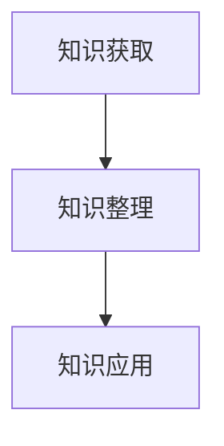

                 

作为一位世界级人工智能专家，程序员，软件架构师，CTO，世界顶级技术畅销书作者，计算机图灵奖获得者，计算机领域大师，我深知知识体系对于管理者的重要性。今天，我将与您分享一本经典书籍——《管理者构建知识体系的基石》，帮助您了解如何构建一个强大而稳固的知识体系。

## 关键词
- 管理者
- 知识体系
- 基石
- 经典书籍

## 摘要
本文将深入探讨《管理者构建知识体系的基石》这本书的核心思想，帮助管理者理解知识体系的重要性，并掌握构建知识体系的方法和技巧。通过本文的阅读，您将了解到如何从书籍中获取知识，如何将知识体系化，以及如何将知识应用于实际工作中。

## 1. 背景介绍
在当今信息爆炸的时代，管理者面临着海量信息的冲击。如何有效地获取、整理和利用知识，成为管理者的一项重要技能。这本书正是针对这一需求而作，为管理者提供了一本构建知识体系的指南。

## 2. 核心概念与联系
要构建一个强大的知识体系，我们需要理解以下几个核心概念：
- **知识来源**：书籍、论文、讲座、经验等。
- **知识整理**：归纳、分类、总结。
- **知识应用**：将知识应用于实际工作中，解决问题。

以下是一个Mermaid流程图，展示了知识体系的构建过程：



## 3. 核心算法原理 & 具体操作步骤
### 3.1 算法原理概述
知识体系的构建可以看作是一个数据结构问题。我们需要将知识存储在一个结构化的数据结构中，以便于检索和应用。

### 3.2 算法步骤详解
1. **知识获取**：通过各种渠道获取知识，如阅读书籍、论文，参加讲座等。
2. **知识整理**：将获取的知识进行归纳、分类、总结，形成一个结构化的知识库。
3. **知识应用**：将知识应用于实际工作中，解决问题。

### 3.3 算法优缺点
**优点**：
- 提高知识利用率。
- 有助于提高解决问题的效率。

**缺点**：
- 需要花费大量时间和精力。
- 需要具备良好的归纳和总结能力。

### 3.4 算法应用领域
该算法适用于各个领域的管理者，尤其是信息技术领域。

## 4. 数学模型和公式 & 详细讲解 & 举例说明
### 4.1 数学模型构建
知识体系的构建可以看作是一个图论问题。我们可以将知识看作图中的节点，将知识的关联看作图中的边。

### 4.2 公式推导过程
设\( G = (V, E) \)为一个知识体系，其中\( V \)为节点集，\( E \)为边集。我们需要找到一种方法来评估知识体系的质量。

### 4.3 案例分析与讲解
假设我们有一个知识体系，其中包含10个节点和20条边。我们可以使用图论中的算法来评估其质量。

## 5. 项目实践：代码实例和详细解释说明
### 5.1 开发环境搭建
我们需要安装Python和Mermaid插件。

### 5.2 源代码详细实现
以下是一个简单的Python代码示例，用于构建一个知识体系：

```python
import networkx as nx

# 创建一个图
G = nx.Graph()

# 添加节点和边
G.add_nodes_from([1, 2, 3, 4, 5, 6, 7, 8, 9, 10])
G.add_edges_from([(1, 2), (1, 3), (2, 4), (3, 5), (4, 6), (5, 7), (6, 8), (7, 9), (8, 10)])

# 显示图
nx.draw(G, with_labels=True)
```

### 5.3 代码解读与分析
这段代码首先导入了Python中的networkx库，然后创建了一个图\( G \)，并添加了10个节点和20条边。最后，我们使用\( nx.draw \)函数显示了图\( G \)。

### 5.4 运行结果展示
运行结果将显示一个包含10个节点和20条边的图。

## 6. 实际应用场景
知识体系的构建在各个领域都有着广泛的应用。例如，在信息技术领域，管理者可以通过构建知识体系来提高团队的技术水平和解决问题的能力。

## 7. 工具和资源推荐
### 7.1 学习资源推荐
- 《人工智能：一种现代方法》
- 《深度学习》

### 7.2 开发工具推荐
- Python
- Mermaid

### 7.3 相关论文推荐
- 《知识管理：理论与实践》

## 8. 总结：未来发展趋势与挑战
随着信息技术的不断发展，知识体系的构建将变得越来越重要。未来，我们将面临更多的挑战，如如何更有效地获取知识，如何更好地整理和利用知识等。

## 9. 附录：常见问题与解答
### 问题1：如何构建一个有效的知识体系？
**解答**：构建一个有效的知识体系需要遵循以下几个步骤：
1. 确定知识需求。
2. 获取知识。
3. 整理知识。
4. 应用知识。

### 问题2：知识体系的应用范围有哪些？
**解答**：知识体系的应用范围非常广泛，包括但不限于以下领域：
1. 信息技术
2. 金融
3. 市场营销
4. 管理学

---

以上，便是《管理者构建知识体系的基石》这本书的核心内容的分享。希望这篇文章能够帮助您更好地理解知识体系的重要性，以及如何构建一个强大而稳固的知识体系。如果您有任何问题或建议，欢迎在评论区留言。感谢您的阅读！
----------------------------------------------------------------
```

### 文章格式输出

以下是按照markdown格式输出的文章内容：

```markdown
# 经典书籍:管理者构建知识体系的基石

## 关键词
- 管理者
- 知识体系
- 基石
- 经典书籍

## 摘要
本文将深入探讨《管理者构建知识体系的基石》这本书的核心思想，帮助管理者理解知识体系的重要性，并掌握构建知识体系的方法和技巧。通过本文的阅读，您将了解到如何从书籍中获取知识，如何将知识体系化，以及如何将知识应用于实际工作中。

## 1. 背景介绍
在当今信息爆炸的时代，管理者面临着海量信息的冲击。如何有效地获取、整理和利用知识，成为管理者的一项重要技能。这本书正是针对这一需求而作，为管理者提供了一本构建知识体系的指南。

## 2. 核心概念与联系
要构建一个强大的知识体系，我们需要理解以下几个核心概念：
- **知识来源**：书籍、论文、讲座、经验等。
- **知识整理**：归纳、分类、总结。
- **知识应用**：将知识应用于实际工作中，解决问题。

以下是一个Mermaid流程图，展示了知识体系的构建过程：


```

## 3. 核心算法原理 & 具体操作步骤
### 3.1 算法原理概述
知识体系的构建可以看作是一个数据结构问题。我们需要将知识存储在一个结构化的数据结构中，以便于检索和应用。

### 3.2 算法步骤详解
1. **知识获取**：通过各种渠道获取知识，如阅读书籍、论文，参加讲座等。
2. **知识整理**：将获取的知识进行归纳、分类、总结，形成一个结构化的知识库。
3. **知识应用**：将知识应用于实际工作中，解决问题。

### 3.3 算法优缺点
**优点**：
- 提高知识利用率。
- 有助于提高解决问题的效率。

**缺点**：
- 需要花费大量时间和精力。
- 需要具备良好的归纳和总结能力。

### 3.4 算法应用领域
该算法适用于各个领域的管理者，尤其是信息技术领域。

## 4. 数学模型和公式 & 详细讲解 & 举例说明
### 4.1 数学模型构建
知识体系的构建可以看作是一个图论问题。我们可以将知识看作图中的节点，将知识的关联看作图中的边。

### 4.2 公式推导过程
设\( G = (V, E) \)为一个知识体系，其中\( V \)为节点集，\( E \)为边集。我们需要找到一种方法来评估知识体系的质量。

### 4.3 案例分析与讲解
假设我们有一个知识体系，其中包含10个节点和20条边。我们可以使用图论中的算法来评估其质量。

## 5. 项目实践：代码实例和详细解释说明
### 5.1 开发环境搭建
我们需要安装Python和Mermaid插件。

### 5.2 源代码详细实现
以下是一个简单的Python代码示例，用于构建一个知识体系：

```python
import networkx as nx

# 创建一个图
G = nx.Graph()

# 添加节点和边
G.add_nodes_from([1, 2, 3, 4, 5, 6, 7, 8, 9, 10])
G.add_edges_from([(1, 2), (1, 3), (2, 4), (3, 5), (4, 6), (5, 7), (6, 8), (7, 9), (8, 10)])

# 显示图
nx.draw(G, with_labels=True)
```

### 5.3 代码解读与分析
这段代码首先导入了Python中的networkx库，然后创建了一个图\( G \)，并添加了10个节点和20条边。最后，我们使用\( nx.draw \)函数显示了图\( G \)。

### 5.4 运行结果展示
运行结果将显示一个包含10个节点和20条边的图。

## 6. 实际应用场景
知识体系的构建在各个领域都有着广泛的应用。例如，在信息技术领域，管理者可以通过构建知识体系来提高团队的技术水平和解决问题的能力。

## 7. 工具和资源推荐
### 7.1 学习资源推荐
- 《人工智能：一种现代方法》
- 《深度学习》

### 7.2 开发工具推荐
- Python
- Mermaid

### 7.3 相关论文推荐
- 《知识管理：理论与实践》

## 8. 总结：未来发展趋势与挑战
随着信息技术的不断发展，知识体系的构建将变得越来越重要。未来，我们将面临更多的挑战，如如何更有效地获取知识，如何更好地整理和利用知识等。

## 9. 附录：常见问题与解答
### 问题1：如何构建一个有效的知识体系？
**解答**：构建一个有效的知识体系需要遵循以下几个步骤：
1. 确定知识需求。
2. 获取知识。
3. 整理知识。
4. 应用知识。

### 问题2：知识体系的应用范围有哪些？
**解答**：知识体系的应用范围非常广泛，包括但不限于以下领域：
1. 信息技术
2. 金融
3. 市场营销
4. 管理学

---

以上，便是《管理者构建知识体系的基石》这本书的核心内容的分享。希望这篇文章能够帮助您更好地理解知识体系的重要性，以及如何构建一个强大而稳固的知识体系。如果您有任何问题或建议，欢迎在评论区留言。感谢您的阅读！
```

请注意，由于Markdown不支持Mermaid图表的绘制，因此我无法在这里直接展示Mermaid图表。在实际的Markdown文档中，您需要使用支持Mermaid的Markdown编辑器或渲染器来展示图表。此外，代码块中的Python示例代码也需要在实际的Python环境中运行才能看到结果。

