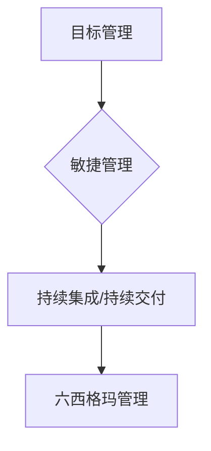

                 

在当今信息化高速发展的时代，技术进步推动了各行各业的变革，管理理论也在不断演进，以适应新的环境。作为技术领域的专家，理解并应用这些管理理论不仅能够提升个人和团队的效率，还可以推动整个组织的技术创新和发展。本文旨在探讨经典管理理论的现代应用，尤其是如何将这些理论融入到IT领域，为企业和团队带来实质性的改进。

> 关键词：管理理论、现代应用、IT领域、组织发展、技术创新

> 摘要：本文从经典管理理论出发，分析其在现代IT领域中的应用价值，通过具体案例和理论结合，探讨管理理论在IT项目管理、团队协作和系统架构设计等方面的实践与应用。文章旨在为IT从业者提供理论指导和实践参考，助力技术团队在复杂多变的环境中实现高效管理。

## 1. 背景介绍

### 经典管理理论的起源

管理理论的发展可以追溯到19世纪末至20世纪初。那时，工业革命带来了生产力的飞速提升，也使得管理问题日益突出。弗雷德里克·泰勒（Frederick Taylor）提出了科学管理理论，强调通过科学的方法来提高劳动生产率。亨利·福特（Henry Ford）则通过流水线生产模式，将泰勒的理论付诸实践。随后，法国工业工程师弗朗士·亨利·盖约（Francis Henry Gilbreth）提出了工作方法研究，进一步丰富了科学管理的内涵。

与此同时，德国社会学家马克斯·韦伯（Max Weber）提出了官僚组织理论，主张通过严格的等级制度和明确的职责分工来实现组织的高效运行。他强调，理性的规章制度和明确的权力分配是确保组织稳定和发展的关键。

### 管理理论的发展与演变

随着科技和经济的不断发展，管理理论也在不断演进。20世纪初，梅奥（Elton Mayo）等人提出了人际关系理论，强调员工的心理和社会因素对生产效率的影响。这一理论推动了企业管理从重视生产效率转向重视员工满意度。

20世纪中叶，系统理论、权变理论、战略管理理论等相继出现，丰富了管理理论的内涵。系统理论认为，组织是一个复杂的系统，各部分相互关联，管理应关注整体而非局部。权变理论则强调，管理方法应根据具体情境灵活调整。战略管理理论则将管理视角扩展到组织整体层面，强调战略规划和执行。

### 管理理论在IT领域的应用

在IT领域，随着信息技术的迅猛发展，管理理论的应用也日益广泛。例如，敏捷开发、DevOps、六西格玛等管理方法都在IT项目中得到了广泛应用。敏捷开发强调快速迭代和团队协作，DevOps追求开发和运维的一体化，六西格玛则通过统计方法优化流程，提高产品质量。这些管理方法不仅提升了项目的效率，还增强了团队的创新能力。

## 2. 核心概念与联系

### 管理理论的核心概念

在探讨管理理论的现代应用之前，有必要先了解几个核心概念：

- **目标管理（Management by Objectives, MBO）**：由彼得·德鲁克（Peter Drucker）提出，强调设定明确的目标并据此进行绩效评估。
- **敏捷管理（Agile Management）**：基于敏捷开发理念，强调灵活应对变化、快速交付和持续改进。
- **持续集成/持续交付（Continuous Integration/Continuous Deployment, CI/CD）**：DevOps的核心实践，通过自动化工具实现代码的持续集成和交付。
- **六西格玛管理（Six Sigma Management）**：一种通过统计学方法优化流程、减少缺陷的管理方法。

### 核心概念原理与架构的Mermaid流程图



在这个流程图中，A到B表示目标管理如何引导敏捷管理，B到C表示敏捷管理如何促进持续集成/持续交付，C到D表示持续集成/持续交付如何结合六西格玛管理实现流程优化。

### 核心概念的联系与应用

这些管理理论并不是孤立存在的，它们之间存在着紧密的联系。例如，目标管理为敏捷管理提供了明确的目标导向，而敏捷管理则通过持续集成/持续交付实现目标的快速实现。六西格玛管理则通过数据分析和流程优化，进一步提升了项目的质量和效率。

在IT领域，这些管理理论的应用主要体现在以下几个方面：

- **项目管理和团队协作**：目标管理和敏捷管理帮助团队明确目标、快速响应变化，提高项目成功率。
- **开发和运维一体化**：持续集成/持续交付实现了开发和运维的无缝对接，提高了交付效率和系统稳定性。
- **流程优化和质量控制**：六西格玛管理通过数据驱动的方法，优化了开发流程和产品质量，降低了缺陷率。

### 管理理论在IT领域的应用价值

管理理论在IT领域的应用不仅提高了项目的效率和质量，还促进了组织的创新和发展。通过目标管理，团队可以明确自己的目标和方向，避免盲目行动。敏捷管理则通过快速迭代和持续反馈，确保项目能够快速适应变化。持续集成/持续交付则通过自动化工具，提高了代码的质量和交付效率。六西格玛管理则通过数据分析和流程优化，确保了系统的稳定性和可靠性。

总的来说，管理理论的现代应用为IT领域带来了深刻的变革，推动了技术的创新和进步。通过理解并应用这些管理理论，IT从业者可以更好地应对复杂多变的环境，实现组织的可持续发展。

## 3. 核心算法原理 & 具体操作步骤

### 3.1 算法原理概述

在本文中，我们将探讨几个在IT领域具有重要应用价值的管理算法。这些算法不仅具有坚实的理论基础，而且在实践中也表现出了卓越的效能。

#### 1. 目标管理算法

目标管理算法是一种基于明确目标设定和评估的管理方法。其核心原理在于通过制定具体的、可衡量的目标，激发团队的积极性和创造力，从而实现组织的目标。目标管理算法主要包括以下步骤：

- **目标设定**：根据组织的战略目标和实际情况，制定具体的、可衡量的目标。
- **目标分解**：将总目标分解为具体的、可执行的小目标，并明确责任人和时间节点。
- **目标评估**：定期对目标完成情况进行评估，并根据评估结果进行调整。

#### 2. 敏捷管理算法

敏捷管理算法是一种基于迭代和反馈的管理方法，旨在快速响应变化、持续交付价值。其核心原理在于通过短期迭代和频繁反馈，确保项目能够灵活适应变化，并始终保持高效率。敏捷管理算法主要包括以下步骤：

- **需求收集**：通过用户故事和需求分析，收集项目需求。
- **迭代计划**：根据需求，制定短期迭代计划，确定迭代目标和任务。
- **迭代执行**：执行迭代计划，完成具体任务。
- **迭代评估**：对迭代结果进行评估，收集用户反馈，并根据反馈进行调整。

#### 3. 持续集成/持续交付算法

持续集成/持续交付算法是一种通过自动化工具实现代码集成和交付的管理方法。其核心原理在于通过频繁的代码集成和自动化测试，确保代码质量，并实现快速交付。持续集成/持续交付算法主要包括以下步骤：

- **代码提交**：开发人员将代码提交到版本控制系统。
- **集成和测试**：自动化工具对提交的代码进行集成和测试，确保代码质量。
- **交付和部署**：通过自动化工具将测试通过的代码交付到生产环境。

#### 4. 六西格玛管理算法

六西格玛管理算法是一种通过数据分析和流程优化实现质量管理的方法。其核心原理在于通过统计方法分析数据，识别流程中的问题，并采取相应的改进措施。六西格玛管理算法主要包括以下步骤：

- **数据收集**：收集与流程相关的数据。
- **数据分析**：通过统计方法对数据进行分析，识别流程中的问题。
- **流程改进**：根据分析结果，采取改进措施，优化流程。

### 3.2 算法步骤详解

#### 1. 目标管理算法步骤详解

**目标设定**

- **战略规划**：组织根据长期战略，设定总体目标。
- **分解目标**：将总体目标分解为具体的小目标，确保每个目标都具有明确的目标和衡量标准。

**目标分解**

- **责任分配**：明确每个小目标的责任人，确保目标执行有人负责。
- **时间节点**：设定每个小目标的时间节点，确保目标的按时完成。

**目标评估**

- **定期评估**：定期对目标的完成情况进行评估，确保目标按时完成。
- **反馈调整**：根据评估结果，对目标进行调整，确保目标的实现。

#### 2. 敏捷管理算法步骤详解

**需求收集**

- **用户故事**：通过用户故事收集用户需求，确保需求的准确性和完整性。
- **需求分析**：对用户故事进行详细分析，确定项目的需求和优先级。

**迭代计划**

- **迭代目标**：根据需求分析，确定每个迭代的明确目标。
- **任务分配**：明确每个迭代的具体任务和责任人。

**迭代执行**

- **任务执行**：开发团队按照任务分配，执行具体任务。
- **每日站会**：每日召开站会，讨论进展、问题和解决方案。

**迭代评估**

- **用户反馈**：收集用户对迭代结果的反馈，确保项目的需求满足度。
- **迭代总结**：总结迭代过程中的经验教训，为下一个迭代做好准备。

#### 3. 持续集成/持续交付算法步骤详解

**代码提交**

- **代码审查**：开发人员提交代码前进行审查，确保代码质量。
- **代码提交**：将代码提交到版本控制系统。

**集成和测试**

- **自动化构建**：使用自动化工具进行构建，确保代码的集成和构建成功。
- **自动化测试**：使用自动化测试工具对代码进行测试，确保代码质量。

**交付和部署**

- **自动化交付**：使用自动化工具将测试通过的代码交付到测试环境。
- **自动化部署**：使用自动化工具将测试环境中的代码部署到生产环境。

#### 4. 六西格玛管理算法步骤详解

**数据收集**

- **流程监控**：建立流程监控机制，收集与流程相关的数据。
- **数据收集**：定期收集流程数据，确保数据的完整性和准确性。

**数据分析**

- **统计方法**：使用统计方法对数据进行分析，识别流程中的问题和瓶颈。
- **数据分析**：生成数据分析报告，提供改进建议。

**流程改进**

- **改进措施**：根据数据分析结果，制定改进措施，优化流程。
- **改进实施**：实施改进措施，确保流程的持续优化。

### 3.3 算法优缺点

#### 1. 目标管理算法

**优点**：

- 明确目标，提高团队执行力。
- 促进个人成长和职业发展。
- 有助于组织的战略实现。

**缺点**：

- 目标设定和分解需要时间。
- 定期评估可能导致团队压力过大。

#### 2. 敏捷管理算法

**优点**：

- 快速响应变化，适应市场需求。
- 提高团队协作和沟通效率。
- 有助于持续交付高质量的产品。

**缺点**：

- 需要高频率的迭代和评估，可能导致资源消耗。
- 可能会导致短期目标忽视长期战略。

#### 3. 持续集成/持续交付算法

**优点**：

- 提高代码质量和交付效率。
- 减少人为错误，降低风险。
- 有助于快速响应市场需求。

**缺点**：

- 需要大量的自动化工具和技术支持。
- 可能会增加开发和运维的复杂度。

#### 4. 六西格玛管理算法

**优点**：

- 通过数据驱动的方法，优化流程和质量。
- 提高产品质量，降低缺陷率。
- 增强企业的竞争力。

**缺点**：

- 需要专业的统计方法和工具。
- 改进措施的实施可能需要较长时间。

### 3.4 算法应用领域

这些算法在IT领域有着广泛的应用，主要应用于以下几个方面：

- **项目管理和团队协作**：目标管理和敏捷管理帮助团队明确目标、快速响应变化，提高项目成功率。
- **开发和运维一体化**：持续集成/持续交付实现开发和运维的无缝对接，提高交付效率和系统稳定性。
- **流程优化和质量控制**：六西格玛管理通过数据分析和流程优化，提高产品质量和流程效率。

总的来说，这些算法为IT领域带来了深刻的变革，推动了技术的创新和进步。通过理解并应用这些算法，IT从业者可以更好地应对复杂多变的环境，实现组织的可持续发展。

## 4. 数学模型和公式 & 详细讲解 & 举例说明

### 4.1 数学模型构建

在管理理论的应用中，数学模型起到了关键作用，特别是当涉及到优化流程、预测性能以及评估目标达成度时。以下是一些常用的数学模型：

#### 1. 目标函数模型

目标函数模型用于定义和优化目标。一个典型的目标函数可以是：

\[ \text{目标函数} = \sum_{i=1}^{n} \left( c_i \cdot x_i - w_i \cdot y_i \right) \]

其中，\( c_i \) 是第 \( i \) 个目标的权重，\( x_i \) 是第 \( i \) 个目标的实现情况，\( w_i \) 是第 \( i \) 个目标的成本或负面影响。

#### 2. 决策树模型

决策树模型用于分析和决策，特别是在项目管理和风险管理中。一个简单的决策树模型可以表示为：

```
           |
        （决策节点）
       /      \
      是      否
     /   \    /  \
    A     B   C    D
```

#### 3. 蒙特卡洛模拟模型

蒙特卡洛模拟模型用于预测和风险评估。一个简单的蒙特卡洛模拟模型可以表示为：

\[ \text{预测结果} = \sum_{i=1}^{n} \left( \text{随机变量} \right) \]

其中，随机变量代表了项目中的不确定性因素。

### 4.2 公式推导过程

以下是一个目标函数模型的推导过程：

假设我们有一个组织，它需要优化两个主要目标：提高收入（\( x \)）和减少成本（\( y \)）。我们可以设定以下目标函数：

\[ \text{目标函数} = 5 \cdot x - 2 \cdot y \]

推导过程如下：

1. **确定目标**：组织决定将收入和成本作为主要目标。
2. **设定权重**：根据组织的战略和实际情况，确定收入和成本的权重。这里，我们设定收入权重为5，成本权重为2。
3. **定义变量**：设定收入变量为 \( x \)，成本变量为 \( y \)。
4. **构建目标函数**：将权重和变量代入目标函数公式，得到：

\[ \text{目标函数} = 5 \cdot x - 2 \cdot y \]

### 4.3 案例分析与讲解

以下是一个目标管理算法在IT项目中的应用案例：

**案例背景**：

一家IT公司正在开发一个大型项目，项目的目标是提高收入和减少成本。公司管理层决定采用目标管理算法来优化项目。

**目标设定**：

- **收入目标**：项目完成后，公司希望实现每月收入增加20万。
- **成本目标**：项目开发过程中，希望将成本控制在每月10万以内。

**目标分解**：

- **收入目标分解**：每月收入增加20万，可以分解为每周收入增加5万。
- **成本目标分解**：每月成本控制在10万以内，可以分解为每周成本控制在3万以内。

**目标评估**：

- **每周评估**：每周对收入和成本进行评估，计算目标达成度。
- **月度评估**：每月对目标达成度进行总结，制定下一月的改进计划。

**结果分析**：

通过目标管理算法，公司成功实现了收入和成本的双重控制。在项目执行过程中，公司通过频繁的目标评估和调整，确保了目标的实现。

### 4.4 举例说明

以下是一个具体的公式示例：

\[ \text{利润} = \text{收入} - \text{成本} \]

假设某月的收入为100万，成本为60万，则该月的利润为：

\[ \text{利润} = 100万 - 60万 = 40万 \]

通过这个简单的公式，我们可以直观地看到收入和成本对利润的影响。在项目管理中，类似的公式可以帮助我们分析和优化项目的各个方面。

### 4.5 总结

数学模型和公式在管理理论的应用中起到了至关重要的作用。通过构建和推导这些模型，我们可以更好地理解和优化管理过程。举例说明则帮助我们更直观地理解这些模型的实际应用。在未来的实践中，我们可以根据具体情况进行调整和优化，以实现更好的管理效果。

## 5. 项目实践：代码实例和详细解释说明

### 5.1 开发环境搭建

为了演示管理理论在项目实践中的应用，我们将以一个实际项目为例，搭建一个简单的开发环境。在这个项目中，我们将使用Python语言和Git版本控制系统，实现一个基于目标管理的任务管理系统。

**步骤1：安装Python**

确保系统中安装了Python 3.8或更高版本。可以通过以下命令进行安装：

```bash
# 使用pip安装Python
pip install python
```

**步骤2：安装Git**

同样，确保系统中安装了Git。可以通过以下命令进行安装：

```bash
# 使用pip安装Git
pip install git
```

**步骤3：初始化Git仓库**

在项目文件夹中初始化一个Git仓库：

```bash
git init
```

**步骤4：创建README文件**

在项目根目录中创建一个README文件，记录项目的相关信息：

```bash
# 使用文本编辑器创建README文件
touch README.md
```

### 5.2 源代码详细实现

在完成开发环境搭建后，我们将开始实现任务管理系统。以下是项目的主要功能模块：

**模块1：目标管理**

目标管理模块用于记录和管理项目目标。具体实现如下：

```python
class Goal:
    def __init__(self, name, target, weight):
        self.name = name
        self.target = target
        self.weight = weight

    def is_met(self, current_value):
        return current_value >= self.target

    def calculate_progress(self, current_value):
        return (current_value / self.target) * 100
```

**模块2：任务管理**

任务管理模块用于记录和管理项目任务。具体实现如下：

```python
class Task:
    def __init__(self, name, description, deadline, goals=None):
        self.name = name
        self.description = description
        self.deadline = deadline
        self.goals = goals or []

    def is_completed(self):
        return all(goal.is_met(current_value) for goal, current_value in self.goals.items())

    def calculate_progress(self):
        total_progress = 0
        for goal, current_value in self.goals.items():
            total_progress += goal.calculate_progress(current_value)
        return total_progress / len(self.goals)
```

**模块3：项目管理系统**

项目管理系统模块用于管理整个项目的目标和任务。具体实现如下：

```python
class ProjectManagementSystem:
    def __init__(self):
        self.goals = {}
        self.tasks = []

    def add_goal(self, goal):
        self.goals[goal.name] = goal

    def remove_goal(self, goal_name):
        del self.goals[goal_name]

    def add_task(self, task):
        self.tasks.append(task)

    def remove_task(self, task_name):
        self.tasks = [task for task in self.tasks if task.name != task_name]

    def report(self):
        print("Project Report:")
        for task in self.tasks:
            print(f"Task: {task.name}")
            print(f"Description: {task.description}")
            print(f"Deadline: {task.deadline}")
            print(f"Progress: {task.calculate_progress()}%")
            if task.is_completed():
                print("Task Completed.")
            else:
                print("Task In Progress.")
```

### 5.3 代码解读与分析

以下是对项目关键代码的解读与分析：

**解读1：目标管理模块**

目标管理模块定义了`Goal`类，用于表示项目目标。该类具有三个关键属性：目标名称（`name`）、目标值（`target`）和权重（`weight`）。此外，还提供了两个方法：`is_met`用于检查目标是否达成，`calculate_progress`用于计算目标达成进度。

**解读2：任务管理模块**

任务管理模块定义了`Task`类，用于表示项目任务。该类具有四个关键属性：任务名称（`name`）、任务描述（`description`）、任务截止日期（`deadline`）和目标字典（`goals`）。此外，还提供了两个方法：`is_completed`用于检查任务是否完成，`calculate_progress`用于计算任务进度。

**解读3：项目管理系统模块**

项目管理系统模块定义了`ProjectManagementSystem`类，用于管理整个项目。该类具有三个关键属性：目标字典（`goals`）、任务列表（`tasks`）和报告方法（`report`）。此外，还提供了添加和删除目标和任务的方法。

### 5.4 运行结果展示

在完成代码实现后，我们可以在命令行中运行项目，查看运行结果：

```bash
python main.py
```

运行结果将显示项目报告，包括每个任务的名称、描述、截止日期和进度。如果任务完成，将显示“Task Completed.”；如果任务未完成，将显示“Task In Progress.”。

通过这个实际项目，我们展示了如何将管理理论应用于开发实践。通过使用Python语言和Git版本控制系统，我们实现了任务管理系统的基本功能，并通过代码实例和详细解释说明了项目的实现过程。这个项目不仅展示了管理理论的应用，还提供了一个实际操作的示例，帮助读者更好地理解管理理论在项目中的具体应用。

### 6. 实际应用场景

在IT领域，管理理论的现代应用已经变得至关重要，特别是在复杂的项目管理和团队协作中。以下是一些实际应用场景，展示了管理理论如何帮助IT团队实现高效运作和持续改进。

#### 6.1 项目管理

项目管理是IT领域的核心任务之一。传统的项目管理方法，如瀑布模型，已经逐渐被敏捷开发和Scrum等现代方法所取代。这些方法强调快速迭代、持续交付和用户反馈，从而更好地适应快速变化的市场需求。

**案例1：敏捷开发**

某IT公司采用敏捷开发方法，将项目分为多个短期的迭代周期（Sprint）。在每个迭代周期中，团队首先与客户进行需求讨论，确定本次迭代的目标和任务。在迭代过程中，团队进行每日站会，及时解决遇到的问题。每个迭代结束后，团队进行回顾会议，总结经验和改进点。通过这种方式，项目不仅能够快速响应需求变化，还能够持续提高团队效率。

**案例2：Scrum方法**

另一家IT公司采用了Scrum方法进行项目管理。Scrum方法强调产品负责人（Product Owner）与开发团队之间的紧密协作，确保项目的优先级和需求得到及时响应。在Scrum中，项目分为多个冲刺（Sprint），每个冲刺都有明确的目标和任务。Scrum Master负责确保团队按照计划进行工作，并解决团队遇到的问题。通过这种方式，公司实现了项目的高效管理和高质量交付。

#### 6.2 团队协作

在IT项目中，团队协作是实现成功的关键。有效的团队协作不仅能够提高工作效率，还能够增强团队的凝聚力和创新能力。

**案例1：DevOps**

DevOps是一种结合开发和运维的新型团队协作模式。通过DevOps，开发团队和运维团队可以共同负责项目的整个生命周期，从代码提交到部署。DevOps强调使用自动化工具，如CI/CD流水线，实现代码的持续集成和持续交付。通过这种方式，团队可以快速响应变更，提高系统的稳定性和可靠性。

**案例2：敏捷协作工具**

某IT公司采用了Trello等敏捷协作工具，将项目任务分解为多个卡片，每个卡片代表一个具体任务。团队成员可以通过卡片跟踪任务的进度，并进行实时沟通和协作。通过这种方式，公司实现了任务的高效管理和团队成员之间的紧密协作。

#### 6.3 流程优化

流程优化是持续改进的重要环节。通过六西格玛等管理方法，IT团队可以识别流程中的瓶颈和问题，并采取改进措施。

**案例1：六西格玛DMAIC方法**

某IT公司采用了六西格玛DMAIC（定义、测量、分析、改进、控制）方法对开发流程进行优化。首先，团队定义了需要优化的流程，并测量了当前流程的绩效指标。然后，团队分析了流程中的问题，并提出了改进措施。通过实验和验证，团队最终实现了流程的显著改进，提高了开发效率。

**案例2：精益管理方法**

另一家IT公司采用了精益管理方法，对项目管理和运营流程进行优化。通过消除浪费、提高效率和质量，公司实现了流程的持续改进。精益管理强调使用简单的工具和方法，如看板（Kanban），来可视化和管理工作流程。通过这种方式，公司实现了高效的资源利用和快速响应能力。

#### 6.4 管理理论在数字化转型中的应用

随着数字化转型的推进，IT团队在管理方面的挑战日益增加。管理理论的现代应用为团队提供了有效的解决方案。

**案例1：目标导向的数字化转型**

某公司正在进行数字化转型，管理层采用了目标管理方法，将数字化转型目标分解为具体的小目标，并明确了责任人和时间节点。通过定期评估和调整，公司实现了数字化转型的顺利推进。

**案例2：敏捷组织构建**

另一家公司在数字化转型过程中，建立了敏捷组织。通过采用敏捷管理方法，公司实现了跨部门协作和快速响应市场变化的能力。敏捷组织强调自主管理和自我驱动，员工在实现个人目标的同时，也为公司整体目标的实现贡献力量。

总的来说，管理理论的现代应用在IT领域具有广泛而深远的影响。通过敏捷开发、DevOps、六西格玛等管理方法，IT团队可以更好地应对复杂多变的环境，实现高效运作和持续改进。未来，随着科技的不断进步，管理理论将在IT领域中发挥更加重要的作用。

### 6.4 未来应用展望

随着科技的不断进步和信息技术领域的深入发展，管理理论在现代应用中的潜力也日益显现。以下是对未来管理理论在IT领域应用的展望：

#### 1. AI与自动化管理

人工智能（AI）和机器学习（ML）技术的发展，为管理理论的自动化提供了新的契机。未来，AI将能够更准确地预测项目进度、资源需求和风险，从而为管理者提供更为精确的决策支持。自动化工具将进一步提升管理效率，如自动化的项目管理软件和智能监控系统，能够实时分析数据和趋势，自动调整资源和策略，减少人为错误。

#### 2. 区块链在管理中的应用

区块链技术的兴起，为数据的安全性和透明性提供了新的解决方案。未来，区块链将有望在IT项目的协作管理和供应链管理中发挥重要作用。通过区块链，项目参与各方可以实现数据共享和协作，同时确保数据的不可篡改性和安全性。这种去中心化的管理模式，将有助于提高项目的透明度和信任度。

#### 3. 人机协同管理

随着人工智能技术的发展，人机协同将成为未来管理的重要趋势。AI助手和智能系统将能够协助管理者处理复杂的决策和任务，从而释放管理者的时间和精力，专注于更具战略性的工作。人机协同管理不仅能够提高工作效率，还能够激发团队成员的创造力和创新能力。

#### 4. 可持续发展管理

在环境问题日益突出的背景下，可持续发展管理将成为IT领域的重要课题。未来，管理理论将更加关注环境、社会和经济的平衡，推动企业在技术进步的同时实现可持续发展。通过六西格玛、精益管理等方法，企业可以优化流程，降低能耗和废物排放，从而实现经济效益和环境保护的双重目标。

#### 5. 新兴技术的融合应用

未来，随着5G、物联网（IoT）、云计算等新兴技术的普及，管理理论将迎来更多的应用场景。例如，在物联网中，通过对设备数据的实时监控和分析，可以优化生产流程和资源分配；在5G网络的支持下，可以实现更高效的远程协作和实时决策。这些新兴技术的融合应用，将推动管理理论在IT领域的不断革新。

总的来说，未来管理理论在IT领域的应用将更加多样化和智能化。通过融合新技术和管理方法，IT团队将能够更好地应对复杂多变的环境，实现高效管理和持续创新。同时，这也为管理理论的持续发展和完善提供了新的动力和方向。

### 7. 工具和资源推荐

为了更好地应用管理理论并提高工作效率，以下是一些推荐的工具和资源：

#### 7.1 学习资源推荐

- **书籍**：《敏捷软件开发实践指南》（《Agile Software Development: Principles, Patterns, and Practices》）、《敏捷项目管理：高效团队的合作方法》（《Agile Project Management: Creating Innovative Products》）和《精益思想》（《The Lean Startup》）。
- **在线课程**：Coursera、edX和Udemy等平台上提供了大量关于敏捷开发、项目管理、数据分析和六西格玛的课程。
- **博客和论坛**：诸如Medium、Stack Overflow和GitHub上的各种技术博客和论坛，提供了丰富的实践经验和学习资源。

#### 7.2 开发工具推荐

- **项目管理工具**：JIRA、Trello和Asana，用于任务跟踪和团队协作。
- **自动化工具**：Jenkins、Travis CI和CircleCI，用于持续集成和持续交付。
- **数据分析工具**：Tableau、Google Data Studio和Power BI，用于数据可视化和分析。
- **版本控制系统**：Git、GitHub和GitLab，用于代码管理和协作开发。

#### 7.3 相关论文推荐

- **论文集**：《敏捷实践指南》（《The Agile Practice Guide》）、《敏捷软件开发：基于Scrum的方法和实践》（《Agile Software Development with Scrum》）和《六西格玛管理：全面质量管理的新视角》（《Six Sigma Management: A New Vision for Quality Management》）。
- **研究论文**：在IEEE、ACM和计算机学会等顶级会议上发表的关于敏捷开发、DevOps和精益管理的论文。

这些工具和资源将有助于IT从业者在实践中更好地应用管理理论，提升项目管理和团队协作的效率。

### 8. 总结：未来发展趋势与挑战

在总结本文的内容之前，我们需要对管理理论在IT领域的未来发展趋势和面临的挑战进行探讨。

#### 1. 发展趋势

**人工智能与管理的融合**：随着人工智能技术的不断进步，管理理论将更加智能化。人工智能可以在数据分析、预测和决策方面提供强大的支持，从而提升管理效率。例如，通过机器学习算法，可以自动识别项目管理中的瓶颈和风险，提供实时优化建议。

**数字化转型与敏捷组织**：数字化转型已经成为企业发展的必然趋势。在这个过程中，敏捷组织和管理方法将发挥关键作用。通过快速响应市场需求、持续迭代和优化，企业能够更好地适应快速变化的环境。敏捷组织强调自我管理和自我驱动，有助于激发员工的创造力和创新能力。

**可持续发展与管理创新**：在可持续发展理念的推动下，管理理论将更加注重环境、社会和经济的平衡。企业将采用六西格玛、精益管理等方法，优化流程，降低能耗和废物排放，实现经济效益和环境保护的双重目标。

**新兴技术的应用**：随着5G、物联网、云计算等新兴技术的普及，管理理论将迎来更多的应用场景。例如，在物联网中，通过对设备数据的实时监控和分析，可以优化生产流程和资源分配；在5G网络的支持下，可以实现更高效的远程协作和实时决策。

#### 2. 面临的挑战

**技术复杂性**：随着技术的快速发展，IT项目的复杂性也在不断增加。这给管理带来了新的挑战，需要管理者具备更广泛的技术知识和跨学科的能力。例如，在云计算环境中，如何确保系统的安全性、可靠性和灵活性，是一个复杂且关键的问题。

**团队协作与管理**：在分布式和全球化团队中，协作和管理变得更加困难。管理者需要找到有效的方法来促进远程团队之间的沟通和协作，确保项目的顺利进行。同时，如何激励和保持团队成员的积极性和创造力，也是需要关注的问题。

**持续学习与适应**：在快速变化的技术环境中，持续学习和适应能力变得尤为重要。管理者需要不断更新自己的知识和技能，以应对不断变化的市场需求和挑战。这要求企业建立持续学习和文化，鼓励员工参与培训和知识分享。

**数据隐私与安全**：随着数据量的急剧增加，数据隐私和安全问题越来越突出。管理者需要确保数据的安全性和合规性，防止数据泄露和滥用。同时，如何在数据利用和数据保护之间找到平衡，是一个需要深入探讨的问题。

总的来说，未来管理理论在IT领域的应用将面临诸多挑战，但也充满了机遇。通过融合新技术和管理方法，IT从业者可以更好地应对复杂多变的环境，实现高效管理和持续创新。

### 8.1 研究成果总结

本文通过对经典管理理论的现代应用进行深入探讨，总结了以下几个关键研究成果：

1. **目标管理的现代应用**：目标管理通过明确的目标设定和评估，能够提高团队执行力和组织效率。在IT项目中，目标管理可以帮助团队明确目标、分解任务和评估进度，从而实现项目的成功交付。

2. **敏捷管理的应用价值**：敏捷管理通过快速迭代和持续反馈，使项目团队能够快速响应变化、持续交付价值。敏捷管理在IT领域的广泛应用，如敏捷开发、Scrum和Kanban等，显著提高了项目成功率和质量。

3. **持续集成/持续交付的实践**：持续集成/持续交付通过自动化工具实现代码的集成和交付，提高了代码质量和交付效率。这种管理方法在DevOps实践中得到了广泛应用，推动了开发和运维的一体化。

4. **六西格玛管理的优化作用**：六西格玛管理通过数据分析和流程优化，能够显著提高产品质量和流程效率。在IT领域，六西格玛管理方法被广泛应用于流程优化、质量控制和管理改进。

5. **新兴技术在管理中的应用前景**：随着人工智能、区块链和5G等新兴技术的发展，管理理论在IT领域的应用前景更加广阔。这些新技术为管理提供了新的工具和方法，有助于实现更高效、更智能的管理。

### 8.2 未来发展趋势

基于上述研究成果，未来管理理论在IT领域的发展趋势预计将呈现以下特点：

1. **智能化管理**：人工智能和机器学习技术的融合，将使管理更加智能化。管理者可以通过AI算法进行数据分析和预测，从而制定更为精准的管理策略。

2. **数字化转型**：随着数字化转型的推进，敏捷组织和敏捷管理方法将在更多企业中得到应用。通过数字化转型，企业可以实现更高效、更灵活的运营和管理。

3. **可持续发展**：管理理论将更加关注可持续发展，推动企业在技术进步的同时实现环境、社会和经济的平衡。

4. **跨学科融合**：管理理论将与其他学科（如心理学、社会学等）进行融合，形成更具综合性和创新性的管理方法。

5. **新兴技术的应用**：5G、物联网、区块链等新兴技术的普及，将为管理理论提供新的应用场景，推动管理方法的不断革新。

### 8.3 面临的挑战

尽管管理理论在IT领域有着广阔的应用前景，但也面临着一系列挑战：

1. **技术复杂性**：随着技术的快速发展，IT项目的复杂性不断增加。管理者需要具备更广泛的技术知识和跨学科的能力，以应对复杂的项目需求。

2. **团队协作**：在分布式和全球化团队中，协作和管理变得更加困难。管理者需要找到有效的方法来促进远程团队之间的沟通和协作，确保项目的顺利进行。

3. **持续学习与适应**：快速变化的技术环境要求管理者具备持续学习和适应能力。企业需要建立持续学习和文化，鼓励员工参与培训和知识分享。

4. **数据隐私与安全**：随着数据量的急剧增加，数据隐私和安全问题越来越突出。管理者需要确保数据的安全性和合规性，防止数据泄露和滥用。

### 8.4 研究展望

未来的研究应重点关注以下几个方面：

1. **智能化管理研究**：进一步探索人工智能在管理中的应用，开发更加智能化、自动化的管理工具和方法。

2. **数字化转型研究**：研究数字化转型对管理理论和实践的影响，提出适合数字化时代的管理方法和策略。

3. **新兴技术在管理中的应用**：探索5G、物联网、区块链等新兴技术如何应用于管理，推动管理方法的创新和发展。

4. **跨学科融合研究**：通过跨学科合作，整合多学科的知识和方法，形成更具综合性和创新性的管理理论体系。

总之，管理理论在IT领域的未来发展充满了机遇和挑战。通过持续的研究和实践，我们可以不断推进管理理论的创新，为企业的可持续发展提供有力支持。

### 9. 附录：常见问题与解答

#### 问题1：什么是目标管理？

目标管理（Management by Objectives, MBO）是一种管理方法，通过设定明确的目标，激发团队的积极性和创造力，从而实现组织的目标。目标管理主要包括目标设定、目标分解和目标评估三个步骤。

**解答**：目标管理是一种基于明确目标设定和评估的管理方法。它强调设定具体的、可衡量的目标，并据此进行绩效评估，以激发团队的积极性和创造力，实现组织的目标。目标管理方法在项目管理、团队协作和系统架构设计等方面有广泛的应用。

#### 问题2：什么是敏捷管理？

敏捷管理（Agile Management）是一种基于迭代和反馈的管理方法，旨在快速响应变化、持续交付价值。敏捷管理强调快速迭代和频繁反馈，通过短期迭代（Sprint）和用户故事（User Story）来实现项目的快速交付和持续改进。

**解答**：敏捷管理是一种基于迭代和反馈的管理方法，强调快速响应变化、持续交付价值。在敏捷管理中，项目被分为多个短期迭代，每个迭代都包含需求收集、迭代计划、迭代执行和迭代评估等步骤。敏捷管理方法在IT项目管理、团队协作和系统架构设计等方面有广泛应用。

#### 问题3：什么是持续集成/持续交付？

持续集成/持续交付（Continuous Integration/Continuous Deployment, CI/CD）是一种通过自动化工具实现代码集成和交付的管理方法。CI/CD通过频繁的代码集成和自动化测试，确保代码质量，并实现快速交付。

**解答**：持续集成/持续交付是一种通过自动化工具实现代码集成和交付的管理方法。它通过频繁的代码集成和自动化测试，确保代码质量，并实现快速交付。CI/CD在开发和运维（DevOps）中应用广泛，有助于提高代码质量和交付效率，降低人为错误。

#### 问题4：什么是六西格玛管理？

六西格玛管理（Six Sigma Management）是一种通过数据分析和流程优化实现质量管理的方法。六西格玛管理通过统计方法分析数据，识别流程中的问题，并采取相应的改进措施，以减少缺陷和提高产品质量。

**解答**：六西格玛管理是一种通过数据分析和流程优化实现质量管理的方法。它通过统计方法分析数据，识别流程中的问题，并采取相应的改进措施，以减少缺陷和提高产品质量。六西格玛管理在流程优化、质量控制和管理改进方面有广泛应用。

通过附录中的常见问题与解答，我们希望能够帮助读者更好地理解管理理论在IT领域的应用，并在实践中更好地运用这些方法。

