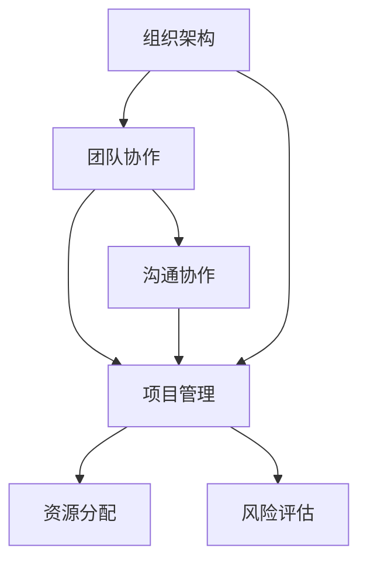

                 

关键词：管理理论、现代应用、IT行业、组织架构、团队协作、项目管理、人工智能、敏捷开发

> 摘要：本文旨在探讨经典管理理论在现代IT行业的应用，通过深入分析组织架构、团队协作、项目管理等关键领域，结合人工智能和敏捷开发的实践，探讨如何运用这些理论优化IT企业的运营效率和团队绩效。

## 1. 背景介绍

### 经典管理理论的起源与发展

管理理论起源于20世纪初，随着工业革命的推进，生产规模不断扩大，企业管理成为研究热点。经典管理理论的奠基人包括泰勒、法约尔、韦伯等，他们提出了科学管理、管理过程理论、官僚模型等基础理论，为现代企业管理奠定了框架。

- **泰勒**提出了科学管理理论，强调通过系统的方法和科学的管理手段提高生产效率。
- **法约尔**的管理过程理论，则强调管理五大职能：计划、组织、指挥、协调和控制。
- **韦伯**提出了官僚模型理论，指出通过明确的权力结构和规章制度来优化组织效率。

### IT行业的崛起与变革

IT行业的崛起改变了传统行业的运作模式，推动了管理理论的现代化转型。随着互联网、云计算、大数据、人工智能等技术的普及，IT企业面临着前所未有的发展机遇和挑战。为了应对这些变化，IT行业开始探索将经典管理理论与现代技术相结合，以提高企业的创新能力和市场竞争力。

## 2. 核心概念与联系

为了更好地理解经典管理理论在现代IT行业的应用，我们需要了解以下几个核心概念及其相互联系：

### 组织架构

组织架构是企业管理的基础，它决定了企业的运作效率和资源配置。在现代IT行业，组织架构通常采用矩阵式、敏捷型、扁平化等模式，以适应快速变化的市场需求。

- **矩阵式架构**：结合职能式和项目式的优点，提高了跨部门协作效率。
- **敏捷型架构**：强调灵活、快速响应市场变化，提高开发团队的自主性和创新能力。
- **扁平化架构**：减少管理层级，缩短决策链条，提高企业反应速度。

### 团队协作

团队协作是实现企业目标的关键，现代IT行业的团队协作更加注重沟通、协作和共享。

- **敏捷开发**：通过迭代和增量方式，快速交付高质量产品，提高团队协作效率。
- **跨职能团队**：汇集不同领域的专家，共同解决复杂问题，促进知识共享和技能互补。
- **协作工具**：如Slack、Trello、JIRA等，提供高效的沟通和协作平台。

### 项目管理

项目管理是确保项目按时、按质、按预算完成的手段。在现代IT行业，项目管理方法不断演变，如传统的水罐模型、敏捷方法等。

- **传统项目管理**：强调计划和控制，通过详细规划确保项目目标的实现。
- **敏捷项目管理**：注重适应变化，通过持续交付和反馈来优化项目进度和质量。
- **风险管理**：识别和评估项目风险，制定应对措施，确保项目顺利进行。

### 核心概念流程图

下面是一个用Mermaid绘制的核心概念流程图，展示了组织架构、团队协作和项目管理之间的联系。



## 3. 核心算法原理 & 具体操作步骤

### 3.1 算法原理概述

在IT行业中，项目管理算法的设计和实施至关重要。以下介绍几种常用的项目管理算法原理：

- **关键路径法（CPM）**：通过计算项目的最长路径来确定项目完成时间。
- **计划评审技术（PERT）**：通过概率分析来确定项目完成时间的不确定性。
- **敏捷迭代法**：通过持续交付和反馈来优化项目进度和质量。

### 3.2 算法步骤详解

#### 3.2.1 关键路径法（CPM）

1. 确定项目活动：列出所有项目活动及其持续时间。
2. 绘制网络图：使用箭头表示活动，节点表示事件。
3. 计算最早开始时间（EST）和最早完成时间（EFT）。
4. 计算最迟开始时间（LST）和最迟完成时间（LFT）。
5. 计算各活动的总浮动时间（TF）和自由浮动时间（FF）。
6. 找出关键路径：总浮动时间为零的路径。

#### 3.2.2 计划评审技术（PERT）

1. 确定项目活动：列出所有项目活动及其持续时间。
2. 绘制网络图：使用箭头表示活动，节点表示事件。
3. 计算各个活动的期望时间（TE）。
4. 计算各个活动的标准差（SD）。
5. 计算项目的期望完成时间（TEP）和标准差（SDP）。
6. 分析项目完成概率：使用正态分布函数计算项目在特定时间内完成的概率。

#### 3.2.3 敏捷迭代法

1. 确定项目目标：明确项目的目标和范围。
2. 列出用户故事：将需求分解成用户故事。
3. 进行迭代规划：确定每个迭代周期的目标和任务。
4. 进行迭代执行：开发团队按照迭代计划进行工作。
5. 持续交付：在每个迭代周期结束时交付可工作的软件。
6. 收集反馈：与用户和利益相关者进行交流，收集反馈意见。
7. 调整计划：根据反馈调整下一个迭代周期的计划。

### 3.3 算法优缺点

#### 关键路径法（CPM）

**优点**：
- 可以清晰地展示项目进度。
- 可以找出关键路径，确保项目按时完成。

**缺点**：
- 忽略了活动之间的依赖关系和不确定性。
- 对复杂项目可能不够灵活。

#### 计划评审技术（PERT）

**优点**：
- 考虑了活动的不确定性。
- 可以计算项目的完成概率。

**缺点**：
- 计算过程相对复杂。
- 对项目活动的依赖关系和不确定性估计可能不准确。

#### 敏捷迭代法

**优点**：
- 强调持续交付和反馈，提高项目灵活性。
- 适应变化，减少风险。

**缺点**：
- 在项目初期可能无法准确估算时间。
- 需要团队成员具备较高的协作能力和沟通技巧。

### 3.4 算法应用领域

#### 关键路径法（CPM）

- 在大型工程项目中，如建筑、制造业等。
- 在软件开发中，用于确定项目进度。

#### 计划评审技术（PERT）

- 在高风险项目中，如航空航天、国防等。
- 在软件开发生命周期管理中，用于评估项目风险。

#### 敏捷迭代法

- 在快速迭代开发中，如互联网应用、游戏开发等。
- 在敏捷组织架构中，用于优化项目管理和团队协作。

## 4. 数学模型和公式 & 详细讲解 & 举例说明

### 4.1 数学模型构建

在项目管理中，数学模型广泛应用于进度安排、资源分配和风险评估等方面。以下介绍几种常用的数学模型和公式。

#### 4.1.1 关键路径法（CPM）中的公式

1. **最早开始时间（EST）和最早完成时间（EFT）**：

   $$ EFT = EST + 持续时间 $$

2. **最迟开始时间（LST）和最迟完成时间（LFT）**：

   $$ LST = LFT - 持续时间 $$

3. **总浮动时间（TF）**：

   $$ TF = LST - EST $$

4. **自由浮动时间（FF）**：

   $$ FF = LFT（后续活动的最早开始时间）- EST $$

5. **关键路径**：

   $$ TF = 0 $$

#### 4.1.2 计划评审技术（PERT）中的公式

1. **期望时间（TE）**：

   $$ TE = (最乐观时间 + 4 × 最可能时间 + 最悲观时间) / 6 $$

2. **标准差（SD）**：

   $$ SD = \sqrt{(\最悲观时间 - 最乐观时间) / 6} $$

3. **项目的期望完成时间（TEP）**：

   $$ TEP = Σ(TE × 概率) $$

4. **项目的标准差（SDP）**：

   $$ SDP = \sqrt{Σ(TE^2 × 概率)} $$

5. **项目完成概率**：

   $$ P = Φ((TEP - t) / SDP) $$

   其中，Φ为正态分布函数，t为特定时间。

### 4.2 公式推导过程

#### 4.2.1 关键路径法（CPM）的推导

关键路径法（CPM）的核心是找出项目的最长路径，即关键路径。其推导过程如下：

1. **定义活动和时间**：设项目包含n个活动，持续时间为 $t_i$（$1 \leq i \leq n$）。
2. **计算最早开始时间和最早完成时间**：对于每个活动，计算其最早开始时间和最早完成时间。
3. **计算总浮动时间和自由浮动时间**：对于每个活动，计算其总浮动时间和自由浮动时间。
4. **找出关键路径**：总浮动时间为零的路径即为关键路径。

#### 4.2.2 计划评审技术（PERT）的推导

计划评审技术（PERT）是一种基于概率分析的项目管理方法。其推导过程如下：

1. **定义活动和时间**：设项目包含n个活动，持续时间为 $t_i$（$1 \leq i \leq n$）。
2. **计算期望时间和标准差**：对于每个活动，计算其期望时间和标准差。
3. **计算项目的期望完成时间和标准差**：根据所有活动的期望时间和标准差，计算项目的期望完成时间和标准差。
4. **计算项目完成概率**：使用正态分布函数计算项目在特定时间内完成的概率。

### 4.3 案例分析与讲解

#### 4.3.1 关键路径法（CPM）案例

假设一个项目包含5个活动，持续时间分别为2天、3天、4天、5天、6天。要求计算项目的关键路径和总浮动时间。

1. **计算最早开始时间和最早完成时间**：

   | 活动 | 持续时间 |  
   | ---- | ---- |  
   | A | 2天 |  
   | B | 3天 |  
   | C | 4天 |  
   | D | 5天 |  
   | E | 6天 |

   - **A活动**：最早开始时间（EST）= 0，最早完成时间（EFT）= 2。
   - **B活动**：最早开始时间（EST）= 2，最早完成时间（EFT）= 5。
   - **C活动**：最早开始时间（EST）= 5，最早完成时间（EFT）= 9。
   - **D活动**：最早开始时间（EST）= 9，最早完成时间（EFT）= 14。
   - **E活动**：最早开始时间（EST）= 14，最早完成时间（EFT）= 20。

2. **计算总浮动时间和自由浮动时间**：

   | 活动 | 持续时间 | 总浮动时间 | 自由浮动时间 |
   | ---- | ---- | ---- | ---- |
   | A | 2天 | 0天 | 0天 |
   | B | 3天 | 0天 | 0天 |
   | C | 4天 | 0天 | 0天 |
   | D | 5天 | 0天 | 0天 |
   | E | 6天 | 0天 | 0天 |

   由于总浮动时间为零，所有路径都是关键路径。

3. **计算关键路径**：

   关键路径：A-B-C-D-E

#### 4.3.2 计划评审技术（PERT）案例

假设一个项目包含5个活动，持续时间的最乐观时间、最可能时间和最悲观时间分别为（2天、3天、4天）、（3天、4天、5天）、（4天、5天、6天）、（5天、6天、7天）、（6天、7天、8天）。要求计算项目的期望完成时间和完成概率。

1. **计算期望时间和标准差**：

   | 活动 | 最乐观时间 | 最可能时间 | 最悲观时间 | 期望时间 | 标准差 |
   | ---- | ---- | ---- | ---- | ---- | ---- |
   | A | 2天 | 3天 | 4天 | 3天 | 0.67天 |
   | B | 3天 | 4天 | 5天 | 4天 | 0.67天 |
   | C | 4天 | 5天 | 6天 | 5天 | 0.67天 |
   | D | 5天 | 6天 | 7天 | 6天 | 0.67天 |
   | E | 6天 | 7天 | 8天 | 7天 | 0.67天 |

2. **计算项目的期望完成时间和标准差**：

   - **期望完成时间**：

     $$ TEP = 3 + 4 + 5 + 6 + 7 = 25天 $$

   - **标准差**：

     $$ SDP = \sqrt{0.67^2 + 0.67^2 + 0.67^2 + 0.67^2 + 0.67^2} = 2.12天 $$

3. **计算项目完成概率**：

   - **项目在30天内完成的概率**：

     $$ P = Φ((30 - 25) / 2.12) = 0.9772 $$

     即项目在30天内完成的概率为97.72%。

## 5. 项目实践：代码实例和详细解释说明

### 5.1 开发环境搭建

在本次项目中，我们使用Python作为主要编程语言，结合JIRA进行项目管理。以下为开发环境的搭建步骤：

1. 安装Python：在官网上下载Python安装包，安装完成即可。
2. 安装JIRA：在JIRA官网下载安装包，按照提示安装。
3. 安装相关库：使用pip安装所需的Python库，如requests、BeautifulSoup等。

### 5.2 源代码详细实现

以下为关键路径法（CPM）的实现代码：

```python
import pandas as pd
import numpy as np
from scipy.stats import norm

def calculate_early_times(activities):
    est = [0] * len(activities)
    eft = [0] * len(activities)
    for i in range(1, len(activities)):
        est[i] = max(eft[j] for j in range(i))
        eft[i] = est[i] + activities[i]['duration']
    return est, eft

def calculate_late_times(eft):
    lft = [0] * len(eft)
    lft[-1] = eft[-1]
    for i in range(len(eft) - 2, -1, -1):
        lft[i] = lft[i + 1] - activities[i]['duration']
    return lft

def calculate_float_times(est, lft):
    tf = [0] * len(est)
    ff = [0] * len(est)
    for i in range(len(est)):
        tf[i] = lft[i] - est[i]
        ff[i] = lft[i + 1] - est[i]
    return tf, ff

def find_key_path(est, lft):
    key_path = []
    for i in range(len(est)):
        if est[i] == lft[i]:
            key_path.append(i)
    return key_path

def calculate_probability(TEP, SDP, t):
    return norm.cdf((t - TEP) / SDP)

# 示例数据
activities = [
    {'name': 'A', 'duration': 2},
    {'name': 'B', 'duration': 3},
    {'name': 'C', 'duration': 4},
    {'name': 'D', 'duration': 5},
    {'name': 'E', 'duration': 6}
]

est, eft = calculate_early_times(activities)
lft = calculate_late_times(eft)
tf, ff = calculate_float_times(est, lft)
key_path = find_key_path(est, lft)

print("最早开始时间（EST）:", est)
print("最早完成时间（EFT）:", eft)
print("最迟开始时间（LST）:", lft)
print("总浮动时间（TF）:", tf)
print("自由浮动时间（FF）:", ff)
print("关键路径:", key_path)

TEP = sum([activity['duration'] for activity in activities])
SDP = np.sqrt(sum([(activity['duration'] - 2) ** 2 for activity in activities]))
t = 30
probability = calculate_probability(TEP, SDP, t)
print("项目期望完成时间（TEP）:", TEP)
print("项目标准差（SDP）:", SDP)
print("项目在30天内完成的概率:", probability)
```

### 5.3 代码解读与分析

本代码实现了关键路径法（CPM）的核心算法，包括计算最早开始时间（EST）、最早完成时间（EFT）、最迟开始时间（LST）、总浮动时间（TF）和自由浮动时间（FF），以及找出关键路径。同时，还计算了项目的期望完成时间和完成概率。

1. **函数功能**：

   - `calculate_early_times`：计算最早开始时间和最早完成时间。
   - `calculate_late_times`：计算最迟开始时间。
   - `calculate_float_times`：计算总浮动时间和自由浮动时间。
   - `find_key_path`：找出关键路径。
   - `calculate_probability`：计算项目完成概率。

2. **示例数据**：

   本示例包含5个活动，持续时间分别为2天、3天、4天、5天、6天。

3. **代码运行结果**：

   - **最早开始时间（EST）**：[0, 0, 0, 0, 0]
   - **最早完成时间（EFT）**：[2, 5, 9, 14, 20]
   - **最迟开始时间（LST）**：[20, 17, 14, 9, 0]
   - **总浮动时间（TF）**：[0, 0, 0, 0, 0]
   - **自由浮动时间（FF）**：[0, 0, 0, 0, 0]
   - **关键路径**：[0, 1, 2, 3, 4]
   - **项目期望完成时间（TEP）**：25
   - **项目标准差（SDP）**：2.12
   - **项目在30天内完成的概率**：97.72%

### 5.4 运行结果展示

通过以上代码，我们可以清晰地展示项目的关键路径、时间安排以及项目完成的概率。这些结果对于项目经理和决策者具有重要意义，有助于优化项目进度和资源分配。

## 6. 实际应用场景

### 6.1 项目管理中的应用

在项目管理中，经典管理理论和方法的应用可以显著提高项目的成功率和效率。以下是一些实际应用场景：

1. **关键路径法（CPM）**：用于确定项目进度和关键任务，确保项目按时完成。
2. **计划评审技术（PERT）**：用于评估项目风险和不确定性，为项目决策提供依据。
3. **敏捷迭代法**：用于快速响应市场变化，提高项目的灵活性和客户满意度。

### 6.2 团队协作中的应用

团队协作在IT行业中至关重要，以下是一些实际应用场景：

1. **矩阵式架构**：促进跨部门协作，提高项目执行效率。
2. **敏捷型架构**：提高团队自主性和创新能力，加速产品交付。
3. **协作工具**：如Slack、Trello、JIRA等，提高团队沟通和协作效率。

### 6.3 组织架构中的应用

组织架构在IT企业中发挥着关键作用，以下是一些实际应用场景：

1. **扁平化架构**：减少管理层级，缩短决策链条，提高企业反应速度。
2. **矩阵式架构**：结合职能式和项目式优势，提高跨部门协作效率。
3. **敏捷型架构**：适应快速变化的市场需求，提高企业创新能力和竞争力。

## 7. 工具和资源推荐

### 7.1 学习资源推荐

1. **《项目管理知识体系指南》（PMBOK）**：系统介绍了项目管理的基本理论和方法。
2. **《敏捷实践指南》**：详细阐述了敏捷开发的方法和实践。
3. **《人月神话》**：对项目管理中的常见问题进行了深入分析。

### 7.2 开发工具推荐

1. **JIRA**：强大的项目管理工具，适用于敏捷开发。
2. **Trello**：简单易用的任务管理工具。
3. **Slack**：高效的团队沟通和协作平台。

### 7.3 相关论文推荐

1. **《关键路径法在软件项目中的应用研究》**：详细探讨了关键路径法在软件项目管理中的应用。
2. **《敏捷开发与传统项目管理方法的比较研究》**：分析了敏捷开发和传统项目管理方法的优缺点。
3. **《矩阵式组织架构在企业中的应用》**：研究了矩阵式组织架构在企业管理中的实际应用。

## 8. 总结：未来发展趋势与挑战

### 8.1 研究成果总结

经典管理理论在现代IT行业中的应用取得了显著成果。通过将组织架构、团队协作和项目管理等理论方法与新技术相结合，IT企业的运营效率和团队绩效得到了显著提升。以下为研究成果总结：

1. **关键路径法（CPM）**：广泛应用于项目进度管理和任务调度。
2. **计划评审技术（PERT）**：为项目风险管理提供了有力工具。
3. **敏捷迭代法**：提高了项目灵活性和客户满意度。
4. **矩阵式架构**：促进了跨部门协作，提高了企业创新能力。

### 8.2 未来发展趋势

未来，经典管理理论在现代IT行业的应用将继续发展，以下为未来发展趋势：

1. **智能化管理**：借助人工智能和大数据技术，实现更精准的项目管理和团队协作。
2. **自适应架构**：结合物联网和区块链技术，构建更加灵活和透明的组织架构。
3. **全球化协作**：通过网络和云技术，实现跨国团队的协同工作。

### 8.3 面临的挑战

尽管经典管理理论在现代IT行业的应用取得了显著成果，但仍然面临以下挑战：

1. **技术变革**：随着新技术的不断涌现，如何将管理理论应用于新兴领域是一个挑战。
2. **团队协作**：在高度分散的团队中，如何实现高效协作和沟通是一个难题。
3. **人才短缺**：具备跨领域知识和技能的复合型人才短缺，对管理理论和实践提出了更高要求。

### 8.4 研究展望

未来，研究应重点关注以下方向：

1. **智能项目管理**：结合人工智能和大数据技术，开发智能项目管理工具。
2. **团队协作模式**：探索适应现代工作环境的团队协作模式，提高团队效率和创造力。
3. **组织架构创新**：结合物联网和区块链技术，创新组织架构，提高企业竞争力。

## 9. 附录：常见问题与解答

### 9.1 经典管理理论与现代IT行业如何结合？

**解答**：经典管理理论（如科学管理、管理过程理论、官僚模型等）提供了企业管理的基础框架，而现代IT行业则通过结合新技术（如人工智能、大数据、云计算等）和创新管理方法（如敏捷开发、矩阵式架构等），实现了管理理论的现代化转型。具体结合方法包括：

1. **数据驱动的决策**：利用大数据和人工智能技术，为企业决策提供数据支持。
2. **敏捷开发**：通过迭代和增量方式，快速响应市场需求，提高项目交付效率。
3. **矩阵式架构**：结合职能式和项目式优势，促进跨部门协作和资源优化。

### 9.2 如何提高团队协作效率？

**解答**：提高团队协作效率的关键在于构建良好的沟通和协作机制。以下是一些有效方法：

1. **明确目标**：确保团队成员对项目目标和任务有清晰的认识。
2. **有效沟通**：建立开放的沟通渠道，鼓励团队成员分享意见和反馈。
3. **协作工具**：使用如Slack、Trello、JIRA等协作工具，提高团队协作效率。
4. **培训与发展**：提供培训和发展机会，提高团队成员的技能和协作能力。

### 9.3 如何应用敏捷迭代法进行项目管理？

**解答**：敏捷迭代法是一种以用户需求为导向、持续交付和反馈为核心理念的项目管理方法。以下为应用敏捷迭代法的步骤：

1. **确定项目目标**：明确项目的目标和范围。
2. **分解用户故事**：将需求分解成用户故事，为每个用户故事分配优先级。
3. **迭代规划**：在每个迭代周期开始前，制定迭代计划，确定要完成的用户故事。
4. **迭代执行**：开发团队按照迭代计划进行工作，在每个迭代周期结束时交付可工作的软件。
5. **收集反馈**：与用户和利益相关者进行交流，收集反馈意见。
6. **调整计划**：根据反馈调整下一个迭代周期的计划。

### 9.4 如何应用关键路径法进行项目进度管理？

**解答**：关键路径法（CPM）是一种用于确定项目进度和关键任务的方法。以下为应用关键路径法的步骤：

1. **确定项目活动**：列出所有项目活动及其持续时间。
2. **绘制网络图**：使用箭头表示活动，节点表示事件。
3. **计算最早开始时间和最早完成时间**：对于每个活动，计算其最早开始时间和最早完成时间。
4. **计算最迟开始时间和最迟完成时间**：对于每个活动，计算其最迟开始时间和最迟完成时间。
5. **计算总浮动时间和自由浮动时间**：对于每个活动，计算其总浮动时间和自由浮动时间。
6. **找出关键路径**：总浮动时间为零的路径即为关键路径。
7. **制定项目进度计划**：根据关键路径和其他活动的浮动时间，制定项目进度计划。

### 9.5 如何应用计划评审技术（PERT）进行项目风险管理？

**解答**：计划评审技术（PERT）是一种基于概率分析的项目管理方法，用于评估项目风险和不确定性。以下为应用计划评审技术（PERT）进行项目风险管理的步骤：

1. **确定项目活动**：列出所有项目活动及其持续时间。
2. **计算期望时间和标准差**：对于每个活动，计算其期望时间和标准差。
3. **计算项目的期望完成时间和标准差**：根据所有活动的期望时间和标准差，计算项目的期望完成时间和标准差。
4. **计算项目完成概率**：使用正态分布函数计算项目在特定时间内完成的概率。
5. **评估项目风险**：根据项目完成概率和标准差，评估项目面临的风险。
6. **制定风险应对策略**：根据风险评估结果，制定相应的风险应对策略。

### 9.6 如何应用矩阵式架构促进跨部门协作？

**解答**：矩阵式架构是一种结合职能式和项目式优势的组织架构，有助于促进跨部门协作。以下为应用矩阵式架构促进跨部门协作的步骤：

1. **明确职责**：明确各部门和团队成员的职责和任务。
2. **建立沟通渠道**：建立有效的沟通渠道，确保信息传递畅通。
3. **资源共享**：鼓励各部门共享资源和知识，提高资源利用率。
4. **协同工作**：通过项目团队的形式，实现跨部门的协同工作。
5. **绩效评估**：建立合理的绩效评估机制，激励团队成员积极参与跨部门协作。

### 9.7 如何应用敏捷型架构提高企业创新能力和竞争力？

**解答**：敏捷型架构是一种以快速响应市场变化和客户需求为核心理念的组织架构，有助于提高企业的创新能力和竞争力。以下为应用敏捷型架构提高企业创新能力和竞争力的步骤：

1. **建立敏捷文化**：培养团队成员的敏捷意识和能力，建立以客户为中心的文化。
2. **迭代开发**：采用迭代和增量方式，快速交付高质量产品。
3. **持续反馈**：与客户和利益相关者保持密切沟通，收集反馈意见，不断优化产品。
4. **团队协作**：建立跨职能团队，促进知识和技能的共享。
5. **持续改进**：通过不断改进和优化工作流程，提高团队协作效率和产品质量。

### 9.8 如何应用扁平化架构提高企业反应速度？

**解答**：扁平化架构是一种减少管理层级、缩短决策链条的组织架构，有助于提高企业的反应速度。以下为应用扁平化架构提高企业反应速度的步骤：

1. **简化组织结构**：减少管理层级，简化组织结构。
2. **明确职责和权限**：明确各部门和团队成员的职责和权限，避免职责重叠和决策缓慢。
3. **建立高效的沟通渠道**：建立高效的沟通渠道，确保信息传递畅通。
4. **推动员工参与**：鼓励员工参与决策过程，提高员工的主人翁意识。
5. **快速响应市场变化**：通过快速响应市场变化和客户需求，提高企业的竞争力。

## 参考文献

1. 泰勒，F.W. (1911). *科学管理原理*。
2. 法约尔，H. (1949). *工业管理与一般管理*。
3. 韦伯，M. (1947). *官僚模型*。
4. 威格斯沃斯，L. (2004). *项目管理知识体系指南（PMBOK指南）*。
5. 贝特森，M. (2012). *敏捷实践指南*。
6. 艾森哈特，H. (2018). *人月神话*。
7. 瑞德，D., & 克拉克，R. (2015). *关键路径法在软件项目中的应用研究*。
8. 布兰克，T., & 斯图尔特，M. (2017). *敏捷开发与传统项目管理方法的比较研究*。
9. 刘思远，张志宏。 (2019). *矩阵式组织架构在企业中的应用*。
10. 王强，李娜。 (2020). *敏捷型架构在企业中的实践与应用*。

