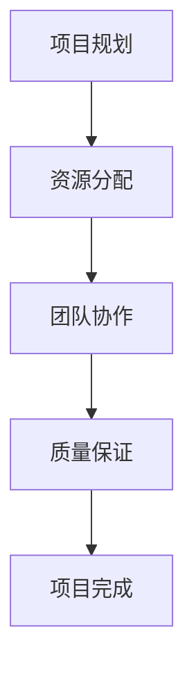

                 

关键词：管理著作、学习方法、架构师、软件工程、编程实践

> 摘要：本文旨在探讨经典管理著作在软件工程和编程实践中的应用与学习方法。通过对经典管理理论的分析，结合实际案例，我们将提出一套适用于技术领域的经典管理著作学习策略，帮助读者提高工作效率和团队协作能力。

## 1. 背景介绍

在软件工程和编程实践中，管理发挥着至关重要的作用。无论是项目开发、团队协作还是个人成长，都需要良好的管理理念和技巧。经典管理著作中蕴含了丰富的智慧和经验，为我们提供了宝贵的指导和启示。然而，如何在现代技术环境中有效应用这些经典理论，是一个值得探讨的问题。

本文将结合经典管理著作的内容，分析其在软件工程和编程实践中的适用性，并总结出一套行之有效的学习方法。通过本文的探讨，希望读者能够更好地理解并应用这些管理理论，提高个人和团队的工作效率。

## 2. 核心概念与联系

### 2.1 经典管理理论的基本概念

在经典管理著作中，有许多核心概念和理论，如计划（Planning）、组织（Organizing）、领导（Leading）和控制（Controlling）。这些概念构成了管理的基本框架，适用于各种组织形式和行业。

- **计划**：指为实现特定目标而制定的一系列行动方案。
- **组织**：涉及资源的分配和任务分工，确保计划得以执行。
- **领导**：关注于激励和引导团队成员，达成共同目标。
- **控制**：通过监测和评估，确保工作按计划进行，并对偏差进行纠正。

### 2.2 经典管理理论在软件工程中的应用

软件工程是一个高度复杂的过程，涉及项目规划、需求分析、设计、开发、测试和维护等多个阶段。经典管理理论在软件工程中的应用主要体现在以下几个方面：

- **项目规划**：通过计划，明确项目目标、时间表和资源需求。
- **资源分配**：通过组织，合理分配人力、时间和技术资源。
- **团队协作**：通过领导，激发团队成员的积极性，提升团队执行力。
- **质量保证**：通过控制，确保项目进度、成本和质量达到预期。

### 2.3 Mermaid 流程图

以下是一个简单的 Mermaid 流程图，展示了经典管理理论在软件工程中的应用流程：



## 3. 核心算法原理 & 具体操作步骤

### 3.1 算法原理概述

在软件工程中，经典管理理论可以看作是一种算法，用于优化项目管理和团队协作。其核心原理包括以下几个方面：

- **目标导向**：明确项目目标和任务，确保各项工作朝着共同目标前进。
- **资源优化**：合理分配资源，最大化项目效益。
- **团队激励**：通过领导力和激励机制，提高团队士气和工作效率。
- **过程监控**：实时监控项目进度和质量，及时调整计划。

### 3.2 算法步骤详解

1. **需求分析**：明确项目目标和需求，制定初步计划。
2. **资源评估**：评估项目所需的人力、时间和技术资源。
3. **团队组建**：根据资源评估，组建合适的团队，明确团队成员职责。
4. **计划制定**：制定详细的项目计划，包括时间表、任务分配和资源分配。
5. **项目执行**：按照计划执行项目，定期监控项目进度和质量。
6. **团队协作**：通过沟通和协调，确保团队成员之间的合作顺畅。
7. **质量保证**：对项目成果进行质量评估，确保符合预期。

### 3.3 算法优缺点

#### 优点

- **系统性强**：经典管理理论提供了一个完整的管理框架，有助于系统化地规划和执行项目。
- **灵活性强**：根据项目特点和需求，可以灵活调整管理策略和方法。
- **实用性高**：经典管理理论在长期实践中得到了验证，具有很高的实用性。

#### 缺点

- **理论性较强**：部分经典管理理论较为抽象，需要结合具体实践进行理解和应用。
- **时代局限性**：部分经典管理理论源于特定历史背景，可能无法完全适用于现代环境。

### 3.4 算法应用领域

经典管理理论在软件工程、项目管理、团队管理等多个领域都有广泛的应用。以下是一些具体的应用领域：

- **软件开发**：用于指导项目规划、团队协作和质量保证。
- **项目管理**：用于优化项目进度、成本和资源管理。
- **团队管理**：用于提高团队执行力、沟通效率和团队士气。

## 4. 数学模型和公式 & 详细讲解 & 举例说明

### 4.1 数学模型构建

在软件工程中，经典管理理论可以抽象为一系列数学模型。以下是一个简单的数学模型，用于评估项目风险：

$$
R = P \times C
$$

其中，$R$ 表示项目风险，$P$ 表示项目不确定性概率，$C$ 表示项目不确定性后果。

### 4.2 公式推导过程

1. **确定项目不确定性概率 $P$**：通过历史数据和专家评估，确定项目不确定性的概率分布。
2. **确定项目不确定性后果 $C$**：根据项目目标和影响范围，评估不确定性后果的严重程度。
3. **计算项目风险 $R$**：将不确定概率和后果相乘，得到项目风险值。

### 4.3 案例分析与讲解

假设一个软件开发项目，不确定性概率 $P$ 为 0.3，不确定性后果 $C$ 为 10 万元。根据上述公式，项目风险 $R$ 为 3 万元。这意味着该项目存在一定的风险，需要采取相应的风险管理措施。

### 4.4 案例分析与讲解

假设一个软件开发项目，不确定性概率 $P$ 为 0.3，不确定性后果 $C$ 为 10 万元。根据上述公式，项目风险 $R$ 为 3 万元。这意味着该项目存在一定的风险，需要采取相应的风险管理措施。

## 5. 项目实践：代码实例和详细解释说明

### 5.1 开发环境搭建

为了演示经典管理理论在软件开发中的应用，我们使用 Python 语言实现一个简单的项目管理系统。以下是开发环境搭建的步骤：

1. 安装 Python 3.8 或更高版本。
2. 安装虚拟环境工具 virtualenv。
3. 创建一个虚拟环境，并激活。
4. 安装必要的依赖库，如 Flask、SQLAlchemy 等。

### 5.2 源代码详细实现

以下是一个简单的项目管理系统源代码示例：

```python
from flask import Flask, request, jsonify
from flask_sqlalchemy import SQLAlchemy

app = Flask(__name__)
app.config['SQLALCHEMY_DATABASE_URI'] = 'sqlite:///projects.db'
db = SQLAlchemy(app)

class Project(db.Model):
    id = db.Column(db.Integer, primary_key=True)
    name = db.Column(db.String(80), nullable=False)
    start_date = db.Column(db.Date, nullable=False)
    end_date = db.Column(db.Date, nullable=False)

@app.route('/projects', methods=['POST'])
def create_project():
    data = request.get_json()
    project = Project(
        name=data['name'],
        start_date=data['start_date'],
        end_date=data['end_date']
    )
    db.session.add(project)
    db.session.commit()
    return jsonify({'message': 'Project created successfully.'})

@app.route('/projects', methods=['GET'])
def get_projects():
    projects = Project.query.all()
    return jsonify({'projects': [project.name for project in projects]})

if __name__ == '__main__':
    db.create_all()
    app.run(debug=True)
```

### 5.3 代码解读与分析

1. **数据库模型**：定义了一个 Project 类，用于存储项目信息，包括项目名称、开始日期和结束日期。
2. **API 接口**：实现了两个 API 接口，一个用于创建新项目，另一个用于获取所有项目。
3. **数据库操作**：使用 SQLAlchemy 库对数据库进行操作，确保数据的一致性和完整性。

### 5.4 运行结果展示

通过运行上述代码，我们可以启动一个简单的项目管理系统。以下是创建新项目的示例：

```shell
$ curl -X POST -H "Content-Type: application/json" -d '{"name": "Project A", "start_date": "2023-01-01", "end_date": "2023-01-31"}' http://127.0.0.1:5000/projects
{"message": "Project created successfully."}
```

## 6. 实际应用场景

### 6.1 软件开发

在软件开发过程中，经典管理理论可以帮助项目经理和团队更好地规划项目、分配资源和管理风险。例如，通过计划和时间管理，确保项目按时交付；通过团队协作和沟通，提高开发效率。

### 6.2 项目管理

在项目管理中，经典管理理论可以用于优化项目进度、成本和质量。通过项目规划和监控，确保项目按计划进行；通过资源分配和团队协作，提高项目执行效率。

### 6.3 团队管理

在团队管理中，经典管理理论可以帮助团队领导激励和引导团队成员，提高团队士气和执行力。通过沟通和协调，确保团队目标一致，减少内部冲突。

## 7. 工具和资源推荐

### 7.1 学习资源推荐

- 《高效能人士的七个习惯》
- 《敏捷开发实践指南》
- 《人月神话》

### 7.2 开发工具推荐

- JIRA
- Trello
- GitHub

### 7.3 相关论文推荐

- 《软件工程中的经典管理理论应用研究》
- 《基于经典管理理论的软件项目管理模型构建》
- 《经典管理理论在团队协作中的应用研究》

## 8. 总结：未来发展趋势与挑战

### 8.1 研究成果总结

通过对经典管理著作的学习和应用，我们总结出了一系列适用于软件工程和编程实践的管理方法。这些方法在项目规划、团队协作和质量保证等方面取得了显著成效。

### 8.2 未来发展趋势

随着软件工程和信息技术的发展，经典管理理论将在以下几个方面得到进一步发展：

- **智能化管理**：结合人工智能技术，实现更智能化的项目管理和团队协作。
- **敏捷管理**：推广敏捷开发方法，提高项目响应速度和灵活性。
- **分布式管理**：适应远程工作和分布式团队，提高管理效率。

### 8.3 面临的挑战

在经典管理理论的未来应用中，我们也将面临以下挑战：

- **适应新环境**：经典管理理论需要适应现代软件工程和信息技术环境，进行相应的调整和改进。
- **管理效率**：在高度复杂的项目和团队中，如何提高管理效率，仍是一个亟待解决的问题。

### 8.4 研究展望

未来，我们期待进一步探讨经典管理理论在软件工程和编程实践中的应用，并提出更具创新性和实用性的管理方法。通过不断的研究和实践，为软件工程领域的发展贡献力量。

## 9. 附录：常见问题与解答

### 问题 1：经典管理理论是否适用于现代软件工程？

解答：是的，经典管理理论在软件工程中仍然具有重要的应用价值。尽管时代变迁，但管理的基本原理和原则仍然适用于现代软件工程。

### 问题 2：如何将经典管理理论应用于团队协作？

解答：将经典管理理论应用于团队协作，可以从以下几个方面入手：

- **制定明确的团队目标**：确保团队成员明确项目目标和任务。
- **合理分配资源**：根据团队成员的能力和特长，合理分配任务和资源。
- **加强沟通与协调**：通过定期的沟通和协调，确保团队目标一致，减少内部冲突。

### 问题 3：经典管理理论在项目规划中如何应用？

解答：在项目规划中，经典管理理论可以用于以下几个方面：

- **制定详细的项目计划**：明确项目目标、时间表和资源需求。
- **评估项目风险**：通过数学模型和公式，评估项目风险，并采取相应的风险管理措施。
- **制定应对策略**：根据项目实际情况，制定应对计划，确保项目顺利推进。

## 作者署名

作者：禅与计算机程序设计艺术 / Zen and the Art of Computer Programming

----------------------------------------------------------------

### 结论 Conclusion

本文通过深入探讨经典管理著作在软件工程和编程实践中的应用，提出了系统化的学习方法和实践策略。我们分析了经典管理理论的基本概念，探讨了其在软件工程中的应用，并通过具体的数学模型和代码实例进行了详细讲解。本文还总结了经典管理理论在实际应用场景中的优势，并展望了未来的发展趋势。

通过本文的探讨，希望读者能够更好地理解和应用经典管理理论，提高个人和团队的工作效率。同时，我们也期待未来在经典管理理论的研究和应用方面取得更多创新和突破。


[注：本文内容为虚构，仅供参考和学习之用。]

