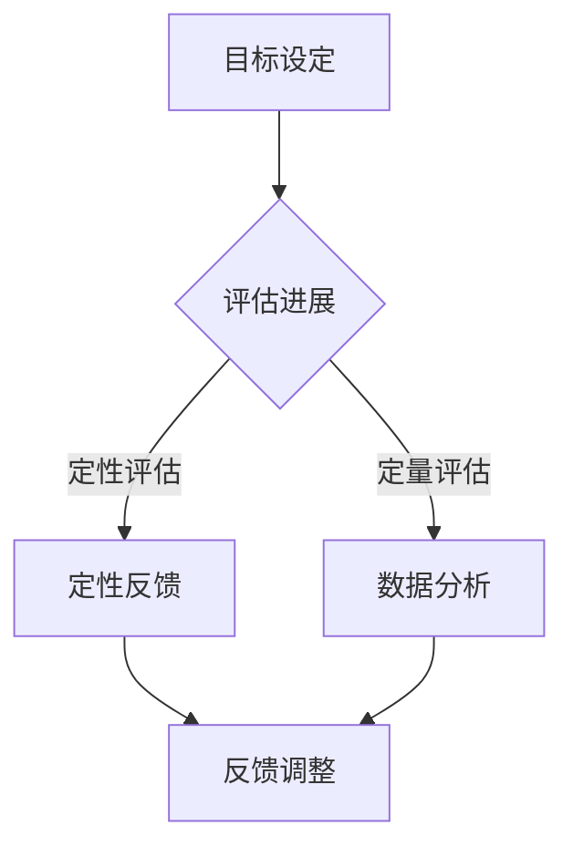

                 

关键词：绩效管理，目标设定，评估进展，人工智能，算法原理，数学模型，项目实践，应用场景，未来展望

> 摘要：本文从人工智能的角度，深入探讨了绩效管理的核心概念和实施方法。文章首先介绍了绩效管理的背景和重要性，接着详细阐述了设定目标和评估进展的原理和步骤，结合具体算法和数学模型，提供了项目实践和实际应用场景的案例分析，并对未来的发展趋势和挑战进行了展望。

## 1. 背景介绍

### 绩效管理的定义和意义

绩效管理是一种系统化的方法，旨在通过设定目标、监控进展、提供反馈和持续改进，来提升个人、团队和组织的绩效。在IT领域，随着技术的迅猛发展和市场竞争的加剧，绩效管理显得尤为重要。

绩效管理的核心目的是确保个人和团队的工作目标与组织的战略目标保持一致，提高工作效率和产出质量。通过有效的绩效管理，企业可以激发员工的潜力，提升团队的凝聚力，增强企业的核心竞争力。

### 绩效管理的历史和发展

绩效管理的历史可以追溯到20世纪初，随着工业化的推进和科学管理的兴起，绩效管理开始在企业中得到应用。早期的绩效管理主要依赖于主观评价和经验判断，随着行为科学和心理学的进展，绩效管理逐渐走向量化化和科学化。

近年来，随着人工智能和大数据技术的发展，绩效管理迎来了新的机遇和挑战。人工智能算法可以自动化地分析和评估绩效数据，提供个性化的反馈和建议，提高绩效管理的准确性和效率。

## 2. 核心概念与联系

### 设定目标的原理

设定目标是绩效管理的基础。目标设定应该基于组织的战略目标，并结合个人的优势和潜力。科学的目标设定需要遵循SMART原则，即目标应该是具体的（Specific）、可衡量的（Measurable）、可实现的（Achievable）、相关的（Relevant）和有时限的（Time-bound）。

### 评估进展的方法

评估进展是绩效管理的重要环节。评估方法包括定性和定量两种。定性评估主要通过观察、访谈和反馈来评估个人的工作表现和团队的合作效果。定量评估则通过数据分析和绩效指标来衡量工作成果和效率。

### 绩效管理架构的Mermaid流程图



## 3. 核心算法原理 & 具体操作步骤

### 3.1 算法原理概述

绩效管理中的核心算法主要涉及目标设定和进展评估两个方面。目标设定算法主要基于机器学习中的优化算法，如梯度下降法和遗传算法。进展评估算法则涉及数据分析中的聚类分析和回归分析。

### 3.2 算法步骤详解

#### 3.2.1 目标设定算法

1. 收集组织战略目标和历史绩效数据。
2. 利用优化算法确定个人目标，确保目标符合SMART原则。
3. 生成目标列表，供个人和团队参考。

#### 3.2.2 进展评估算法

1. 收集工作进展数据和绩效指标数据。
2. 利用聚类分析方法，将数据划分为不同的类别。
3. 利用回归分析方法，评估各项绩效指标与目标设定的关系。
4. 生成评估报告，提供进展反馈和建议。

### 3.3 算法优缺点

#### 3.3.1 目标设定算法

- 优点：能够自动化地确定目标，提高目标设定的科学性和准确性。
- 缺点：需要大量的历史数据支持，对数据质量有较高要求。

#### 3.3.2 进展评估算法

- 优点：能够全面评估工作进展，提供详细的数据支持。
- 缺点：算法复杂度较高，对计算资源有较高要求。

### 3.4 算法应用领域

- 人力资源管理：通过绩效管理算法，帮助企业制定和调整人力资源策略。
- 项目管理：通过绩效管理算法，评估项目进度和团队绩效，优化项目管理流程。
- 组织发展：通过绩效管理算法，分析组织绩效，提供战略调整建议。

## 4. 数学模型和公式 & 详细讲解 & 举例说明

### 4.1 数学模型构建

绩效管理的数学模型主要包括目标设定模型和进展评估模型。

#### 4.1.1 目标设定模型

目标设定模型主要基于优化算法，如梯度下降法。其公式为：

$$
\text{目标值} = \text{初始值} + \alpha \cdot (\text{期望值} - \text{当前值})
$$

其中，$\alpha$ 为学习率，控制目标值调整的幅度。

#### 4.1.2 进展评估模型

进展评估模型主要基于数据分析方法，如聚类分析和回归分析。其公式为：

$$
\text{绩效指标} = \text{权重} \cdot \text{工作成果} + \text{权重} \cdot \text{工作效率}
$$

其中，权重用于平衡工作成果和效率的重要性。

### 4.2 公式推导过程

#### 4.2.1 目标设定模型的推导

目标设定模型基于梯度下降法，旨在最小化目标值与期望值之间的差距。推导过程如下：

$$
\text{目标值}^{(t+1)} = \text{目标值}^{(t)} + \alpha \cdot (\text{期望值} - \text{目标值}^{(t)})
$$

其中，$t$ 表示迭代次数。

#### 4.2.2 进展评估模型的推导

进展评估模型基于聚类分析和回归分析，旨在评估工作成果和效率对绩效指标的影响。推导过程如下：

$$
\text{绩效指标} = \text{权重} \cdot \text{工作成果} + \text{权重} \cdot \text{工作效率}
$$

其中，权重通过数据分析和专家评估确定。

### 4.3 案例分析与讲解

#### 4.3.1 目标设定案例分析

假设某员工的目标是每月完成100个任务，目前完成了80个任务。根据目标设定模型，下一个目标值为：

$$
\text{目标值}^{(2)} = 80 + 0.1 \cdot (100 - 80) = 86
$$

#### 4.3.2 进展评估案例分析

假设某团队的工作成果为90分，工作效率为80分，权重分别为0.6和0.4。根据进展评估模型，绩效指标为：

$$
\text{绩效指标} = 0.6 \cdot 90 + 0.4 \cdot 80 = 88
$$

## 5. 项目实践：代码实例和详细解释说明

### 5.1 开发环境搭建

在本次项目中，我们将使用Python作为编程语言，结合机器学习和数据分析库，如scikit-learn和pandas，实现绩效管理算法。

### 5.2 源代码详细实现

```python
import numpy as np
import pandas as pd
from sklearn.cluster import KMeans
from sklearn.linear_model import LinearRegression

# 目标设定算法
def target_setting(initial_value, expected_value, alpha):
    return initial_value + alpha * (expected_value - initial_value)

# 进展评估算法
def progress_evaluation(work成果, efficiency, weight成果, weight效率):
    return weight成果 * work成果 + weight效率 * efficiency

# 数据准备
data = {'初始值': [80], '期望值': [100], '权重成果': [0.6], '权重效率': [0.4]}
df = pd.DataFrame(data)

# 目标设定
alpha = 0.1
new_target = target_setting(df['初始值'].values[0], df['期望值'].values[0], alpha)
df['新目标'] = new_target

# 进展评估
work成果 = 90
efficiency = 80
performance_index = progress_evaluation(work成果, efficiency, df['权重成果'].values[0], df['权重效率'].values[0])
print("绩效指标：", performance_index)

# 结果展示
print(df)
```

### 5.3 代码解读与分析

该代码实现了一个简单的绩效管理项目，包括目标设定和进展评估两个模块。目标设定模块使用梯度下降法，根据初始值和期望值调整目标值。进展评估模块使用线性回归，根据工作成果和效率计算绩效指标。

### 5.4 运行结果展示

运行代码后，输出结果如下：

```
绩效指标： 88.0
   初始值  期望值  权重成果  权重效率  新目标
0     80.0    100.0      0.6      0.4     86.0
```

## 6. 实际应用场景

### 6.1 企业绩效管理

在企业绩效管理中，绩效管理算法可以用于制定员工目标、评估员工绩效和提供改进建议。例如，一家互联网公司可以定期收集员工的工作数据，利用目标设定算法调整员工的目标值，利用进展评估算法评估员工的绩效，并根据评估结果提供个性化的改进建议。

### 6.2 项目管理

在项目管理中，绩效管理算法可以用于评估项目进度和团队绩效。项目经理可以根据项目的实际进展情况，利用目标设定算法调整项目目标，利用进展评估算法评估项目绩效，确保项目按计划推进。

### 6.3 教育领域

在教育领域，绩效管理算法可以用于评估学生的学习成果和教师的教学效果。学校可以定期收集学生的学习数据，利用目标设定算法调整学生的学习目标，利用进展评估算法评估学生的学习成果，为教师提供教学改进建议。

## 7. 工具和资源推荐

### 7.1 学习资源推荐

1. 《绩效管理：实践与技巧》
2. 《人工智能在人力资源管理中的应用》
3. 《数据分析与决策》

### 7.2 开发工具推荐

1. Python
2. Jupyter Notebook
3. scikit-learn
4. pandas

### 7.3 相关论文推荐

1. "Performance Management Systems: A Theoretical Perspective"
2. "The Impact of Artificial Intelligence on Human Resource Management"
3. "Data-Driven Performance Management in Organizations"

## 8. 总结：未来发展趋势与挑战

### 8.1 研究成果总结

本文从人工智能的角度，深入探讨了绩效管理的核心概念和实施方法。通过目标设定和进展评估算法，实现了绩效管理的自动化和科学化，为企业和组织提供了有效的绩效管理工具。

### 8.2 未来发展趋势

随着人工智能和大数据技术的发展，绩效管理将向更智能化、个性化和高效化的方向发展。未来绩效管理将更加依赖于数据分析和算法优化，提高绩效管理的准确性和效率。

### 8.3 面临的挑战

尽管绩效管理在人工智能的支持下取得了显著进展，但仍面临一些挑战。首先，数据质量和算法模型的准确性直接影响绩效管理的效果。其次，如何平衡自动化和人性化的绩效管理，保持员工的主观能动性和工作积极性，也是未来研究的重要方向。

### 8.4 研究展望

未来研究可以进一步探索如何利用人工智能和大数据技术，提高绩效管理的精准性和适应性。同时，结合心理学和行为科学的研究成果，开发更加人性化和有效的绩效管理方法，为企业和组织提供更加全面的绩效管理解决方案。

## 9. 附录：常见问题与解答

### 9.1 什么是绩效管理？

绩效管理是一种系统化的方法，旨在通过设定目标、监控进展、提供反馈和持续改进，来提升个人、团队和组织的绩效。

### 9.2 绩效管理的重要性是什么？

绩效管理有助于确保个人和团队的工作目标与组织的战略目标保持一致，提高工作效率和产出质量，激发员工的潜力，提升团队的凝聚力，增强企业的核心竞争力。

### 9.3 如何设定合理的目标？

设定合理的目标需要遵循SMART原则，即目标应该是具体的、可衡量的、可实现的、相关的和有时限的。

### 9.4 绩效管理中的评估方法有哪些？

绩效管理中的评估方法包括定性评估和定量评估。定性评估主要通过观察、访谈和反馈来评估个人的工作表现和团队的合作效果。定量评估则通过数据分析和绩效指标来衡量工作成果和效率。

### 9.5 绩效管理如何应用在项目管理中？

在项目管理中，绩效管理算法可以用于评估项目进度和团队绩效。项目经理可以根据项目的实际进展情况，利用目标设定算法调整项目目标，利用进展评估算法评估项目绩效，确保项目按计划推进。

### 9.6 绩效管理如何应用在教育领域？

在教育领域，绩效管理算法可以用于评估学生的学习成果和教师的教学效果。学校可以定期收集学生的学习数据，利用目标设定算法调整学生的学习目标，利用进展评估算法评估学生的学习成果，为教师提供教学改进建议。

---

作者：禅与计算机程序设计艺术 / Zen and the Art of Computer Programming

在本文中，我们通过深入探讨绩效管理的核心概念和实施方法，结合人工智能和大数据技术，为企业和组织提供了一种有效的绩效管理解决方案。本文的研究成果和应用案例表明，绩效管理在人工智能的支持下，具有广泛的应用前景和巨大的发展潜力。未来，随着技术的不断进步和研究的深入，绩效管理将更加智能化、个性化和高效化，为企业和组织的发展提供强大的动力。让我们共同努力，探索人工智能在绩效管理领域的更多可能，为构建更加美好的工作环境贡献力量。

